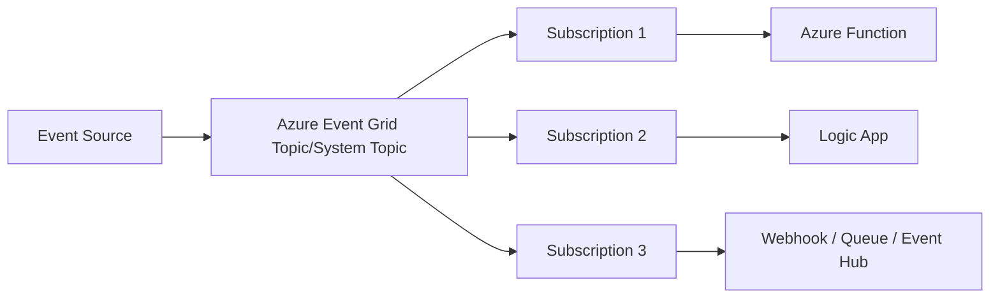
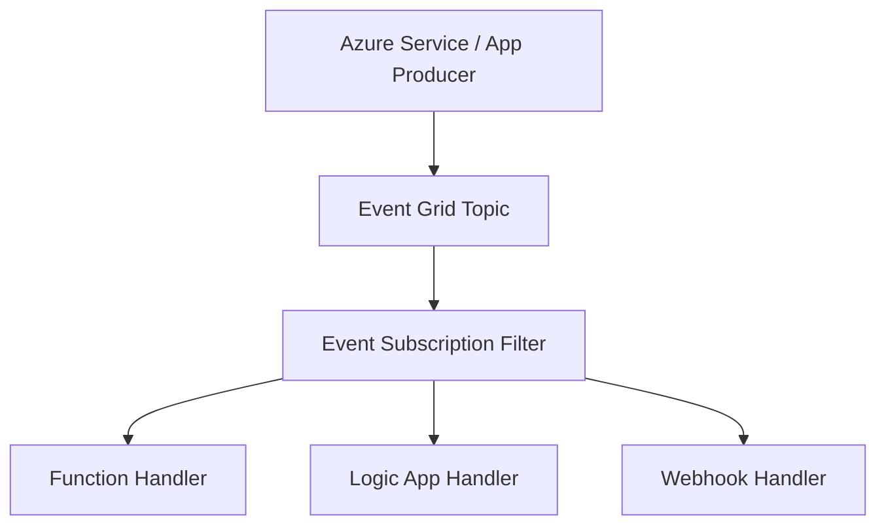
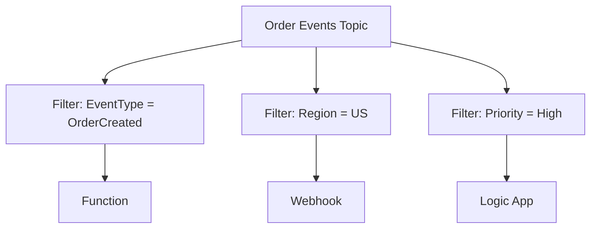
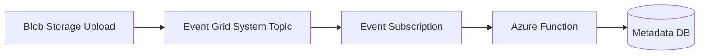
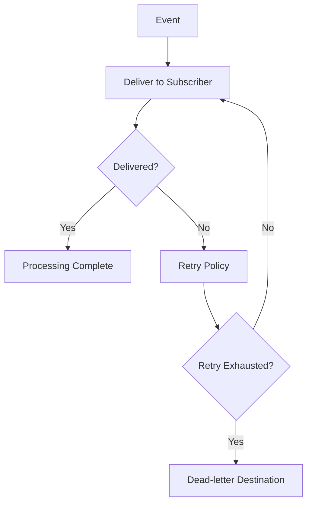
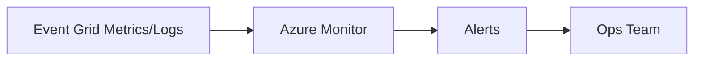
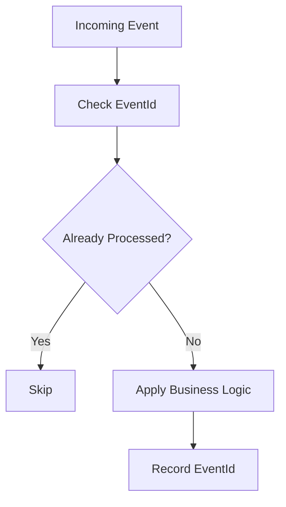

# What Is Azure Event Grid?
## Detailed Interview Preparation Guide with Flow Charts

---

## 1) Direct Interview Answer

**Azure Event Grid** is a fully managed event routing service that enables **event-driven architectures** by delivering events from event sources to event handlers/subscribers in near real time.

> One-liner: *Event Grid is Azure’s event distribution backbone for “something happened” notifications.*

---

## 2) What Problem Event Grid Solves

Modern systems generate events continuously:
- Blob created
- Resource updated
- Order placed
- User registered
- Deployment completed

Without an event router, producers must directly call every downstream consumer (tight coupling).

Event Grid solves this by:
- Decoupling publishers from subscribers
- Routing events to multiple handlers
- Filtering events by type/subject
- Supporting reactive, serverless workflows

---

## 3) Core Event Grid Flow

---

## 4) Event Grid Core Concepts

## 4.1 Event Source (Publisher)
Where events originate:
- Azure services (Storage, Resource Groups, etc.)
- Custom applications
- Partner/event-producing SaaS systems

## 4.2 Topic
Channel where events are published.
Common forms:
- **System Topic** (Azure service-generated events)
- **Custom Topic** (your application events)

## 4.3 Event Subscription
Routing rule that sends events from a topic to destination handlers.

## 4.4 Event Handler (Subscriber)
Destination that receives events:
- Azure Functions
- Logic Apps
- Webhooks
- Service Bus
- Event Hubs
- Storage Queue (via routing patterns)

---

## 5) High-Level Architecture Flow Chart

Event subscriptions can apply filters so only relevant events are delivered.

---

## 6) Event-Driven Mindset: Notification vs Command

Event Grid is best for **notifications**:
- “A blob was uploaded”
- “An order was created”

It is not primarily a command broker for strict business workflow commands (where queue/broker semantics may be better).

Interview phrase:
> Event Grid is optimized for event notifications and reactive integration, not complex enterprise command queuing semantics.

---

## 7) System Topics vs Custom Topics

| Topic Type | Used For |
|---|---|
| System Topic | Built-in Azure service events (e.g., storage/resource events) |
| Custom Topic | Application/domain events published by your services |
| Domain Topic (advanced organizational pattern) | Multi-tenant/event namespace patterns in larger solutions |

---

## 8) Event Subscription Filtering

You can filter by:
- Event type
- Subject prefix/suffix
- Advanced field-based filters

Benefits:
- Reduce unnecessary processing
- Route targeted events to specific handlers
- Improve scalability and cost efficiency

---

## 9) Typical End-to-End Scenario

### Blob upload automation
1. File uploaded to Blob Storage
2. Storage emits event
3. Event Grid routes to Function
4. Function processes file and stores metadata

---

## 10) Delivery and Reliability Model (Interview Depth)

Event Grid supports reliable event delivery with retry behavior and dead-letter options (configurable patterns).

If subscriber endpoint is temporarily unavailable:
- Event Grid retries delivery
- Can route failed events to dead-letter storage destination for later analysis/replay patterns

---

## 11) Event Grid vs Service Bus vs Event Hubs

| Service | Best For |
|---|---|
| Event Grid | Event notification/routing (reactive systems) |
| Service Bus | Enterprise command/workflow messaging |
| Event Hubs | High-throughput telemetry/event streaming |

Quick interview framing:
- Event Grid = “notify subscribers something happened”
- Service Bus = “reliable business work queue/topic semantics”
- Event Hubs = “massive stream ingestion”

---

## 12) Security in Event Grid

Best practices:
- Entra ID/RBAC where applicable
- Secure webhook endpoints
- Validation handshake for webhook subscriptions
- Network security controls on handlers
- Least privilege for publishers/subscribers
- Use managed identities in downstream handlers

---

## 13) Scalability Benefits

Event Grid enables:
- Loose coupling across many services
- Multiple subscribers per event
- Easy addition of new event consumers
- Serverless reactive scaling (with Functions/Logic Apps)
- Reduced direct integration complexity

---

## 14) Monitoring and Operations

Monitor:
- Publish success/failure
- Delivery attempts
- Subscriber response failures
- Dead-letter growth
- End-to-end event latency

Use:
- Azure Monitor
- Log Analytics
- Application Insights (for handlers)
- Alert rules for delivery failures

---

## 15) Real-World Use Cases

1. Storage upload triggers processing pipeline  
2. Resource lifecycle governance automation  
3. E-commerce event fan-out (order events)  
4. CI/CD event notifications  
5. Security incident forwarding  
6. Multi-system integration via webhook subscribers  
7. SaaS integration event handling  

---

## 16) Common Mistakes (Interview Gold)

1. Using Event Grid for heavy command queue workflows better suited to Service Bus  
2. No subscriber retry/dead-letter planning  
3. No event schema/versioning strategy  
4. Over-broadcasting without filters  
5. Ignoring idempotency in handlers  
6. Weak monitoring of failed deliveries  

---

## 17) Event Handler Idempotency (Important)

Even with managed delivery, handlers should be idempotent because retries can occur.

Pattern:
- Use event ID/business key
- Check already processed
- Apply effect once

---

## 18) Interview Q&A (Strong Answers)

### Q1: What is Azure Event Grid?
**Answer:** A managed event routing service for building event-driven applications by delivering events from publishers to subscribers.

### Q2: When should I use Event Grid?
**Answer:** When you need reactive event notifications, pub-sub routing, and loose coupling between event sources and handlers.

### Q3: Event Grid vs Service Bus?
**Answer:** Event Grid is for event notifications; Service Bus is for reliable enterprise message workflows/commands.

### Q4: Event Grid vs Event Hubs?
**Answer:** Event Grid routes discrete events; Event Hubs ingests high-volume event streams for analytics/stream processing.

### Q5: How does Event Grid route only relevant events?
**Answer:** Through event subscription filters (event type, subject, advanced filters).

### Q6: What if delivery fails?
**Answer:** Event Grid retries and can dead-letter undeliverable events to configured storage for later recovery workflows.

---

## 19) 60-Second Interview Pitch

> Azure Event Grid is Azure’s managed event routing service for event-driven architectures. It decouples event publishers and subscribers by routing events from sources—like Azure Storage or custom apps—to handlers such as Functions, Logic Apps, webhooks, or messaging endpoints. It supports filtering, fan-out, retry handling, and dead-letter patterns, making it ideal for reactive automation and integration scenarios. I use Event Grid when the requirement is “notify interested systems that something happened,” while using Service Bus for command/workflow messaging and Event Hubs for high-throughput streaming.

---

## 20) Final Checklist

- [ ] Need event notification architecture  
- [ ] Publisher/subscriber decoupling required  
- [ ] Multiple handlers need same event  
- [ ] Filtering rules needed  
- [ ] Retry/dead-letter strategy defined  
- [ ] Handlers idempotent  
- [ ] Monitoring and alerts configured  

---

## One-Line Conclusion

> Azure Event Grid is a scalable event-routing service for building loosely coupled, reactive systems where events are filtered and delivered to multiple subscribers in near real time.