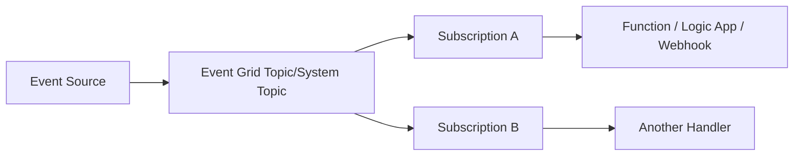
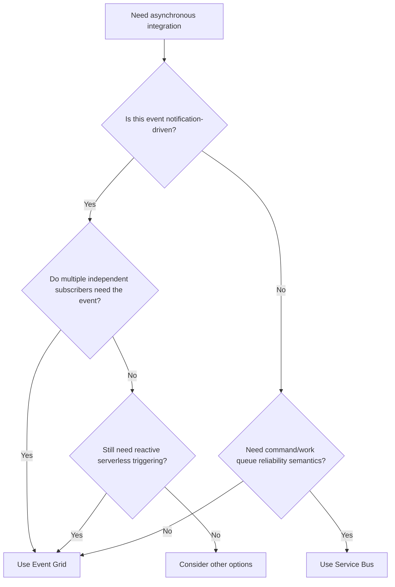
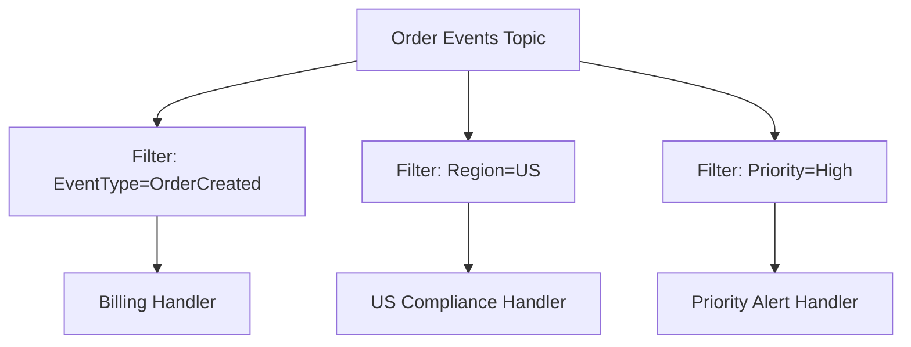
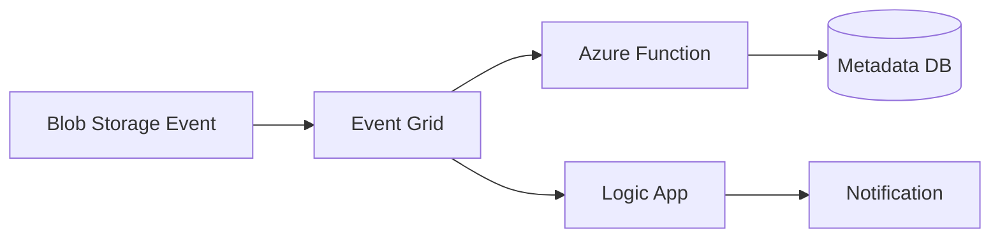
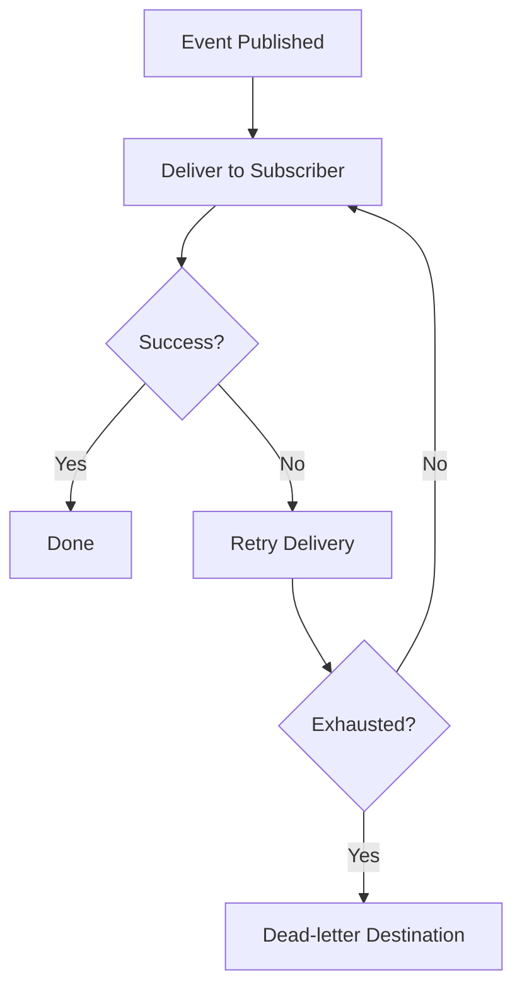
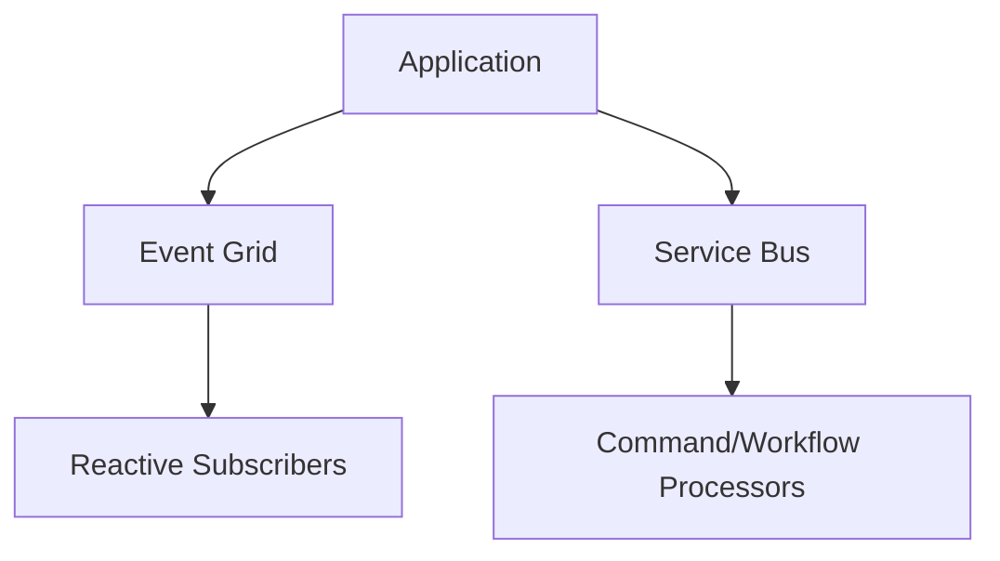
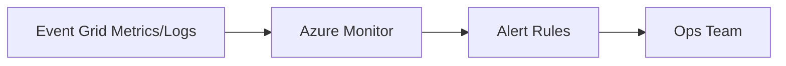

# When Should You Use Azure Event Grid?
## Detailed Interview Preparation Guide with Flow Charts

---

## 1) Direct Interview Answer

Use **Azure Event Grid** when you need **event-driven, pub-sub notification routing** where one event should trigger one or more reactive handlers in near real time.

> One-liner: *Use Event Grid when your architecture is “something happened, notify interested subscribers.”*

---

## 2) What Problem Event Grid Solves

Event Grid is best when:
- Producers should not call each consumer directly
- Multiple systems need the same event
- Handlers should be loosely coupled and independently deployable
- You need cloud-native reactive automation
- You want event filtering/routing with minimal glue code

---

## 3) Event Grid Core Flow

---

## 4) Decision Flow Chart: Should You Use Event Grid?

---

## 5) Clear Indicators You Should Use Event Grid

Use Event Grid when:

1. You need **publish-subscribe event fan-out**
2. Event means **state notification**, not command execution
3. Multiple handlers should react independently
4. You need event filtering by type/subject/properties
5. You want to trigger serverless handlers quickly
6. You want producer-consumer loose coupling
7. You need to integrate Azure resource events with automation

---

## 6) Typical Event Grid Use Cases

1. Blob upload triggers image/document processing  
2. Resource lifecycle events trigger governance automation  
3. App domain events trigger notifications and analytics  
4. CI/CD or deployment events trigger downstream workflows  
5. SaaS/webhook-style integrations  
6. Security/ops events routed to responders  

---

## 7) Event Notification vs Business Command (Interview Critical)

## Event Grid
- “OrderCreated happened”
- “BlobUploaded happened”

## Not ideal primary pattern for strict command queue workflow
- “ProcessPayment now”
- “ExecuteBillingTask now with queue semantics”

Interview phrase:
> Event Grid is optimized for event notification and reactive routing, while command/work processing often fits Service Bus better.

---

## 8) Event Grid with Filters (Powerful Routing)

Benefits:
- Subscribers receive only relevant events
- Lower cost/noise
- Better scalability

---

## 9) Event Grid in Serverless Architectures

Why good:
- Fast reactive flow
- Minimal integration boilerplate
- Easy fan-out

---

## 10) Reliability Considerations

Event Grid provides delivery retry behavior and supports dead-letter destination patterns for undeliverable events (configurable architecture).

Still required:
- Idempotent handlers
- Monitoring delivery failures
- Replay/recovery process if needed

---

## 11) When NOT to Use Event Grid (or Use with Another Service)

Avoid using Event Grid alone when you primarily need:
1. Rich queue command semantics
2. Explicit broker settlement control (complete/abandon/dead-letter by consumer logic style)
3. Ordered per-entity session processing
4. Long-lived enterprise workflow queue patterns

In those cases:
- Service Bus (or hybrid design) is often better

---

## 12) Event Grid vs Service Bus (Quick Interview Snapshot)

| Need | Better Fit |
|---|---|
| Event notification fan-out | Event Grid |
| Reliable command/work queue | Service Bus |
| Reactive cloud automation | Event Grid |
| Sessions/ordered command workflows | Service Bus |
| Lightweight pub-sub integration | Event Grid |
| Enterprise messaging workflow controls | Service Bus |

---

## 13) Common Hybrid Pattern (Practical Interview Answer)

Use both:
- Event Grid for notifications/fan-out
- Service Bus for critical workflow commands

---

## 14) Monitoring Event Grid Usage

Track:
- Publish success/failure
- Subscription delivery success/failure
- Retry counts
- Dead-letter destination growth
- Subscriber endpoint health

---

## 15) Common Mistakes (Interview Gold)

1. Using Event Grid for strict queue-command workflows  
2. No event filtering, causing noisy subscribers  
3. No idempotency in handlers  
4. No delivery failure monitoring  
5. Tight coupling in event contracts without version strategy  
6. Assuming Event Grid replaces all messaging services  

---

## 16) Interview Q&A (Strong Answers)

### Q1: When should you use Event Grid?
**Answer:** When you need event-driven pub-sub routing where multiple independent handlers react to notifications in near real time.

### Q2: What type of message fits Event Grid best?
**Answer:** Notification-style events indicating state change (“something happened”).

### Q3: Event Grid or Service Bus for payment command processing?
**Answer:** Usually Service Bus, because command workflows need stronger brokered processing semantics.

### Q4: Why use Event Grid with Functions?
**Answer:** It enables lightweight serverless reactive processing with minimal coupling and easy fan-out.

### Q5: Do you still need idempotency with Event Grid?
**Answer:** Yes. Distributed delivery/retry patterns mean handlers should be idempotent.

---

## 17) 60-Second Interview Pitch

> I use Azure Event Grid when I need event-driven architecture and pub-sub routing for notifications like resource changes, blob uploads, or domain events. Event Grid decouples publishers from subscribers, supports filtering, and enables fast integration with Functions, Logic Apps, and webhooks. It’s ideal for reactive automation and fan-out scenarios. For strict business command workflows requiring richer queue semantics, I use Service Bus, and in many enterprise systems I combine both services.

---

## 18) Final Checklist: “Should I Use Event Grid?”

- [ ] Is this primarily an event notification?  
- [ ] Do multiple independent subscribers need it?  
- [ ] Do I need loosely coupled reactive handlers?  
- [ ] Do I benefit from subscription filtering?  
- [ ] Am I integrating cloud-native/serverless reactions?  

If mostly **yes**, Event Grid is a strong choice.

---

## One-Line Conclusion

> Use Event Grid when your system needs scalable, loosely coupled event notification routing with pub-sub fan-out and reactive subscribers.