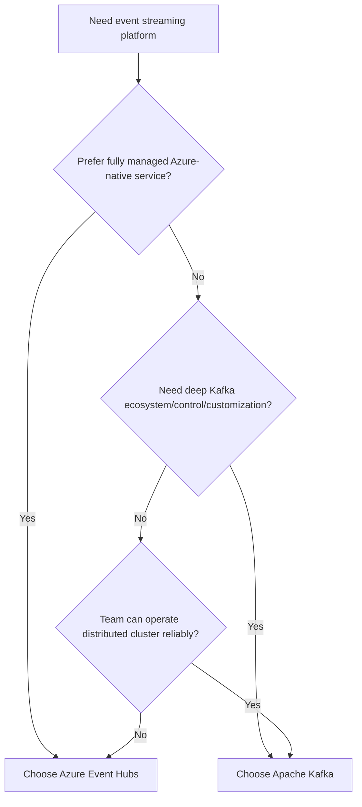
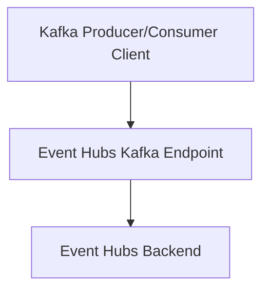
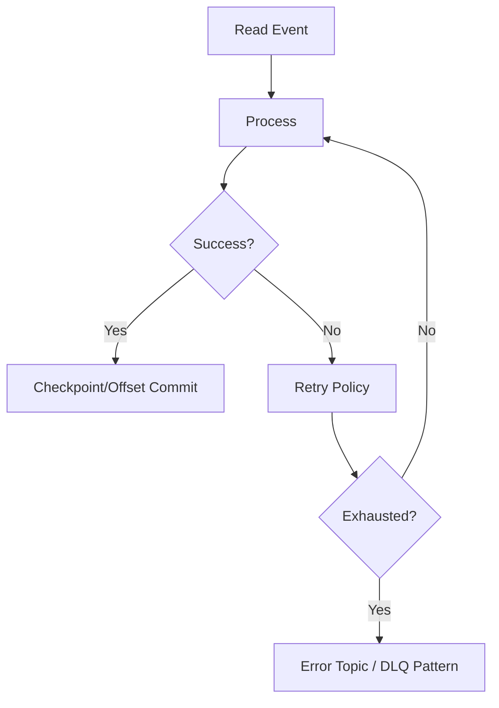
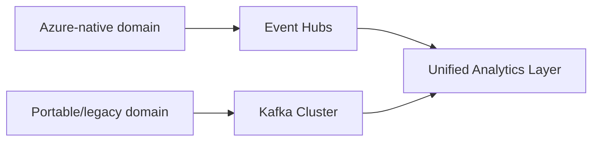

# Azure Event Hubs vs Apache Kafka
## Detailed Interview Preparation Guide with Flow Charts

---

## 1) Direct Interview Answer

**Azure Event Hubs** is a fully managed Azure event-streaming service.  
**Apache Kafka** is an open-source distributed event-streaming platform you run yourself (or consume via managed Kafka offerings).

> One-liner: *Event Hubs gives Kafka-like streaming as a managed Azure service; Kafka gives full ecosystem/control with higher operational ownership.*

---

## 2) Core Mindset Difference

- **Event Hubs**: “Managed service first”
  - Azure operates infrastructure
  - You focus on producers/consumers and stream logic

- **Kafka**: “Platform control first”
  - You control broker configs, cluster behavior, ecosystem components
  - More flexibility, more ops responsibility

---

## 3) High-Level Decision Flow Chart

---

## 4) What Is Azure Event Hubs?

Azure Event Hubs is a managed event ingestion/streaming platform for:
- Telemetry ingestion
- IoT streams
- Logs/clickstream pipelines
- Real-time analytics feeds

Key concepts:
- Namespace
- Event Hub
- Partitions
- Consumer groups
- Offsets/checkpoints
- Throughput/capacity units (SKU dependent)

---

## 5) What Is Apache Kafka?

Apache Kafka is an open-source distributed event-streaming platform built around:
- Brokers
- Topics
- Partitions
- Consumer groups
- Offsets
- Retention policies

Often paired with:
- Kafka Connect
- Kafka Streams
- Schema Registry
- MirrorMaker
- ksqlDB (ecosystem-dependent)

---

## 6) Architecture Comparison Flow

## 6.1 Event Hubs (Managed)

## 6.2 Kafka (Self-Managed Pattern)

---

## 7) Similarities (Important for Interviews)

Both support:
- High-throughput streaming ingestion
- Partitioned event logs
- Consumer groups
- Offset-based consumption
- Replay by offsets/retention window
- Horizontal scaling concepts
- At-least-once style processing patterns (consumer design dependent)

---

## 8) Key Differences Table

| Area | Azure Event Hubs | Apache Kafka |
|---|---|---|
| Service Model | Fully managed PaaS (Azure) | Open-source platform (self-managed or managed by vendor) |
| Operational Overhead | Low (Azure-managed infra) | Medium to high (if self-managed) |
| Infra Control | Limited/abstracted | Extensive broker-level control |
| Ecosystem Breadth | Azure-native integrations strong | Very broad OSS ecosystem |
| Protocol Compatibility | Supports Kafka protocol endpoint | Native Kafka protocol |
| Tuning Flexibility | Service-guardrailed | Deep low-level tuning possible |
| Upgrade/Patching | Managed by Azure | You manage (self-hosted) |
| Time to Production | Faster in Azure environments | Depends on team/platform maturity |
| Multi-cloud portability | Less portable if tightly Azure-coupled | High portability with Kafka-native tooling |
| Cost Visibility Model | Azure service pricing model | Infra + ops + tooling + support costs |

---

## 9) Kafka Protocol on Event Hubs

Event Hubs supports Kafka clients via Kafka-compatible endpoint, which helps migration/integration for many workloads.

Interview point:
> Event Hubs can reduce migration friction for teams using Kafka APIs while benefiting from managed Azure operations.

---

## 10) Operational Responsibility Comparison

## Event Hubs
Azure handles:
- Broker infrastructure
- Patching
- Availability operations
- Core service maintenance

You handle:
- Stream design
- Partition strategy
- Consumer scaling/checkpointing
- Observability

## Kafka (self-managed)
You handle all above plus:
- Cluster provisioning
- Broker sizing
- Partition rebalancing strategy
- Upgrades/security hardening
- ZooKeeper/KRaft-era operational concerns (depending on version/architecture)

---

## 11) Performance and Scale Perspective

Both can scale highly, but decision is often about operational model and ecosystem needs, not raw capability alone.

Interview-safe phrasing:
> Choose based on throughput requirements plus operational ownership, compliance constraints, platform skillset, and integration ecosystem.

---

## 12) Reliability Patterns in Both

Common reliability practices:
- Idempotent producers/consumers
- Retry with backoff
- Checkpoint/offset management
- Dead-letter/error routing patterns at app level
- Lag monitoring
- Backpressure-aware consumers

---

## 13) Security Comparison

## Event Hubs
- Azure-native identity and RBAC integration
- Managed service security controls
- Azure networking/security ecosystem alignment

## Kafka
- Security is powerful but depends on your deployment and operations:
  - TLS
  - SASL mechanisms
  - ACLs
  - Secret/cert lifecycle management
  - Network segmentation

---

## 14) Observability Comparison

## Event Hubs
- Azure Monitor ecosystem integration
- Namespace/hub metrics and alerts
- Consumer lag tracking via tooling patterns

## Kafka
- JMX/exporters + observability stack (Prometheus/Grafana/etc. commonly)
- Deep broker internals available if instrumented
- More setup responsibility (self-managed)

---

## 15) Event Hubs vs Kafka: Use-Case Guidance

Use **Event Hubs** when:
1. You are Azure-first
2. You want managed operations
3. You need fast implementation with minimal cluster admin burden
4. Kafka API compatibility is sufficient for workload

Use **Kafka** when:
1. You need deep broker customization/control
2. You rely heavily on Kafka ecosystem tooling/components
3. You require strong platform portability across environments
4. Your team is mature in operating distributed streaming infrastructure

---

## 16) Migration / Hybrid Pattern

Some organizations:
- Start on Event Hubs for fast managed adoption
- Or run Kafka for portability/custom control
- Or use both in different domains

---

## 17) Cost Consideration Framing (Interview)

Do not compare only service SKU price.

Include:
- Infra + storage + network
- SRE/operations engineering effort
- Incident/maintenance overhead
- Upgrade lifecycle cost
- Compliance/security operations
- Time-to-market impact

Interview line:
> Managed services can reduce total cost of ownership by lowering operational complexity, even if unit pricing appears different.

---

## 18) Common Mistakes in Decision-Making

1. Choosing Kafka for “flexibility” without ops maturity  
2. Choosing Event Hubs while needing Kafka features/configs not supported in managed constraints  
3. Ignoring observability and consumer lag design  
4. No partition key strategy  
5. Assuming migration is zero-effort just because protocol compatibility exists  
6. Comparing only latency benchmarks, not reliability/ops realities  

---

## 19) Interview Q&A (Strong Answers)

### Q1: Event Hubs vs Kafka in one sentence?
**Answer:** Event Hubs is Azure-managed streaming with lower operational burden; Kafka is open ecosystem streaming with deeper control and higher operational ownership.

### Q2: Is Event Hubs Kafka?
**Answer:** No. Event Hubs is a separate Azure service but supports Kafka protocol endpoints for compatible clients.

### Q3: Which is easier to operate?
**Answer:** Event Hubs, because Azure manages infrastructure and core service operations.

### Q4: Which gives more low-level control?
**Answer:** Kafka (especially self-managed deployments).

### Q5: Which should Azure-first teams choose?
**Answer:** Often Event Hubs, unless deep Kafka-specific ecosystem/control needs dominate.

### Q6: Can both support replay and consumer groups?
**Answer:** Yes, both are partitioned stream platforms with offset-based consumption.

---

## 20) 60-Second Interview Pitch

> Azure Event Hubs and Apache Kafka are both distributed streaming platforms with partitions, consumer groups, and offset-based replay. The main difference is operational model: Event Hubs is fully managed in Azure, so teams can move faster with less infrastructure ownership, while Kafka provides broader ecosystem flexibility and deeper broker-level control but requires stronger operational capability if self-managed. I choose based on cloud strategy, required control depth, portability needs, team SRE maturity, and integration ecosystem—not just on feature checklists.

---

## 21) Final Checklist

- [ ] Need managed Azure-native streaming with low ops? → Event Hubs  
- [ ] Need deep Kafka ecosystem and infra control? → Kafka  
- [ ] Team ready for distributed platform operations?  
- [ ] Portability/multi-environment requirement high?  
- [ ] Observability, security, and lag management plan defined?  
- [ ] Partition/consumer strategy designed?  

---

## One-Line Conclusion

> Choose Event Hubs for managed Azure streaming simplicity and Kafka for maximum ecosystem/control flexibility with greater operational responsibility.