# Azure Event Hubs vs Azure Service Bus
## Detailed Interview Preparation Guide with Flow Charts

---

## 1. Direct Interview Answer

**Azure Event Hubs** is a high-throughput event streaming and ingestion service used for telemetry, logs, IoT data, clickstreams, and real-time analytics.

**Azure Service Bus** is an enterprise message broker used for reliable business messages, commands, workflows, queues, topics, retries, dead-lettering, and transactional processing.

> **One-line interview answer:**  
> Use **Event Hubs** for large-scale event streams and telemetry. Use **Service Bus** for reliable business-message processing and enterprise workflows.

---

## 2. Core Difference

```text
Azure Event Hubs:
    "Here is a continuous stream of high-volume events."

Azure Service Bus:
    "Please process this business message reliably."
```

---

## 3. High-Level Decision Flow Chart

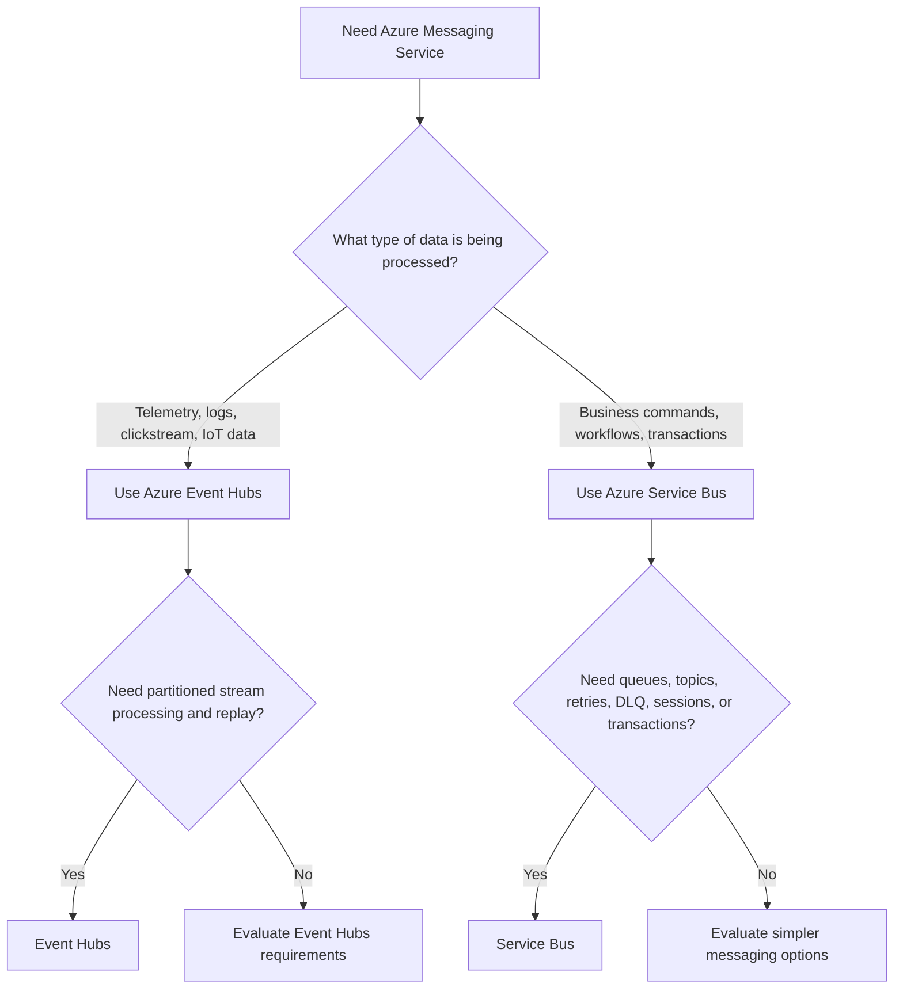

---

# 4. What Is Azure Event Hubs?

Azure Event Hubs is a fully managed platform for collecting and processing large volumes of streaming data.

It is designed for:

- Telemetry ingestion
- IoT data
- Application logs
- Security events
- Clickstream data
- Real-time analytics
- Data lake ingestion
- Stream processing pipelines

Event Hubs stores events in partitions. Consumers read events from partitions using offsets and checkpoints. Multiple consumer groups can independently read the same event stream. ([learn.microsoft.com](https://learn.microsoft.com/en-us/azure/event-hubs/event-hubs-about?utm_source=openai))

---

## 4.1 Event Hubs Architecture

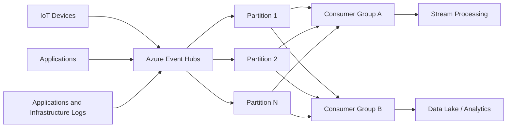

---

## 4.2 Event Hubs Processing Model

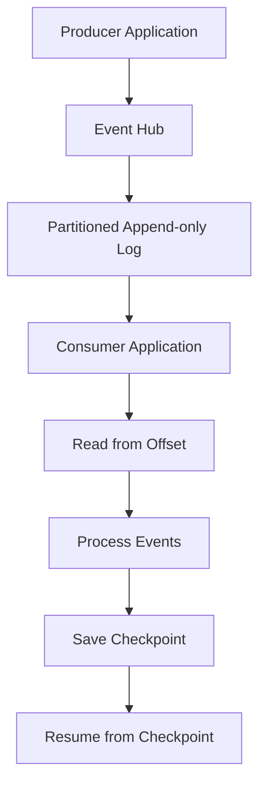

### Important Event Hubs Concepts

| Concept | Description |
|---|---|
| Namespace | Management container for Event Hubs |
| Event hub | Streaming entity that receives events |
| Partition | Ordered event sequence used for scale and parallelism |
| Consumer group | Independent view of the event stream |
| Offset | Position of an event within a partition |
| Checkpoint | Persisted offset used for recovery |
| Retention | Time period during which events remain available for reading |

Event ordering is guaranteed within a partition, not globally across all partitions. ([learn.microsoft.com](https://learn.microsoft.com/en-us/azure/event-hubs/event-hubs-about?utm_source=openai))

---

# 5. What Is Azure Service Bus?

Azure Service Bus is a fully managed enterprise message broker.

It provides:

- Queues
- Topics and subscriptions
- Reliable asynchronous messaging
- Peek-Lock processing
- Message settlement
- Retries
- Dead-letter queues
- Duplicate detection
- Scheduled delivery
- Deferred messages
- Sessions for ordered processing
- Transactions in supported scenarios

Service Bus is designed for business messages and workflows where the message usually represents a command, task, or important business operation. ([learn.microsoft.com](https://learn.microsoft.com/en-us/azure/service-bus-messaging/service-bus-queues-topics-subscriptions?WT.mc_id=AZ-MVP-5005172&utm_source=openai))

---

## 5.1 Service Bus Queue Architecture

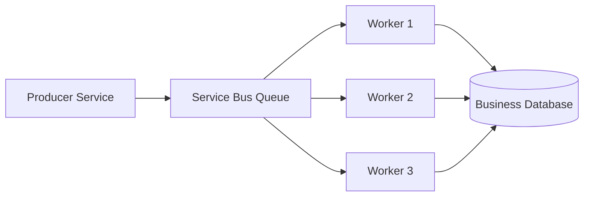

Multiple workers can compete for messages from the same queue. Each message is normally processed by one logical consumer.

---

## 5.2 Service Bus Topic Architecture

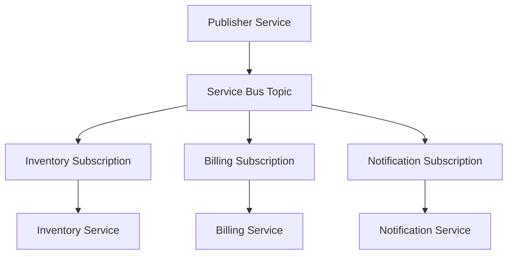

A topic is appropriate when multiple independent services need their own copy of a business event.

---

## 5.3 Service Bus Processing Model

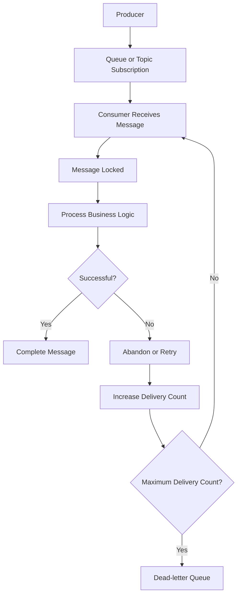

Service Bus uses message settlement operations such as complete, abandon, defer, and dead-letter. ([learn.microsoft.com](https://learn.microsoft.com/en-us/azure/service-bus-messaging/service-bus-messaging-overview?utm_source=openai))

---

# 6. Detailed Feature Comparison

| Feature | Azure Event Hubs | Azure Service Bus |
|---|---|---|
| Primary purpose | High-throughput event streaming | Enterprise message brokering |
| Data model | Partitioned event stream | Queue or topic messages |
| Typical data | Telemetry, logs, IoT, clickstream | Commands, tasks, workflows, business events |
| Consumer model | Offset and checkpoint based | Receive and settlement based |
| Scaling model | Partitions and consumer groups | Competing consumers and subscriptions |
| Ordering | Within a partition | Ordered processing with sessions |
| Replay | Read from earlier offsets within retention | Usually retry, defer, or replay through DLQ/workflow |
| Dead-letter queue | No native Service Bus-style DLQ | Built-in DLQ for queues and subscriptions |
| Duplicate detection | Application responsibility | Broker duplicate detection is available, but idempotency is still required |
| Transactions | Not the primary feature | Supported in applicable messaging scenarios |
| Message settlement | Consumer checkpoints offsets | Complete, abandon, defer, and dead-letter |
| Best for | Streaming pipelines | Reliable business workflows |
| Protocols | AMQP, HTTPS, Kafka-compatible endpoint | AMQP and HTTP |
| Common consumers | Stream Analytics, Databricks, Functions, data pipelines | Functions, workers, APIs, microservices |
| Example | Sensor telemetry stream | Process payment command |

The comparison is based on Microsoft’s Azure messaging guidance, which distinguishes Event Hubs as a streaming platform and Service Bus as enterprise transactional messaging. ([learn.microsoft.com](https://learn.microsoft.com/en-us/azure/event-grid/compare-messaging-services?trk=article-ssr-frontend-pulse_little-text-block&utm_source=openai))

---

# 7. Event Hubs Data Flow vs Service Bus Message Flow

## 7.1 Event Hubs Data Flow

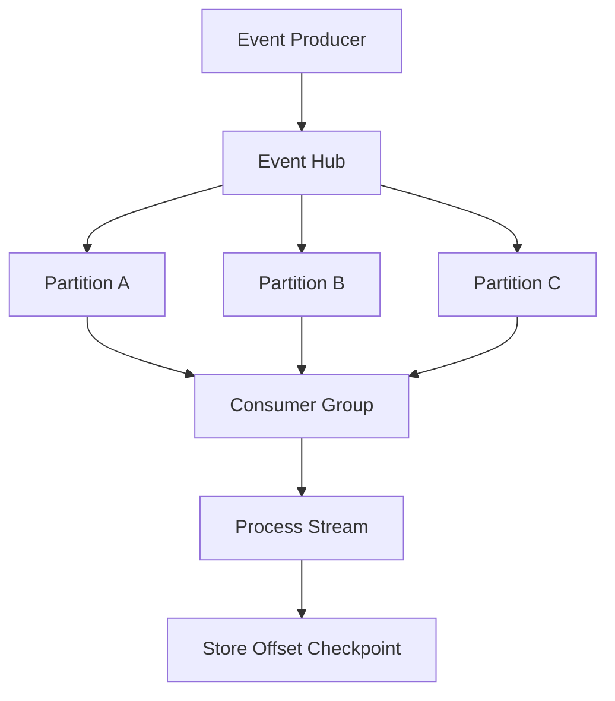

The consumer reads the stream from a position represented by an offset.

---

## 7.2 Service Bus Message Flow

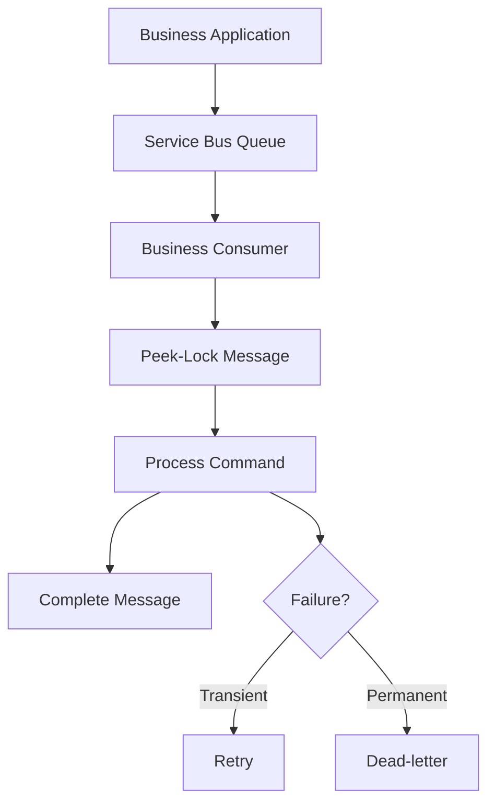

The consumer explicitly tells Service Bus whether the message succeeded or should be retried or dead-lettered.

---

# 8. Delivery and Reliability Comparison

## 8.1 Event Hubs Reliability

Event Hubs uses:

- Durable partitioned storage
- Consumer offsets
- Checkpointing
- Consumer groups
- Replay from a previous offset
- Idempotent processing in the consumer

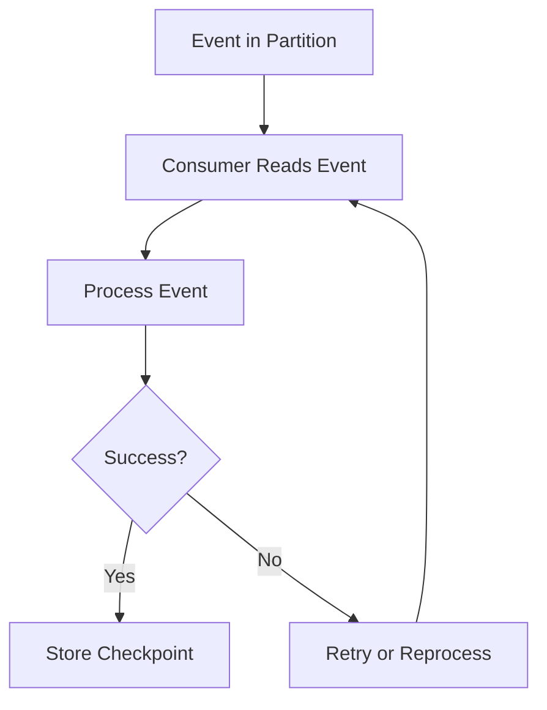

If the consumer crashes before checkpointing, it may reprocess events after the last checkpoint.

---

## 8.2 Service Bus Reliability

Service Bus uses:

- Durable queues/topics
- Peek-Lock
- Explicit settlement
- Delivery count
- Retry
- Dead-letter queues
- Idempotent consumers
- Sessions for ordered workflows

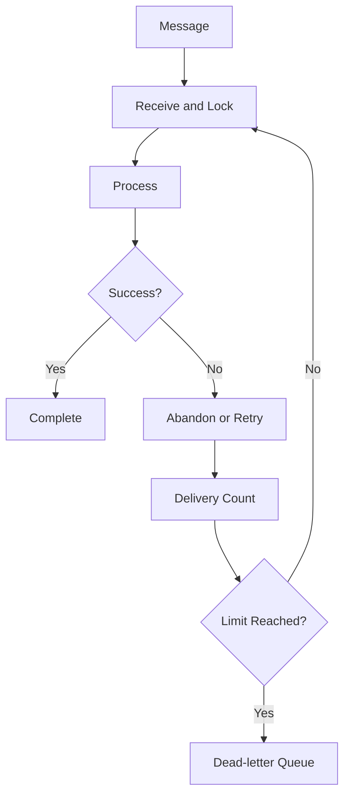

---

# 9. Scaling Comparison

## 9.1 Event Hubs Scaling

Event Hubs scales primarily through:

- Partitions
- Throughput capacity
- Consumer instances
- Consumer groups
- Partition-aware processing

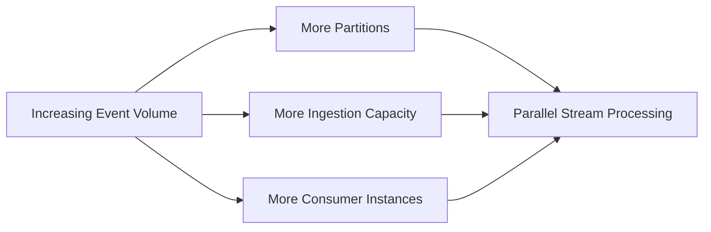

Each partition can be processed independently. Event processor clients can distribute partition ownership among consumer instances in the same consumer group. ([learn.microsoft.com](https://learn.microsoft.com/en-us/azure/event-hubs/event-processor-balance-partition-load?utm_source=openai))

---

## 9.2 Service Bus Scaling

Service Bus scales through:

- Multiple competing consumers
- Multiple topic subscriptions
- Consumer concurrency
- Messaging capacity
- Separate entities for workload isolation
- Sessions where ordered processing is needed

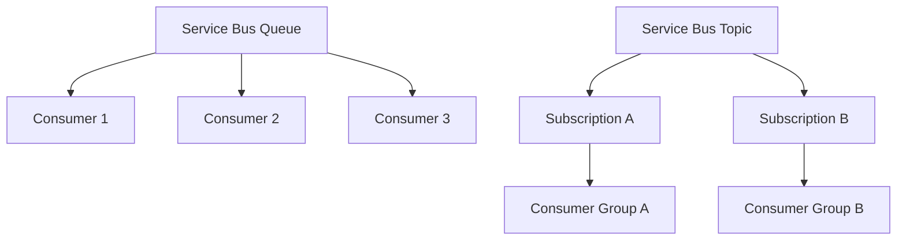

---

# 10. Ordering Comparison

## Event Hubs Ordering

Event Hubs preserves ordering within a partition.

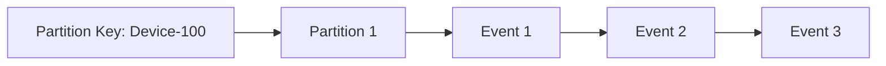

Use a partition key when related events must remain in the same partition.

### Important

```text
Ordering is guaranteed within a partition.
There is no global ordering guarantee across all partitions.
```

---

## Service Bus Ordering

Service Bus supports ordered processing using sessions.

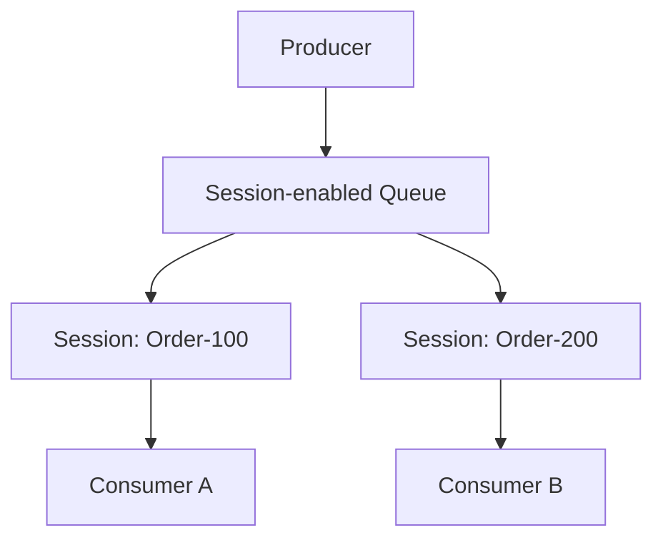

Messages in the same session can be processed in order, while different sessions can be processed concurrently. ([learn.microsoft.com](https://learn.microsoft.com/en-us/azure/service-bus-messaging/message-sessions?utm_source=openai))

---

# 11. Consumer Groups vs Subscriptions

These concepts are related but not identical.

## Event Hubs Consumer Group

A consumer group provides an independent view of the same event stream.

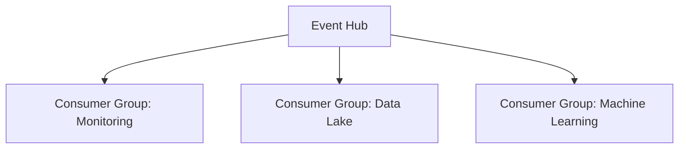

Each group maintains its own offsets and checkpoints.

## Service Bus Topic Subscription

A topic subscription receives copies of messages published to a topic.

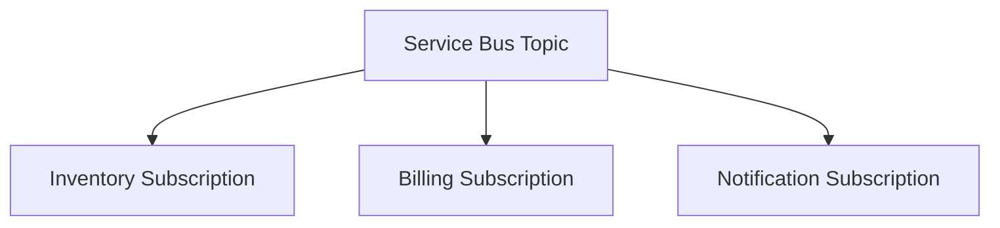

Each subscription has its own message lifecycle, retry behavior, and dead-letter queue.

---

# 12. Replay Comparison

## Event Hubs Replay

Event Hubs naturally supports replay by reading from:

- An earlier offset
- A timestamp
- The beginning of retained data
- A previously stored checkpoint

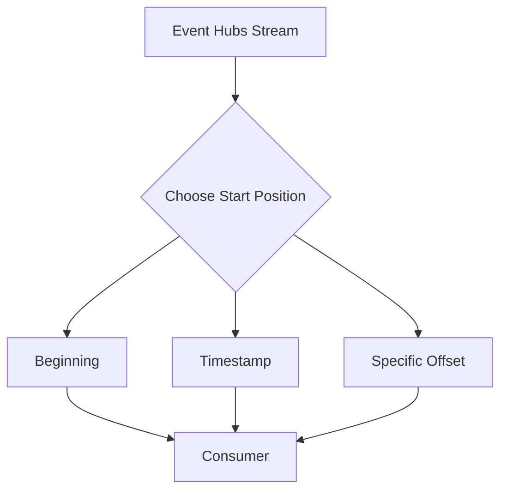

This is useful for:

- Rebuilding projections
- Reprocessing telemetry
- Correcting analytics logic
- Backfilling a data lake

---

## Service Bus Replay

Service Bus is not primarily an append-only replay log.

Recovery generally uses:

- Message retry
- Dead-letter queue processing
- Deferred message retrieval
- Controlled resubmission
- Application-level audit or event storage

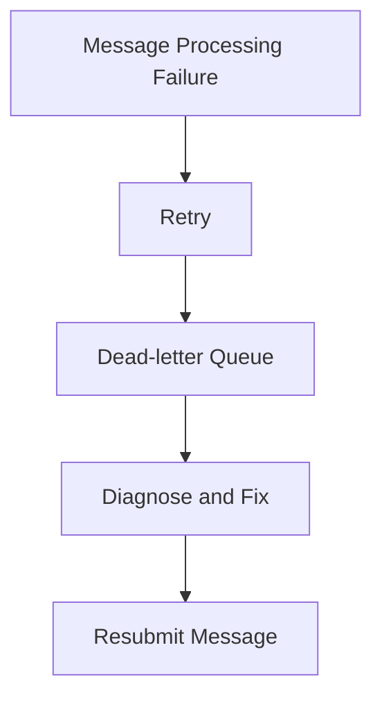

---

# 13. Dead-Lettering Comparison

| Requirement | Event Hubs | Service Bus |
|---|---|---|
| Built-in message DLQ | No native Service Bus-style DLQ | Yes |
| Poison-message isolation | Application-managed | Native DLQ support |
| Failed event recovery | Retry/reprocess from offset | Retry, DLQ, and replay workflow |
| Failure metadata | Application-managed | Service Bus dead-letter metadata |
| Best fit | Stream reprocessing | Business-message failure handling |

Service Bus queues and topic subscriptions provide associated dead-letter subqueues. ([learn.microsoft.com](https://learn.microsoft.com/en-us/azure/service-bus-messaging/service-bus-messaging-overview?utm_source=openai))

---

# 14. Transaction Comparison

## Event Hubs

Event Hubs is not primarily designed for transactional business workflows.

Typical processing pattern:

```text
Read event
    -> Process event
    -> Store result
    -> Checkpoint offset
```

The consumer should design for retries and duplicate processing.

## Service Bus

Service Bus supports transactional messaging scenarios, such as coordinating supported send and receive operations within a transaction boundary.

Typical business workflow:

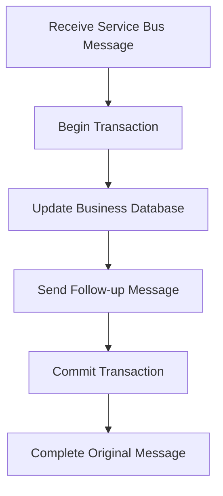

Always validate the exact transaction boundary and service integration requirements for the chosen architecture.

---

# 15. Use Case Comparison

| Scenario | Recommended Service | Reason |
|---|---|---|
| IoT telemetry ingestion | Event Hubs | High-volume partitioned streaming |
| Application logs | Event Hubs | Stream ingestion and analytics |
| Clickstream analysis | Event Hubs | High-throughput event pipeline |
| Real-time dashboards | Event Hubs | Continuous stream processing |
| Data lake ingestion | Event Hubs | Durable stream and replay |
| Process payment command | Service Bus | Reliable business workflow |
| Generate invoice | Service Bus | Background command processing |
| Reserve inventory | Service Bus | Business operation with retries |
| Send order to multiple business services | Service Bus Topic | Durable enterprise pub/sub |
| Ordered order lifecycle processing | Service Bus Sessions | Per-entity ordered workflow |
| Poison message investigation | Service Bus | Built-in DLQ |
| Delayed business task | Service Bus | Scheduled delivery support |

---

# 16. Real-World E-Commerce Architecture

A realistic application may use both services.

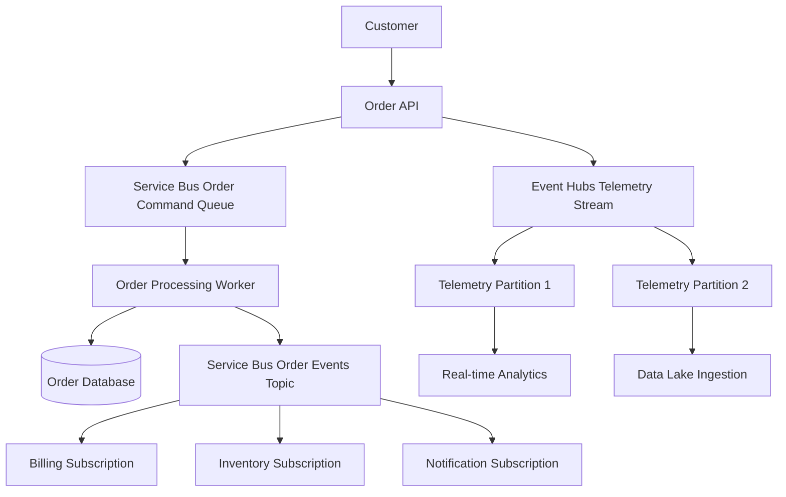

## Why Use Both?

- Service Bus handles important business commands.
- Service Bus topics distribute business events.
- Event Hubs captures high-volume telemetry and analytics data.
- Each service is used for the problem it is designed to solve.

---

# 17. Example: IoT Telemetry

## Requirement

Millions of devices continuously send temperature and sensor readings.

### Recommended Choice

Use Event Hubs.

```mermaid
flowchart LR
    Sensors[Millions of Sensors] --> EH[Azure Event Hubs]
    EH --> Partitions[Partitions]
    Partitions --> StreamAnalytics[Stream Processing]
    Partitions --> DataLake[Data Lake]
    Partitions --> Monitoring[Monitoring Dashboard]
```

### Why?

- High-volume ingestion
- Partitioned parallelism
- Multiple consumer groups
- Offset-based processing
- Stream replay

---

# 18. Example: Payment Processing

## Requirement

An order service requests payment processing, and a failed payment must be retried or investigated.

### Recommended Choice

Use Service Bus.

```mermaid
flowchart TD
    OrderService[Order Service] --> Queue[Payment Command Queue]
    Queue --> PaymentWorker[Payment Worker]
    PaymentWorker --> PaymentAPI[Payment Provider]

    PaymentAPI --> Result{Success?}
    Result -- Yes --> Complete[Complete Message]
    Result -- Temporary Failure --> Retry[Retry]
    Result -- Permanent Failure --> DLQ[Dead-letter Queue]
```

### Why?

- Command processing
- Peek-Lock
- Retry handling
- Dead-lettering
- Idempotency
- Business workflow semantics

---

# 19. Event Hubs vs Service Bus: Interview Traps

## Trap 1: “Both handle events, so they are interchangeable.”

### Correct Answer

They solve different problems:

- Event Hubs is optimized for high-throughput event streams.
- Service Bus is optimized for reliable enterprise message workflows.

---

## Trap 2: “Event Hubs consumer groups are the same as Service Bus subscriptions.”

### Correct Answer

They provide different semantics:

- Event Hubs consumer groups provide independent read positions over a stream.
- Service Bus subscriptions store message copies with brokered delivery and settlement behavior.

---

## Trap 3: “Event Hubs guarantees global ordering.”

### Correct Answer

Ordering is guaranteed within an Event Hubs partition, not across all partitions.

---

## Trap 4: “Service Bus guarantees exactly-once business processing.”

### Correct Answer

Service Bus provides reliable delivery and settlement features, but consumers should still be idempotent because redelivery can occur.

---

## Trap 5: “Use Event Hubs for all asynchronous work.”

### Correct Answer

Use Service Bus for important business commands and workflow messages that need retries, DLQ, settlement, or transactions.

---

# 20. Common Interview Questions and Strong Answers

## Q1. What is the primary difference between Event Hubs and Service Bus?

**Answer:**

Event Hubs is a high-throughput event streaming platform for telemetry and analytics. Service Bus is an enterprise message broker for reliable business commands, workflows, queues, and topics.

---

## Q2. Which should be used for IoT telemetry?

**Answer:**

Event Hubs, because it is designed for high-volume event ingestion, partitions, consumer groups, and stream processing.

---

## Q3. Which should be used for payment processing?

**Answer:**

Service Bus, because payment processing is a business workflow that benefits from retries, Peek-Lock, idempotency, dead-lettering, and controlled settlement.

---

## Q4. What is the difference between an Event Hubs partition and a Service Bus queue?

**Answer:**

An Event Hubs partition is an ordered append-only stream segment that consumers read using offsets. A Service Bus queue is a brokered message entity where consumers receive, lock, settle, retry, or dead-letter individual messages.

---

## Q5. How does replay work in Event Hubs?

**Answer:**

Consumers can read from an earlier offset or timestamp within the configured retention period. Checkpoints determine where a consumer resumes.

---

## Q6. How does failure handling differ?

**Answer:**

Event Hubs consumers typically retry or reprocess events and manage checkpoints. Service Bus provides explicit message settlement, delivery counts, and dead-letter queues.

---

## Q7. Can multiple applications consume the same Event Hubs stream?

**Answer:**

Yes. Create separate consumer groups so each application has an independent view and checkpoint position.

---

## Q8. Can multiple services consume the same Service Bus message?

**Answer:**

Use a topic with subscriptions when multiple independent services need a copy. Consumers compete within a queue or within the same subscription.

---

## Q9. Which service provides sessions for ordered processing?

**Answer:**

Service Bus provides sessions for ordered processing of related messages. Event Hubs provides ordering within partitions using partitioning and partition keys.

---

## Q10. Which service should be used for logs and analytics?

**Answer:**

Event Hubs is generally the better fit because it supports high-volume ingestion, partitioned processing, consumer groups, and replay.

---

## Q11. Which service supports dead-letter queues?

**Answer:**

Service Bus has native dead-letter queues for queues and topic subscriptions. Event Hubs does not use the same native message-DLQ model.

---

## Q12. Is Event Hubs a replacement for Service Bus?

**Answer:**

No. Event Hubs can transport high-volume event streams, but it is not a replacement for Service Bus workflow features such as message settlement, native DLQ semantics, sessions, and transactional messaging.

---

# 21. Decision Matrix

```mermaid
flowchart TD
    Start[Choose Service] --> A{Is data continuous and high volume?}
    A -- Yes --> B{Telemetry, logs, IoT, or analytics?}
    B -- Yes --> EH[Azure Event Hubs]

    A -- No --> C{Is this a business command or workflow?}
    C -- Yes --> SB[Azure Service Bus]
    C -- No --> D{Need DLQ, settlement, sessions, or transactions?}
    D -- Yes --> SB
    D -- No --> E{Need partitioned replayable stream?}
    E -- Yes --> EH
    E -- No --> Evaluate[Evaluate Event Grid or another service]
```

---

# 22. Production Best Practices

## Event Hubs Best Practices

1. Design partitions carefully.
2. Use partition keys for related event ordering.
3. Monitor consumer lag.
4. Persist checkpoints in durable storage.
5. Make stream processors idempotent.
6. Tune batch size and checkpoint frequency.
7. Use separate consumer groups for independent applications.
8. Monitor partition skew.
9. Plan retention based on replay requirements.
10. Use Event Hubs Capture or another sink for long-term storage where needed.

## Service Bus Best Practices

1. Use Peek-Lock for important messages.
2. Complete messages only after successful processing.
3. Use retries with exponential backoff.
4. Configure maximum delivery count.
5. Monitor and process DLQs.
6. Make consumers idempotent.
7. Use sessions when per-entity ordering is required.
8. Use topics and subscriptions for durable fan-out.
9. Use filters to reduce unnecessary processing.
10. Use Managed Identity and RBAC.
11. Monitor queue depth and message age.
12. Use transactions or outbox patterns where required.

---

# 23. Monitoring Comparison

## Event Hubs Metrics

Monitor:

- Incoming events
- Outgoing events
- Throughput utilization
- Partition utilization
- Consumer lag
- Checkpoint delay
- Processing failures
- Partition skew

```mermaid
flowchart LR
    EventHub[Event Hubs] --> Metrics[Streaming Metrics]
    Metrics --> Monitor[Azure Monitor]
    Monitor --> Alert[Consumer Lag Alert]
    Monitor --> Dashboard[Streaming Dashboard]
```

## Service Bus Metrics

Monitor:

- Active message count
- Queue or subscription depth
- Oldest message age
- Dead-letter count
- Delivery count
- Processing latency
- Lock-lost exceptions
- Consumer failures

```mermaid
flowchart LR
    ServiceBus[Service Bus] --> Metrics[Messaging Metrics]
    Metrics --> Monitor[Azure Monitor]
    Monitor --> Alert[DLQ and Backlog Alerts]
    Monitor --> Dashboard[Workflow Dashboard]
```

---

# 24. Security Comparison

Both services support enterprise security practices such as:

- Microsoft Entra ID
- Azure RBAC
- Managed identities
- TLS encryption
- Network restrictions
- Private connectivity options
- Monitoring and auditing

Use service-specific roles and least privilege.

```mermaid
flowchart LR
    Application[Application] --> Identity[Managed Identity]
    Identity --> Entra[Microsoft Entra ID]
    Entra --> RBAC[Azure RBAC]
    RBAC --> Messaging[Event Hubs or Service Bus]
```

---

# 25. 60-Second Interview Pitch

> Azure Event Hubs and Azure Service Bus serve different purposes. Event Hubs is a high-throughput event streaming platform designed for telemetry, logs, IoT, clickstream, and real-time analytics. It uses partitions, consumer groups, offsets, and checkpoints. Service Bus is an enterprise message broker designed for reliable business commands and workflows. It provides queues, topics, subscriptions, Peek-Lock processing, message settlement, retries, dead-letter queues, sessions, and transactional capabilities. I choose Event Hubs when streaming scale and replay are primary requirements, and Service Bus when business reliability, message control, and workflow processing are primary requirements. Many enterprise systems use both together.

---

# 26. Final Interview Checklist

## Choose Event Hubs When:

- [ ] Data arrives as a continuous stream.
- [ ] Throughput is very high.
- [ ] Data is telemetry, logs, IoT, or clickstream.
- [ ] Partitioned parallel processing is needed.
- [ ] Multiple applications need independent stream views.
- [ ] Replay from offsets is required.
- [ ] Real-time analytics is required.

## Choose Service Bus When:

- [ ] The message represents a command or business task.
- [ ] Reliable processing is more important than raw throughput.
- [ ] Queue or topic semantics are needed.
- [ ] Message settlement is required.
- [ ] Retries and dead-letter queues are required.
- [ ] Per-entity ordering is required.
- [ ] Transactions or scheduled delivery are required.
- [ ] Business workflows must be decoupled.

---

## Best One-Line Conclusion

> Azure Event Hubs is optimized for high-volume partitioned event streaming, while Azure Service Bus is optimized for reliable enterprise messaging, commands, and business workflows.