# How Do You Process Millions of Events?
## Detailed Interview Preparation Guide with Flow Charts

---

## 1) Direct Interview Answer

To process millions of events reliably, design a **partitioned, horizontally scalable, backpressure-aware streaming architecture** with:

1. High-throughput ingestion (e.g., Event Hubs/Kafka)
2. Correct partition-key strategy
3. Parallel consumers (consumer groups + autoscaling)
4. Idempotent processing + deduplication
5. Checkpointing/offset management
6. Retry + dead-letter/error routing
7. End-to-end observability (lag, throughput, failures)
8. Capacity planning + load/chaos testing

> One-liner: *Use partitioned streaming + horizontal scale + idempotent fault-tolerant consumers + strong observability.*

---

## 2) Big-Picture Architecture

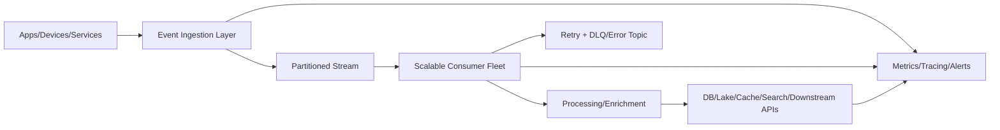

---

## 3) Core Processing Flow (End-to-End)

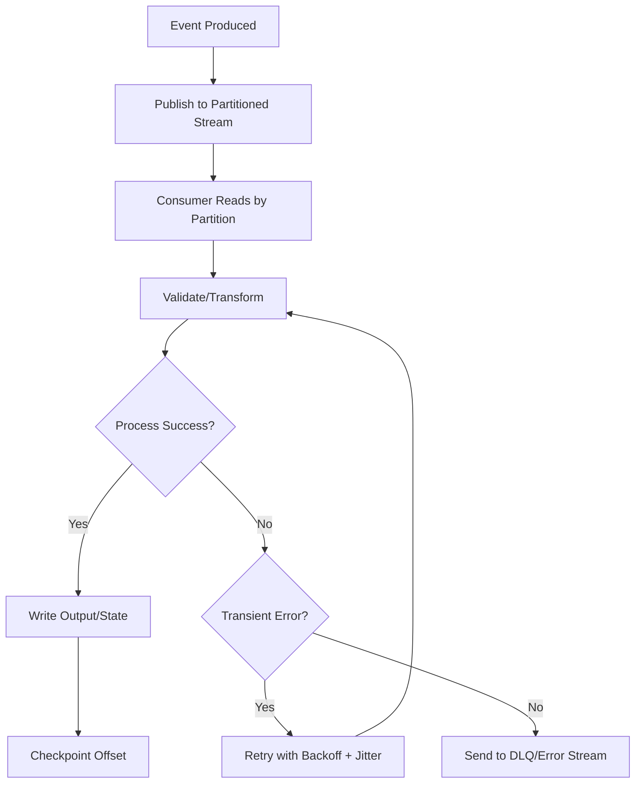

---

## 4) Throughput Strategy: Partition First

Millions of events require parallelism.

- Partitions create independent lanes.
- More lanes allow more consumer parallelism.
- Ordering is preserved within a partition only.

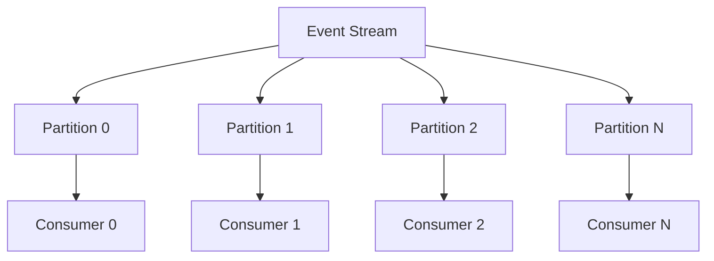

Interview phrase:
> Partition count sets your upper bound for parallel consumer processing per consumer group.

---

## 5) Partition Key Design (Critical)

Choose partition keys that:
- Preserve required ordering for related events
- Distribute traffic evenly
- Avoid hot partitions

Common keys:
- DeviceId (IoT)
- CustomerId
- OrderId
- AccountId
- Tenant+Entity composite key (sometimes)

Bad key design causes skew and bottlenecks.

---

## 6) Hot Partition Detection + Mitigation

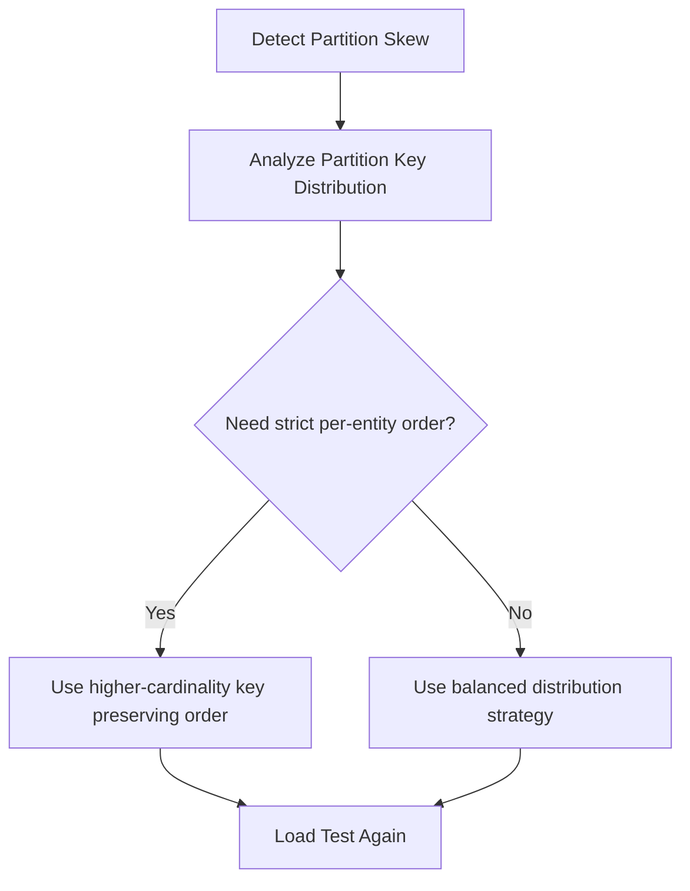

---

## 7) Consumer Scaling Model

Scale consumers based on:
- Consumer lag
- Event ingress rate
- Processing latency
- CPU/memory pressure
- Error rate

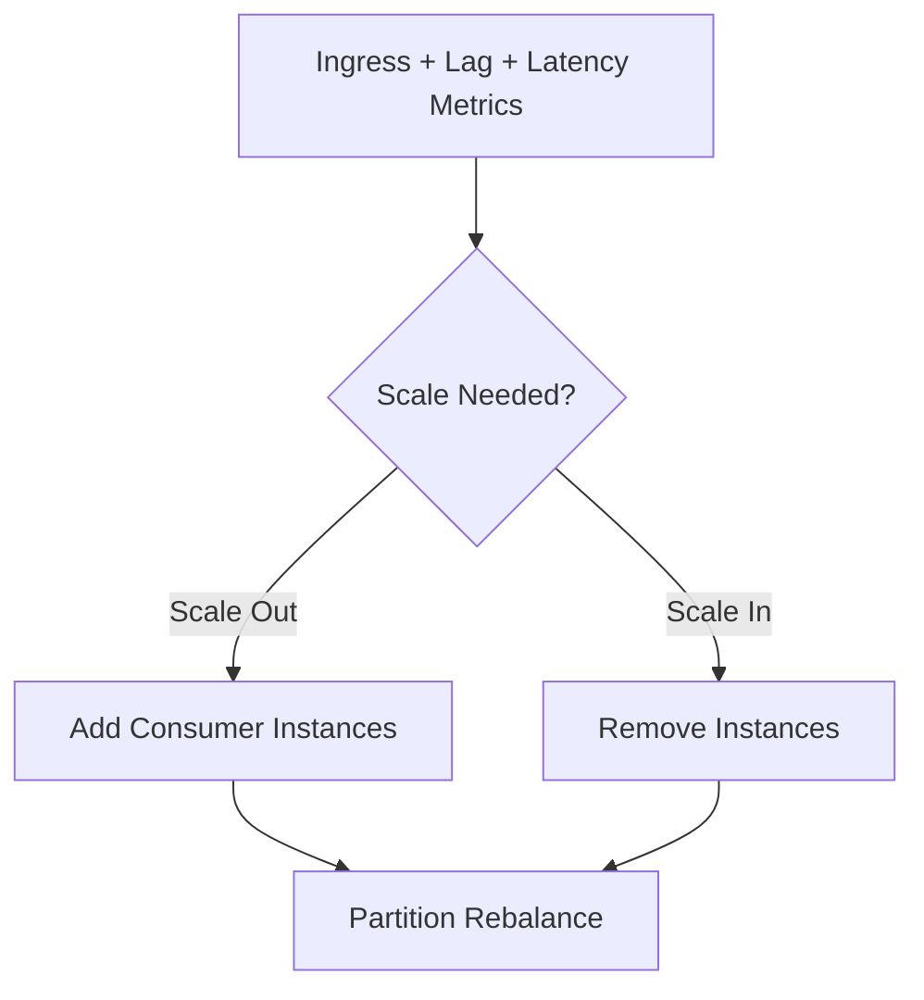

---

## 8) Batch Processing for Efficiency

Process events in micro-batches to reduce I/O overhead.

Benefits:
- Better throughput
- Fewer downstream calls
- Efficient checkpointing

Tradeoff:
- Larger batches may increase retry cost and latency

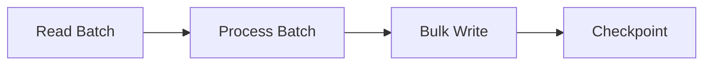

---

## 9) Checkpoint/Offset Strategy

Checkpoint only after successful processing of intended unit (event or batch).

Too frequent:
- Higher overhead

Too infrequent:
- More replay after failure

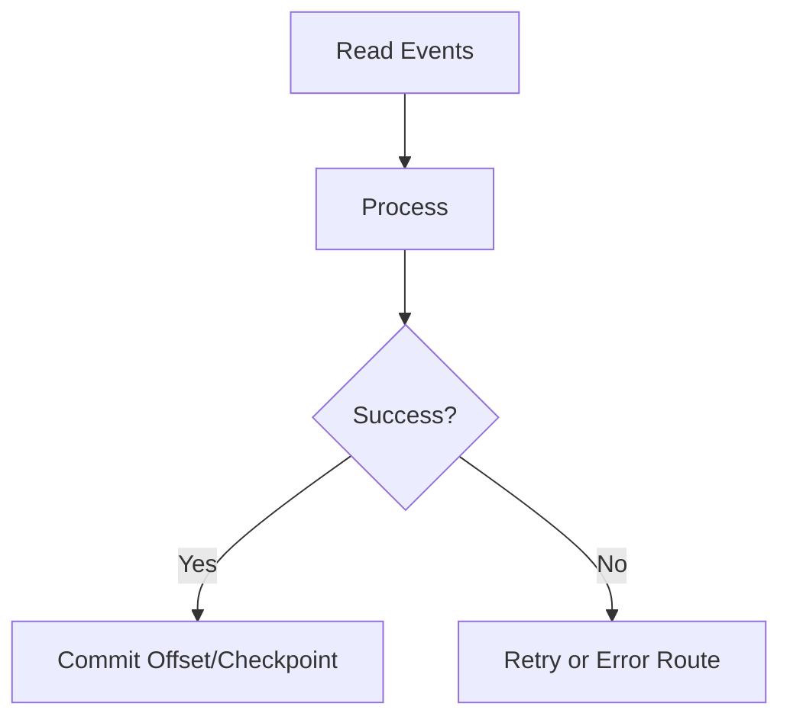

---

## 10) Reliability: Idempotency + Deduplication

At massive scale, duplicates are inevitable (retries/restarts/rebalances).

Use:
- EventId/messageId tracking
- Business-key idempotency
- Upsert patterns
- Unique constraints
- Side-effect guards

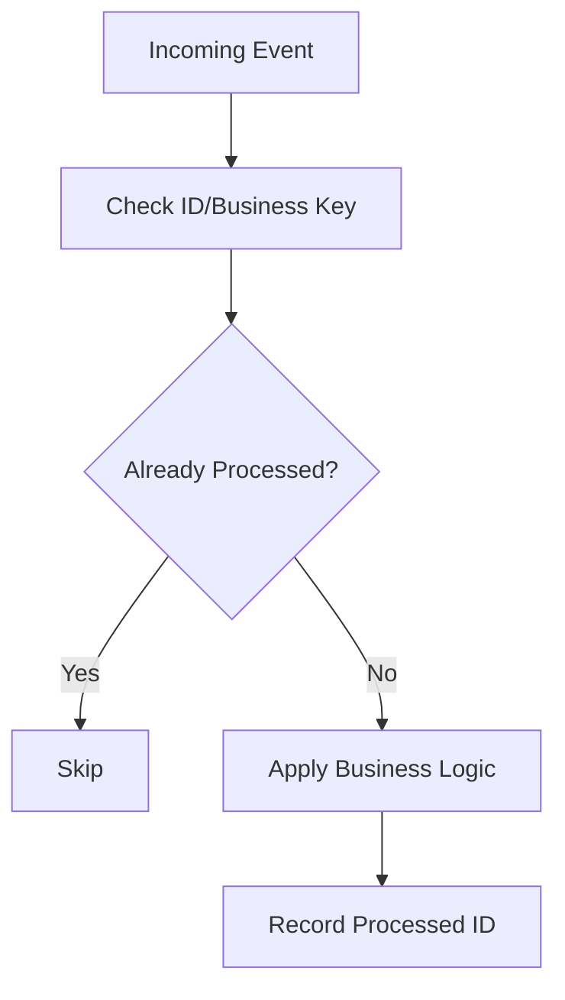

---

## 11) Retry and Error Routing Strategy

- Retry only transient failures
- Exponential backoff + jitter
- Max attempts
- Route permanent failures to DLQ/error topic

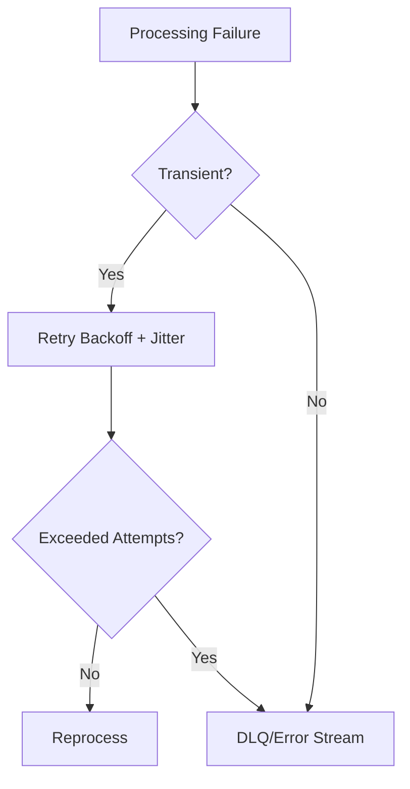

---

## 12) Backpressure Management

When downstream systems slow down:
- Throttle consumer rate
- Reduce fetch size
- Pause partitions temporarily (technology dependent)
- Buffer safely
- Degrade non-critical enrichments

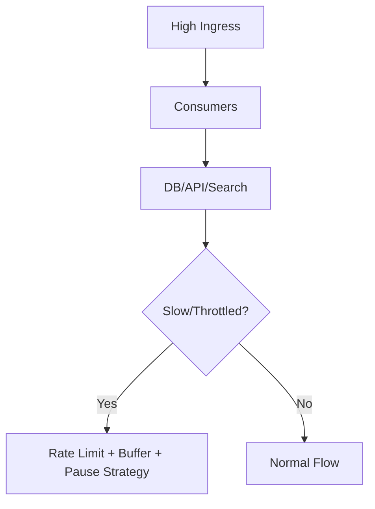

---

## 13) Multi-Stage Pipeline Pattern

At very high scale, split into stages:

1. Ingest stream
2. Validate/normalize
3. Enrich
4. Aggregate
5. Persist/serve

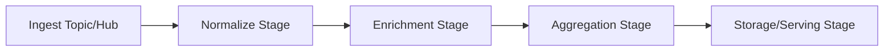

Benefits:
- Isolation of concerns
- Independent scaling per stage
- Better fault containment

---

## 14) Storage and Sink Strategy

Choose sink per access pattern:
- Data lake for long-term analytics
- OLTP DB for operational state
- Search index for query UX
- Cache for low-latency reads

At millions/sec scale, avoid per-event synchronous writes where possible:
- Batch writes
- Async sinks
- Buffered commit patterns

---

## 15) Exactly-Once vs Effectively-Once

True exactly-once end-to-end is hard and context-specific.
Practical approach:
- At-least-once delivery
- Idempotent processing
- Deterministic writes
= effectively-once business outcomes

Interview phrase:
> I engineer effectively-once outcomes with idempotency and dedup, rather than assuming perfect exactly-once transport semantics.

---

## 16) Observability at Scale (Non-Negotiable)

Track:
- Ingress events/sec
- Egress events/sec
- Consumer lag per partition/group
- Processing latency P50/P95/P99
- Error/retry/DLQ rates
- Hot partition skew
- Checkpoint staleness
- Downstream saturation

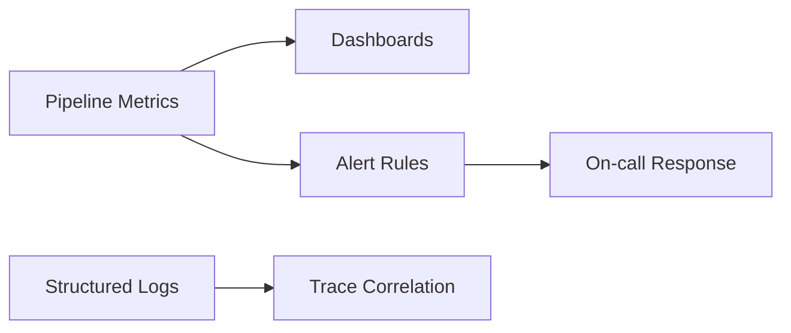

---

## 17) Capacity Planning Formula Mindset

Estimate:
- Peak events/sec
- Average event size
- Required retention/replay window
- Consumers needed = (ingress rate / per-consumer processing rate) + headroom
- Partition count based on target parallelism and skew tolerance

Always include headroom for spikes and failover.

---

## 18) Load Testing & Chaos Testing

Before production:
- Throughput stress test
- Burst traffic test
- Consumer crash/restart test
- Downstream outage simulation
- Replay/recovery drills
- Rebalance behavior validation

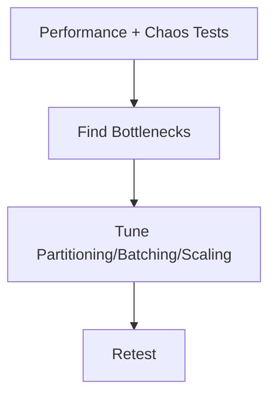

---

## 19) Security and Governance at Scale

- Managed identity / RBAC
- Secretless auth where possible
- Encryption in transit/at rest
- PII minimization in event payloads
- Schema governance/versioning
- Audit trails for replays and operator actions

---

## 20) Common Mistakes (Interview Gold)

1. No partition key strategy (hot shards)
2. No idempotency (duplicate side effects)
3. Infinite retries without DLQ
4. Checkpointing before durable processing
5. Ignoring lag until incident
6. Tight coupling to slow downstream APIs
7. Oversized payloads with no schema discipline
8. No replay drill/runbook

---

## 21) Practical Reference Architectures

## A) IoT Telemetry Pipeline

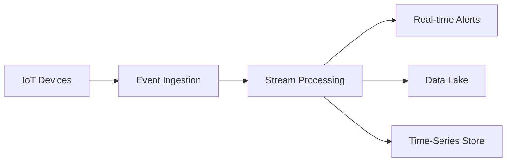

## B) Clickstream Analytics

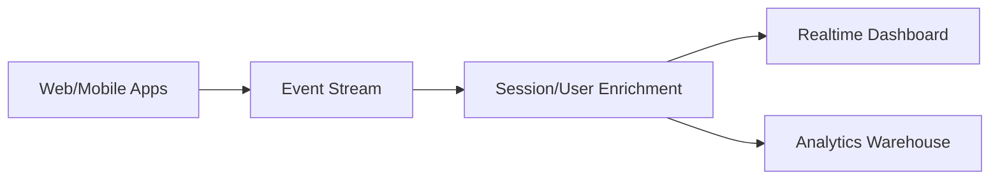

---

## 22) Interview Q&A (Strong Answers)

### Q1: How do you scale to millions of events?
**Answer:** Partitioned ingestion, horizontal consumer scaling, batching, idempotent processing, and lag-driven autoscaling.

### Q2: How do you prevent duplicates from causing wrong business outcomes?
**Answer:** Idempotency keys, dedup stores, unique constraints, and deterministic upserts.

### Q3: How do you handle failures?
**Answer:** Retry transient errors with backoff+jitter, route persistent failures to DLQ/error stream, and replay after root-cause fix.

### Q4: How do you preserve ordering?
**Answer:** Use stable partition keys for entities requiring ordered processing; ordering is only guaranteed within a partition.

### Q5: What metric is most important operationally?
**Answer:** Consumer lag per partition/group, because it directly shows whether processing keeps up with ingress.

---

## 23) 60-Second Interview Pitch

> To process millions of events, I build a partitioned streaming architecture and scale consumers horizontally by partition ownership. I choose partition keys that preserve required ordering while avoiding hot partitions. Consumers process in micro-batches, checkpoint after successful durable writes, and remain idempotent so retries and rebalances are safe. I classify errors into transient vs permanent, use exponential backoff retries, and route poison events to DLQ/error streams. Operationally, I monitor lag, throughput, latency, retries, and partition skew, then autoscale and tune based on those signals. Finally, I validate production readiness with load and chaos tests, including replay and recovery drills.

---

## 24) Final Checklist

- [ ] Partitioning and key strategy defined  
- [ ] Consumer horizontal scaling model defined  
- [ ] Batch size and checkpoint strategy tuned  
- [ ] Idempotency + deduplication implemented  
- [ ] Retry/backoff + DLQ flow implemented  
- [ ] Backpressure controls implemented  
- [ ] Lag/latency/error observability in place  
- [ ] Capacity planning with headroom done  
- [ ] Load + failure + replay testing completed  

---

## One-Line Conclusion

> Processing millions of events requires partitioned parallel streaming, resilient idempotent consumers, controlled retries with error isolation, and lag-driven autoscaling with deep observability.