# Real-World IoT Scenario Using Azure Event Hubs
## Detailed Interview Preparation Guide with Flow Charts

---

## 1) Direct Interview Answer

A common real-world IoT pattern is:

1. **Devices** send telemetry at high frequency  
2. **Azure Event Hubs** ingests millions of events  
3. **Stream processors / consumers** validate, enrich, and analyze data  
4. Critical signals trigger **real-time alerts**  
5. Telemetry is stored in **data lake / time-series / analytics stores**  
6. Operations teams monitor **lag, failures, and device health**

> One-liner: *Event Hubs is the scalable ingestion backbone for high-volume IoT telemetry, enabling real-time detection and long-term analytics simultaneously.*

---

## 2) Scenario: Smart Factory Predictive Maintenance

Imagine a manufacturing company with:

- 120,000 industrial sensors
- Data every 2–5 seconds
- Telemetry types: temperature, vibration, pressure, RPM, humidity, error codes
- Goal: detect anomalies early, reduce downtime, optimize maintenance

Daily event volume can reach **hundreds of millions**.

---

## 3) End-to-End IoT Architecture Flow

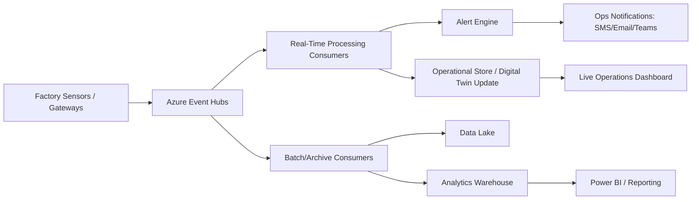

---

## 4) Why Event Hubs Fits IoT

Event Hubs is ideal here because IoT needs:

- Massive ingress throughput
- Partitioned parallel consumption
- Independent consumer groups (alerts, storage, ML)
- Offset/checkpoint recovery
- Replay capability within retention window

Interview phrase:
> Event Hubs separates high-scale ingestion from downstream processing concerns, so multiple systems can consume the same telemetry independently.

---

## 5) Device-to-Cloud Ingestion Flow

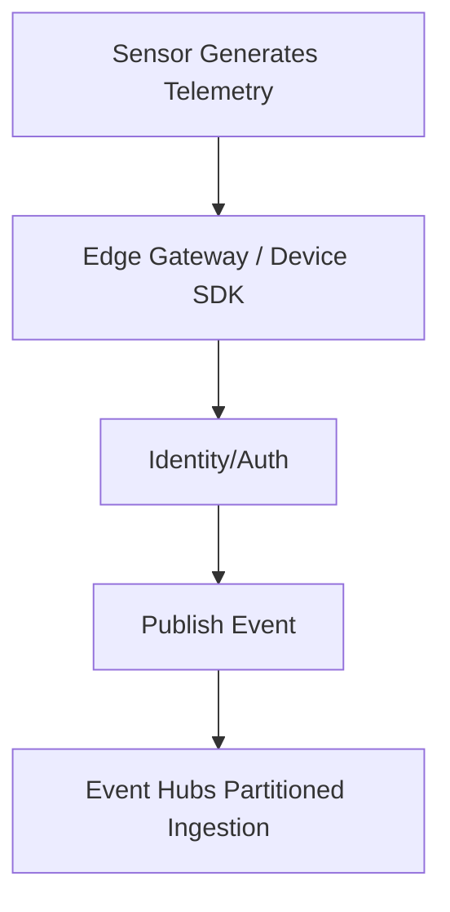

### Typical telemetry payload (example fields)
- deviceId
- factoryId / lineId
- timestamp
- temperature
- vibration
- pressure
- firmwareVersion
- statusCode

---

## 6) Partition Strategy for IoT

Use partition key to preserve per-device order and distribute load.

Common keys:
- `deviceId` (most common)
- `factoryId-deviceId` composite (if needed)

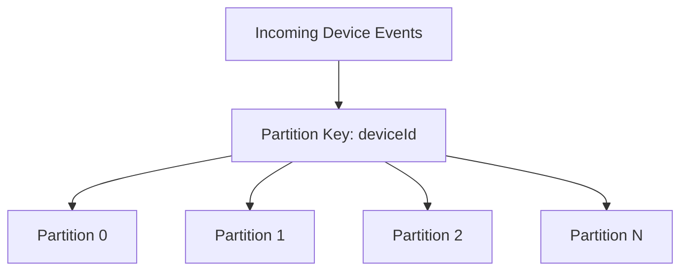

Why:
- Maintains order for each device stream
- Enables parallelism across devices

---

## 7) Multi-Consumer-Group IoT Pattern

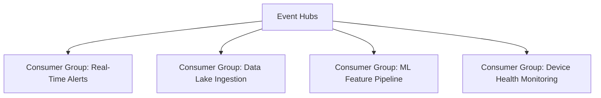

Each consumer group has independent checkpoints and scaling.

---

## 8) Real-Time Anomaly Detection Flow

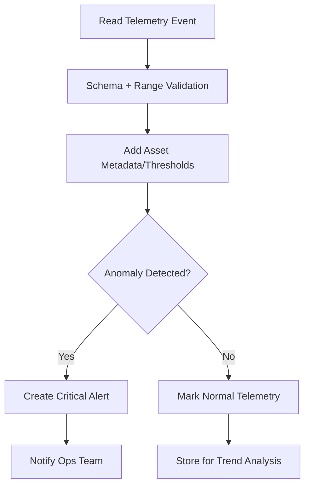

Example anomaly:
- Vibration > threshold for 3 consecutive readings
- Temperature spike + RPM drop correlation

---

## 9) Predictive Maintenance Workflow

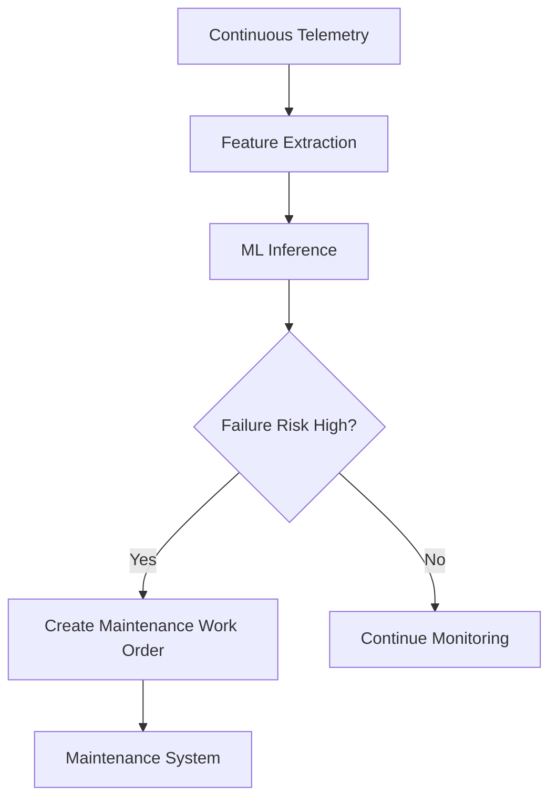

---

## 10) Reliability Design (High-Scale IoT)

At this scale, failures are normal.

Use:
- Retry transient downstream failures
- DLQ/error stream for poison events
- Checkpoint after successful processing
- Idempotent writes/upserts
- Backpressure controls

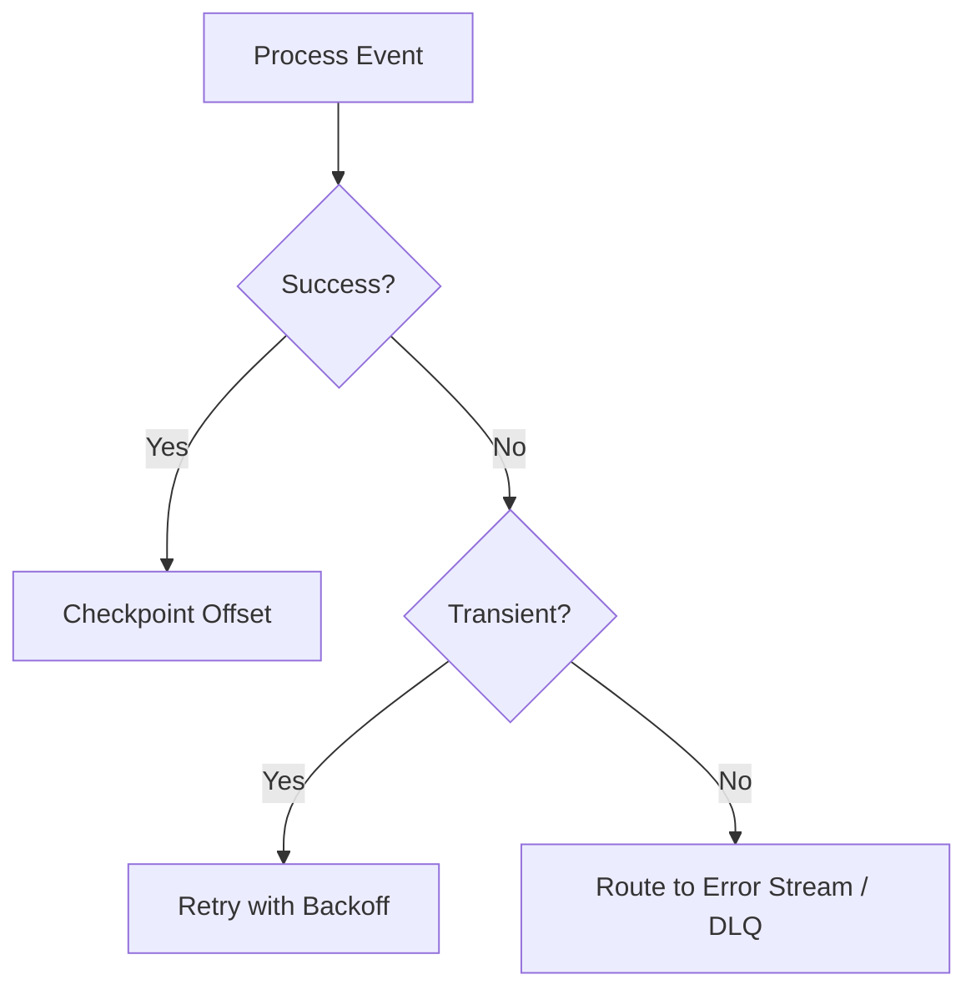

---

## 11) Idempotency in IoT Pipelines

Duplicates can occur due to retries/restarts/rebalances.

Idempotency approach:
- Use eventId or (deviceId + timestamp + sequenceNo)
- Upsert by natural key
- Ignore duplicates safely

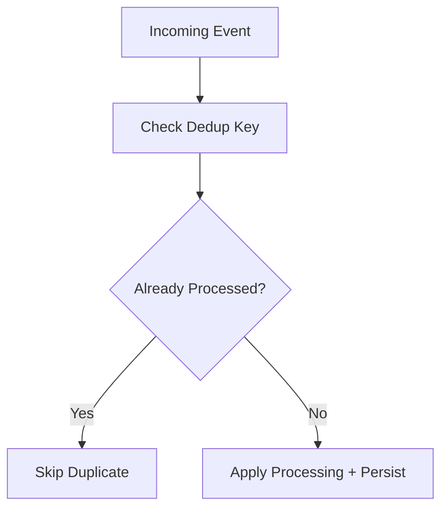

---

## 12) Hot Partition Prevention

IoT can create skew if partition key is poor (e.g., factoryId only).

Mitigate:
- Use higher-cardinality keys (deviceId)
- Monitor partition-level ingress and lag
- Reevaluate key strategy during growth

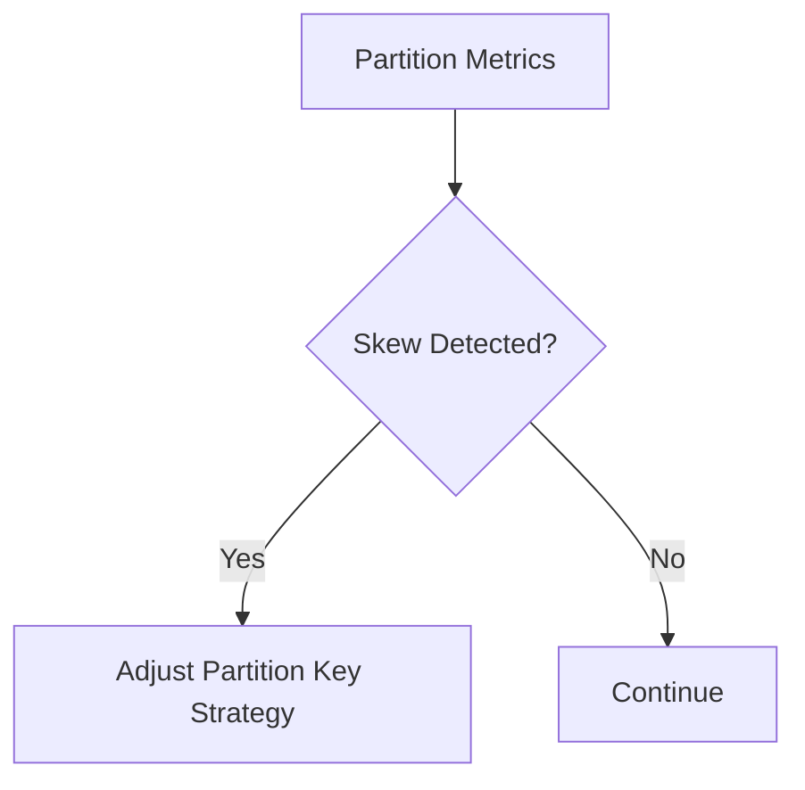

---

## 13) Capacity Planning Example (Interview Style)

Suppose:
- 120,000 devices
- 1 event every 3 sec average
- ~40,000 events/sec baseline
- Peak burst 2x -> 80,000 events/sec

Plan for:
- Peak + headroom
- Adequate partition count for consumer parallelism
- Autoscale consumers by lag
- Retention for replay window

Interview phrase:
> I size for sustained peak, not average, and maintain safety headroom for bursts and failover.

---

## 14) Security in IoT Event Pipeline

Use:
- Device identity and authentication
- Per-device credentials/rotation strategy
- Managed identity for consumers
- RBAC least privilege
- Private networking where required
- Encryption in transit and at rest
- Payload minimization for sensitive data

---

## 15) Observability Dashboard (Must-Have)

Track:
- Ingress events/sec
- Egress events/sec
- Consumer lag per partition/group
- Processing latency P95/P99
- Retry/error/DLQ rates
- Partition skew
- Device offline/heartbeat failure count

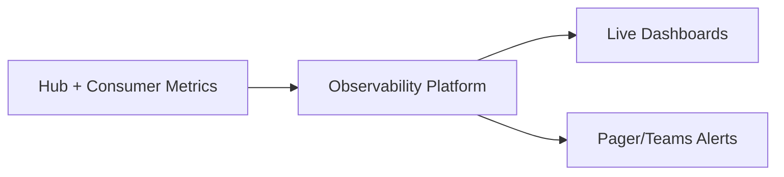

---

## 16) Incident Scenario: Downstream DB Slow

What happens:
- Consumer processing slows
- Lag increases
- Retry spikes

Response:
1. Trigger alert on lag threshold
2. Scale consumers (if bottleneck is compute)
3. Apply backpressure/throttling
4. Fail fast non-critical enrichments
5. Recover and catch up from offsets

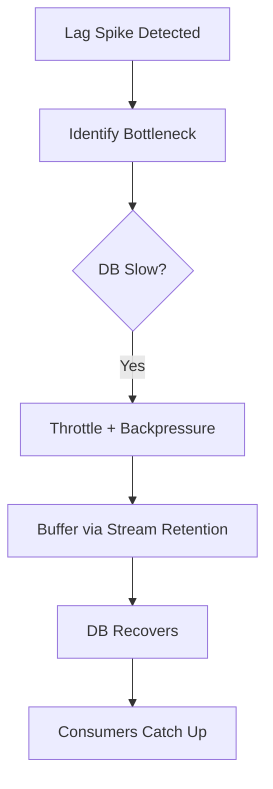

---

## 17) Data Lifecycle in IoT

Short-term:
- Operational store for live dashboards and alert status

Long-term:
- Data lake for historical analytics/model training
- Warehouse for reporting
- Retention/archival compliance policy

---

## 18) Cost Optimization Considerations

- Right-size event payloads (avoid verbose unnecessary fields)
- Compress where applicable
- Batch downstream writes
- Tune retention to business replay needs
- Avoid overprovisioned always-on consumers
- Use autoscaling based on lag/throughput

---

## 19) Common Mistakes in IoT + Event Hubs

1. No partition key strategy
2. Per-event synchronous DB writes (throughput collapse)
3. No idempotency (duplicate alerts/work orders)
4. Checkpointing before durable write
5. No lag monitoring
6. No error stream/DLQ for bad payloads
7. Underestimating burst traffic
8. No replay drill

---

## 20) Interview Q&A (Strong Answers)

### Q1: Why Event Hubs for IoT?
**Answer:** It supports very high-throughput telemetry ingestion with partitioned parallelism and independent consumer groups for real-time and batch use cases.

### Q2: How do you preserve device event order?
**Answer:** Use `deviceId` as partition key so events for a device stay ordered within a partition.

### Q3: How do you process both alerts and analytics from same telemetry?
**Answer:** Use separate consumer groups—one for real-time alerting, another for lake/analytics ingestion.

### Q4: How do you handle failures at scale?
**Answer:** Retry transient errors with backoff, route poison events to error stream/DLQ, checkpoint after durable success, and ensure idempotent processing.

### Q5: Most important metric?
**Answer:** Consumer lag per partition/group, because it directly indicates whether processing keeps up with ingestion.

---

## 21) 60-Second Interview Pitch

> In a smart-factory IoT solution, devices publish high-frequency telemetry to Azure Event Hubs, which acts as a scalable ingestion backbone. I partition by deviceId to preserve per-device order and enable parallel processing. Then I use multiple consumer groups: one for real-time anomaly alerts, one for data-lake ingestion, and one for ML feature pipelines. Consumers checkpoint offsets after successful durable writes, implement idempotency to handle duplicates, and use retry with backoff plus error-stream routing for failures. Operationally, I monitor lag, partition skew, latency, and error rates with autoscaling and backpressure controls. This design supports millions of events with reliability and low-latency insights.

---

## 22) Final Checklist

- [ ] Event Hubs ingestion layer designed for peak load  
- [ ] Partition key strategy (deviceId or equivalent) defined  
- [ ] Multi-consumer-group architecture in place  
- [ ] Idempotency + deduplication implemented  
- [ ] Retry/backoff + DLQ/error stream configured  
- [ ] Checkpoint strategy validated  
- [ ] Lag/skew/latency observability and alerts enabled  
- [ ] Capacity/load/chaos tests completed  

---

## One-Line Conclusion

> A real-world IoT solution uses Event Hubs as a partitioned, scalable ingestion backbone with independent consumer groups for real-time alerts, analytics, and ML—backed by idempotent, observable, fault-tolerant processing.