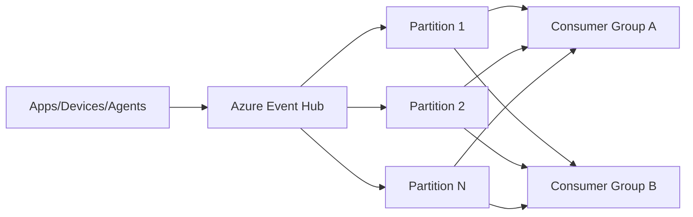
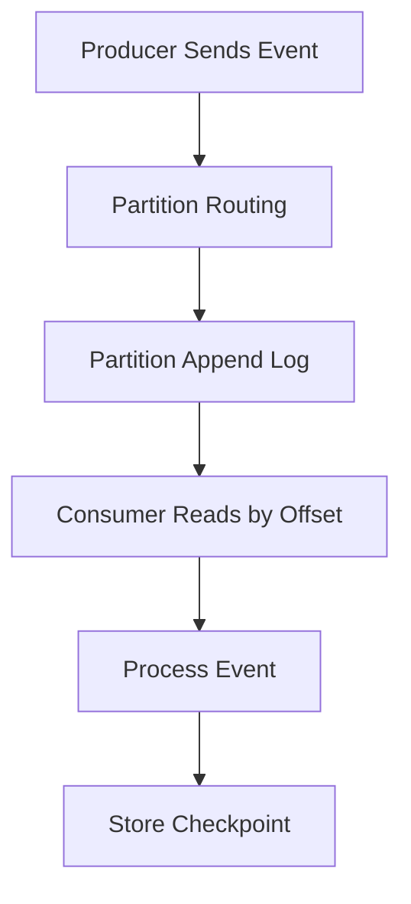
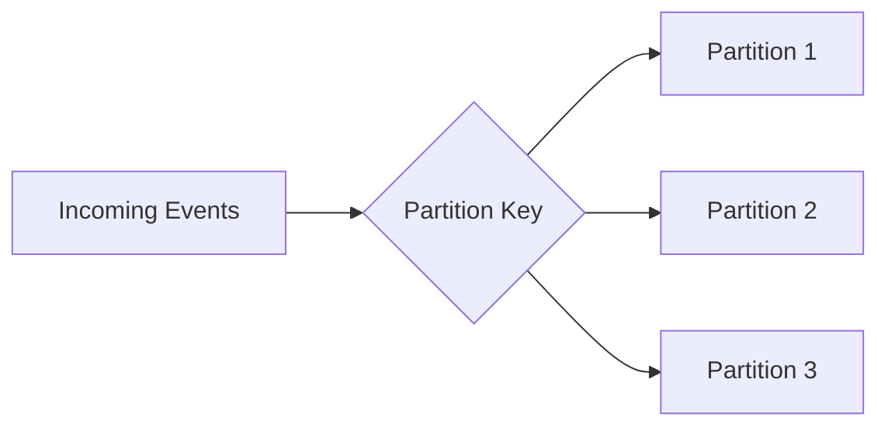
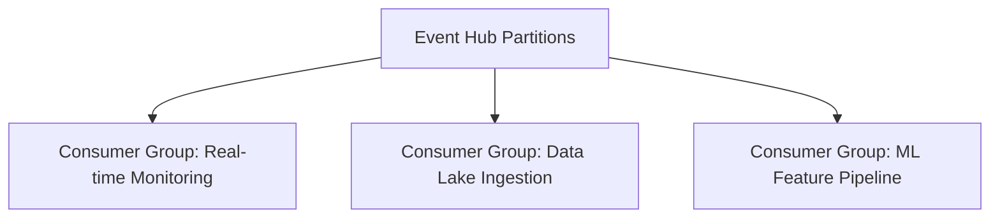
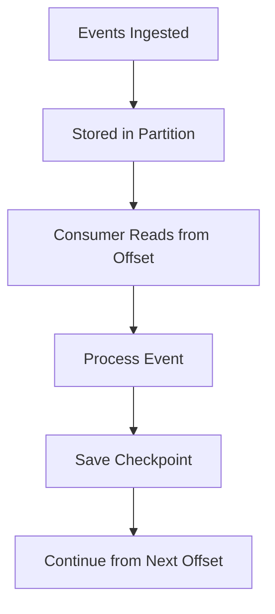
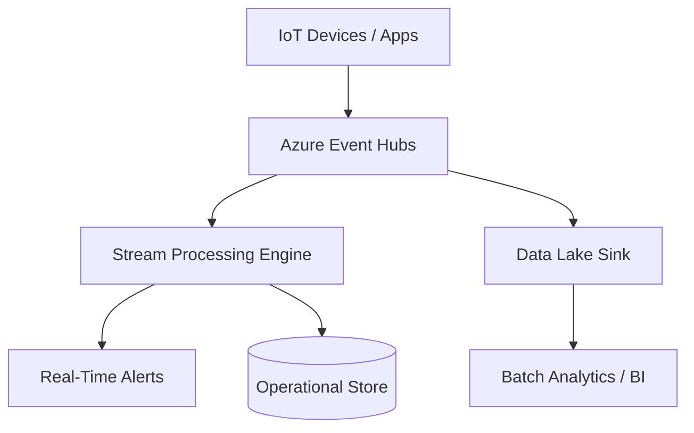
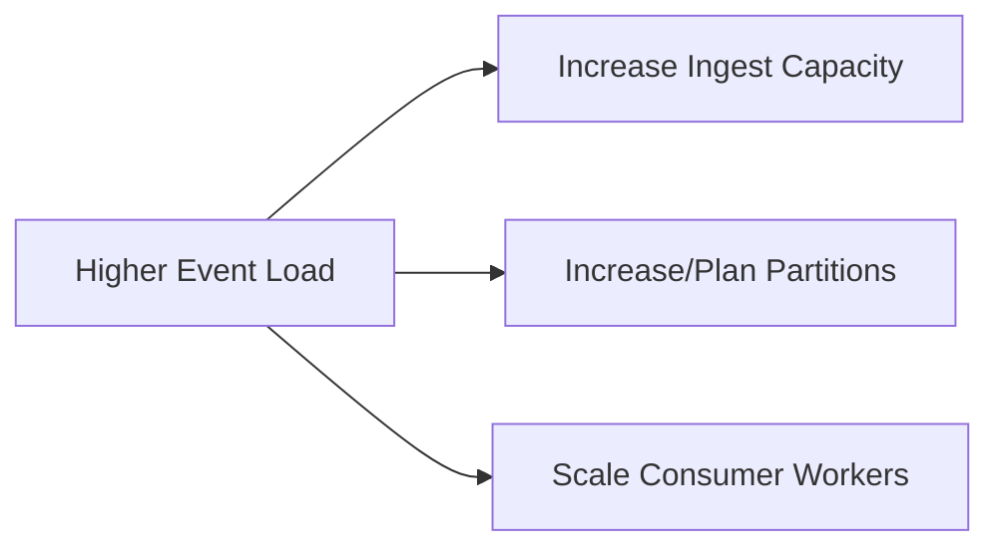
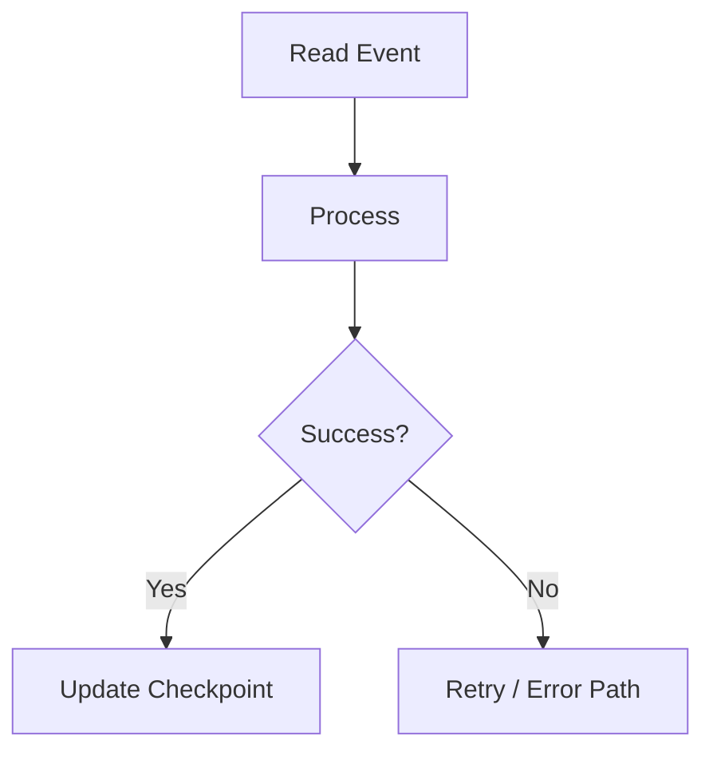
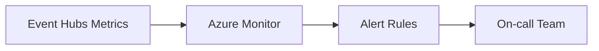

# What Is Azure Event Hubs?
## Detailed Interview Preparation Guide with Flow Charts

---

## 1) Direct Interview Answer

**Azure Event Hubs** is a fully managed, highly scalable **event streaming and ingestion** service used to collect, buffer, and process massive volumes of events/telemetry data in near real time.

> One-liner: *Event Hubs is Azure’s big-scale event ingestion pipe for telemetry and streaming data.*

---

## 2) What Problem Event Hubs Solves

Modern systems generate huge streams of data:
- Application logs
- Metrics
- Clickstream events
- IoT telemetry
- Security/audit events

Challenges:
- Very high ingest rate
- Multiple downstream consumers
- Parallel processing requirements
- Need for replay from checkpoints

Event Hubs addresses these with:
- Partitioned event streams
- Consumer groups
- Offset/checkpoint-based reading
- Elastic throughput scaling

---

## 3) Core Event Hubs Flow

---

## 4) Key Concepts You Must Know

## 4.1 Namespace
Top-level container for Event Hubs resources.

## 4.2 Event Hub
A specific stream ingestion entity inside a namespace.

## 4.3 Partitions
Append-only ordered logs split for parallelism and scale.

## 4.4 Consumer Group
Independent view of the event stream for each consuming application.

## 4.5 Offset
Position in a partition stream where a consumer reads from.

## 4.6 Checkpoint
Persisted read position to resume processing reliably.

---

## 5) How Data Is Written and Read

Important:
- Producers append events
- Consumers read in sequence per partition
- Consumers manage their own progress

---

## 6) Partitioning Explained

Partitions enable:
- Scale-out ingestion
- Parallel consumption
- Ordered events **within** each partition

If same partition key is used, related events tend to land in same partition, helping preserve order for that key.

---

## 7) Consumer Groups Explained

Consumer groups allow multiple independent applications to read same stream without interfering.

Each consumer group tracks checkpoints independently.

---

## 8) Event Hubs Processing Lifecycle

If consumer crashes:
- Restart from last checkpoint
- Reprocess from there

---

## 9) Event Hubs vs Traditional Queue (Interview Critical)

| Aspect | Event Hubs | Queue |
|---|---|---|
| Primary model | Event stream ingestion | Task/message queue |
| Consumption | Offset-based stream reading | Message receive/ack lifecycle |
| Replay | Natural via offsets | Not stream-first replay model |
| Throughput profile | Very high ingest | Workflow/task-oriented |
| Typical data | Telemetry/log/clickstream | Business commands/tasks |

---

## 10) Event Hubs vs Service Bus

| Need | Better Fit |
|---|---|
| Massive telemetry ingestion | Event Hubs |
| Command/workflow reliability semantics | Service Bus |
| Partitioned stream analytics | Event Hubs |
| Queue/topic with DLQ/sessions | Service Bus |

One-line interview answer:
> Event Hubs is for big event streams; Service Bus is for enterprise messaging workflows.

---

## 11) Event Hubs vs Event Grid

| Need | Better Fit |
|---|---|
| Reactive event notification routing | Event Grid |
| High-throughput stream ingestion | Event Hubs |

Event Grid notifies “something happened.”
Event Hubs ingests “continuous high-volume event data.”

---

## 12) Common Event Hubs Use Cases

1. IoT telemetry ingestion  
2. Application and infrastructure log pipelines  
3. Security event collection (SIEM feed)  
4. Clickstream and user behavior analytics  
5. Real-time dashboard metrics  
6. Stream preprocessing before data lake/warehouse  

---

## 13) Real-World Architecture Example

---

## 14) Checkpoint Strategy

Checkpoint frequency tradeoff:
- Too frequent: overhead increases
- Too infrequent: more reprocessing after crash

Interview-friendly:
> Checkpoint at safe batch boundaries balancing recovery precision and throughput.

---

## 15) Ordering Semantics

- Ordering is guaranteed **within a partition**
- No global ordering guarantee across all partitions

Interview phrase:
> If strict ordering by entity is required, use partition key strategy so related events land in same partition.

---

## 16) Scaling Event Hubs

Scale levers:
1. Increase throughput capacity (SKU/capacity settings)
2. Increase partition count (with design planning)
3. Scale consumer instances per consumer group

---

## 17) Reliability and Fault Tolerance

Reliability practices:
- Durable checkpoint store
- Retry transient failures
- Idempotent consumer processing
- Monitor lag and processing errors
- Backpressure handling

---

## 18) Security Best Practices

Use:
- Entra ID + RBAC
- Managed identities
- Network controls/private endpoints (as required)
- Encryption in transit
- Key rotation / secret hygiene where needed

---

## 19) Monitoring Event Hubs

Monitor:
- Incoming/outgoing events
- Throughput utilization
- Consumer lag
- Partition skew
- Processing latency
- Error rates/checkpoint delays

---

## 20) Common Mistakes (Interview Gold)

1. Using Event Hubs for command queue workflows better suited to Service Bus  
2. Ignoring partition key design  
3. Assuming global ordering across partitions  
4. No checkpoint persistence strategy  
5. No lag monitoring  
6. Non-idempotent consumers causing duplicate side effects after restart  

---

## 21) Interview Q&A (Strong Answers)

### Q1: What is Azure Event Hubs?
**Answer:** A managed, high-throughput event ingestion and streaming service for collecting and processing large volumes of telemetry/event data.

### Q2: Why partitions?
**Answer:** To scale throughput and enable parallel processing while preserving order within each partition.

### Q3: What is a consumer group?
**Answer:** An independent read view of the stream for a specific consuming application.

### Q4: How do consumers resume after failure?
**Answer:** From last stored checkpoint/offset.

### Q5: Event Hubs or Service Bus for order command processing?
**Answer:** Service Bus is usually better for command/workflow messaging semantics.

### Q6: Event Hubs or Event Grid for IoT telemetry ingestion?
**Answer:** Event Hubs for high-volume telemetry ingestion.

---

## 22) 60-Second Interview Pitch

> Azure Event Hubs is Azure’s high-scale event ingestion platform for telemetry and streaming data. Producers append events to partitioned logs, and consumers read using offsets with checkpointing for reliable recovery. Consumer groups let multiple applications independently process the same stream, enabling real-time monitoring, analytics, and archival pipelines in parallel. I use Event Hubs for high-throughput scenarios like IoT, logs, clickstream, and security events, and I pair it with proper partition-key strategy, idempotent consumers, checkpointing, and lag monitoring for production reliability.

---

## 23) Final Checklist

- [ ] Understand partitions and ordering scope  
- [ ] Understand consumer groups and independent reads  
- [ ] Explain offset + checkpoint model  
- [ ] Position Event Hubs vs Service Bus/Event Grid correctly  
- [ ] Mention scale, lag monitoring, idempotency, retries  
- [ ] Mention common telemetry/streaming use cases  

---

## One-Line Conclusion

> Azure Event Hubs is a massively scalable event-stream ingestion service designed for high-volume telemetry pipelines with partitioned parallel consumption and checkpoint-based recovery.