# What Is a Consumer Group?
## Detailed Interview Preparation Guide with Flow Charts

---

## 1. Direct Interview Answer

A **Consumer Group** is an independent view of an event stream that allows a separate application or processing pipeline to read the same events independently.

Each consumer group maintains its own:

- Reading position
- Offset
- Checkpoint
- Consumer instances
- Processing progress

> **Interview one-liner:**  
> A consumer group allows multiple independent applications to consume the same event stream separately, with each application maintaining its own offset and processing state.

In Azure Event Hubs, multiple consumer groups can read the same Event Hub simultaneously. Each group tracks its own position in the partitions. ([learn.microsoft.com](https://learn.microsoft.com/en-us/azure/event-hubs/event-hubs-about?utm_source=openai))

---

# 2. Why Do We Need Consumer Groups?

Suppose an Event Hub receives application events.

Different applications may need to process the same events for different purposes:

- Real-time monitoring
- Data lake ingestion
- Machine learning
- Fraud detection
- Business analytics
- Audit processing

Each application should be able to read the full stream independently.

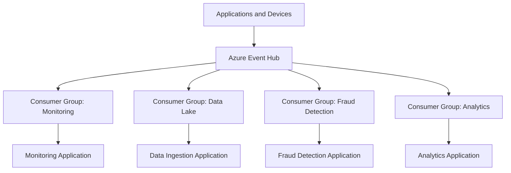

Without separate consumer groups, one application could affect another application's reading progress.

---

# 3. Consumer Group Core Flow

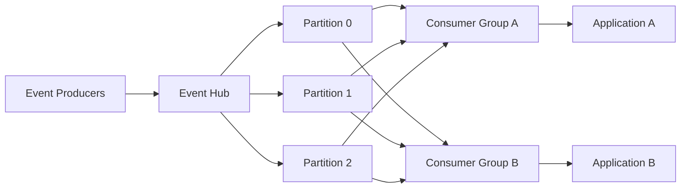

Both applications can read the same partitions, but each consumer group has an independent position.

---

# 4. Simple Analogy

Imagine a video recording watched by multiple teams:

```text
Event stream = Video recording

Consumer Group A = Security team
Consumer Group B = Analytics team
Consumer Group C = Compliance team
```

Each team can:

- Start at a different time
- Pause independently
- Resume independently
- Replay earlier content
- Process at a different speed

The event stream is shared, but each consumer group has its own viewing position.

---

# 5. Consumer Group vs Consumer

These terms are different.

| Term | Meaning |
|---|---|
| Consumer group | Logical view of the event stream |
| Consumer | Application or process that reads events |
| Consumer instance | Running copy of a consumer application |
| Partition | Ordered section of the event stream |
| Offset | Position within a partition |
| Checkpoint | Persisted processing position |

Example:

```text
Consumer Group: analytics
    Consumer Instance 1
    Consumer Instance 2
    Consumer Instance 3
```

The instances work together as one application under the same consumer group.

---

# 6. Consumer Group and Partitions

An Event Hub contains multiple partitions.

Within one consumer group, partitions are distributed among consumer instances for parallel processing.

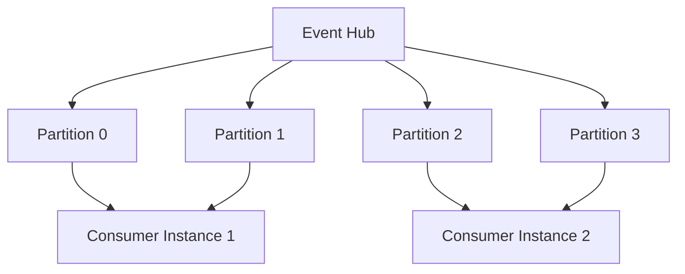

Each partition is generally actively processed by one consumer instance at a time within a consumer group. Microsoft recommends creating separate consumer groups for separate applications such as analytics, archival, and alerting. ([learn.microsoft.com](https://learn.microsoft.com/en-sg/azure/event-hubs/event-hubs-features?utm_source=openai))

---

# 7. Multiple Consumer Groups Reading the Same Event Hub

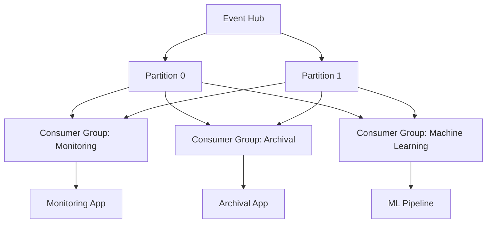

Each group receives an independent view of the stream.

For example:

```text
Monitoring group:
    Reads quickly and creates alerts

Archival group:
    Writes events to a data lake

Machine learning group:
    Builds features and predictions
```

One slow group does not change the checkpoint of another group.

---

# 8. Consumer Group Offsets

Each consumer group tracks its position separately for every partition.

```text
Partition 0:
    Event 0 -> Event 1 -> Event 2 -> Event 3 -> Event 4

Monitoring group:
    Current position = Event 4

Archival group:
    Current position = Event 2

Machine learning group:
    Current position = Event 3
```

The same partition can have different offsets for different consumer groups.

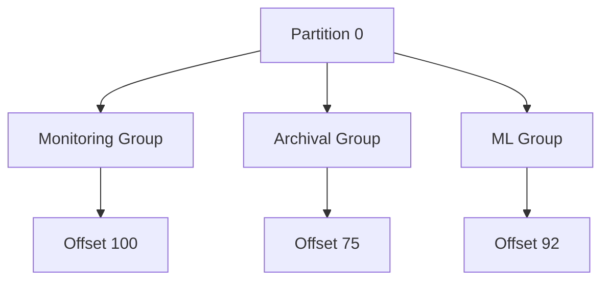

---

# 9. Consumer Group Processing Lifecycle

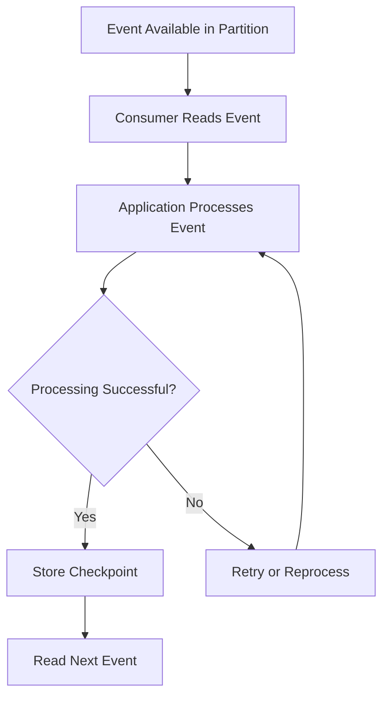

A checkpoint records the progress of a consumer group so processing can resume after a restart or failure.

---

# 10. Consumer Group and Checkpointing

Checkpointing is the process of storing the last successfully processed position.

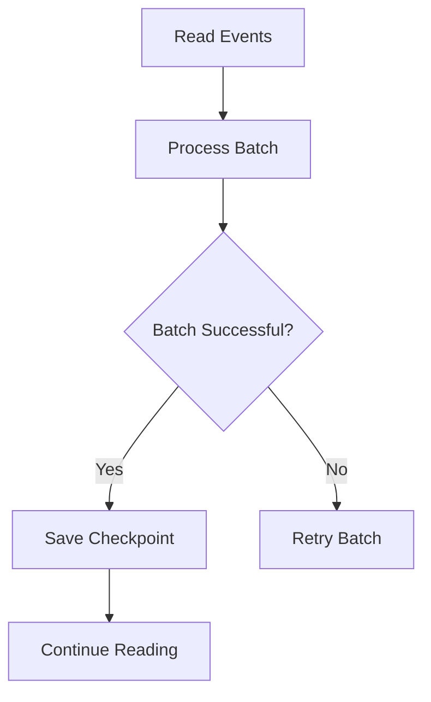

## Checkpoint Frequency Trade-Off

### Checkpoint Too Frequently

- More storage operations
- More coordination overhead
- Potentially lower throughput

### Checkpoint Too Rarely

- More events may be reprocessed after failure
- Recovery may take longer
- Duplicate side effects become more likely

> **Interview statement:**  
> Checkpoint after successful processing at a practical batch boundary, and make processing idempotent because events may be reprocessed after failure.

---

# 11. What Happens When a Consumer Crashes?

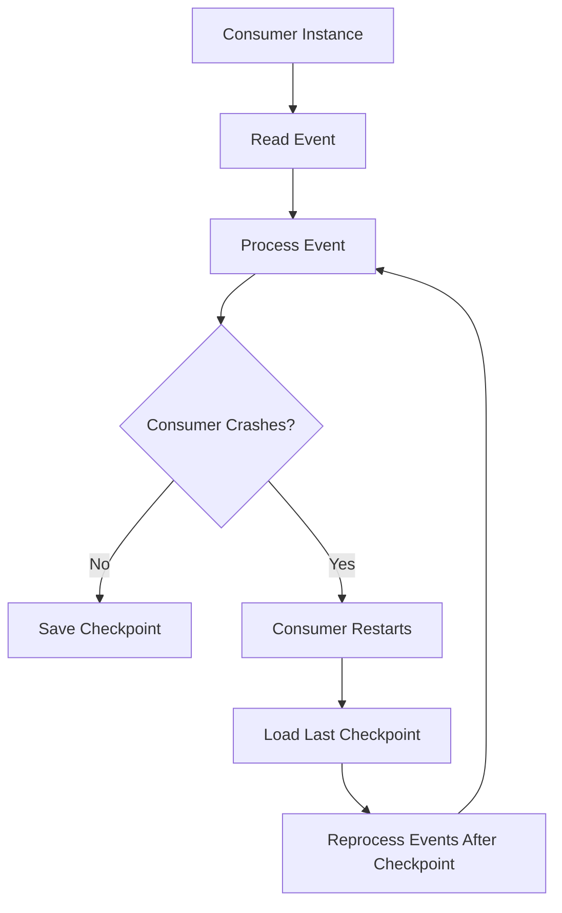

If the consumer crashes after processing an event but before saving its checkpoint, the event may be processed again.

Therefore:

- Use idempotent operations.
- Store event IDs where necessary.
- Use business keys.
- Avoid duplicate external side effects.

---

# 12. Consumer Group Scaling

A consumer group can scale horizontally by running multiple consumer instances.

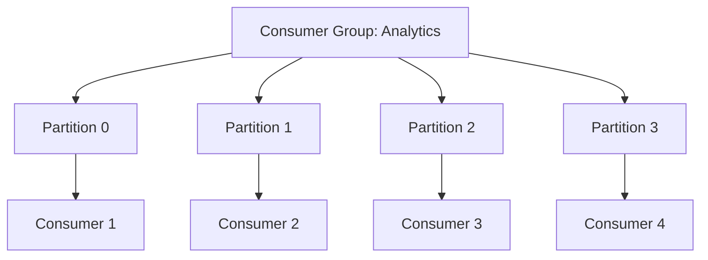

The maximum useful parallelism within one consumer group is generally limited by the number of partitions.

Example:

```text
4 partitions + 2 consumers
    -> Each consumer may process multiple partitions

4 partitions + 4 consumers
    -> One partition per consumer

4 partitions + 6 consumers
    -> At least 2 consumers may remain idle
```

---

# 13. Consumer Group Rebalancing

When consumer instances join, leave, or fail, partition ownership can change.

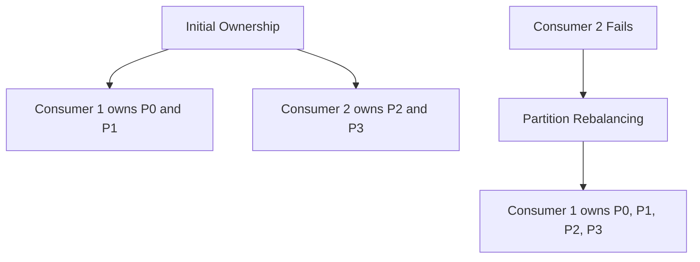

Rebalancing helps maintain processing availability, but it can cause:

- Temporary processing pauses
- Partition ownership changes
- Duplicate processing after restart
- Increased coordination activity

Consumers should be designed to handle rebalancing safely.

---

# 14. Consumer Groups and Replay

A consumer group can often replay events by starting from:

- The earliest retained event
- A specific offset
- A timestamp
- A stored checkpoint
- The latest available event

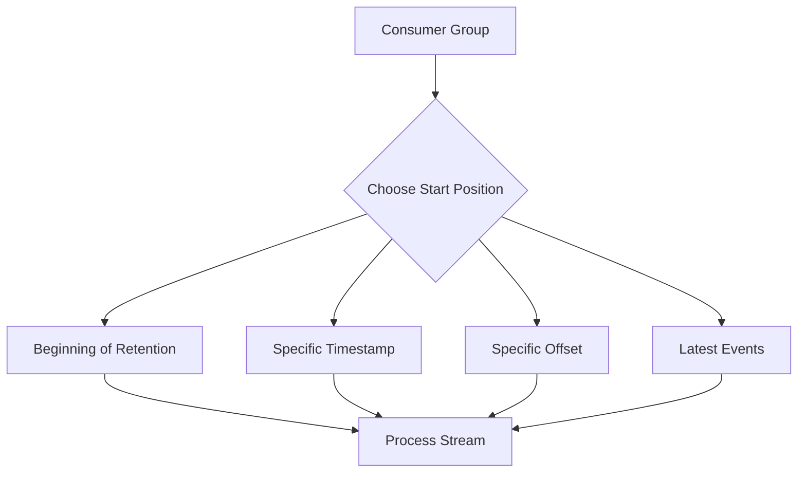

Replay is useful for:

- Rebuilding projections
- Reprocessing after a bug fix
- Backfilling analytics
- Recovering downstream systems
- Testing a new consumer

> **Important:** Replay can repeat business effects, so replaying consumers must be idempotent.

---

# 15. Consumer Group Isolation

Each consumer group has independent processing state.

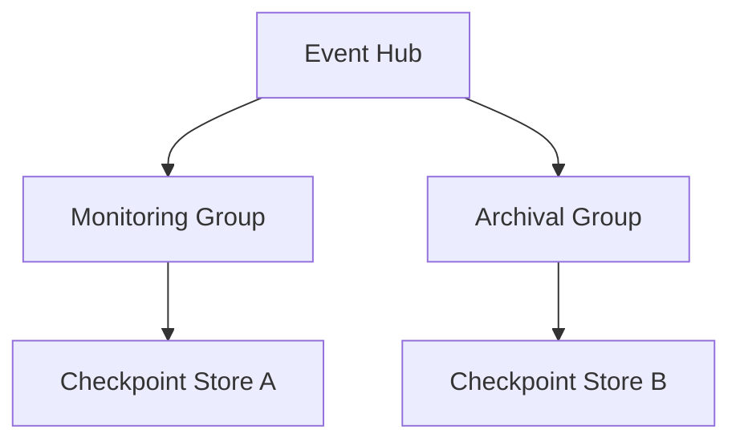

This provides logical isolation:

```text
Monitoring group is slow
    -> Archival group can continue independently

Archival group is stopped
    -> Monitoring group can continue independently
```

However, all groups still share the underlying Event Hub's service capacity and retention constraints.

---

# 16. Consumer Group vs Service Bus Subscription

These concepts are often confused.

| Consumer Group | Service Bus Topic Subscription |
|---|---|
| Used by Event Hubs and Kafka-style streams | Used by Service Bus topics |
| Independent view of a stream | Durable message entity containing message copies |
| Tracks offsets/checkpoints | Uses message settlement |
| Read position is central | Complete/abandon/dead-letter is central |
| Replay uses offsets/retention | Recovery typically uses retry/DLQ/resubmission |
| Best for streaming applications | Best for enterprise workflow messaging |

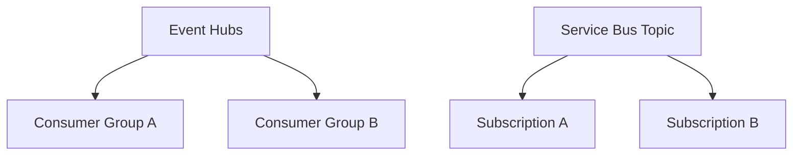

### Interview Answer

> An Event Hubs consumer group is an independent read view over a stream, while a Service Bus topic subscription is a brokered message entity with its own messages, settlement, retry, and dead-letter lifecycle.

---

# 17. Consumer Group vs Queue Consumer

## Queue Consumers

Multiple consumers usually compete for messages:

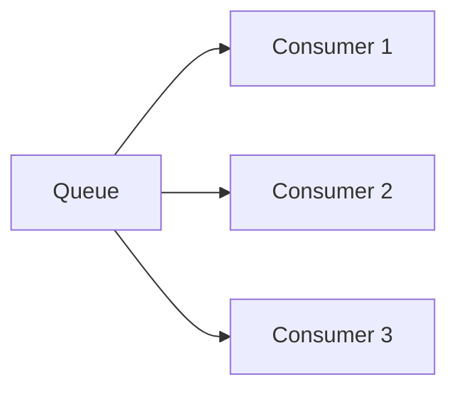

A message is generally processed by one competing consumer.

## Event Hubs Consumer Groups

Multiple consumer groups each read the stream independently:

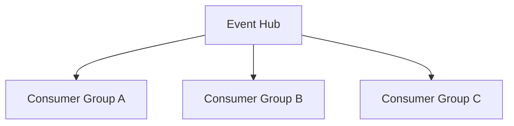

Each group can receive the same events.

---

# 18. Consumer Group Example: E-Commerce Platform

An e-commerce platform publishes order events to Event Hubs.

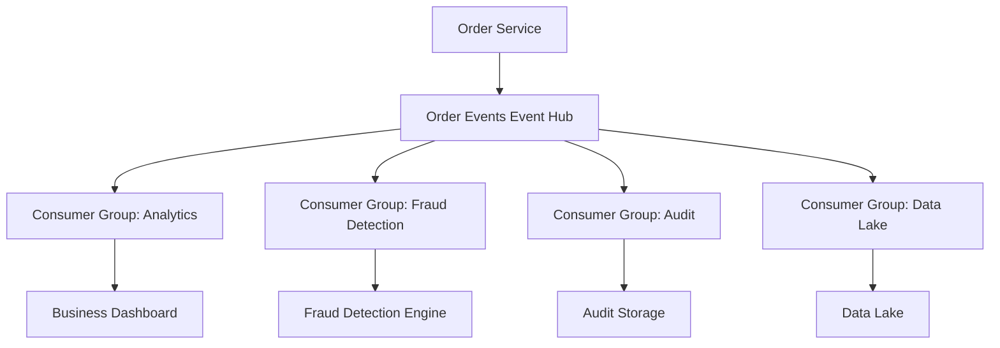

Each application has different processing requirements:

| Consumer Group | Purpose |
|---|---|
| Analytics | Real-time business dashboards |
| Fraud Detection | Detect suspicious behavior |
| Audit | Maintain compliance history |
| Data Lake | Store events for historical analysis |

---

# 19. Consumer Group Example: IoT Platform

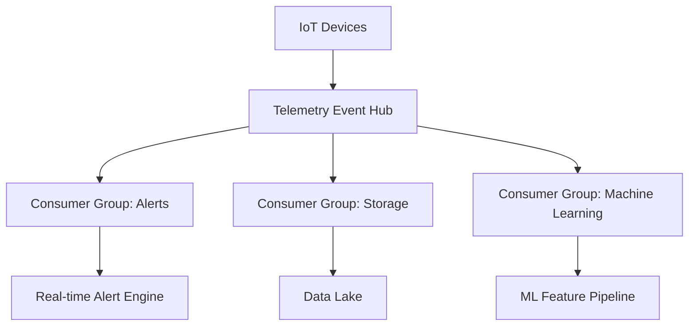

All three applications read the same telemetry stream independently.

---

# 20. Consumer Group Naming Strategy

Use names that describe the consuming application or purpose.

Good examples:

```text
analytics
fraud-detection
data-lake-ingestion
security-monitoring
billing-projection
audit-archive
```

Avoid vague names:

```text
consumer1
test
new-group
temp
```

A meaningful name helps operations teams understand:

- Who owns the group
- What it processes
- Which checkpoint belongs to it
- Which alert should be triggered
- Whether it can be safely deleted or reset

---

# 21. When Should You Create a Separate Consumer Group?

Create a separate consumer group when:

1. A different application needs the same event stream.
2. The application requires independent offsets.
3. The application processes at a different speed.
4. The application needs independent replay.
5. The application has a separate deployment lifecycle.
6. The application has a different checkpoint strategy.
7. The application has a different business owner.

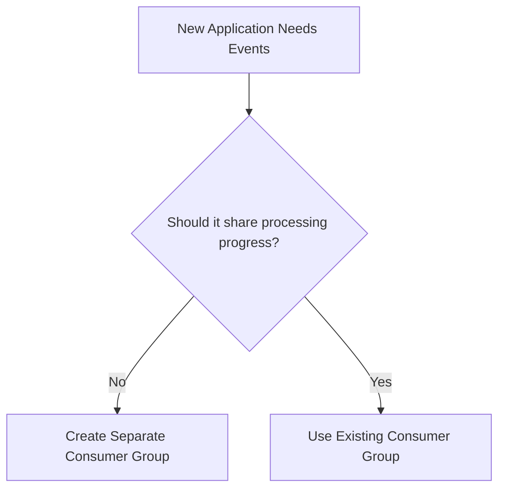

---

# 22. When Should You Not Create a Separate Consumer Group?

Do not create a separate group merely to add more worker instances for the same application.

For one logical application:

```text
Use one consumer group
    + multiple consumer instances
```

Do not use multiple consumer groups when:

- Workers perform the same application function.
- They should share partition ownership.
- They should not process every event independently.
- You only need horizontal scaling.

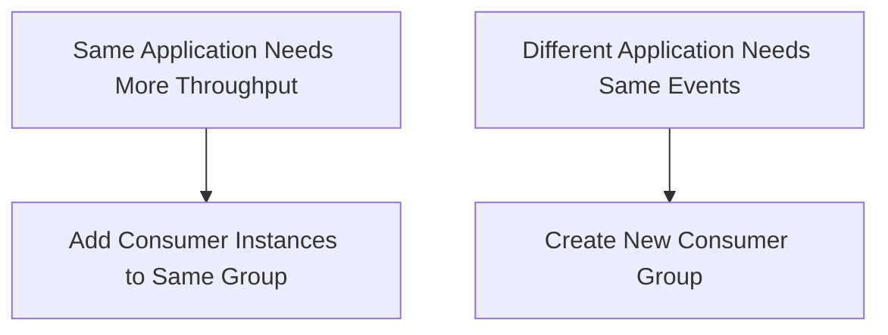

---

# 23. Consumer Group and Duplicate Processing

Duplicate processing can occur when:

- A consumer crashes before checkpointing.
- A checkpoint is saved after the business operation is retried.
- A partition is reassigned.
- A consumer is restarted.
- Events are intentionally replayed.

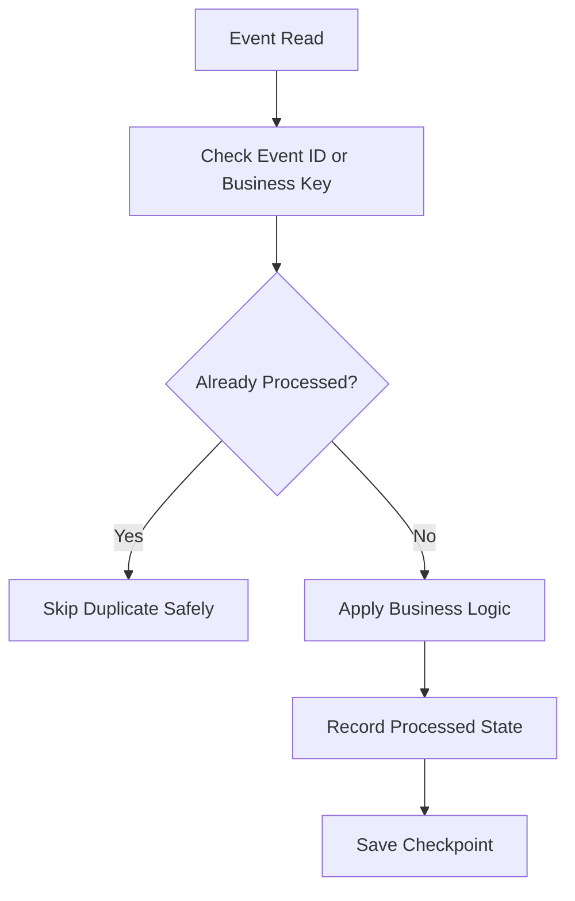

Recommended protections:

- Idempotent database updates
- Unique event ID table
- Upsert operations
- Business transaction keys
- External API idempotency keys
- Safe state transitions

---

# 24. Consumer Lag

**Consumer lag** is the difference between the latest event available in a partition and the position currently processed by a consumer group.

```mermaid
flowchart LR
    Latest[Latest Event Position] --> Difference[Consumer Lag]
    Current[Consumer Current Position] --> Difference
    Difference --> Metric[Lag Metric]
```

Example:

```text
Latest event offset = 10,000
Consumer offset     = 9,500
Consumer lag         = 500 events
```

High lag may indicate:

- Slow consumer processing
- Too few consumer instances
- Hot partition
- Downstream dependency problems
- Insufficient Event Hub capacity
- Large event payloads
- Checkpoint or storage issues

---

# 25. Consumer Group Monitoring

Monitor each consumer group independently.

Important metrics:

- Consumer lag
- Processing throughput
- Checkpoint age
- Failed event count
- Retry count
- Partition ownership
- Processing latency
- Rebalance frequency
- Last successful processing time

```mermaid
flowchart LR
    Group[Consumer Group] --> Metrics[Consumer Metrics]
    Metrics --> Lag[Consumer Lag]
    Metrics --> Errors[Processing Errors]
    Metrics --> Checkpoints[Checkpoint Age]

    Lag --> Monitor[Monitoring Platform]
    Errors --> Monitor
    Checkpoints --> Monitor

    Monitor --> Alerts[Operational Alerts]
```

Microsoft recommends using separate consumer groups for different applications and tracking each application's position independently. ([learn.microsoft.com](https://learn.microsoft.com/en-us/azure/event-hubs/event-hubs-about?utm_source=openai))

---

# 26. Consumer Group Security

Apply least-privilege access.

A consumer application should receive permission to read the required Event Hub, while administrative permissions should be limited.

Recommended practices:

- Use Microsoft Entra ID.
- Use managed identities.
- Apply Azure RBAC.
- Separate producer and consumer permissions.
- Avoid shared credentials.
- Protect checkpoint storage.
- Audit consumer group changes.
- Restrict management operations to administrators.

```mermaid
flowchart LR
    App[Consumer Application] --> Identity[Managed Identity]
    Identity --> Entra[Microsoft Entra ID]
    Entra --> RBAC[Azure RBAC]
    RBAC --> EH[Event Hub Consumer Group]
```

---

# 27. Common Consumer Group Mistakes

## Mistake 1: Using One Group for Unrelated Applications

Problem:

```text
Analytics, fraud, and archival use the same group
```

They interfere with one another's processing progress.

### Better

Create one group per independent application.

---

## Mistake 2: Creating a Group for Every Worker Instance

Problem:

```text
10 worker instances = 10 consumer groups
```

Each group may read the full stream, causing unnecessary processing.

### Better

```text
One logical application = one consumer group
Multiple instances = scale within that group
```

---

## Mistake 3: Ignoring Consumer Lag

A consumer may appear healthy while silently falling behind.

### Better

Monitor lag, checkpoint age, and processing latency.

---

## Mistake 4: Assuming Consumer Groups Guarantee Exactly-Once Processing

They do not.

### Better

Use idempotent event processing and deduplication.

---

## Mistake 5: Sharing Checkpoints Between Independent Applications

Different applications should not overwrite each other's progress.

### Better

Use independent checkpoint state per consumer group.

---

## Mistake 6: Creating Too Many Consumer Groups

Each consumer group creates another independent view of the stream and adds processing and capacity demand.

### Better

Create groups only for genuinely independent applications.

---

# 28. Interview Questions and Strong Answers

## Q1. What is a consumer group?

**Answer:**

A consumer group is an independent view of an event stream that allows an application to consume events independently while maintaining its own offsets and checkpoints.

---

## Q2. Why do we need consumer groups?

**Answer:**

They allow multiple independent applications to read the same event stream without sharing processing progress. For example, analytics, auditing, and data-lake ingestion can each process the same events independently.

---

## Q3. What is the difference between a consumer and a consumer group?

**Answer:**

A consumer is an application or process that reads events. A consumer group is the logical view and progress-tracking context shared by instances of one consuming application.

---

## Q4. Can two consumer groups read the same event?

**Answer:**

Yes. Each consumer group has an independent view of the stream and can read the same event using its own offset.

---

## Q5. Should every consumer instance use a separate consumer group?

**Answer:**

No. Instances of the same logical application should normally share one consumer group so partitions are distributed among them. Separate applications should use separate consumer groups.

---

## Q6. What happens if one consumer group is slow?

**Answer:**

That group develops consumer lag, but other consumer groups can continue processing independently. All groups still share the Event Hub's underlying service capacity and retention window.

---

## Q7. How do consumer groups support scaling?

**Answer:**

Multiple consumer instances within the same group can share partitions and process them in parallel. The number of partitions limits the maximum useful parallelism.

---

## Q8. What happens if a consumer crashes?

**Answer:**

Another instance can take ownership of its partitions, and processing resumes from the last checkpoint. Events after the last checkpoint may be reprocessed.

---

## Q9. What is consumer lag?

**Answer:**

Consumer lag is the difference between the latest available event position and the consumer group's current processing position.

---

## Q10. How do you prevent duplicate processing?

**Answer:**

Use idempotent business operations, event IDs, deduplication stores, database uniqueness constraints, upserts, and safe replay handling.

---

## Q11. Consumer group or Service Bus topic subscription?

**Answer:**

Use a consumer group for independent stream reading with offsets and checkpoints. Use a Service Bus topic subscription for brokered business messages requiring settlement, retries, and dead-lettering.

---

## Q12. What is the default consumer group in Azure Event Hubs?

**Answer:**

Azure Event Hubs provides a default consumer group named `$Default`. In production, create meaningful separate groups for independent applications rather than putting unrelated workloads into the default group. ([learn.microsoft.com](https://learn.microsoft.com/en-sg/azure/event-hubs/event-hubs-features?utm_source=openai))

---

# 29. 60-Second Interview Pitch

> A consumer group is an independent view of an Event Hubs or Kafka-style event stream. It allows a separate application to read the same events independently while maintaining its own offsets and checkpoints. For example, monitoring, archival, fraud detection, and analytics can each use separate consumer groups. Within one group, multiple consumer instances share partitions for parallel processing, while different groups each receive their own view of the stream. I create one consumer group per independent application, monitor consumer lag and checkpoint age, and make processing idempotent because events may be reprocessed after failures or replay.

---

# 30. Final Interview Checklist

- [ ] Define a consumer group clearly.
- [ ] Explain independent stream views.
- [ ] Explain separate offsets and checkpoints.
- [ ] Distinguish groups from consumers.
- [ ] Explain scaling within a group.
- [ ] Explain partition assignment.
- [ ] Explain replay and recovery.
- [ ] Mention consumer lag.
- [ ] Mention idempotency.
- [ ] Explain when to create separate groups.
- [ ] Compare consumer groups with Service Bus subscriptions.
- [ ] Mention the `$Default` group in Azure Event Hubs.

---

## Best One-Line Conclusion

> A consumer group is an independent stream-reading context that lets one application consume events separately, maintain its own checkpoints, and scale across multiple consumer instances.