# What Is a Partition?
## Detailed Interview Preparation Guide with Flow Charts

---

## 1. Direct Interview Answer

A **partition** is an independent, ordered, append-only sequence of messages or events inside a distributed event-streaming system such as Azure Event Hubs or Apache Kafka.

Partitions are used to:

- Scale event ingestion
- Enable parallel processing
- Preserve ordering for related events
- Distribute workload across consumers
- Track consumer progress using offsets

> **Interview one-liner:**  
> A partition is an ordered lane of events that enables parallel processing while guaranteeing order only within that lane.

---

## 2. Simple Analogy

Imagine a highway with multiple lanes:

```text
                 Event Stream
                      |
        +-------------+-------------+
        |             |             |
     Lane 1        Lane 2        Lane 3
   Partition 0   Partition 1   Partition 2
```

Each lane can carry traffic independently.

- More partitions are like more lanes.
- Events in the same partition preserve order.
- Events in different partitions may be processed in parallel.
- There is no guaranteed global order across all partitions.

---

## 3. Why Are Partitions Needed?

A single event stream can become a bottleneck if all producers and consumers use only one sequence.

Partitions solve this by dividing the stream into multiple independent sequences.

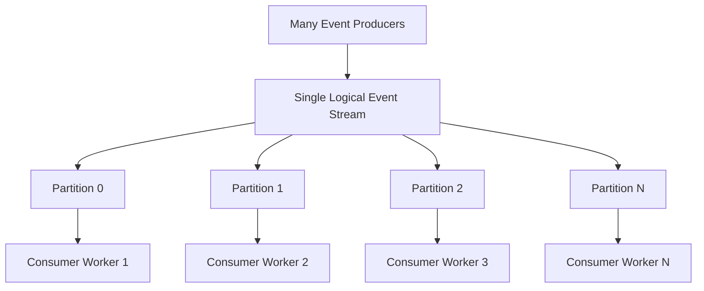

Benefits:

- Higher throughput
- Parallel processing
- Better horizontal scalability
- Ordered processing within each partition
- Independent consumer progress

---

# 4. Partition Architecture

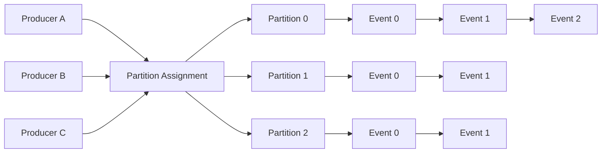

Each partition is an ordered sequence:

```text
Partition 0:
    Event A -> Event B -> Event C -> Event D

Partition 1:
    Event E -> Event F -> Event G

Partition 2:
    Event H -> Event I -> Event J
```

The order inside each partition is maintained independently.

---

# 5. Partition as an Append-Only Log

A partition behaves like an append-only log.

New events are added to the end:

```text
Partition 0

Offset:     0        1        2        3
          +--------+--------+--------+--------+
Events:   | EventA | EventB | EventC | EventD |
          +--------+--------+--------+--------+
                                           ^
                                      New events append here
```

Events are normally not removed immediately after consumption. Consumers track their position using an **offset**.

---

# 6. Partition Flow: Producer to Consumer

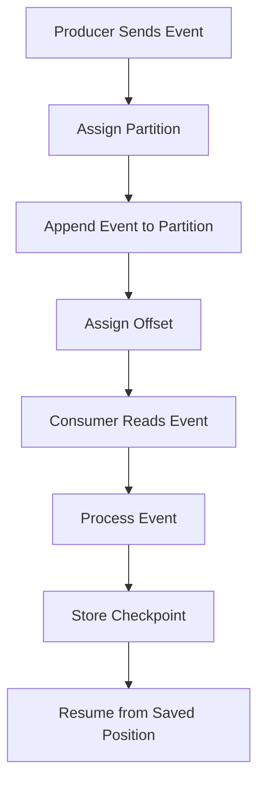

A consumer can restart from its last checkpoint instead of beginning from the start of the stream.

---

# 7. How Are Events Assigned to Partitions?

There are two common approaches:

1. **Partition key**
2. **Automatic distribution**, such as round-robin or service-managed assignment

---

## 7.1 Partition Key

A partition key is a value used to consistently route related events to the same partition.

Examples:

- `CustomerId`
- `OrderId`
- `DeviceId`
- `AccountId`
- `TenantId`

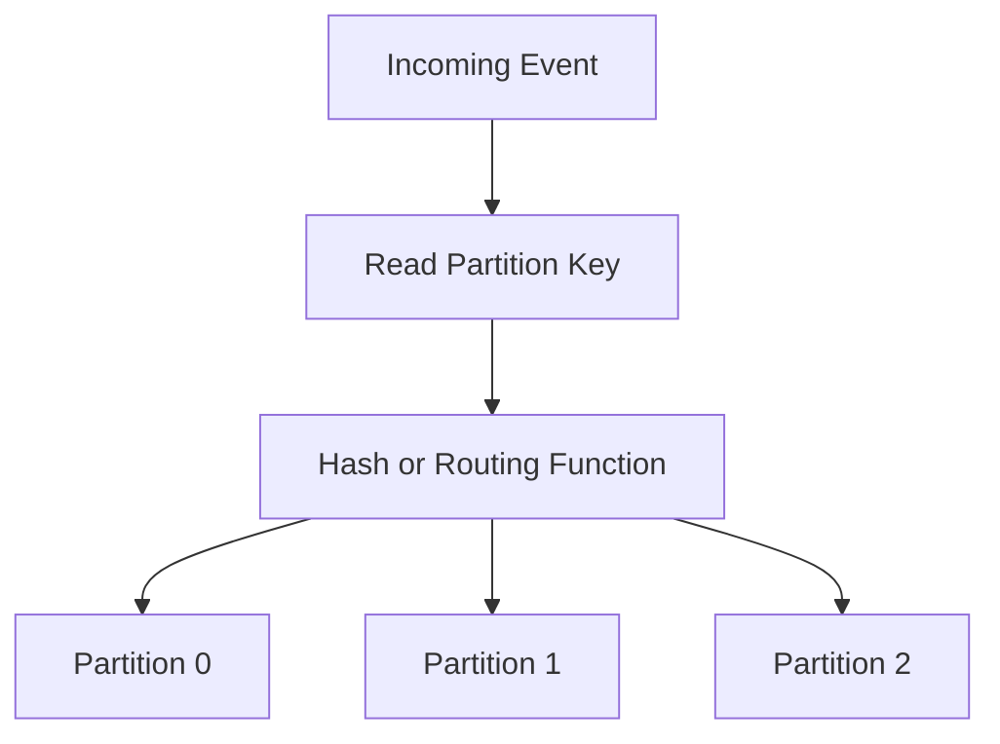

### Example

```text
Partition key = OrderId

Order-1001, Event 1 -> Partition 0
Order-1001, Event 2 -> Partition 0
Order-1001, Event 3 -> Partition 0

Order-2001, Event 1 -> Partition 2
Order-2001, Event 2 -> Partition 2
```

This allows events for the same order to remain ordered.

> **Interview statement:**  
> Use a stable partition key when related events must be processed in order.

---

## 7.2 Automatic Distribution

If the producer does not specify a partition key, the streaming platform may distribute events across available partitions.

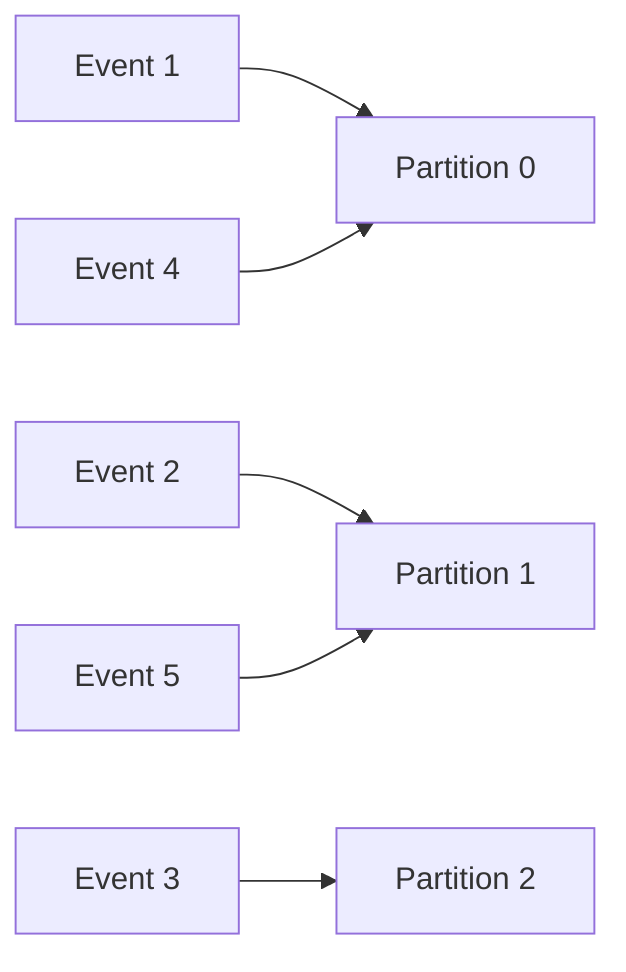

This can improve distribution, but it does not necessarily preserve ordering for events belonging to the same business entity.

---

# 8. Ordering Guarantees

## 8.1 Ordering Within a Partition

Events in one partition are read in sequence.

```text
Partition 0:

Event A -> Event B -> Event C -> Event D
```

A consumer reading Partition 0 sees the events in that order.

## 8.2 No Global Ordering Across Partitions

```text
Partition 0: A -> B -> C
Partition 1: X -> Y -> Z
Partition 2: M -> N -> O
```

There is no guaranteed global sequence such as:

```text
A -> X -> M -> B -> Y -> N
```

Different partitions can be processed at different speeds.

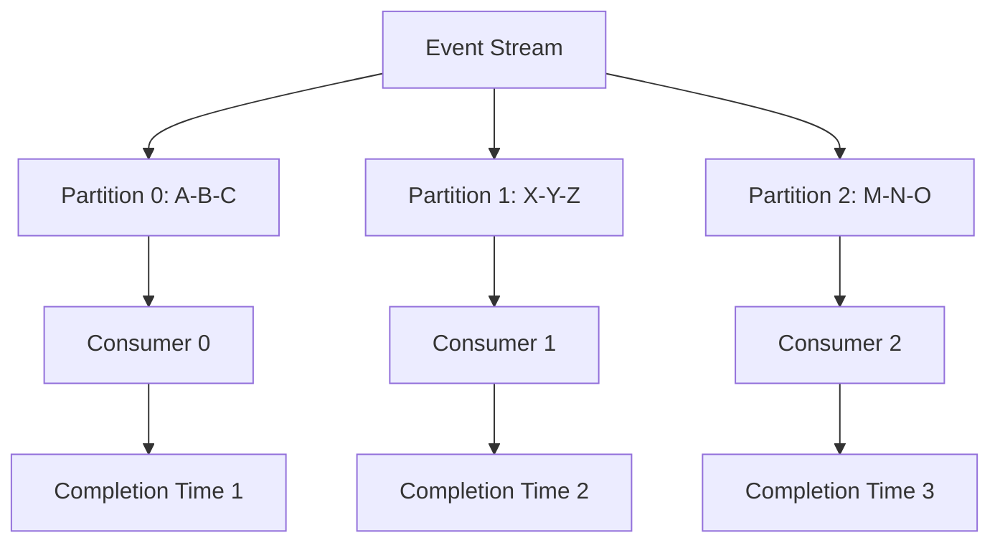

> **Interview one-liner:**  
> Partitions guarantee local ordering, not global ordering.

---

# 9. Partition-Based Parallelism

Partitions allow consumers to process different portions of a stream at the same time.

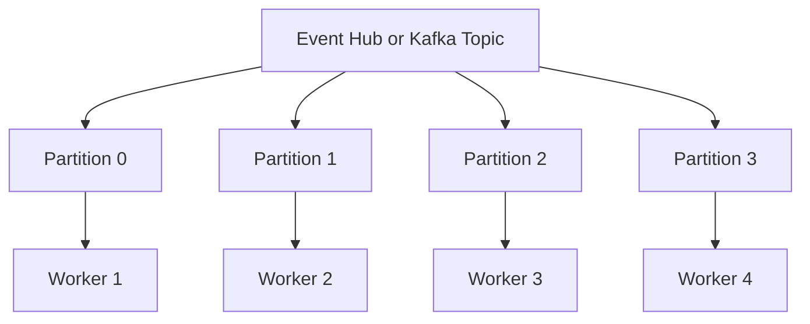

Without partitions:

```text
One stream -> One processing path -> Limited throughput
```

With partitions:

```text
Multiple partitions -> Multiple processing paths -> Higher throughput
```

---

# 10. Consumer Groups and Partitions

A consumer group is an independent view of the stream.

Within one consumer group, partitions are distributed among consumer instances.

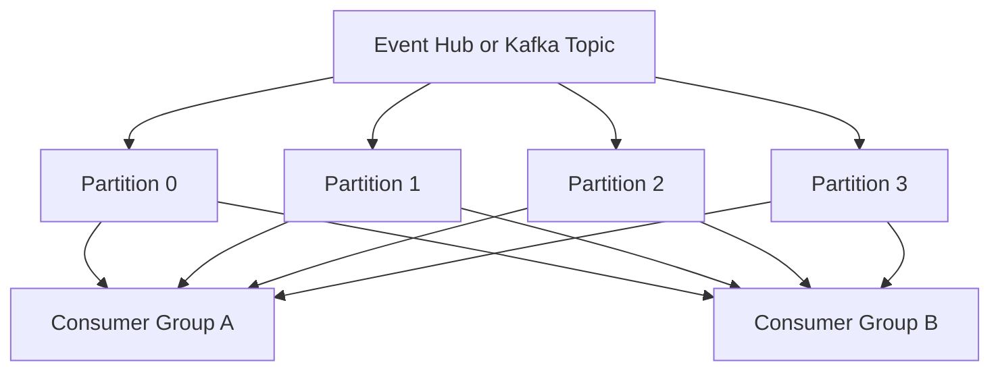

Each consumer group maintains its own reading position.

Example:

```text
Consumer Group A -> Real-time dashboard
Consumer Group B -> Data lake ingestion
Consumer Group C -> Machine learning pipeline
```

Each application can read the same events independently.

---

# 11. Partition Ownership Inside a Consumer Group

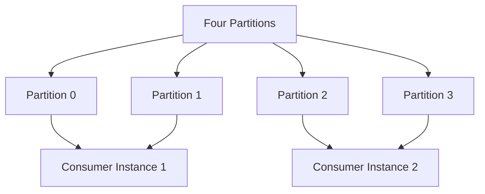

Consumer instances can share the partitions of a consumer group.

### Important Scaling Rule

If there are more consumer instances than partitions:

```text
Some consumer instances may have no partition assigned.
```

Example:

```text
4 partitions + 6 consumers
= At most 4 consumers actively process partitions
```

To use more consumer workers effectively, increase the number of partitions, assuming the workload and service limits justify it.

---

# 12. Partition Rebalancing

When consumers join, leave, or fail, partition ownership can be reassigned.

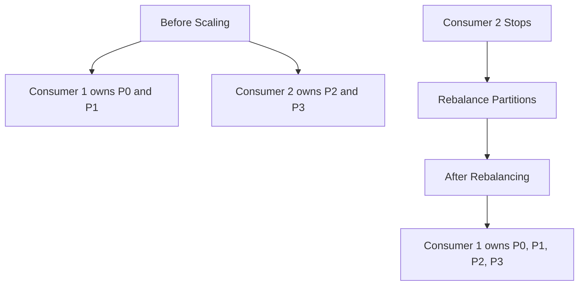

Rebalancing provides fault tolerance and allows the system to adapt to changes in consumer capacity.

During rebalancing, processing may temporarily pause or ownership may change.

---

# 13. Partition Offset

An **offset** identifies a consumer’s position within a partition.

```text
Partition 0:

Offset 0 -> Event A
Offset 1 -> Event B
Offset 2 -> Event C
Offset 3 -> Event D
```

A consumer might currently be at:

```text
Current offset = 2
Next event to process = Event C or Event D
```

The exact interpretation of the stored position depends on the client API, but the core concept is the same: the offset identifies progress within a partition.

---

# 14. Checkpointing

Checkpointing stores the consumer’s progress so it can recover after failure.

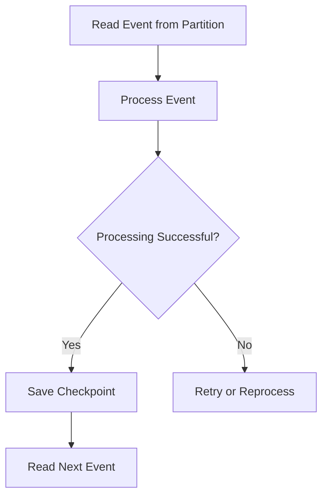

### Checkpoint Trade-Off

```text
Checkpoint too often:
    More storage and coordination overhead

Checkpoint too rarely:
    More events may be reprocessed after failure
```

> **Interview statement:**  
> Checkpoint only after successful processing, unless the application explicitly accepts data loss or uses another recovery strategy.

---

# 15. Failure and Reprocessing Flow

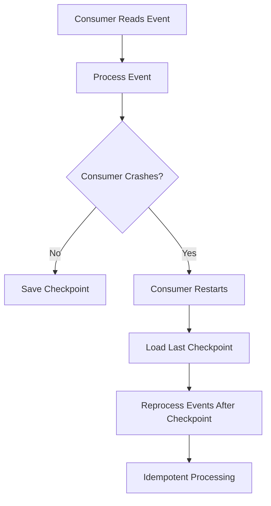

If a consumer processes an event but crashes before checkpointing, that event may be processed again.

Therefore, event consumers should be idempotent.

---

# 16. Partition and Idempotency

Duplicate processing can happen because of:

- Consumer crash
- Checkpoint failure
- Network failure
- Consumer rebalance
- Manual replay
- Retry after processing timeout

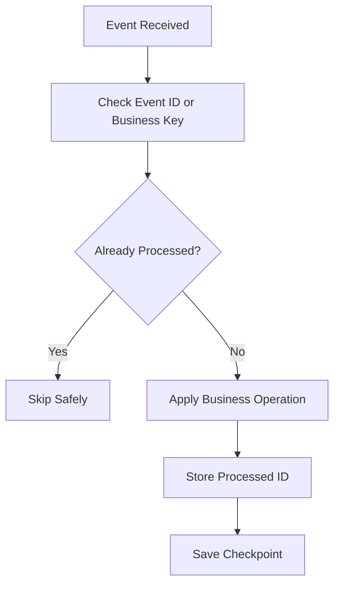

Recommended techniques:

- Store processed event IDs.
- Use business keys.
- Use database unique constraints.
- Use upsert operations.
- Use idempotency keys for external APIs.
- Make state transitions safe to repeat.

---

# 17. Hot Partition

A **hot partition** occurs when a disproportionate amount of traffic is routed to one partition.

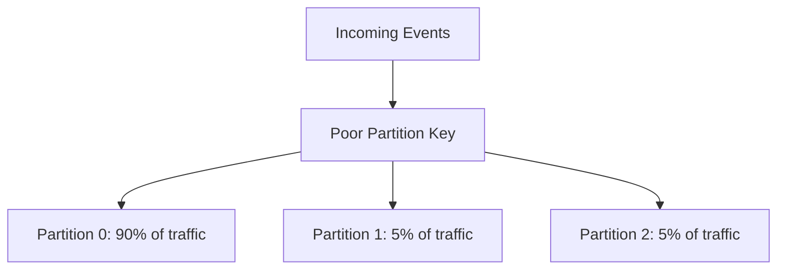

Consequences:

- Uneven throughput
- Increased latency
- Consumer lag
- Underused partitions
- Reduced scalability

## Example of a Bad Key

```text
Partition key = Country

US      -> 80% of all traffic
Canada  -> 10%
Others  -> 10%
```

If most events use the same key, one partition can become overloaded.

---

# 18. Choosing a Good Partition Key

A good partition key should:

- Preserve required business ordering
- Distribute traffic evenly
- Have enough unique values
- Remain stable for the entity lifetime
- Avoid concentrating most traffic on one key

Examples:

| Requirement | Possible Partition Key |
|---|---|
| Order events must be ordered | `OrderId` |
| Device readings must be ordered | `DeviceId` |
| Account transactions must be ordered | `AccountId` |
| Customer activity must be ordered | `CustomerId` |
| No entity ordering required | Automatic distribution |

> **Important:** Do not use partitions as a security or tenant-isolation boundary. Partitions are for scaling and processing organization, not authorization or data isolation.

---

# 19. Partition Count

Partition count determines how much parallelism is available.

```text
More partitions:
    More potential parallelism
    More consumer distribution
    More partition management complexity

Fewer partitions:
    Simpler design
    Lower parallelism ceiling
    Greater risk of bottlenecks
```

## Partition Planning Flow

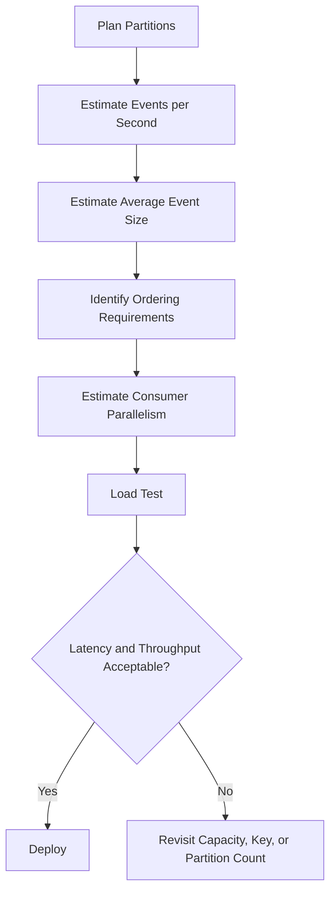

Partition count should be based on:

- Ingress volume
- Egress volume
- Event size
- Consumer processing rate
- Required parallelism
- Ordering requirements
- Service tier and capacity
- Expected growth

---

# 20. More Partitions Do Not Automatically Mean More Capacity

Partitions provide potential parallelism, but total capacity is also limited by:

- Service capacity allocation
- Throughput units or equivalent capacity
- Network bandwidth
- Consumer processing speed
- Storage and checkpoint performance
- Downstream dependency limits

```text
More partitions + insufficient service capacity
    = No guaranteed throughput improvement
```

> **Interview statement:**  
> Partitions enable parallelism, but total throughput also depends on allocated capacity and consumer performance.

---

# 21. Partition vs Consumer Group

| Partition | Consumer Group |
|---|---|
| Physical/logical stream segment | Independent view of the stream |
| Provides ordering boundary | Provides independent consumption |
| Enables parallelism | Allows multiple applications to read the same data |
| Has offsets | Stores offsets for its own consumers |
| Belongs to an event hub/topic | Reads from the event hub/topic |

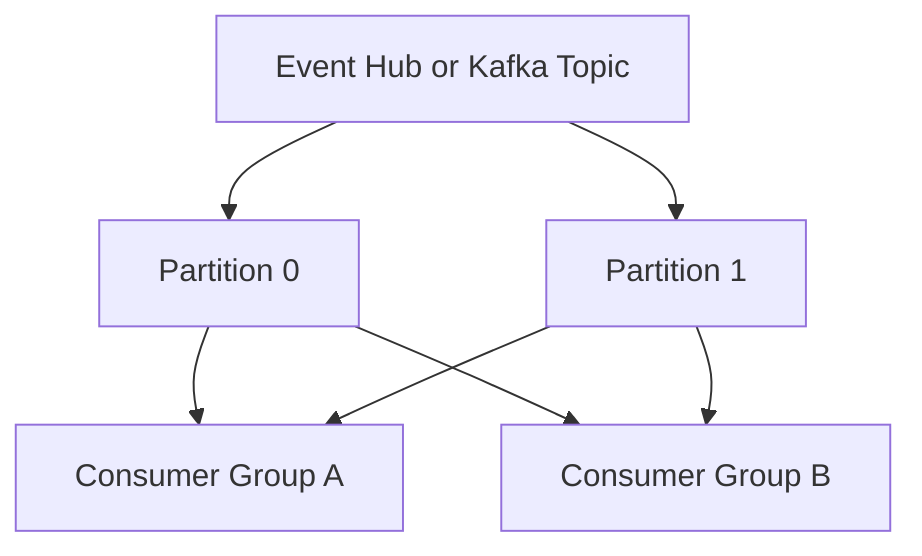

---

# 22. Partition vs Queue

| Partition | Queue |
|---|---|
| Part of a stream | Messaging entity |
| Append-only event log | Work/message buffer |
| Consumers track offsets | Consumers receive and settle messages |
| Replay from retained position | Usually complete, retry, or dead-letter |
| Ordering within partition | Ordering depends on broker and consumer model |
| Best for telemetry and streams | Best for commands and tasks |

Use a partitioned event stream for:

- IoT telemetry
- Logs
- Clickstream
- Metrics
- Real-time analytics

Use a queue for:

- Payment commands
- Image processing tasks
- Invoice generation
- Background jobs
- Workflow steps

---

# 23. Partition in Azure Event Hubs

In Azure Event Hubs:

- An event hub contains one or more partitions.
- Each partition is an ordered sequence of events.
- Events are assigned using a partition key or service-managed distribution.
- Consumers read events using offsets.
- Consumer groups provide independent views.
- Checkpointing helps consumers resume after failure.
- Ordering is guaranteed within a partition.

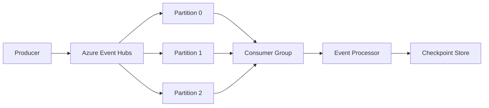

---

# 24. Partition in Apache Kafka

In Apache Kafka:

- A topic is divided into partitions.
- Each partition is an ordered log.
- Records with the same key are normally routed consistently to the same partition.
- Consumer groups divide partitions among consumers.
- Consumers track offsets.
- Kafka guarantees ordering within a topic partition.

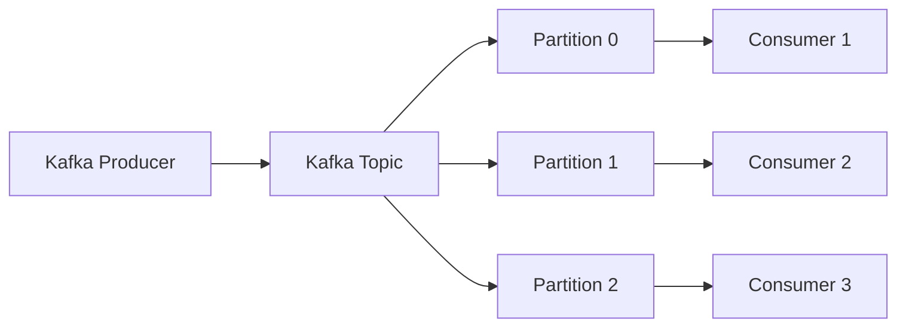

---

# 25. Event Hubs and Kafka Partition Comparison

| Area | Azure Event Hubs | Apache Kafka |
|---|---|---|
| Partition purpose | Scaling and ordered streaming | Scaling and ordered streaming |
| Partitioned entity | Event hub | Topic |
| Consumer grouping | Consumer groups | Consumer groups |
| Position tracking | Offset/checkpoint | Offset commit |
| Ordering | Within partition | Within partition |
| Key-based routing | Partition key | Record key |
| Replay | Read from retained offsets | Read from retained offsets |
| Operational model | Azure-managed service | Self-managed or managed Kafka service |

---

# 26. Real-World Example: IoT Devices

Suppose thousands of devices send temperature readings.

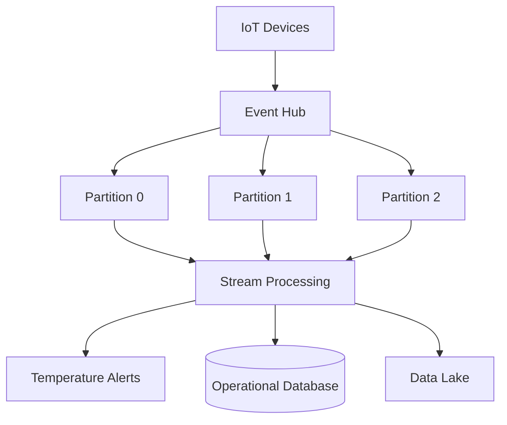

Use:

```text
Partition key = DeviceId
```

This helps preserve the order of readings for each device.

---

# 27. Real-World Example: Order Events

Events:

```text
OrderCreated
PaymentAuthorized
InventoryReserved
OrderShipped
```

If order-specific ordering is required:

```text
Partition key = OrderId
```

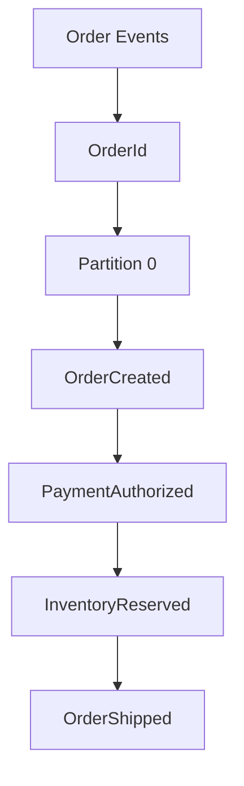

However, if the workflow needs richer business-message features such as message settlement, retries, and dead-lettering, a Service Bus session-enabled queue or topic subscription may be more appropriate.

---

# 28. Common Partition Anti-Patterns

## 28.1 Using One Partition for Everything

Problems:

- No parallelism
- Low throughput ceiling
- Single processing bottleneck

## 28.2 Using a Low-Cardinality Key

Example:

```text
Partition key = Region
```

If most traffic comes from one region, one partition becomes hot.

## 28.3 Expecting Global Ordering

Partitions do not automatically provide one global order.

## 28.4 Changing the Key Randomly

Changing the partition key can cause related events to route to different partitions.

## 28.5 Using Partitions for Security Isolation

Partitions are not an authorization boundary.

## 28.6 Creating Too Many Partitions Without Planning

Too many partitions can increase:

- Consumer coordination
- Checkpoint overhead
- Monitoring complexity
- Cost or capacity planning difficulty

## 28.7 Ignoring Consumer Lag

A partition may be accepting events successfully while its consumer falls behind.

---

# 29. Monitoring Partitions

Monitor:

- Events per partition
- Bytes per partition
- Consumer lag
- Processing latency
- Partition skew
- Failed processing attempts
- Checkpoint age
- Rebalance frequency
- Hot partition alerts

```mermaid
flowchart LR
    Partitions[Partition Metrics] --> Monitor[Monitoring Platform]
    Monitor --> Lag[Consumer Lag]
    Monitor --> Skew[Partition Skew]
    Monitor --> Alerts[Alerts]
```

### Useful Alerts

- One partition has significantly more traffic than others.
- Consumer lag exceeds the processing SLA.
- Checkpoints have not advanced.
- One consumer instance repeatedly fails.
- Partition ownership keeps changing.
- Event processing latency increases.

---

# 30. How to Handle a Hot Partition

Possible solutions:

1. Choose a better-distributed partition key.
2. Use a higher-cardinality key.
3. Remove the key if ordering is unnecessary.
4. Increase service capacity.
5. Increase partition count where supported.
6. Split high-volume entities carefully.
7. Reduce downstream processing cost.
8. Batch events efficiently.
9. Scale consumer instances.
10. Load-test the revised design.

```mermaid
flowchart TD
    Hot[Hot Partition Detected] --> Analyze[Analyze Key Distribution]
    Analyze --> Ordering{Is Ordering Required?}
    Ordering -- No --> RemoveKey[Use Automatic Distribution]
    Ordering -- Yes --> BetterKey[Choose Higher-Cardinality Stable Key]
    RemoveKey --> Test[Load Test]
    BetterKey --> Test
    Test --> Deploy[Deploy Improved Routing]
```

---

# 31. Interview Questions and Strong Answers

## Q1: What is a partition?

**Answer:**

A partition is an ordered, append-only sequence of events within a distributed event stream. It enables parallel processing and provides an ordering boundary.

---

## Q2: Why are partitions used?

**Answer:**

Partitions allow producers and consumers to scale horizontally by dividing one logical stream into multiple independently processed sequences.

---

## Q3: Is ordering guaranteed across partitions?

**Answer:**

No. Ordering is guaranteed only within an individual partition.

---

## Q4: How do you preserve order for a customer or order?

**Answer:**

Use a stable partition key such as `CustomerId` or `OrderId` so related events are routed to the same partition.

---

## Q5: What happens if two consumers read the same partition?

**Answer:**

Within a consumer group, partition ownership is generally assigned to one active consumer at a time. Across different consumer groups, each group can independently read the partition.

---

## Q6: Can you have more consumers than partitions?

**Answer:**

Yes, but extra consumers may remain idle because a partition generally has only one active owner within a consumer group.

---

## Q7: What is a hot partition?

**Answer:**

A hot partition receives a disproportionate amount of traffic, causing uneven load, increased latency, and consumer lag.

---

## Q8: How do you solve a hot partition?

**Answer:**

Review the partition key, use a higher-cardinality key, remove the key if ordering is unnecessary, increase capacity or partitions where supported, and load-test the change.

---

## Q9: What is the difference between partition and consumer group?

**Answer:**

A partition is a stream segment used for ordering and parallelism. A consumer group is an independent view of the stream that maintains its own reading position.

---

## Q10: What is the role of an offset?

**Answer:**

An offset identifies a consumer’s position within a partition so it can resume from the correct location after restart or failure.

---

## Q11: Does adding partitions automatically improve performance?

**Answer:**

Not always. More partitions provide more potential parallelism, but total capacity also depends on service limits, consumer speed, partition-key distribution, network, and downstream dependencies.

---

## Q12: Are partitions a security boundary?

**Answer:**

No. Partitions organize and scale event processing. Authorization and tenant isolation should be implemented using identity, access control, separate entities, or application-level controls.

---

# 32. 60-Second Interview Pitch

> A partition is an ordered, append-only lane within an event-streaming system such as Azure Event Hubs or Kafka. Partitions allow the stream to scale because producers can write to multiple partitions and consumers can process those partitions in parallel. Ordering is guaranteed only within one partition, so if I need order for an entity such as an order, customer, or device, I use a stable partition key. I also monitor partition distribution and consumer lag because a poor key can create a hot partition. Consumers track progress using offsets and checkpoints, and processing must be idempotent because events may be reprocessed after failures.

---

# 33. Final Interview Checklist

- [ ] Define a partition as an ordered append-only sequence.
- [ ] Explain why partitions enable parallelism.
- [ ] Mention ordering only within a partition.
- [ ] Explain partition keys.
- [ ] Explain offsets and checkpoints.
- [ ] Explain consumer groups.
- [ ] Mention hot partitions and skew.
- [ ] Explain that more partitions do not guarantee more capacity.
- [ ] Mention idempotent consumers.
- [ ] Clarify that partitions are not security boundaries.
- [ ] Compare partitions with queues and sessions.

---

## Best One-Line Conclusion

> A partition is an ordered stream segment that enables scalable parallel event processing while preserving ordering only for events within that partition.