# Durable Functions  
## Detailed Interview Preparation Guide with Flow Charts

## 1) What are Durable Functions?

**Durable Functions** is an extension of Azure Functions that lets you build **stateful workflows** in a serverless model.

Normally, Azure Functions are stateless and event-driven. Durable Functions adds orchestration capabilities so you can coordinate multiple function executions reliably over time.

### Simple Interview Definition

> Durable Functions is an Azure Functions extension for writing reliable, stateful, serverless workflows using code-based orchestration patterns.

---

## 2) Why Durable Functions?

Use Durable Functions when your process needs:
- Multiple steps
- State tracking between steps
- Retries and compensation
- Parallel fan-out/fan-in execution
- Human approval/wait states
- Long-running workflows
- Reliable checkpointing and resume

Typical examples:
- Order processing pipeline
- Insurance claim workflow
- Approval process
- Data processing pipelines
- Scheduled chained operations
- Provisioning workflows

---

## 3) Core Components

Durable Functions typically involve these function types:

1. **Orchestrator Function**
   - Defines the workflow steps and sequence
   - Coordinates activity calls, timers, external events

2. **Activity Function**
   - Performs actual work (e.g., DB call, API call, compute logic)
   - Usually stateless and side-effecting work happens here

3. **Client Function**
   - Starts orchestration instances
   - Queries status
   - Sends external events
   - Terminates/restarts instances

4. **Durable Entity (optional)**
   - Represents small, addressable stateful objects
   - Useful for counters, aggregates, resource coordination

---

## 4) High-Level Durable Workflow Flow Chart

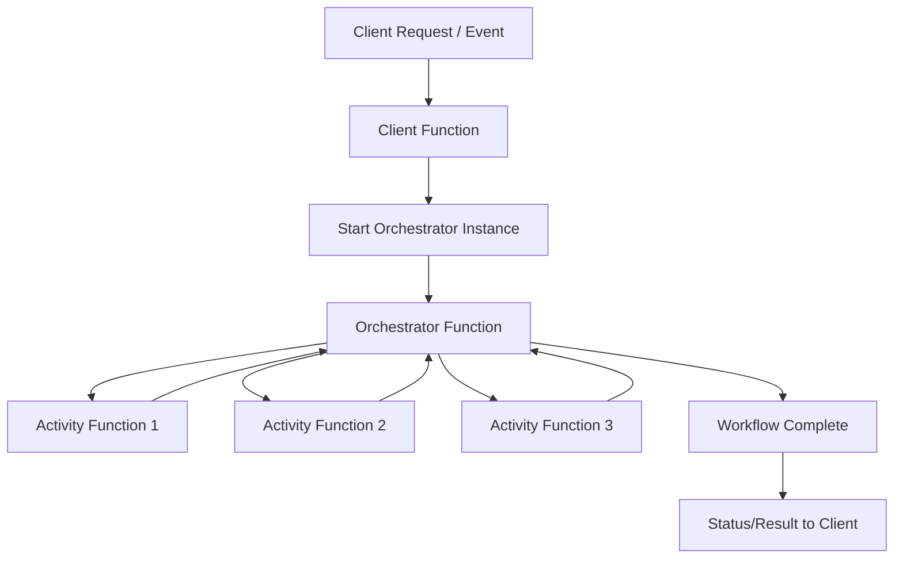

---

## 5) How Durable Functions Work Internally (Interview Depth)

Durable Functions uses an event-sourced execution model under the hood:
- Orchestrator schedules work
- Runtime stores execution history/state checkpoints
- On resume/replay, orchestrator reconstructs state from history
- Long-running processes survive restarts/redeployments

### Internal Reliability Flow

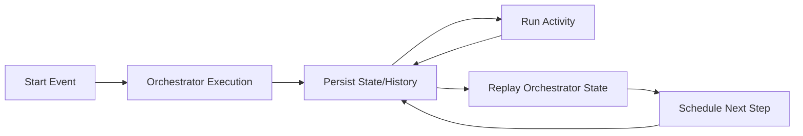

Key benefit:
- You don’t manually build state-machine persistence logic.

---

## 6) Durable Function Patterns (Very Important for Interviews)

## 6.1 Function Chaining
Sequential execution where step B starts after step A, etc.

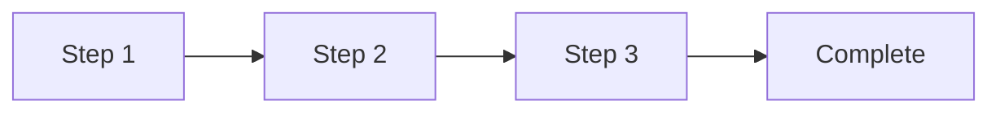

Use cases:
- ETL pipeline
- Multi-step onboarding
- Sequential validation/processing

---

## 6.2 Fan-out / Fan-in
Run multiple activities in parallel, then aggregate results.

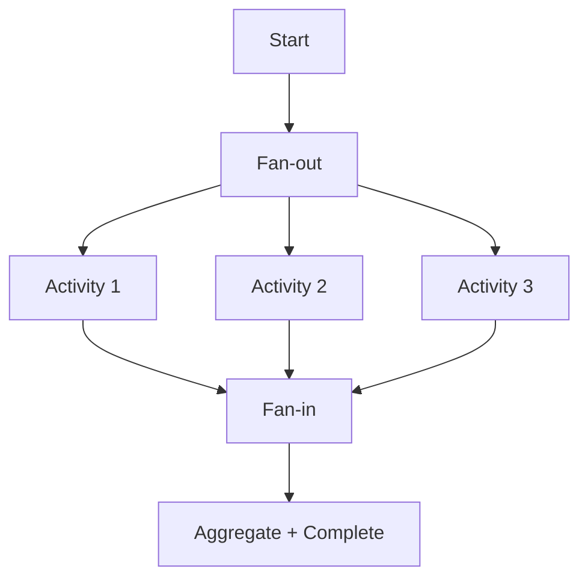

Use cases:
- Parallel file/image processing
- Bulk API calls
- Parallel scoring/computation

---

## 6.3 Async HTTP API Pattern
Start long-running job and return status endpoint to poll.

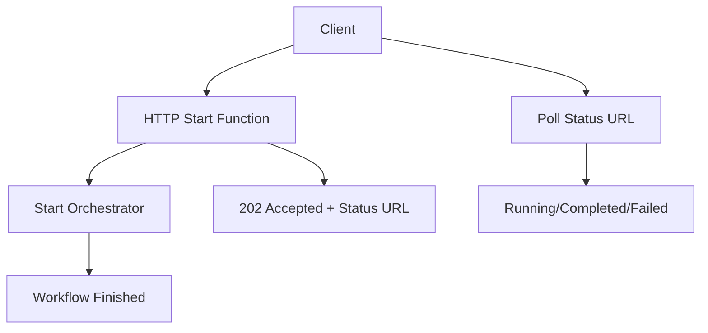

Use cases:
- Report generation
- Export jobs
- Long-running batch tasks

---

## 6.4 Monitor Pattern
Recurring check loop until condition is met or timeout occurs.

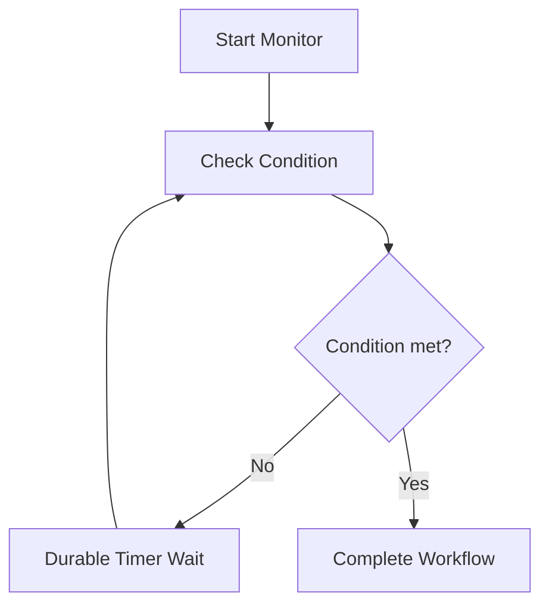

Use cases:
- Order shipment tracking
- External job completion monitoring
- SLA threshold watch

---

## 6.5 Human Interaction Pattern
Workflow pauses waiting for external approval/rejection event.

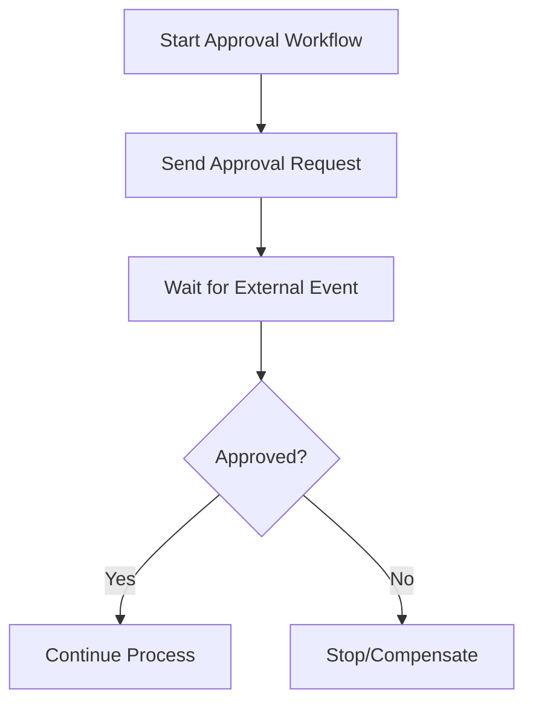

Use cases:
- Finance approvals
- Access provisioning approvals
- Compliance workflows

---

## 7) Durable Entities (State in Serverless)

Durable Entities provide lightweight, addressable state objects.

Examples:
- Inventory counter
- Shopping cart-like aggregate
- Rate limiter token bucket
- Shared workflow flags

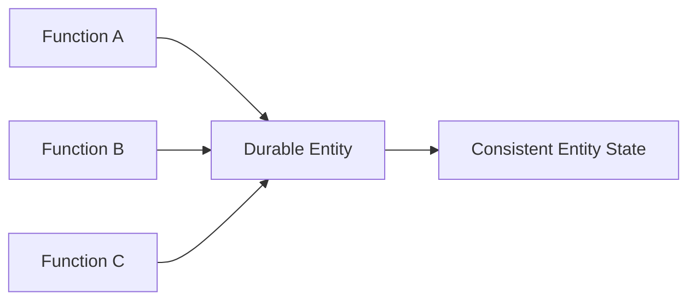

Use when:
- You need small mutable state units
- Coordination between functions
- Avoiding external DB round-trip for simple state ops (case dependent)

---

## 8) Durable vs Normal Azure Functions

| Aspect | Normal Functions | Durable Functions |
|---|---|---|
| State | Stateless | Stateful orchestration supported |
| Workflow | Single-step/event handling | Multi-step reliable orchestration |
| Long-running | Limited pattern support | Native long-running coordination |
| Human interaction | Manual implementation | Built-in wait-for-event patterns |
| Parallel coordination | Manual | Fan-out/fan-in pattern support |
| Checkpointing | Manual | Built-in durable state persistence |

---

## 9) Durable Functions vs Logic Apps (Common Interview Comparison)

| Aspect | Durable Functions | Logic Apps |
|---|---|---|
| Development style | Code-first | Low-code/designer-first |
| Control | High developer control | Fast integration with connectors |
| Best for | Custom workflow logic | Integration-heavy workflows |
| Complexity handling | Strong for custom orchestration | Strong for SaaS/system orchestration |
| Team preference | Developers | Integration/business teams |

Good interview answer:
> Choose Durable Functions for code-centric, custom orchestration logic; choose Logic Apps for connector-rich, low-code integration workflows.

---

## 10) Real-World Example: E-commerce Order Orchestration

Steps:
1. Validate order
2. Reserve inventory
3. Process payment
4. Create shipment
5. Send notification
6. Compensate if any critical step fails

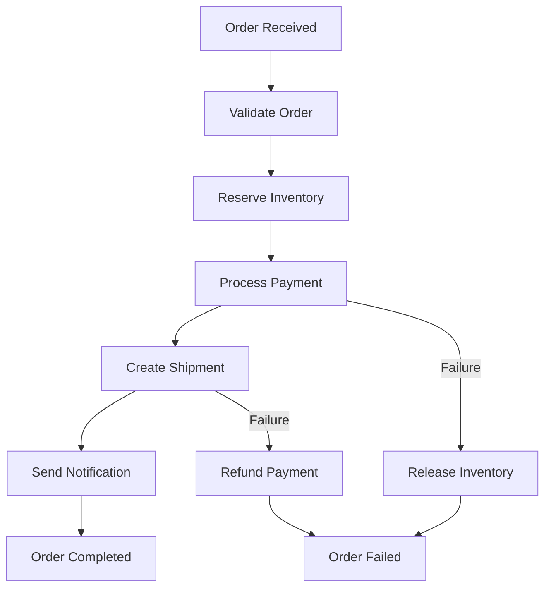

This is a great interview example because it shows orchestration + compensation logic.

---

## 11) Error Handling & Compensation

Durable orchestrations should include:
- Retry policies per activity
- Timeout handling
- Compensation actions (undo/rollback-like business actions)
- Dead-letter/error notifications
- Idempotent activity design

### Resiliency Flow

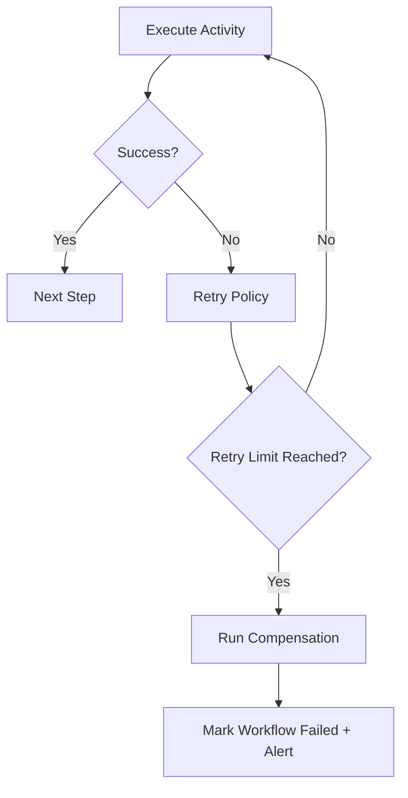

---

## 12) Deterministic Orchestrator Code (Critical Interview Point)

Orchestrator logic must be deterministic because it can replay.
Avoid non-deterministic operations directly in orchestrator such as:
- Current time calls (unless durable APIs provided)
- Random generation
- Direct external I/O calls
- Non-replay-safe side effects

Do side-effecting work in **activity functions**, not orchestrator.

---

## 13) Security Best Practices

- Use Managed Identity for resource access
- Store secrets in Key Vault
- Secure HTTP starter endpoints (Entra ID/OAuth/API gateway)
- Apply least-privilege RBAC
- Protect status query endpoints appropriately
- Log securely without exposing sensitive data

---

## 14) Monitoring Durable Workflows

Track:
- Orchestration instance status
- Step duration
- Retries and failures
- Pending external events
- Timeout rates
- Compensation frequency

Use:
- Application Insights
- Azure Monitor alerts
- Correlation IDs across activities

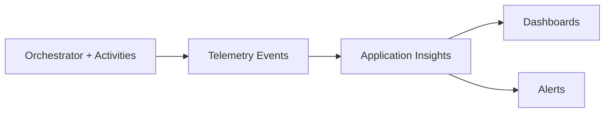

---

## 15) CI/CD and Versioning Considerations

For durable workflows:
- Version orchestration contracts carefully
- Avoid breaking in-flight instances
- Use deployment strategy for backward compatibility
- Validate replay behavior in testing
- Prefer safe rollout (staging/canary where possible)

Interview point:
Long-running orchestration instances can span deployments, so versioning strategy matters more than in short-lived stateless functions.

---

## 16) Common Interview Questions + Strong Answers

### Q1: What are Durable Functions?
**Answer:** An Azure Functions extension for writing reliable, stateful, serverless workflows using orchestrator, activity, and client functions.

### Q2: Why use Durable Functions?
**Answer:** To manage long-running, multi-step, retryable, and stateful workflows without manually implementing workflow state persistence.

### Q3: Difference between orchestrator and activity function?
**Answer:** Orchestrator controls workflow sequence/state; activity functions do actual side-effecting work.

### Q4: What is fan-out/fan-in?
**Answer:** Run tasks in parallel and aggregate results once all tasks complete.

### Q5: How does Durable Functions survive restarts?
**Answer:** Runtime persists workflow history/state and replays orchestration deterministically.

### Q6: When to choose Durable Functions over Logic Apps?
**Answer:** Choose Durable Functions for code-first custom orchestration; choose Logic Apps for low-code integration-heavy workflows.

### Q7: What is a key coding rule in orchestrators?
**Answer:** Keep orchestrator logic deterministic and move non-deterministic/external operations to activity functions.

---

## 17) 60-Second Interview Pitch

> Durable Functions is a stateful orchestration extension for Azure Functions that enables reliable serverless workflows. It uses orchestrator functions to coordinate activity functions and supports patterns like function chaining, fan-out/fan-in, async HTTP APIs, monitor loops, and human interaction workflows. Durable runtime persists state and execution history, allowing long-running workflows to resume across restarts. I use it for business processes like order orchestration, approval flows, and multi-step integrations where retries, compensation, and observability are critical.

---

## 18) Final Summary

Choose Durable Functions when your workflow needs:
- Multiple coordinated steps
- Long-running execution
- Stateful progress tracking
- External event waiting
- Parallel task coordination
- Reliability and resumability

If the task is simple single-event processing, normal Azure Functions is often enough. Durable Functions is best when workflow orchestration complexity grows.