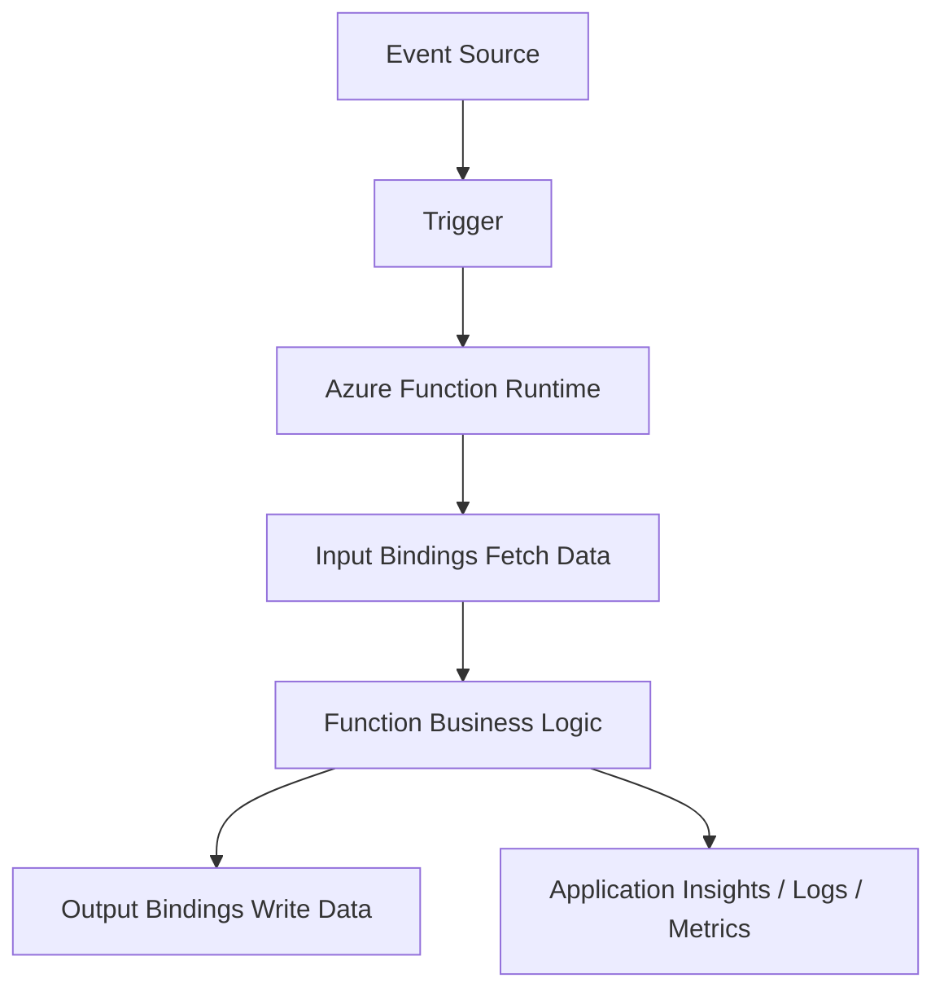
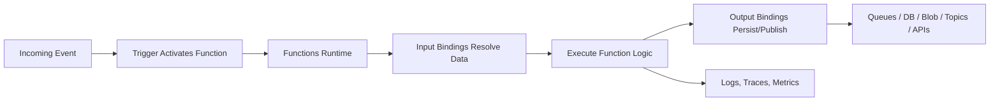
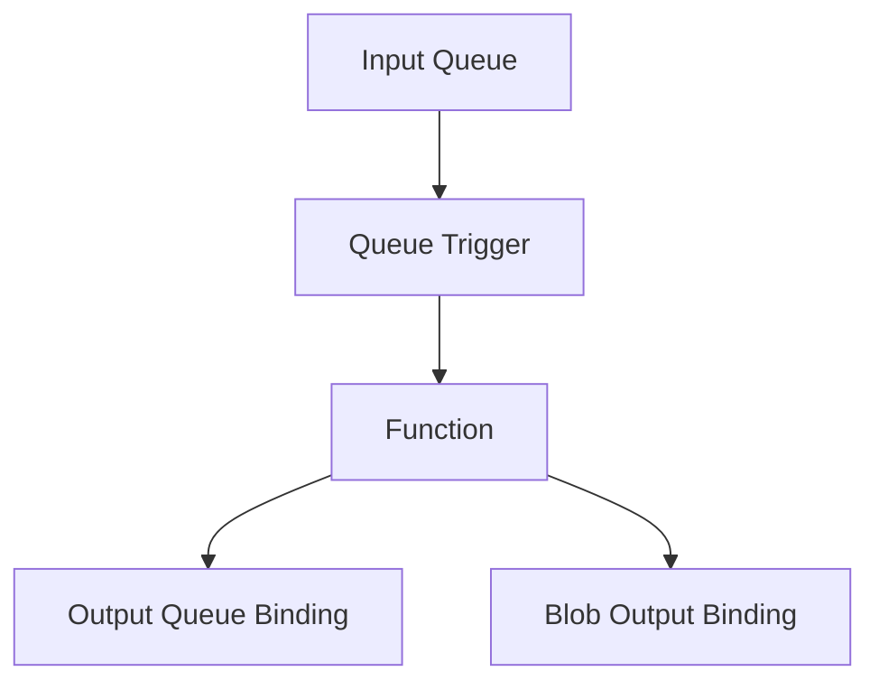
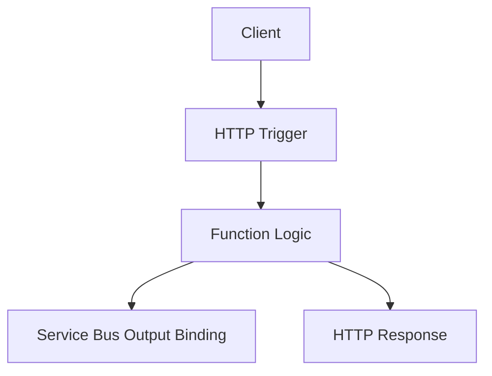
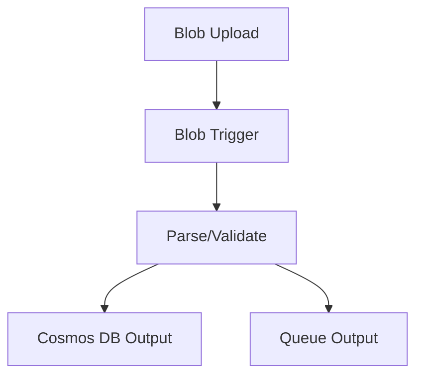
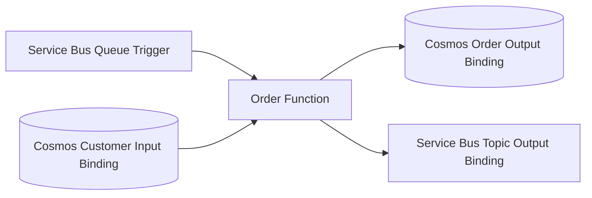
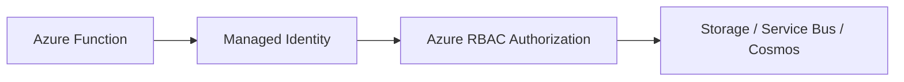
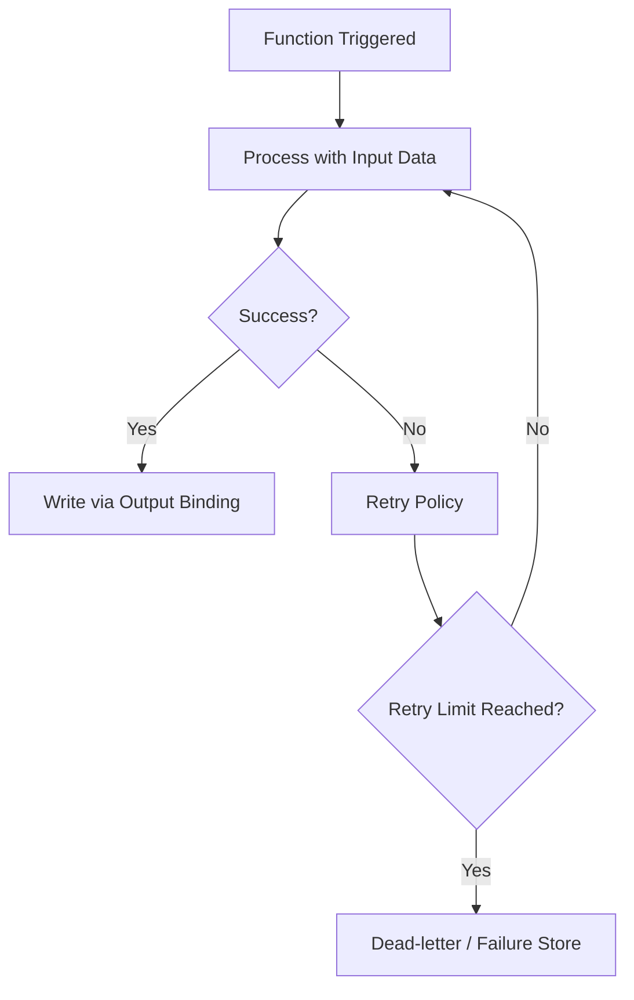
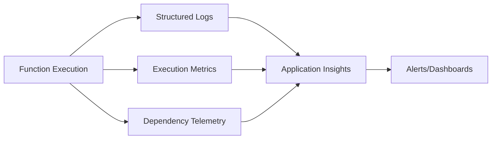

# Azure Function Bindings  
## Detailed Interview Preparation Guide with Flow Charts

## 1) What are Azure Function Bindings?

**Azure Function Bindings** are declarative connections between your Azure Function code and external services (like Storage, Service Bus, Cosmos DB, Event Hubs, etc.) for input and output operations.

They reduce boilerplate integration code by letting you define data sources and destinations in configuration/attributes instead of writing low-level SDK plumbing for every function.

### Simple Interview Definition

> Azure Function bindings are a declarative way to connect a function to external services for reading input data and writing output data, while triggers decide when the function runs.

---

## 2) Trigger vs Binding (Very Important Interview Topic)

A lot of interviewers ask this first.

- **Trigger**: starts function execution (exactly one per function)
- **Input Binding**: supplies data to the function
- **Output Binding**: sends data from function to another service

### Quick Example

- Trigger: Service Bus message arrives
- Input binding: Read customer document from Cosmos DB
- Output binding: Write notification message to Queue

---

## 3) Conceptual Flow Chart

---

## 4) Why Bindings Matter

Without bindings, developers write repetitive code for:
- Authentication setup
- Connection management
- Serialization/deserialization
- Retry wrappers
- Request/response transformation

With bindings:
- Faster development
- Cleaner function code
- Better maintainability
- Easier integration patterns

---

## 5) Types of Bindings

## 5.1 Input Bindings
Input bindings bring external data into a function at execution time.

Examples:
- Blob content
- Queue message metadata
- Cosmos DB document
- HTTP request data (depending on model)
- Table entity

## 5.2 Output Bindings
Output bindings send function results to external destinations.

Examples:
- Add message to Storage Queue
- Publish to Service Bus topic
- Write JSON document to Cosmos DB
- Save file to Blob Storage
- Push signal to SignalR

---

## 6) End-to-End Binding Flow (Detailed)

---

## 7) Common Trigger + Binding Patterns

## Pattern A: Queue Processing

- Trigger: Storage Queue
- Input binding: Blob input (optional)
- Output binding: Another queue or table record

## Pattern B: HTTP API + Async Event

- Trigger: HTTP
- Input binding: Route/body data
- Output binding: Service Bus message

## Pattern C: Blob Ingestion Pipeline

- Trigger: Blob created
- Input binding: Blob stream/content
- Output binding: Cosmos DB + Queue

---

## 8) Common Binding Connectors (Interview Useful)

Frequently used binding targets/sources:
- Azure Blob Storage
- Azure Queue Storage
- Azure Service Bus
- Azure Event Hubs
- Azure Cosmos DB
- Azure Table Storage
- Azure SignalR Service
- Azure SQL (scenarios/support depends on model/version)
- HTTP/Webhooks (trigger-centric scenarios)

Always mention: support can vary by language/runtime/extension version.

---

## 9) Real-World Example (Order Processing)

### Scenario
When order message arrives:
1. Read customer profile
2. Validate order
3. Save enriched order
4. Publish fulfillment event

### Binding-based design
- Trigger: Service Bus queue message
- Input binding: Cosmos DB customer profile
- Output binding: Cosmos DB order doc + Service Bus topic event

---

## 10) Binding Expressions and Dynamic Paths

Bindings often use expressions for dynamic routing.

Examples:
- Blob path based on message ID
- Partition key based on user ID
- Queue name by environment variable

Conceptually:
- `{name}` style placeholders
- Metadata from trigger payload
- App settings for connection names

This allows flexible routing without hardcoded paths.

---

## 11) Security with Bindings

Bindings require secure access to data services.

Best practices:
1. Prefer **Managed Identity** over secrets
2. Use RBAC-based permissions
3. Store secrets in Key Vault (if secrets are required)
4. Avoid hardcoding connection strings
5. Restrict network access (private endpoints/VNet where needed)

### Security Flow

---

## 12) Performance Considerations

Bindings are convenient, but interviewers like tradeoffs.

Consider:
- Large payload size (avoid loading huge blobs fully in memory)
- Batch processing patterns
- Connection reuse behavior
- Serialization overhead
- Throughput limits of downstream services
- Poison message and retry effects

For advanced/high-performance needs, sometimes direct SDK usage is combined with bindings.

---

## 13) Error Handling and Reliability

Bindings do not remove need for robust failure strategy.

Design for:
- Retries
- Idempotency
- Dead-letter queues
- Partial failure handling
- Correlation IDs
- Replay safety

### Reliability Flow

---

## 14) Binding vs SDK Approach (Interview Depth)

## Binding-first approach
Pros:
- Less boilerplate
- Faster development
- Cleaner signatures

Cons:
- Less fine-grained control in certain advanced scenarios

## SDK-first approach
Pros:
- Full control over client behavior, advanced options
- Custom batching/transactions/pipelines

Cons:
- More code complexity and maintenance

Good interview answer:
> Start with bindings for productivity, use SDK directly where advanced behavior or performance tuning is required.

---

## 15) Observability for Binding-based Workflows

Track:
- Trigger count
- Input resolution failures
- Output write failures
- Retry counts
- End-to-end latency
- Dependency call duration
- Dead-letter volume

Use:
- Application Insights
- Azure Monitor alerts
- Structured logs with correlation IDs

---

## 16) Common Interview Questions + Strong Answers

### Q1: What are Azure Function bindings?
**Answer:** Declarative integrations that connect functions to external services for input/output data access without writing repetitive plumbing code.

### Q2: Difference between trigger and binding?
**Answer:** Trigger starts execution; bindings provide data in/out. A function has one trigger and can have multiple bindings.

### Q3: Why use bindings?
**Answer:** Faster development, reduced boilerplate, cleaner function code, easier integration with Azure services.

### Q4: Can bindings replace all SDK usage?
**Answer:** Not always. Bindings are ideal for common patterns; SDKs may be better for advanced control/performance scenarios.

### Q5: How do you secure bindings?
**Answer:** Managed Identity + RBAC, Key Vault for secrets when needed, no hardcoded connection strings.

### Q6: What reliability concerns remain with bindings?
**Answer:** Still must handle retries, idempotency, poison messages, dead-lettering, and observability.

---

## 17) 60-Second Interview Pitch

> Azure Function bindings are declarative connectors that let a function read from and write to external systems like Blob Storage, Service Bus, and Cosmos DB with minimal plumbing code. Triggers decide when the function runs, while input/output bindings handle data movement. This improves productivity and keeps business logic clean. In production, I pair bindings with managed identity, RBAC, retry policies, idempotency, and Application Insights monitoring. For advanced control or performance-heavy paths, I selectively use SDK-based integration.

---

## 18) Final Summary

For interview prep, remember:
1. One function = one trigger, multiple bindings possible  
2. Bindings simplify integration code significantly  
3. Input bindings read data, output bindings write data  
4. Security and reliability design is still your responsibility  
5. Bindings are great defaults; SDK is for advanced use cases