# Azure Function Triggers  
## Detailed Interview Preparation Guide with Flow Charts

## 1. What Is an Azure Function Trigger?

An **Azure Functions trigger** is the event or condition that causes an Azure Function to execute.

Examples include:

- An HTTP request
- A timer schedule
- A message in Azure Storage Queue
- A message in Azure Service Bus
- A file uploaded to Blob Storage
- An event published to Event Grid
- A record changed in Cosmos DB
- A message received from Event Hubs

### Simple Interview Definition

> An Azure Function trigger is the mechanism that invokes a function. Every Azure Function must have exactly one trigger, although it can have multiple input and output bindings.

A trigger can also pass input data into the function. Bindings connect the function to other Azure services for reading or writing data. ([learn.microsoft.com](https://learn.microsoft.com/en-us/azure/azure-functions/functions-triggers-bindings?utm_source=openai))

---

## 2. Trigger vs Binding

This is one of the most important interview concepts.

## Trigger

A **trigger starts function execution**.

Examples:

```text
HTTP Request       ---> Starts Function
Queue Message      ---> Starts Function
Timer Schedule     ---> Starts Function
Blob Upload        ---> Starts Function
Service Bus Message ---> Starts Function
```

## Input Binding

An input binding reads data from another service and passes it into the function.

Examples:

```text
Function ---> Reads a Cosmos DB document
Function ---> Reads a Blob
Function ---> Reads a database record
```

## Output Binding

An output binding writes data to another service after the function executes.

Examples:

```text
Function ---> Writes a queue message
Function ---> Writes a blob
Function ---> Sends a Service Bus message
Function ---> Writes to Cosmos DB
```

### Comparison

| Concept | Purpose | Example |
|---|---|---|
| Trigger | Starts the function | HTTP request |
| Input binding | Reads data | Read a Blob |
| Output binding | Writes data | Send a queue message |

### Interview Answer

> A trigger starts a function, while bindings provide declarative connections to input and output services. A function has exactly one trigger, but it can have multiple bindings.

---

## 3. General Azure Function Trigger Flow

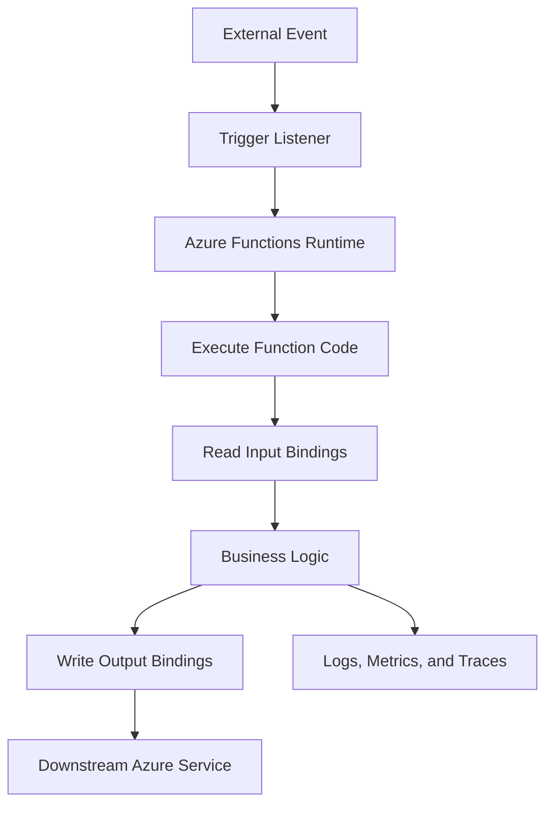

### Example

```text
Service Bus Message
        |
        v
Service Bus Trigger
        |
        v
Azure Function
        |
        +-- Validate message
        +-- Process order
        +-- Save result to database
        +-- Publish notification event
```

---

# 4. Important Rule: One Trigger per Function

Every Azure Function must have exactly one trigger.

```text
Correct:
Function A ---> HTTP Trigger

Correct:
Function B ---> Timer Trigger

Incorrect:
Function C ---> HTTP Trigger + Timer Trigger
```

If one business process must respond to multiple event types, use separate functions or route events through a common internal service.

### Example

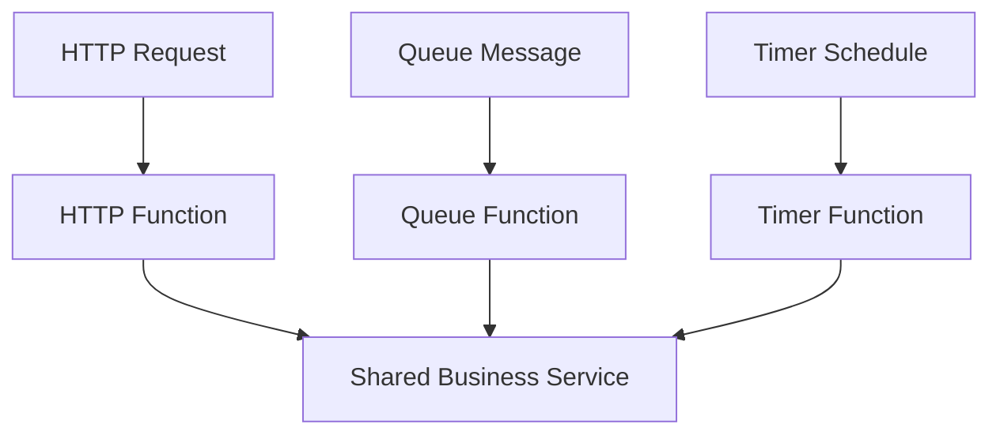

---

# 5. Main Azure Function Trigger Types

Azure Functions provides triggers for HTTP, timers, queues, events, storage changes, messaging systems, databases, and other integrations. Microsoft’s supported binding list includes HTTP, Timer, Blob Storage, Queue Storage, Event Grid, Event Hubs, Service Bus, Cosmos DB, Azure SQL, IoT Hub, Kafka, RabbitMQ, Redis, and other trigger types, with availability depending on language, extension, hosting model, and support status. ([learn.microsoft.com](https://learn.microsoft.com/en-us/azure/azure-functions/functions-triggers-bindings?utm_source=openai))

## Common Trigger Types

1. HTTP trigger
2. Timer trigger
3. Azure Storage Queue trigger
4. Azure Service Bus trigger
5. Event Grid trigger
6. Event Hubs trigger
7. Blob Storage trigger
8. Cosmos DB trigger
9. Azure SQL trigger
10. IoT Hub trigger
11. Kafka trigger
12. RabbitMQ trigger
13. Redis trigger
14. SignalR trigger
15. Durable Functions orchestration trigger

---

# 6. HTTP Trigger

## 6.1 What Is an HTTP Trigger?

An **HTTP trigger** starts a function when an HTTP request is received.

It can be used to create:

- REST endpoints
- Webhooks
- Lightweight APIs
- Health endpoints
- Callback endpoints
- Serverless integrations

## 6.2 HTTP Trigger Flow

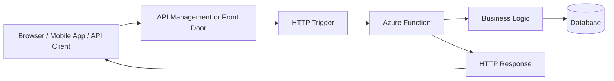

## 6.3 HTTP Trigger Example Use Case

```text
POST /orders
        |
        v
HTTP-triggered Function
        |
        +-- Validate order
        +-- Store order
        +-- Publish event
        +-- Return order ID
```

## 6.4 HTTP Trigger Security

Common security approaches include:

- Microsoft Entra ID authentication
- OAuth 2.0 access tokens
- API Management policies
- Function keys
- Host keys
- IP restrictions
- HTTPS-only access

### Important Interview Point

Function keys provide a mechanism for restricting access to a function endpoint, but they should not automatically replace enterprise authentication and authorization.

### Interview Answer

> I use an HTTP trigger for lightweight APIs, webhooks, and request-driven operations. For a large cohesive REST API with complex middleware and many controllers, I would usually consider App Service instead.

---

# 7. Timer Trigger

## 7.1 What Is a Timer Trigger?

A **Timer trigger** runs a function according to a schedule.

Typical use cases:

- Nightly cleanup
- Scheduled reports
- Data synchronization
- Cache refresh
- Expired-record processing
- Periodic health checks
- Batch jobs

## 7.2 Timer Trigger Flow

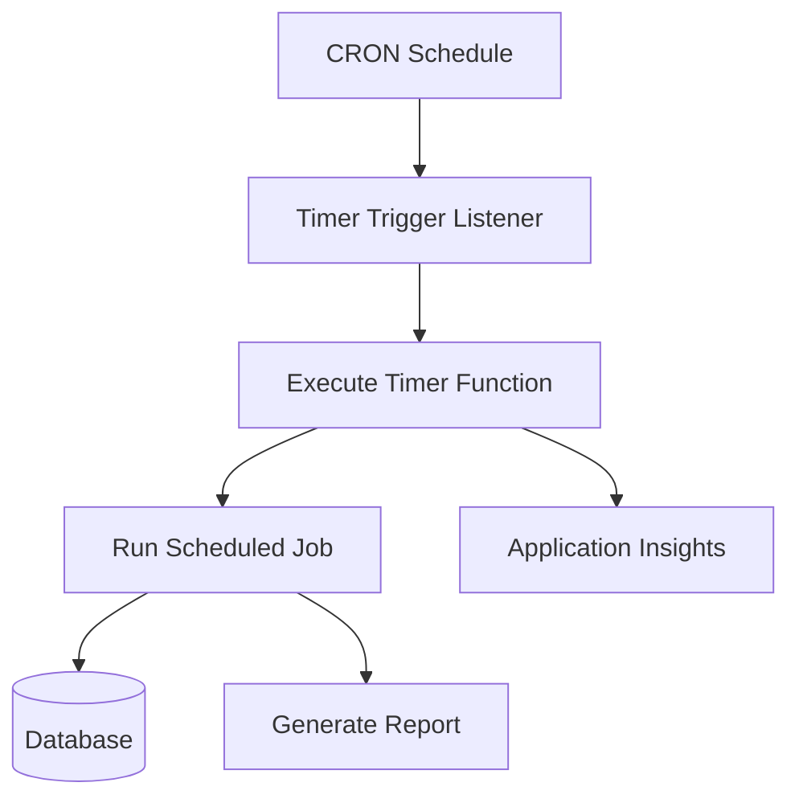

## 7.3 Example Schedules

```text
Every five minutes       --> */5 * * * *
Every hour               --> 0 * * * *
Every day at midnight    --> 0 0 * * *
Every Monday at 08:00    --> 0 8 * * 1
```

The exact schedule format and configuration depend on the Azure Functions language and runtime model.

## 7.4 Timer Trigger Interview Points

- The function is not started by an external HTTP request.
- The schedule is configured with a CRON expression.
- The job should be designed to handle retries or missed execution scenarios.
- Avoid assuming that a previous run always completed successfully.
- For critical jobs, record execution status and use alerting.

### Interview Answer

> I use a Timer trigger for scheduled operations such as cleanup, reporting, synchronization, and periodic maintenance.

---

# 8. Azure Storage Queue Trigger

## 8.1 What Is a Queue Trigger?

A **Queue Storage trigger** starts a function when a message is available in an Azure Storage Queue.

## 8.2 Queue Trigger Flow

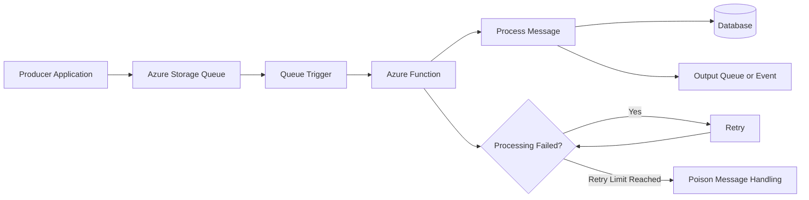

## 8.3 Common Use Cases

- Image processing
- Background order processing
- Email generation
- File transformation
- Batch work
- Decoupling an API from slow operations

## 8.4 Important Design Concerns

### Idempotency

A message may be delivered more than once. Processing the same message twice must not create incorrect results.

### Visibility Timeout

A message may become visible again if processing does not complete within the configured visibility period.

### Poison Messages

Messages that repeatedly fail should be isolated and investigated instead of retrying forever.

### Interview Answer

> A Queue Storage trigger is useful for simple asynchronous background processing. I design the consumer to be idempotent and include retry, poison-message, monitoring, and dead-letter handling strategies.

---

# 9. Azure Service Bus Trigger

## 9.1 What Is a Service Bus Trigger?

A **Service Bus trigger** starts a function when a message is received from:

- A Service Bus queue
- A Service Bus topic subscription

## 9.2 Service Bus Trigger Flow

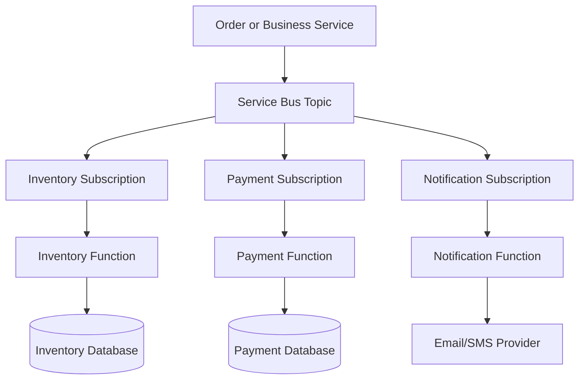

## 9.3 Service Bus Use Cases

- Enterprise messaging
- Reliable business commands
- Publish/subscribe workflows
- Order processing
- Saga steps
- Decoupled microservices
- Message sessions
- Duplicate detection
- Dead-letter processing

## 9.4 Queue vs Topic

| Service Bus Feature | Use Case |
|---|---|
| Queue | One logical consumer workflow |
| Topic | Multiple subscribers receive a message |
| Subscription | Independent consumer view of a topic |
| Dead-letter queue | Isolate messages that cannot be processed |

## 9.5 Service Bus Interview Points

Mention:

- Message completion
- Abandonment
- Retry behavior
- Dead-letter queues
- Duplicate detection
- Idempotency
- Lock duration
- Sessions when ordering or session state is required
- Correlation IDs
- Distributed tracing

### Interview Answer

> I use a Service Bus trigger for reliable enterprise messaging and asynchronous workflows. Compared with a simple storage queue, Service Bus provides richer messaging features such as topics, subscriptions, dead-letter queues, duplicate detection, and sessions.

---

# 10. Event Grid Trigger

## 10.1 What Is an Event Grid Trigger?

An **Event Grid trigger** starts a function when an event is published to Azure Event Grid.

Event Grid is designed for reactive event notification.

Examples:

- Resource created
- Blob created
- Subscription changed
- Key Vault event
- Custom application event
- Storage lifecycle event

## 10.2 Event Grid Trigger Flow

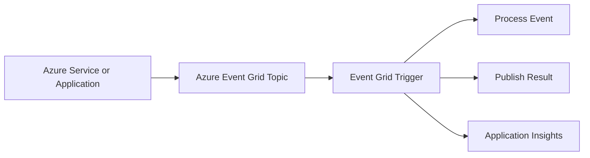

## 10.3 Event Grid Use Cases

- React to blob creation
- Trigger automation after Azure resource changes
- Start image or document processing
- Notify systems about state changes
- Build event-driven integrations

## 10.4 Event Grid vs Service Bus

| Area | Event Grid | Service Bus |
|---|---|---|
| Main Purpose | Event notification | Enterprise messaging |
| Message Type | “Something happened” | “Please perform this command” |
| Consumers | Event subscribers | Queue/topic consumers |
| Typical Pattern | Reactive integration | Reliable business workflow |
| Ordering | Not usually the main focus | Supported through sessions/configuration |
| Dead-Lettering | Available in supported scenarios | Core messaging capability |
| Example | Blob was created | Process this order |

### Interview Answer

> I use Event Grid when I need to notify subscribers that an event occurred. I use Service Bus when I need reliable command or business-message processing.

---

# 11. Event Hubs Trigger

## 11.1 What Is an Event Hubs Trigger?

An **Event Hubs trigger** starts a function when events are received from Azure Event Hubs.

Event Hubs is designed for high-throughput event ingestion and streaming scenarios.

## 11.2 Event Hubs Trigger Flow

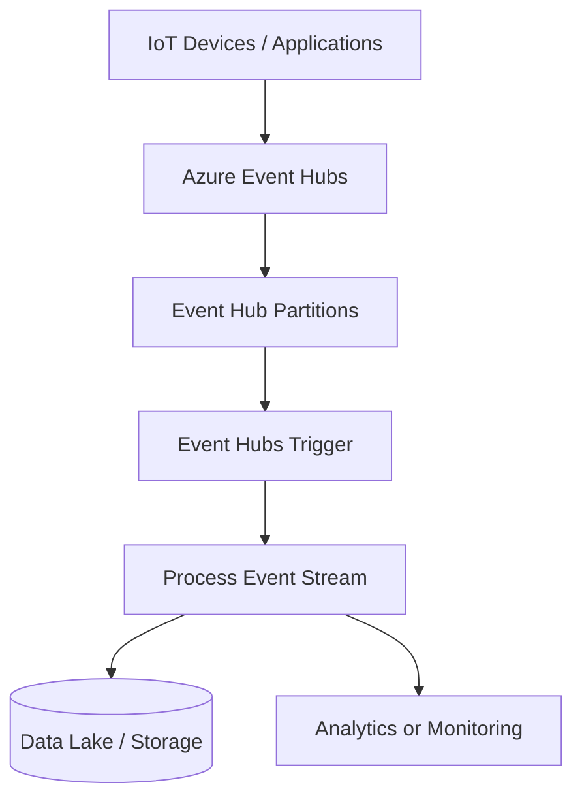

## 11.3 Event Hubs Use Cases

- IoT telemetry
- Application telemetry
- Log ingestion
- Clickstream processing
- Sensor data processing
- Streaming analytics

## 11.4 Important Concepts

- Partitions
- Consumer groups
- Offsets
- Checkpointing
- Partition ownership
- Batch processing
- Event ordering within a partition

### Interview Answer

> I use an Event Hubs trigger for high-volume event streams such as telemetry, IoT data, and clickstream events. I pay attention to partitions, consumer groups, checkpoints, throughput, and duplicate processing.

---

# 12. Blob Storage Trigger

## 12.1 What Is a Blob Trigger?

A **Blob Storage trigger** starts a function when a blob is created or updated in a configured container.

## 12.2 Blob Trigger Flow

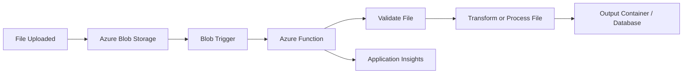

## 12.3 Blob Trigger Use Cases

- Image resizing
- PDF processing
- Virus scanning workflow
- Document extraction
- Data transformation
- Thumbnail generation
- File metadata indexing

## 12.4 Important Design Concerns

- Large file handling
- Duplicate blob events
- File naming conventions
- Processing status
- Poison files
- Storage permissions
- Output container separation
- Idempotency

### Interview Answer

> A Blob trigger is useful for file-oriented workflows. When a file is uploaded, the Function validates and processes it, then writes the result to another storage location or database.

---

# 13. Cosmos DB Trigger

## 13.1 What Is a Cosmos DB Trigger?

A **Cosmos DB trigger** starts a function when changes are detected in an Azure Cosmos DB container.

It uses the Cosmos DB change feed to process changes. The trigger exposes changed items to the function. ([learn.microsoft.com](https://learn.microsoft.com/en-us/azure/azure-functions/functions-triggers-bindings?utm_source=openai))

## 13.2 Cosmos DB Trigger Flow

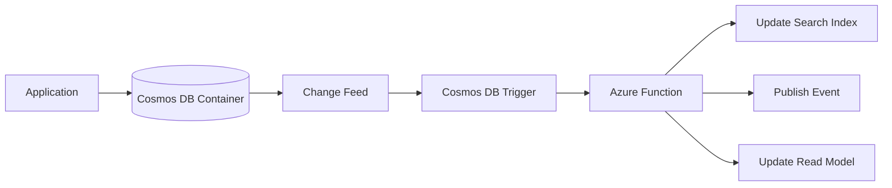

## 13.3 Cosmos DB Trigger Use Cases

- Update a search index
- Build read models
- Send notifications
- Synchronize data
- Create audit records
- Trigger downstream processing

## 13.4 Interview Points

- The trigger is based on the change feed.
- The function should handle duplicate or repeated processing safely.
- The monitored container and lease/container configuration must be designed correctly.
- Changes should be processed efficiently in batches where appropriate.

### Interview Answer

> I use the Cosmos DB trigger when downstream processing should react to changes in a Cosmos DB container, such as updating a search index or publishing a domain event.

---

# 14. Azure SQL Trigger

## 14.1 What Is an Azure SQL Trigger?

An **Azure SQL trigger** allows a Function to react to changes in supported Azure SQL scenarios.

## 14.2 SQL Trigger Flow

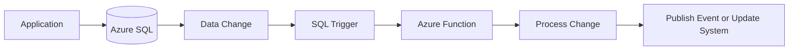

## 14.3 Use Cases

- React to inserted records
- Synchronize data
- Publish integration events
- Update a cache
- Process audit or workflow records

### Interview Note

Support, language, extension, and hosting details can vary. Always verify the specific trigger’s support status and implementation model for the target programming language.

---

# 15. IoT Hub Trigger

## 15.1 What Is an IoT Hub Trigger?

An **IoT Hub trigger** starts a function when telemetry or device messages are received from Azure IoT Hub.

## 15.2 IoT Hub Trigger Flow

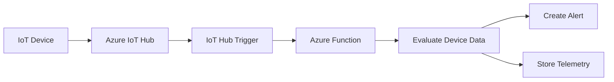

## 15.3 Use Cases

- Device telemetry processing
- Threshold alerts
- Device status tracking
- IoT command workflows
- Data routing

---

# 16. Kafka Trigger

## 16.1 What Is a Kafka Trigger?

A Kafka trigger starts a function when a message is received from a Kafka topic.

## 16.2 Kafka Trigger Flow

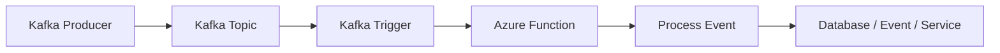

## 16.3 Use Cases

- Existing Kafka-based systems
- Streaming pipelines
- Hybrid or multi-cloud event processing
- High-throughput integration

### Interview Point

Kafka trigger support and hosting limitations should be checked for the selected language and Functions hosting plan.

---

# 17. RabbitMQ Trigger

A RabbitMQ trigger starts a function when a message arrives in a RabbitMQ queue.

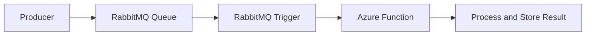

Use it when integrating an existing RabbitMQ-based messaging architecture.

---

# 18. Redis Trigger

A Redis trigger can react to Redis-related events in supported Azure Functions scenarios.

Potential use cases include:

- Cache invalidation
- Event processing
- Real-time updates
- Reactive data workflows

Always verify the supported binding model, language, and hosting requirements before selecting it.

---

# 19. SignalR Trigger

SignalR-related triggers and bindings can support real-time communication patterns.

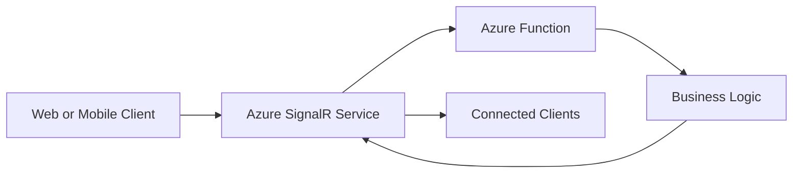

Use cases include:

- Notifications
- Live dashboards
- Chat
- Real-time status updates
- Collaborative experiences

---

# 20. Trigger Selection Flow Chart

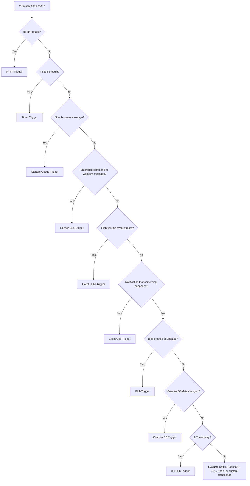

---

# 21. Trigger Processing Lifecycle

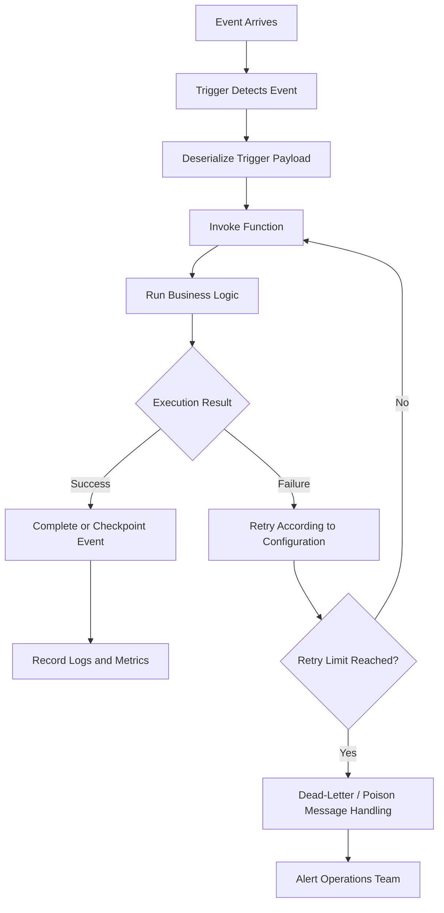

---

# 22. Retry and Failure Handling

Trigger behavior after a failure depends on the trigger type and its extension/runtime configuration.

A production design should address:

- Retry count
- Retry delay
- Exponential backoff
- Poison messages
- Dead-letter queues
- Checkpointing
- Duplicate messages
- Partial failures
- Alerting
- Manual replay

## Recommended Failure Flow

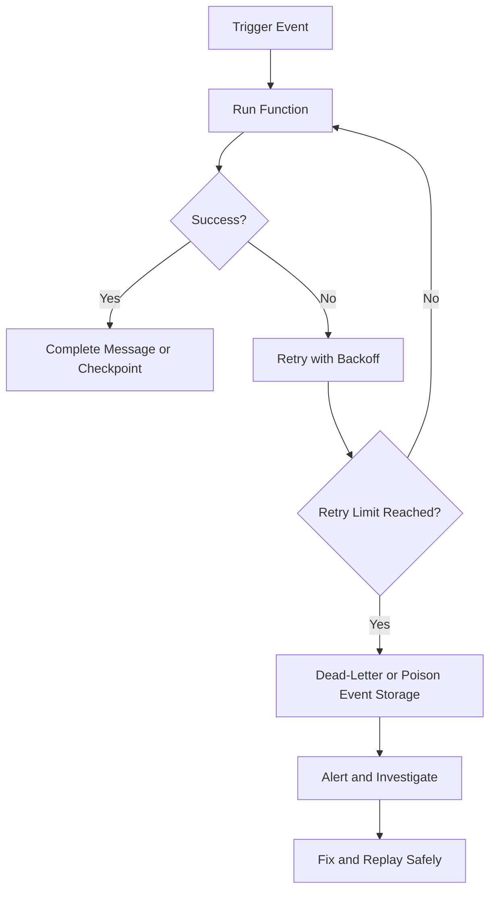

### Interview Answer

> I do not assume that a trigger executes exactly once. I design for at-least-once processing, idempotency, retries, dead-letter handling, and observability.

---

# 23. Idempotency

## 23.1 What Is Idempotency?

An operation is idempotent if executing it multiple times produces the same final business result as executing it once.

### Non-Idempotent Example

```text
Charge a credit card $100
Charge a credit card $100 again
```

This can create an incorrect result if the same message is processed twice.

### Idempotent Example

```text
Set Order 123 status to "Paid"
Set Order 123 status to "Paid" again
```

The final state remains the same.

## 23.2 Idempotency Techniques

- Use a unique event ID
- Store processed message IDs
- Use database uniqueness constraints
- Use transactional upserts
- Use business keys
- Check current state before applying changes
- Use Service Bus duplicate detection where appropriate

### Interview Answer

> Because trigger-based processing can involve retries or duplicate delivery, I use an event ID or business key to make the function idempotent.

---

# 24. Trigger and Binding Example

```text
Trigger:
    Service Bus message

Input binding:
    Read related customer record

Function logic:
    Validate and process order

Output binding:
    Write notification message
```

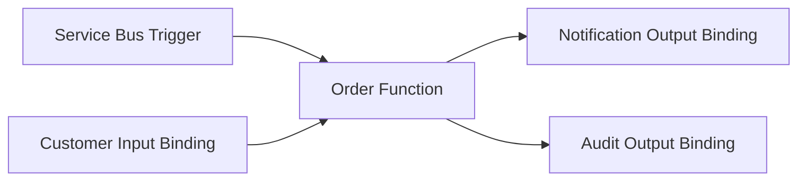

### Interview Explanation

> The Service Bus trigger starts the function. The input binding retrieves supporting data, and output bindings publish the results. The trigger is the entry point; bindings are integrations around the function.

---

# 25. Trigger Configuration

Trigger configuration normally includes:

- Trigger type
- Connection setting
- Queue, topic, container, or event source name
- Function route or schedule
- Consumer group or subscription
- Batch size
- Retry settings
- Concurrency settings
- Checkpoint or lease settings

## Configuration Principle

Do not hardcode:

- Connection strings
- Secrets
- Access keys
- Passwords

Use:

- Application settings
- Managed Identity
- Azure Key Vault
- RBAC
- Secure deployment configuration

---

# 26. Managed Identity with Triggers

A Function can use a managed identity to access supported Azure resources without storing a connection string in source code.

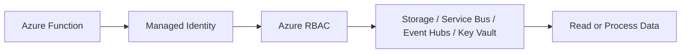

### Interview Answer

> For production, I prefer managed identity and RBAC over storing connection strings or access keys in application code.

---

# 27. Trigger Concurrency and Scaling

When event volume increases, Azure Functions may create additional instances depending on the trigger and hosting plan.

```mermaid
flowchart TD
    Events[Increasing Event Volume] --> Listener[Trigger Listener]
    Listener --> ScaleController[Scale Controller]
    ScaleController --> Decision{Need More Capacity?}
    Decision -- No --> One[Continue Existing Instance]
    Decision -- Yes --> Many[Add Function Instances]
    Many --> Process[Process Events in Parallel]
```

## Important Considerations

- Maximum concurrency
- Batch size
- Partition count
- Ordering requirements
- Database connection limits
- Downstream API throttling
- Backpressure
- Cost impact
- Duplicate processing

### Interview Answer

> Scaling the Function is not enough. I also verify that downstream databases, APIs, and message brokers can handle the increased concurrency.

---

# 28. Trigger Ordering

Ordering depends on the trigger and source service.

Examples:

- Event Hubs ordering is generally associated with a partition.
- Service Bus sessions can be used when ordered processing is required for a session.
- Queue processing should not assume global ordering unless explicitly designed.
- Parallel Function instances can process events concurrently.

### Interview Answer

> If business ordering matters, I explicitly design for it using partitions, sessions, sequencing, or a serialized processing strategy. I never assume that a general event-triggered system provides global ordering automatically.

---

# 29. Trigger vs Polling

## Polling

An application repeatedly asks whether work exists.

```text
Every 10 seconds:
    Is there a new message?
    Is there a new file?
    Has the database changed?
```

## Trigger-Based Processing

The runtime activates the function when work is available.

```text
New event:
    Trigger function immediately
```

### Benefits of Triggers

- Less custom polling code
- Better integration with Azure services
- Event-driven architecture
- Automatic scaling
- Lower idle processing overhead

---

# 30. Trigger Selection by Business Scenario

| Business Scenario | Recommended Trigger |
|---|---|
| Create order from API request | HTTP |
| Process order asynchronously | Service Bus |
| Process simple background task | Storage Queue |
| Run nightly cleanup | Timer |
| Process uploaded image | Blob Storage |
| React to resource events | Event Grid |
| Process IoT telemetry | IoT Hub or Event Hubs |
| Process application event streams | Event Hubs |
| React to Cosmos DB changes | Cosmos DB |
| Synchronize SQL changes | Azure SQL |
| Consume existing Kafka events | Kafka |
| Consume existing RabbitMQ messages | RabbitMQ |
| Send real-time updates | SignalR-related trigger/binding |

---

# 31. Azure Function Triggers vs Azure App Service

| Area | Function Triggers | App Service |
|---|---|---|
| Invocation | Event-driven | Usually HTTP/application request |
| Main Unit | Function | Complete application |
| Best For | Jobs, events, queues, timers | Web apps and APIs |
| Scaling | Trigger-aware | Application/metric-aware |
| Background Work | Native pattern | Requires WebJobs or worker design |
| API Model | Small endpoints/webhooks | Complete API |
| Retry Design | Central concern | Usually application-specific |
| State | Usually external and stateless | Also recommended externally, but broader app structure |
| Execution Pattern | Short, isolated operations | Long-lived application process |

---

# 32. Observability for Triggered Functions

Monitor the complete trigger lifecycle:

1. Event received
2. Function invocation started
3. Function execution duration
4. Success or failure
5. Retry count
6. Message completion
7. Dead-letter count
8. Downstream dependency latency
9. Queue/event backlog
10. Alert status

```mermaid
flowchart LR
    Event[Event Source] --> Function[Function Invocation]
    Function --> Logs[Structured Logs]
    Function --> Metrics[Execution Metrics]
    Function --> Trace[Distributed Trace]
    Logs --> AppInsights[Application Insights]
    Metrics --> Monitor[Azure Monitor]
    Trace --> AppInsights
    AppInsights --> Alerts[Alerts and Dashboards]
```

### Recommended Fields

- Correlation ID
- Event ID
- Message ID
- Function name
- Trigger type
- Attempt number
- Processing duration
- Business key
- Outcome
- Exception type

---

# 33. Security Best Practices

1. Use HTTPS for HTTP triggers.
2. Use Microsoft Entra ID for enterprise APIs.
3. Use managed identity for Azure service access.
4. Store secrets in Key Vault.
5. Use least-privilege RBAC.
6. Restrict network access where required.
7. Validate all external payloads.
8. Avoid logging sensitive data.
9. Protect against replayed events.
10. Use API Management for centralized API policies.
11. Configure private endpoints where appropriate.
12. Rotate credentials when managed identity is not available.

---

# 34. Testing Azure Function Triggers

## Unit Testing

Test the function logic independently from Azure services.

## Integration Testing

Test:

- Queue message consumption
- Service Bus behavior
- Event Grid delivery
- Blob processing
- Cosmos DB change feed behavior
- Timer execution
- Authentication and permissions

## Contract Testing

Validate the structure of:

- Events
- Queue messages
- HTTP requests
- Service Bus messages
- Event Grid events

## Load Testing

Test:

- Concurrent invocations
- Queue backlog
- Function scaling
- Database connection limits
- Downstream throttling
- Retry storms

---

# 35. Common Interview Questions and Answers

## Q1. What is an Azure Function trigger?

**Answer:**

An Azure Function trigger is the event or condition that starts function execution. It may be an HTTP request, timer, queue message, event, blob change, database change, or messaging event.

---

## Q2. How many triggers can one Azure Function have?

**Answer:**

A Function has exactly one trigger. It can have multiple input and output bindings.

---

## Q3. What is the difference between a trigger and a binding?

**Answer:**

A trigger invokes the function. A binding connects the function to another service for reading or writing data.

---

## Q4. Which trigger is used for REST APIs?

**Answer:**

The HTTP trigger is used for REST endpoints and webhooks. For a large or complex API, Azure App Service may be more suitable than splitting every endpoint into separate Functions.

---

## Q5. Which trigger is used for scheduled jobs?

**Answer:**

The Timer trigger is used for scheduled jobs such as cleanup, reporting, synchronization, and maintenance.

---

## Q6. Which trigger is used for queue processing?

**Answer:**

Use the Storage Queue trigger for simple queue-based processing and the Service Bus trigger for richer enterprise messaging scenarios.

---

## Q7. What is the difference between Event Grid and Service Bus?

**Answer:**

Event Grid is primarily for event notification: “something happened.” Service Bus is designed for reliable business messaging and commands: “please process this message.”

---

## Q8. What is the difference between Event Hubs and Service Bus?

**Answer:**

Event Hubs is optimized for high-throughput event streaming, telemetry, and ingestion. Service Bus is optimized for reliable enterprise messaging, commands, workflows, queues, and topics.

---

## Q9. How do you handle duplicate messages?

**Answer:**

Make the Function idempotent by using event IDs, message IDs, unique constraints, processed-message records, or safe upsert logic.

---

## Q10. What happens if a Function fails?

**Answer:**

The behavior depends on the trigger and configuration. The event may be retried, abandoned, checkpointed later, or sent to a dead-letter or poison-message destination. I design explicit failure handling and alerting.

---

## Q11. How do you secure a Service Bus-triggered Function?

**Answer:**

Use managed identity with appropriate RBAC permissions where supported, avoid hardcoded secrets, store configuration securely, and restrict access according to least privilege.

---

## Q12. How do you monitor triggered Functions?

**Answer:**

Use Application Insights and Azure Monitor to track invocation count, duration, failures, retries, queue backlog, dead-letter messages, dependencies, and distributed traces.

---

## Q13. Can a Timer trigger run long-running work?

**Answer:**

It can start work, but long-running processes should be designed according to the selected hosting plan and execution limits. For stateful or multi-step workflows, Durable Functions or a dedicated worker architecture may be more appropriate.

---

## Q14. What is a poison message?

**Answer:**

A poison message is a message that repeatedly fails processing. It should be isolated in a poison-message or dead-letter destination so it does not block normal processing.

---

## Q15. How do you maintain ordering?

**Answer:**

Use the ordering capabilities of the source service, such as Service Bus sessions or Event Hubs partitions, and design the Function so that concurrency does not violate business ordering.

---

# 36. Scenario-Based Interview Answers

## Scenario 1: Process Uploaded Images

### Requirement

Users upload images, and thumbnails must be generated automatically.

### Answer

> I would use a Blob Storage trigger. When an image is uploaded to the input container, the Function validates it, creates thumbnails, stores them in an output container, and records processing status. I would make processing idempotent and handle invalid files separately.

---

## Scenario 2: Process Orders Asynchronously

### Requirement

An API accepts orders, but payment and notification processing should happen asynchronously.

### Answer

> The API can publish an order event to Service Bus. A Service Bus-triggered Function can process payment or notification tasks. I would use correlation IDs, idempotency, retries, dead-letter handling, and Application Insights.

---

## Scenario 3: Run a Daily Cleanup

### Requirement

Delete expired records every night.

### Answer

> I would use a Timer trigger with a daily CRON schedule. The job would process records in batches, be restartable, record its execution status, and emit metrics and alerts.

---

## Scenario 4: Process Telemetry

### Requirement

Process millions of device events per day.

### Answer

> I would evaluate Event Hubs with a Function trigger. I would design around partitions, consumer groups, checkpointing, batch processing, downstream capacity, and duplicate handling. For very high-volume or complex stream processing, I would also evaluate Stream Analytics, Databricks, or another streaming platform.

---

# 37. 60-Second Interview Pitch

> Azure Function triggers define how a Function starts. Common triggers include HTTP, Timer, Storage Queue, Service Bus, Event Grid, Event Hubs, Blob Storage, Cosmos DB, and IoT Hub. Every Function has exactly one trigger, while it can have multiple input and output bindings. I select the trigger based on the business event: HTTP for APIs, Timer for scheduled jobs, Queue or Service Bus for asynchronous processing, Event Grid for event notifications, Event Hubs for high-volume streams, Blob for file processing, and Cosmos DB for change-feed processing. In production, I design for idempotency, retries, dead-letter handling, concurrency, security, managed identity, and observability.

---

# 38. Final Summary

## Remember These Core Points

- A trigger starts a Function.
- Every Function has exactly one trigger.
- A Function can have multiple input and output bindings.
- HTTP triggers are used for APIs and webhooks.
- Timer triggers are used for scheduled jobs.
- Queue triggers are used for asynchronous background processing.
- Service Bus triggers are used for reliable enterprise messaging.
- Event Grid triggers are used for event notifications.
- Event Hubs triggers are used for high-throughput streams.
- Blob triggers are used for file-processing workflows.
- Cosmos DB triggers use the change feed.
- Idempotency is essential because duplicate processing can occur.
- Retry, dead-letter, checkpointing, and monitoring must be designed explicitly.
- Managed identity and RBAC are preferred over hardcoded secrets.
- Trigger selection should follow the business event and processing requirements.

## Best One-Line Answer

> An Azure Function trigger is the event-driven entry point that invokes a Function, such as an HTTP request, timer, queue message, storage change, database change, or messaging event.