# Azure Functions Hosting Plans  
## Consumption Plan vs Premium Plan vs Dedicated Plan

> **Interview summary:**  
> Choose the **Consumption plan** for low-cost, event-driven workloads with variable traffic. Choose the **Premium plan** when you need pre-warmed instances, longer-running executions, more compute control, or VNet connectivity. Choose the **Dedicated plan** when you need predictable App Service-based compute, manual scaling, Always On, custom images, or shared capacity with other App Service applications.

> **Current Azure note:**  
> For new serverless Function Apps, Microsoft recommends evaluating the **Flex Consumption plan**. The original Consumption plan is now considered a legacy hosting option, but it remains important for interviews and for existing Windows-based workloads.

---

# 1. What Is an Azure Functions Hosting Plan?

A hosting plan defines how Azure runs, scales, bills, and allocates resources for your Function App.

The selected plan affects:

- Scaling behavior
- Cold-start behavior
- Execution duration
- Billing model
- Available CPU and memory
- Networking support
- Operating system support
- Deployment features
- Instance management
- High-availability options

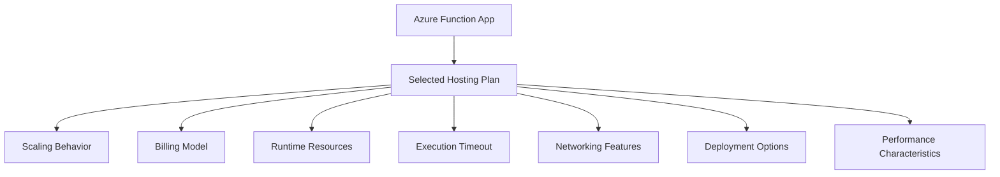

---

# 2. The Three Plans at a Glance

| Feature | Consumption Plan | Premium Plan | Dedicated Plan |
|---|---|---|---|
| Hosting model | Serverless, event-driven | Elastic serverless with pre-warmed instances | App Service-based dedicated compute |
| Best for | Bursty and intermittent workloads | Production workloads needing predictable performance | Steady workloads and shared App Service capacity |
| Billing | Pay for executions, duration, and memory | Pay for allocated/pre-warmed and executing compute | Pay for the App Service Plan |
| Scale to zero | Yes | No; at least one instance is kept warm | No |
| Cold starts | Possible | Reduced through pre-warmed instances | Usually minimized with Always On |
| Auto scale | Event-driven | Event-driven | Manual or App Service autoscale |
| VNet integration | Not supported in the original Consumption plan | Supported | Supported |
| Private endpoint for Function App | Not supported in original Consumption | Supported | Supported |
| Long-running execution | More restricted | Suitable for long-running work | Suitable for long-running work |
| Custom Linux image | Not supported | Supported | Supported |
| Deployment slots | Supported on applicable tiers | Supported | Supported |
| Predictable monthly cost | Lower predictability | More predictable than Consumption | Predictable based on plan size |
| Operating systems | Windows and, depending on current availability, supported Function runtimes | Windows and Linux | Windows and Linux |
| Typical use | Simple event handlers and low-volume APIs | Enterprise APIs and event processing | Existing App Service environments and steady workloads |

The exact availability of operating systems, deployment methods, scale limits, and networking features depends on the specific Azure Functions hosting option and runtime. ([learn.microsoft.com](https://learn.microsoft.com/en-us/azure/azure-functions/functions-scale?utm_source=openai))

---

# 3. High-Level Plan Selection Flow Chart

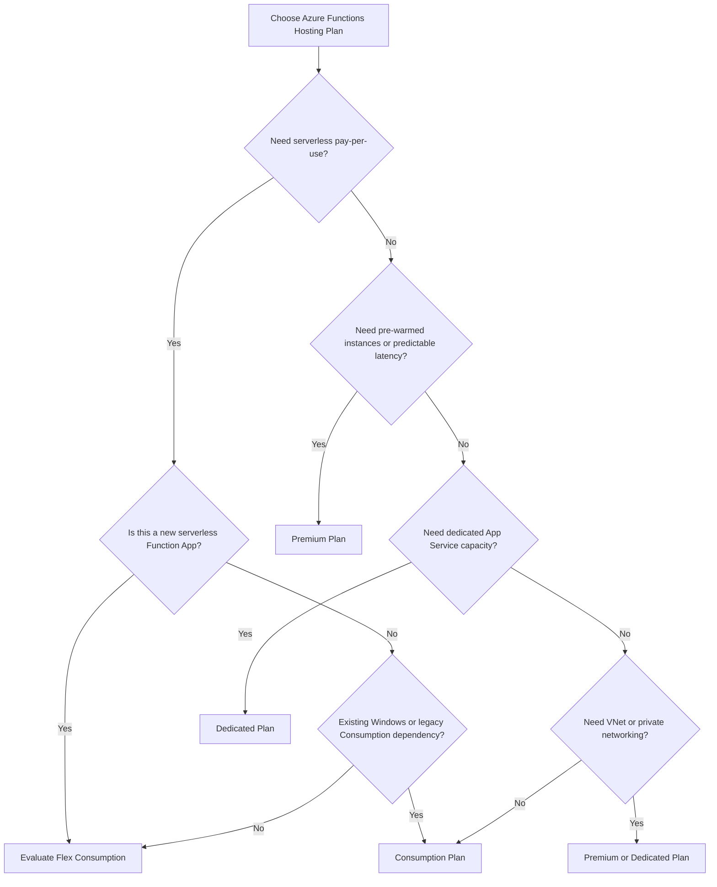

---

# 4. Consumption Plan

## 4.1 What Is the Consumption Plan?

The Consumption plan is a serverless hosting model where Azure dynamically adds and removes Function App instances based on incoming events.

You generally pay based on:

- Number of executions
- Execution duration
- Memory used during execution

The plan is designed for workloads that may be idle for periods of time and then receive bursts of traffic.

> Important: Microsoft currently describes the original Consumption plan as a legacy dynamic hosting plan. For new serverless apps, evaluate Flex Consumption first.

---

## 4.2 Consumption Plan Execution Flow

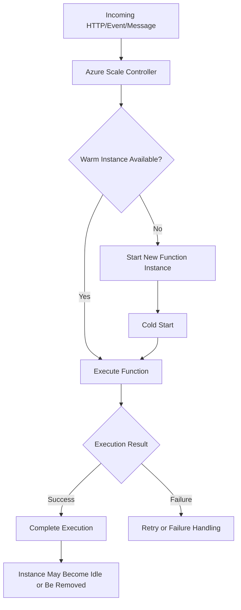

---

## 4.3 Advantages of the Consumption Plan

- Low operational overhead
- Automatic event-driven scaling
- Pay-per-use pricing model
- Can scale down when there is no work
- Suitable for intermittent workloads
- Good fit for simple HTTP, queue, timer, and event-triggered functions
- No need to manage virtual machines

---

## 4.4 Disadvantages of the Consumption Plan

- Cold starts can affect first-request latency.
- The original Consumption plan has more restrictive execution-duration limits.
- No VNet integration in the original Consumption plan.
- No private endpoint for the Function App in the original Consumption plan.
- Less control over CPU and memory than Premium or Dedicated.
- Less suitable for continuously running or latency-sensitive workloads.
- Cost can become less attractive for high-volume, continuously active workloads.

---

## 4.5 Consumption Plan Best Use Cases

Use the Consumption plan for:

- Low-volume HTTP APIs
- Webhooks
- Timer-triggered jobs
- Queue processing
- File processing
- Event Grid handlers
- Bursty workloads
- Development and test environments
- Background tasks that run occasionally

### Example

```text
A file is uploaded once every few minutes.
A Function processes the file.
The app may be idle between uploads.
```

This workload is a good serverless candidate.

---

## 4.6 Consumption Plan Interview Answer

> I choose the Consumption plan when the workload is event-driven, intermittent, and cost-sensitive. Azure automatically scales instances based on incoming events, and I pay primarily for execution usage. I accept possible cold starts and more restrictive execution limits in exchange for low operational overhead and pay-per-use billing.

---

# 5. Premium Plan

## 5.1 What Is the Premium Plan?

The Premium plan, commonly called **Elastic Premium**, provides event-driven scaling while keeping one or more instances warm.

It is designed for workloads that need:

- Reduced cold starts
- More CPU and memory options
- Longer-running executions
- VNet integration
- Private networking
- Better performance control
- Custom Linux containers
- More predictable production behavior

---

## 5.2 Premium Plan Execution Flow

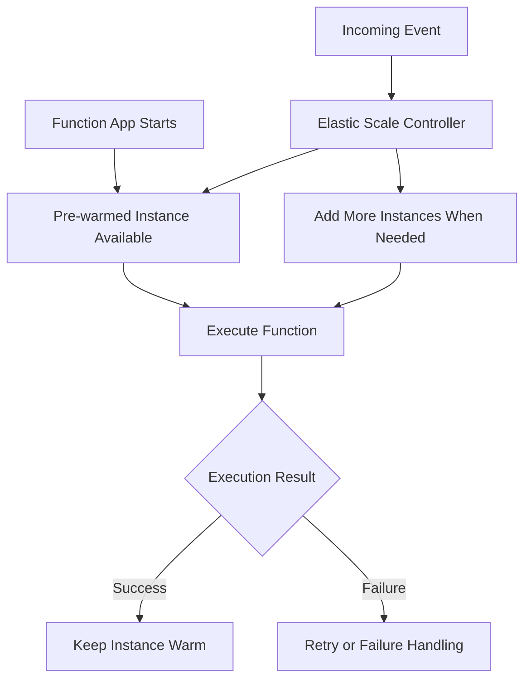

---

## 5.3 Advantages of the Premium Plan

- Pre-warmed instances reduce cold starts.
- Supports automatic event-driven scale-out.
- Supports longer-running executions.
- Supports VNet integration.
- Supports private endpoints in supported configurations.
- Offers more CPU and memory control.
- Suitable for production workloads with consistent latency requirements.
- Can host multiple Function Apps on the same Premium plan.
- Supports custom Linux images.
- Better fit for enterprise integrations and secure network access.

---

## 5.4 Disadvantages of the Premium Plan

- Higher cost than Consumption for low-volume workloads.
- At least one instance remains allocated.
- Requires capacity planning.
- More expensive if the workload is mostly idle.
- Scaling and cost behavior are more complex than basic Consumption.
- Requires careful configuration of pre-warmed and maximum burst capacity.

---

## 5.5 Premium Plan Best Use Cases

Use Premium for:

- Production APIs requiring low startup latency
- High-volume event processing
- Long-running functions
- Functions accessing private Azure resources
- VNet-integrated applications
- Enterprise integration workloads
- Custom Linux container requirements
- Applications with predictable or nearly continuous traffic
- Workloads that cannot tolerate frequent cold starts

### Example

```text
A payment-processing Function receives traffic throughout the day.
It must access a private database through a VNet.
The first request should not experience a noticeable cold start.
```

Premium is a strong candidate.

---

## 5.6 Premium Plan Interview Answer

> I choose the Premium plan when I need production-grade performance with pre-warmed instances, reduced cold starts, VNet connectivity, longer execution times, or more control over compute resources. It costs more than Consumption because capacity remains available even when demand is low.

---

# 6. Dedicated Plan

## 6.1 What Is the Dedicated Plan?

The Dedicated plan runs Function Apps on a regular **Azure App Service Plan**.

The Function App shares dedicated compute capacity with other App Service applications hosted on that plan, depending on the architecture.

You pay for the App Service Plan rather than per individual function execution.

---

## 6.2 Dedicated Plan Execution Flow

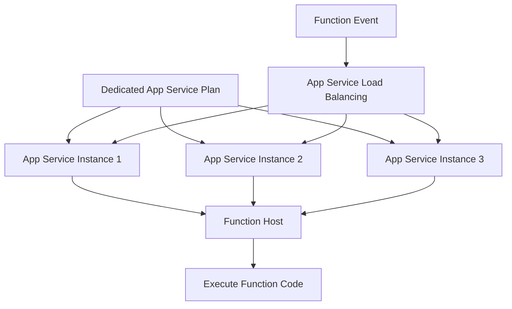

---

## 6.3 Advantages of the Dedicated Plan

- Predictable plan-based billing
- Can share capacity with web apps and APIs
- Supports manual scaling
- Supports App Service autoscale
- Supports Always On
- Supports VNet integration
- Supports private networking features
- Supports larger compute sizes
- Suitable for long-running workloads
- Can reuse existing, underutilized App Service capacity
- Supports custom images and App Service capabilities
- Can be used with App Service Environment for stronger isolation

---

## 6.4 Disadvantages of the Dedicated Plan

- You pay for provisioned instances even when functions are idle.
- Scaling is not as event-responsive as Premium.
- Requires capacity planning.
- Always On should be enabled for reliable Function App behavior.
- The plan may be underutilized if workloads are intermittent.
- Operational responsibility is higher than serverless plans.
- Cost is based on the App Service Plan, not simply function execution volume.

Microsoft recommends enabling **Always On** when running Functions on an App Service Plan so the Function App does not become idle after inactivity. ([learn.microsoft.com](https://learn.microsoft.com/en-us/azure/azure-functions/dedicated-plan?utm_source=openai))

---

## 6.5 Dedicated Plan Best Use Cases

Use Dedicated for:

- Existing App Service Plans with available capacity
- Long-running workloads
- Predictable workloads
- Functions that must run continuously
- Applications requiring manual scaling
- Workloads sharing capacity with web apps
- Custom images
- App Service Environment deployments
- Organizations with standard App Service operating models

### Example

```text
An organization already runs several web applications on a Standard App Service Plan.
A Function App needs to run continuously and can share the same capacity.
```

A Dedicated plan may be cost-effective and operationally consistent.

---

## 6.6 Dedicated Plan Interview Answer

> I choose the Dedicated plan when I need predictable App Service-based compute, Always On behavior, manual or App Service autoscale, custom images, or shared capacity with existing web applications. It is not ideal for workloads that are idle most of the time because the plan is billed regardless of function execution volume.

---

# 7. Detailed Comparison: Scaling

## Consumption Scaling

- Event-driven
- Instances are added based on incoming events.
- Can scale down significantly during idle periods.
- Cold starts are possible when new instances are created.

## Premium Scaling

- Event-driven scale-out
- Pre-warmed instances handle initial demand.
- Additional instances are added during load.
- Provides better latency consistency.

## Dedicated Scaling

- Manual scale-out or App Service autoscale
- Scaling is based on the App Service Plan.
- Scaling is less event-specific than Premium.
- Always On keeps the app active.

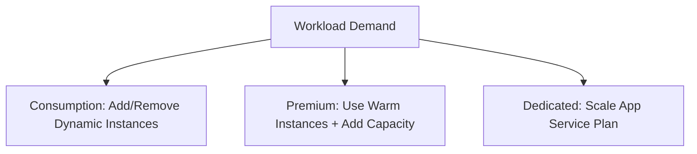

---

# 8. Detailed Comparison: Cold Starts

| Plan | Cold-Start Behavior |
|---|---|
| Consumption | Possible and more noticeable |
| Premium | Reduced through pre-warmed instances |
| Dedicated | Usually minimized with Always On |
| Flex Consumption | Can use optional always-ready instances |

## Cold-Start Flow

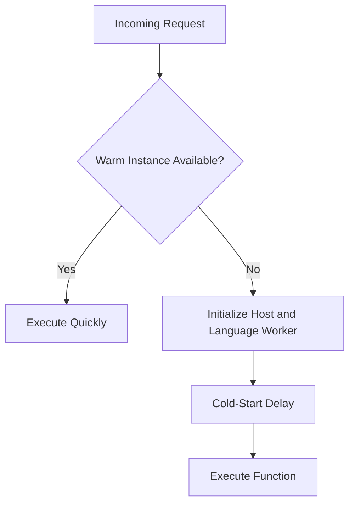

### Interview Answer

> If cold-start latency is acceptable, Consumption is usually sufficient. If predictable startup latency is important, Premium or Dedicated with Always On is more appropriate.

---

# 9. Detailed Comparison: Execution Duration

The original Consumption plan has a shorter maximum execution duration than Premium and Dedicated plans. Premium and Dedicated can support longer-running functions, subject to the Function App configuration and platform limitations.

The current Azure Functions documentation lists:

- Consumption: default timeout of 5 minutes and maximum configurable timeout of 10 minutes
- Premium: default timeout of 30 minutes and no enforced maximum in the same way
- Dedicated: default timeout of 30 minutes and no enforced maximum when configured correctly
- HTTP-triggered functions still have a platform response limitation of approximately 230 seconds, so long HTTP work should use an asynchronous pattern

([learn.microsoft.com](https://learn.microsoft.com/en-us/azure/azure-functions/functions-scale?utm_source=openai))

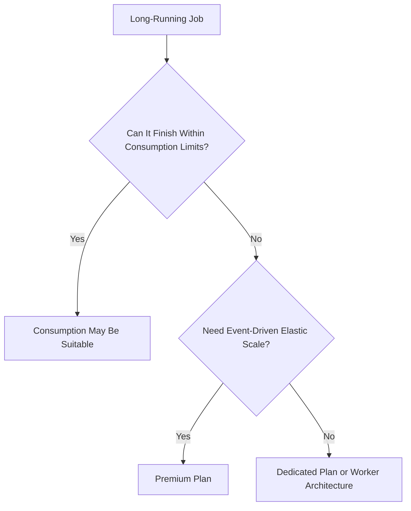

### Important Interview Point

Do not keep an HTTP request open for a long-running operation. Use:

1. HTTP endpoint to start the job
2. Queue or Durable Function to process the job
3. Status endpoint to query progress
4. Notification or callback when complete

---

# 10. Detailed Comparison: Networking

| Networking Feature | Consumption | Premium | Dedicated |
|---|---:|---:|---:|
| Inbound access restrictions | Supported | Supported | Supported |
| Private endpoint for Function App | Not supported in original Consumption | Supported | Supported |
| Outbound VNet integration | Not supported in original Consumption | Supported | Supported |
| Private database access | Limited by plan | Strong support | Strong support |
| App Service Environment | No | No | Supported |

Microsoft’s current comparison shows private endpoints and outbound VNet integration for Premium and Dedicated plans, while the original Consumption plan does not provide these capabilities. ([learn.microsoft.com](https://learn.microsoft.com/en-us/azure/azure-functions/functions-scale?utm_source=openai))

## Networking Decision Flow

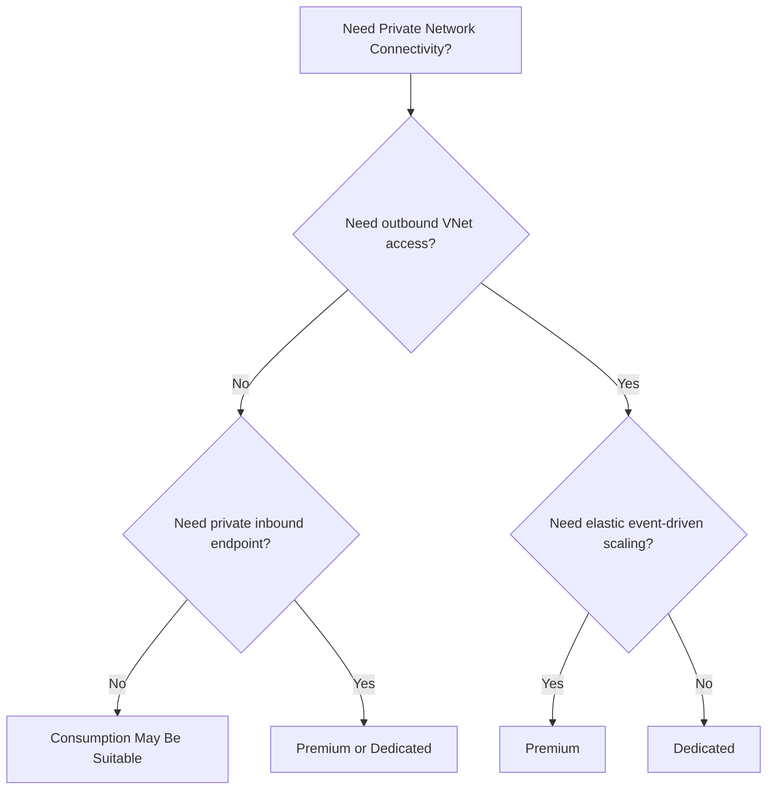

---

# 11. Detailed Comparison: Billing

## Consumption Billing

You primarily pay based on:

- Number of executions
- Execution time
- Memory used

This is attractive for workloads with idle periods or irregular traffic.

## Premium Billing

You pay for allocated/pre-warmed and executing compute resources.

Premium provides more predictable capacity but costs more than Consumption when the workload is idle.

## Dedicated Billing

You pay for the App Service Plan capacity regardless of how many function executions occur.

The same plan may host multiple apps, so cost allocation depends on how the organization shares and manages the plan.

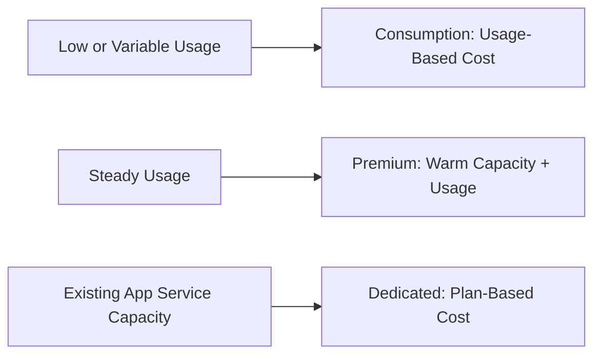

### Interview Answer

> I do not say that Consumption is always cheaper. Consumption is usually attractive for intermittent workloads. Premium can be more cost-effective at sustained volume, and Dedicated can be efficient when existing App Service capacity is available.

---

# 12. Detailed Comparison: Deployment Slots

Deployment slots allow separate environments such as:

```text
Production
Staging
Testing
```

You can deploy to staging, test it, and then swap it with production.

| Plan | Deployment Slots |
|---|---|
| Consumption | Supported on applicable configurations |
| Premium | Supported |
| Dedicated | Supported |
| Flex Consumption | Currently uses different deployment strategies rather than standard slots |

Microsoft’s current documentation indicates that Flex Consumption does not currently support traditional deployment slots, while other hosting plans support slot-based deployment according to plan capabilities. ([learn.microsoft.com](https://learn.microsoft.com/en-ie/azure/azure-functions/functions-deployment-slots?utm_source=openai))

---

# 13. Detailed Comparison: Operating System and Containers

## Consumption

- Commonly used for standard supported runtimes.
- Original Consumption has Windows support, which may be important for legacy workloads.

## Premium

- Supports Linux custom images.
- Provides more control over runtime dependencies.
- Suitable for specialized libraries and enterprise integrations.

## Dedicated

- Supports App Service-based hosting.
- Supports custom images and shared App Service capacity.
- Suitable for organizations standardizing on App Service infrastructure.

### Interview Question

**Why would you choose Premium over Consumption for a custom container?**

**Answer:**

> Premium provides stronger support for custom Linux images, more predictable performance, VNet integration, and longer execution times. Consumption is better for standard, lightweight, event-driven workloads where custom runtime control is not required.

---

# 14. Decision Matrix by Workload

| Workload | Recommended Plan |
|---|---|
| Low-volume HTTP webhook | Consumption |
| Occasional timer job | Consumption |
| Small queue processor | Consumption |
| New serverless application | Flex Consumption or Consumption for legacy compatibility |
| High-volume event processing | Premium |
| Low-latency production API | Premium |
| Function accessing private SQL through VNet | Premium or Dedicated |
| Long-running background processing | Premium or Dedicated |
| Existing App Service Plan | Dedicated |
| Function sharing compute with web apps | Dedicated |
| Custom Linux image | Premium or Dedicated |
| Strictly predictable monthly capacity | Dedicated |
| Scale-to-zero requirement | Consumption or Flex Consumption |
| High memory requirements | Premium or Dedicated |
| App Service Environment isolation | Dedicated |

---

# 15. Plan Selection Flow for Interviews

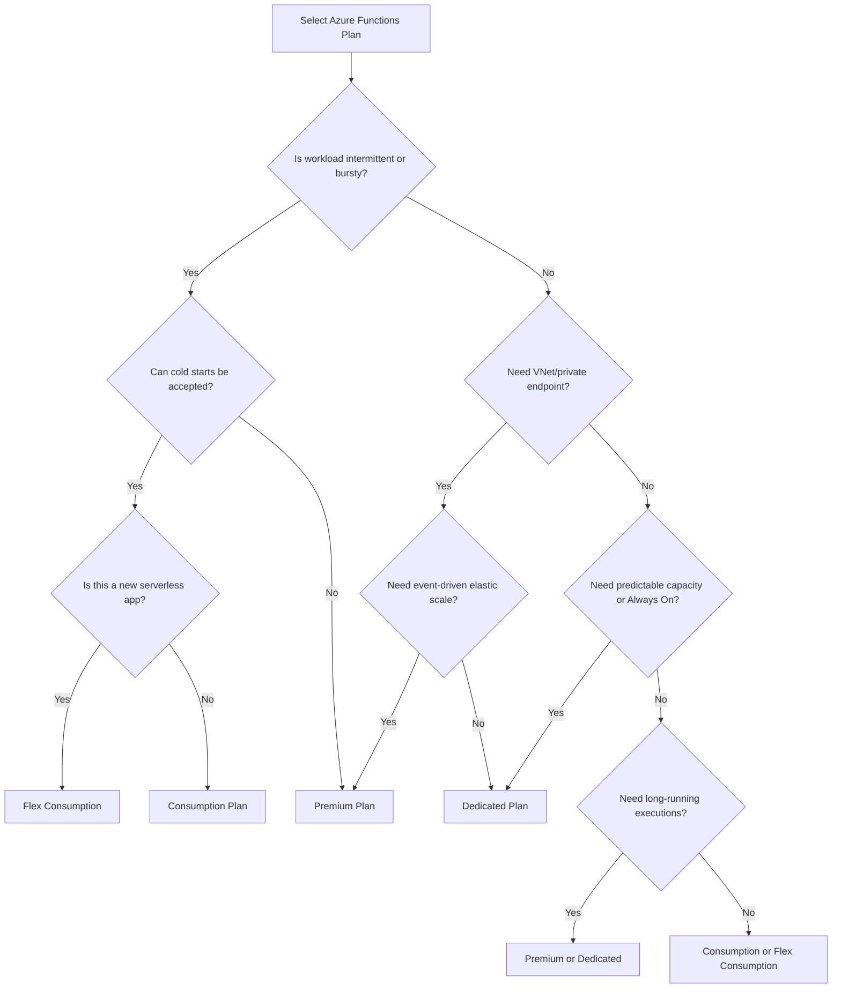

---

# 16. Real-World Architecture Examples

## 16.1 Consumption Example

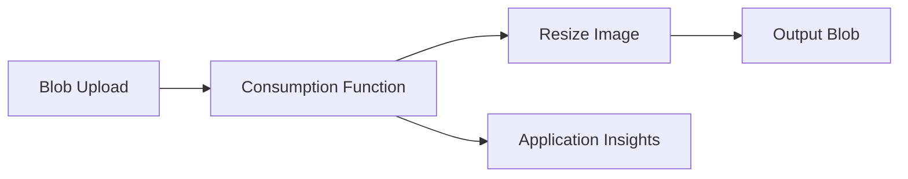

Why Consumption works:

- Event-driven
- Short execution
- Variable traffic
- No requirement for private networking
- Cost-sensitive

---

## 16.2 Premium Example

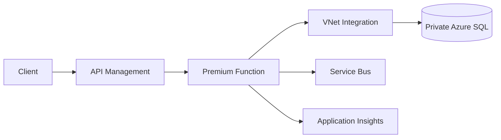

Why Premium works:

- Production API
- Private networking
- Better cold-start behavior
- Event-driven scaling
- Integration with private resources

---

## 16.3 Dedicated Example

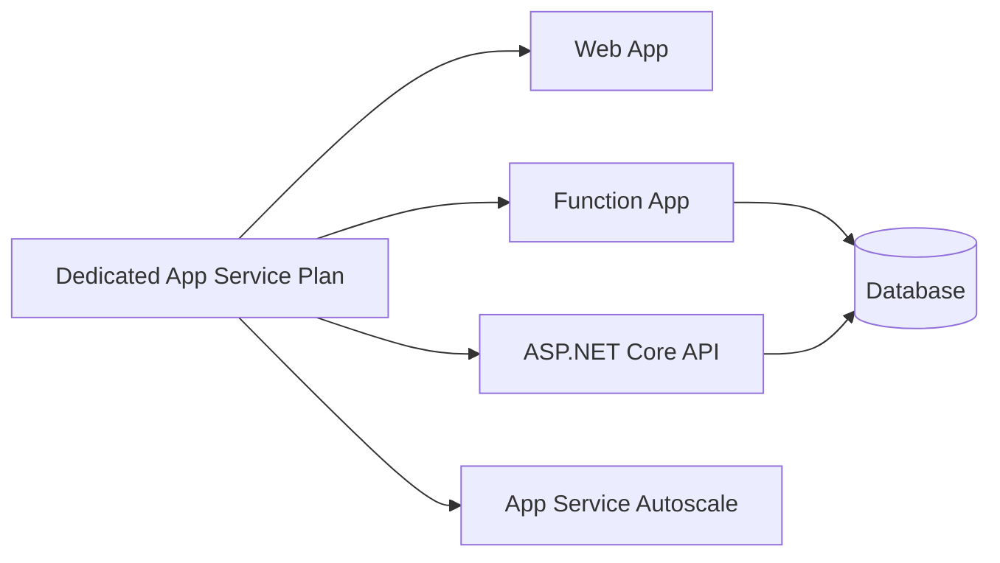

Why Dedicated works:

- Existing shared App Service plan
- Predictable capacity
- Multiple applications share resources
- Always On is required
- Plan-based billing is acceptable

---

# 17. Consumption vs Premium vs Dedicated: Interview Comparison

## Question: Which plan is cheapest?

### Strong Answer

> It depends on the workload. Consumption can be cheapest for intermittent execution because billing is usage-based. Premium may be more economical for sustained, high-volume workloads because it avoids repeated cold starts and provides more efficient dedicated capacity. Dedicated can be cost-effective when an existing App Service Plan has unused capacity.

---

## Question: Which plan has the best performance?

### Strong Answer

> Premium generally provides the best balance for event-driven Functions because it offers pre-warmed instances, elastic scale, more CPU and memory options, and VNet integration. Dedicated can provide predictable performance when Always On and sufficient instances are configured. Consumption is suitable when occasional startup latency is acceptable.

---

## Question: Which plan supports VNet integration?

### Strong Answer

> Premium and Dedicated support VNet integration. The original Consumption plan does not support outbound VNet integration. Flex Consumption now supports VNet integration and should be evaluated for new serverless workloads requiring secure networking.

---

## Question: Which plan should be used for long-running Functions?

### Strong Answer

> Premium or Dedicated is generally more appropriate for long-running work. For complex multi-step workflows, I would also evaluate Durable Functions. I would avoid keeping an HTTP request open and instead use an asynchronous job/status pattern.

---

## Question: Which plan should be used for a function that runs once per day?

### Strong Answer

> A Consumption-based plan is usually appropriate because the workload is intermittent and does not need continuously allocated compute. For a new application, I would evaluate Flex Consumption; for an existing legacy Function App, the original Consumption plan may still be used.

---

## Question: Which plan should be used for an enterprise Function accessing a private database?

### Strong Answer

> I would choose Premium or Dedicated because they support VNet integration and private networking. For a new serverless design, I would also evaluate Flex Consumption because it supports VNet integration.

---

# 18. Common Mistakes

## Mistake 1: Saying Consumption Is Always the Best Choice

Consumption is not automatically best. It may be unsuitable for:

- Strict latency requirements
- Private networking
- Long-running execution
- High sustained traffic
- Custom container requirements

## Mistake 2: Ignoring the Hosting Plan During Design

The plan affects:

- Network design
- Timeout behavior
- Cold starts
- Cost
- Deployment model
- Scaling limits

## Mistake 3: Using Dedicated Without Always On

When using a Dedicated App Service Plan, Always On should generally be enabled so that the Function App does not become idle.

## Mistake 4: Choosing Premium for Very Rare Jobs

Premium keeps capacity warm and can be unnecessarily expensive for low-frequency jobs.

## Mistake 5: Keeping Long HTTP Requests Open

For long work, return an accepted response and process asynchronously using:

- Queue
- Service Bus
- Durable Functions
- Status endpoint
- Callback/event

## Mistake 6: Assuming Plan Migration Is Always Easy

Azure Functions has limited plan migration support. Select the appropriate plan early and validate migration requirements before committing to a production architecture. ([learn.microsoft.com](https://learn.microsoft.com/en-us/azure/azure-functions/functions-best-practices?utm_source=openai))

---

# 19. Production Best Practices

1. Choose the plan based on workload behavior, not only development convenience.
2. Use Flex Consumption for new serverless workloads where its capabilities fit.
3. Use Premium for low-latency, VNet-integrated, long-running, or high-volume workloads.
4. Use Dedicated when sharing existing App Service capacity is valuable.
5. Enable Always On on Dedicated plans.
6. Use Managed Identity for Azure resource access.
7. Store secrets in Azure Key Vault.
8. Configure Application Insights and Azure Monitor.
9. Monitor cold starts, execution duration, retries, and failures.
10. Test scale behavior under realistic load.
11. Configure autoscale limits carefully.
12. Use queues or Durable Functions for long-running work.
13. Account for downstream database and API capacity.
14. Use deployment slots where supported.
15. Maintain separate development, test, and production environments.
16. Use Infrastructure as Code for repeatable plan configuration.
17. Review cost trends after deployment.
18. Validate networking requirements before selecting the plan.

---

# 20. Scenario-Based Interview Answer

## Scenario

A company needs to process orders using Azure Functions. Traffic is unpredictable, processing must access a private Azure SQL Database, cold starts should be minimized, and some operations may take several minutes.

## Strong Answer

> I would choose the Premium plan because the workload needs VNet integration to reach the private Azure SQL Database, reduced cold starts through pre-warmed instances, event-driven scale-out, and longer execution support. I would use Service Bus triggers for asynchronous order processing, Managed Identity for database access, Application Insights for monitoring, and Durable Functions if the workflow contains multiple stateful steps. For a new serverless workload, I would also evaluate Flex Consumption because it supports VNet integration and optional always-ready instances.

---

# 21. 60-Second Interview Pitch

> The Consumption plan is best for intermittent, event-driven workloads where pay-per-execution billing and automatic scaling are more important than startup latency. The Premium plan is best for production workloads requiring pre-warmed instances, reduced cold starts, VNet integration, longer execution times, or more compute control. The Dedicated plan runs Functions on an App Service Plan and is best when we need predictable plan-based billing, Always On, manual scaling, shared capacity with web apps, or custom App Service capabilities. For new serverless applications, I would evaluate Flex Consumption because it provides serverless billing with newer networking, memory, and scaling capabilities.

---

# 22. Final Summary

## Consumption Plan

```text
Best for:
- Bursty traffic
- Short executions
- Low operational overhead
- Pay-per-use workloads
- Occasional background jobs

Main trade-off:
- Cold starts
- More execution limitations
- Limited networking in the original plan
```

## Premium Plan

```text
Best for:
- Production workloads
- Low-latency execution
- Pre-warmed instances
- VNet/private networking
- Long-running functions
- High-volume event processing

Main trade-off:
- Higher cost because capacity is kept warm
```

## Dedicated Plan

```text
Best for:
- Existing App Service capacity
- Predictable workloads
- Always On applications
- Manual or App Service autoscale
- Shared web/API/function hosting
- Custom App Service environments

Main trade-off:
- Pay for provisioned capacity even when functions are idle
```

## Best One-Line Interview Answer

> Use Consumption for low-cost, intermittent event processing; Premium for low-latency, network-integrated, long-running, or high-volume workloads; and Dedicated when you need predictable App Service capacity, Always On, custom scaling, or shared hosting with other applications.