# Azure Functions vs Azure App Service  
## Detailed Interview Preparation Guide with Flow Charts

## 1. Quick Interview Answer

**Azure App Service** is a managed platform for hosting complete web applications and continuously running HTTP APIs.

**Azure Functions** is a serverless, event-driven compute service for running small units of code in response to triggers such as HTTP requests, timers, queues, events, and messages.

> Choose **App Service** for complete web applications, continuously running APIs, and predictable HTTP workloads. Choose **Azure Functions** for event-driven processing, scheduled tasks, lightweight APIs, and workloads that benefit from automatic serverless scaling.

Azure Functions can also run on a dedicated App Service Plan, so the two services are related. However, their programming and execution models are different. ([learn.microsoft.com](https://learn.microsoft.com/en-us/azure/azure-functions/functions-overview?utm_source=openai))

---

## 2. Basic Concept

```text
Azure App Service
    = Host an application or API

Azure Functions
    = Execute a function when an event occurs
```

### App Service Example

```text
Client Request
      |
      v
ASP.NET Core Web API
      |
      +-- Business Logic
      +-- Database Access
      +-- Authentication
      +-- Response
```

### Azure Functions Example

```text
Queue Message / HTTP Request / Timer
      |
      v
Function Trigger
      |
      v
Function Code
      |
      +-- Process Data
      +-- Store Result
      +-- Publish Event
```

---

# 3. High-Level Comparison Flow Chart

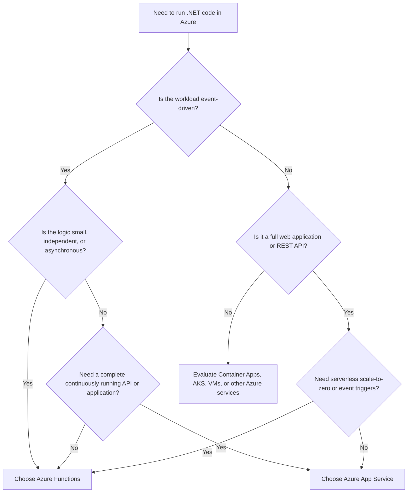

---

# 4. Azure App Service

## 4.1 What Is Azure App Service?

Azure App Service is a fully managed Azure platform for hosting:

- Web applications
- REST APIs
- Backend services
- Mobile backends
- Containerized web applications

It supports common application stacks, including .NET, Java, Node.js, Python, PHP, and custom containers. Azure manages the underlying infrastructure while the development team manages application code and configuration. ([learn.microsoft.com](https://learn.microsoft.com/en-us/azure/developer/intro/hosting-apps-on-azure?utm_source=openai))

## 4.2 Typical App Service Architecture

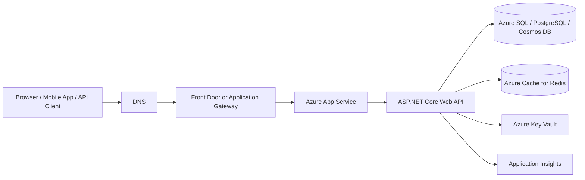

## 4.3 App Service Is a Good Choice For

- Full ASP.NET Core MVC applications
- Blazor Server applications
- Continuously running REST APIs
- Backend-for-frontend services
- Applications with multiple controllers and business modules
- Applications requiring deployment slots
- APIs with predictable HTTP traffic
- Applications requiring simple CI/CD and operational management

---

# 5. Azure Functions

## 5.1 What Is Azure Functions?

Azure Functions is a serverless compute service for running event-driven code. A function runs when activated by a trigger such as:

- HTTP request
- Timer
- Azure Storage Queue message
- Azure Service Bus message
- Event Grid event
- Event Hub event
- Blob event
- Cosmos DB change

Azure Functions provides triggers and bindings that simplify integration with Azure services. ([learn.microsoft.com](https://learn.microsoft.com/en-us/azure/azure-functions/functions-overview?utm_source=openai))

## 5.2 Typical Azure Functions Architecture

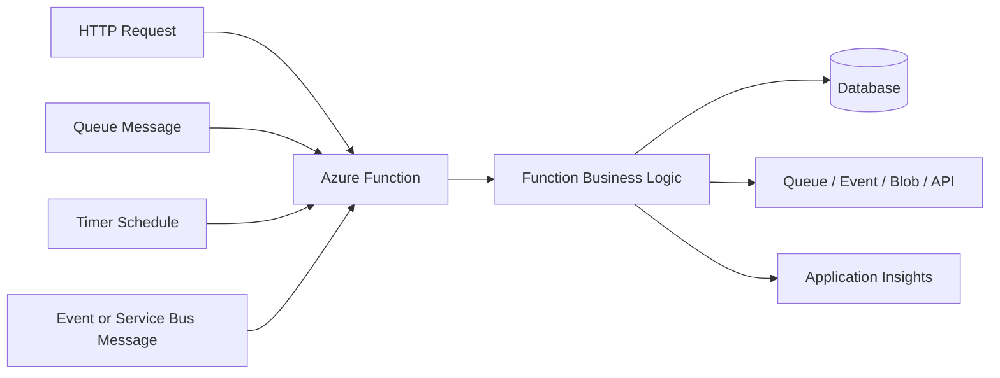

## 5.3 Azure Functions Is a Good Choice For

- Background processing
- Queue and message processing
- Scheduled jobs
- Webhooks
- Lightweight HTTP endpoints
- File-processing workflows
- Event-driven integrations
- Notification processing
- Data transformation
- Serverless automation

---

# 6. Main Difference: Application vs Function Execution Model

## App Service Execution Model

App Service hosts an application process.

```text
Application Starts
      |
      v
Application Remains Available
      |
      v
Receives Many HTTP Requests
      |
      v
Application Handles Routing and Business Logic
```

## Azure Functions Execution Model

Functions execute individual functions based on triggers.

```text
Trigger Event Occurs
      |
      v
Function Host Activates Function
      |
      v
Function Executes
      |
      v
Function Returns or Produces Output
```

### Interview Explanation

> App Service is application-centric, while Azure Functions is function- and event-centric.

---

# 7. Detailed Comparison Table

| Area | Azure App Service | Azure Functions |
|---|---|---|
| Primary Model | Managed PaaS application hosting | Serverless event-driven compute |
| Main Unit | Web app or API application | Individual function |
| Best For | Full web apps and REST APIs | Events, jobs, integrations, lightweight APIs |
| Invocation | Usually HTTP requests | HTTP, timers, queues, events, messages |
| Scaling | App Service Plan scaling | Event-driven scaling based on hosting plan |
| Scale to Zero | Generally not the normal App Service model | Supported by serverless hosting options |
| Cold Start | Usually less noticeable on always-running plans | Possible depending on hosting plan |
| Pricing | App Service Plan capacity | Plan-dependent; serverless plans charge based on execution/resources |
| Runtime Duration | Suitable for normal application requests | Plan-dependent execution limits and behavior |
| Deployment Slots | Supported on appropriate App Service tiers | Supported depending on hosting plan |
| Application Structure | Full application with controllers/services/modules | Smaller independently triggered functions |
| Background Processing | Possible using WebJobs or separate workers | Native fit through queue/event/timer triggers |
| API Development | Excellent for complete APIs | Good for small or event-oriented APIs |
| Operational Complexity | Low | Low, but trigger/retry behavior must be designed carefully |
| State Management | Application usually remains stateless but can have broader structure | Functions should generally be stateless and idempotent |
| Local Development | Standard web application workflow | Function runtime and trigger simulation required |
| Best Scaling Signal | HTTP traffic, metrics, schedules | Trigger events, queue length, event rate |
| Typical Team Model | Application development team | Event/integration/serverless development team |

The actual Azure Functions scaling and billing behavior depends on the hosting option. Microsoft currently identifies Flex Consumption as the recommended serverless hosting plan for new function apps, while the older Consumption plan is considered legacy. ([learn.microsoft.com](https://learn.microsoft.com/azure/azure-functions/flex-consumption-plan?utm_source=openai))

---

# 8. Hosting and Scaling Comparison

## 8.1 App Service Scaling

App Service can scale through:

- Manual scale up
- Manual scale out
- Autoscale rules
- Automatic traffic-based scaling on supported tiers
- Deployment slot configuration

App Service scaling is generally based on application traffic, metrics, schedules, or configured instance limits. ([learn.microsoft.com](https://learn.microsoft.com/en-us/azure/app-service/manage-automatic-scaling?utm_source=openai))

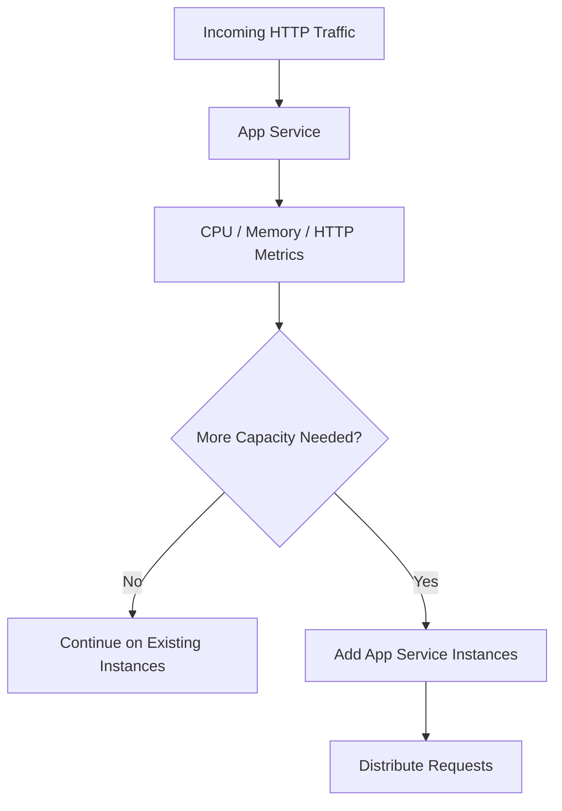

## 8.2 Azure Functions Scaling

Functions scaling depends on the selected hosting plan and trigger type.

Possible behaviors include:

- Scale out based on incoming events
- Scale to zero on serverless plans
- Pre-warmed or always-ready instances
- Per-function scaling in supported plans
- Dedicated App Service Plan scaling

Flex Consumption supports event-driven scaling, virtual network integration, configurable memory sizes, optional always-ready instances, and scale-to-zero behavior. ([learn.microsoft.com](https://learn.microsoft.com/azure/azure-functions/flex-consumption-plan?utm_source=openai))

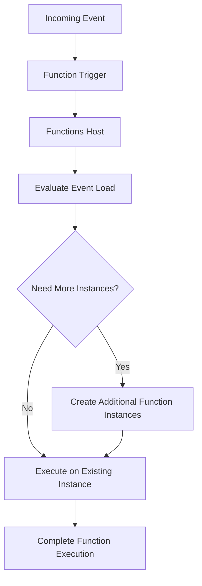

---

# 9. Cold Start

## 9.1 What Is a Cold Start?

A cold start occurs when Azure needs to initialize a new function host before executing the function.

Cold starts may occur when:

- The function has been idle
- The application scales from zero
- A new instance is created
- A new deployment is activated

Cold-start behavior depends on the Functions hosting plan. Premium hosting provides pre-warmed instances, and Flex Consumption supports optional always-ready instances. ([learn.microsoft.com](https://learn.microsoft.com/azure/azure-functions/flex-consumption-plan?utm_source=openai))

## 9.2 App Service and Cold Starts

A continuously running App Service instance generally avoids the same scale-to-zero behavior associated with serverless Functions. However, application startup time can still matter during deployments, restarts, scaling, or platform operations.

## 9.3 Interview Answer

> If the API requires highly predictable first-request latency, I would consider App Service or a pre-warmed Functions plan. If occasional startup latency is acceptable and cost efficiency is more important, a serverless Functions plan may be appropriate.

---

# 10. Cost Comparison

## App Service Cost Model

App Service is normally billed based on the App Service Plan and its provisioned compute capacity.

Multiple apps may share an App Service Plan, depending on design and resource constraints.

## Azure Functions Cost Model

Functions cost depends on the hosting plan:

- Serverless plans generally use execution/resource-based billing.
- Premium plans use allocated compute and pre-warmed capacity.
- Dedicated hosting uses an App Service Plan and is billed based on the plan.
- Function apps hosted on a Dedicated App Service Plan run on dedicated virtual machines. ([learn.microsoft.com](https://learn.microsoft.com/en-us/azure/azure-functions/functions-infrastructure-as-code?pivots=premium-plan&utm_source=openai))

## Cost Decision Flow

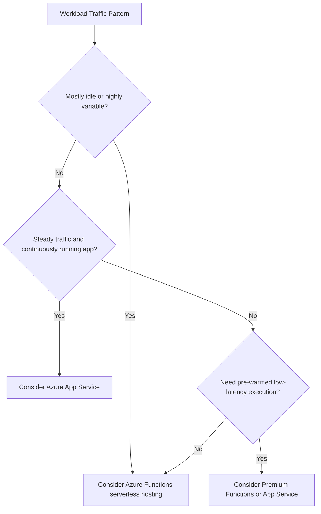

### Important Interview Point

> Do not say that Azure Functions is always cheaper. Functions can be cost-effective for intermittent event-driven workloads, while App Service can be more economical for steady traffic and larger complete applications.

---

# 11. API Development Comparison

## Choose App Service for a Complete API When You Need

- Many controllers and routes
- Shared middleware
- Global filters
- Complex dependency injection
- Large domain model
- Long-running request processing
- Centralized API lifecycle
- Deployment slots
- Predictable HTTP performance

```text
Client
  |
  v
App Service
  |
  +-- Authentication Middleware
  +-- Routing
  +-- Controllers
  +-- Domain Services
  +-- Repositories
  +-- Database
```

## Choose Functions for an API When You Need

- Small independent endpoints
- Webhooks
- Event-driven HTTP operations
- Low-volume or bursty requests
- Simple integrations
- Serverless execution
- Individual endpoint scaling

```text
HTTP Request
  |
  v
HTTP-Triggered Function
  |
  +-- Validate Input
  +-- Execute Small Operation
  +-- Publish Event
  +-- Return Response
```

### Interview Warning

> An HTTP-triggered Function can expose an API, but not every API should be decomposed into independent Functions. A large, cohesive API may be easier to maintain as an App Service application.

---

# 12. Background Processing Comparison

## App Service

Background processing can be implemented using:

- WebJobs
- Separate worker service
- Queue-based background application
- Containerized worker
- External messaging service

## Azure Functions

Background processing is a native use case:

- Queue trigger
- Service Bus trigger
- Timer trigger
- Event Hub trigger
- Blob trigger
- Event Grid trigger

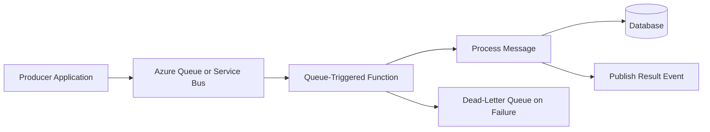

### Interview Answer

> For asynchronous message processing, I would normally evaluate Azure Functions first because triggers, retries, and event-based execution are central to its design.

---

# 13. Deployment Comparison

## App Service Deployment Flow

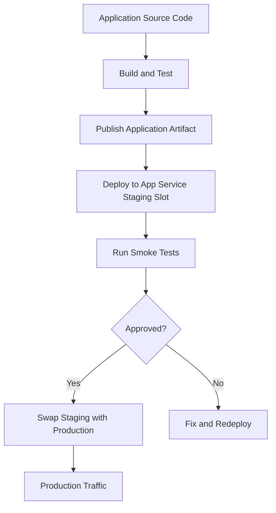

## Functions Deployment Flow

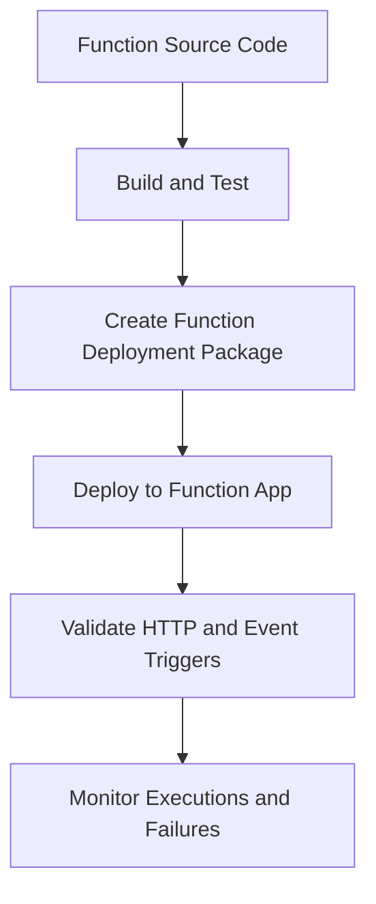

Both App Service and Functions support deployment through tools such as Azure CLI, CI/CD pipelines, and development environments. Azure Functions also supports infrastructure automation using Bicep or ARM templates. ([learn.microsoft.com](https://learn.microsoft.com/en-us/azure/azure-functions/functions-overview?utm_source=openai))

---

# 14. Security Comparison

## App Service Security

Common App Service security capabilities include:

- HTTPS-only access
- App Service authentication
- Microsoft Entra ID integration
- Managed Identity
- Access restrictions
- VNet integration
- Private endpoints
- TLS certificates
- Key Vault integration

## Azure Functions Security

Common Functions security capabilities include:

- Function keys
- Host keys
- Microsoft Entra ID authentication
- Managed Identity
- Key Vault
- HTTPS
- Network restrictions
- Private networking depending on hosting plan

### Important Difference

Function keys are useful for controlling access to functions, but they should not automatically be treated as a full identity and authorization model for enterprise APIs.

For business APIs, use a proper authentication and authorization model such as Microsoft Entra ID and OAuth 2.0 where appropriate.

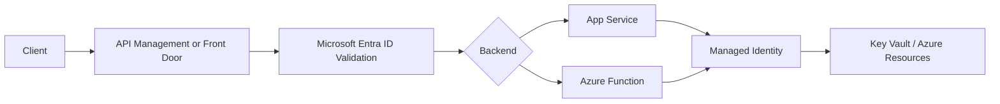

---

# 15. Observability Comparison

Both services integrate with Azure Monitor and Application Insights.

## App Service Monitoring

Monitor:

- HTTP request rate
- Response time
- HTTP status codes
- Application exceptions
- Dependency calls
- Instance health
- CPU and memory
- Deployment health

## Functions Monitoring

Monitor:

- Function invocation count
- Execution duration
- Trigger failures
- Retry count
- Dead-letter messages
- Exceptions
- Queue length
- Dependency calls
- Cold-start impact

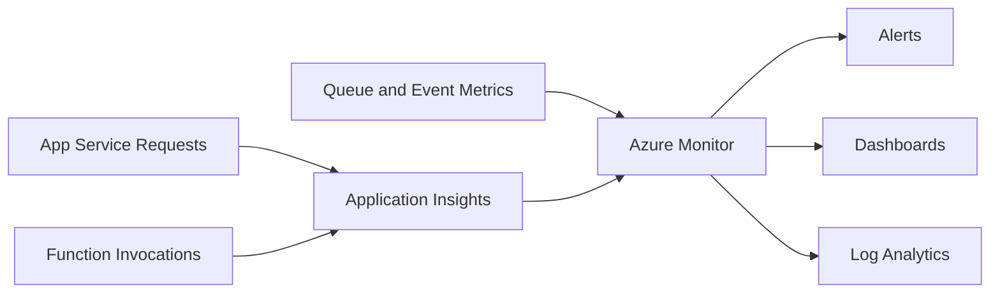

---

# 16. Reliability and Failure Handling

## App Service Reliability Patterns

- Multiple instances
- Health checks
- Deployment slots
- Autoscale
- Retry policies
- Circuit breakers
- External queue processing
- Availability monitoring
- Regional disaster recovery

## Functions Reliability Patterns

- Idempotent function logic
- Retry policies
- Dead-letter queues
- Poison-message handling
- Checkpointing for event streams
- Durable Functions for stateful workflows
- Correlation IDs
- Timeout-aware design

### Message Processing Flow

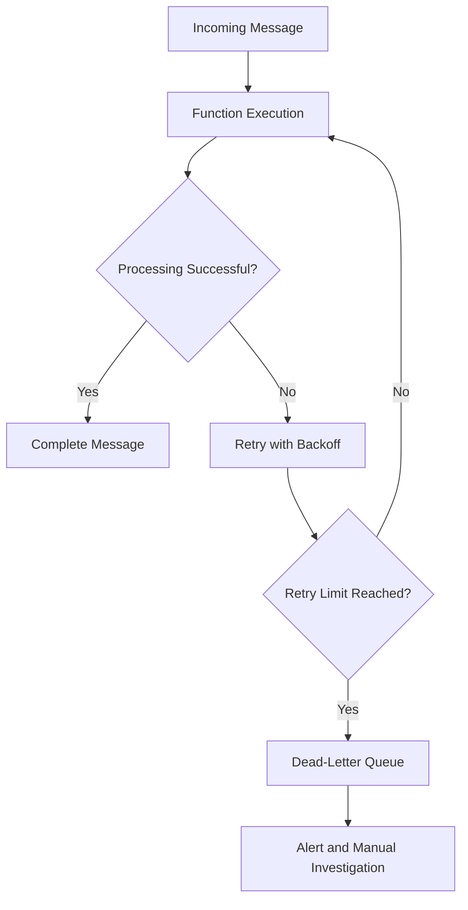

---

# 17. State Management

Both App Service applications and Azure Functions should avoid relying on local instance memory or local disk for durable business state.

## Recommended External State Stores

- Azure SQL
- Azure Cosmos DB
- Azure Storage
- Azure Cache for Redis
- Azure Service Bus
- Durable Functions storage for orchestration state

## Function-Specific Consideration

Functions may scale across multiple instances, so a function should generally be:

- Stateless
- Idempotent
- Safe to retry
- Safe to execute concurrently
- Independent of local instance memory

### Interview Answer

> I keep durable state outside the compute process. This is especially important for Functions because event-driven scaling can create multiple instances and retry the same message.

---

# 18. Durable Functions

Durable Functions extend Azure Functions for stateful workflows and orchestration.

Typical patterns include:

- Function chaining
- Fan-out/fan-in
- Long-running workflows
- Human approval workflows
- Async HTTP APIs
- Checkpointed orchestration

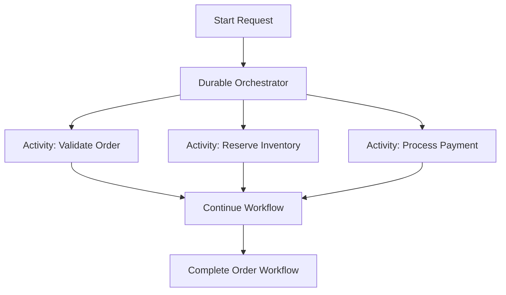

### When to Use Durable Functions

Use Durable Functions when the workflow requires state, coordination, retries, checkpoints, or multiple dependent activities.

Do not use one very large ordinary Function as a substitute for a workflow engine.

---

# 19. App Service and Functions Can Be Used Together

The choice is not always either/or.

A common architecture uses:

- App Service for the main REST API
- Azure Functions for asynchronous processing
- Azure Service Bus for messaging
- Azure SQL for transactional data
- Application Insights for observability

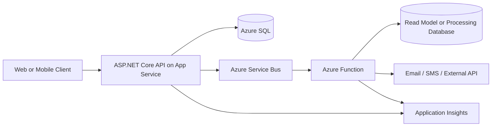

### Interview Answer

> I often use App Service for the synchronous API surface and Functions for asynchronous, scheduled, or event-driven processing. This keeps the API responsive and allows background workloads to scale independently.

---

# 20. Decision Matrix

| Requirement | Recommended Choice |
|---|---|
| Full ASP.NET Core web application | App Service |
| Large REST API with many controllers | App Service |
| Simple HTTP webhook | Azure Functions |
| Queue message processing | Azure Functions |
| Scheduled cleanup job | Azure Functions |
| Continuous predictable API traffic | App Service |
| Highly bursty event workload | Azure Functions |
| Need deployment slots for a web API | App Service |
| Need serverless scale-to-zero | Functions serverless hosting |
| Need simple integration with Azure events | Azure Functions |
| Complex shared middleware and API pipeline | App Service |
| Stateful multi-step orchestration | Durable Functions |
| Long-running application process | App Service or another suitable hosting model |
| Existing dedicated App Service capacity | App Service or Functions on Dedicated Plan |
| Strict low-latency first request | App Service or pre-warmed Functions plan |
| Multiple independent event handlers | Azure Functions |

---

# 21. When to Choose App Service

Choose **Azure App Service** when:

1. You are hosting a complete web application.
2. You are building a medium or large REST API.
3. Traffic is primarily synchronous HTTP traffic.
4. You need a continuously available application process.
5. You need a conventional ASP.NET Core application structure.
6. You need deployment slots and slot swaps.
7. You need broad control over application middleware and routing.
8. Your workload has predictable traffic.
9. You want a straightforward PaaS deployment model.
10. The application is not naturally split into independent event handlers.

### Strong Interview Statement

> I would choose App Service for a cohesive ASP.NET Core application or API where the application process, routing, middleware, dependency injection, and deployment lifecycle are managed as one unit.

---

# 22. When to Choose Azure Functions

Choose **Azure Functions** when:

1. The workload is triggered by events.
2. The work is asynchronous.
3. The workload is intermittent or highly variable.
4. You need scheduled execution.
5. You need queue or Service Bus processing.
6. You are building webhooks or lightweight HTTP endpoints.
7. You want serverless operational management.
8. Individual units of work can scale independently.
9. You need simple integration with Azure services.
10. You need Durable Functions for workflow orchestration.

### Strong Interview Statement

> I would choose Azure Functions when execution is naturally initiated by an event and the logic can be isolated into small, stateless, retry-safe units.

---

# 23. Common Mistakes

## Mistake 1: Choosing Functions for Every API

Not every REST API should be split into Functions. A large cohesive API may become harder to maintain if every endpoint is independently deployed.

## Mistake 2: Choosing App Service for All Background Work

App Service can host background tasks, but queue-triggered and event-driven processing may be simpler and more scalable with Functions.

## Mistake 3: Ignoring Cold Starts

If the workload requires predictable first-request latency, evaluate App Service, Premium Functions, or always-ready capacity.

## Mistake 4: Ignoring Retry Behavior

Functions triggered by messages may be retried. The logic must be idempotent and safe to execute more than once.

## Mistake 5: Treating Function Keys as Enterprise Identity

Function keys provide access control but are not a replacement for complete identity, authorization, auditing, and role-based access control.

## Mistake 6: Storing State Locally

Instances can be restarted or scaled out. Store durable state in an external data service.

## Mistake 7: Ignoring Hosting Plan Details

Azure Functions behavior depends heavily on the hosting plan. Check scaling, networking, execution duration, cold-start, operating system, and billing behavior before selecting a plan. ([learn.microsoft.com](https://learn.microsoft.com/en-us/azure/azure-functions/functions-scale?utm_source=openai))

---

# 24. Scenario-Based Interview Questions

## Scenario 1: Customer REST API

### Requirement

A company needs a .NET API with:

- 50 endpoints
- JWT authentication
- Shared middleware
- Database transactions
- Stable HTTP traffic
- Deployment slots

### Answer

> I would choose Azure App Service. This is a cohesive REST API with shared middleware, routing, authentication, and predictable HTTP traffic. App Service provides a natural hosting model and supports deployment slots for controlled releases.

---

## Scenario 2: Order Queue Processing

### Requirement

Orders are placed through an API and published to Service Bus. A worker validates and processes each order.

### Answer

> I would use App Service for the synchronous order API and Azure Functions with a Service Bus trigger for asynchronous order processing. The Function would be idempotent, use retry policies, and send poison messages to a dead-letter queue.

---

## Scenario 3: Nightly Data Cleanup

### Requirement

Run a cleanup operation every night at 2:00 AM.

### Answer

> I would use a timer-triggered Azure Function. The workload is scheduled, independent, and does not require a continuously running web application.

---

## Scenario 4: Global High-Volume Web API

### Requirement

A high-volume customer API requires predictable latency, shared middleware, and controlled blue-green deployments.

### Answer

> I would start with Azure App Service, potentially behind Azure Front Door or API Management. I would use multiple instances, autoscale, deployment slots, Application Insights, and a resilient data layer. I would consider Premium Functions only if the API is naturally decomposed into independent event-driven operations.

---

# 25. 60-Second Interview Pitch

> Azure App Service and Azure Functions are both managed Azure services, but they solve different problems. App Service is application-centric and is best for complete web applications and continuously running REST APIs. Azure Functions is function- and event-centric and is best for queue processing, timers, webhooks, lightweight HTTP endpoints, and asynchronous integrations. App Service generally provides a more conventional application lifecycle with deployment slots and predictable hosting. Functions provide event-driven scaling and serverless execution, but I must design for retries, idempotency, cold starts, and plan-specific limits. In many production systems, I use App Service for the synchronous API and Functions for asynchronous background processing.

---

# 26. Final Summary

## Azure App Service

```text
Application-centric
Managed PaaS
Best for complete applications and APIs
Predictable continuous hosting
Deployment slots
Conventional web application model
```

## Azure Functions

```text
Function-centric
Serverless/event-driven
Best for triggers, jobs, queues, and integrations
Automatic event-driven scaling
Possible scale-to-zero
Requires idempotency and retry-aware design
```

## Best One-Line Answer

> Choose Azure App Service for a complete, continuously running web application or API; choose Azure Functions for small, event-driven, asynchronous, scheduled, or highly variable workloads.

## Recommended Architecture for Many Enterprise Systems

```text
Client
  |
  v
ASP.NET Core API on Azure App Service
  |
  +-- Synchronous database operations
  +-- Publish events to Service Bus
              |
              v
       Azure Functions
              |
              +-- Background processing
              +-- Notifications
              +-- Integrations
              +-- Scheduled jobs
```

This hybrid approach combines the structured application model of App Service with the event-driven scalability of Azure Functions.