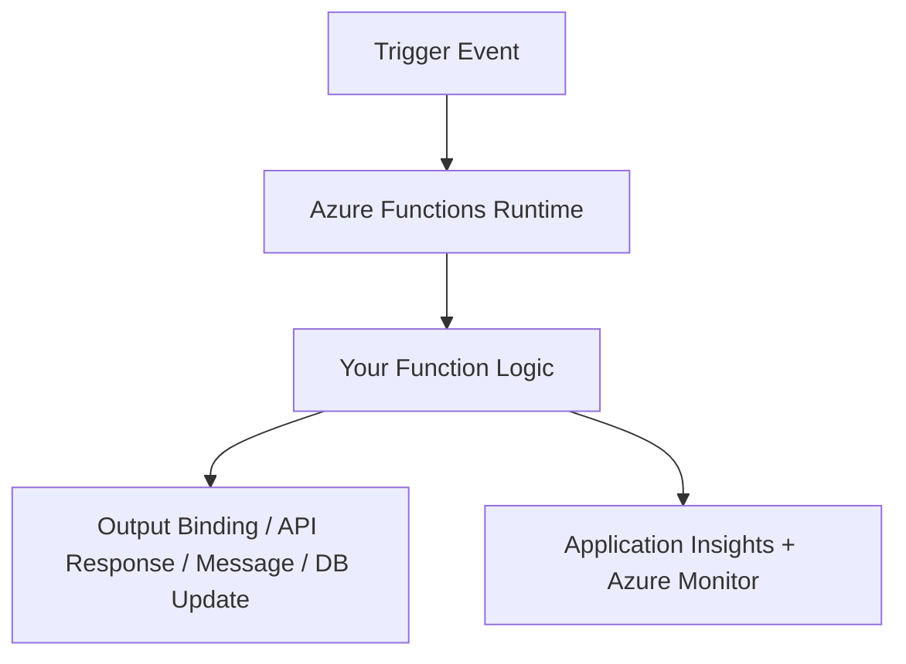
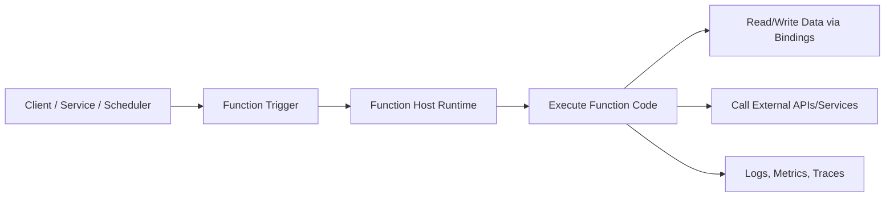
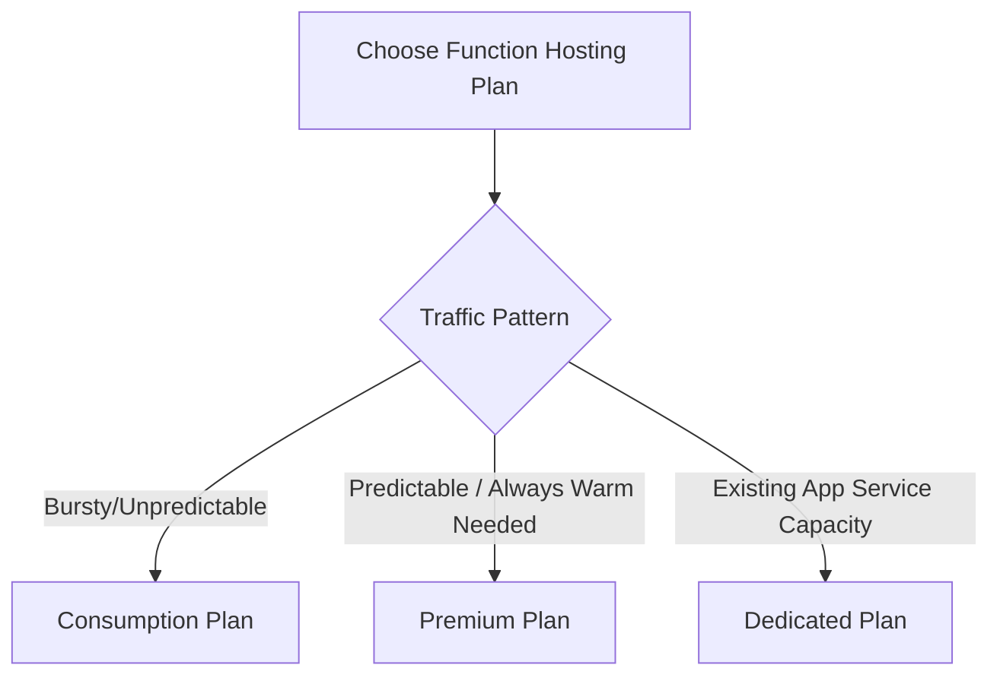
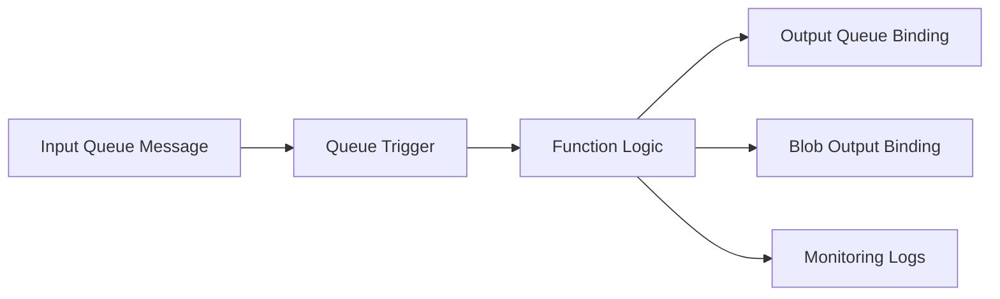
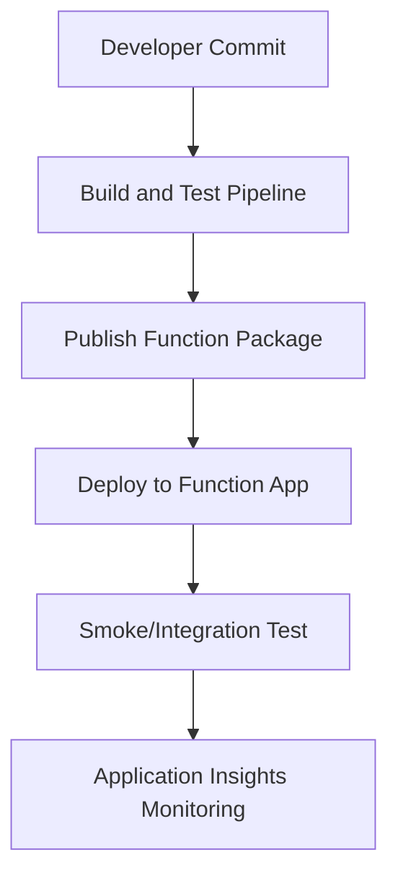
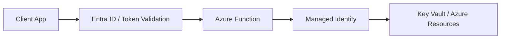
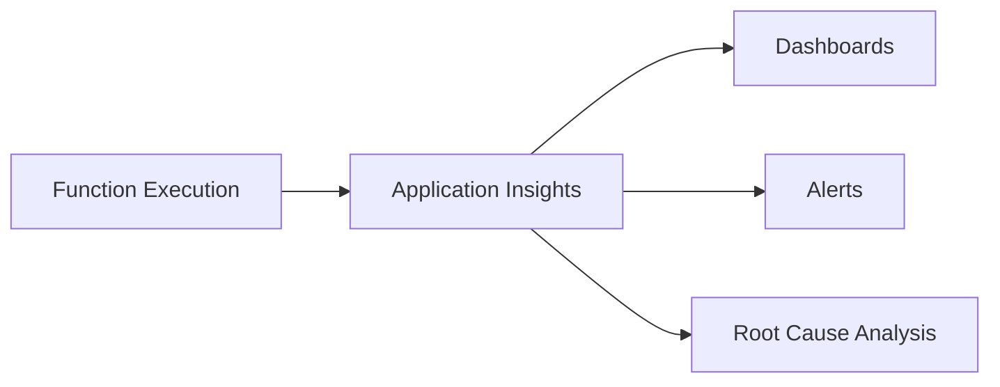
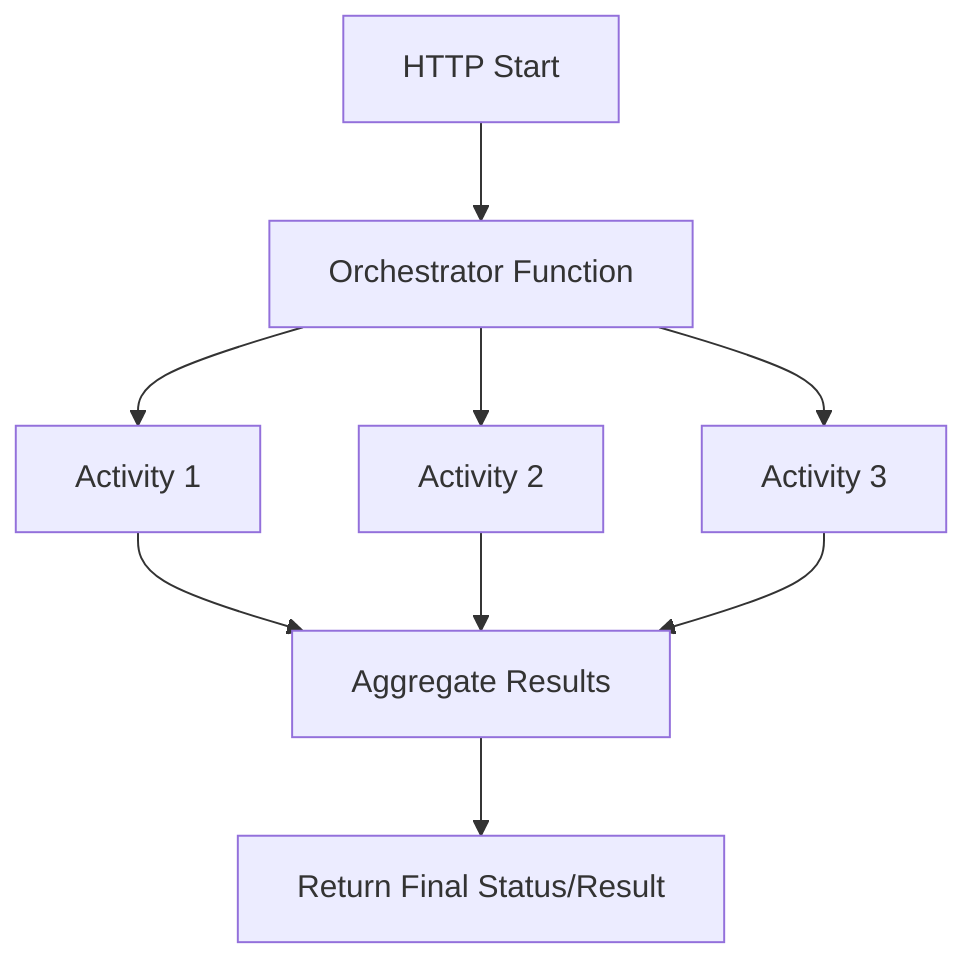

# Azure Functions  
## Detailed Interview Preparation Guide with Flow Charts

## 1) What is Azure Function?

**Azure Functions** is Microsoft Azure’s **serverless compute service** that lets you run event-driven code without managing servers.

You write small units of logic called **functions**, and Azure runs them when triggered by events such as:

- HTTP request
- Timer schedule
- Queue message
- Event Hub event
- Blob storage change
- Service Bus message
- Cosmos DB change feed

### Simple Interview Definition

> Azure Functions is a serverless service for running event-driven code on demand, with automatic scaling and pay-for-execution pricing options.

---

## 2) Why Azure Functions?

Use Azure Functions when you want to:

- Build lightweight APIs quickly
- Process events asynchronously
- Run scheduled jobs
- Integrate systems with minimal infrastructure overhead
- Scale automatically based on demand
- Reduce costs for bursty/unpredictable workloads

---

## 3) High-Level Flow Chart

---

## 4) Azure Functions Core Concepts

## 4.1 Function App
A **Function App** is the logical container for one or more functions that share:

- Hosting plan
- Runtime version
- App settings
- Identity configuration

## 4.2 Function
A single executable unit of code (method/script) that runs on trigger.

## 4.3 Trigger
Defines how a function starts.

Examples:
- HTTP trigger
- Timer trigger
- Queue trigger
- Event Grid trigger
- Blob trigger

## 4.4 Bindings
Bindings simplify connecting to other services without writing repetitive plumbing code.

- **Input binding**: read from a source (e.g., queue/blob/db)
- **Output binding**: write to a target (e.g., queue/blob/service bus)

---

## 5) End-to-End Execution Flow

---

## 6) Hosting Plans (Important Interview Topic)

Azure Functions supports multiple hosting models. Interviewers often ask this.

## 6.1 Consumption Plan
- Serverless, automatic scaling
- Pay per execution and execution time
- Good for bursty workloads
- Can have cold starts

## 6.2 Premium Plan
- Pre-warmed workers reduce cold start impact
- Better for predictable performance
- VNet integration support and advanced features
- More expensive than consumption

## 6.3 Dedicated Plan (App Service Plan)
- Runs on reserved instances
- Useful when you already run App Service workloads
- Manual/auto scale depending on setup
- Suitable for long-running or steady workloads

### Hosting Plan Selection Flow

---

## 7) Trigger Types (Interview-Friendly Table)

| Trigger Type | Typical Use Case |
|---|---|
| HTTP Trigger | Lightweight APIs, webhooks |
| Timer Trigger | Scheduled jobs, cleanup tasks |
| Queue Storage Trigger | Background processing |
| Service Bus Trigger | Enterprise messaging workflows |
| Event Grid Trigger | Reactive cloud event handling |
| Blob Trigger | File processing pipelines |
| Event Hub Trigger | Streaming/telemetry ingestion |
| Cosmos DB Trigger | React to data changes |

---

## 8) Binding Examples

## Input Binding Example
A queue-triggered function receives a message directly as input object.

## Output Binding Example
After processing, function writes result to:
- Another queue
- Blob storage
- Cosmos DB
- Service Bus topic

### Flow with Bindings

---

## 9) Azure Functions vs Azure App Service vs AKS (Interview Comparison)

| Area | Azure Functions | Azure App Service | AKS |
|---|---|---|---|
| Model | Serverless FaaS | Managed PaaS | Kubernetes orchestration |
| Best For | Event-driven tasks, small APIs | Full web apps/APIs | Complex microservices |
| Scaling | Event-driven automatic | Configurable autoscale | Advanced custom autoscale |
| Ops Effort | Low | Low-Medium | High |
| Cold Start | Possible (plan dependent) | Typically less concern | Depends on setup |
| Control | Lower | Medium | Very high |

---

## 10) Practical Use Cases

1. **HTTP micro-endpoints** for lightweight API operations  
2. **File processing pipeline** on blob upload  
3. **Order processing** from queue/service bus events  
4. **Scheduled report generation** with timer trigger  
5. **IoT telemetry processing** via Event Hub  
6. **Data sync/integration jobs** between SaaS systems  
7. **Notification workflows** (email/SMS/push) on business events  

---

## 11) .NET Azure Functions Development Models

In .NET, common approaches include:

- **Isolated worker model** (recommended for modern .NET versions)
- **In-process model** (older approach for certain versions)

Interview point:
- Understand runtime compatibility and project template choice based on targeted .NET version and support lifecycle.

---

## 12) Deployment Flow (CI/CD)

Deployment options:
- GitHub Actions
- Azure DevOps
- Zip deploy
- ARM/Bicep/Terraform for infra + app deployment

---

## 13) Security Best Practices

1. Use **Managed Identity** for Azure resource access  
2. Store secrets in **Azure Key Vault**  
3. Use **Function keys / Auth levels** appropriately  
4. Prefer **Microsoft Entra ID / OAuth2** for protected APIs  
5. Restrict network access (VNet/private endpoints where needed)  
6. Enable HTTPS only  
7. Apply least-privilege RBAC

### Security Flow

---

## 14) Observability and Monitoring

Use:
- **Application Insights** for traces, exceptions, dependencies
- **Azure Monitor** for metrics and alerts
- Distributed tracing with correlation IDs
- Log Analytics for query and dashboards

### Monitoring Flow

---

## 15) Performance and Reliability Considerations

- Keep functions small and single-purpose
- Avoid heavy startup logic
- Reuse static clients (e.g., HttpClient best practices)
- Use retry policies for transient faults
- Implement idempotency for message reprocessing
- Configure dead-letter patterns for poison messages
- Split long workflows using Durable Functions if needed

---

## 16) Durable Functions (Advanced Interview Topic)

**Durable Functions** extends Azure Functions for stateful workflows:

- Function chaining
- Fan-out/fan-in
- Async HTTP API patterns
- Human interaction workflows
- Long-running orchestrations

### Durable Flow Example

---

## 17) Common Interview Questions + Strong Answers

### Q1: What is Azure Functions?
**Answer:** A serverless compute service for running event-driven code triggered by HTTP/events/messages/timers, with automatic scaling.

### Q2: When should you use Azure Functions?
**Answer:** For event-driven workloads, lightweight APIs, scheduled jobs, integrations, and bursty traffic where low ops overhead is desired.

### Q3: What is the difference between trigger and binding?
**Answer:** Trigger starts function execution; bindings connect function input/output to other Azure services with minimal boilerplate code.

### Q4: What are hosting plan options?
**Answer:** Consumption, Premium, and Dedicated (App Service plan), each balancing cost, cold start behavior, and performance guarantees.

### Q5: How do you secure Azure Functions?
**Answer:** Managed Identity, Key Vault, Entra ID/OAuth, HTTPS enforcement, RBAC, and restricted network access.

### Q6: What is cold start?
**Answer:** Startup latency when a function app instance is not pre-warmed. More visible in consumption plans; Premium helps reduce it.

### Q7: How do you handle long-running workflows?
**Answer:** Use Durable Functions orchestration patterns instead of one long-running stateless function execution.

---

## 18) Common Pitfalls

1. Treating Functions like monolithic app services  
2. Ignoring idempotency in message-triggered functions  
3. Not planning for retries and dead-letter handling  
4. Putting secrets in app settings directly instead of Key Vault  
5. Lack of observability and alerting setup  
6. Overusing HTTP functions for workflows better suited to queue/event-driven patterns  

---

## 19) 60-Second Interview Pitch

> Azure Functions is Azure’s serverless compute service used for event-driven execution. You write small units of business logic that run on triggers like HTTP, queues, timers, and events. It automatically scales and can be cost-efficient for bursty workloads. Core concepts are Function App, triggers, and bindings. Hosting options include Consumption, Premium, and Dedicated plans. In production, I secure functions with Managed Identity and Key Vault, expose APIs with proper auth, and use Application Insights for observability. For long-running or stateful flows, I use Durable Functions.

---

## 20) Final Summary

Azure Functions is best when you need:
- Rapid development
- Event-driven architecture
- Automatic scaling
- Minimal infrastructure management

For interview success, clearly explain:
1. What it is  
2. How triggers/bindings work  
3. Hosting plan trade-offs  
4. Security and monitoring practices  
5. When to choose it vs App Service/AKS