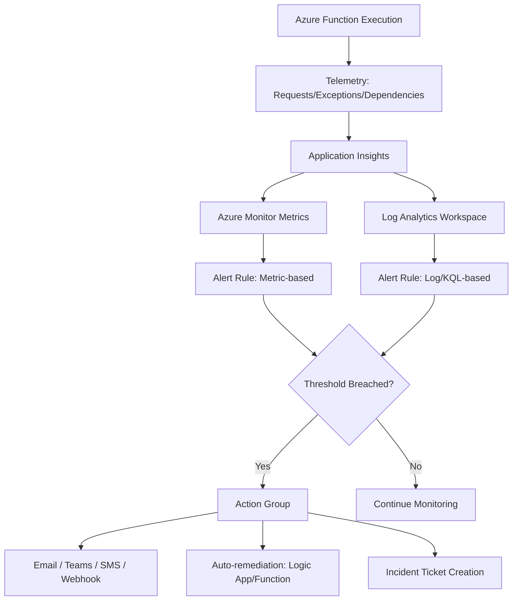
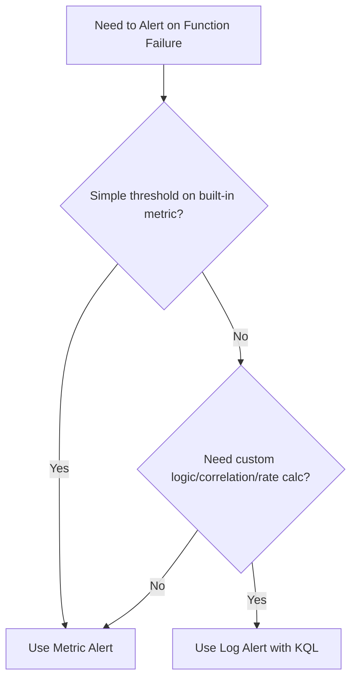
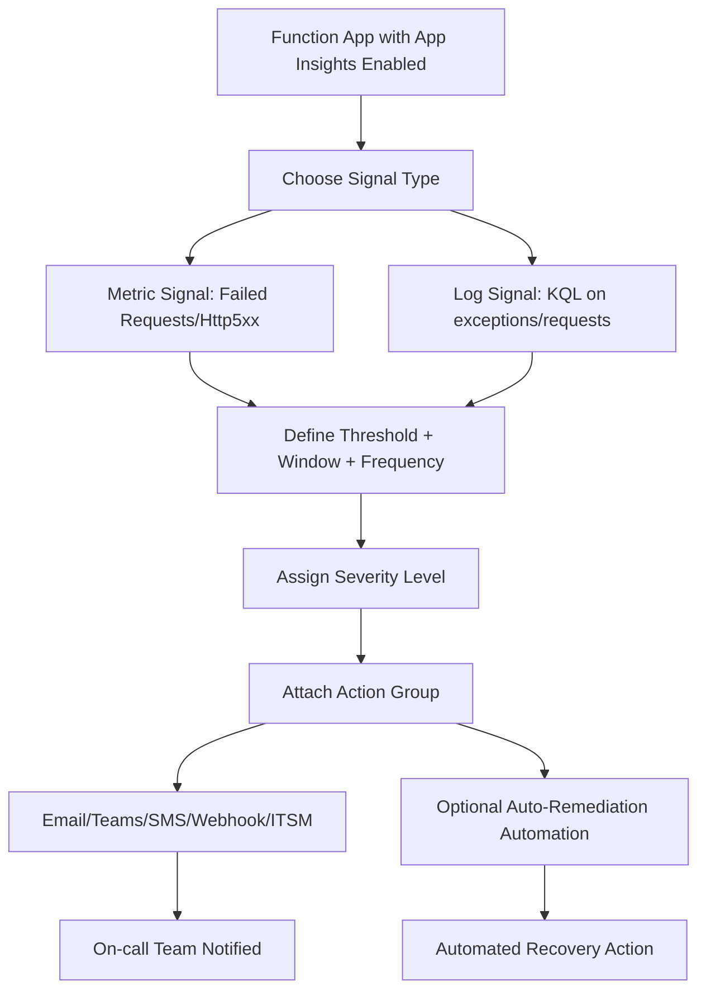
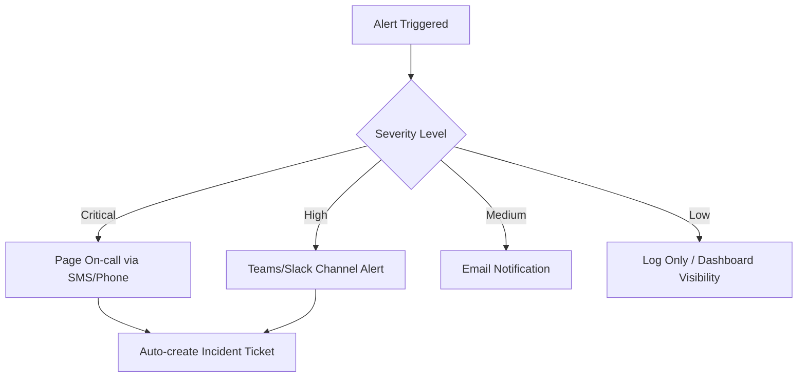
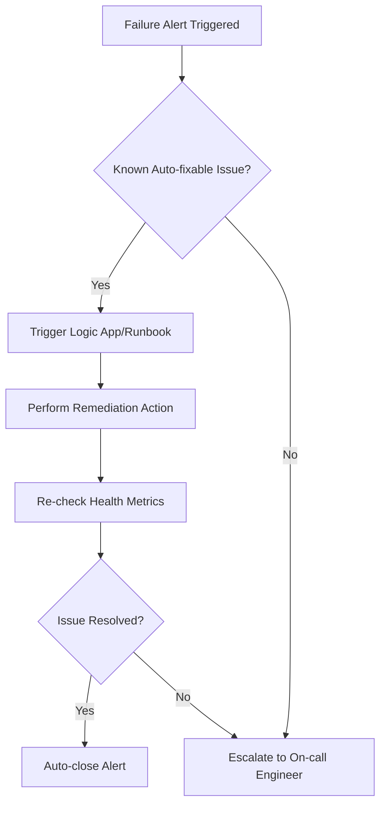

# How to Configure Alerts When an Azure Function Fails
## Detailed Interview Preparation Guide with Flow Charts

## 1) Direct Interview Answer

To alert on Azure Function failures, you typically:

1. Enable **Application Insights** for the Function App
2. Choose **signal source**: Metrics (fast, near-real-time) or Log Analytics/KQL (flexible, precise)
3. Create an **Azure Monitor Alert Rule** with a condition (e.g., failed requests > threshold)
4. Attach an **Action Group** (email, Teams, webhook, ITSM, Function/Logic App)
5. Set **evaluation frequency + window + severity**
6. Route to on-call/incident workflow and link a **runbook**

> Interview one-liner: *“I configure an Azure Monitor alert rule on Application Insights failure signals — either metric-based like Failed Requests, or KQL-based on exceptions/dependency failures — then route it through an Action Group to notify on-call and trigger incident response.”*

---

## 2) Alerting Architecture Flow Chart

---

## 3) Two Main Alerting Approaches

## 3.1 Metric-Based Alerts (Fast, Simple)
Use built-in Application Insights / Function metrics such as:
- Failed requests count
- Function execution count (failures)
- Http5xx count
- Exceptions count

Best for:
- Quick, low-latency detection
- Simple threshold-based alerting

## 3.2 Log-Based Alerts (KQL, Flexible)
Use Log Analytics queries against `requests`, `exceptions`, `dependencies`, `traces`.

Best for:
- Complex conditions (e.g., failure rate %, specific exception types)
- Correlating multiple signals
- Custom business logic in alert condition

### Decision Flow

---

## 4) Step-by-Step: Metric-Based Alert (Azure Portal / CLI Concept)

## Step 1: Enable Application Insights
Ensure Function App is linked to an Application Insights resource.

## Step 2: Create Alert Rule
- Scope: Function App / Application Insights resource
- Signal type: Metrics
- Signal name: e.g., "Http 5xx", "Failed Requests", "Function Execution Count" (filtered to failures)

## Step 3: Configure Condition
- Aggregation: Count/Sum
- Threshold: e.g., > 5 failures
- Evaluation period: e.g., last 5 minutes
- Frequency: e.g., every 1 minute

## Step 4: Attach Action Group
- Email/SMS/Teams
- Webhook to ITSM (ServiceNow/PagerDuty)
- Automation runbook/Logic App/Function for auto-remediation

## Step 5: Set Severity
- Sev 0/1: Critical outage
- Sev 2: Degraded performance
- Sev 3/4: Informational/warning

---

## 5) Step-by-Step: Log-Based (KQL) Alert

## Step 1: Write KQL Query Example (Conceptual)
Query failed requests from `requests` table where `success == false`, or query `exceptions` table for exception spikes within a time window.

## Step 2: Create Log Search Alert Rule
- Scope: Log Analytics Workspace (linked to App Insights)
- Signal type: Custom log search / Log query alert
- Condition: Number of results > threshold over evaluation window

## Step 3: Configure Frequency and Time Window
- Evaluation frequency: e.g., every 5 minutes
- Lookback period: e.g., last 15 minutes

## Step 4: Attach Action Group
Same as metric-based (email/Teams/webhook/ITSM).

## Step 5: Add Dimensions (Optional)
Split alerts by `functionName` or `operationName` for granular routing (e.g., different team owns different function).

---

## 6) End-to-End Alert Configuration Flow

---

## 7) Example Alert Scenarios (Practical Interview Examples)

## Scenario A: Simple Failure Count Alert
- Signal: Failed requests metric
- Condition: Count > 5 in 5 minutes
- Action: Email + Teams notification

## Scenario B: Failure Rate Percentage Alert (KQL)
- Signal: Log query calculating failure percentage over total requests
- Condition: Failure rate > 5% over 15 minutes
- Action: Page on-call engineer + create ITSM ticket

## Scenario C: Dead-letter Queue Growth (Queue-triggered Function)
- Signal: Custom metric/log on dead-letter queue length
- Condition: Dead-letter count > threshold
- Action: Notify integration team + trigger remediation Logic App

## Scenario D: Specific Exception Type Spike
- Signal: KQL query filtering `exceptions` by exception type (e.g., SQL timeout)
- Condition: Count > threshold in short window
- Action: Notify database/platform team specifically

---

## 8) Action Group Design (Routing Logic)

Best practice:
- Different action groups per severity/team
- Avoid single noisy channel for all alerts

---

## 9) Auto-Remediation Pattern (Advanced Interview Point)

Some failures can trigger automated recovery actions instead of just notifying humans.

Examples:
- Restart Function App (via Automation Runbook/Logic App)
- Scale out App Service Plan
- Reprocess dead-letter messages after fix
- Disable a faulty downstream integration temporarily

### Auto-Remediation Flow

---

## 10) Alert Noise Reduction Best Practices

1. Use appropriate evaluation window (avoid too sensitive/too loose)
2. Use dynamic thresholds where supported instead of static-only
3. Group related alerts to avoid duplicate notifications
4. Suppress known maintenance windows
5. Use severity-based routing (not all alerts should page humans)
6. Correlate alerts with deployment markers to reduce false escalation

---

## 11) Key Metrics/Signals Commonly Used for Failure Alerts

| Signal | Use Case |
|---|---|
| Failed Requests (5xx) | HTTP-triggered function failures |
| Exceptions count | Unhandled errors in code |
| Function execution failures | General invocation failures |
| Dependency failures | DB/API/storage call failures |
| Dead-letter queue count | Message processing failures |
| Timeout count | Long-running/slow dependency issues |
| Retry count spike | Systemic downstream instability |

---

## 12) Interview Q&A (Strong Sample Answers)

### Q1: How do you alert when a Function fails?
**Answer:** Enable Application Insights, create an Azure Monitor alert rule on failed requests/exceptions (metric or KQL-based), and route notifications through an Action Group.

### Q2: Metric alert vs Log alert — when to use which?
**Answer:** Metric alerts for fast, simple threshold detection; log/KQL alerts for custom logic like failure rate percentage or specific exception correlation.

### Q3: How do you avoid alert fatigue?
**Answer:** Use severity tiers, proper evaluation windows, suppression during deployments/maintenance, and route non-critical alerts to dashboards instead of paging.

### Q4: Can you automate recovery after a failure alert?
**Answer:** Yes, via Action Groups triggering Automation Runbooks or Logic Apps for known remediation patterns, followed by verification before closing alert.

### Q5: How do you alert on async/queue-based function failures?
**Answer:** Monitor dead-letter queue growth, retry counts, and message age; alert when thresholds are breached to catch silent processing failures.

---

## 13) 60-Second Interview Pitch

> I configure Azure Function failure alerts using Azure Monitor tied to Application Insights telemetry. For simple cases, I use metric alerts like failed requests or exceptions count with a defined threshold and evaluation window. For more precise detection, I use log-based KQL alerts to calculate failure rates or filter specific exception types. Alerts route through Action Groups with severity-based channels—critical issues page on-call, while lower severity issues go to Teams/email or dashboards. Where possible, I add auto-remediation workflows for known failure patterns, followed by verification before closing the alert.

---

## 14) Final Summary Checklist

- [ ] Application Insights enabled for Function App
- [ ] Chosen appropriate signal type (metric vs KQL)
- [ ] Threshold, window, and frequency configured correctly
- [ ] Severity level assigned appropriately
- [ ] Action Group configured with correct routing
- [ ] Dead-letter/queue-specific alerts included for async functions
- [ ] Noise reduction practices applied (suppression, grouping, dynamic thresholds)
- [ ] Auto-remediation considered for known recoverable failures
- [ ] Alerts linked to runbooks for faster incident response

---

## One-Line Interview Conclusion

> Configure Azure Monitor alert rules on Application Insights failure signals (metrics or KQL), route them through severity-based Action Groups, and pair critical alerts with automated remediation and incident workflows.