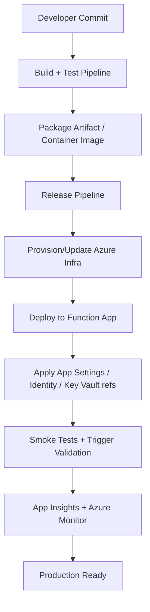
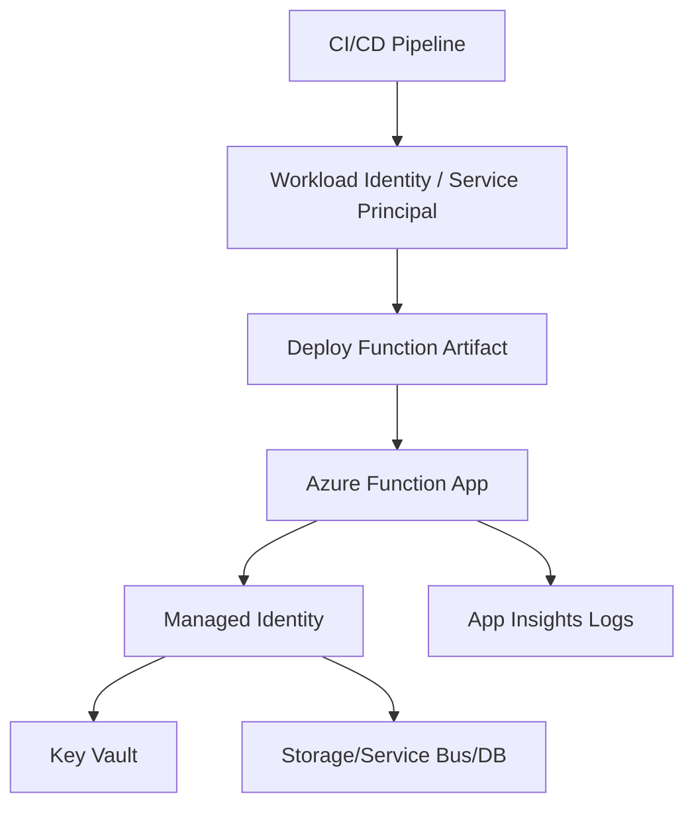
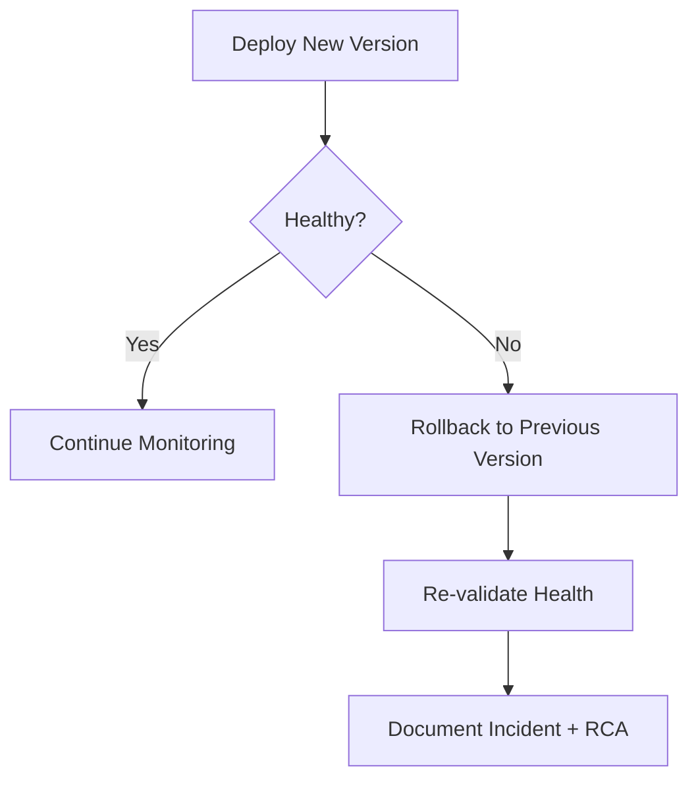

# How to Deploy Azure Functions  
## Detailed Interview Preparation Guide with Flow Charts

## 1) Direct Interview Answer

You deploy Azure Functions by:
1. Creating/provisioning a **Function App** and related Azure resources
2. Packaging your function code (zip/package/container)
3. Releasing through CI/CD (GitHub Actions, Azure DevOps, or CLI)
4. Applying configuration (app settings, identity, networking, secrets)
5. Validating deployment with monitoring and health checks

> Interview one-liner: *“I deploy Azure Functions using Infrastructure as Code plus CI/CD, with staged validation, managed identity, and Application Insights-based observability.”*

---

## 2) End-to-End Deployment Flow Chart

---

## 3) Deployment Prerequisites

Before deployment, ensure:

- Azure subscription + resource group
- Function App (and hosting plan)
- Storage account (required by Functions runtime in common setups)
- Application Insights enabled
- Identity model decided (Managed Identity preferred)
- Networking model (public/private/VNet integration)
- CI/CD service connection permissions
- Runtime/language version compatibility

---

## 4) Hosting Plan Choice Impacts Deployment

Common hosting options:
1. **Consumption/Flex Consumption (serverless)**  
2. **Premium**  
3. **Dedicated (App Service Plan)**  
4. **Container-based hosting options** (when applicable)

Why this matters:
- Cold start behavior
- VNet/private networking features
- Scale profile
- Deployment strategy and cost model

---

## 5) Main Deployment Methods

## 5.1 Zip/Package Deployment
- Build function app
- Package artifacts
- Deploy package to Function App

Good for:
- Standard CI/CD
- Fast deployments
- Versioned artifacts

## 5.2 CI/CD Native Deploy (GitHub Actions / Azure DevOps)
- Automated build-test-deploy pipeline
- Environment approvals and gates
- Roll-forward/rollback workflow

Good for:
- Team workflows
- Auditability
- Repeatable enterprise delivery

## 5.3 Container Image Deployment
- Build Docker image
- Push to Azure Container Registry
- Deploy image to function hosting target

Good for:
- Custom dependencies
- Runtime consistency
- Advanced platform control patterns

---

## 6) CI/CD Pipeline Flow (Recommended)

```mermaid
flowchart LR
    Commit[Code Commit] --> Build[Build]
    Build --> Test[Unit Tests]
    Test --> Scan[Security/Dependency Scan]
    Scan --> Publish[Publish Artifact]
    Publish --> DeployStaging[Deploy to Staging/Non-Prod]
    DeployStaging --> Verify[Smoke + Integration Tests]
    Verify --> Approval[Approval Gate]
    Approval --> DeployProd[Deploy to Production]
    DeployProd --> Observe[Post-Deploy Monitoring]
```

---

## 7) Infrastructure as Code (IaC) for Function Deployments

Use IaC to provision:
- Function App
- Hosting plan
- Storage
- App Insights
- Key Vault references
- RBAC assignments
- Networking rules/private endpoints
- Alerts and dashboards

Tools:
- Bicep / ARM templates
- Terraform

Interview value:
> IaC ensures consistent, repeatable, auditable deployments across dev/test/prod.

---

## 8) Configuration Management During Deployment

Separate code from configuration:

- App settings per environment
- Connection strings via Key Vault references
- Feature flags where applicable
- Runtime settings
- Trigger-specific settings (queue names/topic names/etc.)

Best practice:
- Never hardcode secrets
- Use Managed Identity + Key Vault
- Validate required settings at startup/deploy time

---

## 9) Secure Deployment Pattern

Security controls:
- Least-privilege RBAC for pipeline identity
- Signed artifacts where possible
- Secret scanning before release
- Network-restricted deployment targets (where required)

---

## 10) Deployment Slots / Staged Rollout Considerations

For plans/features that support staged rollout patterns:
- Deploy to staging environment
- Run smoke and integration tests
- Promote to production after validation

If slot model is not applicable in chosen plan:
- Use separate environment apps (dev/test/prod)
- Use blue/green style with traffic manager/front door where needed

---

## 11) Post-Deployment Validation Checklist

After deploy:
1. Function host started successfully
2. Triggers are active and healthy
3. App settings loaded correctly
4. Managed Identity access works
5. Dependencies reachable (DB, queue, APIs)
6. Smoke tests pass
7. No spike in exceptions/5xx
8. Alerts and dashboards receiving telemetry

---

## 12) Trigger-Specific Deployment Validation

## HTTP Trigger
- Endpoint reachable
- AuthN/AuthZ works
- Response code and latency acceptable

## Queue/Service Bus Trigger
- Can consume new messages
- Retry/dead-letter behavior intact
- No backlog growth after deployment

## Timer Trigger
- Next scheduled run confirmed
- No missed schedule anomalies

## Event Hub/Event Grid/Blob Trigger
- Event subscription and binding validation
- End-to-end processing verified

---

## 13) Rollback Strategy (Must Mention in Interviews)

Plan rollback before production deploy:
- Keep previous artifact/image version
- Fast redeploy of last known good build
- Infra changes versioned and reversible
- Feature flags to disable risky paths quickly

### Rollback Flow

---

## 14) Common Deployment Architectures

## A) Simple API Function App
- HTTP-triggered functions
- Key Vault + Managed Identity
- App Insights + alerts

## B) Event-Driven Processing
- Queue/Service Bus triggers
- Dead-letter queues
- Worker scaling and replay-safe handlers

## C) Enterprise Multi-Env
- Separate Function Apps for dev/test/prod
- IaC-managed infra
- CI/CD approvals and policy gates
- Centralized observability and security controls

---

## 15) Monitoring Deployment Success

Track these immediately after release:
- Invocation success rate
- Exception count
- Dependency failures
- Trigger lag/backlog
- Duration percentiles (P95/P99)
- Cost/throughput anomalies

Alert quickly on:
- Failure spikes
- Trigger not firing
- Dead-letter growth
- Auth failures to dependencies

---

## 16) Common Mistakes in Azure Functions Deployment

1. Deploying without IaC (configuration drift)
2. Hardcoding secrets in app settings/code
3. No environment separation
4. Missing post-deploy validation
5. No rollback mechanism
6. Ignoring trigger health checks
7. Over-privileged pipeline permissions
8. No monitoring/alerts configured before go-live

---

## 17) Interview Q&A (Strong Answers)

### Q1: What are common ways to deploy Azure Functions?
**Answer:** CI/CD with GitHub Actions/Azure DevOps using zip/package deploy or container image deployment; infrastructure is typically provisioned via Bicep/ARM/Terraform.

### Q2: How do you secure deployments?
**Answer:** Use least-privilege pipeline identity, managed identity for runtime access, Key Vault for secrets, RBAC, and security scans in CI.

### Q3: How do you validate deployment success?
**Answer:** Smoke tests, trigger-specific checks, dependency connectivity checks, and telemetry review in Application Insights/Azure Monitor.

### Q4: How do you rollback a bad deployment?
**Answer:** Redeploy previous known-good artifact/image, verify health, and use feature flags or staged deployment patterns to minimize impact.

### Q5: Why use IaC for function deployments?
**Answer:** IaC provides consistency, repeatability, auditability, environment parity, and reduced manual errors.

---

## 18) 60-Second Interview Pitch

> I deploy Azure Functions using an automated CI/CD pipeline with Infrastructure as Code. The pipeline builds, tests, scans, and packages the function artifact, then deploys to a target Function App with environment-specific configuration. I secure the deployment using least-privilege identities, managed identity at runtime, and Key Vault-backed secrets. After deployment, I run smoke and trigger-level validation tests, monitor telemetry in Application Insights, and enforce alerting for failures and latency spikes. I always keep a rollback path with a previous known-good artifact and documented incident/runbook procedures.

---

## 19) Final Deployment Checklist

- [ ] Function App + hosting plan provisioned  
- [ ] Storage + App Insights configured  
- [ ] IaC used for infra consistency  
- [ ] CI/CD with build, test, and security scans  
- [ ] Secrets managed via Key Vault references  
- [ ] Managed Identity + RBAC configured  
- [ ] Trigger-specific validation executed  
- [ ] Alerts and dashboards enabled  
- [ ] Rollback plan tested  

---

## One-line Conclusion

> Deploy Azure Functions with IaC + CI/CD, secure configuration and identity practices, trigger-aware validation, strong observability, and a tested rollback strategy.