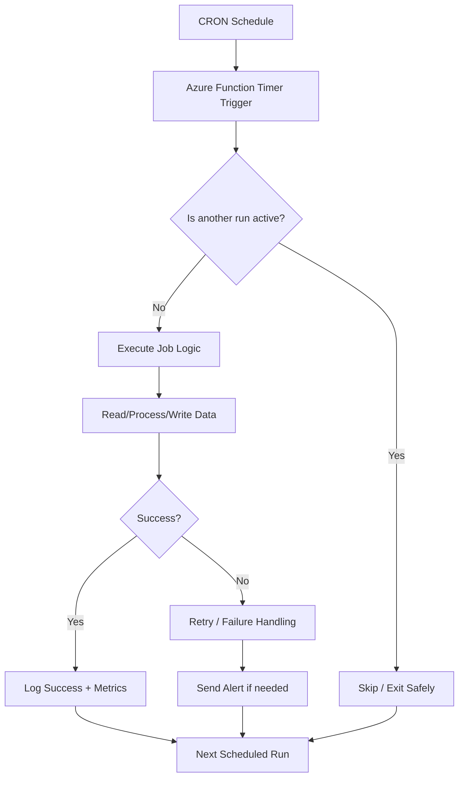
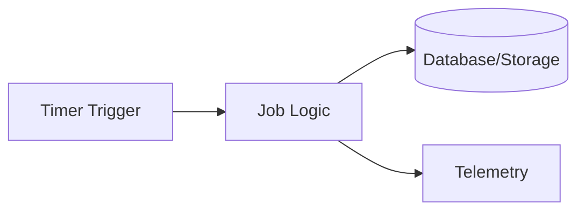
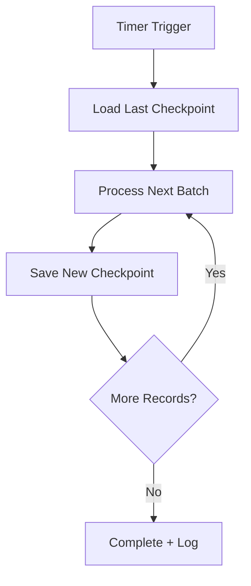
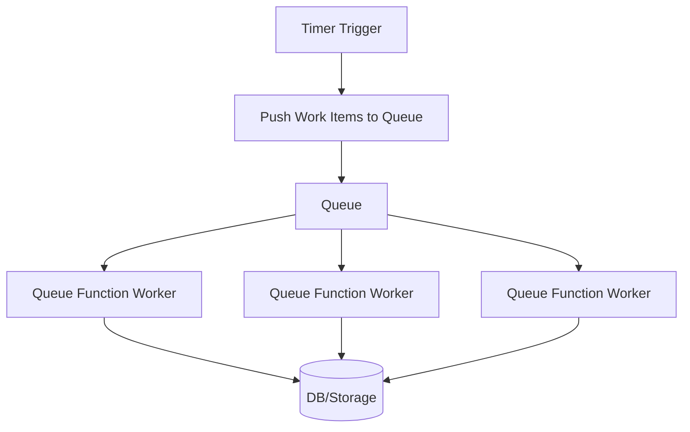
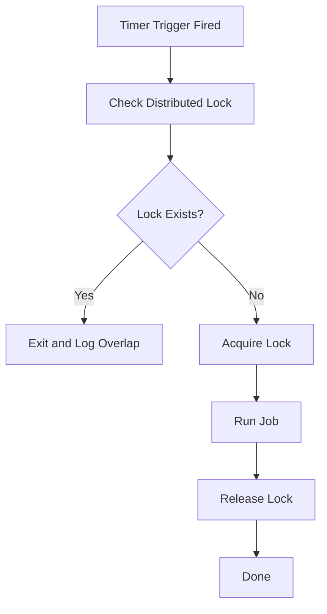
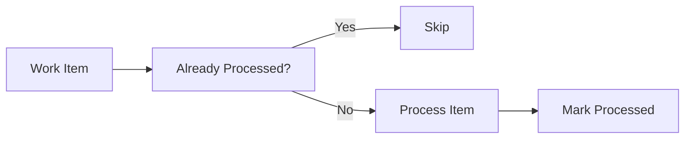
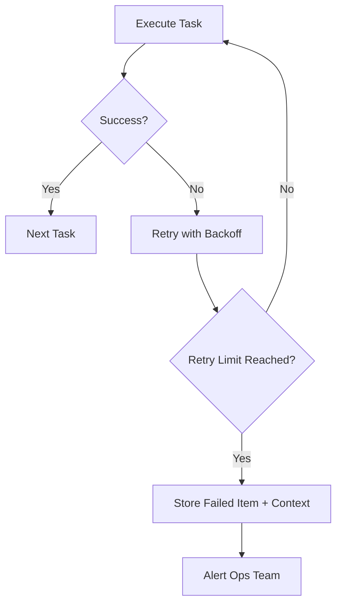
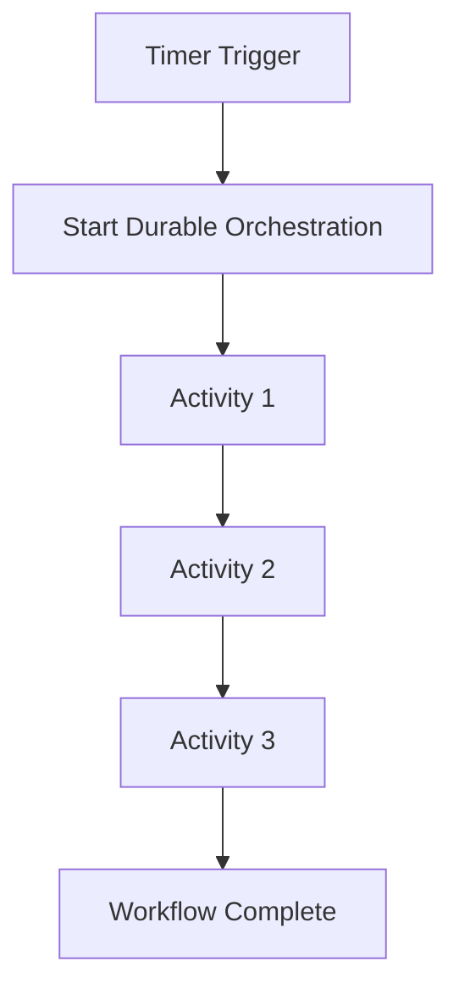
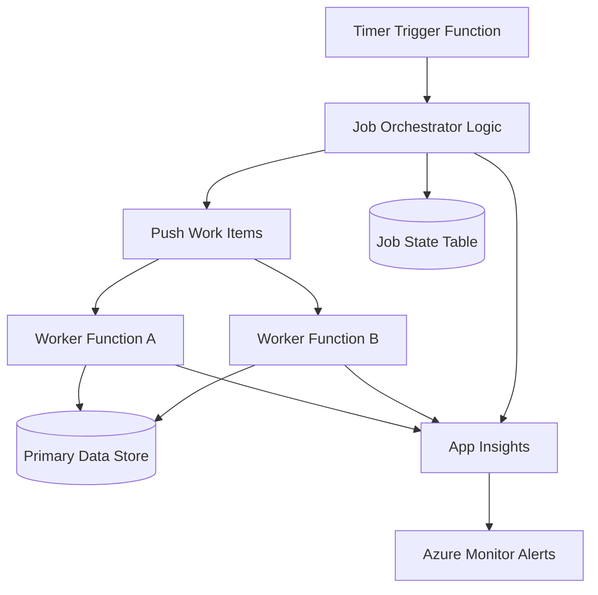

# How to Handle Recurring Jobs Using Azure Functions  
## Detailed Interview Preparation Guide with Flow Charts

## 1) Direct Interview Answer

To handle recurring jobs in Azure Functions, use a **Timer Trigger** with a CRON schedule, design the job to be **idempotent**, add **retry and error handling**, secure dependencies with **Managed Identity**, and monitor execution with **Application Insights + Azure Monitor alerts**.

> Interview one-liner: *“I implement recurring jobs in Azure Functions using timer triggers, resilient/idempotent job logic, durable state tracking where needed, and production-grade monitoring/alerting.”*

---

## 2) High-Level Recurring Job Flow

---

## 3) Core Building Blocks

## 3.1 Timer Trigger
- Defines execution schedule using CRON expression
- Runs function automatically without external caller
- Best for periodic tasks (every 5 min/hour/day/etc.)

## 3.2 Function App
Container that hosts one or more recurring job functions.

## 3.3 Observability Stack
- Application Insights (logs, traces, exceptions)
- Azure Monitor (metrics + alerts)
- Log Analytics (KQL analysis)

## 3.4 State Store (Optional but Recommended)
Use durable storage for:
- Last successful run timestamp
- Checkpoints
- Job execution history
- Deduplication/idempotency keys

---

## 4) Recurring Job Design Patterns

## Pattern A: Simple Scheduled Task
Use when task is small and quick.
Examples:
- Cache refresh
- Daily cleanup
- Small reconciliation

## Pattern B: Batch Processing with Checkpoints
Use for large datasets.
Examples:
- Daily report generation
- Historical data backfill
- Long list processing

## Pattern C: Timer + Queue Fan-Out
Use for scale and parallelism.
Examples:
- Send bulk notifications
- Process many independent items

---

## 5) CRON Scheduling Concepts (Interview-Friendly)

Common recurring schedules:
- Every 5 minutes
- Every hour
- Daily at 2 AM
- Weekly on Monday
- Monthly billing cycle run

Design considerations:
- Time zone handling (UTC vs local business time)
- Daylight saving effects
- Business calendar exceptions (weekends/holidays if needed)

---

## 6) Handling Overlap / Concurrent Executions

A major recurring-job problem is overlapping runs when previous run takes too long.

Mitigations:
1. Keep job duration < schedule interval where possible
2. Use distributed lock (storage/db-based lock flag with expiration)
3. Split heavy work into queue-based parallel workers
4. Track active execution state and skip duplicate run safely

### Overlap Protection Flow

---

## 7) Idempotency for Recurring Jobs (Critical Interview Point)

Recurring jobs may rerun due to retries, restarts, or manual replay.
Design idempotent operations:
- Upsert instead of insert-only
- Process-by-business-key
- Store processed-run IDs
- Guard duplicate notifications/payments

### Idempotent Job Flow

---

## 8) Error Handling and Retry Strategy

Use layered resilience:
- Try/catch with structured logging
- Retry transient errors (exponential backoff)
- Dead-letter/failed-item storage for persistent failures
- Partial failure isolation (continue other items)
- Alert on repeated failures

---

## 9) Long-Running Recurring Jobs

If recurring workflow is multi-step/long-running:
- Use **Durable Functions** orchestrations
- Add checkpoints and wait states
- Track workflow state explicitly

### Durable Recurring Workflow

When to prefer Durable Functions:
- Multi-step dependencies
- Human approvals
- Long waits
- Compensating transactions

---

## 10) Monitoring Recurring Jobs

Track:
- Last run status
- Last successful run timestamp
- Duration trend (P50/P95)
- Failure rate
- Retry count
- Overlap/skipped run count
- Items processed per run

Alert on:
- Consecutive failures
- No successful run in expected window
- Duration exceeding threshold
- High failed-item count

### Monitoring & Alert Flow

---

## 11) Security Best Practices for Recurring Jobs

1. Use Managed Identity for resource access
2. Store secrets in Key Vault
3. Apply least-privilege RBAC
4. Restrict network access (private endpoints/VNet where needed)
5. Audit job actions and sensitive operations
6. Avoid logging secrets or sensitive payloads

---

## 12) Common Recurring Job Use Cases

1. Daily financial reconciliation  
2. Nightly cleanup/archive jobs  
3. Scheduled report generation  
4. SLA reminder notifications  
5. Periodic cache warming  
6. Data synchronization between systems  
7. Subscription renewal processing  

---

## 13) Production Architecture Example

Why this works well:
- Scheduler is lightweight
- Processing scales via queue workers
- State and observability are explicit
- Failures are isolated and replayable

---

## 14) Common Mistakes (Interview Gold)

1. No idempotency (duplicate updates)
2. No overlap protection
3. Large single-run monolith job without batching
4. Missing retry/backoff strategy
5. No alert when job silently stops
6. Hardcoded secrets in code
7. No checkpointing for long jobs
8. Not considering timezone/daylight saving behavior

---

## 15) Interview Q&A (Strong Answers)

### Q1: How do you schedule recurring jobs in Azure Functions?
**Answer:** Use a Timer Trigger with a CRON schedule, then execute job logic in a function app.

### Q2: How do you prevent duplicate processing?
**Answer:** Design idempotent operations, track processed records, and use distributed locking to avoid overlapping runs.

### Q3: What if the job processes huge data?
**Answer:** Use batch/checkpoint design or timer-to-queue fan-out with worker functions for horizontal scalability.

### Q4: How do you monitor recurring jobs?
**Answer:** Application Insights for telemetry, Azure Monitor for alerts (failures/no-success-window/duration spike), and dashboards for trend visibility.

### Q5: When would you use Durable Functions?
**Answer:** For long-running, stateful, multi-step recurring workflows requiring orchestration and reliable state checkpoints.

---

## 16) 60-Second Interview Pitch

> I handle recurring jobs in Azure Functions using timer triggers with CRON schedules. I design jobs to be idempotent and resilient with retries, failure isolation, and checkpointing. For heavy workloads, I use timer-triggered orchestration that pushes work to queues and scales with worker functions. I prevent overlap using distributed locks and track job state in durable storage. Security is handled via managed identity, Key Vault, and least-privilege RBAC. Finally, I use Application Insights and Azure Monitor alerts to track run success, duration, and failure patterns.

---

## 17) Final Checklist

- [ ] Timer trigger schedule defined clearly  
- [ ] Timezone strategy documented  
- [ ] Idempotency implemented  
- [ ] Overlap/locking mechanism in place  
- [ ] Retry + backoff + failure sink implemented  
- [ ] Checkpointing for large/long jobs  
- [ ] Monitoring dashboard + alerts configured  
- [ ] Managed identity + Key Vault + RBAC applied  

---

## One-line Conclusion

> Recurring jobs in Azure Functions are best implemented with Timer Triggers plus idempotent, observable, and resilient processing patterns that scale safely in production.