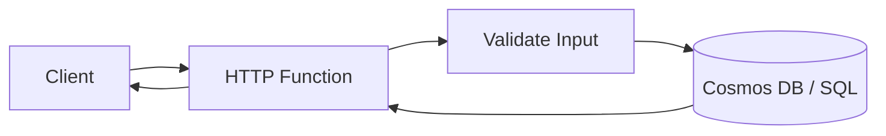
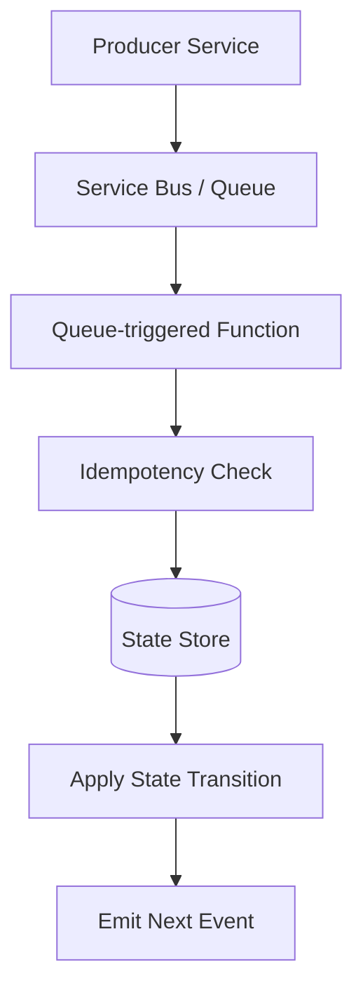
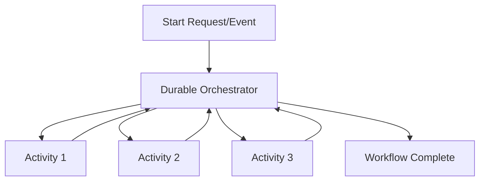
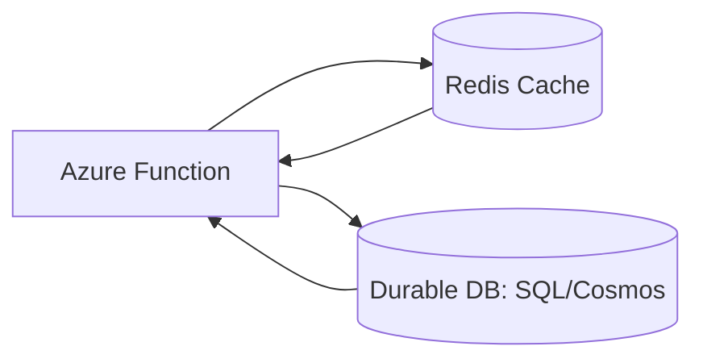
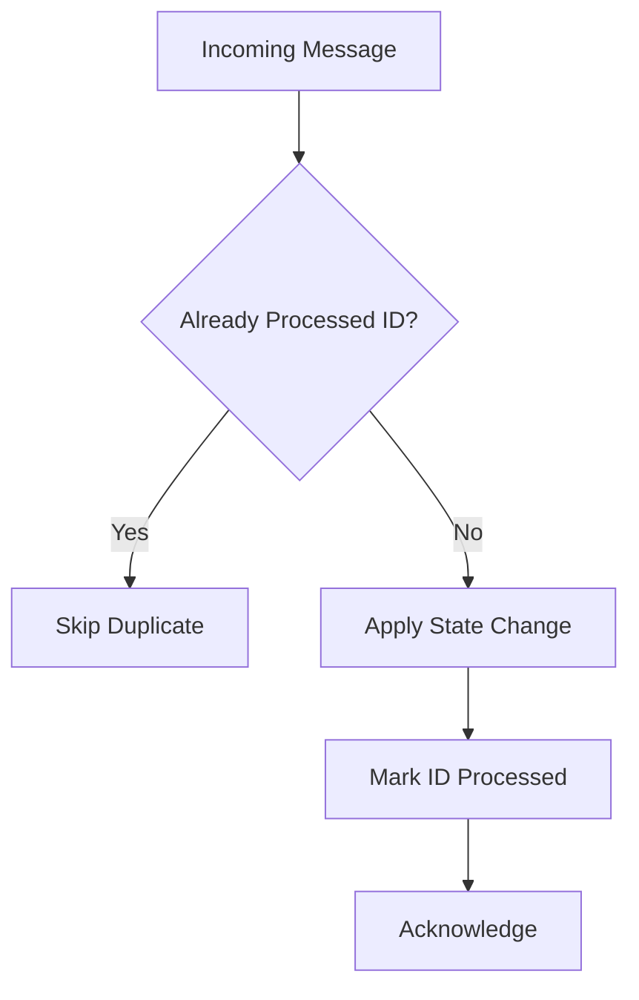
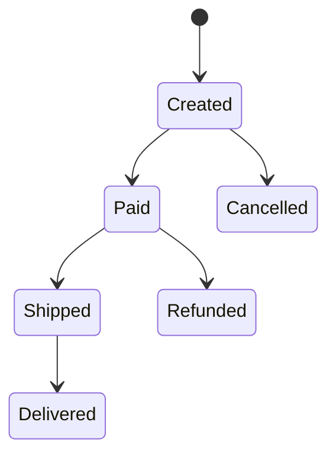
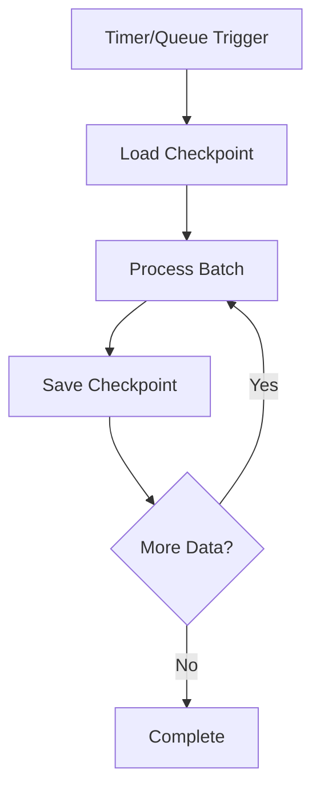
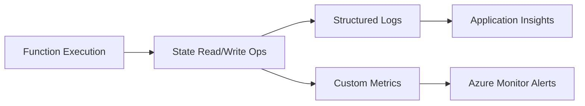
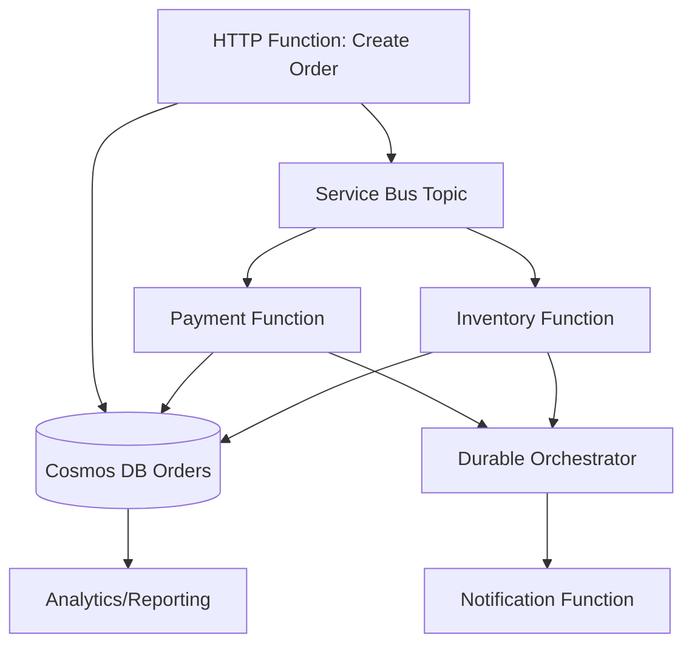

# How to Implement State Management in Azure Functions  
## Detailed Interview Preparation Guide with Flow Charts

## 1) Direct Interview Answer

Azure Functions are **stateless by design**, so state should be stored externally using services like:
- **Azure Cosmos DB**
- **Azure Table Storage**
- **Azure SQL Database**
- **Azure Cache for Redis**
- **Blob Storage**
- **Durable Functions (for workflow state/orchestration)**

> Interview one-liner: *“I implement state management in Azure Functions by keeping compute stateless and persisting application/workflow state in external durable stores, selected by access pattern, consistency needs, latency, and cost.”*

---

## 2) Why State Management Matters in Azure Functions

Function instances can:
- Scale out dynamically
- Restart at any time
- Run in parallel
- Retry failed executions

So you **cannot rely on local memory** or instance-local disk for durable business state.

### Stateless-to-Stateful Architecture Flow

```mermaid
flowchart TD
    Trigger[HTTP/Queue/Event Trigger] --> Func[Azure Function (Stateless Compute)]
    Func --> StateStore[(External State Store)]
    StateStore --> Func
    Func --> Response[Return Result / Emit Event]
```

---

## 3) Types of State in Serverless Systems

1. **Application State**  
   Business entities (orders, user sessions, workflow records)

2. **Execution/Workflow State**  
   Step progress, checkpoints, orchestration instance status

3. **Transient State**  
   Short-lived cached data, dedup keys, throttling counters

4. **Integration State**  
   Processed message IDs, retry counts, idempotency markers

---

## 4) Common State Storage Options and When to Use

| State Store | Best For | Notes |
|---|---|---|
| Azure Cosmos DB | Global scale, flexible schema, fast reads/writes | Great for event-driven apps |
| Azure Table Storage | Simple key-value/entity state, low cost | Good for lightweight metadata |
| Azure SQL Database | Relational consistency, transactions, joins | Best for structured business data |
| Azure Cache for Redis | Low-latency transient state, counters, locks | Not primary durable store alone |
| Blob Storage | Large state snapshots/files/checkpoints | High durability, not low-latency query store |
| Durable Functions Storage | Workflow/orchestration state | Best for long-running function workflows |

---

## 5) State Management Decision Flow Chart

```mermaid
flowchart TD
    A[Need state in Azure Functions] --> B{Workflow orchestration state?}
    B -- Yes --> DF[Use Durable Functions]
    B -- No --> C{Need relational queries/transactions?}
    C -- Yes --> SQL[Use Azure SQL]
    C -- No --> D{Need flexible JSON + scale?}
    D -- Yes --> COSMOS[Use Cosmos DB]
    D -- No --> E{Need very low-latency temporary state?}
    E -- Yes --> REDIS[Use Redis (+ durable backing store)]
    E -- No --> F{Simple key-value metadata?}
    F -- Yes --> TABLE[Table Storage]
    F -- No --> BLOB[Blob Storage / Hybrid]
```

---

## 6) Pattern 1: CRUD State with HTTP-triggered Functions

Use case: profile/order/session record management.

Flow:
1. Client sends HTTP request
2. Function validates request
3. Function reads/writes external DB
4. Function returns response



Key points:
- Use optimistic concurrency (ETag/rowversion)
- Return clear error codes on conflicts
- Avoid in-memory shared state assumptions

---

## 7) Pattern 2: Event-Driven State Updates (Queue/Service Bus)

Use case: asynchronous order/payment/inventory updates.



Critical practices:
- Idempotent handlers
- Message deduplication keys
- Dead-letter strategy
- Retry-aware updates

---

## 8) Pattern 3: Workflow State with Durable Functions

For multi-step business processes (approval/order lifecycle).



Durable Functions automatically persists orchestration state/checkpoints, enabling:
- Long-running workflows
- Wait-for-external-event
- Fan-out/fan-in
- Reliable replay/recovery

---

## 9) Pattern 4: Transient State + Durable Source of Truth

Use Redis for speed, database for persistence.



Use for:
- Short-lived session-like tokens
- Rate limiting counters
- Hot read acceleration

Rule:
- Redis should complement, not replace, durable state for critical data.

---

## 10) Idempotency and State Consistency (Must Mention)

Because functions may retry or run concurrently:

Implement:
1. **Idempotency keys** (message ID/request ID)
2. **Conditional writes** (ETag/version checks)
3. **Exactly-once effect patterns** (outbox/inbox-like approaches)
4. **Conflict handling** (retry with backoff)

### Idempotent Processing Flow



---

## 11) Concurrency Control Approaches

1. **Optimistic concurrency**  
   - ETag / row version  
   - Retry on conflict

2. **Pessimistic lock (carefully used)**  
   - DB lock or distributed lock
   - Useful for strict critical sections

3. **Partitioning strategy**  
   - Route same entity to same partition/session
   - Reduce write conflicts

---

## 12) State Transition Modeling (Interview Maturity)

Define allowed transitions explicitly.

Example order states:
- Created → Paid → Shipped → Delivered
- Created → Cancelled
- Paid → Refunded



Benefits:
- Prevent invalid transitions
- Easier auditability
- Cleaner recovery logic

---

## 13) Checkpointing for Long Jobs

For large batch processing:
- Store `lastProcessedId` / timestamp / partition offset
- Resume from checkpoint after failure



---

## 14) Security in State Management

Best practices:
- Managed Identity for DB/storage access
- Key Vault for secrets if needed
- RBAC least privilege
- Encrypt data at rest/in transit
- Mask sensitive fields in logs
- Private endpoints/VNet integration for critical stores

---

## 15) Observability of State Operations

Track:
- Read/write latency
- State conflict rate
- Duplicate message detection count
- Retry and dead-letter counts
- Transition failure rates
- Checkpoint lag



---

## 16) Common Anti-Patterns (Interview Gold)

1. Storing critical state in static variables/in-memory caches only  
2. Assuming single-instance execution  
3. Ignoring retries causing duplicate updates  
4. No concurrency/version control  
5. No idempotency key strategy  
6. Mixing transient cache as source of truth  
7. Lack of state transition validation  
8. No backup/retention strategy for state store  

---

## 17) Practical Architecture Example (Enterprise)

Scenario: Order processing with Azure Functions.



State strategy:
- Cosmos DB for order aggregate state
- Service Bus for event-driven transitions
- Durable Functions for orchestration state
- Idempotency keys for message handlers

---

## 18) Interview Q&A (Strong Sample Answers)

### Q1: Are Azure Functions stateful?
**Answer:** By default, no. They’re stateless compute units; persistent state should be externalized.

### Q2: Best store for function state?
**Answer:** Depends on workload: SQL for relational transactions, Cosmos DB for scalable JSON/event workloads, Redis for transient low-latency state, Durable Functions for orchestration state.

### Q3: How do you handle duplicate events?
**Answer:** Idempotency keys + processed-message tracking + conditional writes.

### Q4: How do you manage long-running workflow state?
**Answer:** Durable Functions orchestration with persisted checkpoints and replay-safe orchestration logic.

### Q5: How do you prevent race conditions?
**Answer:** Use optimistic concurrency (ETag/version), proper partitioning, and controlled retries/backoff.

---

## 19) 60-Second Interview Pitch

> I treat Azure Functions as stateless compute and persist state in external stores based on access patterns: Cosmos DB or SQL for durable business state, Redis for transient low-latency data, and Durable Functions for orchestration state. I design handlers to be idempotent, use version checks for concurrency control, and model explicit state transitions to avoid invalid updates. For long-running jobs, I implement checkpointing and resume logic. Security uses managed identity, Key Vault, and RBAC, while observability tracks latency, conflicts, retries, and transition failures.

---

## 20) Final Checklist

- [ ] State externalized from function instance memory  
- [ ] Correct state store chosen by access/consistency needs  
- [ ] Idempotency keys implemented  
- [ ] Concurrency/version checks added  
- [ ] State transition rules defined  
- [ ] Checkpointing for long jobs  
- [ ] Monitoring/alerts for state failures and conflicts  
- [ ] Managed identity + RBAC + encryption applied  

---

## One-Line Conclusion

> Effective Azure Functions state management means keeping functions stateless while using durable, secure, and observable external state stores with idempotent and concurrency-safe update patterns.