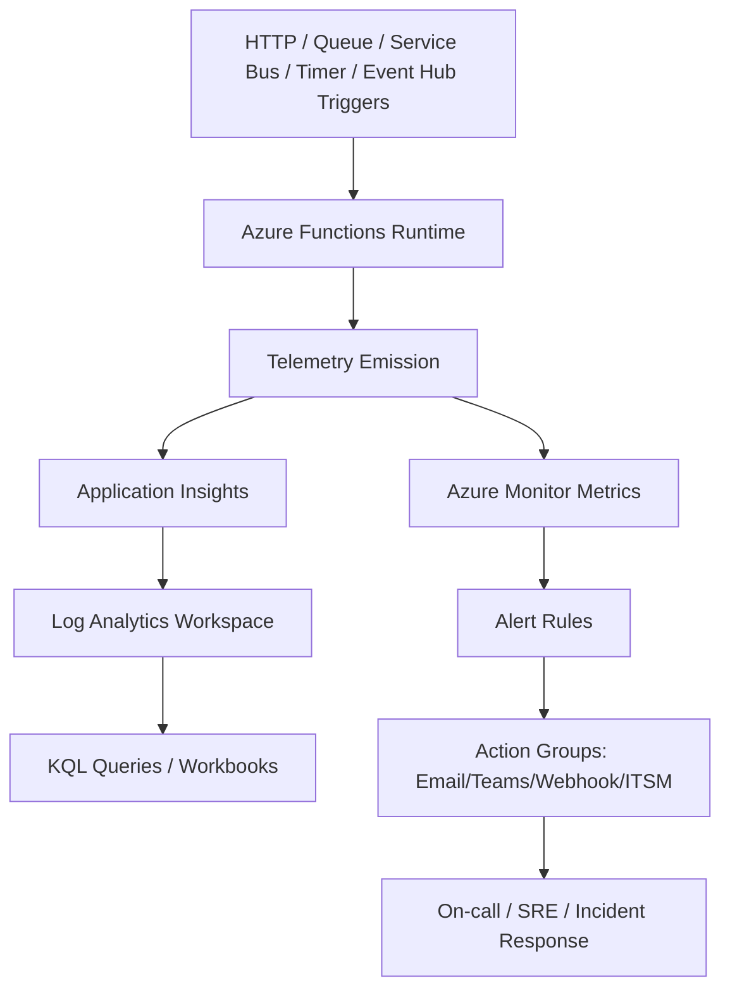
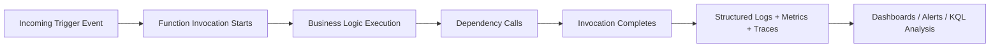
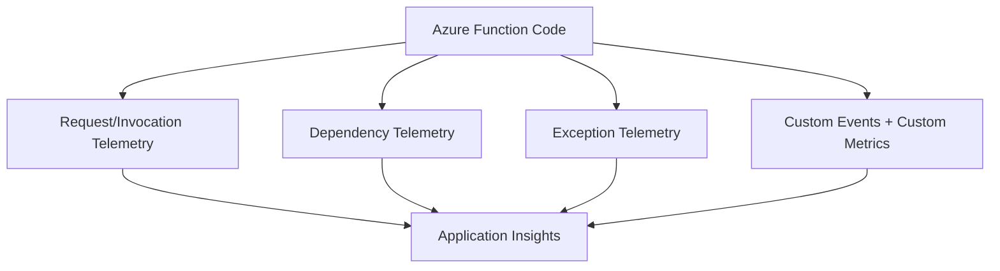
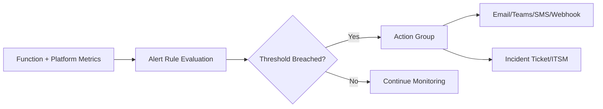
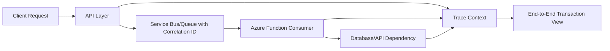
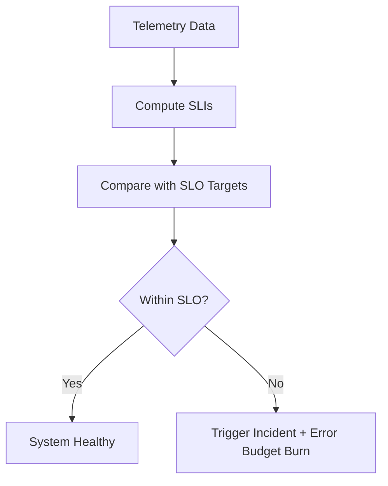
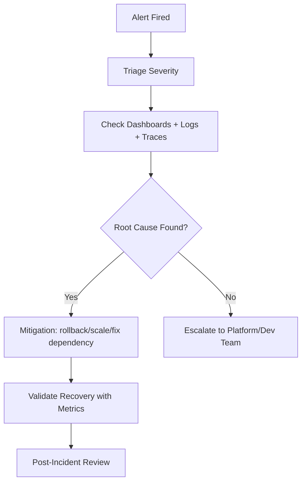
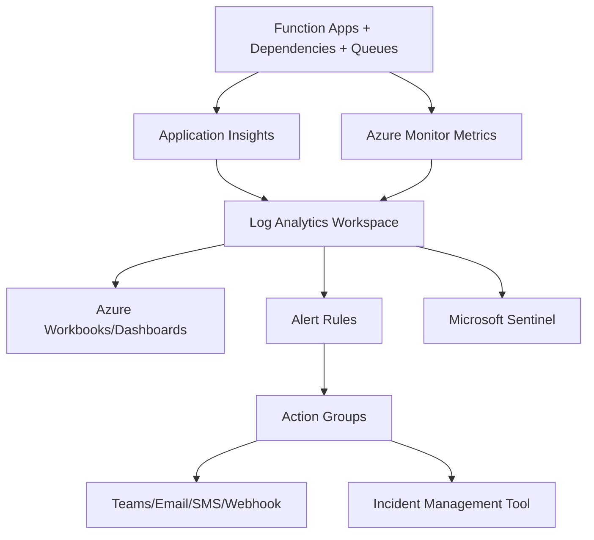

# How to Monitor Azure Functions  
## Detailed Interview Preparation Guide with Flow Charts

## 1) Direct Interview Answer

To monitor Azure Functions effectively, implement **end-to-end observability** using:
1. **Application Insights** (traces, requests, dependencies, exceptions)
2. **Azure Monitor Metrics + Alerts** (platform and performance signals)
3. **Log Analytics** (query-driven diagnostics and trend analysis)
4. **Distributed tracing + correlation IDs** (across services)
5. **Actionable alerting and incident response workflows**

> Interview one-liner: *“I monitor Azure Functions with Application Insights, Azure Monitor alerts, structured logging, distributed tracing, and SLO-based dashboards to detect, diagnose, and resolve failures quickly.”*

---

## 2) Monitoring Architecture Flow Chart

---

## 3) What You Should Monitor (Core Signals)

## 3.1 Golden Signals
For interview prep, mention these clearly:
- **Latency** (execution duration)
- **Traffic** (invocation volume)
- **Errors** (failed executions/exceptions)
- **Saturation** (resource pressure, concurrency, queue backlog)

## 3.2 Function-Specific KPIs
- Invocation count per function
- Success/failure rate
- Average and P95/P99 execution duration
- Cold-start impact (where relevant)
- Retry count
- Dead-letter/poison message count
- Trigger source lag (queue length, event backlog)
- Dependency call failures (DB, storage, API)
- Timeout/cancellation rates

---

## 4) End-to-End Execution Monitoring Flow

---

## 5) Application Insights for Azure Functions

Application Insights is the primary APM tool for function observability.

Track:
- Requests/invocations
- Dependencies (SQL, HTTP, Service Bus, Storage)
- Exceptions and stack traces
- Custom events
- Performance trends
- Live metrics

### Telemetry Flow

---

## 6) Azure Monitor Metrics and Alerts

Use Azure Monitor for near-real-time alerting and platform-level insights.

Common alert dimensions:
- Function execution failure count > threshold
- Error rate % above baseline
- Queue backlog growth
- Execution duration spike
- Dependency failure spike
- Host unhealthy/restarts

### Alerting Flow

---

## 7) Log Analytics + KQL for Deep Diagnostics

Log Analytics enables:
- Historical trend analysis
- Failure correlation
- Root cause diagnostics
- Cross-resource investigation

Typical use cases:
- Top failing functions in last 24h
- Dependency error hot-spots
- Correlate retries with downstream latency
- Identify noisy tenants/endpoints

---

## 8) Structured Logging Best Practices

Use structured logs (not plain text) with consistent fields:
- `correlationId`
- `operationName`
- `functionName`
- `invocationId`
- `triggerType`
- `tenantId` / `customerId` (if appropriate)
- `outcome`
- `latencyMs`
- `errorCode`

This improves searchability, alert precision, and troubleshooting speed.

---

## 9) Distributed Tracing Across Services

For microservice/event-driven systems:
- Propagate correlation IDs across queue/events/http calls
- Link function execution with upstream/downstream services
- Use trace context standards where possible

### Trace Propagation Flow

---

## 10) Trigger-Specific Monitoring Strategy

## 10.1 HTTP Trigger
Monitor:
- Request rate
- Response codes (2xx/4xx/5xx)
- Latency percentiles
- Auth failures
- Throttling patterns

## 10.2 Queue/Service Bus Trigger
Monitor:
- Queue length / active messages
- Dead-letter queue depth
- Message age
- Processing throughput
- Retry counts

## 10.3 Timer Trigger
Monitor:
- Missed schedules
- Job execution duration
- Consecutive failures
- Last successful run timestamp

## 10.4 Event Hub Trigger
Monitor:
- Consumer lag
- Throughput
- Checkpoint progression
- Partition processing balance

## 10.5 Blob Trigger
Monitor:
- Processing success/failure per file type
- File processing latency
- Failed/parsing errors
- Duplicate processing anomalies

---

## 11) SLI/SLO-Based Monitoring (Interview Maturity Point)

Define SLIs/SLOs for production reliability:

Examples:
- **Availability SLO**: 99.9% successful invocations
- **Latency SLO**: 95% of executions < 2 seconds
- **Error SLO**: < 1% failed invocations per rolling hour
- **Queue SLO**: 99% messages processed within 60 seconds

### SLO Feedback Flow

---

## 12) Proactive Alert Design

Create tiers of alerts:

1. **Critical (P1)**  
   - Complete function outage  
   - Dead-letter explosion  
   - Persistent auth failures  

2. **High (P2)**  
   - Error rate spike  
   - Queue lag breaching threshold  

3. **Medium (P3)**  
   - Latency drift  
   - Single dependency degradation  

Avoid noisy alerts:
- Use dynamic thresholds/baselines
- Add suppression windows
- Alert on symptom + impact together

---

## 13) Dashboard Design for Interview Discussion

A good Function dashboard should include:

- Invocation trend (per function)
- Success vs failure trend
- P50/P95/P99 latency
- Top exceptions
- Dependency performance map
- Queue backlog + dead-letter count
- Cost/execution volume trend
- Deployment markers (to correlate regressions)

---

## 14) Incident Response Workflow

Post-incident actions:
- Add better alerts
- Improve retries/timeouts
- Fix observability gaps
- Update runbooks

---

## 15) Cost-Aware Monitoring

Monitoring should include cost signals:
- Execution count trend
- Memory/compute consumption trends
- Unexpected invocation spikes
- Noisy triggers causing runaway cost
- Logging volume optimization

Interview point:
> Observability must balance diagnostic value and telemetry cost.

---

## 16) Common Monitoring Mistakes (Important)

1. Monitoring only failures, not latency/backlog  
2. No correlation IDs across async flows  
3. No dead-letter queue alerting  
4. Overly noisy alerts causing fatigue  
5. No SLO definition (no reliability target)  
6. Ignoring dependency telemetry  
7. Missing deployment annotations in dashboards  
8. No runbooks for alert response  

---

## 17) Practical Production Monitoring Blueprint

---

## 18) Interview Q&A (Strong Answers)

### Q1: What tools do you use to monitor Azure Functions?
**Answer:** Application Insights, Azure Monitor metrics/alerts, Log Analytics, and dashboards/workbooks; optionally Sentinel for security operations.

### Q2: What are the most critical metrics?
**Answer:** Invocation count, failure rate, execution duration percentiles, dependency failures, retries, and queue/dead-letter backlog.

### Q3: How do you monitor async function pipelines?
**Answer:** Track queue length, message age, processing rate, dead-letter count, and propagate correlation IDs for traceability.

### Q4: How do you avoid alert fatigue?
**Answer:** Use severity tiers, dynamic thresholds, dedup/suppression rules, and actionable alerts mapped to runbooks.

### Q5: How do you detect performance regressions after deployment?
**Answer:** Use deployment markers and compare pre/post latency, error rate, dependency timings, and throughput trends.

---

## 19) 60-Second Interview Pitch

> I monitor Azure Functions with a full observability stack: Application Insights for traces/exceptions/dependencies, Azure Monitor for metrics and alerts, and Log Analytics for KQL-based diagnostics. I track golden signals plus function-specific metrics like retries, dead-letter counts, and queue lag. I propagate correlation IDs for distributed tracing across async services and define SLO-based dashboards for reliability management. Alerts are tiered and routed via action groups to on-call workflows, and incidents are followed by postmortems and monitoring improvements.

---

## 20) Final Summary Checklist

- [ ] Application Insights enabled and sampling configured appropriately  
- [ ] Structured logging with correlation IDs implemented  
- [ ] Azure Monitor alerts for failures/latency/backlog configured  
- [ ] Dead-letter queue monitoring enabled  
- [ ] Trigger-specific metrics tracked  
- [ ] SLI/SLO dashboards published  
- [ ] Incident runbooks linked to alert rules  
- [ ] Cost and telemetry volume monitored  
- [ ] Deployment annotations correlated with incidents  

---

## One-Line Interview Conclusion

> Effective Azure Functions monitoring combines telemetry, alerting, tracing, and SLO-driven operations to ensure fast detection, diagnosis, and recovery.