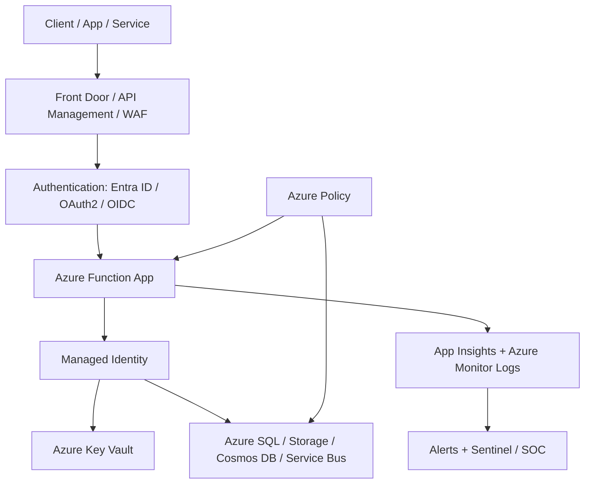
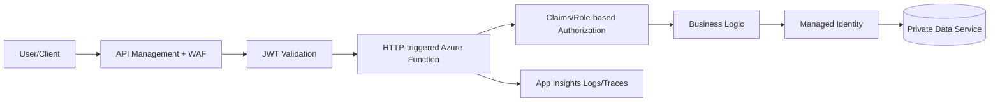
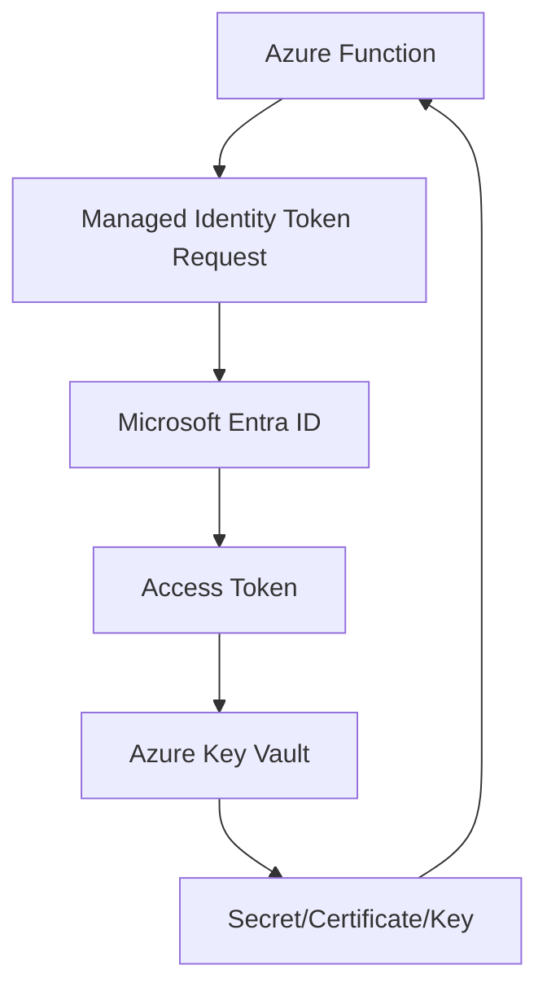
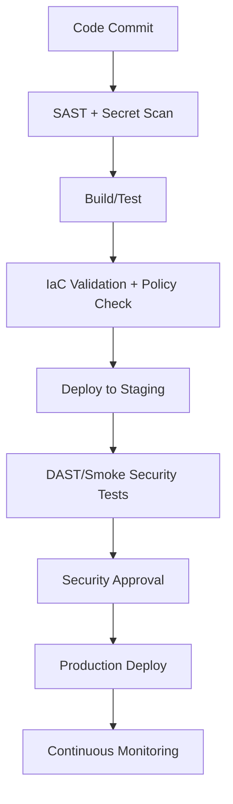
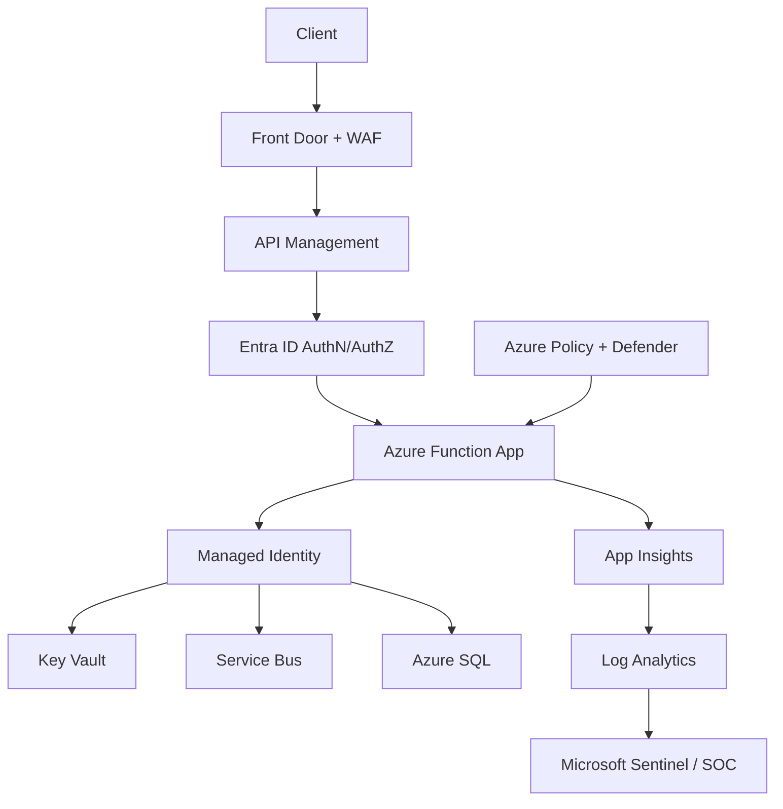

# How to Secure Azure Functions  
## Detailed Interview Preparation Guide with Flow Charts

## 1) Direct Interview Answer

To secure Azure Functions, use a **defense-in-depth strategy** across:
1. **Identity and authentication**
2. **Authorization**
3. **Network isolation**
4. **Secret management**
5. **Data protection**
6. **Monitoring and threat detection**
7. **Secure DevOps practices**

> Strong interview line: *“I secure Azure Functions by combining Entra ID-based auth, least-privilege RBAC, managed identity, private networking, Key Vault, and continuous monitoring with Azure Monitor/Application Insights/Defender.”*

---

## 2) Security Architecture Flow Chart (End-to-End)



---

## 3) Core Security Pillars for Azure Functions

## 3.1 Identity & Authentication (Who are you?)
Use modern identity-first controls:
- Microsoft Entra ID (Azure AD)
- OAuth 2.0 / OpenID Connect
- App registrations and scopes
- Token validation at API layer (or APIM)

For HTTP-triggered functions:
- Prefer Entra ID/JWT-based auth for enterprise APIs
- Avoid relying only on function keys for sensitive workloads

## 3.2 Authorization (What can you do?)
- Implement least privilege access
- Use Azure RBAC for resource access
- Use app roles/scopes/claims for API authorization
- Enforce per-endpoint authorization where needed

## 3.3 Secrets & Credentials
- Never hardcode secrets in code/config files
- Use **Managed Identity** whenever possible
- Store secrets/certs/keys in **Azure Key Vault**
- Rotate credentials automatically/policy-driven

## 3.4 Network Security
- Restrict public access where possible
- Use VNet integration + private endpoints
- Use APIM/Application Gateway/Front Door + WAF
- IP restrictions for admin/internal endpoints
- Disable unnecessary inbound paths

## 3.5 Data Protection
- Enforce HTTPS/TLS
- Encrypt data at rest and in transit
- Minimize sensitive data in logs
- Apply data classification and retention policies

## 3.6 Monitoring, Detection, and Response
- Application Insights + Azure Monitor
- Centralized logs to Log Analytics
- Security posture via Defender for Cloud
- Alerts to SOC/Sentinel/on-call teams
- Audit trails and anomaly detection

---

## 4) Function-Level Security Flow (HTTP Trigger)



---

## 5) Authentication Options (Interview Comparison)

| Option | Use Case | Security Level |
|---|---|---|
| Anonymous | Public non-sensitive endpoint | Low |
| Function Key | Simple internal integrations / low-risk | Medium-Low |
| Host Key | Shared app-level control | Medium-Low |
| Entra ID (OAuth2/OIDC) | Enterprise API security | High |
| APIM + Entra ID + policies | Enterprise + governance + throttling | Very High |

**Interview note:**  
Function keys are not a full enterprise auth strategy for critical APIs.

---

## 6) Managed Identity + Key Vault Pattern (Must Mention)

Use managed identity to avoid storing secrets.

### Flow



Benefits:
- No plaintext credentials in code
- Centralized secret lifecycle
- Easier rotation and auditability

---

## 7) Network Isolation Patterns

## Pattern A: Public API with perimeter controls
- Front Door/APIM + WAF
- Entra auth
- Rate limiting and bot protection
- Backend function locked down to trusted ingress

## Pattern B: Internal/private function
- Private endpoints
- VNet integration
- NSG and route controls
- No public inbound access

### Private Access Flow

```mermaid
flowchart LR
    InternalApp[Internal App] --> VNet[VNet]
    VNet --> PrivateEP[Private Endpoint]
    PrivateEP --> Function[Azure Function (No Public Access)]
    Function --> PrivateDB[Private DB/Storage]
```

---

## 8) Secure Trigger-Specific Considerations

## 8.1 HTTP Trigger
- Enforce Entra/OAuth auth
- Validate JWT issuer/audience/scopes
- Apply API rate limits (prefer APIM)
- Input validation and schema checks

## 8.2 Queue/Service Bus Trigger
- Use RBAC + managed identity access
- Idempotency to prevent replay abuse impact
- Dead-letter monitoring for attack/noise patterns

## 8.3 Blob Trigger
- Restrict storage account networking
- Validate uploaded file type/content
- Malware scanning workflow for untrusted files

## 8.4 Timer Trigger
- Restrict operation scope
- Protect output targets (RBAC)
- Monitor unusual execution anomalies

## 8.5 Event/Grid/Hub Triggers
- Validate source authenticity and subscription rules
- Constrain consumer permissions
- Protect downstream data sinks

---

## 9) Secure Development Lifecycle for Functions

1. Threat modeling per function workflow  
2. Use IaC (Bicep/Terraform) with policy controls  
3. Secret scanning in CI/CD  
4. Dependency vulnerability scanning  
5. SAST/DAST checks  
6. Environment separation (dev/test/prod)  
7. Security gates before production release  

### DevSecOps Flow



---

## 10) Logging, Monitoring, and Incident Response

Collect and monitor:
- Auth failures
- Access-denied events
- Unusual invocation spikes
- Dependency failures
- Key Vault access anomalies
- Function errors/timeouts/retries
- Suspicious IP patterns

Set alerts for:
- Error rate thresholds
- Unauthorized requests
- Burst traffic anomalies
- Secret access anomalies
- Dead-letter queue growth

---

## 11) Common Security Misconfigurations (Interview Gold)

1. Using anonymous access for sensitive APIs  
2. Storing connection strings in plain app settings without Key Vault references  
3. Over-privileged managed identity roles  
4. Exposing function endpoints publicly without gateway/WAF controls  
5. Missing token validation checks (audience/scope)  
6. Logging sensitive payload data  
7. No alerting on security-relevant signals  
8. No environment isolation between dev/test/prod  

---

## 12) Practical “Production-Ready” Security Blueprint



Security controls included:
- Identity-based access
- No hardcoded secrets
- Network perimeter + policy governance
- Full observability and detection pipeline

---

## 13) Interview Q&A (Strong Sample Answers)

### Q1: How do you secure HTTP Azure Functions?
**Answer:** Use Entra ID/OAuth2, validate JWT claims, put APIM/WAF in front, enforce HTTPS, restrict network access, and monitor auth/error telemetry.

### Q2: How do you remove secrets from code?
**Answer:** Use managed identity to access Key Vault and Azure resources via RBAC, eliminating embedded credentials.

### Q3: Are function keys enough?
**Answer:** For low-risk/simple scenarios maybe, but enterprise-grade APIs should use Entra ID and policy enforcement via APIM.

### Q4: How do you secure storage/service bus triggers?
**Answer:** Use managed identity + least-privilege RBAC, private networking where possible, and monitor retries/dead-letter patterns for anomalies.

### Q5: What monitoring is essential?
**Answer:** App Insights, Azure Monitor alerts, Defender for Cloud signals, centralized logs to Log Analytics/Sentinel, and incident runbooks.

---

## 14) 60-Second Interview Pitch

> I secure Azure Functions using defense in depth. For identity, I use Entra ID with OAuth2/JWT for HTTP endpoints and avoid relying only on function keys for sensitive APIs. For service access, I use managed identity with least-privilege RBAC and store secrets in Key Vault. I reduce exposure with private endpoints, VNet integration, and API gateway/WAF controls. I enforce HTTPS, validate inputs, and apply policy-as-code governance. Finally, I enable Application Insights, Azure Monitor, Defender, and alerting pipelines for continuous threat detection and incident response.

---

## 15) Final Summary Checklist

- [ ] Entra ID auth enabled for sensitive HTTP functions  
- [ ] Managed Identity used for Azure resource access  
- [ ] Secrets stored in Key Vault (not code)  
- [ ] Least-privilege RBAC assignments applied  
- [ ] HTTPS enforced + insecure protocols disabled  
- [ ] Network restrictions/private endpoints configured  
- [ ] APIM/WAF/rate-limiting in front of public APIs  
- [ ] Input validation + secure coding controls implemented  
- [ ] Centralized logging/alerts/SIEM integration enabled  
- [ ] DevSecOps security scans and policy checks in CI/CD  

---

## One-line Interview Conclusion

> Secure Azure Functions by combining strong identity, least-privilege access, secretless architecture, network isolation, and continuous monitoring with automated governance.