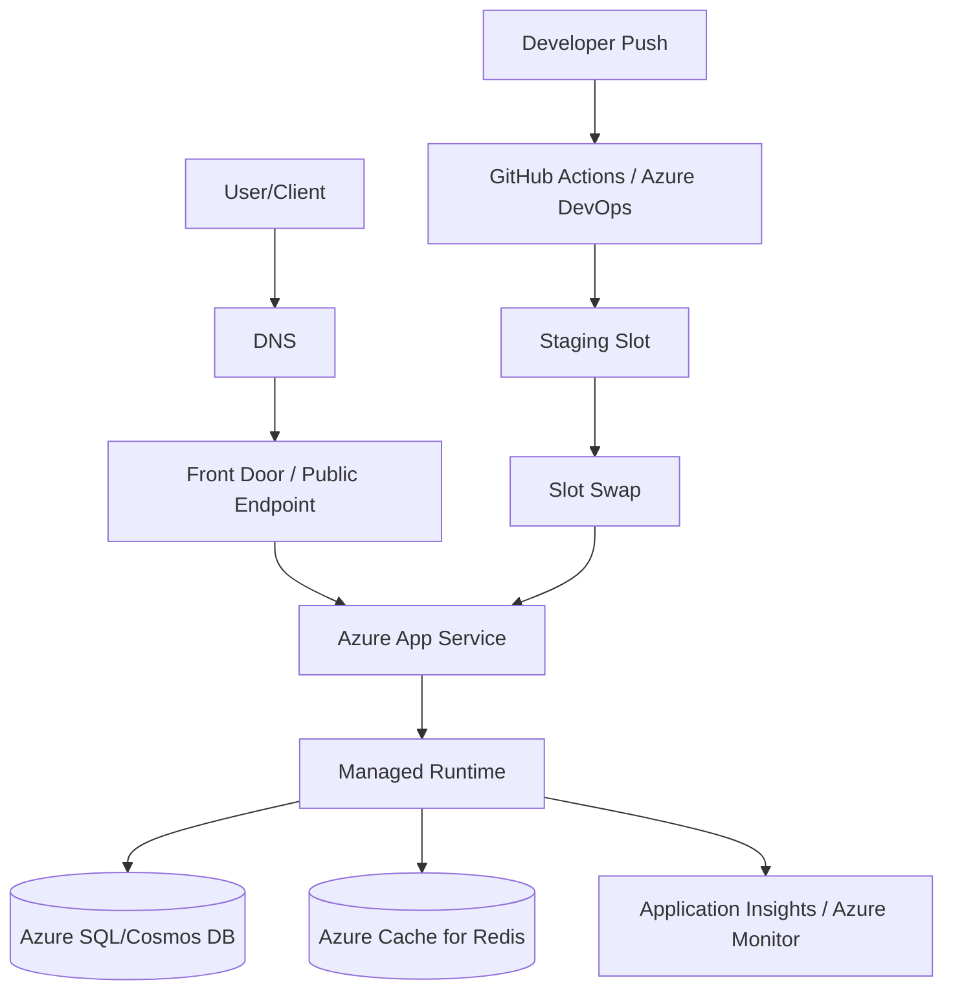
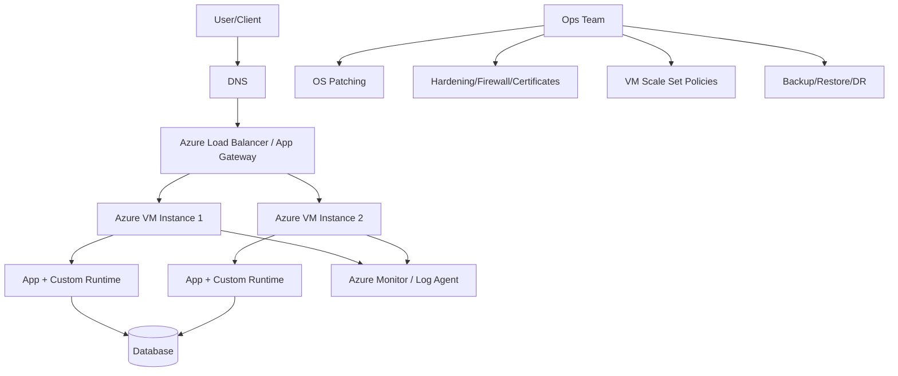

# Azure App Service vs Azure Virtual Machine (VM)  
## Detailed Interview Preparation Guide (with Flow Charts)

## 1) Quick Definition

## Azure App Service
A **fully managed PaaS** to host web apps and APIs.  
Azure manages OS patching, runtime platform, scaling mechanics, load balancing, and much of operations.

## Azure VM
An **IaaS compute service** where you provision virtual servers.  
You manage OS, middleware, runtime, patching, scaling strategy, and most operational/security controls.

---

## 2) One-Line Interview Answer

> **Use App Service when you want fast delivery and minimal infrastructure management for web/API workloads; use Azure VM when you need full server control, custom OS/runtime, or legacy software support.**

---

## 3) Architecture Flow Charts

## 3.1 Azure App Service Request Flow

**Key idea:** App platform is managed; deployment + scaling are simpler.

---

## 3.2 Azure VM Request Flow

**Key idea:** You control everything, but also own everything.

---

## 4) Deep Comparison Table (High Interview Value)

| Aspect | Azure App Service (PaaS) | Azure VM (IaaS) |
|---|---|---|
| Responsibility Model | Azure manages OS/platform | You manage OS + platform + app |
| Setup Speed | Very fast | Slower |
| Infra Control | Limited to app/platform settings | Full control (OS, packages, agents) |
| Scaling | Built-in scale up/out + autoscale | Manual or VMSS-based design |
| Patching | Managed by Azure | Your responsibility |
| Load Balancing | Built-in for app instances | You design with LB/App Gateway |
| Deployment | CI/CD + slots + swap | Custom scripts/pipelines |
| Security Hardening | Many built-ins | Full custom responsibility |
| Monitoring | Easy integration | Agent/config-heavy |
| Best Workloads | Web apps, APIs, standard services | Legacy apps, custom middleware, special compliance |
| Operational Overhead | Low | High |
| Cost Predictability | Easy at app tier level | Depends on VM size, disks, bandwidth, ops effort |

---

## 5) When to Choose Azure App Service

Choose **App Service** when:
1. You are building modern web apps / REST APIs.
2. You want fast time-to-market.
3. You want built-in CI/CD and deployment slots.
4. You prefer lower operational burden.
5. You do not need deep OS-level customization.

---

## 6) When to Choose Azure VM

Choose **Azure VM** when:
1. You need OS-level access and control.
2. You run legacy/monolithic software not suited for PaaS.
3. You need custom agents, drivers, kernel-level tools, or specific middleware.
4. You have non-standard networking/security tooling requirements.
5. You need full control over patch windows and base image policies.

---

## 7) Responsibility Split (Interview Favorite)

## App Service (Shared Responsibility)
- **You manage:** app code, app configuration, data, identities, access policies.
- **Azure manages:** host OS patching, platform runtime lifecycle, platform HA, infra maintenance.

## VM (Mostly Your Responsibility)
- **You manage:** OS patching, app runtime, web server, security hardening, backup setup, scale logic, monitoring agents.
- **Azure manages:** physical datacenter, hypervisor, underlying hardware.

---

## 8) Scalability Comparison

## App Service
- Horizontal scaling in a few clicks/rules.
- Autoscale by CPU/memory/HTTP queue and schedules.
- Good for variable web/API traffic.

## VM
- Scale via VM Scale Sets + custom autoscale rules.
- Requires load balancer health probes, image strategy, startup scripts.
- More flexible but more engineering effort.

---

## 9) Security Comparison

## App Service Security Features
- TLS/SSL support
- Managed Identity
- Easy Auth (OIDC providers)
- VNet integration, Private Endpoint (tier dependent)
- Access restrictions and diagnostic integrations

## VM Security Work Needed
- NSG/firewall design
- OS hardening (CIS, policies)
- Patch management
- Certificate lifecycle
- Endpoint protection tooling
- Identity and secret management setup

---

## 10) Cost Discussion (How to Answer in Interviews)

Avoid saying “PaaS is always cheaper.” Better answer:

> App Service often reduces **total cost of ownership** for standard web/API apps because it lowers operations effort.  
> VM can be cost-effective for specific constant workloads, but usually needs higher operational investment for patching, scaling, monitoring, and security management.

Mention:
- Compute cost is only part of TCO.
- Include engineering time, downtime risk, maintenance, and compliance overhead.

---

## 11) Migration Scenarios

## VM → App Service (Replatform)
Good when:
- App is web/API and runtime-compatible.
- You want better DevOps speed and less ops overhead.

Potential blockers:
- OS dependencies
- Local file system assumptions
- Custom background services tightly coupled with OS

## App Service → VM (Rare but possible)
When:
- Need unsupported runtime/driver
- Specialized enterprise controls at OS layer
- Legacy integrations demanding host-level access

---

## 12) Interview Questions and Strong Sample Answers

### Q1: What’s the biggest difference?
**Answer:** App Service is managed PaaS focused on application hosting; VM is raw infrastructure where we manage OS and platform ourselves.

### Q2: Which one scales easier?
**Answer:** App Service generally scales faster and simpler with built-in autoscale; VM scaling is flexible but requires more architecture and automation.

### Q3: Which one is more secure?
**Answer:** Both can be secure. App Service gives secure defaults and managed controls; VM security is fully customizable but requires stricter operational discipline.

### Q4: Which one should I pick for a new REST API?
**Answer:** Usually App Service for speed, lower ops overhead, and integrated deployment/monitoring—unless there are specific OS/runtime constraints.

### Q5: When is VM mandatory?
**Answer:** Legacy software, custom OS dependencies, specialized middleware, or strict host-level control requirements.

---

## 13) 45-Second Interview Pitch (Memorize)

> Azure App Service is best for quickly deploying and scaling web apps/APIs with minimal infrastructure management. Azure VM is best when full control of OS and runtime is required. App Service improves delivery speed and operational simplicity; VMs provide maximum flexibility but increase patching, security, and scaling responsibilities. For greenfield web/API projects, I’d usually start with App Service unless technical constraints force VM.

---

## 14) Decision Cheat Sheet

- Need host/OS control? → **VM**
- Need fastest release velocity? → **App Service**
- Running legacy middleware requiring custom drivers? → **VM**
- Building cloud-native HTTP API with CI/CD and autoscale? → **App Service**
- Team has limited ops bandwidth? → **App Service**
- Strict bespoke hardening at OS layer? → **VM**

---

## 15) Final Summary

Both services are valuable:
- **App Service** = agility, managed operations, faster modernization.
- **Azure VM** = maximum control, legacy compatibility, custom infrastructure behavior.

For most modern interview scenarios involving web/API products, recommending **App Service first**, with clear exceptions for **VM**, demonstrates strong architectural judgment.