# Azure Landing Zone  
## Detailed Interview Preparation Guide with Flow Charts

## 1. What Is an Azure Landing Zone?

An **Azure landing zone** is a standardized, scalable Azure environment designed to help organizations deploy workloads securely and consistently.

It provides the foundation for:

- Identity and access management
- Subscription and resource organization
- Networking and connectivity
- Security and compliance
- Governance and policy enforcement
- Monitoring and operations
- Automation and DevOps
- Cost management
- Workload deployment at scale

### Simple Interview Definition

> An Azure landing zone is a governed and secure Azure foundation that provides shared platform services and standardized application environments for deploying workloads at scale.

Microsoft describes Azure landing zones as a proven and flexible architecture for governing, securing, and scaling a multi-subscription Azure environment. ([learn.microsoft.com](https://learn.microsoft.com/azure/cloud-adoption-framework/ready/landing-zone?utm_source=openai))

---

## 2. Why Do We Need an Azure Landing Zone?

Without a landing zone, teams may create Azure resources inconsistently:

- Different naming conventions
- Inconsistent network designs
- Publicly exposed resources
- Uncontrolled permissions
- Missing monitoring
- Weak security controls
- Difficult cost tracking
- Repeated infrastructure setup
- Different policies for different applications

A landing zone establishes a repeatable foundation before large-scale workload migration or application deployment begins.

### Without a Landing Zone

```text
Team A ---> Creates resources with public access
Team B ---> Uses different subscription structure
Team C ---> Stores secrets in application settings
Team D ---> Has no centralized logging
Team E ---> Uses inconsistent network rules
```

### With an Azure Landing Zone

```text
Central Platform Team
        |
        +-- Identity Standards
        +-- Network Standards
        +-- Security Policies
        +-- Monitoring
        +-- Cost Governance
        +-- Subscription Provisioning
                    |
                    v
        Standardized Application Landing Zones
```

---

## 3. Main Components of an Azure Landing Zone

An Azure landing zone has two major components:

1. **Platform landing zone**
2. **Application landing zones**

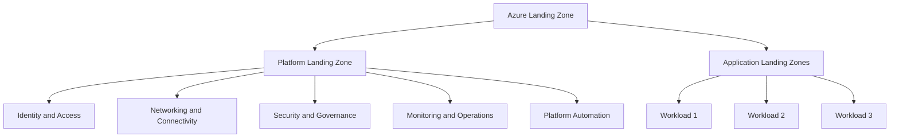

---

# 4. Platform Landing Zone

## 4.1 What Is a Platform Landing Zone?

The **platform landing zone** is the centralized foundation that provides shared services and governance for application workloads.

It is usually managed by a central cloud platform or cloud enablement team.

A platform landing zone commonly includes:

- Management group hierarchy
- Shared identity services
- Centralized networking
- Security services
- Monitoring and logging
- Governance policies
- Subscription provisioning
- Shared automation services

Microsoft recommends that most organizations have one platform landing zone per Microsoft Entra tenant, although the exact design depends on organizational requirements. ([learn.microsoft.com](https://learn.microsoft.com/azure/cloud-adoption-framework/ready/landing-zone?utm_source=openai))

## 4.2 Platform Landing Zone Architecture

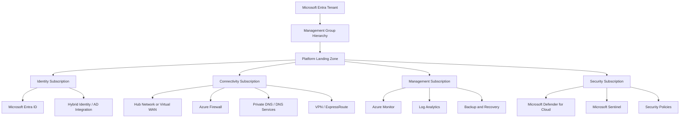

---

# 5. Application Landing Zone

## 5.1 What Is an Application Landing Zone?

An **application landing zone** is the governed environment where a specific workload is deployed and operated.

It may contain:

- Development environment
- Test environment
- Staging environment
- Production environment
- Application resources
- Workload-specific networking
- Workload databases
- Storage
- Application monitoring
- Private endpoints
- Workload-specific security controls

Microsoft describes an application landing zone as the environment containing the resources and environments required to support a specific workload. ([learn.microsoft.com](https://learn.microsoft.com/azure/cloud-adoption-framework/ready/landing-zone?utm_source=openai))

## 5.2 Example Application Landing Zone

```text
Application Landing Zone: E-Commerce
|
+-- Development Subscription
|   +-- Development App Service
|   +-- Development Database
|   +-- Development Storage
|
+-- Test Subscription
|   +-- Test App Service
|   +-- Test Database
|   +-- Test Monitoring
|
+-- Production Subscription
    +-- Production App Service
    +-- Production Database
    +-- Production Key Vault
    +-- Production Private Endpoints
    +-- Production Monitoring
```

Application landing zones inherit governance and security policies from the management group hierarchy. ([learn.microsoft.com](https://learn.microsoft.com/azure/cloud-adoption-framework/ready/landing-zone?utm_source=openai))

---

# 6. Platform Landing Zone vs Application Landing Zone

| Area | Platform Landing Zone | Application Landing Zone |
|---|---|---|
| Primary Purpose | Provides shared foundation | Hosts a specific workload |
| Managed By | Central platform/cloud team | Application or workload team |
| Main Resources | Identity, networking, security, monitoring | App Service, AKS, databases, storage |
| Scope | Organization-wide | Workload-specific |
| Governance | Defines and enforces policies | Consumes inherited policies |
| Networking | Hub, firewall, DNS, ExpressRoute | Spoke VNet, private endpoints |
| Security | Central security and compliance | Application-specific security |
| Lifecycle | Long-lived foundation | Lifecycle follows the workload |
| Example | Connectivity subscription | Orders application subscription |

### Interview Answer

> The platform landing zone provides shared services and governance, while application landing zones are the governed environments where individual workloads are deployed. The platform team manages the foundation, and workload teams manage their applications within defined guardrails.

---

# 7. Azure Landing Zone High-Level Flow Chart

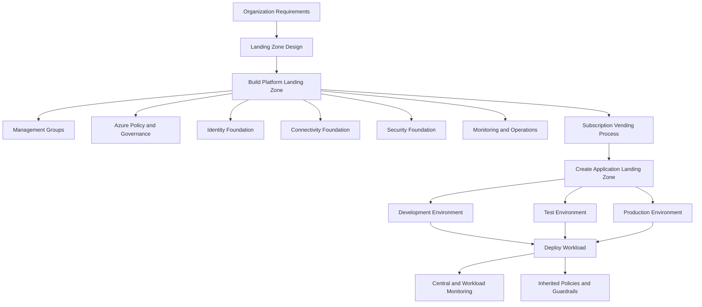

---

# 8. Azure Landing Zone Management Group Hierarchy

A management group hierarchy organizes subscriptions and applies governance at scale.

## Example Hierarchy

```text
Tenant Root Group
|
+-- Platform
|   +-- Management Subscription
|   +-- Connectivity Subscription
|   +-- Identity Subscription
|   +-- Security Subscription
|
+-- Landing Zones
|   +-- Corp
|   |   +-- Internal Workload Subscriptions
|   |
|   +-- Online
|       +-- Internet-Facing Workload Subscriptions
|
+-- Sandbox
|   +-- Developer Sandbox Subscriptions
|
+-- Decommissioned
    +-- Retired Subscriptions
```

## Management Group Flow

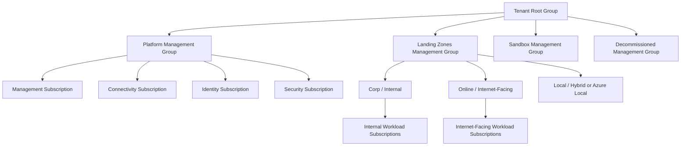

---

# 9. Core Azure Landing Zone Design Areas

Azure landing zone design requires decisions across multiple areas, including identity, resource organization, networking, security, management, governance, and automation. ([learn.microsoft.com](https://learn.microsoft.com/en-us/azure/cloud-adoption-framework/ready/landing-zone/design-areas?utm_source=openai))

## 9.1 Azure Billing and Tenant

Consider:

- Microsoft Entra tenant structure
- Azure billing agreement
- Subscription ownership
- Billing account organization
- Regional requirements
- Resource quotas
- Cost centers

## 9.2 Identity and Access Management

Consider:

- Microsoft Entra ID
- Hybrid identity
- Privileged Identity Management
- Role-based access control
- Managed identities
- Conditional Access
- Break-glass accounts
- Least-privilege access

### Identity Flow

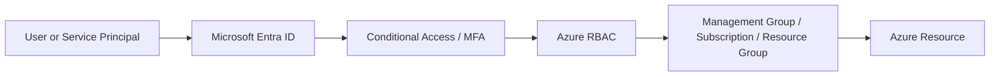

## 9.3 Resource Organization

Consider:

- Management group hierarchy
- Subscription strategy
- Resource group strategy
- Workload ownership
- Environment separation
- Subscription limits
- Application lifecycle

## 9.4 Network Topology and Connectivity

Consider:

- Hub-and-spoke networking
- Azure Virtual WAN
- Virtual network peering
- Azure Firewall
- VPN Gateway
- ExpressRoute
- Private DNS
- Private endpoints
- Ingress and egress traffic
- On-premises connectivity

## 9.5 Security

Consider:

- Microsoft Defender for Cloud
- Microsoft Sentinel
- Network Security Groups
- Azure Firewall
- DDoS Protection
- Vulnerability management
- Encryption
- Security incident response
- Security baseline policies

## 9.6 Management and Operations

Consider:

- Azure Monitor
- Log Analytics workspaces
- Application Insights
- Backup and recovery
- Update management
- Alerting
- Service health
- Operational dashboards
- Disaster recovery

## 9.7 Governance

Consider:

- Azure Policy
- Naming standards
- Required tags
- Allowed regions
- Allowed SKUs
- Deny public access
- Diagnostic settings
- Regulatory requirements
- Resource locks

## 9.8 Platform Automation and DevOps

Consider:

- Bicep or Terraform
- Subscription vending
- GitHub Actions
- Azure DevOps
- Policy-as-code
- Infrastructure-as-code modules
- Automated validation
- Environment promotion
- Drift detection

Microsoft identifies platform automation and DevOps as an important design area for deploying and managing landing zones consistently. ([learn.microsoft.com](https://learn.microsoft.com/en-us/azure/cloud-adoption-framework/ready/landing-zone/design-areas?utm_source=openai))

---

# 10. Hub-and-Spoke Landing Zone Architecture

A common networking pattern uses a centralized hub network and separate spoke networks for workloads.

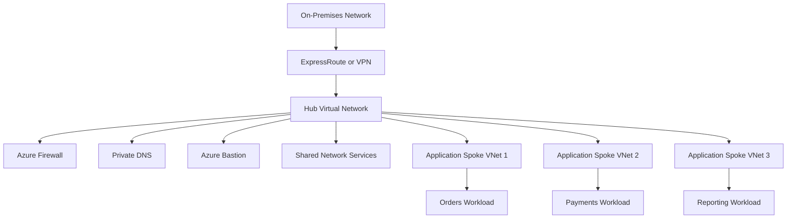

## Benefits

- Centralized traffic inspection
- Consistent firewall controls
- Shared connectivity
- Network isolation between workloads
- Easier hybrid connectivity
- Centralized DNS and routing

## Possible Challenges

- Hub becomes operationally important
- Network design can become complex
- Central team must manage shared services
- Poor routing design can increase latency

---

# 11. Virtual WAN Landing Zone Architecture

Azure Virtual WAN can be used for large-scale connectivity across regions, branches, users, and workloads.

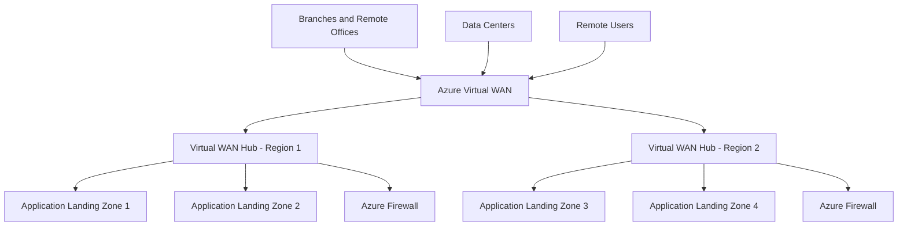

Choose hub-and-spoke or Virtual WAN based on:

- Number of regions
- Number of branches
- Connectivity complexity
- Routing requirements
- Network operations model
- Existing enterprise standards

---

# 12. Subscription Strategy

Subscriptions provide boundaries for:

- Billing
- Access control
- Quotas
- Resource isolation
- Environment separation
- Workload ownership
- Governance inheritance

## Common Subscription Models

### Model 1: One Subscription per Environment

```text
Application
|
+-- Development Subscription
+-- Test Subscription
+-- Production Subscription
```

### Model 2: One Subscription per Workload

```text
Orders Subscription
Payments Subscription
Reporting Subscription
```

### Model 3: Separate Platform Subscriptions

```text
Platform
|
+-- Identity Subscription
+-- Connectivity Subscription
+-- Management Subscription
+-- Security Subscription
```

### Interview Answer

> Subscription boundaries should be based on governance, ownership, isolation, billing, quotas, and workload lifecycle. I would not create subscriptions only because an application has multiple resource types.

---

# 13. Subscription Vending

**Subscription vending** is an automated process for creating and configuring standardized Azure subscriptions or application landing zones.

A subscription vending workflow may:

1. Receive a subscription request
2. Validate ownership and business metadata
3. Create the subscription
4. Place it in the correct management group
5. Apply Azure Policy
6. Configure RBAC
7. Apply tags
8. Configure budgets
9. Connect networking
10. Enable monitoring
11. Return the subscription to the workload team

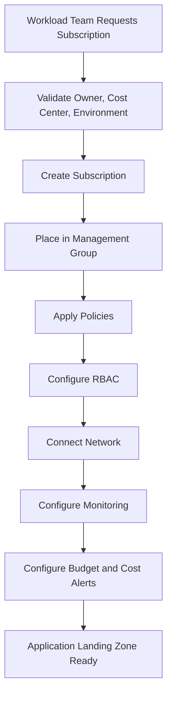

Microsoft identifies subscription vending as a repeatable way to distribute application landing zones to workload teams. ([learn.microsoft.com](https://learn.microsoft.com/azure/cloud-adoption-framework/ready/landing-zone?utm_source=openai))

---

# 14. Governance in an Azure Landing Zone

Governance ensures that cloud resources comply with organizational standards.

## Common Governance Controls

- Allowed Azure regions
- Required resource tags
- Approved resource types
- Approved VM sizes
- HTTPS-only enforcement
- Private endpoint requirements
- Diagnostic settings
- Encryption requirements
- Public network access restrictions
- Backup requirements
- Resource naming standards

## Governance Flow

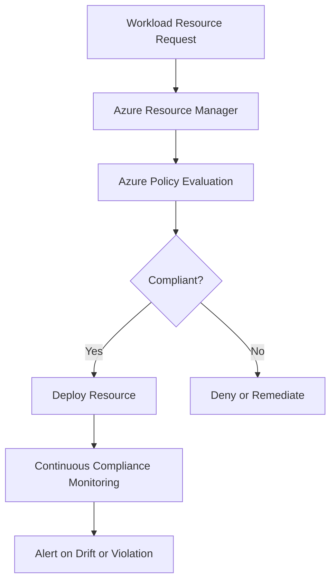

---

# 15. Security Architecture

A landing zone should use defense in depth.

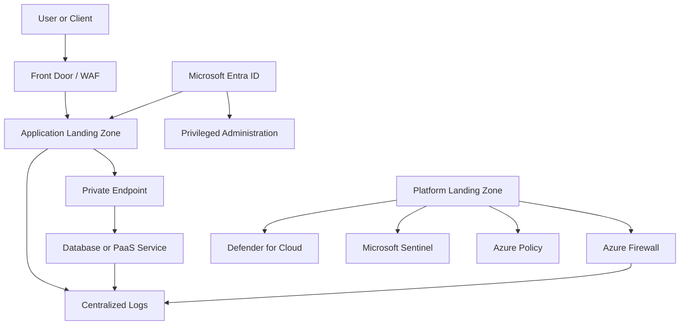

## Security Best Practices

- Use Microsoft Entra ID for authentication.
- Use managed identities instead of stored credentials.
- Use Privileged Identity Management for administrative access.
- Use private endpoints for sensitive PaaS services.
- Restrict public network access.
- Centralize security logs.
- Enable Defender for Cloud.
- Use Azure Firewall for controlled egress.
- Use Key Vault for secrets and certificates.
- Apply least-privilege RBAC.
- Use policy-based governance.

---

# 16. Monitoring and Operations

The platform landing zone commonly provides centralized operational capabilities.

## Monitoring Components

- Azure Monitor
- Log Analytics
- Application Insights
- Microsoft Sentinel
- Action Groups
- Alerts
- Dashboards
- Network Watcher
- Backup and recovery tools
- Service health notifications

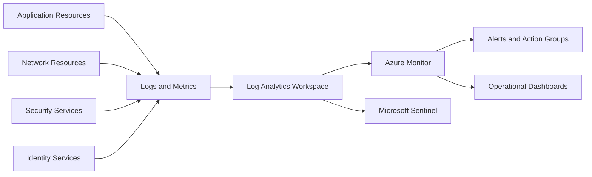

---

# 17. Azure Landing Zone Deployment Options

Azure landing zones can be implemented using:

1. Microsoft-provided accelerators
2. Bicep
3. Terraform
4. Custom infrastructure-as-code
5. Manual deployment for small environments

Microsoft provides landing zone accelerators and infrastructure-as-code approaches for platform and application landing zones. ([learn.microsoft.com](https://learn.microsoft.com/en-us/azure/cloud-adoption-framework/ready/policy-management/enterprise-policy-as-code?utm_source=openai))

## Deployment Flow

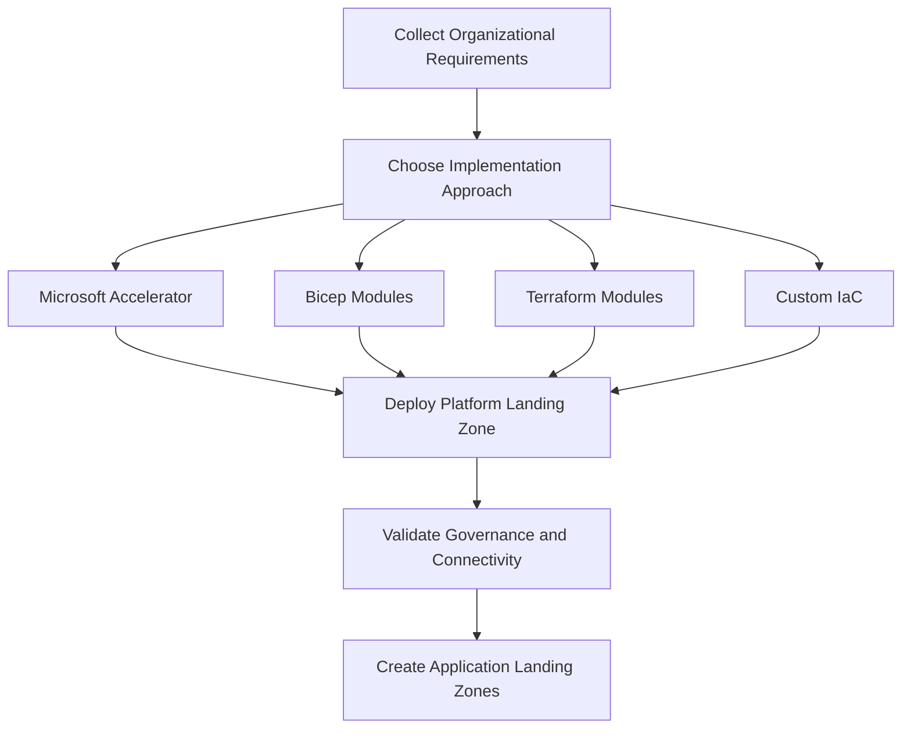

---

# 18. Azure Landing Zone vs Resource Group

These concepts are not the same.

| Area | Azure Landing Zone | Resource Group |
|---|---|---|
| Scope | Enterprise, platform, or workload environment | Logical container for resources |
| Purpose | Governance and scalable cloud foundation | Resource organization and lifecycle |
| Contains | Subscriptions, policies, networking, shared services | Azure resources |
| Typical Owner | Platform/cloud team | Application or infrastructure team |
| Scale | Multi-subscription | Usually one subscription |
| Includes Identity and Governance | Yes | Limited |
| Example | Enterprise Azure foundation | `rg-orders-prod` |

### Interview Answer

> A resource group is a container for Azure resources, whereas a landing zone is a broader architecture that defines how subscriptions, identity, networking, governance, security, and workloads are organized.

---

# 19. Azure Landing Zone vs Management Group

| Area | Azure Landing Zone | Management Group |
|---|---|---|
| Definition | Complete cloud foundation architecture | Hierarchical governance scope |
| Purpose | Provides platform and workload foundations | Organizes subscriptions and applies policies |
| Includes Networking | Often yes | No, not by itself |
| Includes Security | Often yes | Policies and role scope only |
| Includes Monitoring | Often yes | No, not by itself |
| Relationship | Uses management groups | One component of a landing zone |

### Interview Answer

> Management groups are one building block of a landing zone. A complete landing zone also includes identity, networking, security, operations, automation, and application subscription design.

---

# 20. Benefits of Azure Landing Zones

## 20.1 Consistent Governance

Policies and standards are applied consistently across subscriptions.

## 20.2 Improved Security

Identity, network, security monitoring, and access controls are designed centrally.

## 20.3 Faster Workload Deployment

Application teams can use pre-approved, standardized environments.

## 20.4 Better Scalability

The environment can grow from a few subscriptions to many workloads.

## 20.5 Clear Team Responsibilities

Platform teams manage shared capabilities while workload teams manage applications.

## 20.6 Better Cost Management

Subscriptions, tags, budgets, and ownership make costs easier to track.

## 20.7 Reduced Configuration Drift

Infrastructure-as-code and centralized policies reduce differences between environments.

## 20.8 Easier Compliance

Policies, logs, security controls, and audit processes can be standardized.

---

# 21. Challenges and Trade-Offs

An Azure landing zone is valuable, but it introduces planning and governance overhead.

## Common Challenges

- Initial design can be complex
- Requires organizational agreement
- Platform team needs strong Azure expertise
- Governance can become too restrictive
- Shared services require clear ownership
- Poor management group design can become difficult to change
- Centralized networking can create dependencies
- Over-centralization can slow application teams
- Policies may block valid workload requirements

## Best Practice

> Build guardrails, not unnecessary gates.

A good landing zone should provide:

- Secure defaults
- Self-service provisioning
- Clear exceptions
- Automated compliance
- Workload team autonomy within boundaries

---

# 22. Example Enterprise Landing Zone

```text
Microsoft Entra Tenant
|
+-- Platform
|   |
|   +-- Identity Subscription
|   |   +-- Identity Services
|   |   +-- Recovery Services
|   |
|   +-- Connectivity Subscription
|   |   +-- Hub VNet
|   |   +-- Azure Firewall
|   |   +-- VPN / ExpressRoute
|   |   +-- Private DNS
|   |
|   +-- Management Subscription
|   |   +-- Log Analytics
|   |   +-- Azure Monitor
|   |   +-- Automation
|   |
|   +-- Security Subscription
|       +-- Microsoft Sentinel
|       +-- Security Workspaces
|       +-- Defender Configuration
|
+-- Application Landing Zones
|   |
|   +-- Orders Workload
|   |   +-- Development Subscription
|   |   +-- Test Subscription
|   |   +-- Production Subscription
|   |
|   +-- Payments Workload
|       +-- Development Subscription
|       +-- Production Subscription
|
+-- Sandbox
    +-- Developer Sandbox Subscriptions
```

---

# 23. End-to-End Azure Landing Zone Flow

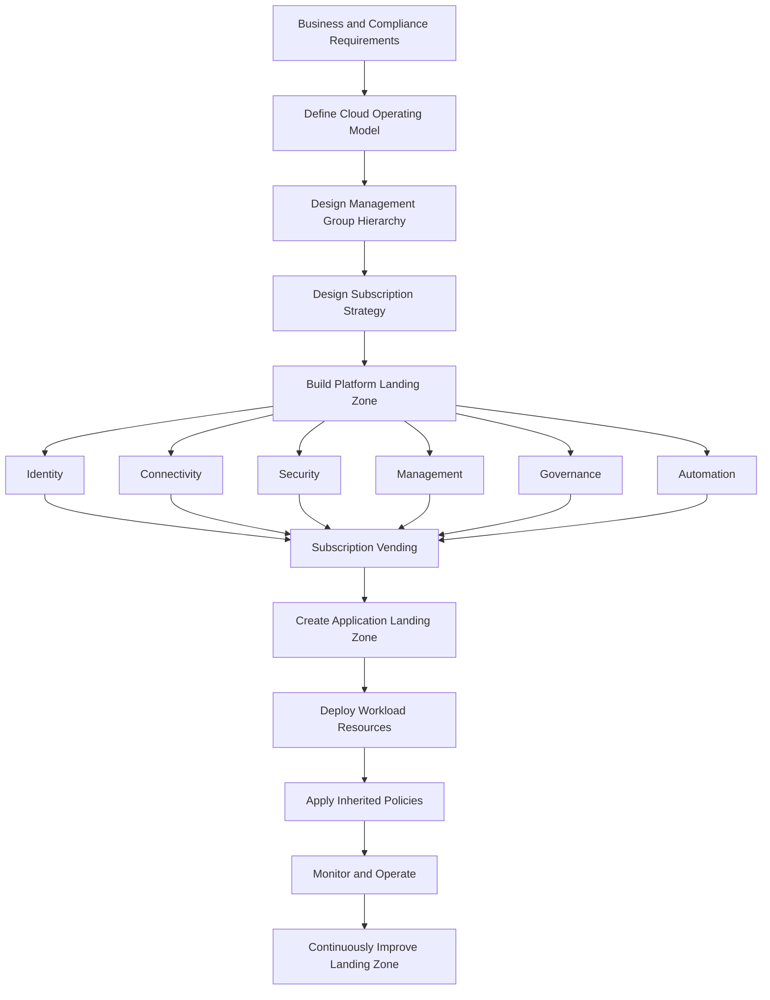

---

# 24. Scenario-Based Interview Answer

## Scenario

An organization wants to migrate 100 applications to Azure. Different teams will own different applications, but the organization requires:

- Centralized security
- Network connectivity to on-premises
- Consistent policies
- Centralized monitoring
- Separate production subscriptions
- Developer self-service
- Cost tracking
- Compliance reporting

## Strong Answer

> I would design an Azure landing zone with a centralized platform landing zone and separate application landing zones for each workload. The platform landing zone would provide management groups, identity integration, hub or Virtual WAN connectivity, Azure Firewall, centralized monitoring, Defender for Cloud, Sentinel, Azure Policy, and subscription vending. Each application landing zone would contain the workload-specific subscriptions and resources for development, test, and production. Policies and RBAC would be inherited from the management group hierarchy, while workload teams would retain ownership of their application resources. I would deploy the design using Bicep or Terraform through CI/CD and use automated subscription vending to keep new environments consistent.

---

# 25. Common Azure Landing Zone Interview Questions

## Q1. What is an Azure landing zone?

**Answer:**

An Azure landing zone is a scalable and governed Azure foundation that provides shared services, security controls, networking, identity, operations, and standardized environments for application workloads.

---

## Q2. What are the two main parts of a landing zone?

**Answer:**

The two main parts are:

1. Platform landing zone
2. Application landing zones

The platform landing zone provides shared capabilities, while application landing zones host individual workloads.

---

## Q3. What is the purpose of a platform landing zone?

**Answer:**

It provides centralized identity, networking, security, monitoring, governance, and automation services for workload teams.

---

## Q4. What is an application landing zone?

**Answer:**

It is a governed environment containing the Azure resources and environments required to run a specific application or workload.

---

## Q5. Who manages the platform landing zone?

**Answer:**

Usually a central cloud platform, cloud enablement, or infrastructure team manages the platform landing zone.

---

## Q6. Who manages an application landing zone?

**Answer:**

The application or workload team usually owns and operates its application resources within the policies and guardrails defined by the platform team.

---

## Q7. What is subscription vending?

**Answer:**

Subscription vending is an automated process for creating and configuring standardized Azure subscriptions or application landing zones.

---

## Q8. Which Azure services are commonly centralized?

**Answer:**

Common centralized capabilities include:

- Microsoft Entra identity integration
- Hub networking or Virtual WAN
- Azure Firewall
- Private DNS
- Azure Monitor
- Log Analytics
- Microsoft Sentinel
- Defender for Cloud
- Azure Policy
- Cost management
- Backup and recovery

---

## Q9. Is a landing zone the same as a resource group?

**Answer:**

No. A resource group is a container for Azure resources. A landing zone is a broader architecture that includes management groups, subscriptions, identity, networking, governance, security, operations, and workload environments.

---

## Q10. Is a landing zone mandatory for every Azure project?

**Answer:**

A small personal or development project may not need a complete enterprise landing zone. However, organizations adopting Azure at scale should establish landing zone principles early to avoid inconsistent architecture and security debt.

---

## Q11. What networking patterns are commonly used?

**Answer:**

Common patterns include:

- Hub-and-spoke
- Azure Virtual WAN
- Virtual network peering
- Private endpoints
- Centralized firewall and DNS

---

## Q12. How does a landing zone improve security?

**Answer:**

It centralizes identity, RBAC, network controls, security monitoring, policy enforcement, private connectivity, and compliance processes.

---

## Q13. How does a landing zone support DevOps?

**Answer:**

It uses infrastructure-as-code, reusable modules, CI/CD, subscription vending, policy-as-code, automated validation, and environment promotion.

---

## Q14. How do you avoid making governance too restrictive?

**Answer:**

Use policy-driven guardrails, self-service automation, clearly documented exceptions, separate sandbox environments, and collaboration between platform and workload teams.

---

# 26. 60-Second Interview Pitch

> An Azure landing zone is a standardized foundation for securely deploying and operating workloads at scale. It consists of a platform landing zone and application landing zones. The platform landing zone provides shared identity, networking, security, monitoring, governance, and automation capabilities. Application landing zones provide governed environments for individual workloads and their development, test, and production resources. I would implement the design using management groups, subscriptions, Azure Policy, RBAC, hub-and-spoke or Virtual WAN networking, centralized monitoring, and infrastructure-as-code. Subscription vending would provide a repeatable self-service process for onboarding new workloads.

---

# 27. Final Interview Summary

Remember these key points:

- A landing zone is an Azure foundation, not just a resource group.
- It supports secure and scalable cloud adoption.
- It has two main parts:
  - Platform landing zone
  - Application landing zones
- The platform landing zone provides centralized shared services.
- Application landing zones host individual workloads.
- Management groups organize subscriptions and enforce governance.
- Azure Policy provides guardrails.
- RBAC controls access.
- Hub-and-spoke or Virtual WAN provides connectivity.
- Azure Monitor, Log Analytics, Defender, and Sentinel support operations and security.
- Subscription vending automates workload onboarding.
- Bicep or Terraform should be used for repeatable deployment.
- Good landing zones balance centralized governance with workload team autonomy.

## Best One-Line Answer

> An Azure landing zone is a secure, governed, and scalable Azure foundation that provides shared platform services and standardized application environments for deploying workloads consistently at enterprise scale.