# Azure Resource Manager (ARM)
## Detailed Interview Preparation Guide with Flow Charts

---

## 1. What Is Azure Resource Manager?

**Azure Resource Manager**, commonly called **ARM**, is the deployment and management layer of Microsoft Azure.

It provides a consistent way to:

- Create Azure resources
- Update resource configurations
- Delete resources
- Organize resources into resource groups
- Apply access control using Azure RBAC
- Apply policies, tags, and locks
- Deploy infrastructure using templates
- Track deployments and deployment history
- Manage resources consistently through the Azure Portal, Azure CLI, PowerShell, REST APIs, and SDKs

### Simple Interview Definition

> Azure Resource Manager is the control plane of Azure that provides a consistent management layer for deploying, organizing, securing, governing, and monitoring Azure resources.

---

## 2. ARM Is Not the Same as an ARM Template

This is a very common interview topic.

### Azure Resource Manager

ARM is the **Azure management service** responsible for processing requests and managing Azure resources.

### ARM Template

An **ARM template** is a JSON file that describes the desired Azure infrastructure.

For example, an ARM template can define:

- App Service
- App Service Plan
- Azure SQL Database
- Storage Account
- Virtual Network
- Subnets
- Network Security Groups
- Key Vault
- Application Insights

### Bicep

**Bicep** is a domain-specific language for deploying Azure resources. It provides a simpler syntax than JSON ARM templates and is converted into an ARM template during deployment.

```text
Azure Resource Manager
        |
        +-- ARM Templates: JSON-based infrastructure definition
        |
        +-- Bicep: Easier authoring language that compiles to ARM JSON
        |
        +-- Azure Portal, CLI, PowerShell, REST API, SDKs
```

### Interview Answer

> ARM is the deployment and management service. An ARM template is a JSON document used by ARM to define and deploy infrastructure. Bicep is a more readable language that provides the same deployment capabilities and compiles to ARM JSON.

---

## 3. Why Does Azure Need ARM?

Without a centralized management layer, every Azure service would have its own deployment, authorization, monitoring, and configuration process.

ARM provides a common platform for all Azure resources.

### ARM Provides

1. Consistent deployment APIs
2. Centralized authorization
3. Resource grouping
4. Policy enforcement
5. Resource tagging
6. Resource locking
7. Deployment dependency management
8. Infrastructure-as-code support
9. Deployment history
10. Multi-environment repeatability

---

## 4. Azure Resource Manager Request Flow

```mermaid
flowchart LR
    User[User or CI/CD Pipeline] --> Tool[Portal / Azure CLI / PowerShell / REST / SDK]
    Tool --> ARM[Azure Resource Manager]
    ARM --> Auth[Authentication and Authorization]
    Auth --> Validate[Request and Template Validation]
    Validate --> Policy[Azure Policy and Governance Checks]
    Policy --> Provider[Azure Resource Provider]
    Provider --> Resource[Target Azure Resource]
    Resource --> Result[Deployment Result]
    Result --> ARM
    ARM --> Tool
    Tool --> User
```

### Example

Suppose you create an Azure App Service using the Azure Portal:

1. You enter the configuration in the portal.
2. The portal sends a request to ARM.
3. ARM authenticates and authorizes the request.
4. ARM validates the request.
5. ARM forwards the operation to the App Service resource provider.
6. The App Service provider creates or updates the resource.
7. ARM returns the deployment status.

The same ARM layer is used when you perform the operation through:

- Azure Portal
- Azure CLI
- Azure PowerShell
- REST API
- Azure SDK
- Bicep
- ARM templates
- Terraform through Azure APIs

---

## 5. Azure Resource Hierarchy

Azure resources are organized into four major management scopes:

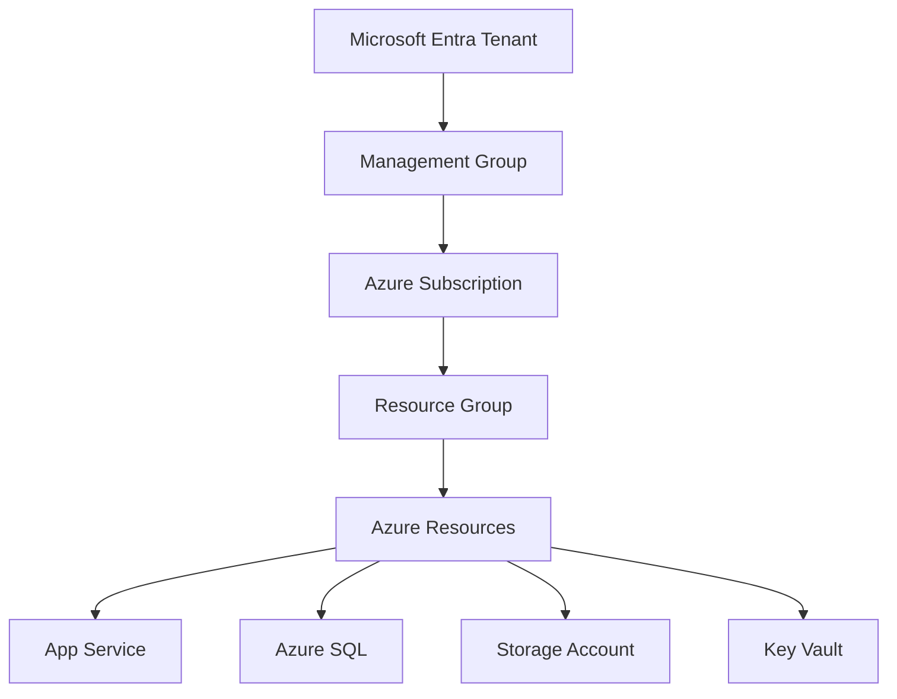

## 5.1 Management Group

A management group is used to organize multiple subscriptions.

It is useful for:

- Enterprise governance
- Applying policies across subscriptions
- Centralized compliance
- Organization-wide RBAC

## 5.2 Subscription

A subscription is a logical and billing boundary.

It provides:

- Billing separation
- Quotas and limits
- Access control scope
- Resource ownership boundary

## 5.3 Resource Group

A resource group is a logical container for related Azure resources.

Example:

```text
rg-ecommerce-production
    |
    +-- App Service
    +-- App Service Plan
    +-- Azure SQL Database
    +-- Key Vault
    +-- Application Insights
    +-- Storage Account
```

## 5.4 Resource

A resource is an individual Azure service instance, such as:

- Virtual machine
- Web App
- SQL database
- Storage account
- Virtual network
- Key Vault

---

## 6. What Is a Resource Group?

A resource group is a container used to manage related Azure resources as a unit.

### Benefits of Resource Groups

- Group resources by application or workload
- Apply RBAC at group level
- Apply policies
- Apply resource locks
- Apply tags
- Track deployments
- Delete related resources together
- Separate environments such as development, testing, and production

### Example Environment Structure

```text
Subscription: Production
|
+-- rg-orders-prod
|   +-- Orders API
|   +-- Orders App Service Plan
|   +-- Azure SQL
|   +-- Key Vault
|
+-- rg-payments-prod
|   +-- Payments API
|   +-- Payments Database
|   +-- Payment Key Vault
|
+-- rg-shared-prod
    +-- Application Insights
    +-- Log Analytics Workspace
    +-- Shared Storage
```

### Important Interview Point

A resource can connect to resources in another resource group.

For example:

- App Service can connect to a database in another resource group.
- A virtual machine can connect to a Key Vault in a shared resource group.
- Resources do not need to be in the same resource group to communicate.

---

## 7. Resource Group Design Strategies

### Strategy 1: Group by Application

```text
rg-commerce
    +-- Web App
    +-- API
    +-- Database
    +-- Storage
```

Use this when resources have the same lifecycle.

### Strategy 2: Group by Environment

```text
rg-commerce-dev
rg-commerce-test
rg-commerce-prod
```

Use this to isolate environments.

### Strategy 3: Group by Lifecycle

```text
rg-app-prod
rg-data-prod
rg-network-prod
rg-monitoring-prod
```

Use this when different resources are managed by different teams or have different lifecycles.

### Interview Answer

> I design resource groups based on lifecycle, ownership, environment, and deletion boundaries rather than simply placing every resource into one group.

---

## 8. ARM Template Deployment Flow

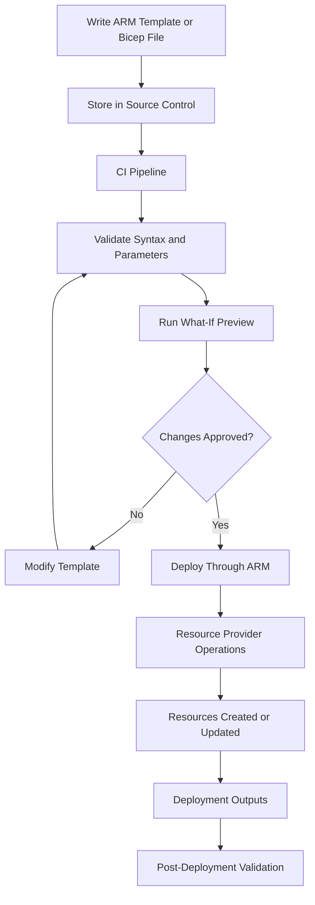

---

## 9. Declarative vs Imperative Deployment

## 9.1 Imperative Deployment

Imperative deployment describes **how** to create resources step by step.

Example:

```bash
az group create --name rg-demo --location eastus

az storage account create \
  --name demostorageaccount \
  --resource-group rg-demo \
  --location eastus
```

The script tells Azure the sequence of commands to execute.

## 9.2 Declarative Deployment

Declarative deployment describes **what the final state should be**.

Example:

```bicep
resource storageAccount 'Microsoft.Storage/storageAccounts@2023-05-01' = {
  name: 'demostorageaccount'
  location: resourceGroup().location
  sku: {
    name: 'Standard_LRS'
  }
  kind: 'StorageV2'
}
```

ARM determines the required operations to achieve the desired state.

### Interview Answer

> ARM templates and Bicep use a declarative approach. We define the desired infrastructure state, and Azure Resource Manager determines the resource operations needed to create or update that state.

---

## 10. ARM Template Structure

A traditional ARM template commonly contains:

```json
{
  "$schema": "...",
  "contentVersion": "1.0.0.0",
  "parameters": {},
  "variables": {},
  "resources": [],
  "outputs": {}
}
```

### Main Sections

| Section | Purpose |
|---|---|
| `$schema` | Defines the template schema |
| `contentVersion` | Identifies the template version |
| `parameters` | Accepts values during deployment |
| `variables` | Stores reusable expressions |
| `resources` | Defines Azure resources |
| `outputs` | Returns values after deployment |

### Example ARM Template

```json name=main.json
{
  "$schema": "https://schema.management.azure.com/schemas/2019-04-01/deploymentTemplate.json#",
  "contentVersion": "1.0.0.0",
  "parameters": {
    "storageAccountName": {
      "type": "string"
    }
  },
  "resources": [
    {
      "type": "Microsoft.Storage/storageAccounts",
      "apiVersion": "2023-05-01",
      "name": "[parameters('storageAccountName')]",
      "location": "[resourceGroup().location]",
      "sku": {
        "name": "Standard_LRS"
      },
      "kind": "StorageV2"
    }
  ],
  "outputs": {
    "storageAccountResourceId": {
      "type": "string",
      "value": "[resourceId('Microsoft.Storage/storageAccounts', parameters('storageAccountName'))]"
    }
  }
}
```

---

## 11. Bicep vs ARM JSON

| Feature | ARM JSON Template | Bicep |
|---|---|---|
| Syntax | Verbose JSON | Concise declarative syntax |
| Readability | More difficult | Easier |
| Type safety | Available but verbose | Strong authoring support |
| Modularity | Linked/nested templates | Modules |
| Azure-native | Yes | Yes |
| Deployment engine | ARM | ARM after compilation |
| Recommended for new authoring | Less preferred | Commonly preferred |

### Interview Answer

> ARM JSON and Bicep use the same Azure Resource Manager deployment engine. Bicep is generally easier to read, write, reuse, and maintain, while ARM JSON is useful when working with existing templates or systems that require JSON.

---

## 12. Deployment Scopes

ARM deployments can target different scopes:

1. Tenant
2. Management group
3. Subscription
4. Resource group
5. Individual resource

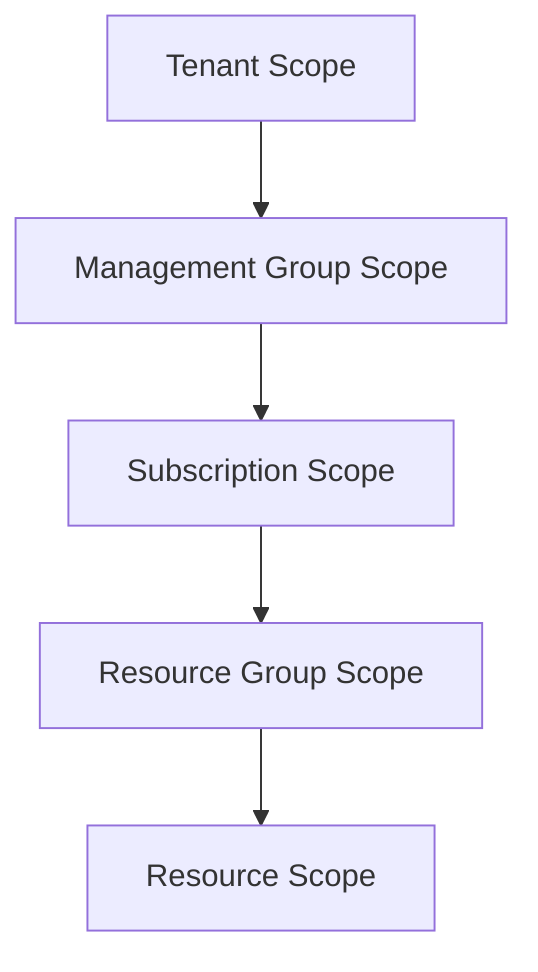

### Resource Group Deployment

Used for application resources:

```bash
az deployment group create \
  --resource-group rg-demo \
  --template-file main.bicep
```

### Subscription Deployment

Used for:

- Creating resource groups
- Assigning policies
- Creating role assignments
- Deploying shared subscription resources

```bash
az deployment sub create \
  --location eastus \
  --template-file subscription.bicep
```

### Management Group Deployment

Used for organization-wide governance and policies.

### Tenant Deployment

Used for tenant-level resources and configurations.

---

## 13. Deployment Modes

ARM deployments commonly use deployment modes to determine how existing resources are handled.

## 13.1 Incremental Mode

In incremental mode:

- Resources in the template are created or updated.
- Existing resources not in the template remain unchanged.
- This is the normal and recommended mode for most deployments.

```text
Existing Resource Group:
    Resource A
    Resource B
    Resource C

Template:
    Resource A
    Resource B
    Resource D

Result:
    Resource A
    Resource B
    Resource C
    Resource D
```

## 13.2 Complete Mode

Historically, complete mode deleted resources that existed in the resource group but were not present in the template.

However, Microsoft documentation indicates that complete mode is not recommended and is being gradually deprecated for deletion scenarios. Deployment stacks should be considered when resource deletion or managed-resource cleanup is required.

### Interview Answer

> Incremental deployment is the safer default because it does not delete resources that are missing from the template. For controlled resource removal, I would use deployment stacks or an explicit deletion process rather than relying on complete mode.

---

## 14. What-If Operation

The ARM `what-if` operation previews deployment changes before they are applied.

It can show:

- Resources to be created
- Resources to be modified
- Resources to be deleted
- Property changes
- Potential unexpected changes

### Example

```bash
az deployment group what-if \
  --resource-group rg-demo \
  --template-file main.bicep \
  --parameters environment=prod
```

### What-If Flow

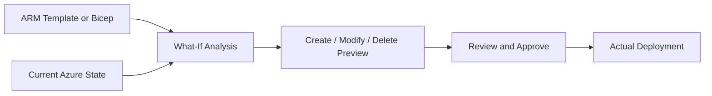

### Interview Answer

> Before deploying production infrastructure, I use `what-if` to preview resource changes and detect accidental modifications or deletions.

---

## 15. ARM Deployment Dependencies

ARM understands dependencies between resources.

For example:

```text
App Service Plan
        |
        v
App Service
        |
        v
Application Configuration
```

The App Service cannot be created correctly until the App Service Plan exists.

### Dependency Flow

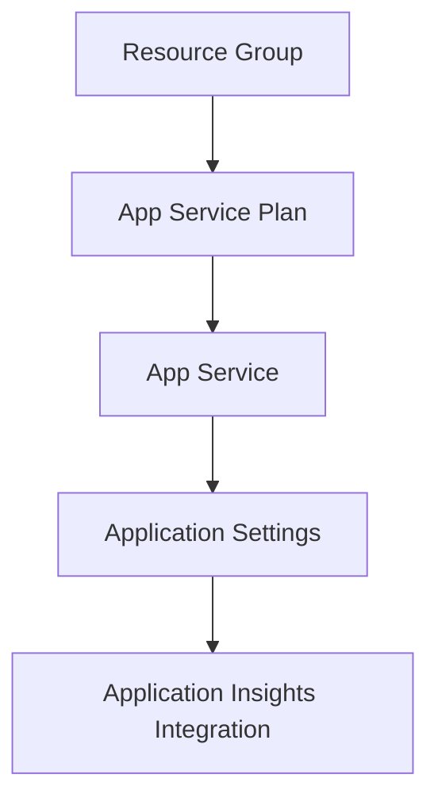

Dependencies can be created through:

- Resource references
- Explicit `dependsOn`
- Parent-child resource relationships

### Best Practice

Use implicit dependencies where possible. Use explicit `dependsOn` only when ARM cannot infer the dependency.

---

## 16. ARM and Azure Resource Providers

A resource provider is responsible for implementing and managing a particular type of Azure resource.

Examples:

| Provider Namespace | Resource Type |
|---|---|
| `Microsoft.Compute` | Virtual machines |
| `Microsoft.Web` | App Service |
| `Microsoft.Storage` | Storage accounts |
| `Microsoft.Sql` | Azure SQL |
| `Microsoft.KeyVault` | Key Vault |
| `Microsoft.Network` | Virtual networks |
| `Microsoft.Insights` | Monitoring resources |

### Resource ID Example

```text
/subscriptions/{subscription-id}
/resourceGroups/{resource-group}
/providers/Microsoft.Web
/sites/{app-name}
```

### Request Flow

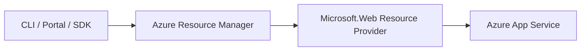

---

## 17. ARM and Access Control

ARM integrates with **Azure role-based access control**, commonly called Azure RBAC.

Roles can be assigned at different scopes:

- Management group
- Subscription
- Resource group
- Individual resource

### RBAC Scope Flow

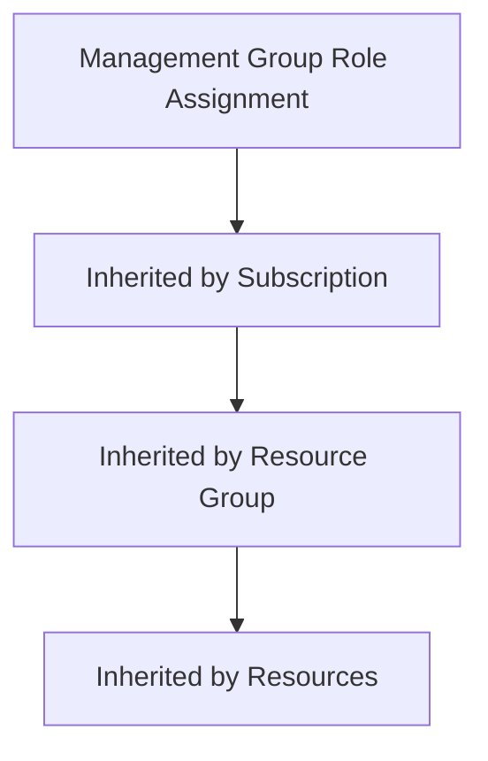

### Example Roles

- Owner
- Contributor
- Reader
- User Access Administrator
- Website Contributor
- Storage Blob Data Contributor

### Important Principle

Assign permissions at the lowest practical scope.

### Interview Answer

> ARM provides the management plane where Azure RBAC permissions are evaluated. A role assignment at a higher scope can be inherited by lower scopes, so I follow least privilege and assign permissions as narrowly as possible.

---

## 18. ARM and Azure Policy

Azure Policy evaluates whether resources comply with organizational rules.

Examples:

- Require specific regions
- Require tags
- Deny public IP addresses
- Require HTTPS
- Restrict resource types
- Require diagnostic settings
- Enforce approved SKUs

### Policy Deployment Flow

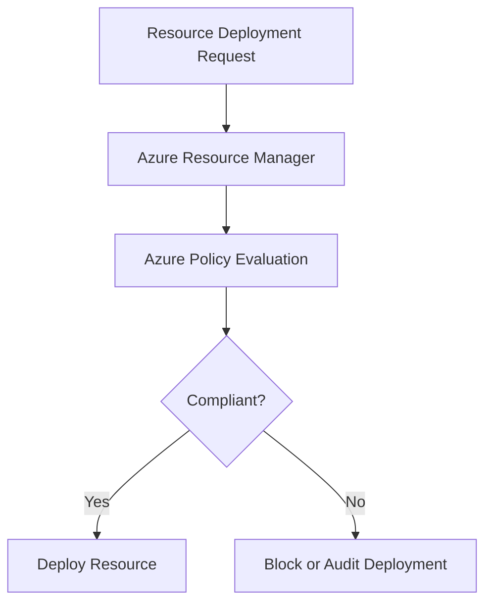

### Policy Effects

Common effects include:

- Audit
- Deny
- Append
- Modify
- DeployIfNotExists

### Interview Answer

> Azure Policy provides governance and compliance, while ARM is the management and deployment layer through which the resource request is processed.

---

## 19. ARM and Resource Locks

Resource locks help prevent accidental deletion or modification.

### Common Lock Types

#### ReadOnly

Users can read the resource but cannot update or delete it.

#### CanNotDelete

Users can modify the resource but cannot delete it.

### Example

```text
Production Database
        |
        +-- CanNotDelete Lock
```

### Interview Use Case

> I would apply a `CanNotDelete` lock to a production database or critical Key Vault, while ensuring that operational procedures account for the lock during updates and deletions.

---

## 20. ARM and Tags

Tags are name-value pairs applied to Azure resources.

Example:

```text
Environment = Production
Application = Orders
Owner = Payments-Team
CostCenter = CC-1001
DataClassification = Confidential
```

### Benefits

- Cost reporting
- Ownership tracking
- Environment identification
- Automation
- Compliance
- Resource search and organization

### Important Interview Point

Tags applied to a resource group are not automatically inherited by resources inside that group. Use Azure Policy or automation when inheritance is required.

---

## 21. ARM Deployment History

ARM records deployment operations and status.

Deployment history helps with:

- Troubleshooting failed deployments
- Reviewing parameters
- Identifying changed resources
- Investigating failed operations
- Auditing infrastructure changes

### Deployment Lifecycle

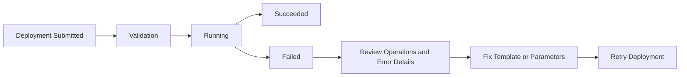

---

## 22. ARM and Infrastructure as Code

Infrastructure as Code, or IaC, means defining infrastructure in version-controlled code.

### Typical Repository Structure

```text
infrastructure/
|
+-- main.bicep
+-- modules/
|   +-- app-service.bicep
|   +-- database.bicep
|   +-- key-vault.bicep
|   +-- monitoring.bicep
|
+-- parameters/
    +-- dev.parameters.json
    +-- test.parameters.json
    +-- prod.parameters.json
```

### Benefits

- Repeatable environments
- Version control
- Code review
- Auditability
- Automated deployment
- Easier disaster recovery
- Reduced manual configuration drift

---

## 23. ARM CI/CD Flow

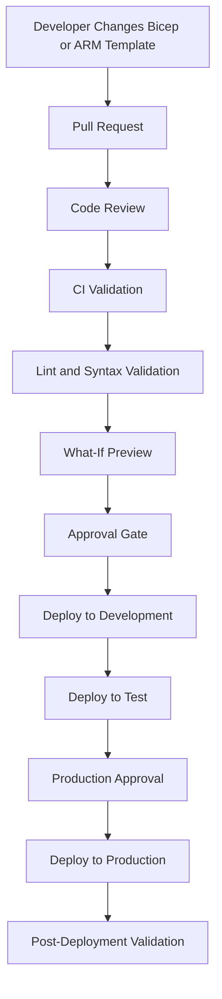

---

## 24. Example Azure CLI Deployment

```bash
az group create \
  --name rg-demo \
  --location eastus

az deployment group create \
  --name demo-deployment \
  --resource-group rg-demo \
  --template-file main.bicep \
  --parameters environment=dev
```

### What Happens?

1. Azure CLI authenticates with Azure.
2. The command sends the deployment request to ARM.
3. ARM validates permissions.
4. ARM validates the Bicep or ARM template.
5. Bicep is converted to ARM JSON if necessary.
6. ARM determines dependencies.
7. ARM calls the required resource providers.
8. Resources are created or updated.
9. Deployment status and outputs are returned.

---

## 25. ARM vs Azure Portal

| Feature | Azure Portal | ARM/Bicep |
|---|---|---|
| Manual deployment | Easy | Not the main purpose |
| Repeatability | Low to medium | High |
| Version control | Limited | Strong |
| Code review | Limited | Strong |
| Automation | Possible | Excellent |
| Large environments | Can become inconsistent | Consistent |
| Disaster recovery | Manual recreation | Redeploy from code |

### Interview Answer

> The Azure Portal is useful for exploration and small manual changes, but ARM templates or Bicep are better for repeatable, auditable, production infrastructure.

---

## 26. ARM vs Terraform

| Area | ARM/Bicep | Terraform |
|---|---|---|
| Azure integration | Native | Provider-based |
| State management | Azure deployment model | Terraform state |
| Multi-cloud | Limited | Strong |
| Azure feature availability | Usually immediate | Provider-dependent |
| Syntax | Bicep or JSON | HCL |
| Best use case | Azure-native infrastructure | Multi-cloud or mixed-platform infrastructure |

### Interview Answer

> I choose Bicep when the organization is primarily Azure-focused and wants native integration. I consider Terraform when infrastructure spans Azure and other cloud providers or when the team already has strong Terraform standards.

---

## 27. ARM Deployment Best Practices

1. Prefer Bicep for new Azure-native infrastructure authoring.
2. Store templates in source control.
3. Use modules for reusable infrastructure.
4. Use parameters for environment-specific values.
5. Never hardcode secrets in templates.
6. Use Key Vault and Managed Identity for secrets.
7. Use `what-if` before production deployments.
8. Use incremental deployment by default.
9. Use deployment stacks when controlled resource deletion is required.
10. Use meaningful resource names.
11. Apply consistent tags.
12. Use Azure Policy for governance.
13. Apply RBAC using least privilege.
14. Configure diagnostic settings.
15. Use CI/CD instead of manual production deployments.
16. Review deployment history after releases.
17. Use separate parameter files for dev, test, and production.
18. Avoid unnecessary explicit `dependsOn`.
19. Validate templates before merging.
20. Keep application and infrastructure deployments coordinated but independently manageable.

---

## 28. Common ARM Interview Questions

### Q1. What is Azure Resource Manager?

**Answer:**

Azure Resource Manager is Azure's deployment and management service. It provides a consistent management layer for creating, updating, deleting, securing, organizing, and governing Azure resources.

---

### Q2. What is an ARM template?

**Answer:**

An ARM template is a JSON file that declaratively defines Azure resources and their configuration. ARM uses the template to create or update infrastructure consistently.

---

### Q3. What is the difference between ARM and an ARM template?

**Answer:**

ARM is the Azure management service. An ARM template is an infrastructure definition file consumed by ARM.

---

### Q4. What is Bicep?

**Answer:**

Bicep is a declarative language for deploying Azure resources. It provides a cleaner syntax than ARM JSON and is compiled into ARM JSON during deployment.

---

### Q5. What is a resource group?

**Answer:**

A resource group is a logical container for related Azure resources. It provides a management, access-control, policy, tagging, and lifecycle boundary.

---

### Q6. What happens when a resource group is deleted?

**Answer:**

Resources contained in the resource group are generally deleted as part of the resource group deletion process. Therefore, resource groups should be designed carefully around lifecycle and deletion boundaries.

---

### Q7. What is incremental deployment mode?

**Answer:**

Incremental mode creates or updates resources defined in the template while leaving unrelated existing resources in the resource group unchanged.

---

### Q8. What is complete deployment mode?

**Answer:**

Historically, complete mode removed resources not present in the template. It is not recommended for new deletion scenarios. Deployment stacks should be considered when resources must be explicitly managed and removed.

---

### Q9. What is the `what-if` operation?

**Answer:**

`what-if` previews the changes that a deployment would make before the deployment is executed. It can show resources that will be created, updated, or deleted.

---

### Q10. How does ARM handle dependencies?

**Answer:**

ARM uses resource references, parent-child relationships, and explicit dependencies to determine the correct deployment order.

---

### Q11. How does ARM support security?

**Answer:**

ARM integrates with Azure RBAC, Azure Policy, resource locks, managed identities, and deployment authorization.

---

### Q12. How do you deploy a Bicep file?

**Answer:**

A Bicep file can be deployed using the Azure Portal, Azure CLI, Azure PowerShell, REST API, or a CI/CD pipeline.

Example:

```bash
az deployment group create \
  --resource-group rg-demo \
  --template-file main.bicep
```

---

### Q13. How do you prevent accidental deletion?

**Answer:**

Use resource locks, least-privilege RBAC, production approvals, `what-if` validation, and deployment stacks where appropriate.

---

### Q14. Can resources in different resource groups communicate?

**Answer:**

Yes. Resource groups are management boundaries, not network boundaries. Resources can communicate across resource groups when networking, identity, and access permissions allow it.

---

### Q15. How do you handle secrets in ARM templates?

**Answer:**

Do not hardcode secrets. Use Azure Key Vault, secure parameters, managed identities, and deployment-time references where appropriate.

---

## 29. Scenario-Based Interview Answer

### Scenario

You need to deploy a production .NET Web API with:

- Azure App Service
- Azure SQL Database
- Key Vault
- Application Insights
- Environment-specific settings
- Repeatable deployment across dev, test, and production

### Strong Answer

> I would define the infrastructure using Bicep because it provides a concise Azure-native declarative syntax. I would create reusable modules for the App Service, database, Key Vault, and monitoring resources. Environment-specific values would be provided through parameter files. The deployment would run through a CI/CD pipeline, use `what-if` before production, and deploy in incremental mode. The application would use managed identity to access Key Vault, and Azure Policy and RBAC would enforce governance. I would also enable deployment history, diagnostic settings, and post-deployment health checks.

---

## 30. End-to-End ARM Architecture Flow

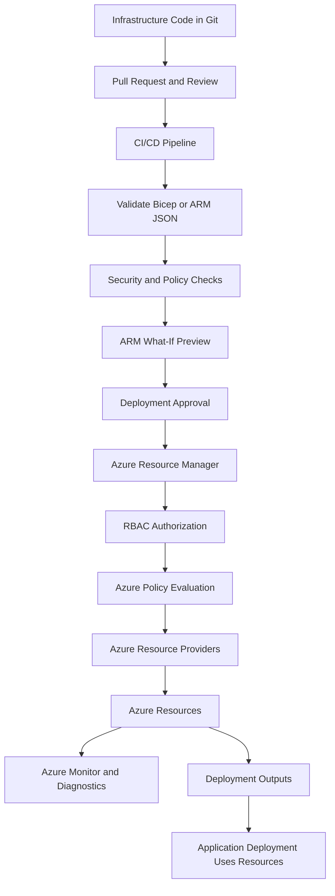

---

## 31. 60-Second Interview Pitch

> Azure Resource Manager is the control plane and deployment service for Azure. It provides a consistent interface for managing Azure resources through the Portal, CLI, PowerShell, REST APIs, and SDKs. ARM supports resource groups, RBAC, policies, locks, tags, deployment dependencies, deployment history, and infrastructure as code. ARM templates define infrastructure in JSON, while Bicep provides a simpler authoring experience and compiles to ARM JSON. In production, I would store Bicep in source control, validate it in CI/CD, run what-if before deployment, use incremental mode by default, secure secrets with Key Vault and managed identity, and apply RBAC and Azure Policy for governance.

---

## 32. Final Summary

Azure Resource Manager is the foundation for managing Azure infrastructure.

Remember these points:

- ARM is the Azure management and deployment service.
- ARM templates are JSON-based infrastructure definitions.
- Bicep is a simpler language that compiles to ARM JSON.
- Resource groups organize related resources.
- ARM integrates with RBAC, Policy, locks, tags, and deployment history.
- ARM supports deployments at tenant, management group, subscription, and resource group scopes.
- Incremental deployment is the usual safe default.
- Use `what-if` before important deployments.
- Use deployment stacks when controlled resource lifecycle and deletion are required.
- Use CI/CD and source control for production infrastructure.

### Best One-Line Answer

> Azure Resource Manager is Azure’s centralized deployment and management layer that enables consistent, secure, repeatable, and policy-driven management of cloud resources.