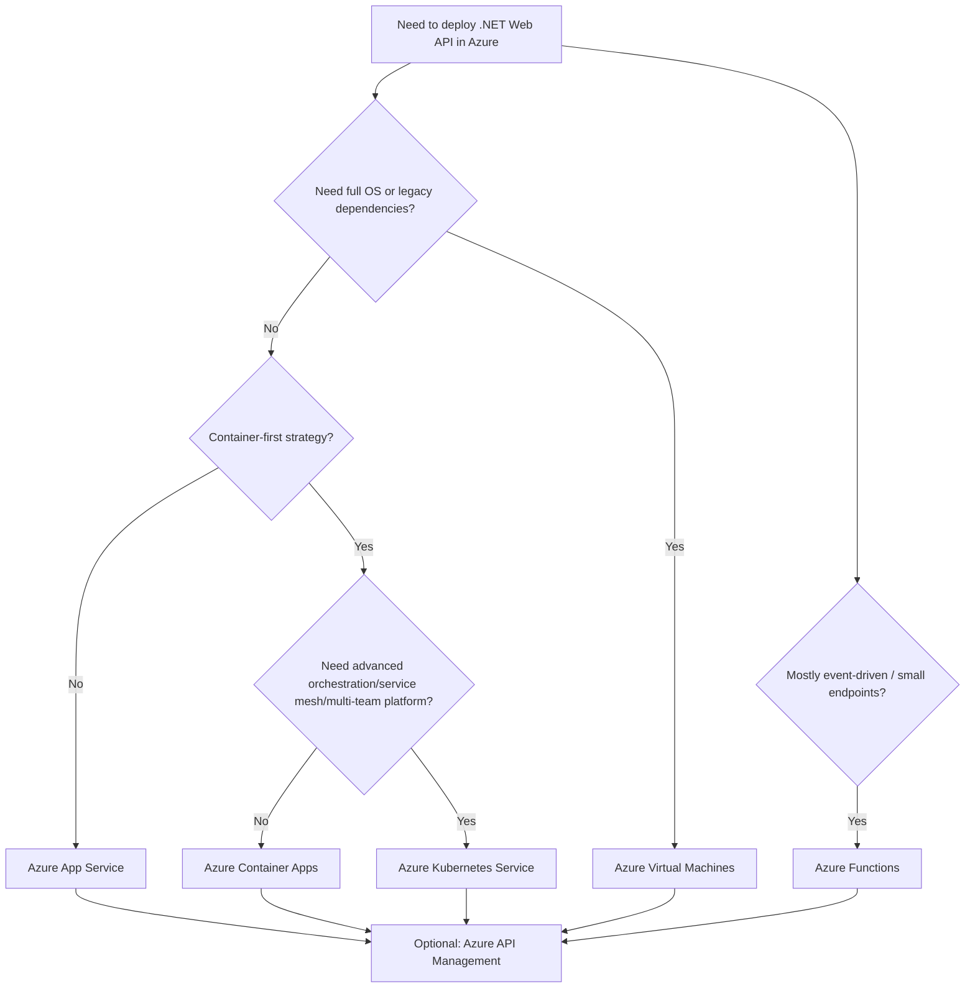
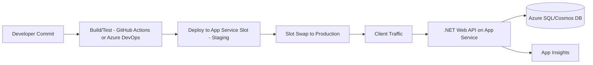
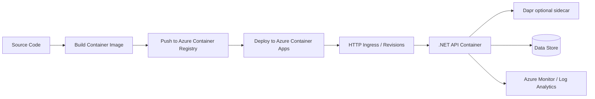
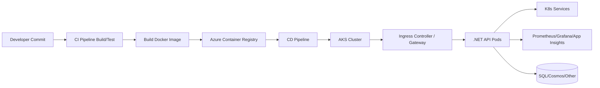
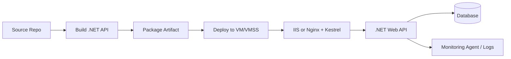
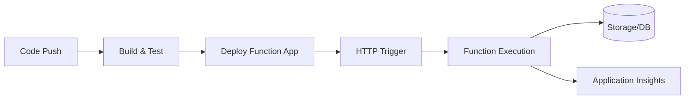
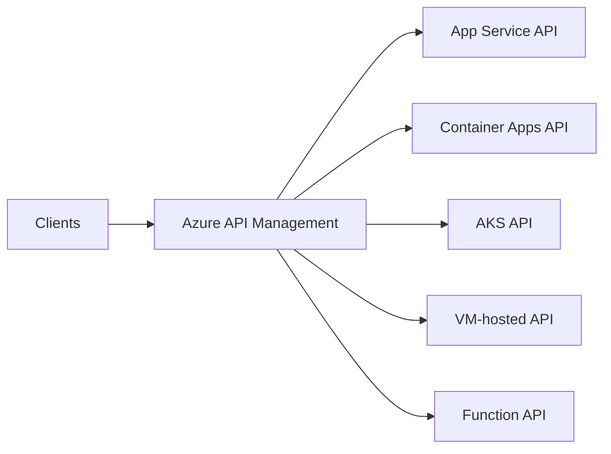

# Deployment Options for a .NET Web API in Azure  
## Detailed Interview Preparation Guide (with Flow Charts)

## 1) Quick Interview Answer

For a **.NET Web API in Azure**, the main deployment options are:

1. **Azure App Service (PaaS)** – fastest and most common for standard APIs  
2. **Azure Container Apps** – serverless containers, microservices/event-driven APIs  
3. **Azure Kubernetes Service (AKS)** – advanced orchestration for complex containerized systems  
4. **Azure Virtual Machines (IaaS)** – full OS/runtime control for legacy/special needs  
5. **Azure Functions (HTTP-triggered)** – for lightweight API endpoints/serverless patterns  
6. **Azure API Management in front of any of the above** – governance, security, throttling, versioning

---

## 2) High-Level Decision Flow Chart

---

## 3) Option 1: Azure App Service (Most Common)

## What it is
A managed PaaS for hosting web apps and APIs. You deploy code directly (or container), Azure manages infra.

## Best for
- Standard enterprise APIs
- Fast delivery
- Teams wanting lower operational overhead

## Deployment flow

## Pros
- Quick setup
- Deployment slots
- Easy autoscale
- Built-in TLS and monitoring integrations

## Cons
- Less infra-level control
- Some advanced networking/features depend on plan tier

---

## 4) Option 2: Azure Container Apps (Modern Serverless Containers)

## What it is
Run containerized APIs without managing Kubernetes control plane.

## Best for
- Microservices
- Event-driven scaling
- Teams wanting containers with lower complexity than AKS

## Deployment flow

## Pros
- Container flexibility + simpler operations
- Scale to zero (depending on config)
- Revision-based rollout

## Cons
- Less control than AKS
- Some platform capabilities are not as broad as full Kubernetes ecosystems

---

## 5) Option 3: AKS (Azure Kubernetes Service)

## What it is
Managed Kubernetes for full container orchestration control.

## Best for
- Large microservice platforms
- Complex networking/security policies
- Multi-team environments with advanced deployment needs

## Deployment flow

## Pros
- Maximum orchestration power
- Advanced rollout strategies (canary/blue-green)
- Strong ecosystem support

## Cons
- Highest operational complexity
- Requires Kubernetes expertise

---

## 6) Option 4: Azure Virtual Machines (IaaS)

## What it is
Deploy API on Windows/Linux VMs with IIS/Kestrel/reverse proxy as needed.

## Best for
- Legacy dependencies
- Custom OS or middleware requirements
- Strict host-level control

## Deployment flow

## Pros
- Full control
- Supports uncommon dependencies

## Cons
- You manage patching, hardening, scaling, backup, runtime operations

---

## 7) Option 5: Azure Functions (HTTP Trigger)

## What it is
Serverless functions that can expose HTTP endpoints (mini APIs or API components).

## Best for
- Lightweight endpoints
- Event-driven integration
- Bursty traffic

## Deployment flow

## Pros
- Very fast to start
- Consumption-based scaling
- Cost-effective for intermittent workloads

## Cons
- Not always ideal for large, complex REST APIs with many cross-cutting requirements
- Cold start considerations (plan dependent)

---

## 8) Where Azure API Management (APIM) Fits

APIM is not the compute host for your API code; it is an **API gateway/management layer** in front of backend APIs.

Use it for:
- Centralized auth policies
- Throttling and quotas
- Versioning/revisions
- Request/response transformation
- Developer portal and subscriptions

---

## 9) CI/CD Options for .NET Web API on Azure

1. **GitHub Actions** (very popular)
2. **Azure DevOps Pipelines**
3. **Bicep/Terraform + pipeline for infra + app deployment**
4. **Container-based pipelines** with ACR and release stages

Typical stages:
- Restore dependencies
- Build
- Unit tests
- Security/code quality scan
- Publish artifact/image
- Deploy to staging
- Smoke test
- Promote/swap to production

---

## 10) Security Best Practices (Interview Must-Mention)

- Use **Managed Identity** for Azure resource access
- Store secrets in **Azure Key Vault**
- Put APIs behind **APIM** or **Front Door + WAF**
- Enable **Private Endpoints/VNet integration** where required
- Enforce **HTTPS/TLS**
- Add authN/authZ (Entra ID/OAuth2/JWT)
- Implement rate limiting and input validation
- Enable audit and diagnostic logging

---

## 11) Observability Best Practices

- **Application Insights** for traces, dependencies, exceptions
- **Azure Monitor** metrics and alerts
- Correlation IDs across services
- Structured logs
- SLO/SLA dashboards and error budget tracking

---

## 12) Interview Comparison Matrix

| Criterion | App Service | Container Apps | AKS | VM | Functions |
|---|---|---|---|---|---|
| Ops Complexity | Low | Low-Medium | High | High | Low |
| Control Level | Medium | Medium | Very High | Very High | Low-Medium |
| Scale Behavior | Easy autoscale | Event + HTTP autoscale | Advanced autoscale | Custom/VMSS | Serverless autoscale |
| Best for | Standard APIs | Microservices/container APIs | Enterprise container platform | Legacy/custom host | Lightweight/event APIs |
| Time to Market | Fast | Fast | Medium | Medium-Slow | Very Fast |

---

## 13) “Which one should I choose?” (Practical Interview Answer)

- Start with **App Service** if requirements are straightforward and speed matters.
- Choose **Container Apps** when containerization is required without AKS complexity.
- Choose **AKS** for large-scale microservices and advanced platform control.
- Choose **VM** only when host-level customization/legacy dependencies demand it.
- Choose **Functions** for small, event-driven, or bursty HTTP workloads.

---

## 14) 60-Second Interview Pitch

> For deploying a .NET Web API in Azure, the default recommendation is Azure App Service because it gives fast delivery, built-in scaling, and low ops overhead. If we need containers with simpler operations, Azure Container Apps is a strong option. For complex microservice orchestration and deep control, AKS is ideal. If legacy or OS-level customization is mandatory, we use Azure VMs. For lightweight event-driven endpoints, Azure Functions works well. In production, we typically place Azure API Management in front, use Managed Identity + Key Vault for security, and enable Application Insights for observability.

---

## 15) Final Takeaway

There is no single “best” deployment option—there is a **best-fit option** based on:
- control requirements
- team maturity
- workload pattern
- compliance/security constraints
- delivery speed expectations

For most interview scenarios, showing this decision logic is more valuable than naming one service.