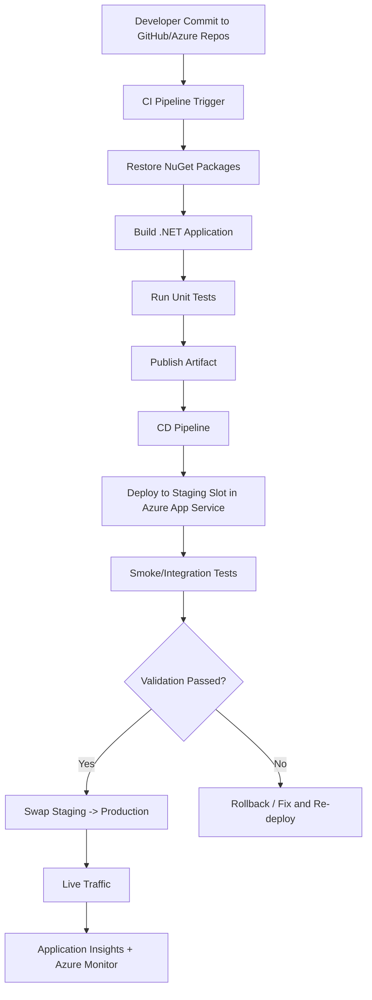
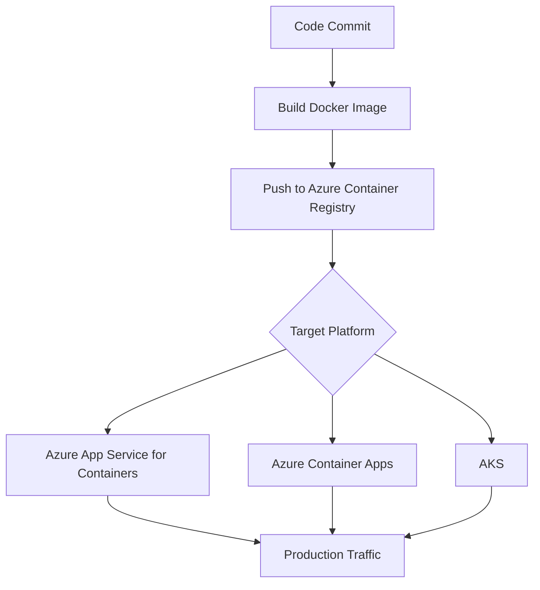

# How to Deploy a .NET Application to Azure  
## Detailed Interview Preparation Guide (with Flow Charts)

## 1) Direct Interview Answer

To deploy a .NET application to Azure, the most common production approach is:

1. Choose hosting target (usually **Azure App Service** for web/API apps)  
2. Provision Azure resources (App Service Plan + Web App + Database + Monitoring)  
3. Configure CI/CD (GitHub Actions or Azure DevOps)  
4. Build, test, and publish artifact/container  
5. Deploy to staging slot, validate, then promote to production  
6. Enable monitoring, autoscaling, and security controls

---

## 2) Deployment Options by .NET App Type

- **ASP.NET Core Web App / Web API** → Azure App Service (most common), Container Apps, AKS  
- **Worker service / background jobs** → Azure Container Apps Jobs, AKS, VM, WebJobs  
- **Event-driven components** → Azure Functions  
- **Legacy full-control needs** → Azure VM

For interviews, start with **App Service** unless requirements indicate otherwise.

---

## 3) End-to-End Deployment Flow Chart (App Service Path)

---

## 4) Azure Services Commonly Used in Deployment

1. **Azure App Service Plan** – compute tier/size  
2. **Azure App Service (Web App/API App)** – app host  
3. **Azure SQL / PostgreSQL / Cosmos DB** – data layer  
4. **Azure Key Vault** – secrets, keys, certificates  
5. **Application Insights + Azure Monitor** – observability  
6. **Azure Storage** – app data/files (if needed)  
7. **Azure Front Door / Application Gateway (optional)** – edge routing + WAF  
8. **Azure API Management (optional)** – API governance/security

---

## 5) Step-by-Step Deployment Process (Interview-Ready)

## Step 1: Prepare the .NET App
- Keep environment-specific settings externalized
- Use `appsettings.{Environment}.json` + environment variables
- Add health check endpoint (`/health`)
- Add structured logging

## Step 2: Provision Azure Infrastructure
Using Azure Portal / CLI / Bicep / Terraform:
- Create resource group
- Create App Service Plan
- Create Web App
- Configure runtime stack
- Connect monitoring and Key Vault

## Step 3: Configure CI Pipeline
Typical CI stages:
- `dotnet restore`
- `dotnet build --configuration Release`
- `dotnet test`
- `dotnet publish`

## Step 4: Configure CD Pipeline
- Deploy artifact to **staging slot**
- Run smoke tests
- Approve and **swap** to production
- Keep rollback plan ready

## Step 5: Post-Deployment Hardening
- Enable autoscale
- Enforce HTTPS
- Configure custom domain + TLS cert
- Enable alerts (availability, error rate, latency)

---

## 6) CI/CD Flow Chart with Security and Quality Gates

```mermaid
flowchart LR
    Dev[Developer] --> PR[Pull Request]
    PR --> CI[CI: Build + Test + Code Analysis]
    CI --> Sec[Security Scan / Dependency Scan]
    Sec --> Artifact[Publish Artifact / Package]
    Artifact --> CD[CD Release Pipeline]
    CD --> Staging[Deploy to Staging Slot]
    Staging --> Tests[Smoke + Integration Tests]
    Tests --> Approve[Manual/Auto Approval Gate]
    Approve --> Prod[Swap to Production]
    Prod --> Observe[Monitor + Alerts + Logs]
```

---

## 7) Alternative: Container-Based Deployment Flow

If deploying .NET as container:

Use this when you need environment parity, portability, or microservice consistency.

---

## 8) Key Interview Topics You Must Cover

## 8.1 Configuration Management
- Avoid hardcoded secrets
- Use environment variables and App Service settings
- Store secrets in Key Vault

## 8.2 Zero-Downtime Release
- Deployment slots (staging/prod)
- Warm-up before swap
- Fast rollback by re-swapping

## 8.3 Observability
- Track request rate, latency, failures
- Distributed tracing
- Alerting thresholds for production reliability

## 8.4 Security
- Managed Identity for Azure resource access
- HTTPS only
- RBAC least privilege
- Private endpoints/VNet integration if required

## 8.5 Scalability
- Scale out instance count
- Scale up instance size
- Autoscale rules based on CPU/memory/requests

---

## 9) Common Deployment Mistakes (and Fixes)

1. **Storing secrets in code**  
   Fix: Key Vault + Managed Identity

2. **No staging slot testing**  
   Fix: Always validate in staging before production swap

3. **No health checks**  
   Fix: Add readiness/liveness endpoints and monitoring alerts

4. **Manual ad-hoc deployments**  
   Fix: Standardize with CI/CD pipeline and approvals

5. **No rollback strategy**  
   Fix: Keep previous artifact/image and use slot rollback/swap back

---

## 10) Sample Interview Q&A

### Q1: What is the easiest way to deploy a .NET Web API to Azure?
**Answer:** Azure App Service with GitHub Actions/Azure DevOps CI/CD and deployment slots.

### Q2: How do you achieve zero downtime?
**Answer:** Deploy to staging slot, run smoke tests, then swap staging to production.

### Q3: Where do you store connection strings/secrets?
**Answer:** Azure Key Vault, accessed through Managed Identity.

### Q4: How do you monitor the deployed app?
**Answer:** Application Insights + Azure Monitor dashboards, logs, and alerts.

### Q5: When would you choose AKS instead of App Service?
**Answer:** When we need advanced container orchestration, complex microservices control, or Kubernetes-native platform features.

---

## 11) 60-Second Interview Pitch (Memorize)

> I deploy .NET applications to Azure using a CI/CD-first approach. For most web/API workloads, I use Azure App Service: provision infra, configure app settings and Key Vault, build and test in CI, deploy to a staging slot, run smoke tests, and swap to production for near-zero downtime. I enable Application Insights and Azure Monitor for telemetry, configure autoscaling and HTTPS, and use Managed Identity for secure access to Azure resources. For container-heavy or highly complex orchestration needs, I evaluate Container Apps or AKS.

---

## 12) Quick Checklist (Before Go-Live)

- [ ] Build/test pipeline green  
- [ ] Secrets in Key Vault (no secrets in repo)  
- [ ] Staging slot deployment validated  
- [ ] Health checks enabled  
- [ ] HTTPS + custom domain configured  
- [ ] Autoscale rules configured  
- [ ] Monitoring dashboards + alerts enabled  
- [ ] Rollback process tested  

---

## 13) Final Summary

For interview scenarios, the strongest answer is practical and structured:

- Prefer **App Service + CI/CD + deployment slots** for most .NET web deployments  
- Add **security (Managed Identity/Key Vault)** and **observability (App Insights/Monitor)** by default  
- Mention **container paths (Container Apps/AKS)** when scale/complexity demands it  

This shows both hands-on deployment understanding and architectural decision maturity.