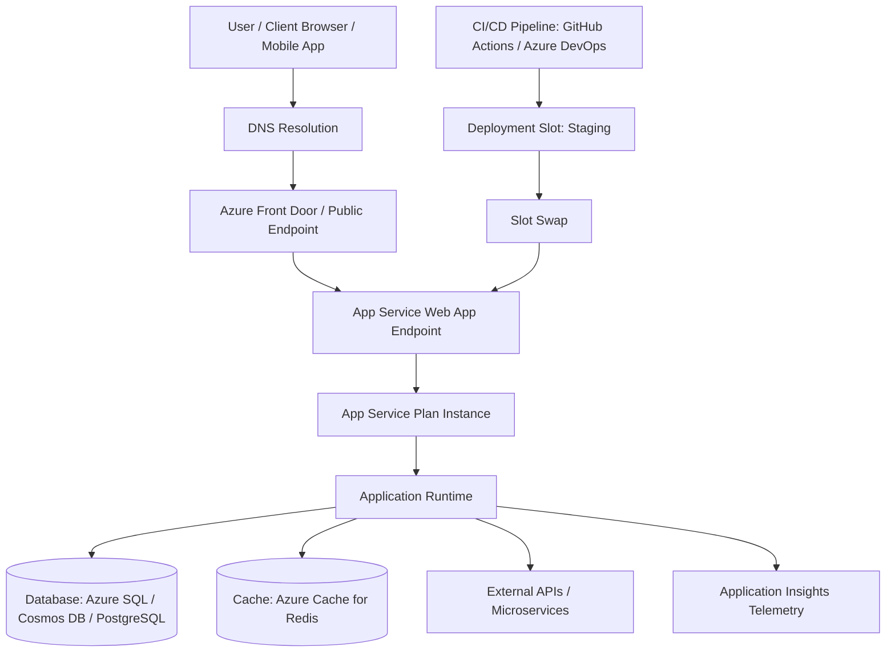
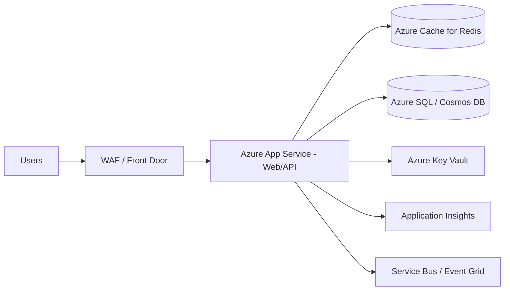

# Azure App Service – Interview Preparation Guide

## 1) What is Azure App Service?

**Azure App Service** is a fully managed **Platform as a Service (PaaS)** offering from Microsoft Azure for hosting web applications, REST APIs, and mobile backends without managing servers directly.

It provides:
- Managed infrastructure (OS patching, scaling, load balancing)
- Multiple runtime support (.NET, Java, Node.js, Python, PHP, etc.)
- CI/CD integration
- Security and identity integration
- Built-in monitoring and diagnostics

In interview terms:

> **Azure App Service lets you deploy and run web apps and APIs quickly on Azure, while Azure manages the underlying infrastructure, scaling, patching, and availability.**

---

## 2) Core Building Blocks (Very Important for Interviews)

### 2.1 App Service Plan
An **App Service Plan** defines the compute resources:
- Region (datacenter location)
- Pricing tier (Free, Shared, Basic, Standard, Premium, Isolated)
- VM size and instance count
- Scaling capabilities

Think of it as the **server farm capacity** your apps run on.

### 2.2 App Service (Web App / API App)
The actual application resource where your code is deployed.
Multiple apps can run under one App Service Plan (sharing compute).

### 2.3 Deployment Slots
Separate environments (e.g., `staging`, `production`) under the same app.
Useful for:
- Blue-green deployments
- Warm-up and validation
- Zero/minimal downtime swap

### 2.4 Kudu / SCM Site
Advanced deployment and troubleshooting engine:
- Deployment logs
- Console access
- Process explorer
- Zip deploy and diagnostics

---

## 3) Request Flow (Flow Chart)

---

## 4) How Azure App Service Works (Step-by-Step)

1. Developer pushes code to GitHub/Azure DevOps.
2. CI/CD pipeline builds and deploys to App Service (often staging slot).
3. App Service runs app using configured runtime.
4. Incoming traffic reaches app endpoint.
5. App may call databases, cache, storage, or external services.
6. Logs/metrics/traces are sent to Application Insights/Azure Monitor.
7. During load, autoscale can add instances (based on rules).

---

## 5) Key Features You Should Mention in Interviews

## 5.1 Scalability
- **Vertical scaling**: change VM size (scale up)
- **Horizontal scaling**: increase number of instances (scale out)
- Autoscale rules based on CPU, memory, queue length, schedules

## 5.2 High Availability
- Built-in load balancing across instances
- SLA-backed uptime for paid tiers
- Zone-redundant options in certain tiers/regions

## 5.3 Security
- TLS/SSL certificates
- Managed Identity (passwordless Azure service access)
- Authentication/Authorization (“Easy Auth”) with Entra ID, Google, Facebook, etc.
- IP restrictions and VNet integration
- Private Endpoints for private access

## 5.4 DevOps & Deployment
- CI/CD with GitHub Actions/Azure DevOps
- Deployment slots for safe releases
- Rollback strategy using previous slot/app version

## 5.5 Monitoring & Diagnostics
- Application Insights (APM)
- Azure Monitor metrics and alerts
- Log stream and diagnostic logs
- Distributed tracing support

---

## 6) App Service vs IaaS VM vs AKS (Common Interview Comparison)

| Criteria | App Service | Virtual Machines (IaaS) | AKS (Kubernetes) |
|---|---|---|---|
| Infra Management | Minimal | Full responsibility | Moderate/High |
| Deployment Speed | Fast | Slower | Medium |
| Control Level | Medium | Very High | Very High |
| Best For | Web apps, APIs, quick delivery | Legacy/custom OS setups | Complex microservices, containers |
| Scaling | Built-in easy scale | Manual/custom | Powerful, complex |
| Ops Complexity | Low | High | High |

**Interview tip:**  
If requirement is “quickly host web/API with low operations overhead,” App Service is usually a great choice.

---

## 7) Pricing Tiers (Interview-friendly Summary)

- **Free/Shared**: dev/test, not production-grade
- **Basic**: dedicated compute, limited features
- **Standard**: autoscale, backups, production workloads
- **Premium (v2/v3/v4)**: higher performance, VNet, advanced scale
- **Isolated (ASE)**: fully isolated network environment for enterprise/regulatory needs

---

## 8) Real-World Use Cases

1. Enterprise web portals  
2. REST APIs for mobile/web backends  
3. Internal line-of-business apps  
4. SaaS applications needing rapid release cycles  
5. Apps requiring managed scaling and monitoring

---

## 9) Important Interview Questions + Strong Answers

### Q1: Why choose Azure App Service?
Because it accelerates delivery by abstracting server management while giving built-in scaling, security, CI/CD, and monitoring.

### Q2: What is App Service Plan?
It is the compute container (region, size, pricing tier, instance count) that hosts one or more App Services.

### Q3: What are deployment slots?
Live app environments (like staging/prod) that enable safe deployments and near-zero downtime swaps.

### Q4: How does App Service scale?
Manually or automatically by scaling out instances or scaling up instance size based on rules/metrics.

### Q5: How is security handled?
TLS, identity providers, managed identity, network restrictions, private endpoints, and integration with Azure security services.

### Q6: When not to use App Service?
When you need deep container orchestration, complex sidecar/service-mesh patterns, or highly customized infra—AKS may fit better.

---

## 10) Common Architecture Pattern with App Service

**Explanation:**
- Front Door/WAF protects and routes traffic.
- App Service hosts business logic.
- Redis improves latency.
- Database stores persistent data.
- Key Vault stores secrets/certs.
- Application Insights provides observability.
- Service Bus/Event Grid supports async integration.

---

## 11) Pros and Cons (Balanced Answer)

### Pros
- Fast time-to-market
- Low operational overhead
- Integrated security and DevOps
- Reliable scaling and monitoring
- Strong Microsoft ecosystem integration

### Cons
- Less infra-level control than VMs/AKS
- Cost can rise at high scale/premium tiers
- Advanced custom networking may require higher tiers or ASE
- Not ideal for every container-native architecture

---

## 12) 60-Second Interview Pitch (Memorize This)

> Azure App Service is a managed PaaS for hosting web apps and APIs. It removes server management overhead and provides built-in scaling, security, deployment slots, and monitoring. The App Service Plan defines compute resources, while the app resource hosts code. For production, teams commonly use staging slots, autoscale, managed identity, Key Vault, and Application Insights. It is ideal when we want rapid delivery with strong operational reliability and minimal infrastructure maintenance.

---

## 13) Best Practices Checklist (Interview Bonus Points)

- Use **deployment slots** for zero-downtime releases  
- Enable **autoscale** with realistic thresholds  
- Use **Managed Identity** instead of hardcoded secrets  
- Store secrets/certs in **Azure Key Vault**  
- Turn on **Application Insights** and alerts  
- Add **health checks** and readiness endpoints  
- Restrict network access (IP/VNet/private endpoint)  
- Use **CDN/Front Door + WAF** for global secure delivery  
- Set backup and disaster recovery strategy

---

## 14) Final Interview Summary

Azure App Service is a top choice for hosting modern web apps and APIs when you need:
- Fast development and deployment
- Managed scaling and high availability
- Strong security and monitoring
- Low infrastructure management burden

For highly complex container orchestration needs, evaluate AKS; for simple and rapid PaaS web hosting, App Service is often the best fit.