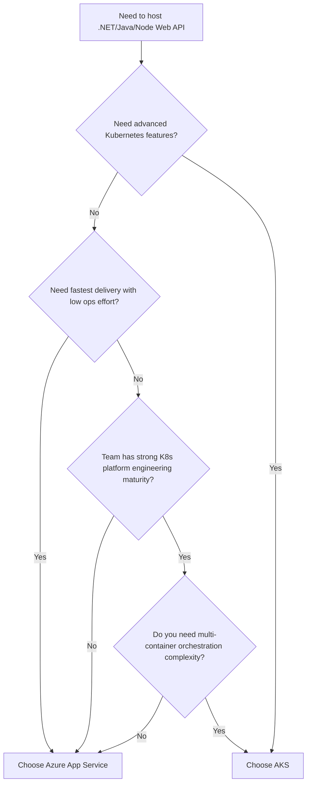
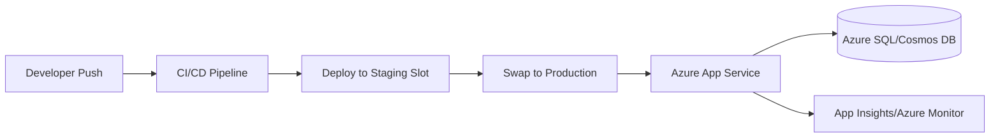
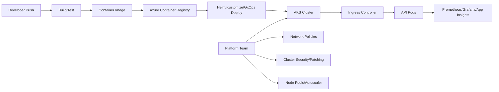

# Why Choose Azure App Service over AKS?  
## Detailed Interview Preparation Guide (with Flow Charts)

## 1) Direct Interview Answer (Short Version)

You choose **Azure App Service over AKS** when:
- You want **faster delivery** with **lower operational complexity**
- Your workload is primarily **web apps / REST APIs**
- You don’t need deep Kubernetes-level control (custom schedulers, service mesh tuning, complex operators)
- Your team wants to focus on **business features**, not cluster operations

> In most standard enterprise API scenarios, App Service gives better time-to-market and lower total operational burden than AKS.

---

## 2) Core Positioning

## Azure App Service
- Fully managed **PaaS**
- Best for: web apps/APIs needing quick deployment and easy scaling
- Minimal platform management

## AKS (Azure Kubernetes Service)
- Managed Kubernetes (still significant ops ownership)
- Best for: complex microservices platforms requiring advanced orchestration and portability
- Higher flexibility, higher complexity

---

## 3) Decision Flow Chart

---

## 4) Architecture Comparison Flow

## 4.1 App Service-Oriented Flow (Simpler Ops)

**Operational model:** primarily app-focused delivery.

---

## 4.2 AKS-Oriented Flow (Platform Engineering Heavy)

**Operational model:** app + cluster/platform ownership.

---

## 5) Detailed Reasons to Choose App Service over AKS

## 5.1 Faster Time-to-Market
- App Service setup is much quicker (deploy code directly or container with minimal platform steps).
- AKS requires cluster architecture decisions (node pools, ingress, policy, network, upgrades).

**Interview line:**  
“App Service reduces lead time for first production release.”

---

## 5.2 Lower Operational Complexity
With App Service, Azure handles much of platform management:
- OS/platform patching (service-managed)
- Built-in load balancing
- Simple scaling controls
- Easier runtime management

With AKS, teams handle:
- Kubernetes manifests/Helm/GitOps complexity
- Cluster upgrades/version skew planning
- Node lifecycle and capacity planning
- Ingress/controller management
- Policy and admission controls

---

## 5.3 Smaller Team / Limited Kubernetes Skills
If your team doesn’t have dedicated platform engineers, AKS can become risky (misconfigurations, slower incident response).
App Service is usually safer for product teams focused on API development.

---

## 5.4 Cost of Ownership (Not Just Compute Cost)
AKS can be efficient at scale, but hidden costs include:
- Platform engineering time
- On-call overhead
- Security hardening effort
- Observability stack management

App Service often wins in **total cost of ownership** for straightforward API workloads.

---

## 5.5 Easier Deployment Operations
App Service has built-in:
- Deployment slots
- Swap-based releases
- Straightforward rollback patterns
- CI/CD integrations out-of-the-box

AKS deployments are powerful but require mature release engineering practices.

---

## 5.6 Security Simplicity for Common Cases
App Service integrates easily with:
- Managed Identity
- TLS certificates
- Access restrictions
- Authentication providers
- Monitoring/auditing hooks

AKS security is powerful but requires more configuration layers:
- Pod security standards
- Network policies
- Secret management patterns
- Image policy/signing/admission controllers

---

## 5.7 Best Fit for Typical Enterprise APIs
If your API is:
- Stateless
- HTTP-based
- Moderate complexity
- Not requiring custom sidecars/operators/service mesh control

then App Service is usually the pragmatic first choice.

---

## 6) When AKS Is Better (Important to Mention in Interviews)

Choose AKS when you need:
1. Complex microservice orchestration across many services
2. Advanced traffic control/service mesh customization
3. Multi-container pod patterns at scale
4. Kubernetes ecosystem tooling/portability
5. Deep control over scheduling, runtime, and cluster behavior

Showing this balance demonstrates architectural maturity.

---

## 7) Interview Comparison Table

| Factor | App Service | AKS |
|---|---|---|
| Setup speed | Fast | Medium/Slow |
| Ops overhead | Low | High |
| Kubernetes control | Limited/abstracted | Full |
| Team skill requirement | App dev focused | Strong platform + K8s skills |
| Deployment simplicity | High (slots/swaps) | Medium (manifests/Helm/GitOps) |
| Best for | Standard web/API workloads | Complex cloud-native platforms |
| Time-to-value | Excellent | Good after platform maturity |

---

## 8) Real-World Interview Scenario Answer

**Scenario:** “We are building customer-facing .NET APIs, need high availability, autoscale, secure deployment, and fast release cycles.”

**Strong answer:**  
“I’d start with App Service because it provides managed scaling, deployment slots, strong Azure integration, and much lower operational overhead. Unless we have explicit Kubernetes-level requirements—like service mesh customization, complex multi-container orchestration, or platform portability—AKS introduces unnecessary complexity for this use case.”

---

## 9) 60-Second Interview Pitch (Memorize)

> I would choose Azure App Service over AKS when I need to deliver web APIs quickly with minimal infrastructure management. App Service is a managed PaaS with built-in scaling, deployment slots, and easy monitoring integration, so teams can focus on features rather than Kubernetes operations. AKS is excellent for complex container platforms, but it requires stronger platform engineering maturity and higher ops effort. For most standard enterprise APIs, App Service provides better time-to-market and lower total cost of ownership.

---

## 10) Final Summary

Choose **App Service over AKS** when:
- Requirements are web/API-centric and not Kubernetes-complex
- Delivery speed and simplicity are priorities
- Team capacity for cluster operations is limited
- You want lower operational risk and faster business outcomes

Use AKS only when its advanced orchestration capabilities are truly needed.