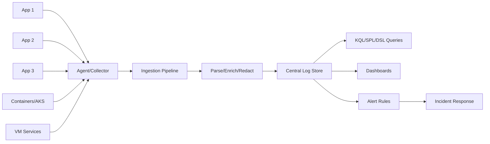
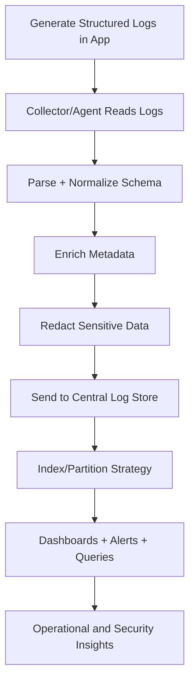
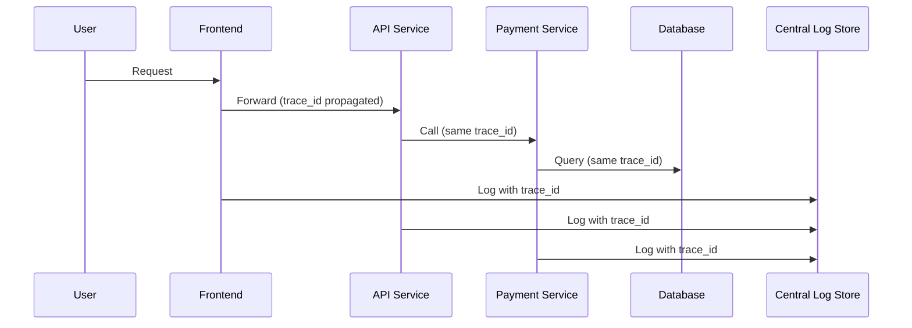
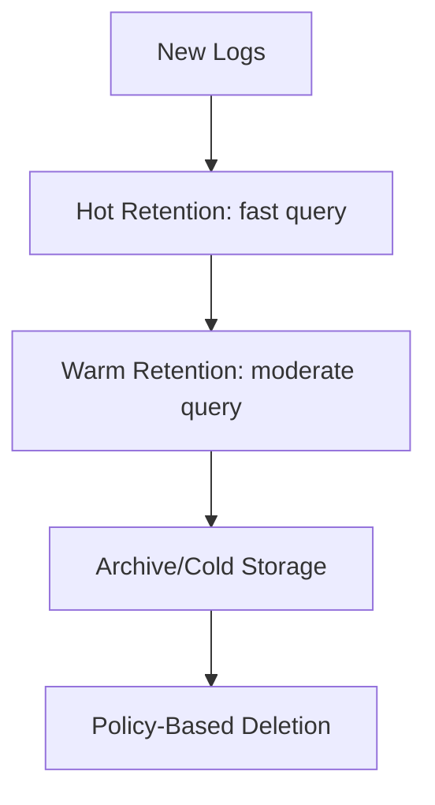
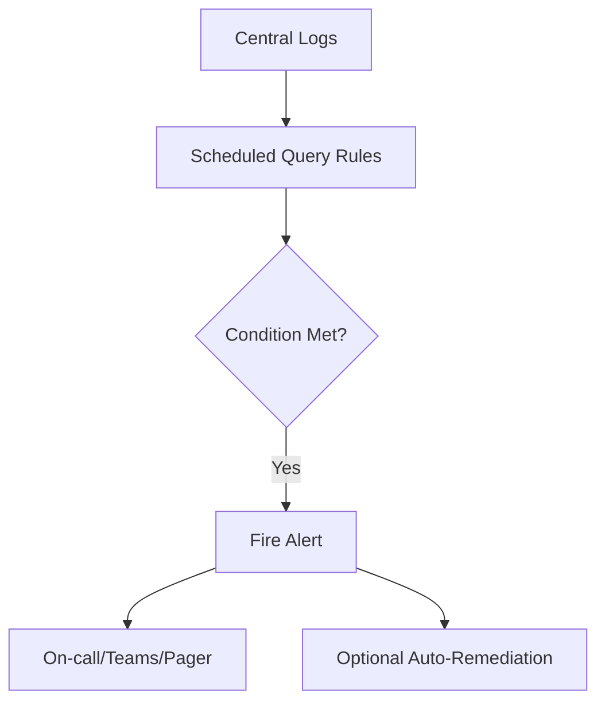
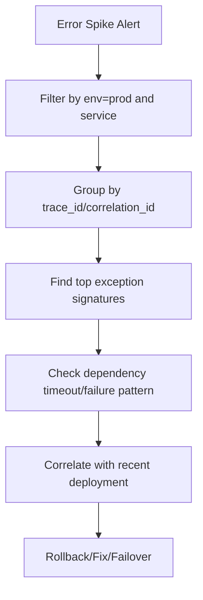

# How Do You Centralize Logs from Multiple Applications?
## Detailed Interview Preparation Guide with Flow Charts (Static Site Ready)

---

## 1) Direct Interview Answer

To centralize logs from multiple applications, implement a **standardized observability pipeline**:

1. Define a common log schema (structured JSON + required fields)
2. Instrument all apps with consistent logging libraries/format
3. Ship logs through agents/exporters/collectors
4. Route to a centralized log platform (e.g., Log Analytics/ELK/Splunk)
5. Partition/index by environment, service, tenant, severity, time
6. Enforce retention, access control, and PII redaction
7. Build dashboards, queries, and alerts for operations and security
8. Govern quality with schema validation and onboarding runbooks

> One-liner: *Standardize log format, centralize ingestion, secure and enrich data, then operationalize with queries, dashboards, and alerts.*

---

## 2) High-Level Centralized Logging Architecture



---

## 3) Core Design Principles (Interview Gold)

- **Structured logs first** (JSON, not free-form text)
- **Consistent schema** across teams
- **Correlation IDs** across requests/services
- **Separation by environment** (prod/non-prod)
- **Least privilege access**
- **Sensitive data never logged**
- **Lifecycle controls** (retention, archive, purge)
- **Cost-aware ingestion policies**

---

## 4) What to Standardize Across All Apps

Minimum required fields:

- `timestamp` (UTC, ISO-8601)
- `service_name`
- `environment` (dev/test/stage/prod)
- `severity` (Debug/Info/Warn/Error/Fatal)
- `message`
- `trace_id`
- `span_id` (if distributed tracing)
- `request_id` / `correlation_id`
- `host/pod/container metadata`
- `version` / `release`
- `exception_type` + `stack_trace` (when error)

Optional high-value fields:
- tenant/customer ID (if allowed)
- region/zone
- operation name
- dependency target
- business event code

---

## 5) Centralization Flow (Step-by-Step)



---

## 6) Collection Patterns by Platform

## 6.1 Kubernetes / AKS
- Collect stdout/stderr container logs
- Include pod, namespace, node, deployment labels
- Use DaemonSet-based collectors or platform integrations

## 6.2 VMs / Bare Metal
- Install log agent
- Collect app logs + system logs
- Use file tailing/journald/windows event collectors

## 6.3 PaaS Apps
- Enable platform diagnostics
- Stream app logs to central workspace/store

## 6.4 Serverless
- Capture function/runtime logs
- Correlate invocation IDs and dependency traces

---

## 7) Parsing and Enrichment

Enrichment adds context:
- cloud resource ID
- subscription/account/project
- cluster name
- namespace
- commit SHA / build ID
- deployment ring

This reduces investigation time dramatically.

---

## 8) Correlation Across Services

Use correlation IDs and trace context to follow one request through multiple microservices.



Interview phrase:
> “Without correlation IDs, centralized logs become centralized noise.”

---

## 9) Retention and Tiering Strategy

Define retention by log type:

- Security/audit logs: longer retention
- App debug logs: shorter retention
- Compliance-sensitive logs: policy-driven retention/immutability
- Cold/archive tier for older, infrequently queried logs



---

## 10) Access Control and Security

Apply:
- RBAC by team and environment
- Row/field-level controls where supported
- PII masking/tokenization
- Encryption in transit + at rest
- Immutable audit trail for access changes
- Break-glass access process

Never log:
- passwords
- secrets/tokens
- private keys
- sensitive personal data unless mandated and protected

---

## 11) Alerting from Centralized Logs

Create alerts for:

- Error-rate spikes
- Repeated exception signatures
- Authentication failures
- Dependency timeout bursts
- Security anomaly patterns



---

## 12) Dashboard Strategy

Build layered dashboards:

1. Executive health dashboard (SLO status)
2. Service dashboard (latency/errors/traffic)
3. Dependency dashboard (DB/cache/queue/API)
4. Security dashboard (auth anomalies/access violations)
5. Cost dashboard (ingestion volume/top talkers)

---

## 13) Cost Optimization (Very Important)

Centralized logging can become expensive without controls.

Use:
- Sampling for noisy low-value logs
- Drop/transform rules at ingestion
- Limit debug logs in production
- Cardinality control for dynamic fields
- Separate retention per table/index
- Compression and archive strategies

---

## 14) Common Pitfalls

1. Plain text logs with inconsistent formats  
2. No correlation IDs  
3. Logging secrets/PII  
4. Unlimited retention on all logs  
5. Alert storms without tuning  
6. No ownership for dashboards/alerts  
7. Over-indexing high-cardinality fields  
8. Mixing prod/non-prod without clear segregation  

---

## 15) Implementation Blueprint (Practical)

1. Define schema contract
2. Choose central platform
3. Roll out logger standard per language
4. Deploy collectors/agents
5. Add parsing/enrichment pipeline
6. Configure retention and RBAC
7. Build base queries and dashboards
8. Add alert pack
9. Run incident drill
10. Iterate with platform governance

---

## 16) Example “Good Log Event” Shape

```json name=example-structured-log.json
{
  "timestamp": "2026-09-30T19:15:24.123Z",
  "service_name": "orders-api",
  "environment": "prod",
  "severity": "Error",
  "message": "Payment authorization failed",
  "trace_id": "4bf92f3577b34da6a3ce929d0e0e4736",
  "span_id": "00f067aa0ba902b7",
  "correlation_id": "req-91f2f",
  "operation": "POST /orders",
  "dependency": "payment-gateway",
  "status_code": 502,
  "exception_type": "TimeoutException",
  "release": "2026.09.30.3",
  "region": "eastus"
}
```

---

## 17) Incident Troubleshooting with Centralized Logs



---

## 18) Interview Q&A (Strong Answers)

### Q1: What is the first step to centralize logs?
**Answer:** Define a common structured log schema and enforce it across services.

### Q2: Why structured logging over plain text?
**Answer:** Structured logs are queryable, filterable, and automatable for alerts/dashboards.

### Q3: How do you correlate logs in microservices?
**Answer:** Propagate and log `trace_id`/`correlation_id` consistently across all service hops.

### Q4: How do you secure centralized logs?
**Answer:** RBAC, encryption, redaction, environment segregation, and audited access controls.

### Q5: How do you control logging costs?
**Answer:** Ingestion filters, sampling, cardinality control, retention tiering, and reducing noisy logs.

### Q6: What should never be logged?
**Answer:** Secrets, passwords, private keys, and unnecessary sensitive personal data.

---

## 19) 60-Second Interview Pitch

> I centralize logs by standardizing structured JSON logging across all applications, then collecting logs through agents/collectors into a centralized platform. I enrich events with environment, service, version, and infrastructure metadata, and enforce correlation IDs so distributed requests can be traced end-to-end. I secure logs with RBAC, encryption, and PII redaction, then implement retention tiers and ingestion controls to manage cost. Finally, I operationalize the system with KQL/SPL queries, dashboards, and alert rules tied to incident response runbooks. This turns raw logs into fast, reliable troubleshooting and proactive monitoring capabilities.

---

## 20) Final Checklist

- [ ] Structured log schema defined
- [ ] Correlation IDs propagated across services
- [ ] Central collector/ingestion pipeline deployed
- [ ] Parsing, enrichment, and redaction enabled
- [ ] Central log store with environment segregation configured
- [ ] RBAC and audit controls in place
- [ ] Retention and archive policy applied
- [ ] Dashboards and alerts implemented
- [ ] Cost controls tuned
- [ ] Onboarding runbook for new services created

---

## One-Line Conclusion

> Centralize logs by enforcing structured, correlated, secure log ingestion into a single platform, then drive operations with queries, dashboards, and actionable alerts.