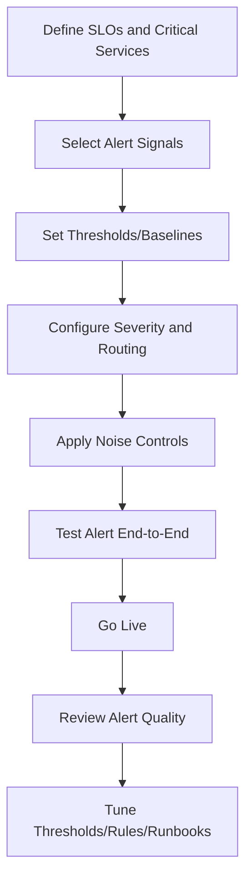
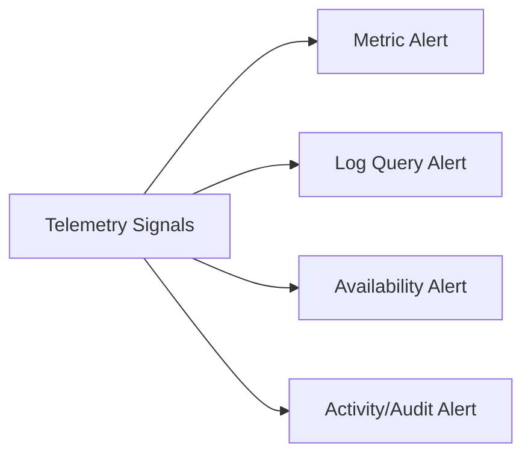
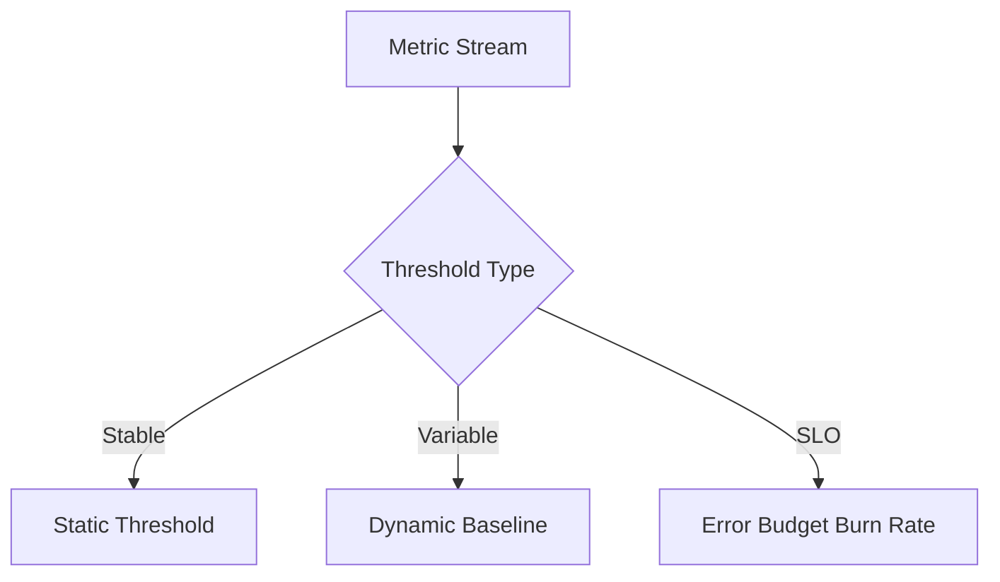
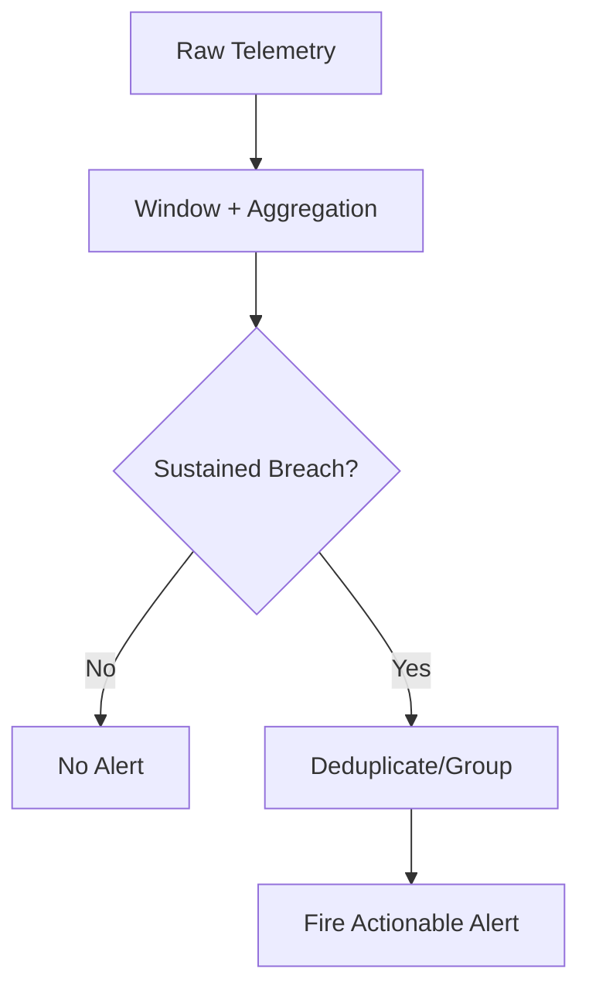
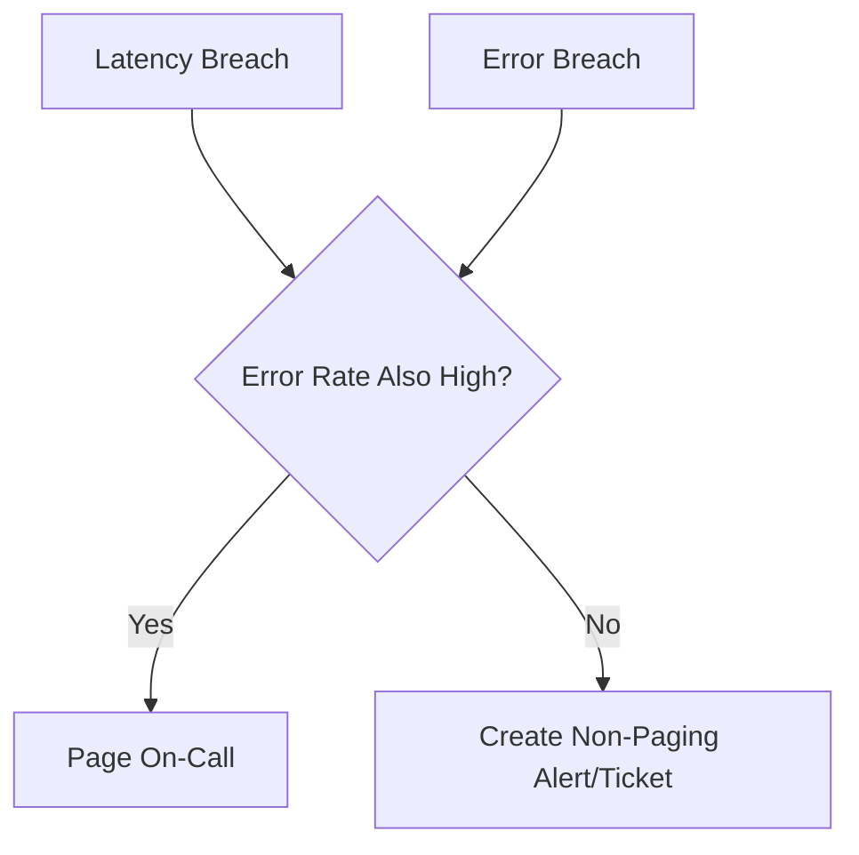
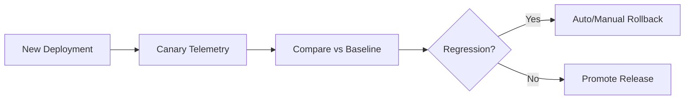
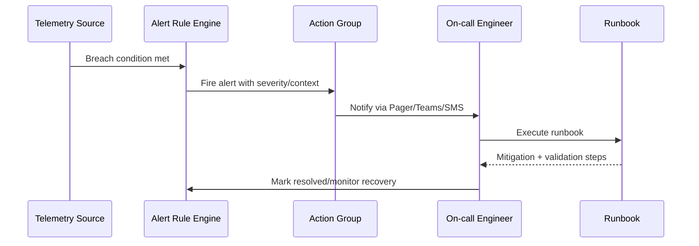

# How Do You Configure Alerts?
## Detailed Interview Preparation Guide with Flow Charts (Static Site Ready)

---

## 1) Direct Interview Answer

I configure alerts using an **SLO-driven, action-oriented model**:

1. Define what must be protected (user journeys, APIs, dependencies, infra)
2. Choose alert signal type (metric, log, trace/event, availability, activity)
3. Set meaningful thresholds/baselines tied to impact
4. Assign severity and routing (action groups / on-call ownership)
5. Add noise controls (aggregation, suppression, deduplication)
6. Test alert firing and response runbook
7. Continuously tune based on false positives/negatives

> One-liner: *Good alerts are actionable, owned, low-noise, and tied to user impact.*

---

## 2) Alerting Lifecycle Flow

---

## 3) Start with SLOs (Not Raw Metrics)

Alerting should protect:
- Availability SLO
- Latency SLO
- Error budget burn
- Critical business transaction success

If alert doesn’t drive action, don’t page on it.

---

## 4) Alert Types You Typically Configure

1. **Metric alerts** (fast threshold detection)
2. **Log query alerts** (pattern/correlation detection)
3. **Availability alerts** (synthetic checks failed)
4. **Activity/audit alerts** (configuration/security events)
5. **Trace/error alerts** (exception bursts/dependency failures)

---

## 5) Alert Design Framework (Interview Gold)

For each alert define:

- **What** failed (symptom)
- **Why it matters** (impact)
- **Who owns it** (team/on-call)
- **How to respond** (runbook link)
- **When to escalate** (SLA for response)

Alert payload should include:
- service
- environment
- severity
- impacted region
- current vs threshold
- dashboard/runbook links
- recent deployment context

---

## 6) Threshold Strategy

## Static Thresholds
Good for stable metrics (e.g., disk > 90%).

## Dynamic/Baseline Thresholds
Good for cyclical patterns (traffic/time-of-day variability).

## Multi-window Burn-rate
Best for SLO-based alerting (fast + slow burn detection).

---

## 7) Severity Mapping Model (Example)

| Severity | Trigger Pattern | Response Target |
|---|---|---|
| Sev0 | Full outage / data risk | Immediate incident |
| Sev1 | Major customer impact | Rapid on-call response |
| Sev2 | Partial degradation | Prioritized investigation |
| Sev3 | Non-urgent anomaly | Backlog / business hours |

Use severity for routing + escalation policy.

---

## 8) Noise Reduction Controls

To reduce alert fatigue:

- Evaluation windows (avoid one-point spikes)
- Aggregation functions (avg/p95/count)
- Consecutive breach requirement
- Suppression/cooldown windows
- Dedup/grouping by incident key
- Dependency-aware correlation

---

## 9) Routing and Escalation

Use action groups/escalation chains:

1. Primary on-call
2. Secondary on-call
3. Incident channel/team lead
4. Management escalation (time-bound)

Also route by:
- service ownership
- environment
- geography/region
- business criticality

---

## 10) Runbook-Driven Alerts

Each high-severity alert should include:
- Immediate triage steps
- Known failure modes
- Rollback/mitigation options
- Validation commands/queries
- Escalation contacts

No runbook = slower MTTR.

---

## 11) Recommended Alert Set (Baseline)

## Application Alerts
- 5xx error rate spike
- p95 latency above SLO
- dependency timeout/failure rate
- exception burst (new signature)

## Platform Alerts
- CPU/memory saturation
- pod restart/crash loop
- node not ready
- queue lag growth
- storage/network critical thresholds

## Security/Change Alerts
- auth failure anomaly
- privileged role change
- unexpected config drift
- certificate nearing expiry

---

## 12) Multi-Signal Correlation Pattern

Avoid paging on weak single signal where possible.
Example: page only if latency high **and** error rate elevated.

---

## 13) Canary and Deployment Alerts

During rollout, add temporary high-sensitivity alerts:

- canary error differential vs baseline
- latency regression threshold
- rollback trigger conditions

---

## 14) Testing Alerts (Often Missed)

Test every alert:

1. Simulate breach condition
2. Confirm alert fires
3. Validate routing path
4. Validate runbook usability
5. Confirm auto-remediation safety
6. Capture MTTA/MTTR impact

No test = unreliable alert system.

---

## 15) Alert KPIs to Track

- MTTA (Mean Time to Acknowledge)
- MTTR (Mean Time to Resolve)
- False positive rate
- False negative rate
- Alerts per service per week
- % alerts with runbooks
- % alerts auto-resolved/no-action

---

## 16) Anti-Patterns (Interview Gold)

1. Alerting on every metric
2. No ownership mapping
3. Thresholds copied without context
4. High-noise paging on low-impact issues
5. Missing dedup/suppression
6. No runbook links
7. Ignoring business impact
8. Never tuning old alerts

---

## 17) Example Alert Configuration Thinking (Practical)

Scenario: Checkout API

- Metric: 5xx rate
- Condition: >2% for 10 min
- Severity: Sev1 (prod only)
- Routing: commerce on-call
- Enrichment: deployment version + region
- Runbook: rollback + dependency triage steps
- Suppression: 20 min after trigger
- Recovery notification: enabled

---

## 18) End-to-End Operational Flow

---

## 19) Interview Q&A (Strong Answers)

### Q1: What makes an alert “good”?
**Answer:** It is actionable, tied to customer impact, owned by a team, and includes a clear response path.

### Q2: How do you reduce alert fatigue?
**Answer:** Use aggregation windows, deduplication, suppression, severity routing, and regular tuning of noisy rules.

### Q3: Static or dynamic thresholds?
**Answer:** Static for stable signals; dynamic for cyclical/seasonal behavior; SLO burn-rate for reliability-critical services.

### Q4: What should trigger paging?
**Answer:** Only high-confidence, high-impact conditions that require immediate human action.

### Q5: How do you validate new alerts?
**Answer:** Simulate breaches, verify notification path, run runbook, and measure response effectiveness.

### Q6: How often should alerts be reviewed?
**Answer:** Regularly (e.g., monthly/after incidents) and immediately after false positive/negative events.

---

## 20) 60-Second Interview Pitch

> I configure alerts from an SLO-first perspective, focusing on user-impacting symptoms like error rate, latency, availability, and dependency health. I choose the right signal type—metric, log, availability, or activity—and set thresholds using static, dynamic, or burn-rate models depending on behavior. Each alert has clear severity, ownership, routing, and runbook links. To avoid alert fatigue, I apply aggregation windows, deduplication, and suppression policies, and I page only on actionable high-impact conditions. I test alerts end-to-end, track MTTA/MTTR and false-positive rates, and continuously tune based on incident feedback.

---

## 21) Final Checklist

- [ ] SLO-aligned alert objectives defined
- [ ] Correct signal type selected
- [ ] Threshold strategy documented
- [ ] Severity and ownership assigned
- [ ] Routing/escalation path configured
- [ ] Noise controls enabled
- [ ] Runbook attached
- [ ] Alert tested end-to-end
- [ ] KPI tracking for alert quality enabled
- [ ] Regular tuning cadence established

---

## One-Line Conclusion

> Configure alerts as actionable, low-noise, SLO-aligned detection rules with clear ownership, tested routing, and continuous tuning.