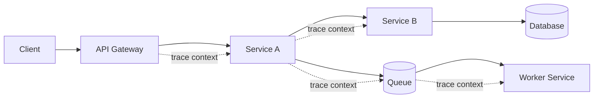
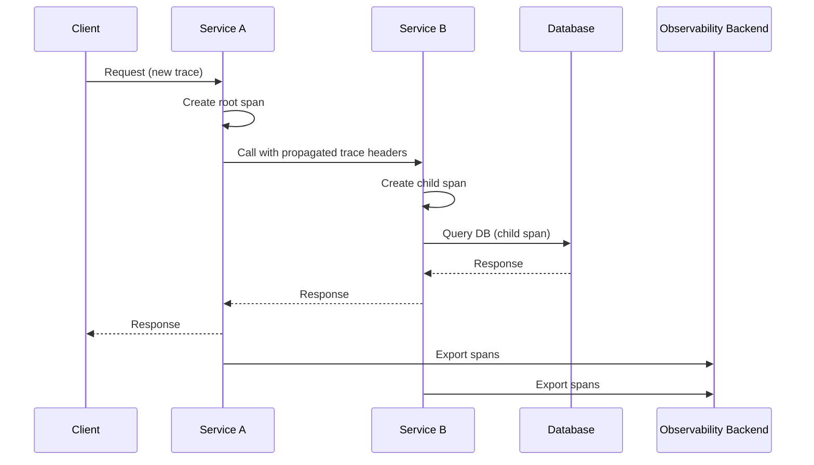
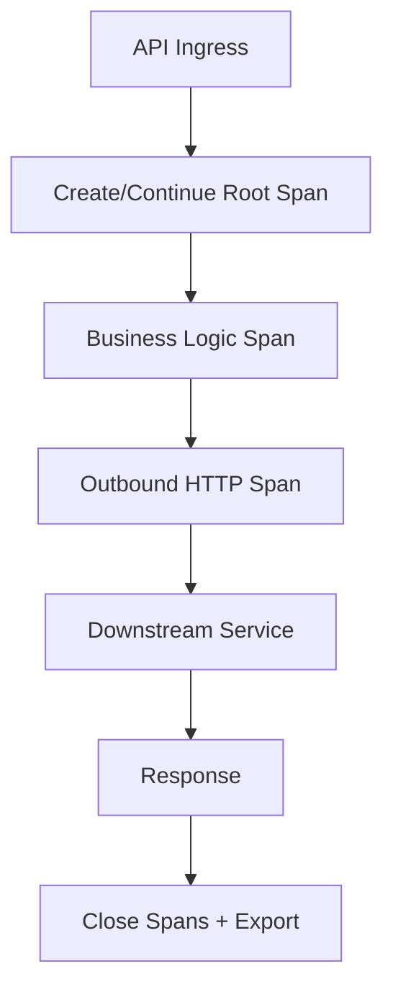
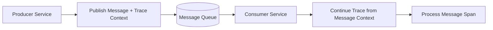
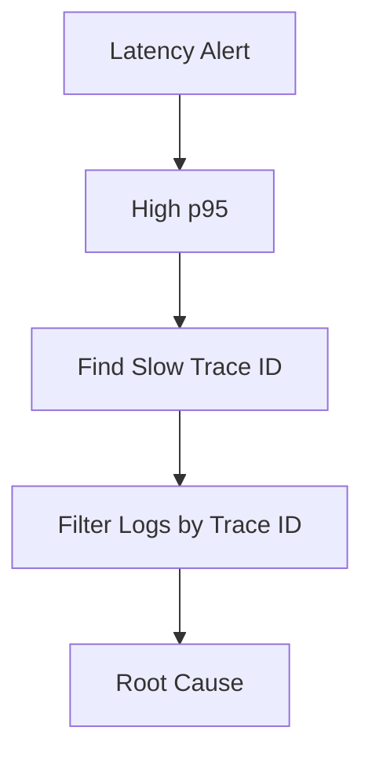
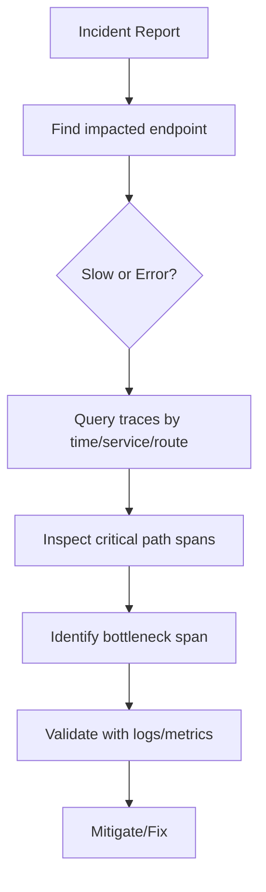

# How Do You Trace a Request Across Microservices?
## Detailed Interview Preparation Guide with Flow Charts (Static Site Ready)

---

## 1) Direct Interview Answer

You trace a request across microservices using **distributed tracing** with a shared **trace context** (Trace ID + Span ID) propagated across every service hop (HTTP, gRPC, messaging), then visualized in an observability platform (e.g., Application Insights/Jaeger/Zipkin/Grafana Tempo).

Core steps:

1. Instrument each service (OpenTelemetry recommended)
2. Generate trace/span at ingress
3. Propagate context downstream
4. Emit spans for app logic + dependencies
5. Collect and export traces centrally
6. Query by trace ID to reconstruct end-to-end path

> One-liner: *Use OpenTelemetry instrumentation + context propagation + centralized trace backend to follow a request hop-by-hop.*

---

## 2) End-to-End Tracing Flow

Every hop logs/exports spans with the same **Trace ID**.

---

## 3) Core Concepts You Must Explain in Interviews

## 3.1 Trace
Represents one end-to-end transaction (e.g., `POST /checkout`).

## 3.2 Span
A timed unit of work within a trace (e.g., “call payment API”).

## 3.3 Trace ID
Global identifier shared by all spans in a request path.

## 3.4 Span ID
Identifier for one span.

## 3.5 Parent Span ID
Links child spans to parent spans to form the call tree.

## 3.6 Context Propagation
Passing trace metadata via headers/metadata/message attributes.

---

## 4) Distributed Trace Lifecycle

---

## 5) Trace Context Propagation Standards

Use **W3C Trace Context** (commonly):
- `traceparent`
- `tracestate`

For messaging/event systems, propagate context in message headers/properties.

Without propagation, traces break into disconnected fragments.

---

## 6) What to Instrument

At minimum:

- Ingress endpoints (HTTP/gRPC)
- Outbound dependency calls
- DB queries
- Cache calls
- Queue publish/consume
- External API calls
- Critical internal operations

Add attributes:
- service name
- environment
- version
- region
- endpoint/operation
- error status

---

## 7) HTTP Request Tracing Pattern

---

## 8) Async / Queue Tracing Pattern

Interview tip:
> Async boundaries need explicit context propagation, otherwise root-cause chains are lost.

---

## 9) Practical Steps to Implement (Platform-Agnostic)

1. Adopt OpenTelemetry SDK/auto-instrumentation
2. Set canonical service names
3. Enable inbound/outbound auto instrumentation
4. Add manual spans around important business steps
5. Propagate context in HTTP/gRPC/message middleware
6. Export to tracing backend
7. Build trace query workflows and alerts

---

## 10) Sampling Strategy (Important)

Full tracing at scale can be expensive.

Use:
- head sampling (fixed/probabilistic)
- tail sampling (keep slow/error traces)
- route/service-specific policies

Best practice:
- keep 100% of error traces
- keep higher sample rate for critical endpoints
- lower sample rate for noisy healthy traffic

---

## 11) Correlating Traces with Logs and Metrics

Add `trace_id` and `span_id` into logs so operators can jump:

- Alert -> metric anomaly
- Metric anomaly -> trace
- Trace -> exact logs and exceptions

---

## 12) Example Trace Breakdown (Interview Narrative)

Request: `POST /orders`

Trace tree:
- Span A: API Gateway (120 ms)
  - Span B: Orders Service (95 ms)
    - Span C: Inventory Service (20 ms)
    - Span D: Payment Service (60 ms)
      - Span E: Payment DB query (45 ms)

Conclusion: Payment DB dominates latency.

---

## 13) Common Failure Patterns Found by Tracing

- N+1 downstream calls
- Retry storms
- Slow DB queries
- Fan-out bottlenecks
- Queue consumer lag
- Serialization overhead
- Cross-region dependency calls
- Misconfigured timeouts

---

## 14) Security & Privacy in Tracing

Do not record sensitive payloads blindly:
- redact tokens/passwords/PII
- avoid full body capture unless required and controlled
- protect telemetry backends with RBAC
- define retention boundaries

---

## 15) Kubernetes/Microservices Tracing in Practice

For AKS/K8s:
- instrument each pod/service
- inject env config for exporter endpoint
- include pod/namespace/cluster attributes
- correlate ingress controller trace with app traces

---

## 16) Troubleshooting Workflow Using Traces

---

## 17) Interview Q&A (Strong Answers)

### Q1: What is distributed tracing?
**Answer:** It’s a method to track a single request across multiple services by linking spans with a shared trace context.

### Q2: What identifiers are essential?
**Answer:** Trace ID, Span ID, and Parent Span ID.

### Q3: How is context propagated?
**Answer:** Through standard headers (e.g., W3C trace context) or message metadata across async systems.

### Q4: Why do traces break?
**Answer:** Missing propagation, inconsistent instrumentation, or unsupported middleware/protocol hops.

### Q5: How do you find bottlenecks?
**Answer:** Inspect span durations in the trace waterfall/call tree and validate with logs and dependency metrics.

### Q6: How do you manage tracing cost?
**Answer:** Sampling strategy, selective instrumentation, retention controls, and keeping full fidelity for errors.

---

## 18) 60-Second Interview Pitch

> I trace requests across microservices using distributed tracing with OpenTelemetry. At ingress, a trace is started or continued, and each service creates spans for inbound handling, business logic, and downstream calls like databases, caches, queues, and external APIs. I propagate context using W3C trace headers for sync calls and message metadata for async flows. All spans are exported to a centralized backend, where I can reconstruct the full request path using trace ID, identify the slowest or failing span, and correlate with logs and metrics for root-cause analysis. I also enforce consistent service naming, add deployment metadata, and use sampling policies that preserve error and high-latency traces.

---

## 19) Final Checklist

- [ ] OpenTelemetry instrumentation enabled
- [ ] Trace context propagation implemented (sync + async)
- [ ] Service naming standardized
- [ ] Dependency spans captured
- [ ] Logs include trace_id/span_id
- [ ] Trace backend configured
- [ ] Sampling policy defined
- [ ] Dashboards and query playbooks ready
- [ ] PII redaction controls applied

---

## One-Line Conclusion

> Trace requests across microservices by propagating a shared trace context and collecting spans from every hop into a centralized distributed tracing backend.