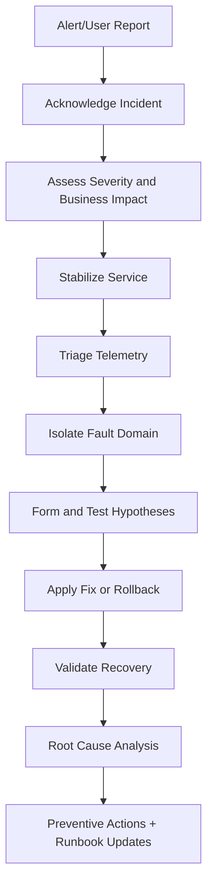
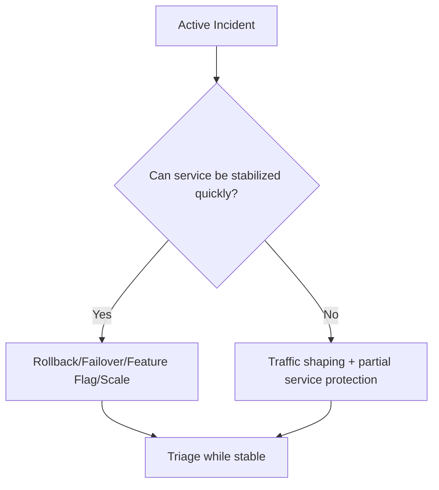
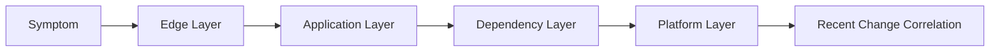
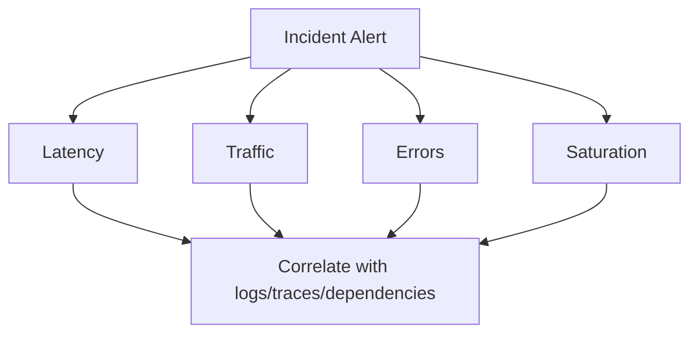
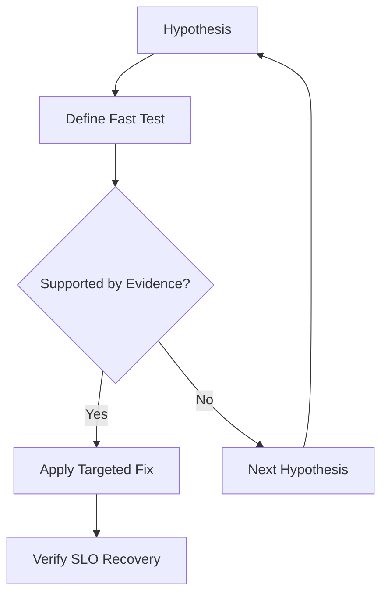
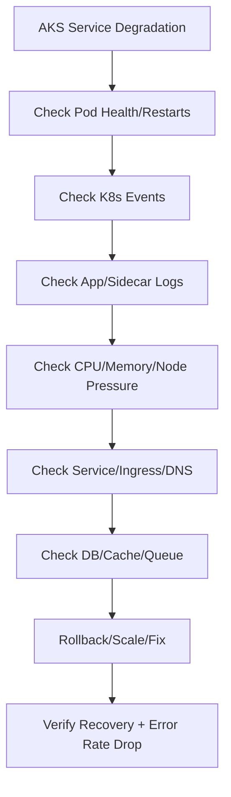
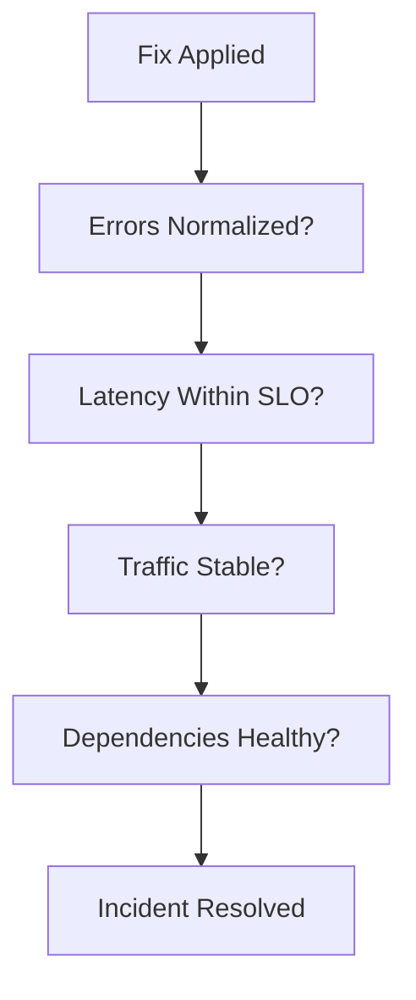

# How Do You Troubleshoot Production Issues?
## Detailed Interview Preparation Guide with Flow Charts (Static Site Ready)

---

## 1) Direct Interview Answer

I troubleshoot production issues using a **structured incident-response workflow**:

1. Detect and acknowledge incident
2. Assess impact and severity
3. Stabilize service quickly (mitigation first)
4. Triage using telemetry (metrics, logs, traces)
5. Isolate likely fault domain
6. Validate hypotheses with evidence
7. Apply safe fix or rollback
8. Verify recovery with SLO indicators
9. Perform root cause analysis (RCA)
10. Implement preventive actions

> One-liner: *Mitigate first, diagnose with evidence, recover safely, then prevent recurrence.*

---

## 2) End-to-End Incident Flow

---

## 3) Core Troubleshooting Principles (Interview Gold)

- **User impact first** (availability, errors, latency)
- **Mitigation over perfection** during active outage
- **Evidence over assumptions**
- **One change at a time** in high-risk incidents
- **Clear incident command and communication**
- **Time-bounded hypothesis testing**
- **Blameless postmortem culture**

---

## 4) Severity Classification Model (Example)

| Severity | Typical Impact | Response Expectation |
|---|---|---|
| Sev0 | Complete outage / critical data risk | Immediate all-hands |
| Sev1 | Major feature unavailable | Rapid response, frequent updates |
| Sev2 | Partial degradation / workaround exists | Priority troubleshooting |
| Sev3 | Minor issue / low business impact | Scheduled remediation |

Define severity from **business impact**, not just technical complexity.

---

## 5) Stabilization First (Containment)

Before deep debugging:

- Fail over if available
- Roll back risky recent release
- Scale out critical tier
- Disable problematic feature flag
- Throttle heavy traffic path
- Bypass non-critical dependency
- Drain unhealthy nodes/pods
- Activate degraded mode

---

## 6) Fault Domain Isolation Framework

Check in this order:

1. **Client/edge** (DNS/CDN/WAF/Ingress)
2. **Application** (exceptions, thread pool, memory, config)
3. **Dependency** (DB/cache/queue/external APIs)
4. **Platform** (Kubernetes/VM/network/storage/identity)
5. **Recent changes** (deploy, config, secrets, certs, scaling policy)

---

## 7) Golden Signals Triage

Start with:

- **Latency**
- **Traffic**
- **Errors**
- **Saturation**

---

## 8) Telemetry-Driven Diagnosis

Use three pillars together:

1. **Metrics** for trend and blast radius
2. **Logs** for exact failures
3. **Traces** for request path and bottlenecks

Avoid diagnosing from one signal alone.

---

## 9) Change-Correlation Checklist

Immediately check events in the last 30–60 minutes:

- Application deployment
- Config change
- Feature flag change
- Secret/certificate rotation
- Infra scaling/event
- Dependency release/change
- DNS/network policy change

If incident aligns with a change window, rollback candidate is strong.

---

## 10) Hypothesis Testing Loop

Example hypotheses:
- DB connection pool exhausted
- Cache cluster unavailable
- New release introduces memory leak
- Queue backlog causing timeout cascade

---

## 11) Rollback vs Forward-Fix Decision

Rollback when:
- Strong correlation to recent release
- Safe known-good version available
- Fastest path to recovery

Forward-fix when:
- Rollback risk is high (schema incompatibility)
- Issue isolated to config/toggle
- Small targeted hotfix is safer

---

## 12) Production Troubleshooting in AKS (Practical Flow)

Key checks:
- `CrashLoopBackOff`, `ImagePullBackOff`, `Pending`
- Readiness/liveness probe failures
- Node pressure/evictions
- HPA/cluster autoscaler behavior
- Ingress 5xx patterns

---

## 13) Common Production Issue Patterns

1. **Latency spike**
   - Dependency slowdown
   - Thread pool starvation
   - Lock contention
   - GC pressure

2. **Error spike**
   - Bad deployment/config
   - Expired secrets/certs
   - Auth/identity failure
   - External API outage

3. **Traffic drop**
   - DNS/routing issue
   - Edge/WAF block
   - Regional incident

4. **Resource saturation**
   - Memory leak
   - CPU hotspot
   - Queue backlog growth
   - Insufficient autoscaling limits

---

## 14) Communication During Incident

Use a strict cadence:

- Incident channel established
- Incident commander assigned
- Stakeholder updates every fixed interval
- “Known / unknown / next update time” format
- Decision log maintained (who/what/why/when)

---

## 15) Validation of Recovery

Do not close incident on “looks better.”

Validate:

- Error rate normalized
- Latency back within SLO
- Throughput recovered
- Queue backlog draining
- No recurring alerts
- Customer impact ended

---

## 16) Root Cause Analysis (RCA) Structure

Use a blameless template:

1. Timeline (UTC)
2. Customer impact
3. Detection method and delay
4. Technical root cause
5. Contributing factors
6. What mitigated impact
7. What failed in detection/guardrails
8. Corrective actions (owner + due date)

---

## 17) Corrective/Preventive Actions (CAPA)

Examples:

- Add missing alert on early symptom
- Tighten canary gates
- Add circuit breaker/timeouts
- Improve rollback automation
- Add load test for bottleneck path
- Add dashboard for dependency saturation
- Update runbook and on-call training

---

## 18) Production Readiness Controls That Reduce Incidents

- Health probes and graceful shutdown
- Timeout/retry/circuit-breaker policies
- Bulkheads and rate limits
- Feature flags
- Progressive delivery (canary/blue-green)
- SLO-based alerting
- Chaos/failure drills
- Verified backup and restore

---

## 19) Troubleshooting Command/Tool Mindset (Generic)

Always gather:

- What changed?
- What failed first?
- What is the current blast radius?
- What is the fastest safe mitigation?
- What evidence confirms root cause?

---

## 20) Interview Q&A (Strong Answers)

### Q1: What is your first step in a production incident?
**Answer:** Acknowledge, assess customer impact and severity, then stabilize service before deep diagnosis.

### Q2: Mitigation or RCA first?
**Answer:** Mitigation first during active impact; deep RCA after stability is restored.

### Q3: How do you avoid guesswork?
**Answer:** Use a hypothesis-evidence loop with metrics, logs, traces, and change correlation.

### Q4: Rollback or hotfix?
**Answer:** Roll back when recent change correlation is strong and rollback is safe/fast; otherwise targeted forward-fix.

### Q5: How do you confirm resolution?
**Answer:** Validate SLO recovery (errors, latency, throughput, backlog) and watch for recurrence window.

### Q6: What makes a good postmortem?
**Answer:** Blameless, evidence-based timeline, clear root cause, and tracked preventive actions with owners/dates.

---

## 21) 60-Second Interview Pitch

> I troubleshoot production issues with a disciplined incident process: detect, assess impact, and stabilize quickly using rollback, failover, scaling, or feature flags. Then I triage using golden signals and correlate metrics, logs, traces, and recent change events to isolate the fault domain. I run time-boxed hypothesis tests, apply the safest high-confidence fix, and verify recovery against SLOs—not intuition. After restoration, I conduct a blameless RCA with a precise timeline, root cause, contributing factors, and concrete preventive actions such as new alerts, better canary checks, or resilience improvements. This approach minimizes customer impact and continuously improves system reliability.

---

## 22) Final Checklist

- [ ] Incident acknowledged with clear severity
- [ ] Customer impact understood
- [ ] Fast mitigation applied (if possible)
- [ ] Golden signals reviewed
- [ ] Change correlation checked
- [ ] Fault domain isolated
- [ ] Hypotheses tested with evidence
- [ ] Safe fix/rollback executed
- [ ] SLO-based recovery validated
- [ ] Blameless RCA completed
- [ ] Preventive actions tracked to closure

---

## One-Line Conclusion

> Effective production troubleshooting is a mitigation-first, evidence-driven, repeatable process that restores service fast and prevents recurrence.