# What Is Application Insights?
## Detailed Azure Interview Preparation Guide with Flow Charts

---

## 1. Direct Interview Answer

**Azure Application Insights is an Application Performance Monitoring (APM) and observability service within Azure Monitor.**

It helps teams monitor and troubleshoot applications by collecting telemetry such as:

- HTTP requests
- Response times
- Failed requests
- Exceptions
- Dependency calls
- Application logs
- Distributed traces
- Custom metrics
- Availability test results
- User activity
- Live application performance

Application Insights helps answer questions such as:

- Is the application available?
- Which requests are slow?
- Which dependency is failing?
- Why are users receiving errors?
- Which service caused a distributed transaction to fail?
- Is performance degrading after a deployment?
- Which endpoint has the highest latency?
- Is the issue in the application, database, cache, queue, or external API?

> **One-line interview answer:**  
> **Application Insights is Azure Monitor's application-performance and observability service that collects telemetry, correlates requests and dependencies, detects failures, and helps diagnose application health and performance.**

---

## 2. What Problem Does Application Insights Solve?

Without centralized application monitoring, teams may need to investigate:

- Server logs
- Container logs
- Load-balancer logs
- Database logs
- Application logs
- Infrastructure metrics
- User complaints

This makes it difficult to identify the real root cause.

Application Insights correlates telemetry from multiple parts of an application into a single observability experience.

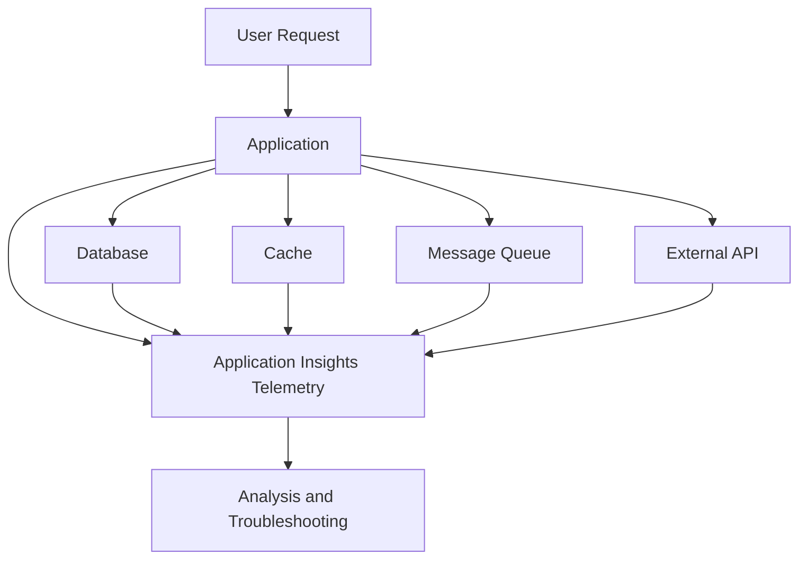

---

## 3. Application Insights in Azure Monitor

Application Insights is part of the broader Azure Monitor platform.

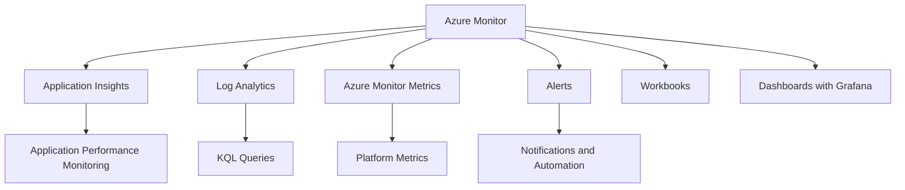

### Azure Monitor

Azure Monitor provides monitoring for:

- Applications
- Virtual machines
- Containers
- AKS
- Databases
- Networks
- Storage
- Azure resources

### Application Insights

Application Insights focuses primarily on application behavior and application telemetry.

### Log Analytics

Log Analytics provides centralized log storage and Kusto Query Language (KQL) analysis for workspace-based monitoring data.

---

## 4. High-Level Application Insights Architecture

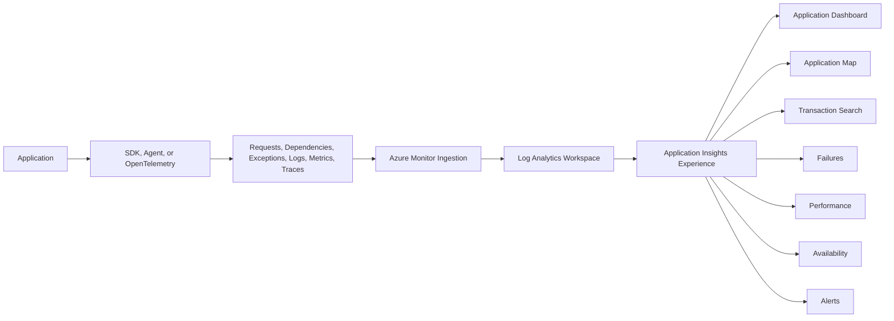

For current workspace-based Application Insights resources, telemetry is integrated with a Log Analytics workspace, which provides centralized storage, KQL queries, and Azure RBAC capabilities. ([learn.microsoft.com](https://learn.microsoft.com/en-us/azure/azure-monitor/app/create-workspace-resource?trk=article-ssr-frontend-pulse_little-text-block&utm_source=openai))

---

## 5. What Does Application Insights Collect?

Application Insights can collect several telemetry categories.

### 5.1 Requests

Represents incoming operations such as:

- HTTP requests
- API calls
- Web requests
- Function invocations
- Server-side operations

Typical request data includes:

- URL or route
- HTTP method
- Response code
- Duration
- Success or failure
- Operation ID
- Cloud role
- Client information

---

### 5.2 Dependencies

Represents calls made by the application to other systems.

Examples:

- SQL Database
- Cosmos DB
- Redis
- Storage
- Service Bus
- HTTP APIs
- DNS
- File systems

Dependency telemetry helps identify whether an application is slow because of its own code or because a downstream service is slow.

---

### 5.3 Exceptions

Application Insights records unhandled or tracked exceptions.

Useful information includes:

- Exception type
- Exception message
- Stack trace
- Request that caused the exception
- Dependency calls associated with the failure
- Server and application version

---

### 5.4 Logs and Traces

Applications can send diagnostic logs and structured trace data.

Examples:

- Information logs
- Warning logs
- Error logs
- Debug traces
- Business events
- Correlation identifiers

---

### 5.5 Metrics

Metrics are numeric measurements collected over time.

Examples:

- Request rate
- Failure rate
- Response duration
- CPU usage
- Memory usage
- Dependency duration
- Queue length
- Active users
- Custom business metrics

---

### 5.6 Availability Tests

Availability tests send requests to an endpoint at regular intervals to validate:

- Reachability
- Response code
- Response time
- TLS certificate validity
- Endpoint behavior

Application Insights supports Standard availability tests for current availability monitoring. ([learn.microsoft.com](https://learn.microsoft.com/en-gb/azure/azure-monitor/app/availability?utm_source=openai))

---

### 5.7 User and Usage Telemetry

Depending on the application type and instrumentation, Application Insights can help analyze:

- Users
- Sessions
- Page views
- Browser performance
- User flows
- Application usage
- Client-side failures

---

## 6. Application Insights Telemetry Flow

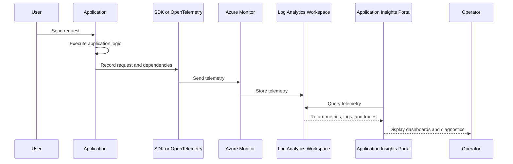

---

## 7. Request and Dependency Correlation

One of the most important Application Insights capabilities is telemetry correlation.

Example request:

```text
User request
  ├── API request
  ├── SQL query
  ├── Redis call
  ├── Service Bus operation
  └── External payment API
```

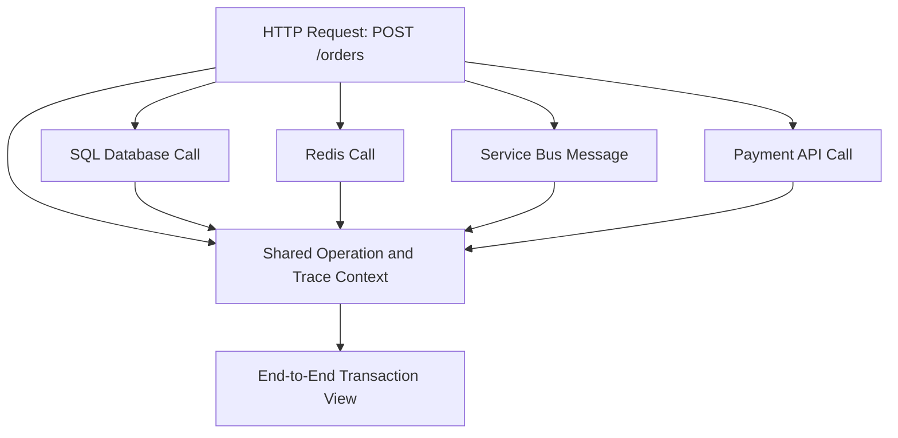

Correlation helps answer:

- Which dependency caused the delay?
- Which external API caused the error?
- Did the database call fail before the request failed?
- Which service handled a specific user transaction?
- Where did latency accumulate?

---

## 8. Distributed Tracing Flow

In a microservices architecture, one user request may cross multiple services.

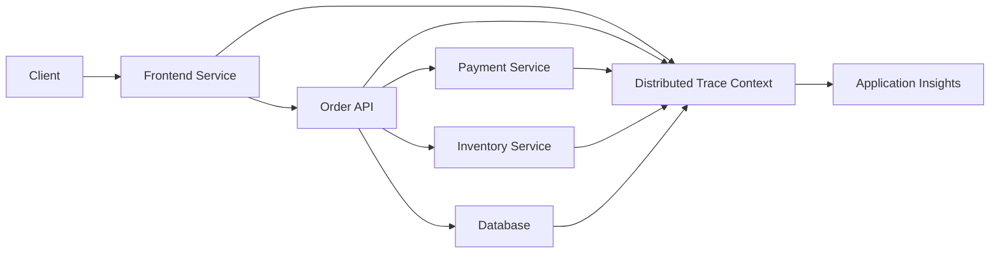

Distributed tracing uses trace context to connect spans across services.

A trace may show:

```text
Trace: Create Order
  ├── Frontend request: 120 ms
  ├── Order API: 100 ms
  ├── Inventory service: 20 ms
  ├── Payment service: 65 ms
  └── Database: 10 ms
```

---

## 9. Application Map

The Application Map provides a visual view of application components and dependencies.

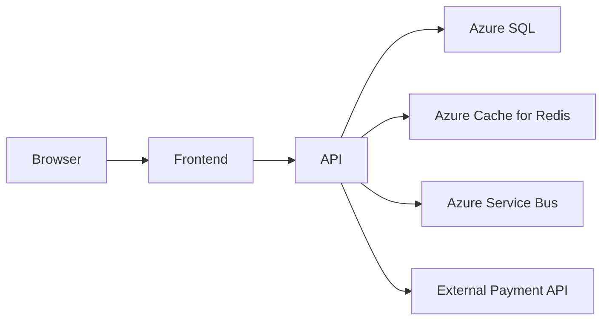

The map helps identify:

- Service relationships
- Failed components
- Slow dependencies
- Error hotspots
- Application topology
- Dependency health

Application Insights provides an Application Map experience for understanding application architecture and component interactions. ([learn.microsoft.com](https://learn.microsoft.com/en-us/azure/azure-monitor/app/app-insights-overview?WT.mc_id=dotnet-00000-cephilli&utm_source=openai))

---

## 10. Application Insights Main Experiences

Application Insights provides several investigation and monitoring experiences.

### Application Dashboard

Provides an overview of application health and performance.

### Application Map

Visualizes services and dependencies.

### Live Metrics

Shows near-real-time application activity and performance.

### Search

Helps investigate individual requests, traces, exceptions, and events.

### Failures

Shows failed requests, exceptions, and dependency failures.

### Performance

Shows slow operations, dependencies, and response times.

### Availability

Monitors endpoint availability and responsiveness.

### Alerts

Notifies operators when defined conditions occur.

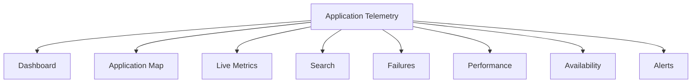

---

## 11. OpenTelemetry and Application Insights

OpenTelemetry is a vendor-neutral standard for collecting:

- Traces
- Metrics
- Logs

Current Azure guidance recommends the **Azure Monitor OpenTelemetry Distro** for new Application Insights projects in supported application environments. The distro combines OpenTelemetry components with Azure Monitor integrations such as sampling, Live Metrics, retries, offline storage, and Microsoft Entra authentication. ([learn.microsoft.com](https://learn.microsoft.com/en-us/azure/azure-monitor/app/application-insights-faq?utm_source=openai))

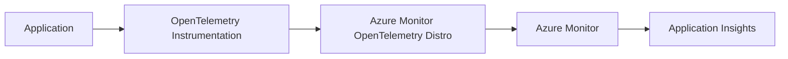

### Why OpenTelemetry?

- Vendor-neutral instrumentation
- Portable telemetry model
- Standard trace context
- Broad language ecosystem
- Easier multi-cloud observability strategy
- Better alignment with cloud-native applications

### Supported Application Environments

Azure Monitor OpenTelemetry support includes common environments such as:

- .NET
- ASP.NET Core
- Java
- Node.js
- Python

The exact feature availability differs by language and scenario, so verify the current support matrix before choosing an instrumentation path. ([learn.microsoft.com](https://learn.microsoft.com/azure/azure-monitor/app/opentelemetry-enable?tabs=java-native&utm_source=openai))

---

## 12. Instrumentation Options

An application can send telemetry using:

1. Azure Monitor OpenTelemetry Distro
2. Azure Monitor OpenTelemetry Exporter
3. Language-specific Application Insights SDKs
4. Java agent or automatic instrumentation
5. Manual custom telemetry
6. Azure platform integrations

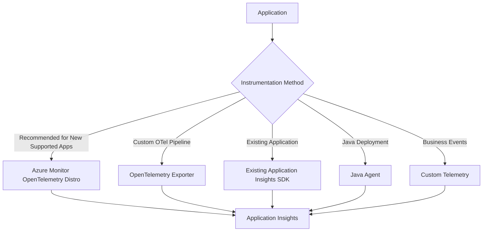

---

## 13. .NET Application Integration Example

Install the Azure Monitor OpenTelemetry package:

```bash
dotnet add package Azure.Monitor.OpenTelemetry.AspNetCore
```

Configure it in an ASP.NET Core application:

```csharp name=Program.cs
using Azure.Monitor.OpenTelemetry.AspNetCore;

var builder = WebApplication.CreateBuilder(args);

builder.Services.AddOpenTelemetry()
    .UseAzureMonitor(options =>
    {
        options.ConnectionString =
            builder.Configuration["APPLICATIONINSIGHTS_CONNECTION_STRING"];
    });

var app = builder.Build();

app.MapGet("/", () => "Hello from ASP.NET Core");

app.Run();
```

A production application should generally provide the connection string through secure configuration rather than hardcoding it in source code.

The current Microsoft setup guidance uses Azure Monitor OpenTelemetry packages for ASP.NET Core and other supported .NET scenarios. ([learn.microsoft.com](https://learn.microsoft.com/azure/azure-monitor/app/opentelemetry-enable?tabs=java-native&utm_source=openai))

---

## 14. Connection String

The connection string identifies the Application Insights resource to which telemetry is sent.

Example configuration:

```json name=appsettings.json
{
  "ApplicationInsights": {
    "ConnectionString": "InstrumentationKey=..."
  }
}
```

A safer deployment approach is to use an environment variable:

```bash
APPLICATIONINSIGHTS_CONNECTION_STRING="..."
```

In production:

- Do not commit connection strings to source control
- Use managed configuration
- Use Key Vault or a secure secret store where appropriate
- Restrict who can read the connection string
- Rotate or update configuration when required

> **Security note:**  
> A connection string is not normally an authorization credential for reading all telemetry, but it should still be protected because it identifies the telemetry destination and may be used for data submission.

---

## 15. Application Insights for AKS

Application Insights can monitor applications running in AKS.

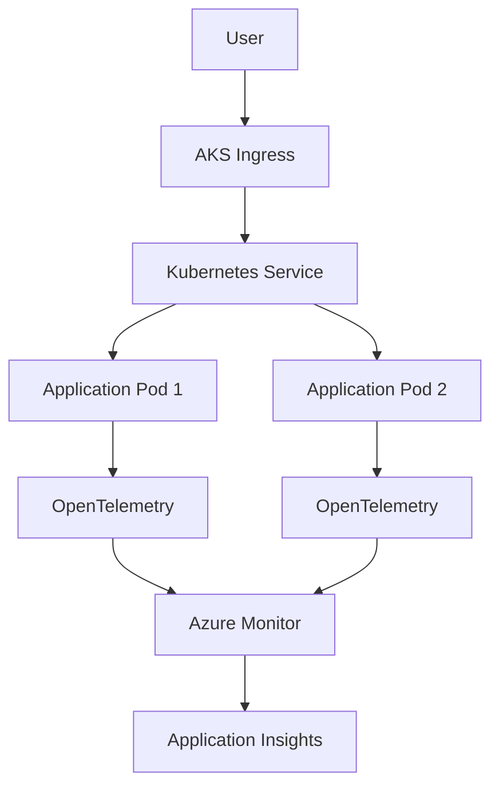

AKS application monitoring can collect:

- HTTP requests
- Exceptions
- Dependencies
- Container application logs
- Distributed traces
- Custom metrics
- Pod-level application telemetry

For cloud-native environments, teams can use OpenTelemetry SDKs, the Azure Monitor OpenTelemetry Distro, or Azure Monitor ingestion paths. Some native OTLP ingestion paths may be preview features, so production adoption should follow the current support status. ([learn.microsoft.com](https://learn.microsoft.com/en-us/azure/azure-monitor/containers/opentelemetry-options?utm_source=openai))

---

## 16. Application Insights for Azure App Service

App Service applications can be integrated with Application Insights to monitor:

- Requests
- Response times
- Exceptions
- Dependencies
- Availability
- Application logs
- Browser telemetry

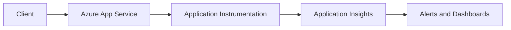

---

## 17. Application Insights for Azure Functions

Application Insights is commonly used to monitor Azure Functions.

It can help analyze:

- Function invocations
- Trigger failures
- Execution duration
- Exceptions
- Dependency calls
- Queue processing
- Retry behavior
- Dead-letter scenarios

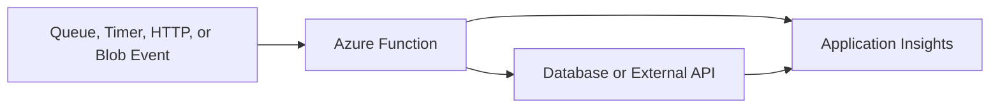

---

## 18. Logs, Metrics, and Traces

### Logs

Provide detailed diagnostic messages.

Examples:

- Application errors
- Warnings
- Business events
- Configuration messages

### Metrics

Provide numerical measurements over time.

Examples:

- Request count
- Error rate
- CPU usage
- Response duration

### Traces

Show work performed across components and services.

Examples:

- Incoming request span
- SQL span
- HTTP dependency span
- Queue-processing span

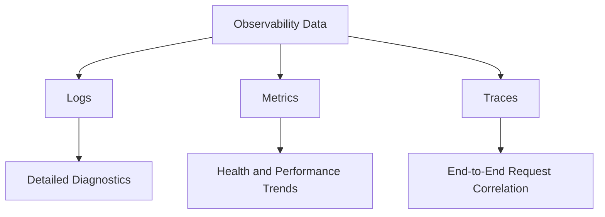

---

## 19. Custom Telemetry

Automatic instrumentation does not capture every business event.

Add custom telemetry for events such as:

- Order created
- Payment approved
- File uploaded
- User subscription started
- Report generated
- Inventory reservation failed

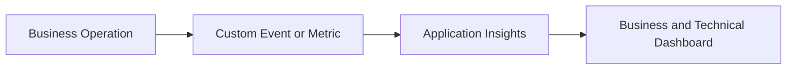

Examples of custom data:

```text
eventName = OrderCreated
orderId = order-123
customerType = enterprise
orderValue = 2500
```

Avoid sending sensitive personal data or secrets as telemetry properties.

---

## 20. Alerts

Application Insights can be used with Azure Monitor alerts.

Common alerts include:

- Request failure rate above threshold
- Response time above threshold
- Exception count increases
- Dependency failure rate increases
- Availability test fails
- No successful requests
- Queue processing latency increases
- Custom metric exceeds threshold

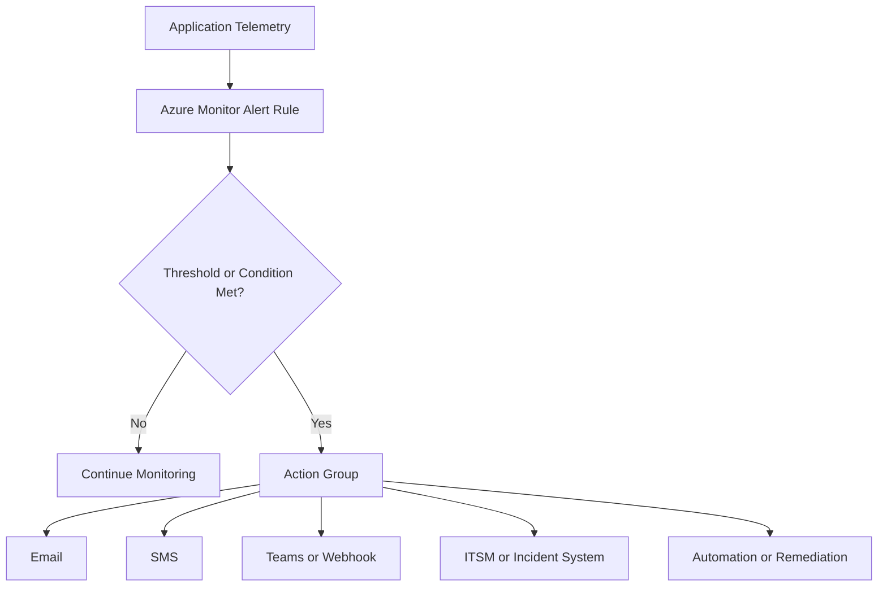

A good alert should be:

- Actionable
- Specific
- Based on a meaningful threshold
- Resistant to temporary noise
- Linked to a runbook
- Owned by a responsible team

---

## 21. Availability Monitoring

Availability tests periodically call application endpoints.

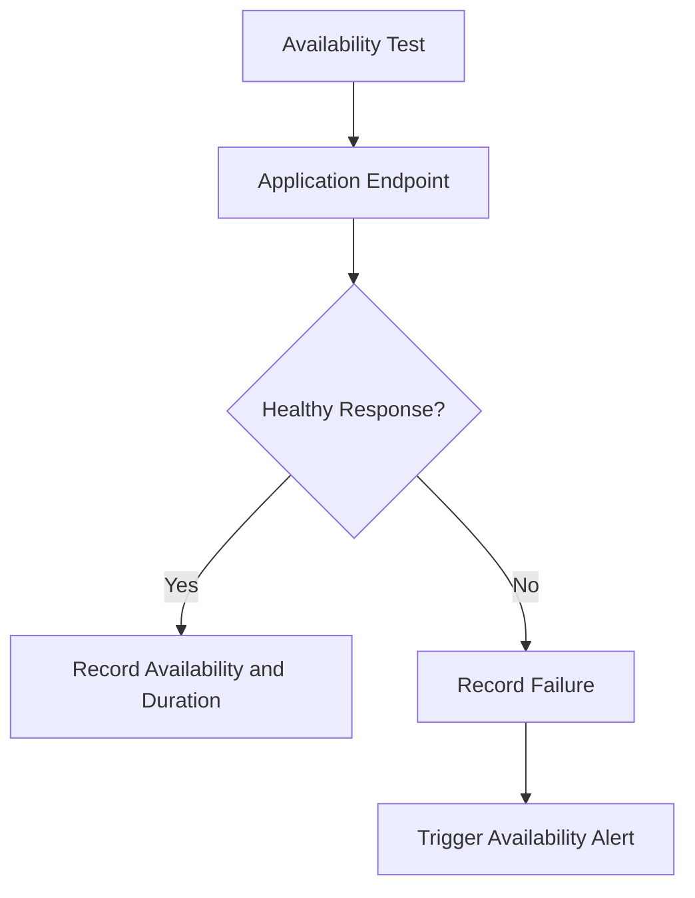

Test endpoints such as:

- Public website
- Login endpoint
- Health endpoint
- API endpoint
- Critical external dependency

Do not expose sensitive administrative endpoints only for monitoring. Use a secure health endpoint that validates the right dependencies without leaking confidential information.

---

## 22. Application Insights Querying with KQL

Workspace-based Application Insights data can be queried using Kusto Query Language (KQL).

### Find Recent Failed Requests

```kusto
requests
| where TimeGenerated > ago(1h)
| where success == false
| project TimeGenerated, name, resultCode, duration, operation_Id
| order by TimeGenerated desc
```

### Find Slow Requests

```kusto
requests
| where TimeGenerated > ago(1h)
| where duration > 1000
| project TimeGenerated, name, duration, url, operation_Id
| order by duration desc
```

### Find Failed Dependencies

```kusto
dependencies
| where TimeGenerated > ago(1h)
| where success == false
| project TimeGenerated, name, target, resultCode, duration, operation_Id
| order by TimeGenerated desc
```

### Find Exceptions

```kusto
exceptions
| where TimeGenerated > ago(1h)
| project TimeGenerated, type, outerMessage, problemId, operation_Id
| order by TimeGenerated desc
```

> **Interview point:**  
> Application Insights gives visual experiences, while KQL provides flexible investigation and correlation across telemetry.

---

## 23. Incident Investigation Flow

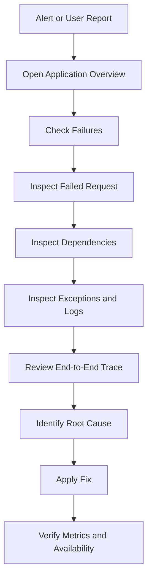

---

## 24. Example Incident

### Symptom

Users report that checkout requests are slow.

### Investigation

1. Open Application Insights Performance view
2. Find slow `POST /checkout` requests
3. Open a sample transaction
4. Observe payment dependency duration
5. Check dependency failure rate
6. Inspect exceptions from the payment client
7. Compare latency before and after deployment
8. Check external payment provider status
9. Add or adjust timeout and retry behavior
10. Verify recovery through metrics and availability tests

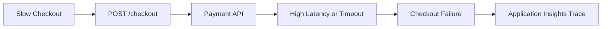

---

## 25. Sampling

High-volume applications can generate a large amount of telemetry.

Sampling reduces the amount of telemetry stored and transmitted while preserving useful diagnostic information.

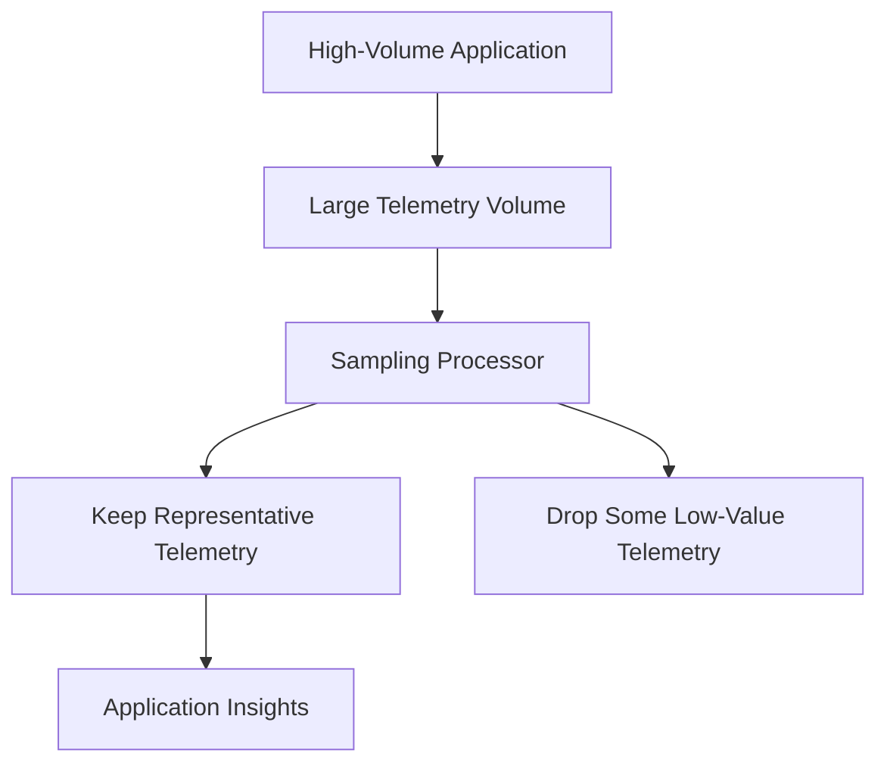

Sampling can help:

- Reduce ingestion volume
- Lower costs
- Reduce storage
- Reduce processing overhead
- Keep important failures and traces

Application Insights integrates sampling capabilities with OpenTelemetry. Sampling should be configured carefully so that related telemetry remains correlated and important failures are retained. ([learn.microsoft.com](https://learn.microsoft.com/en-us/azure/azure-monitor/app/opentelemetry-sampling?utm_source=openai))

### Sampling Warning

Do not sample away all:

- Exceptions
- Failed requests
- Security events
- Critical business events
- Rare but high-value transactions

---

## 26. Cost Management

Application Insights costs can be affected by:

- Telemetry ingestion
- Log Analytics workspace usage
- Data retention
- Custom logs
- High-cardinality properties
- Distributed traces
- Availability tests
- Sampling configuration
- Query and export patterns

```mermaid
flowchart TD
    Telemetry["Telemetry Volume"] --> Cost["Monitoring Cost"]
    Telemetry --> Sampling["Configure Sampling"]
    Sampling --> Filter["Remove Low-Value Data"]
    Filter --> Retention["Set Appropriate Retention"]
    Retention --> Review["Review Cost and Diagnostic Value"]
```

Cost optimization techniques:

- Configure sampling
- Avoid verbose logs in production
- Do not send duplicate telemetry
- Avoid high-cardinality dimensions
- Set retention intentionally
- Use daily caps carefully
- Monitor workspace ingestion
- Separate environments when necessary
- Review custom metrics and events

---

## 27. Security and Privacy

Application Insights telemetry may contain:

- URLs
- Request parameters
- Exception messages
- User identifiers
- Dependency information
- Custom properties
- Business data

Security practices:

- Do not log passwords, tokens, or connection strings
- Redact sensitive query parameters
- Avoid sending unnecessary personal data
- Use controlled access through Azure RBAC
- Apply workspace permissions
- Encrypt data appropriately
- Define retention policies
- Review cross-region data requirements
- Restrict diagnostic access

```mermaid
flowchart TD
    Application["Application"] --> Filter["Redact Sensitive Data"]
    Filter --> Telemetry["Telemetry"]
    Telemetry --> RBAC["Workspace and Application RBAC"]
    RBAC --> Storage["Protected Monitoring Data"]
    Storage --> Retention["Retention and Compliance"]
```

---

## 28. Cloud Role Name

When multiple services send telemetry to one Application Insights resource, set a clear cloud role name.

Example:

```text
frontend
orders-api
payment-service
inventory-service
```

```mermaid
flowchart LR
    Frontend["Frontend"] --> AppInsights["Application Insights"]
    Orders["Orders API"] --> AppInsights
    Payment["Payment Service"] --> AppInsights
    Inventory["Inventory Service"] --> AppInsights

    AppInsights --> Map["Correct Application Map and Service Roles"]
```

A clear cloud role name helps Application Insights identify separate services correctly in the Application Map and transaction views. Microsoft notes that multiple services sharing one resource should set Cloud Role Names appropriately. ([learn.microsoft.com](https://learn.microsoft.com/en-us/azure/azure-monitor/app/opentelemetry-enable?tabs=aspnetcore&utm_source=openai))

---

## 29. Application Insights and CI/CD

Use Application Insights during deployment validation.

```mermaid
flowchart LR
    Commit["Code Commit"] --> Build["Build and Test"]
    Build --> Deploy["Deploy New Version"]
    Deploy --> Smoke["Smoke Tests"]
    Smoke --> Telemetry["Application Insights Telemetry"]
    Telemetry --> Decision{"Healthy Metrics?"}

    Decision -- "Yes" --> Promote["Promote Release"]
    Decision -- "No" --> Rollback["Rollback or Stop Promotion"]
```

Monitor after deployment:

- Error rate
- Response time
- Dependency failures
- Exception rate
- Availability
- Request volume
- Resource pressure
- New error signatures

This supports:

- Deployment gates
- Canary releases
- Blue-green releases
- Automated rollback
- Post-deployment validation

---

## 30. Application Insights vs Log Analytics

| Feature | Application Insights | Log Analytics |
|---|---|---|
| Primary focus | Application performance and diagnostics | Centralized log and data analysis |
| Main users | Developers, SREs, application teams | Platform, security, operations teams |
| Application Map | Yes | No primary application map experience |
| Request/dependency correlation | Yes | Query-based analysis |
| KQL | Yes, through workspace data | Yes |
| Infrastructure data | Integrates with Azure Monitor | Strong |
| Alerts | Azure Monitor alerts | Azure Monitor alerts |
| Best use | APM and application troubleshooting | Centralized logs and cross-resource analysis |

In current workspace-based designs, Application Insights integrates with a Log Analytics workspace rather than operating as a completely separate data store. ([learn.microsoft.com](https://learn.microsoft.com/en-us/azure/azure-monitor/app/create-workspace-resource?trk=article-ssr-frontend-pulse_little-text-block&utm_source=openai))

---

## 31. Application Insights vs Azure Monitor Metrics

| Feature | Application Insights | Azure Monitor Metrics |
|---|---|---|
| Primary data | Application telemetry | Numeric time-series metrics |
| Examples | Requests, exceptions, dependencies, traces | CPU, memory, resource count |
| Correlation | Strong request and dependency correlation | Limited compared with traces |
| Query | KQL and portal experiences | Metrics explorer |
| Best use | Application behavior | Resource health and performance |

Use both:

```mermaid
flowchart LR
    Application["Application"] --> AppInsights["Application Insights"]
    AzureResource["Azure Resource"] --> Metrics["Azure Monitor Metrics"]

    AppInsights --> AppHealth["Application Health"]
    Metrics --> InfrastructureHealth["Infrastructure Health"]
```

---

## 32. Application Insights vs Distributed Tracing Tools

Application Insights provides distributed tracing and Azure-integrated investigation experiences.

OpenTelemetry allows applications to use standard instrumentation and export telemetry to different observability platforms.

```mermaid
flowchart LR
    Application["Instrumented Application"] --> OTel["OpenTelemetry"]
    OTel --> AppInsights["Application Insights"]
    OTel --> Other["Other Observability Backends"]
```

> **Interview answer:**  
> Application Insights is an Azure monitoring destination and experience. OpenTelemetry is an instrumentation and telemetry standard. They can be used together.

---

## 33. Common Application Insights Mistakes

1. Monitoring only CPU and ignoring application telemetry
2. Not tracking dependencies
3. Logging sensitive information
4. Creating alerts for every minor warning
5. Ignoring sampling and ingestion cost
6. Using unclear service role names
7. Sending all environments to one ungoverned resource
8. Failing to configure availability tests
9. Assuming telemetry is always complete when sampling is enabled
10. Not correlating logs, requests, exceptions, and dependencies
11. Ignoring retention requirements
12. Using deprecated instrumentation without a migration plan
13. Not validating telemetry after deployment
14. Treating logs as a substitute for metrics and traces
15. Using high-cardinality custom dimensions carelessly

---

## 34. Interview Questions and Strong Answers

### Q1: What is Application Insights?

**Answer:** Application Insights is an Application Performance Monitoring and observability service within Azure Monitor. It collects application telemetry such as requests, dependencies, exceptions, logs, metrics, traces, and availability results.

### Q2: What is the difference between Azure Monitor and Application Insights?

**Answer:** Azure Monitor is the broader monitoring platform for Azure resources, infrastructure, applications, and logs. Application Insights is the application-performance monitoring capability within Azure Monitor.

### Q3: What data does Application Insights collect?

**Answer:** It can collect requests, dependencies, exceptions, traces, logs, metrics, availability results, user activity, and custom telemetry.

### Q4: What is dependency tracking?

**Answer:** Dependency tracking records calls from an application to systems such as databases, caches, queues, storage, and external APIs. It helps identify whether a problem originates in the application or a downstream dependency.

### Q5: What is distributed tracing?

**Answer:** Distributed tracing correlates operations across multiple services using trace context, allowing engineers to follow one request through an entire microservices architecture.

### Q6: What is Application Map?

**Answer:** Application Map provides a visual representation of application components and their dependencies, including health and performance information.

### Q7: What is Live Metrics?

**Answer:** Live Metrics provides near-real-time visibility into application activity and performance while the application is running.

### Q8: How do you enable Application Insights for a .NET application?

**Answer:** Use the Azure Monitor OpenTelemetry ASP.NET Core package or another supported Azure Monitor instrumentation path, configure the Application Insights connection string securely, and deploy the application.

### Q9: What is OpenTelemetry's role?

**Answer:** OpenTelemetry is a vendor-neutral standard for collecting logs, metrics, and traces. The Azure Monitor OpenTelemetry Distro provides an Azure-integrated implementation for supported application environments.

### Q10: How do you monitor an application running on AKS?

**Answer:** Instrument the application with OpenTelemetry or the appropriate Azure Monitor integration, send telemetry to Application Insights, set service role names, monitor requests and dependencies, and correlate application data with AKS and Azure Monitor metrics.

### Q11: How do you create useful alerts?

**Answer:** Alert on actionable conditions such as failure rate, latency, dependency errors, exceptions, availability failures, and important business metrics. Include thresholds, ownership, action groups, and runbooks.

### Q12: How do you reduce Application Insights cost?

**Answer:** Use sampling, reduce unnecessary production logs, avoid high-cardinality dimensions, set retention intentionally, control custom telemetry, and monitor Log Analytics ingestion.

### Q13: What is sampling?

**Answer:** Sampling reduces telemetry volume by retaining a representative subset of telemetry. It helps reduce cost and processing overhead while preserving useful diagnostics.

### Q14: How do you protect sensitive information?

**Answer:** Redact secrets and personal data, avoid logging tokens and passwords, restrict access with Azure RBAC, configure retention, and review custom telemetry properties.

### Q15: How do you troubleshoot a slow API?

**Answer:** Check the Performance view, identify slow requests, inspect the end-to-end transaction, examine dependency durations, review exceptions and logs, compare deployment versions, and validate infrastructure metrics.

---

## 35. Scenario-Based Interview Answer

### Scenario

Users report that an order API is slow and sometimes returns HTTP 500.

### Investigation Flow

1. Open Application Insights Failures
2. Filter by endpoint and response code
3. Open a failed transaction
4. Review the exception
5. Inspect dependency calls
6. Check database duration
7. Check payment API response time
8. Review correlated logs
9. Compare latency before and after deployment
10. Check alerts and availability tests
11. Apply the fix
12. Verify recovery through telemetry

```mermaid
flowchart TD
    User["User Reports Slow or Failed Order"] --> Failures["Application Insights Failures"]
    Failures --> Request["Inspect Failed Request"]
    Request --> Exception["Inspect Exception"]
    Request --> Dependencies["Inspect Dependencies"]
    Dependencies --> Database["Database Performance"]
    Dependencies --> Payment["Payment API Performance"]
    Exception --> Logs["Correlated Application Logs"]
    Database --> RootCause["Root Cause"]
    Payment --> RootCause
    Logs --> RootCause
    RootCause --> Fix["Apply Fix"]
    Fix --> Verify["Verify Metrics and Availability"]
```

---

## 36. 60-Second Interview Pitch

> Application Insights is Azure Monitor's application-performance monitoring and observability service. I use it to collect and correlate requests, dependencies, exceptions, logs, metrics, traces, availability tests, and custom business telemetry. For new supported applications, I prefer the Azure Monitor OpenTelemetry Distro because it uses the vendor-neutral OpenTelemetry standard while providing Azure Monitor features. In a microservices system, Application Insights correlates distributed requests across APIs, databases, queues, caches, and external services, and provides Application Map, Live Metrics, Failures, Performance, Search, Availability, KQL queries, and alerts. I protect telemetry by redacting sensitive data, controlling RBAC and retention, and reducing cost with appropriate sampling. During incidents, I begin with failure rate and latency, inspect the transaction trace, identify slow dependencies, examine exceptions and logs, and verify the fix through telemetry.

---

## 37. Final Revision Checklist

- [ ] Application Insights is part of Azure Monitor
- [ ] It provides APM and application observability
- [ ] It collects requests
- [ ] It tracks dependencies
- [ ] It records exceptions
- [ ] It supports logs and traces
- [ ] It supports custom metrics and events
- [ ] It supports availability tests
- [ ] It provides Live Metrics
- [ ] It provides Application Map
- [ ] It provides Failures and Performance views
- [ ] It supports KQL investigation through workspace data
- [ ] It supports distributed tracing
- [ ] OpenTelemetry is the current recommended path for new supported projects
- [ ] The Azure Monitor OpenTelemetry Distro integrates OpenTelemetry with Azure Monitor
- [ ] Application Insights can monitor .NET, Java, Node.js, Python, App Service, Functions, and AKS workloads
- [ ] Set Cloud Role Names for multiple services using one resource
- [ ] Use sampling for high-volume telemetry
- [ ] Avoid logging passwords, tokens, and sensitive personal data
- [ ] Configure actionable alerts
- [ ] Monitor both application and infrastructure health
- [ ] Use Log Analytics for centralized KQL analysis
- [ ] Validate telemetry after deployment
- [ ] Treat observability as part of application design

---

## One-Line Conclusion

> Application Insights is Azure Monitor's APM and observability service for collecting, correlating, analyzing, and alerting on application requests, dependencies, exceptions, logs, metrics, traces, and availability.


https://learn.microsoft.com/en-us/azure/azure-monitor/app/app-insights-overview
https://learn.microsoft.com/en-us/azure/azure-monitor/app/opentelemetry-enable
https://learn.microsoft.com/en-us/azure/azure-monitor/app/application-insights-faq
https://learn.microsoft.com/en-us/azure/azure-monitor/app/create-workspace-resource
https://learn.microsoft.com/en-us/azure/azure-monitor/app/opentelemetry-sampling
https://learn.microsoft.com/en-us/azure/azure-monitor/app/availability