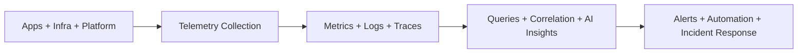
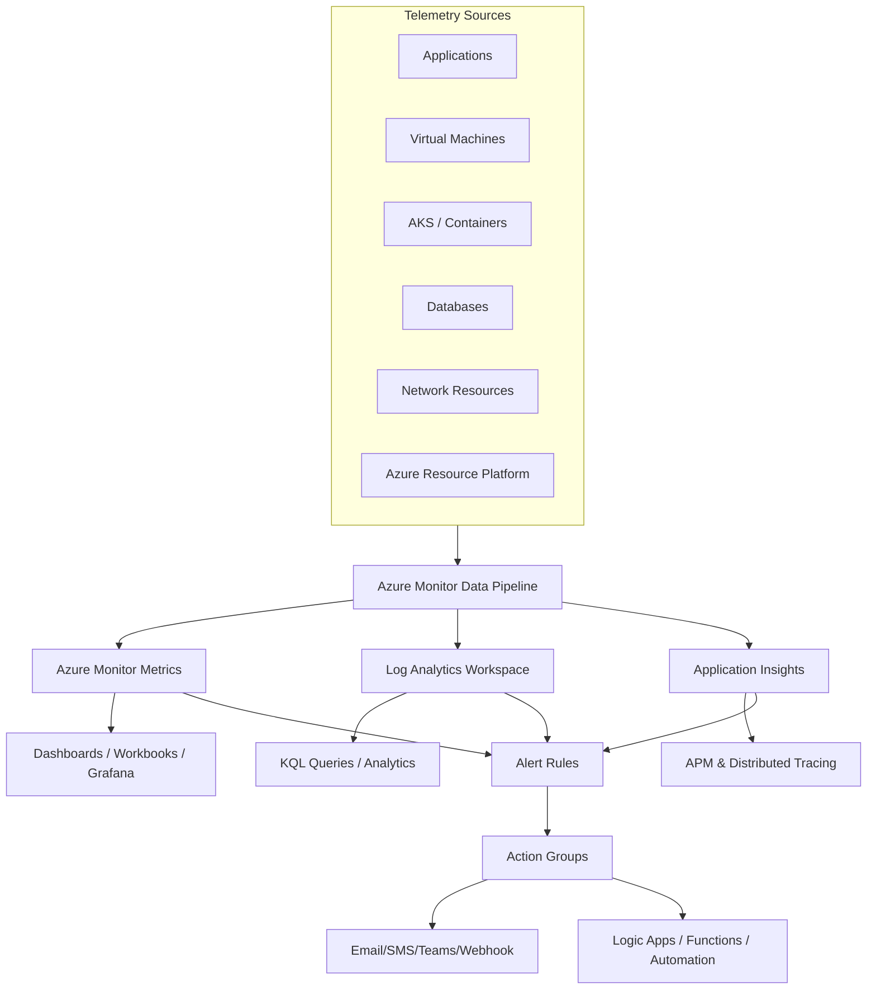
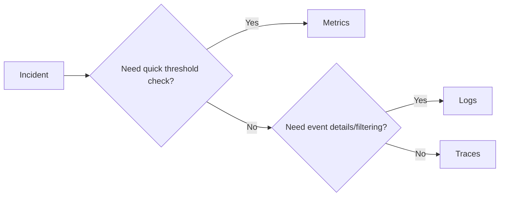
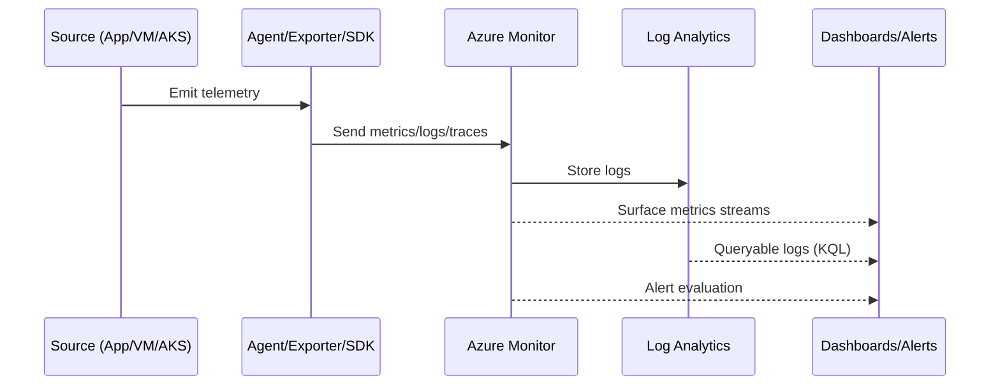
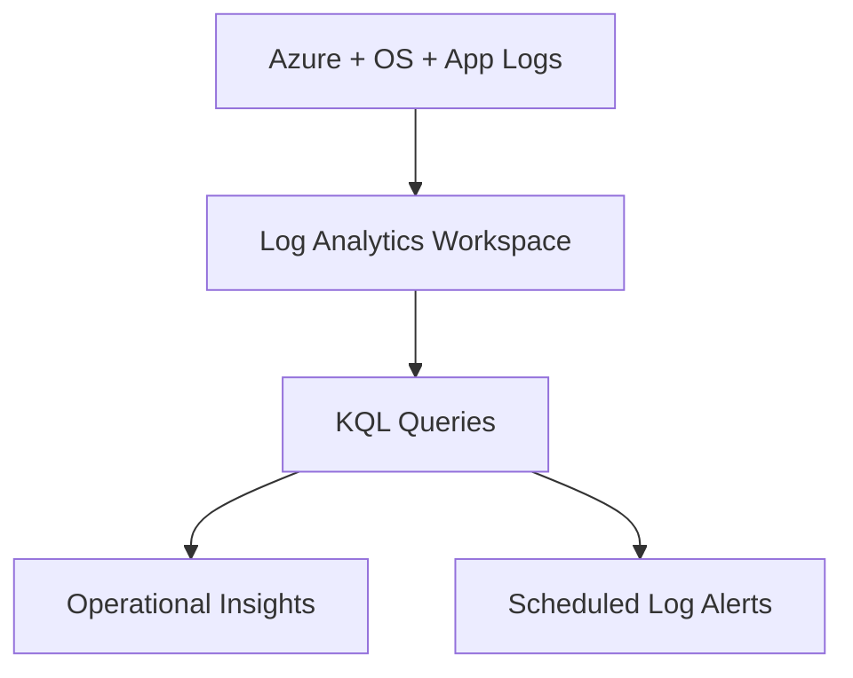
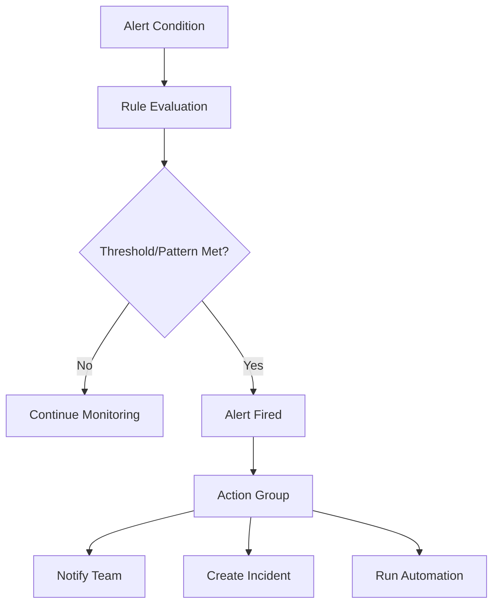
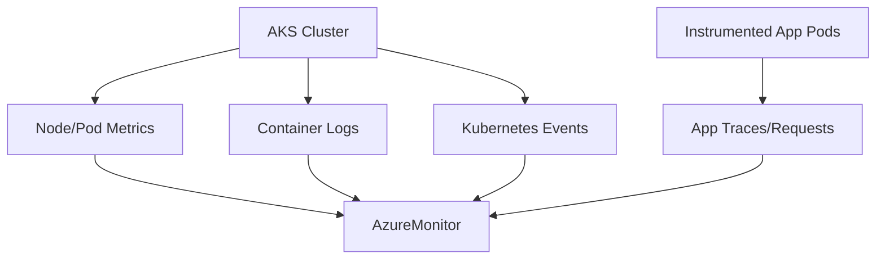
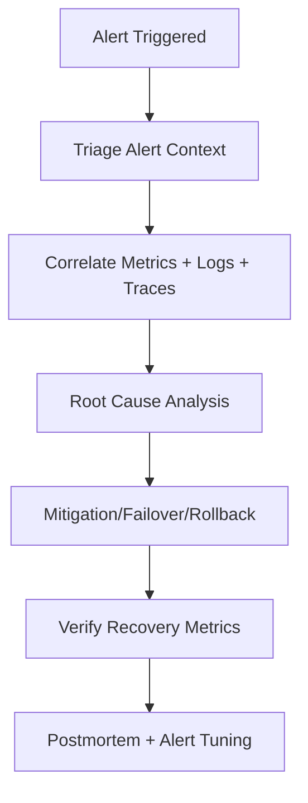

# What Is Azure Monitor?
## Detailed Interview Preparation Guide with Flow Charts (Static Site Ready)

---

## 1) Direct Interview Answer

**Azure Monitor** is Microsoft Azure’s end-to-end observability platform for collecting, analyzing, visualizing, and acting on telemetry from:

- Azure resources
- Applications
- Virtual machines
- Containers (AKS)
- Networks
- Databases
- Operating systems
- Custom business systems

It unifies:

1. **Metrics** (numerical time-series)
2. **Logs** (queryable event/state data)
3. **Traces** (distributed operation flow, via Application Insights/OpenTelemetry)
4. **Alerts** (proactive detection + notifications/actions)
5. **Visualization** (dashboards, workbooks, Grafana integrations)

> **One-line interview answer:**  
> **Azure Monitor is Azure’s centralized observability platform that turns infrastructure and application telemetry into insights, alerts, and automated actions.**

---

## 2) Why Azure Monitor Is Needed

Without centralized monitoring, teams face:

- Fragmented logs across services
- Slow incident diagnosis
- No end-to-end request visibility
- Reactive firefighting instead of proactive operations
- Weak SLO/SLA tracking
- Harder root cause analysis

Azure Monitor provides a single operational plane for reliability, performance, and security diagnostics.



---

## 3) Azure Monitor High-Level Architecture



---

## 4) Core Pillars of Azure Monitor

## 4.1 Metrics
- Lightweight numeric signals
- Near real-time
- Great for threshold alerting
- Examples: CPU %, memory, requests/sec, latency p95

## 4.2 Logs
- Rich, structured/semi-structured event data
- Query with Kusto Query Language (KQL)
- Better for deep investigation and historical analysis

## 4.3 Traces (APM)
- Request flow across microservices/dependencies
- Critical for distributed systems
- Commonly surfaced through Application Insights

## 4.4 Alerts
- Detect anomalies or thresholds
- Route incidents to response teams
- Trigger auto-remediation workflows

## 4.5 Visualization
- Workbooks, dashboards, and external visualization tools
- Operational, executive, and service-specific views

---

## 5) Metrics vs Logs vs Traces (Interview Gold)

| Signal | Best For | Example Question |
|---|---|---|
| Metrics | Fast health checks, thresholds | “Is CPU above 85% right now?” |
| Logs | Detailed forensic analysis | “Which exact exceptions happened in the last 2 hours?” |
| Traces | End-to-end request path | “Which downstream call caused this API to become slow?” |



---

## 6) Data Collection Flow



---

## 7) Key Azure Monitor Components

1. **Azure Monitor Metrics**
2. **Log Analytics Workspace**
3. **Application Insights**
4. **Alerts + Action Groups**
5. **Workbooks**
6. **Diagnostic Settings**
7. **Data Collection Rules (DCR) / Azure Monitor Agent (AMA)**
8. **Container Insights / VM Insights**

---

## 8) Log Analytics Workspace

A Log Analytics workspace is the central log data store for many Azure Monitor scenarios.

Capabilities:
- Multi-source log ingestion
- KQL querying
- Retention control
- Cross-resource analytics
- Alerting from query results



---

## 9) Application Insights Relationship

Application Insights is the APM layer in Azure Monitor for application telemetry:
- Requests
- Dependencies
- Exceptions
- Distributed traces
- Availability tests

Interview framing:
> Azure Monitor is the platform; Application Insights is the application observability capability within it.

---

## 10) Alerting Model

Azure Monitor supports different alert types:
- Metric alerts
- Log alerts
- Activity log alerts
- Smart detection (scenario dependent)



---

## 11) Action Groups

Action groups define what happens after an alert triggers:
- Email
- SMS
- Push/voice
- Teams/Webhook
- ITSM integration
- Automation runbook
- Azure Function
- Logic App

Best practice: map action groups by severity and ownership.

---

## 12) Azure Monitor for AKS

Typical AKS observability includes:
- Node/pod/container metrics
- Container logs
- Kubernetes events
- App traces via OpenTelemetry/App Insights
- Cluster health and capacity



---

## 13) Azure Monitor for VMs

With Azure Monitor Agent + DCR:
- Guest OS performance counters
- Event logs/syslogs
- Dependency and process data (scenario dependent)
- Health/perf baselining

---

## 14) Azure Monitor for PaaS Services

Using diagnostic settings, you can send telemetry from services like:
- Storage
- Key Vault
- SQL
- Cosmos DB
- App Gateway
- Load Balancer
- API Management
- Service Bus

to Log Analytics/Event Hub/Storage as required.

---

## 15) KQL in Azure Monitor (Interview Must-Have)

KQL is used to query log data.

Example (conceptual):
```kusto
AzureActivity
| where TimeGenerated > ago(24h)
| summarize count() by OperationNameValue, bin(TimeGenerated, 1h)
```

Use cases:
- Incident forensics
- Trend analysis
- Security investigations
- Capacity planning
- Compliance reporting

---

## 16) Workbooks and Dashboards

Workbooks provide interactive reports:
- Rich visuals
- Parameterized views
- Drill-down analysis
- Cross-resource insights

Dashboards provide at-a-glance operational summaries.

Best practice:
- Executive workbook (SLO/SLA)
- Service workbook (latency/errors)
- Platform workbook (AKS/VM/network/storage health)

---

## 17) Incident Response Flow with Azure Monitor



---

## 18) Monitoring Strategy (Interview Framework)

Use this layered strategy:

1. **Golden Signals**: latency, traffic, errors, saturation
2. **SLO-backed alerts**: user-impact first
3. **Dependency visibility**: DB/cache/queue/external API
4. **Capacity forecasting**: trend-based scaling
5. **Security and audit telemetry**
6. **Runbook-linked alerts**

---

## 19) Common Azure Monitor Use Cases

- Production health monitoring
- API latency and error tracking
- AKS capacity and pod health monitoring
- VM performance and anomaly detection
- Database bottleneck diagnosis
- Network path troubleshooting
- Security event auditing
- Cost-aware telemetry governance

---

## 20) Cost Management Considerations

Azure Monitor cost drivers typically include:
- Log ingestion volume
- Log retention duration
- Query frequency/complexity
- Export and integrations
- High-cardinality telemetry patterns

Optimization tactics:
- Filter noisy logs
- Use sampling for app telemetry
- Right-size retention by data class
- Separate verbose debug telemetry from production defaults
- Use alert tuning to reduce noise

---

## 21) Security and Governance Best Practices

- Least-privilege RBAC on monitoring resources
- Separate production/non-production workspaces where needed
- Data masking/redaction for sensitive fields
- Policy enforcement for diagnostic settings
- Audit alert rule and action group ownership
- Centralized monitoring standards across subscriptions

---

## 22) Common Mistakes (Interview Gold)

1. Treating monitoring as an afterthought  
2. Alerting on everything (alert fatigue)  
3. No SLO/SLA alignment  
4. No trace correlation in microservices  
5. Keeping overly verbose logs forever  
6. Not assigning action owners for alerts  
7. Ignoring dependency telemetry  
8. Missing runbooks for recurring alerts  

---

## 23) Azure Monitor vs Application Insights (Quick Distinction)

- **Azure Monitor**: full platform observability umbrella
- **Application Insights**: app-centric APM within Azure Monitor

Use both together for full-stack diagnostics.

---

## 24) Azure Monitor vs Microsoft Sentinel (Quick Distinction)

- **Azure Monitor**: operational observability and reliability focus
- **Microsoft Sentinel**: SIEM/SOAR security operations focus

They can integrate, but objectives differ.

---

## 25) Interview Q&A (Strong Answers)

### Q1: What is Azure Monitor?
**Answer:** Azure Monitor is Azure’s centralized observability platform for metrics, logs, traces, alerts, and automated operational response.

### Q2: What are its core data types?
**Answer:** Metrics, logs, and traces.

### Q3: Where are logs stored?
**Answer:** In Log Analytics workspaces.

### Q4: What is Application Insights in this context?
**Answer:** Application Insights is the APM capability in Azure Monitor for request/dependency/exception tracing.

### Q5: How do alerts work?
**Answer:** Rules evaluate telemetry conditions and trigger action groups for notifications or automation.

### Q6: How do you monitor AKS with Azure Monitor?
**Answer:** Collect node/pod/container telemetry plus app traces; correlate with logs and metrics for cluster and app diagnosis.

### Q7: How do you reduce monitoring noise?
**Answer:** SLO-based alert design, severity mapping, suppression windows, and iterative threshold tuning.

### Q8: What is KQL used for?
**Answer:** Querying and analyzing logs for troubleshooting, trends, and incident forensics.

---

## 26) 60-Second Interview Pitch

> Azure Monitor is Azure’s unified observability platform that collects and correlates metrics, logs, and traces from applications, infrastructure, and platform services. I use it to detect incidents early with alerts, investigate root causes with KQL and distributed traces, and visualize service health with dashboards and workbooks. Application Insights provides the app-level APM layer, while Log Analytics stores and analyzes log data at scale. In production, I design SLO-driven alerts, map action groups to on-call ownership, instrument dependencies, and continuously tune telemetry volume and retention for both reliability and cost efficiency.

---

## 27) Final Checklist

- [ ] Understand metrics vs logs vs traces
- [ ] Know Azure Monitor + Application Insights relationship
- [ ] Know Log Analytics role
- [ ] Know alert rules + action groups
- [ ] Understand AKS/VM/PaaS monitoring integration
- [ ] Use KQL for analysis
- [ ] Implement SLO-based alerting
- [ ] Plan telemetry governance and cost control
- [ ] Ensure incident runbooks and ownership are defined

---

## One-Line Conclusion

> Azure Monitor is the centralized Azure observability system that transforms telemetry into actionable insights, alerts, and automated operational response.