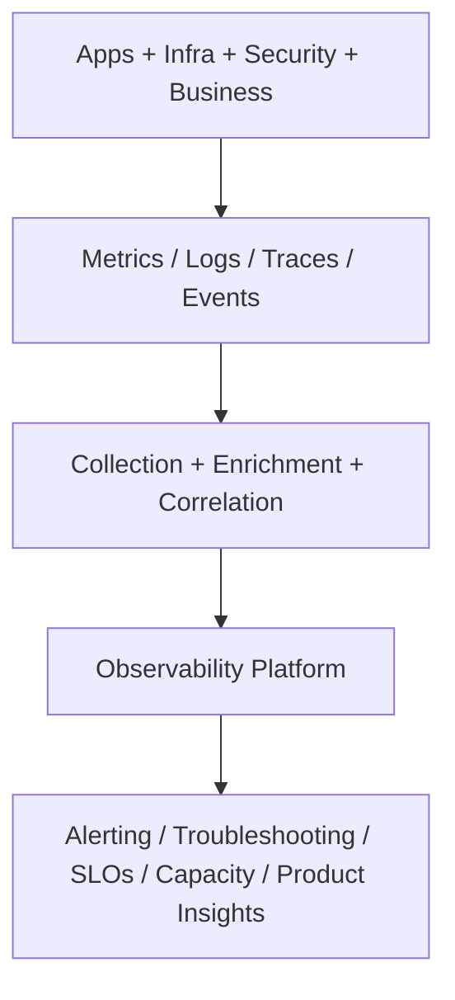
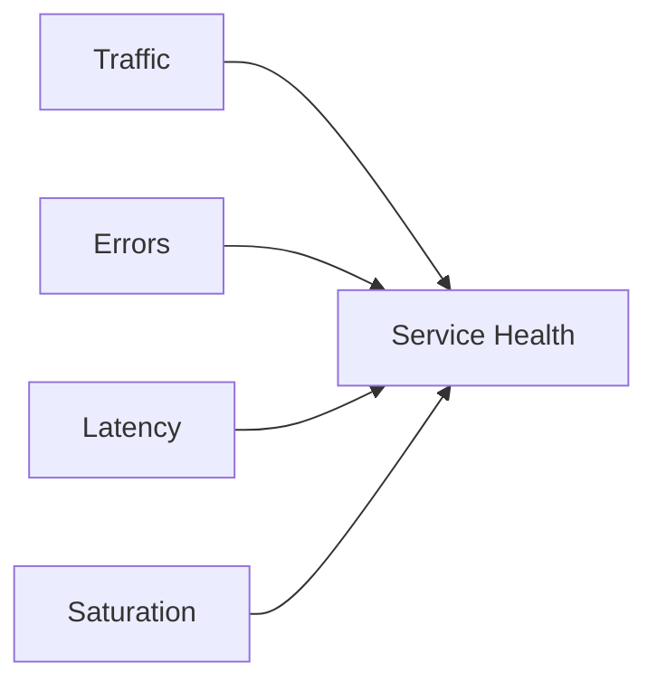
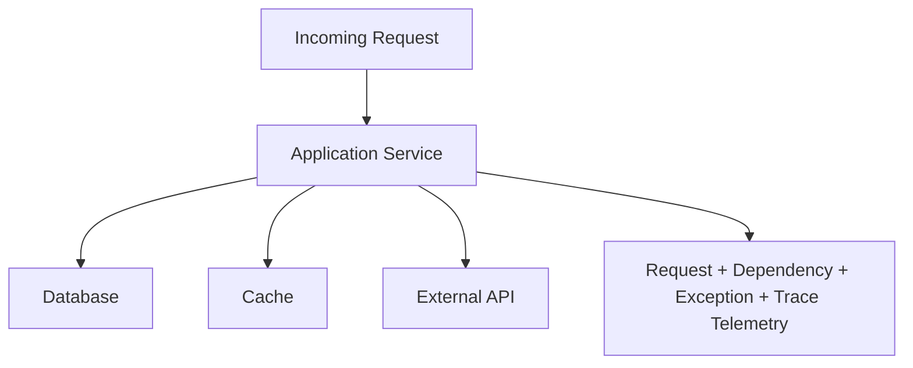
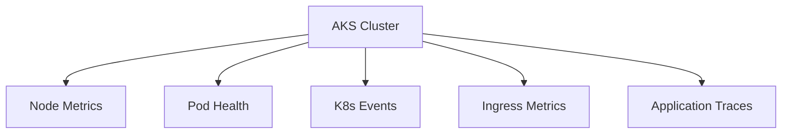
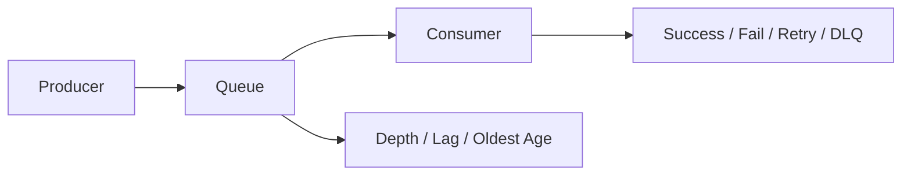
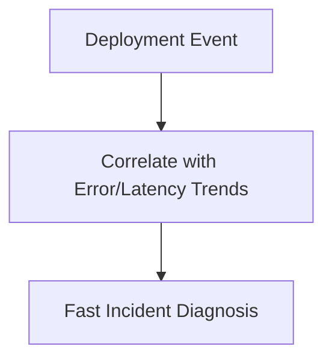
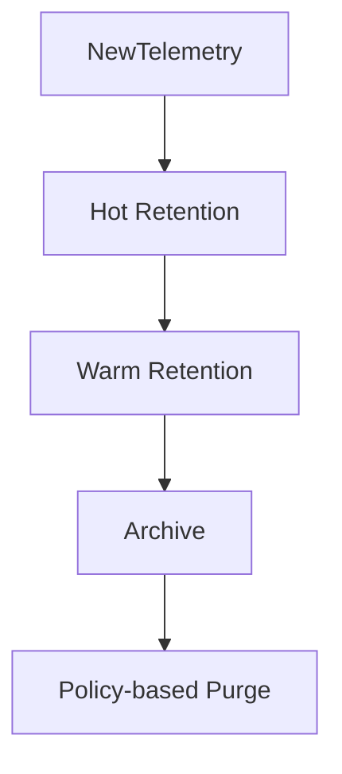

# What Telemetry Do You Collect?
## Detailed Interview Preparation Guide with Flow Charts (Static Site Ready)

---

## 1) Direct Interview Answer

I collect telemetry across **four layers**:

1. **Application telemetry** (requests, errors, dependencies, traces)
2. **Infrastructure telemetry** (CPU, memory, disk, network, node/pod health)
3. **Security telemetry** (auth events, access anomalies, policy violations)
4. **Business telemetry** (orders, conversions, SLA/SLO indicators, user journeys)

And I structure it into **metrics, logs, traces, and events** with strong correlation IDs.

> One-liner: *I collect technical + security + business telemetry, correlated end-to-end, so we can detect, diagnose, and improve reliability and outcomes.*

---

## 2) Telemetry Collection Model

---

## 3) Core Telemetry Categories

## 3.1 Metrics (Numerical Time-Series)
- Request rate
- Error rate
- Latency (p50/p95/p99)
- CPU/memory usage
- Queue depth
- DB connection usage
- Cache hit ratio

## 3.2 Logs (Detailed Events)
- Application logs (info/warn/error)
- Structured exception logs
- Audit and access logs
- Deployment/config change logs

## 3.3 Traces (Distributed Request Flow)
- End-to-end transaction traces
- Dependency spans (DB, cache, APIs, queue)
- Timing breakdown by service hop

## 3.4 Business Events
- Checkout started/completed
- Payment failed
- Order placed
- Signup conversion events

---

## 4) Golden Signals I Always Collect

- **Traffic**: RPS, active sessions, throughput
- **Errors**: 4xx/5xx, failed jobs, exception rate
- **Latency**: endpoint and dependency latency
- **Saturation**: CPU, memory, thread pools, queue lag

---

## 5) Application Telemetry (Detailed)

Collect per service:

- Request count and duration by route
- Response code distribution
- Exception type/message/stack signature
- Dependency call duration and failure
- Retries/timeouts/circuit-breaker states
- Thread pool pressure
- GC behavior (for managed runtimes)
- Version/build/release metadata

---

## 6) Infrastructure Telemetry (Detailed)

For VMs/Kubernetes/containers:

- Node CPU/memory/disk/network
- Pod/container restarts and OOM kills
- Node pressure and evictions
- Disk IOPS/latency
- Network packet drops/retransmits
- Autoscaler activity
- Load balancer health

---

## 7) Kubernetes/AKS Telemetry

- Pod readiness/liveness failures
- Pending pods and scheduling reasons
- HPA/KEDA decisions
- Cluster autoscaler scale-up/down events
- Ingress 4xx/5xx and latency
- Namespace resource quotas
- Control plane and node health signals

---

## 8) Dependency Telemetry

For each dependency (DB/cache/queue/external API), collect:

- Call count
- Success/failure rate
- Timeout rate
- Latency percentiles
- Throttling responses
- Connection pool utilization
- Retry counts

This is critical for root-cause isolation.

---

## 9) Data Layer Telemetry

For databases/storage:

- Query latency and top slow queries
- Deadlocks/timeouts
- Connection saturation
- Replication lag
- Storage latency and throughput
- Error codes
- Backup/restore health signals

---

## 10) Queue/Streaming Telemetry

For async systems:

- Queue depth
- Oldest message age
- Consumer lag
- DLQ count
- Processing success/failure
- Retry and poison message rates

---

## 11) Security Telemetry

Collect and monitor:

- Authentication failures
- Authorization denials
- Privilege escalation events
- Secret/certificate access anomalies
- Network deny events
- WAF/security rule hits
- Unusual geolocation/IP behavior
- Administrative change events

---

## 12) CI/CD and Change Telemetry

Track release and config events to correlate incidents:

- Deployment start/end
- Version promoted
- Feature flag toggles
- Infra changes
- Secret rotations
- Rollback events

---

## 13) User Experience Telemetry (Frontend/Digital Experience)

- Page load time
- Core interaction latency
- Client-side JS errors
- API call failures from browser/mobile
- Session-level failure patterns
- Geography/device/browser dimensions

---

## 14) Business Telemetry (Product + Revenue)

- Conversion funnel completion
- Order success/failure
- Payment approval rate
- Churn-related events
- Feature adoption
- SLA impact by customer segment

Interview advantage: ties engineering telemetry to business impact.

---

## 15) Telemetry Correlation Fields (Must-Have)

- `timestamp` (UTC)
- `service_name`
- `environment`
- `trace_id`
- `span_id`
- `correlation_id`
- `request_id`
- `user/session id` (privacy-safe)
- `version`
- `region/zone`
- `tenant/customer segment` (if allowed)

Without these, diagnosis slows dramatically.

---

## 16) Telemetry Quality Controls

- Schema versioning
- Required-field validation
- Clock synchronization (NTP)
- Deduplication guards
- Drop malformed events
- Sampling strategy review
- Data freshness SLOs

---

## 17) Alert-Driven Telemetry Use

Map telemetry to alerts:

- Error budget burn alerts
- Latency SLO breach alerts
- Dependency timeout spike alerts
- Queue lag breach alerts
- Saturation early warning alerts
- Security anomaly alerts

---

## 18) Telemetry Retention Strategy

Not all telemetry should retain equally:

- High-value audit/security: longer retention
- App debug noise: shorter retention
- Aggregated metrics: longer trend storage
- Raw traces: sampled and tiered retention

---

## 19) Cost vs Value Optimization

Balance breadth and cost:

- Keep high signal, reduce noise
- Sample high-volume low-value traces/logs
- Avoid high-cardinality explosion
- Control debug logging in production
- Tune retention by compliance and usefulness

---

## 20) Common Mistakes (Interview Gold)

1. Collecting only infra metrics, no app traces  
2. No correlation IDs across services  
3. Logging sensitive data (PII/secrets)  
4. High ingestion, low actionable insight  
5. No business telemetry linkage  
6. Alerting on raw noise  
7. No ownership for telemetry quality  

---

## 21) Example “What I Collect” Summary (Interview Style)

“I collect:
- Golden signals for every service
- Request/dependency traces with correlation IDs
- Structured app logs with exception signatures
- Kubernetes/node/platform metrics
- Queue and data-store health telemetry
- Security and audit events
- Deployment/change events
- Business KPIs linked to technical signals”

---

## 22) 60-Second Interview Pitch

> I collect telemetry across application, infrastructure, security, and business layers. Technically, I capture metrics, logs, traces, and domain events with consistent correlation fields like trace ID, service name, environment, version, and region. I always prioritize golden signals—latency, traffic, errors, saturation—then add dependency telemetry for databases, caches, queues, and external APIs. In Kubernetes environments I include pod health, autoscaling behavior, and ingress metrics. I also collect deployment/change telemetry to correlate incidents with releases, and business telemetry to measure user and revenue impact. Finally, I enforce schema standards, PII redaction, retention tiers, and cost controls so telemetry stays actionable, secure, and sustainable.

---

## 23) Final Checklist

- [ ] Golden signals covered
- [ ] App logs + exceptions structured
- [ ] Distributed traces enabled
- [ ] Dependency telemetry captured
- [ ] Infra and platform metrics collected
- [ ] Security/audit events captured
- [ ] Deployment/change events tracked
- [ ] Business telemetry linked
- [ ] Correlation fields standardized
- [ ] Alert mappings defined
- [ ] Retention and cost controls set
- [ ] Sensitive data redaction enforced

---

## One-Line Conclusion

> I collect correlated metrics, logs, traces, and business/security events across app and infrastructure layers to detect issues early, diagnose quickly, and improve reliability and outcomes.