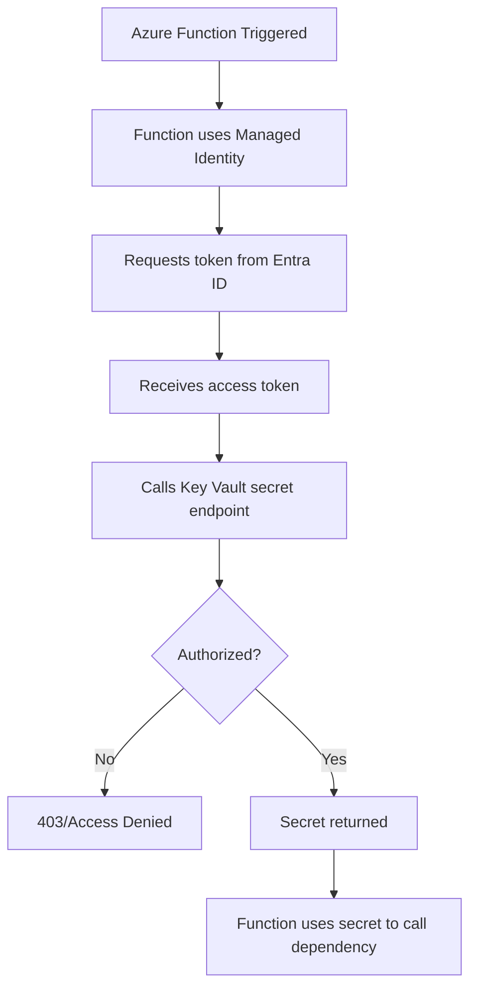
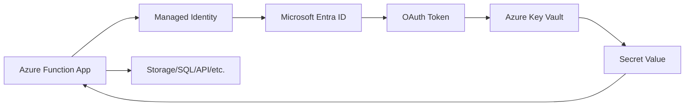
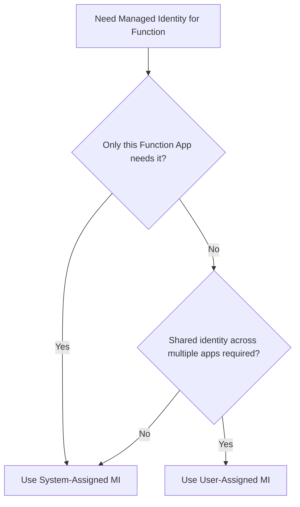
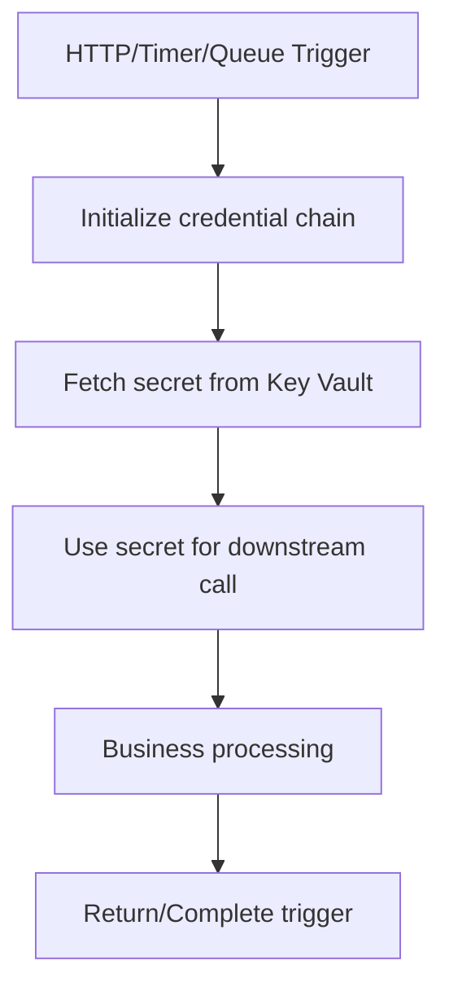
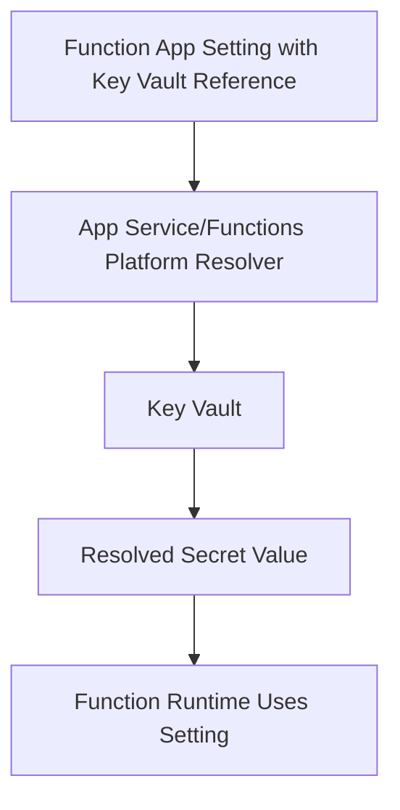
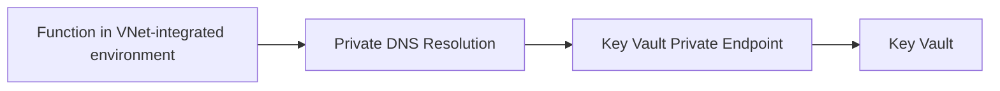
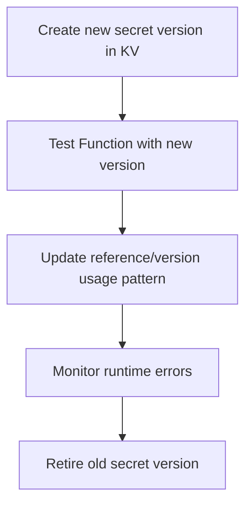
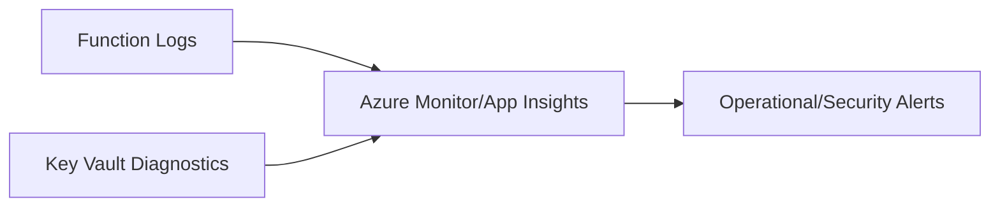

# How Do Azure Functions Access Azure Key Vault?
## Detailed Interview Preparation Guide with Flow Charts

---

## 1) Direct Interview Answer

Azure Functions should access Key Vault using **Managed Identity** (system-assigned or user-assigned), not hardcoded secrets.

High-level steps:

1. Enable Managed Identity on the Function App
2. Grant that identity least-privilege access to Key Vault (RBAC/access policy model as used)
3. Retrieve secrets either:
   - **At runtime via SDK/REST**, or
   - **Via Key Vault references in app settings** (platform-resolved)
4. Use private networking controls where required
5. Monitor/audit secret access

> One-liner: *Azure Functions access Key Vault securely through Managed Identity + authorization, eliminating credential storage in code.*

---

## 2) Why This Pattern Is Preferred

Without Managed Identity:
- Secrets may be stored in code/config/pipelines
- Rotation is difficult
- Secret leakage risk increases

With Managed Identity + Key Vault:
- Passwordless authentication
- Centralized secret governance
- Easier rotation/versioning
- Better audit trail and compliance posture

---

## 3) End-to-End Authentication Flow

---

## 4) Two Common Access Approaches

## 4.1 Runtime Retrieval (Code Fetch)
Function code fetches secrets from Key Vault during execution.

Use when:
- You need dynamic secret selection
- You need explicit control over retrieval/refresh timing
- You need secret metadata/version handling in logic

## 4.2 Key Vault Reference in Function App Settings
Function app settings reference Key Vault secrets; platform resolves values.

Use when:
- Secret maps directly to configuration values
- You prefer minimal code changes
- You want simpler operational pattern for config secrets

---

## 5) Architecture Flow (Recommended Baseline)

---

## 6) Step-by-Step Implementation Blueprint

## Step 1: Enable Managed Identity
- Turn on system-assigned MI (or attach user-assigned MI)

## Step 2: Authorize Identity on Key Vault
- Grant minimal permissions required (e.g., secret get/list as needed)
- Prefer least privilege and scoped assignments

## Step 3: Choose Access Method
- Runtime SDK retrieval OR
- App settings Key Vault reference

## Step 4: Configure Network Security
- Restrict Key Vault network exposure
- Use private endpoints/network integration where required

## Step 5: Validate End-to-End
- Test successful secret retrieval
- Test unauthorized path (expected failure)
- Verify logs and diagnostics

---

## 7) System-Assigned vs User-Assigned for Functions

Guideline:
- Default to system-assigned for simplicity and isolation
- Use user-assigned when identity reuse/lifecycle independence is required

---

## 8) Secret Access Pattern in Function Execution

Optimization options:
- Cache secret for short intervals when appropriate
- Avoid excessive Key Vault calls per invocation
- Handle secret rotation gracefully

---

## 9) Key Vault References Pattern (No-Code Secret Injection)

Great for connection strings and static config secrets that don’t require custom retrieval logic.

---

## 10) Authorization Model Details (Interview Depth)

Managed Identity authenticates the function, but authorization still controls access.

Common permissions patterns:
- Secret read (`get`) for runtime retrieval
- Avoid broad admin permissions
- Separate permissions by environment (dev/test/prod)

Interview phrase:
> Managed Identity answers who you are; Key Vault authorization answers what you can access.

---

## 11) Networking and Private Access

For high-security workloads:
- Restrict Key Vault public access as per architecture
- Use private endpoints
- Ensure Function networking can resolve/reach private Key Vault endpoint
- Validate DNS and route configuration

---

## 12) Secret Rotation Strategy with Functions

Design for:
- Zero/low downtime rotation
- Retry logic for transient fetch failures
- Safe rollback path

---

## 13) Error Handling and Resilience

Potential failures:
- Identity not enabled
- Missing RBAC/permissions
- Network/DNS/private endpoint issues
- Key Vault throttling/transient outages

Resilience practices:
- Exponential backoff retries
- Circuit-breaker style fallback where appropriate
- Clear operational alerts
- Fail-fast for critical missing secrets

---

## 14) Observability and Audit

Monitor:
- Key Vault access logs (success/failure)
- Function exceptions on secret retrieval
- Latency impact from secret fetch
- Unauthorized access attempts
- Secret rotation events

---

## 15) Security Best Practices Checklist

- [ ] Use Managed Identity (no embedded credentials)  
- [ ] Grant least-privilege Key Vault access  
- [ ] Separate vaults/permissions by environment  
- [ ] Restrict Key Vault network access when required  
- [ ] Enable diagnostic logs and alerting  
- [ ] Implement secret rotation runbook  
- [ ] Avoid logging secret values  
- [ ] Use version-aware change control for critical secrets  

---

## 16) Common Mistakes (Interview Gold)

1. Storing secrets in Function app settings as plaintext  
2. Enabling MI but forgetting Key Vault permissions  
3. Granting overly broad Key Vault rights  
4. Fetching secrets repeatedly per invocation without optimization  
5. Ignoring private DNS/network path requirements  
6. Logging secret values accidentally  
7. No monitoring for secret access failures  

---

## 17) Real-World Example Scenario

Scenario:
- HTTP-triggered Function needs DB credential and third-party API key

Pattern:
1. Function authenticates via Managed Identity
2. Reads secrets from Key Vault
3. Connects to DB and external API
4. Logs only metadata, never secret values
5. Rotates secrets quarterly with controlled rollout

---

## 18) Interview Q&A (Strong Answers)

### Q1: How do Azure Functions authenticate to Key Vault?
**Answer:** Using Managed Identity (system/user assigned), which gets a token from Entra ID and uses it to call Key Vault.

### Q2: Do I need to store a client secret in the Function code?
**Answer:** No. Managed Identity removes that need.

### Q3: What permissions are needed?
**Answer:** Only the minimal required secret permissions (e.g., get), assigned via RBAC/access model in use.

### Q4: Runtime SDK retrieval or Key Vault references—which is better?
**Answer:** Use references for simple config secrets; use runtime retrieval for dynamic control and advanced logic.

### Q5: What if Key Vault is private?
**Answer:** Ensure Function networking, DNS, and routing can reach the private endpoint.

### Q6: How do you handle secret rotation?
**Answer:** Use secret versioning, staged rollout, monitoring, and safe retirement of old versions.

---

## 19) 60-Second Interview Pitch

> Azure Functions should access Key Vault through Managed Identity for passwordless authentication. I enable a managed identity on the Function App, grant least-privilege permissions on Key Vault, and retrieve secrets either via runtime SDK calls or Key Vault references in app settings. For secure environments, I use private networking and validate DNS/routing paths. I also implement retries, monitoring, and audit logging for secret access, and handle rotation with versioned secrets and staged rollout. This approach removes hardcoded credentials and gives strong security, governance, and operational reliability.

---

## 20) One-Line Conclusion

> Azure Functions securely access Key Vault by using Managed Identity + least-privilege authorization, with secrets retrieved at runtime or via Key Vault references—without storing credentials in code.