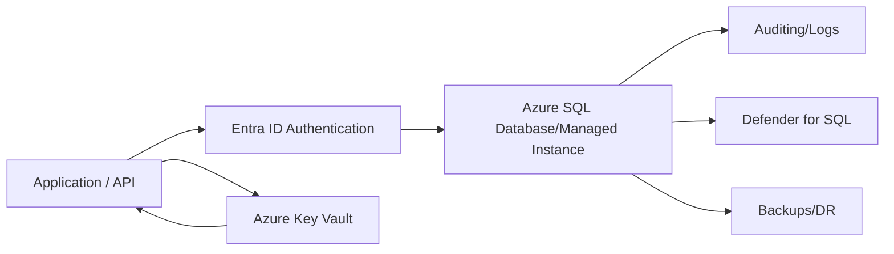
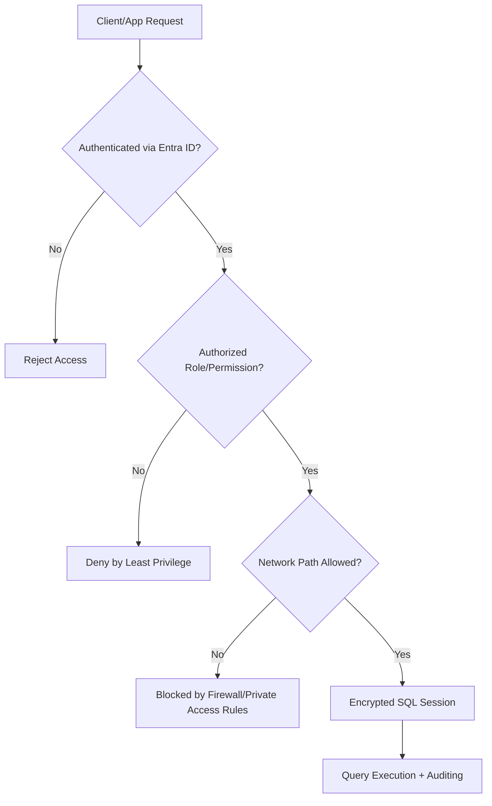
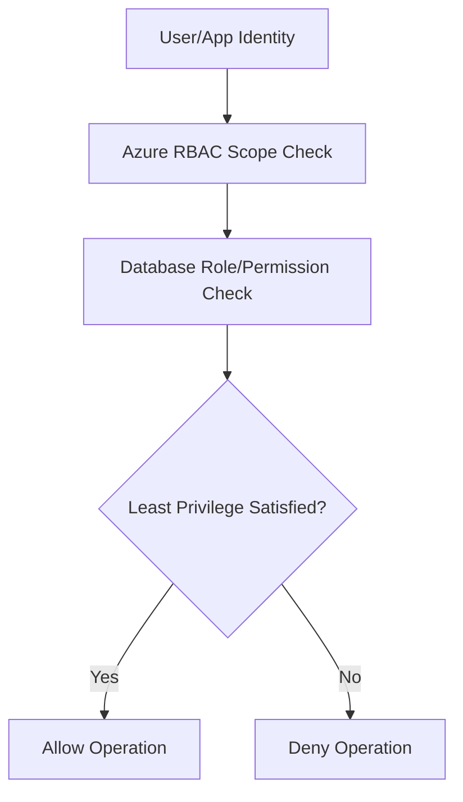
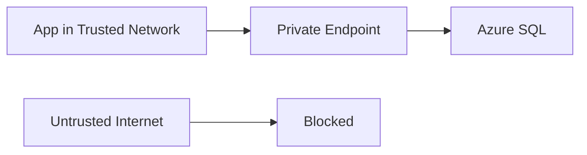
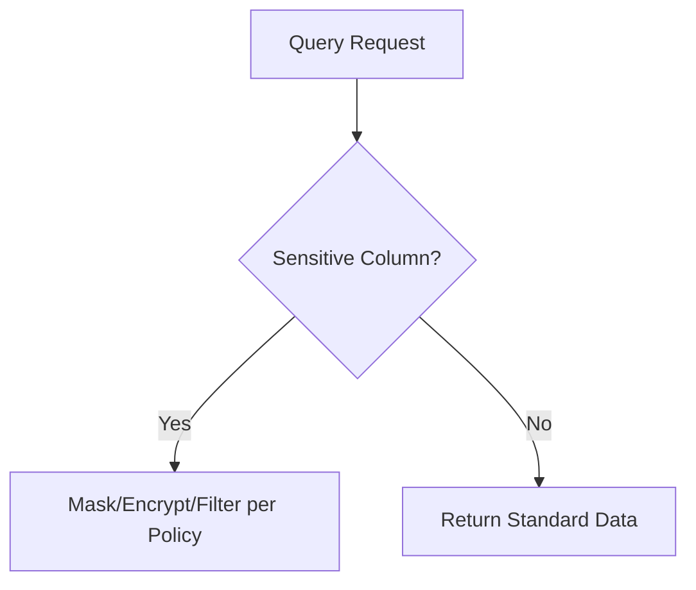
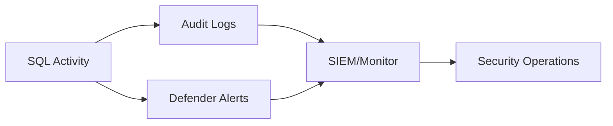
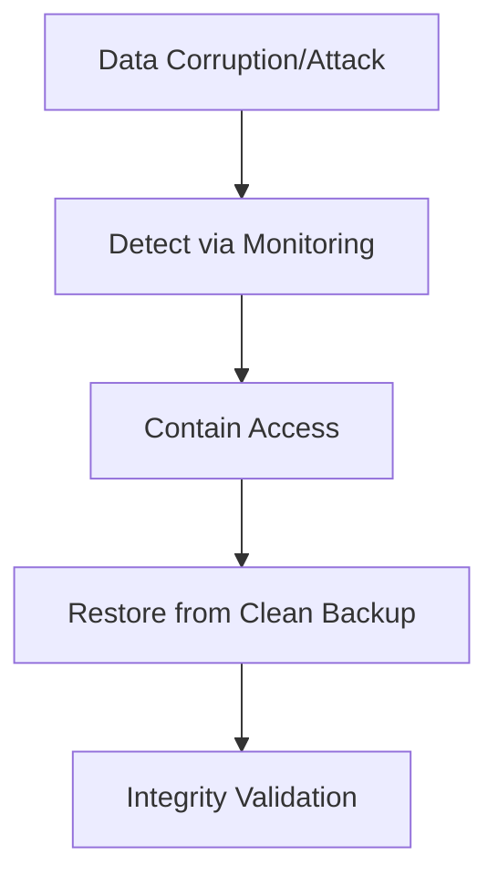

# How Do You Secure Azure SQL?
## Detailed Interview Preparation Guide with Flow Charts

---

## 1) Direct Interview Answer

To secure Azure SQL, implement **defense in depth** across identity, network, data protection, monitoring, and operations.

Core controls:

1. Strong authentication (prefer Microsoft Entra ID)
2. Least-privilege authorization (RBAC + DB roles/permissions)
3. Network isolation (private endpoints, firewall rules, no broad public access)
4. Encryption in transit and at rest (TLS + TDE, optional CMK strategy)
5. Sensitive data protections (masking, classification, optional Always Encrypted patterns)
6. Threat detection and auditing (Defender for SQL, auditing/log analytics)
7. Backup/DR and secure operations (patching, vuln assessment, key/secret hygiene)

> One-liner: *Secure Azure SQL by combining identity-first access, private networking, encryption, least privilege, and continuous monitoring.*

---

## 2) Security Objectives for Azure SQL

- Prevent unauthorized access
- Minimize attack surface
- Protect data confidentiality/integrity
- Detect suspicious behavior quickly
- Support compliance and forensics
- Ensure recoverability after incidents

---

## 3) High-Level Security Architecture

---

## 4) End-to-End Access Control Flow

---

## 5) Identity and Authentication (Top Interview Topic)

## 5.1 Prefer Entra ID Authentication
Why:
- Central identity governance
- MFA/conditional access integrations (for users)
- Reduced SQL login/password sprawl
- Better lifecycle management

## 5.2 Minimize SQL Authentication Usage
If SQL logins are required:
- Strong password policy
- Rotation controls
- Store credentials in Key Vault
- Restrict usage and scope tightly

Interview phrase:
> Identity-first security starts with Entra-based authentication and minimizing static credentials.

---

## 6) Authorization and Least Privilege

Use layered authorization:

1. Azure control plane RBAC (who can manage SQL resources)
2. Database-level permissions/roles (who can read/write/admin data)

Best practices:
- Grant only required roles
- Avoid excessive dbo/sysadmin-style grants
- Separate admin, app runtime, and reporting identities
- Periodic access reviews

---

## 7) Network Security for Azure SQL

## 7.1 Prefer Private Connectivity
- Private Endpoint / private network patterns
- Restrict public network exposure when possible

## 7.2 Firewall Hygiene
- Allow only required source ranges
- Avoid broad "allow all Azure services" style unless justified and controlled
- Review firewall rules regularly

---

## 8) Encryption Controls

## 8.1 Encryption in Transit
- Enforce TLS for client connections

## 8.2 Encryption at Rest
- Transparent Data Encryption (TDE) baseline

## 8.3 Key Management
- Service-managed keys (default baseline) or
- Customer-managed key strategy (where compliance requires)

Interview point:
> Encryption should cover both data in transit and at rest, with key governance aligned to compliance needs.

---

## 9) Sensitive Data Protection Features

Depending on requirement:
- Dynamic Data Masking (limit exposure in query outputs)
- Data classification/labeling
- Always Encrypted patterns for highly sensitive columns
- Row-level security for tenant/user isolation scenarios

---

## 10) Threat Detection and Auditing

Enable and operationalize:
- SQL auditing logs
- Defender for SQL alerts
- Vulnerability assessment reports
- Anomaly detection workflows
- SIEM integration

---

## 11) Secure Secret Handling for SQL Access

For app connection material:
- Use Managed Identity when possible (passwordless patterns)
- If secrets are needed, store in Key Vault
- Never hardcode connection passwords in code/repos
- Rotate secrets with runbook automation

---

## 12) Application-Layer SQL Security Practices

Even with platform security:
- Parameterized queries (prevent SQL injection)
- Input validation
- Minimal privileges for app identity
- Avoid dynamic SQL unless controlled
- Transaction and error handling hygiene

---

## 13) Backup, Recovery, and DR Security

Security includes resilience:
- Automated backups
- Tested restore procedures
- Geo-redundancy strategy as needed
- Access controls around backup/restore operations
- Ransomware recovery readiness

---

## 14) Vulnerability and Posture Management

- Run vulnerability assessments regularly
- Remediate findings with ownership/SLA
- Track baseline drift
- Enforce policy compliance (e.g., encryption/network settings)
- Review unused logins/users and excessive privileges

---

## 15) Multi-Environment Security Segmentation

- Separate dev/test/prod SQL environments
- Separate identities and permissions per environment
- Never reuse production secrets in lower environments
- Apply stricter network and access controls in production

---

## 16) Common Mistakes (Interview Gold)

1. Leaving broad public SQL access enabled  
2. Using shared admin accounts for applications  
3. Overprivileged app identities (db_owner unnecessarily)  
4. No auditing or ignored security alerts  
5. Secrets in config files/source control  
6. No restore drill/testing for backups  
7. Assuming encryption alone is sufficient  

---

## 17) Practical Hardening Checklist

- [ ] Entra ID authentication configured and preferred  
- [ ] Least-privilege DB roles/permissions implemented  
- [ ] Private endpoint/network restrictions enabled  
- [ ] Firewall rules minimized and reviewed  
- [ ] TLS enforced + TDE enabled  
- [ ] Sensitive data controls configured where required  
- [ ] Auditing + Defender + SIEM alerts enabled  
- [ ] Key Vault/Managed Identity pattern used for secrets  
- [ ] Backup/restore and DR drills tested  
- [ ] Vulnerability assessments remediated regularly  

---

## 18) Interview Q&A (Strong Answers)

### Q1: What are the first steps to secure Azure SQL?
**Answer:** Enforce Entra authentication, least privilege, and private network access; then add encryption, auditing, and threat detection.

### Q2: How do you reduce SQL credential risk?
**Answer:** Prefer managed identity/passwordless access patterns; if credentials are needed, store and rotate them via Key Vault.

### Q3: Is TDE enough for security?
**Answer:** No. TDE protects at-rest data, but you still need identity controls, network restrictions, and monitoring.

### Q4: How do you detect suspicious SQL activity?
**Answer:** Enable SQL auditing, Defender for SQL alerts, and centralize logs in SIEM with actionable alert rules.

### Q5: How do you protect sensitive columns?
**Answer:** Use controls such as masking, classification, and (where required) Always Encrypted/row-level security patterns.

### Q6: Why is backup strategy part of security?
**Answer:** Security includes availability and recovery—clean backups and tested restore procedures are essential against corruption/ransomware scenarios.

---

## 19) 60-Second Interview Pitch

> I secure Azure SQL with a defense-in-depth approach. First, I use Entra ID-based authentication and least-privilege authorization at both Azure and database layers. Next, I minimize network exposure using private endpoints and strict firewall rules. I enforce encryption in transit and at rest, and apply sensitive-data controls such as masking/classification and stronger column protections where needed. I enable auditing, Defender alerts, and SIEM monitoring for detection and response. Finally, I secure operational hygiene with Key Vault/managed identity for secrets, regular vulnerability remediation, and tested backup/restore DR procedures.

---

## 20) One-Line Conclusion

> Secure Azure SQL by combining identity-first access, least privilege, private networking, encryption, continuous monitoring, and tested recovery operations.