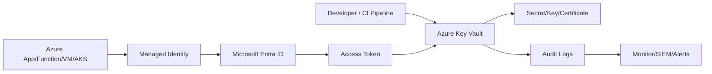
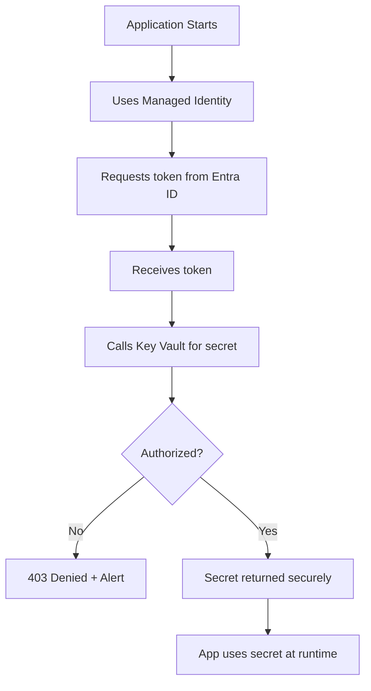
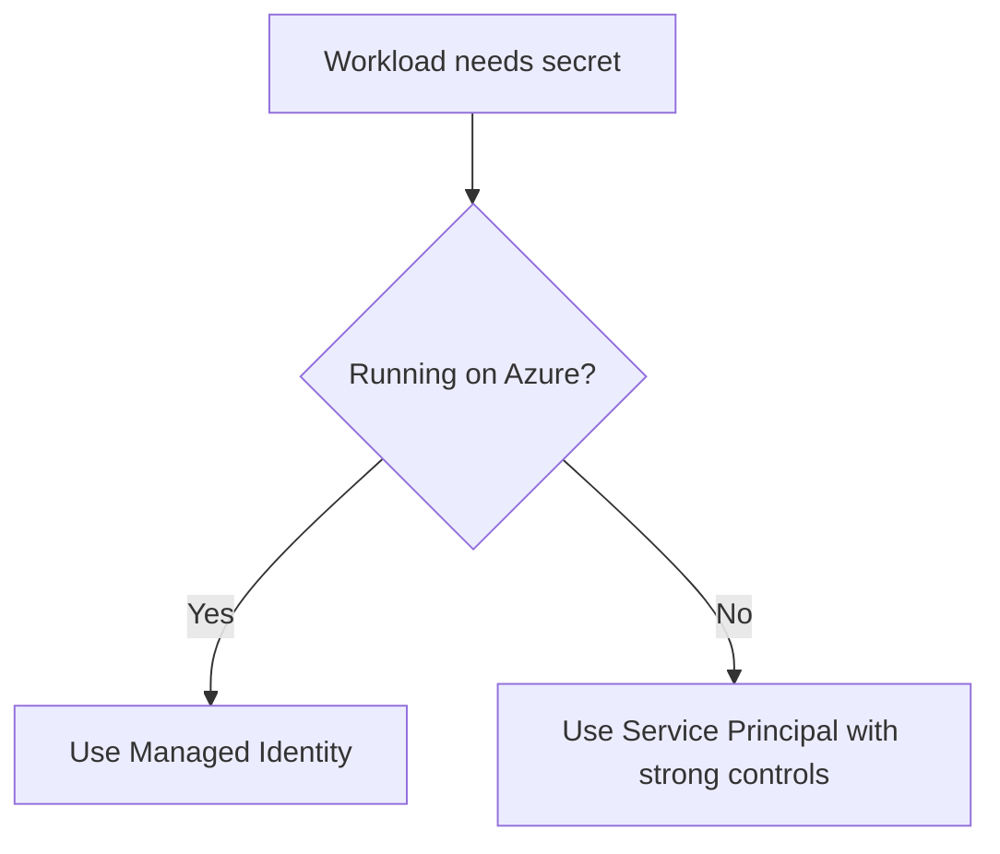
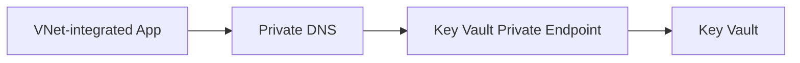
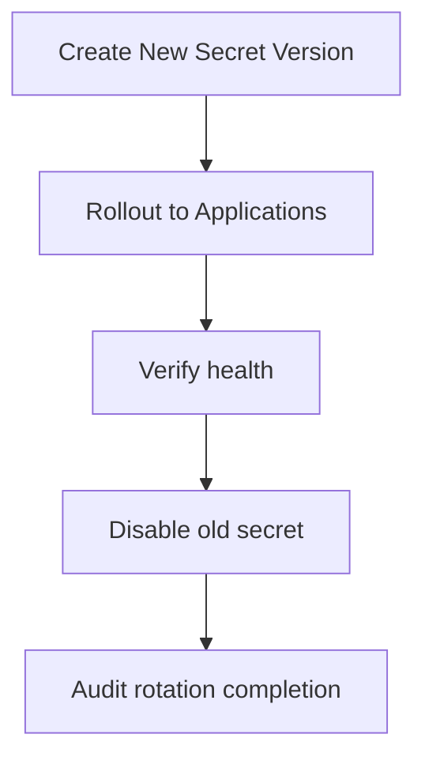
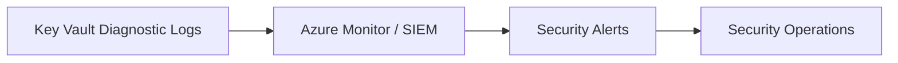
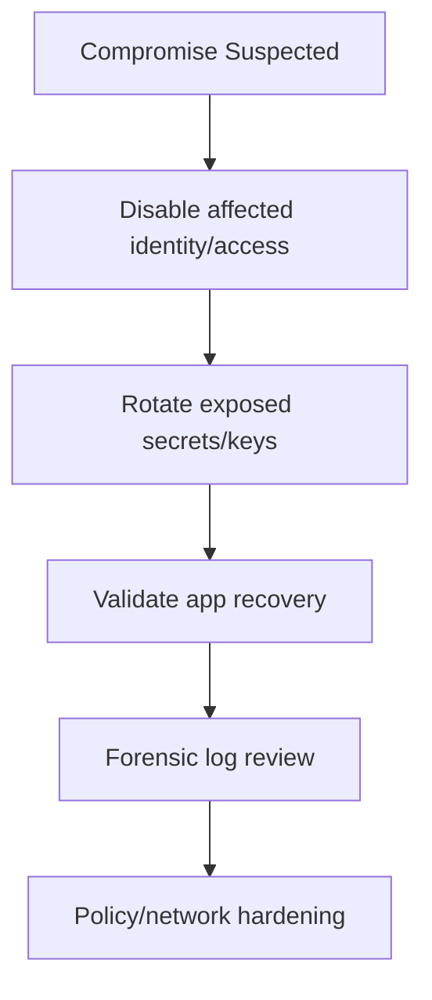

# How Do You Secure Secrets in Azure?
## Detailed Interview Preparation Guide with Flow Charts

---

## 1) Direct Interview Answer

To secure secrets in Azure, use a **defense-in-depth secret management strategy** centered on **Azure Key Vault** and **Managed Identity**, with strict access control, network isolation, rotation, and monitoring.

Core approach:

1. Store secrets in Key Vault (never in code/repos/plain config)
2. Use Managed Identity for passwordless access
3. Apply least-privilege RBAC/access policies
4. Restrict network access (private endpoints/firewalls as required)
5. Rotate/version secrets regularly
6. Monitor/audit all secret access
7. Automate governance with policy and CI/CD guardrails

> One-liner: *Secure secrets in Azure by centralizing them in Key Vault, accessing via Managed Identity, and enforcing least privilege, private access, rotation, and auditing.*

---

## 2) Why Secret Security Matters

If secrets are exposed:
- Attackers can access databases, APIs, storage, queues
- Lateral movement risk increases
- Incident blast radius becomes large
- Compliance and legal impact can be severe

Strong secret hygiene reduces breach probability and impact.

---

## 3) High-Level Secret Security Architecture

---

## 4) Golden Rules for Secret Security in Azure

1. **Never hardcode secrets** in source code  
2. **Never commit secrets** to Git repos  
3. **Never store plaintext secrets** in app settings when avoidable  
4. **Use Managed Identity** instead of client secrets wherever possible  
5. **Grant minimum required access** only  
6. **Rotate secrets** on schedule and on incident  
7. **Log and alert** on secret access anomalies  

---

## 5) End-to-End Secret Access Flow

---

## 6) Core Services and Roles

## 6.1 Azure Key Vault
Central store for:
- Secrets
- Cryptographic keys
- Certificates

## 6.2 Managed Identity
Provides passwordless identity for Azure resources to access Key Vault and other services.

## 6.3 Microsoft Entra ID
Issues tokens and anchors identity-based access.

## 6.4 Azure RBAC / Access Model
Controls what identity can read/manage in vault.

---

## 7) Secret Storage Best Practices

- Keep secrets only in Key Vault
- Use naming conventions (`app-env-purpose`)
- Separate vaults by environment/sensitivity where needed
- Use secret versioning
- Tag secrets with owner/rotation metadata
- Minimize secret sprawl and duplication

---

## 8) Authentication Best Practices

Prefer:
- System-assigned managed identity for single workload
- User-assigned managed identity for controlled multi-workload reuse

Avoid:
- Long-lived client secrets when managed identity is possible
- Shared credentials across unrelated services

---

## 9) Authorization (Least Privilege) Strategy

Grant only required actions:
- Secret read for runtime apps
- Secret set/delete only for authorized ops workflows
- Separate admin and runtime roles
- Use scoped role assignments (avoid subscription-wide if unnecessary)

Interview phrase:
> Identity without least privilege is still risky.

---

## 10) Network Isolation Strategy

For high-security workloads:
- Restrict Key Vault network access
- Use private endpoints where required
- Apply firewall rules
- Disable broad public access patterns where possible

---

## 11) Secret Rotation and Versioning Lifecycle

Rotation triggers:
- Scheduled rotation policy
- Staff/credential changes
- Suspected compromise
- Compliance mandates

---

## 12) CI/CD and DevSecOps Controls

- Use secure secret injection at deploy/runtime
- Keep secrets out of pipeline logs
- Restrict who can read pipeline variables
- Use policy checks to block insecure IaC patterns
- Scan repos for accidental secret commits
- Enforce pull-request security checks

---

## 13) Monitoring and Alerting

Monitor:
- Secret read/write/delete operations
- Unauthorized access attempts
- Access from unusual identities/IPs/locations
- Sudden spikes in secret retrieval
- Expiring certificates/secrets

---

## 14) Incident Response for Secret Compromise

Key goals:
- Fast containment
- Rapid credential replacement
- Traceable remediation

---

## 15) Common Secret Security Patterns in Azure

## Pattern A: App Service -> Managed Identity -> Key Vault
Standard web/API secret retrieval pattern.

## Pattern B: Function App with Key Vault references
No-code style config injection.

## Pattern C: AKS workload identity + Key Vault
Kubernetes-native identity-to-vault access.

## Pattern D: APIM certificates/secrets from Key Vault
Centralized API gateway secret governance.

---

## 16) Common Mistakes (Interview Gold)

1. Secrets in source code or ARM/Bicep parameters without protection  
2. Over-permissive RBAC (e.g., broad admin roles for runtime apps)  
3. No secret rotation plan  
4. Shared credentials across many apps  
5. No alerting on failed or anomalous secret access  
6. Ignoring network restrictions for high-value vaults  
7. Logging sensitive values in application logs  

---

## 17) Compliance and Governance Angle

Security programs often require:
- Secret access audit trail
- Periodic access reviews
- Rotation evidence
- Separation of duties
- Controlled break-glass procedures

Key Vault + Entra + monitoring helps satisfy these requirements.

---

## 18) Interview Q&A (Strong Answers)

### Q1: What is the best way to store secrets in Azure?
**Answer:** Store them in Azure Key Vault, not in code or plaintext configs.

### Q2: How should apps authenticate to retrieve secrets?
**Answer:** Prefer Managed Identity with Entra-issued tokens.

### Q3: How do you reduce blast radius?
**Answer:** Use least-privilege RBAC, separate identities per app, and avoid shared high-privilege secrets.

### Q4: How do you secure Key Vault network access?
**Answer:** Use firewall/private endpoint patterns and restrict public exposure as required by risk level.

### Q5: How do you handle secret rotation safely?
**Answer:** Use versioned secrets, staged rollout, validation, then retire old versions.

### Q6: What should be monitored continuously?
**Answer:** Secret access events, failed authorization, anomalous usage spikes, and expiry/rotation posture.

---

## 19) 60-Second Interview Pitch

> To secure secrets in Azure, I centralize all secrets, keys, and certificates in Key Vault and remove secrets from code and repos. Workloads use Managed Identity to authenticate through Entra ID and retrieve secrets with least-privilege RBAC permissions. I isolate vault access with network controls like private endpoints where needed, enable full diagnostic logging and SIEM alerts, and enforce rotation/versioning policies for operational resilience. I also integrate secret governance into CI/CD and incident response runbooks so compromised credentials can be quickly rotated and audited.

---

## 20) Final Checklist

- [ ] Secrets centralized in Key Vault  
- [ ] Managed Identity used for Azure workloads  
- [ ] Least-privilege RBAC/access applied  
- [ ] Vault network restrictions configured  
- [ ] Secret rotation/versioning policy active  
- [ ] Diagnostics + SIEM alerts enabled  
- [ ] CI/CD secret hygiene controls enforced  
- [ ] Incident response playbook tested  

---

## One-Line Conclusion

> Secure secrets in Azure by combining Key Vault, Managed Identity, least-privilege access, private network controls, continuous monitoring, and disciplined rotation.