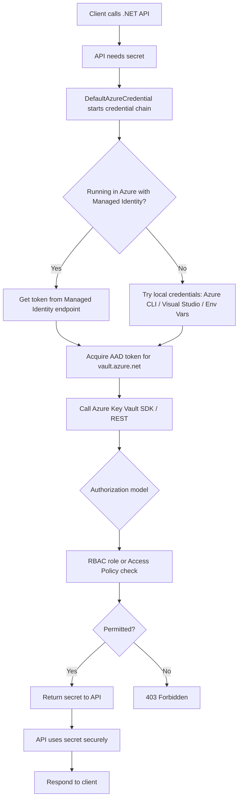
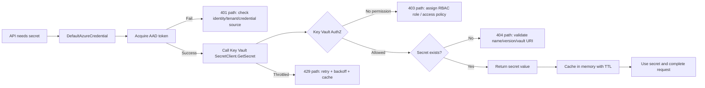

# How a .NET API Accesses Azure Key Vault  
_Interview Preparation Guide (with flow chart)_

## 1) Short Interview Answer (30–60 seconds)

A .NET API should access Azure Key Vault using **Microsoft Entra ID (Azure AD) authentication** and **managed identity** (preferred in Azure-hosted environments).  
At runtime, the API obtains an OAuth2 token for `https://vault.azure.net/.default` via `DefaultAzureCredential`, then calls Key Vault data-plane APIs (through Azure SDK) to fetch secrets, keys, or certificates.  
Authorization is enforced either by **Key Vault RBAC** or **Access Policies**.  
Best practice is: never store secrets in code/config, use least privilege, enable logging/monitoring, and cache secret values where appropriate.

---

## 2) End-to-End Flow (Conceptual)



---

## 3) Core Building Blocks You Must Mention in Interviews

- **Identity**:  
  - Managed Identity (system-assigned or user-assigned) in Azure (App Service, AKS, VM, Functions).  
  - Service Principal (client secret/certificate) only when managed identity is not possible.
- **Authentication**: OAuth2 token acquisition via Microsoft Entra ID.
- **Authorization**:
  - **Azure RBAC** (recommended modern approach) at Key Vault scope.
  - Or legacy **Access Policies**.
- **SDK**:
  - `Azure.Identity` for credentials.
  - `Azure.Security.KeyVault.Secrets` (secrets), `...Keys`, `...Certificates`.
- **Configuration**:
  - Vault URI: `https://<vault-name>.vault.azure.net/`
- **Security posture**:
  - No secrets in source code.
  - Least privilege roles.
  - Auditing + monitoring enabled.
  - Optional private endpoint + firewall restrictions.

---

## 4) Typical Runtime Sequence in .NET

1. API receives request and reaches code path needing a secret (e.g., DB password, third-party API key).
2. API instantiates `SecretClient` with:
   - Key Vault URI
   - `DefaultAzureCredential`
3. `DefaultAzureCredential` attempts credentials in order:
   - Environment variables
   - Managed identity
   - Developer tools credentials (CLI/VS) during local dev
4. AAD token is requested for Key Vault resource scope.
5. Key Vault validates:
   - Token authenticity
   - Principal permissions (RBAC/Access Policy)
6. Secret is returned if authorized.
7. API uses secret in-memory (preferably cached briefly), never logs it.
8. API returns business response.

---

## 5) Production-Grade .NET Example

```csharp name=Program.cs
using Azure.Identity;
using Azure.Security.KeyVault.Secrets;

var builder = WebApplication.CreateBuilder(args);

// Key Vault URL from config
var keyVaultUrl = builder.Configuration["KeyVault:Url"]
    ?? throw new InvalidOperationException("KeyVault:Url is missing");

// Credential chain: managed identity in Azure, developer identity locally
var credential = new DefaultAzureCredential();

// Secret client registration
builder.Services.AddSingleton(new SecretClient(new Uri(keyVaultUrl), credential));

var app = builder.Build();

app.MapGet("/demo-secret", async (SecretClient secretClient) =>
{
    // Retrieve a secret by name
    KeyVaultSecret secret = await secretClient.GetSecretAsync("DbPassword");
    return Results.Ok(new
    {
        Message = "Secret retrieved successfully",
        // Don't return secret in real apps; this is for demo only
        SecretLength = secret.Value.Length
    });
});

app.Run();
```

> Interview tip: Say clearly that exposing raw secret values in API responses/logs is a security anti-pattern.

---

## 6) App Settings Example (No Secret Values)

```json name=appsettings.json
{
  "KeyVault": {
    "Url": "https://your-vault-name.vault.azure.net/"
  }
}
```

---

## 7) Hosting Scenarios Interviewers Ask

## A) Azure App Service + Managed Identity (Most Common)

- Enable **System Assigned Managed Identity** on App Service.
- Grant identity access to Key Vault:
  - RBAC role like **Key Vault Secrets User** (read secrets) at vault scope.
- Use `DefaultAzureCredential` in code.
- No client secret needed.

## B) AKS Workload Identity / Managed Identity

- Pod identity mapped to Entra identity.
- Same SDK code; token issued to workload identity.
- Fine-grained access via RBAC.

## C) Local Development

- Developer logs in via:
  - `az login`, or
  - Visual Studio/Azure account.
- `DefaultAzureCredential` uses developer identity.
- Separate dev vault recommended.

---

## 8) RBAC vs Access Policies (Interview Comparison)

| Topic | Azure RBAC | Access Policies |
|---|---|---|
| Model | ARM-based role assignments | Vault-specific ACL style |
| Recommendation | Preferred for new deployments | Legacy/older setups |
| Granularity | Role-based with scope inheritance | Explicit secret/key/cert permissions |
| Governance | Better alignment with Azure governance | Simpler but less unified |

---

## 9) Security Best Practices (High-Value Interview Points)

1. **Use Managed Identity** over client secrets.
2. **Principle of least privilege** (only needed permissions).
3. **Rotate secrets** and handle versioning.
4. **Cache secrets** responsibly to reduce latency/throttling.
5. **Enable Key Vault diagnostic logs** and alerts.
6. **Use private endpoints** and restrict public network access.
7. **Never log secret values**, only metadata (name/version access status).
8. **Plan failure behavior**:
   - retry with exponential backoff
   - fallback strategy if vault temporarily unavailable.

---

## 10) Common Failures & Troubleshooting (Interview-Ready)

- **401 Unauthorized**  
  Usually token acquisition/authentication issue (wrong tenant, identity not available, bad SP creds).
- **403 Forbidden**  
  Identity authenticated but lacks permission in RBAC/access policy.
- **404 Not Found**  
  Secret name/version missing, wrong vault URI, wrong environment.
- **429 Too Many Requests**  
  Throttling—implement caching and retry policies.
- **Timeout/Network errors**  
  DNS/firewall/private endpoint misconfiguration.

---

## 11) Advanced Flow Chart (with failure branches)



---

## 12) Interview Questions You Should Practice

1. Why is `DefaultAzureCredential` recommended in .NET?
2. Difference between authentication and authorization in Key Vault access?
3. RBAC vs access policy—which one for new systems and why?
4. How do you secure local development without hardcoding secrets?
5. How do you reduce Key Vault latency and throttling in high-traffic APIs?
6. What happens when secret rotation occurs—how does app pick latest version?
7. How would private endpoints change connectivity architecture?

---

## 13) “Perfect Answer” Template (Say This in Interview)

> “In .NET, we access Azure Key Vault using Azure SDK with `DefaultAzureCredential`. In Azure hosting, managed identity gets an Entra token without storing credentials. The API calls Key Vault using that token, and Key Vault authorizes via RBAC/access policy. We follow least privilege, avoid secret logging, and use caching plus retries for resilience. This design is secure, cloud-native, and operationally scalable.”

---

## 14) Quick Revision Checklist

- [ ] I can explain Managed Identity clearly.
- [ ] I can describe token flow (Entra ID -> Key Vault).
- [ ] I know 401 vs 403 difference.
- [ ] I can justify RBAC preference.
- [ ] I can discuss caching, retries, and rotation.
- [ ] I can mention observability and private networking.

---

## 15) Optional: Package References

```xml name=YourProject.csproj
<ItemGroup>
  <PackageReference Include="Azure.Identity" Version="1.*" />
  <PackageReference Include="Azure.Security.KeyVault.Secrets" Version="4.*" />
</ItemGroup>
```

> Use latest stable versions in your project policy.

---

## Final Note for Static Site Publishing

This Markdown is ready for:
- Docusaurus
- MkDocs
- Jekyll
- Hugo (Markdown content)
- Docsify

You can place it as:  
`/docs/dotnet-api-keyvault-interview-guide.md`