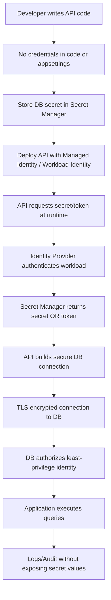
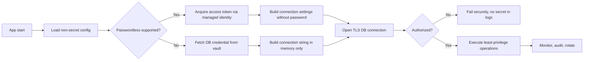
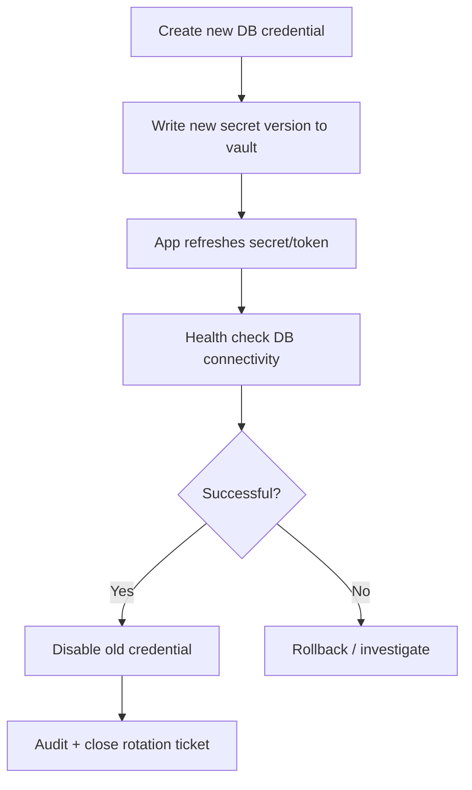

# How to Secure Connection Strings  
_Interview Preparation Guide (with flow chart)_

## 1) Short Interview Answer (30–60 seconds)

Connection strings are secured by **removing secrets from source code**, storing them in a **secret manager** (like Azure Key Vault/AWS Secrets Manager/HashiCorp Vault), and retrieving them at runtime using **application identity** (managed identity/role-based auth).  
Use **least privilege DB accounts**, **encryption in transit (TLS)**, **network restrictions**, **secret rotation**, and **auditing**.  
If possible, prefer **passwordless authentication** (OAuth/managed identity) over username/password in connection strings.

---

## 2) End-to-End Security Flow (Conceptual)

---

## 3) What Interviewers Expect You to Cover

- **Secret storage**: Vault/secret manager, never plaintext in repo.
- **Runtime retrieval**: Identity-based access (managed identity/service account role).
- **Transport security**: TLS required; validate certificates.
- **Access control**: Least privilege at DB/user level.
- **Rotation**: Automatic/manual rotation with minimal downtime.
- **Monitoring**: Detect secret access anomalies and failed auth patterns.
- **Operational hygiene**: Masking/redaction in logs, CI/CD scanning, incident response.

---

## 4) Golden Rules for Securing Connection Strings

1. **Never hardcode secrets** in source code.
2. **Never commit secrets** in Git, even private repos.
3. **Don’t store secrets in plain appsettings.json** (production).
4. **Use managed identity/passwordless auth** whenever supported.
5. **Use dedicated DB principals per app/environment** (dev/test/prod separation).
6. **Restrict network paths** (private endpoints, VNet, firewall allowlists).
7. **Rotate credentials** regularly and on compromise suspicion.
8. **Mask secrets in logs/errors/telemetry**.
9. **Use secret scanning in CI/CD** to block leaks.
10. **Encrypt backups/config stores** and control access tightly.

---

## 5) Common Patterns (Good → Better → Best)

## A) Good: Environment Variables (Basic)
- Store connection string in environment variable.
- Better than code, but still can leak via process dumps/misconfigured logs.

## B) Better: Secret Manager + Runtime Fetch
- App pulls secret at startup or on-demand from vault.
- Centralized access control, auditing, rotation support.

## C) Best: Passwordless / Identity-Based DB Access
- App authenticates with workload identity (managed identity/OIDC).
- Connection string may contain server/db only; token used instead of password.
- Eliminates static DB passwords in most cases.

---

## 6) .NET-Oriented Practical Approach

For .NET APIs:
- Use `IConfiguration` for non-secret metadata (host/db name).
- Fetch secrets from Key Vault (or equivalent) with `DefaultAzureCredential`.
- Prefer token-based auth for Azure SQL/PostgreSQL where available.
- Cache tokens/secrets briefly to reduce latency/throttling.
- Ensure `Encrypt=True` and certificate validation enabled.

---

## 7) Flow Chart: Secure Connection String Lifecycle

---

## 8) Secure by Environment

## Local Development
- Use local secret store (e.g., .NET user secrets) or dev vault.
- Avoid real production credentials.
- Distinct dev DB identity with minimal privileges.

## CI/CD
- Use OIDC federation/workload identity where possible.
- Avoid long-lived pipeline secrets.
- Block merges if secret scanners detect credentials.

## Production
- Managed identity/workload identity only.
- Private network access to DB and vault.
- Strict RBAC and continuous audit alerts.

---

## 9) Least Privilege Design for DB Accounts

- Separate principals by application and environment.
- Grant only required permissions (`SELECT/INSERT/EXECUTE` etc.).
- Avoid owner/admin roles for app runtime identity.
- Use separate identity for migrations/schema changes.
- Time-bound elevated permissions (JIT/PIM style where possible).

---

## 10) Rotation Strategy (Interview Gold)

## Rotation Flow
1. Generate new credential / key.
2. Store new version in vault.
3. Update app to read latest version (or use versionless reference).
4. Validate connectivity and health checks.
5. Revoke old credential.
6. Monitor for failed connections.

---

## 11) Logging and Observability Controls

- Redact or hash sensitive fields before logging.
- Never log full connection strings.
- Turn on alerts for:
  - repeated auth failures
  - unusual secret read volume
  - secret access from unexpected identities/IP ranges
- Keep immutable audit trails for secret reads and DB login events.

---

## 12) Typical Mistakes (and Better Answers in Interviews)

- **Mistake:** “We put encrypted connection strings in config.”  
  **Better:** Encryption helps, but key management is the real risk; use vault + identity.

- **Mistake:** “One DB admin account for all services.”  
  **Better:** Per-service least-privilege identity, segmented by environment.

- **Mistake:** “Rotation once a year.”  
  **Better:** Frequent automated rotation + emergency break-glass rotation process.

- **Mistake:** “Trusted internal network, so no TLS.”  
  **Better:** Always TLS; internal networks can still be compromised.

---

## 13) Interview Q&A Practice

1. **Q:** Where should connection strings be stored?  
   **A:** Secret manager/vault, not code or plaintext config.

2. **Q:** What is better than storing DB passwords?  
   **A:** Passwordless identity-based authentication (managed identity, IAM token, OIDC federation).

3. **Q:** How do you prevent leakage?  
   **A:** Redaction, secret scanning, strict logging policies, short-lived credentials.

4. **Q:** What’s the difference between 401/403 in secret retrieval?  
   **A:** 401 = authentication failed; 403 = authenticated but unauthorized.

5. **Q:** How do you rotate safely without downtime?  
   **A:** Dual credential overlap, staged rollout, health checks, then revoke old secret.

---

## 14) “Perfect Interview Answer” Template

> “I secure connection strings by removing secrets from code and storing them in a centralized secret manager. My app retrieves credentials at runtime using managed identity or workload identity, and I prefer passwordless DB auth whenever possible. I enforce TLS, least-privilege DB permissions, network isolation, and secret rotation. I also redact logs, enable auditing and alerts, and use CI/CD secret scanning to prevent accidental leaks.”

---

## 15) Quick Checklist (Before You Finish an Interview)

- [ ] No secrets in code/repo.
- [ ] Secrets in vault with RBAC.
- [ ] Managed identity/passwordless auth preferred.
- [ ] TLS enforced end-to-end.
- [ ] Least-privilege DB role.
- [ ] Rotation policy tested.
- [ ] Logging redaction enabled.
- [ ] Monitoring + alerting configured.
- [ ] Dev/test/prod identities separated.

---

## 16) Static Site Placement

Suggested path:

`/docs/secure-connection-strings-interview-guide.md`

Compatible with:
- Docusaurus
- MkDocs
- Jekyll
- Hugo
- Docsify