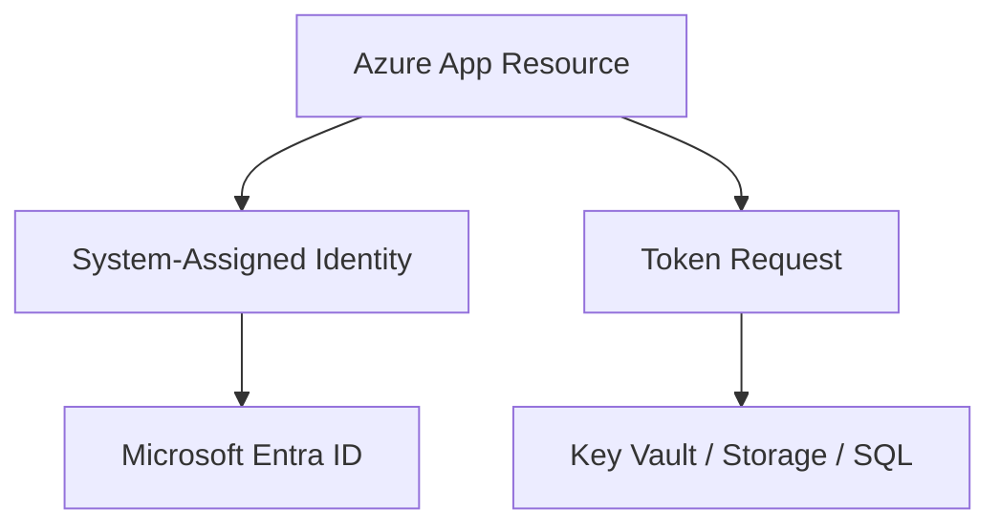
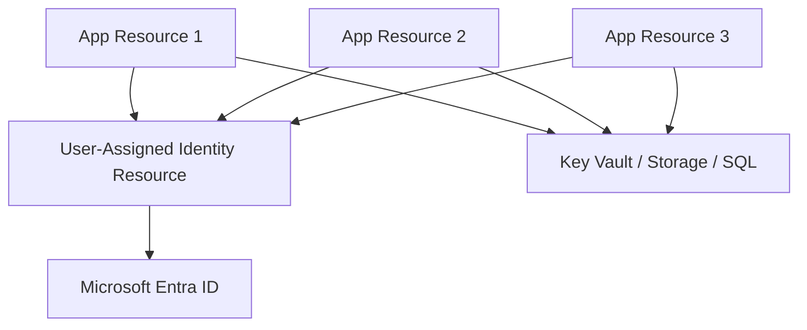
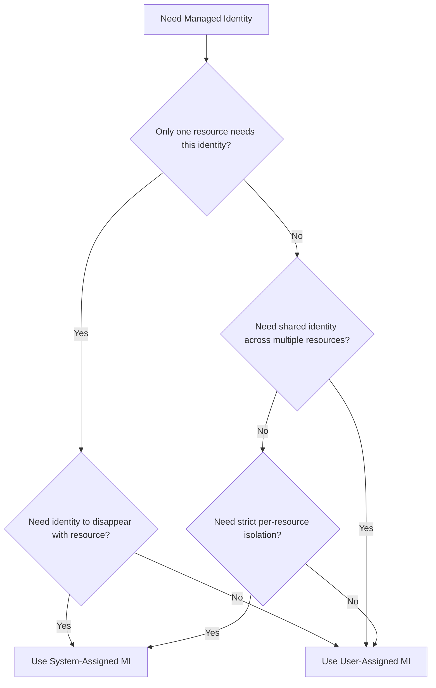
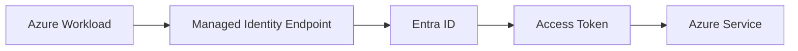
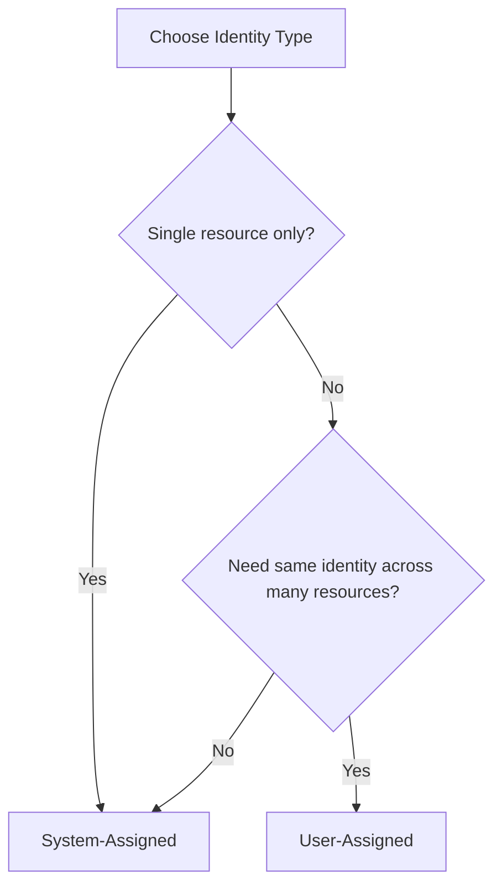
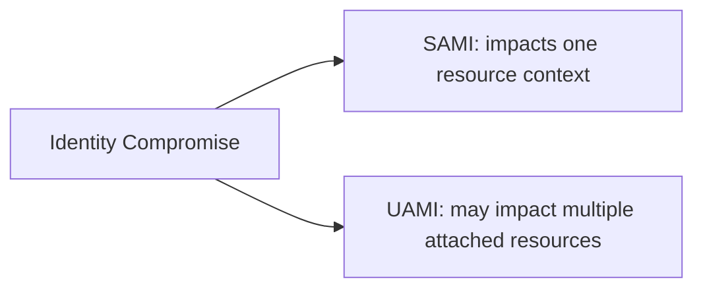

# System-Assigned vs User-Assigned Managed Identity (Azure)
## Detailed Interview Preparation Guide with Flow Charts

---

## 1) Direct Interview Answer

Both are Azure Managed Identities used for passwordless authentication to Azure services via Microsoft Entra ID.

- **System-assigned managed identity (SAMI)**: Identity is created on an Azure resource and tied to that resource lifecycle.
- **User-assigned managed identity (UAMI)**: Identity is a separate Azure resource that can be attached to one or many Azure resources.

> One-liner: *Use system-assigned for simple one-resource identity; use user-assigned for reusable/shared identity across resources.*

---

## 2) Quick Difference Snapshot

| Feature | System-Assigned MI | User-Assigned MI |
|---|---|---|
| Lifecycle | Tied to parent resource | Independent resource lifecycle |
| Creation | Enabled on resource | Created separately, then attached |
| Deletion | Deleted with resource | Persists until explicitly deleted |
| Reuse across resources | No (not designed for reuse) | Yes (attach to multiple resources) |
| Operational simplicity | Very simple | Slightly more management overhead |
| Best fit | Single app/single resource auth | Shared identity or controlled reuse scenarios |

---

## 3) Conceptual Architecture

## 3.1 System-Assigned Identity

Identity exists because App1 exists.

## 3.2 User-Assigned Identity

One identity can be reused by multiple resources.

---

## 4) Lifecycle Behavior (Critical Interview Point)

## System-Assigned
- Enable MI on resource -> identity is created
- Delete resource -> identity is removed automatically

## User-Assigned
- Create UAMI once
- Attach/detach from resources as needed
- Delete resource using it -> identity remains
- Delete UAMI explicitly when no longer needed

---

## 5) Selection Flow Chart

---

## 6) Authentication Flow (Same for Both at Runtime)

At runtime both use token-based auth from Entra ID.

Difference is not token mechanism, but identity lifecycle and reuse model.

---

## 7) Security Design Trade-Offs

## System-Assigned: Security Strengths
- Strong isolation (one identity per resource)
- Smaller blast radius
- Automatic cleanup reduces orphaned identities

## User-Assigned: Security Considerations
- Reuse can simplify operations
- But shared identity can increase blast radius if overused
- Needs stricter governance on who can attach identity where

Interview phrase:
> Prefer least privilege and minimal sharing; use UAMI intentionally, not by default everywhere.

---

## 8) Operations Trade-Offs

## System-Assigned
- Easy to enable
- Minimal identity inventory management
- Great for straightforward deployments

## User-Assigned
- Better for standardized identity reuse
- Useful in complex environments and blue/green scenarios
- Requires lifecycle tracking and attachment governance

---

## 9) Real-World Usage Patterns

## Use System-Assigned When:
1. A single app accesses its own secrets
2. You want app + identity lifecycle tightly coupled
3. You want reduced identity management overhead
4. You want clear app-level isolation by default

## Use User-Assigned When:
1. Multiple apps/jobs need same identity permissions
2. You need identity persistence across app re-creation
3. You want pre-provisioned identity before compute exists
4. You require controlled identity reuse in platform engineering

---

## 10) Example Scenario Comparison

## Scenario A: One API -> Key Vault
- One API service needs a few secrets
- Best fit: **System-assigned MI**

## Scenario B: Many worker apps -> same storage account role
- Shared controlled access pattern
- Best fit: **User-assigned MI** (with careful governance)

---

## 11) RBAC and Permission Model

For both SAMI and UAMI:
- Identity must receive explicit permissions on target resources
- Typically via Azure RBAC roles (least privilege)

Important:
> Enabling managed identity alone grants **no automatic access**.

---

## 12) CI/CD and Infrastructure-as-Code Perspective

## System-Assigned
- Simpler templates for app-centric deployments
- Good for ephemeral environments

## User-Assigned
- Useful for central platform modules
- Identity can be created once and referenced across stacks
- Better for controlled reuse and stable principal IDs across redeployments

---

## 13) Blast Radius Analysis

This is why UAMI sharing should be intentional and limited.

---

## 14) Governance Best Practices

1. Default to **system-assigned** unless reuse is required  
2. Use **user-assigned** for justified shared-access patterns  
3. Apply least-privilege roles only  
4. Monitor identity sign-ins and resource access logs  
5. Periodically review unused identities and excessive role assignments  
6. Control who can attach UAMI to workloads  

---

## 15) Common Mistakes (Interview Gold)

1. Using one UAMI for too many unrelated apps  
2. Granting broad Contributor/Owner where read-only is enough  
3. Forgetting to remove stale role assignments  
4. Assuming MI enablement automatically grants access  
5. No monitoring for identity misuse/anomalies  
6. Choosing UAMI when SAMI would be simpler and safer  

---

## 16) Troubleshooting Differences

If access fails:

For SAMI:
- Check resource MI is enabled
- Confirm correct RBAC on target resource

For UAMI:
- Confirm UAMI exists
- Confirm it is attached to workload
- Confirm workload is using intended UAMI
- Confirm RBAC for that UAMI on target resource

---

## 17) Interview Q&A (Strong Answers)

### Q1: Main difference between system-assigned and user-assigned MI?
**Answer:** System-assigned is tied to one resource lifecycle; user-assigned is standalone and reusable across multiple resources.

### Q2: Which is more secure by default?
**Answer:** System-assigned is often safer by default due to per-resource isolation and smaller blast radius.

### Q3: When should I choose user-assigned?
**Answer:** When multiple resources need the same identity, or when identity lifecycle must be independent from compute lifecycle.

### Q4: Does deleting the app delete the identity?
**Answer:** For system-assigned, yes. For user-assigned, no.

### Q5: Do both use Entra token-based auth?
**Answer:** Yes, runtime authentication flow is token-based for both.

### Q6: Does enabling MI automatically allow Key Vault access?
**Answer:** No. You must grant RBAC/access permissions explicitly.

---

## 18) 60-Second Interview Pitch

> System-assigned and user-assigned managed identities both provide passwordless Azure authentication through Entra ID. The key difference is lifecycle and reuse: system-assigned identity is created on a resource and deleted with it, making it ideal for simple, isolated app identity. User-assigned identity is a separate resource that can be attached to multiple workloads, which is useful for controlled shared-access patterns and identity persistence across redeployments. I default to system-assigned for least complexity and blast radius, and use user-assigned only when reuse or lifecycle independence is a clear requirement, always with least-privilege RBAC.

---

## 19) Final Decision Checklist

- [ ] Single workload, isolated access needed -> **System-assigned**  
- [ ] Identity should be auto-removed with resource -> **System-assigned**  
- [ ] Multiple workloads need same identity -> **User-assigned**  
- [ ] Identity must outlive workload redeployments -> **User-assigned**  
- [ ] Governance controls for shared identity are in place -> **User-assigned (if needed)**  

---

## 20) One-Line Conclusion

> Choose **System-Assigned MI** for simple, per-resource secure access and **User-Assigned MI** for reusable, lifecycle-independent identity across multiple Azure resources.