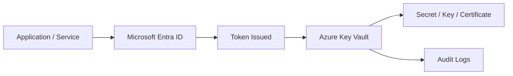
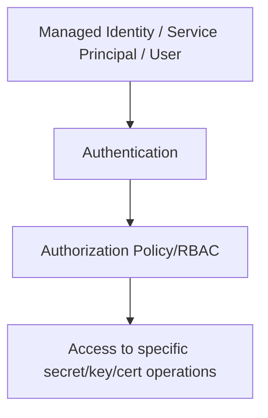
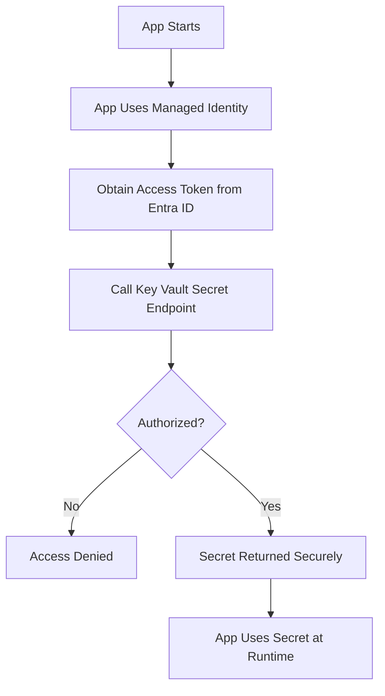
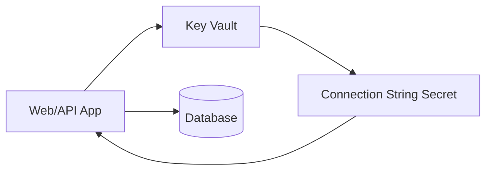
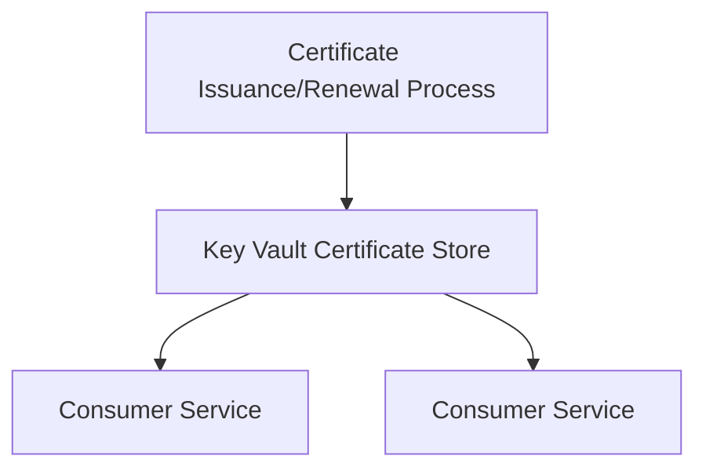
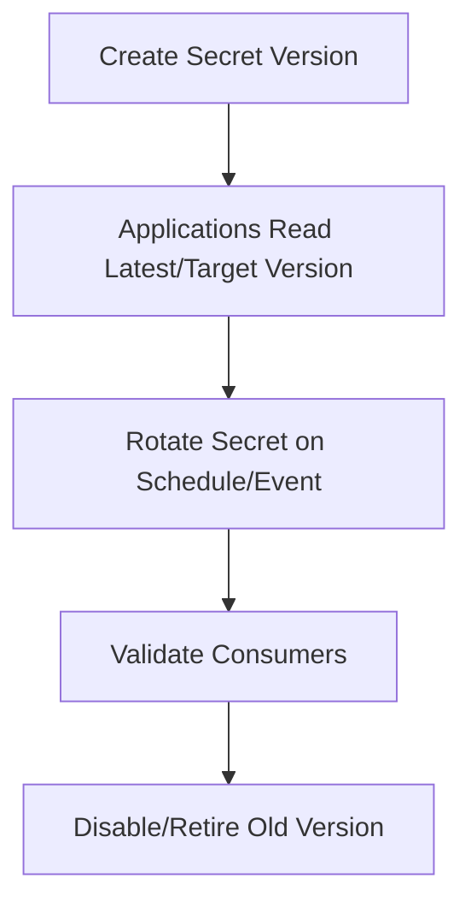

# What Is Azure Key Vault?
## Detailed Interview Preparation Guide with Flow Charts

---

## 1) Direct Interview Answer

**Azure Key Vault** is a cloud service used to **securely store and control access** to sensitive information such as:

- **Secrets** (passwords, connection strings, tokens, API keys)
- **Keys** (cryptographic keys for encryption/signing)
- **Certificates** (TLS/SSL certificates and lifecycle)

It provides centralized secret management, strong access control, auditing, and integration with Azure services.

> One-liner: *Azure Key Vault is a managed secure vault for secrets, keys, and certificates with strict access control and auditing.*

---

## 2) Why Key Vault Is Needed

Without Key Vault:
- Secrets end up in code, config files, or pipelines
- Credential rotation is hard
- Security audits are difficult
- Secret leakage risk increases

With Key Vault:
- Secrets are externalized from code
- Access is identity-based (least privilege)
- Rotation and lifecycle improve
- Access is logged and auditable

---

## 3) High-Level Key Vault Flow

---

## 4) What Key Vault Stores

## 4.1 Secrets
Examples:
- DB connection strings
- API tokens
- OAuth client secrets
- Third-party credentials

## 4.2 Keys
Examples:
- RSA/ECC keys
- Encryption keys
- Signing keys

Usage:
- Encrypt/decrypt
- Sign/verify
- Key wrapping operations

## 4.3 Certificates
Examples:
- TLS certs for apps/domains
- Cert lifecycle with renewal workflows

---

## 5) Core Security Model

Principles:
- Authenticate caller identity
- Authorize only needed operations
- Deny everything else by default (least privilege)

---

## 6) Key Vault Access Control

Two common authorization approaches in Azure environments:
1. **Azure RBAC-based access control**
2. **Vault access policies** (depending on model/legacy setups)

Interview-safe best practice:
> Prefer modern centralized access governance patterns and least-privilege role assignments.

---

## 7) End-to-End Secret Retrieval Flow

---

## 8) Managed Identity + Key Vault (Most Important Pattern)

Avoid storing credentials to fetch credentials.

Use:
- Managed identity for compute (App Service, Function, VM, AKS, etc.)
- Grant identity permission to Key Vault
- Retrieve secrets at runtime

Benefits:
- No hardcoded secrets
- Reduced credential sprawl
- Easier rotation and governance

---

## 9) Key Vault in Application Architecture

App pulls sensitive values from Key Vault instead of appsettings files with plaintext secrets.

---

## 10) Encryption and Key Management (KMS Role)

Key Vault can act as centralized key management for cryptographic operations and key lifecycle governance.

Typical KMS use cases:
- Customer-managed keys scenarios
- Data encryption key wrapping/unwrapping
- Centralized key rotation policies
- Controlled key usage audit trails

---

## 11) Certificate Management Role

Key Vault helps with:
- Secure certificate storage
- Controlled access to certificate material
- Renewal lifecycle integrations
- Central certificate governance

---

## 12) Key Vault Networking Security

You can reduce exposure using:
- Network access restrictions
- Private endpoint patterns
- Trusted network boundaries
- Firewall rules

Goal:
- Only approved networks/services can reach vault endpoints.

---

## 13) Logging, Monitoring, and Auditing

Key Vault supports diagnostic logging for:
- Secret/key/cert access attempts
- Success/failure events
- Identity used
- Operation type and timestamp

Interview point:
> Auditing secret access is a major reason enterprises adopt Key Vault.

---

## 14) Secret Rotation Strategy

Rotation should be planned, not ad hoc.

Best practices:
- Versioned secrets
- Controlled rollout
- Grace period for dependent apps
- Automated rotation where possible

---

## 15) Real-World Use Cases

1. API pulls DB password from Key Vault at startup  
2. APIM retrieves backend credentials/certs from Key Vault  
3. AKS workloads use managed identity + Key Vault integration for secrets  
4. Signing keys stored in vault for token/certificate operations  
5. Centralized enterprise certificate lifecycle management  

---

## 16) Key Vault vs App Configuration vs Plain Config Files

| Capability | Key Vault | App Config | Plain Config File |
|---|---|---|---|
| Secret security | Strong | Not primary secret vault | Weak if plaintext |
| Access control | Strong identity-based | Yes (config-focused) | Limited |
| Audit trail | Strong | Moderate | Minimal |
| Key operations | Yes | No | No |
| Certificate management | Yes | No | No |

Interview clarity:
> Use Key Vault for secrets/keys/certs; use config services for non-secret application settings.

---

## 17) Common Mistakes (Interview Gold)

1. Storing secrets in source code  
2. Using same high-privilege secret across all apps  
3. No secret rotation process  
4. Broad “get/list all secrets” permissions  
5. Ignoring Key Vault access logs/alerts  
6. Mixing secret and non-secret configuration indiscriminately  
7. No network restrictions on vault access  

---

## 18) Security Best Practices Checklist

- [ ] Use managed identities for app-to-vault access  
- [ ] Apply least-privilege RBAC/access policies  
- [ ] Separate vaults by environment/sensitivity as needed  
- [ ] Enable logging and alerting for secret access anomalies  
- [ ] Implement secret and key rotation policies  
- [ ] Restrict vault network exposure  
- [ ] Avoid exporting secret material unnecessarily  
- [ ] Use versioned secrets for safer rollouts  

---

## 19) Interview Q&A (Strong Answers)

### Q1: What is Azure Key Vault?
**Answer:** A managed Azure service for securely storing and controlling access to secrets, cryptographic keys, and certificates.

### Q2: Why not store secrets in appsettings?
**Answer:** Appsettings can leak through repos/logs/config drift; Key Vault provides secure storage, access control, and auditing.

### Q3: How do apps authenticate to Key Vault securely?
**Answer:** Prefer managed identity + Entra ID tokens, then authorize that identity with least privilege on the vault.

### Q4: What is the difference between secrets and keys in Key Vault?
**Answer:** Secrets are opaque sensitive values; keys are cryptographic key objects used for crypto operations and lifecycle control.

### Q5: How do you rotate secrets safely?
**Answer:** Create new versions, roll consumers gradually, monitor usage, then retire old versions.

### Q6: Is Key Vault only for Azure-hosted apps?
**Answer:** No, but Azure-native identity integration is especially strong for Azure workloads.

---

## 20) 60-Second Interview Pitch

> Azure Key Vault is a managed security service that centralizes secrets, cryptographic keys, and certificates. Instead of storing credentials in code or config files, applications authenticate with managed identities through Entra ID and retrieve only the secrets they’re authorized to access. Key Vault adds strong access control, versioning, rotation support, network restrictions, and full audit logging, which significantly improves security posture and compliance. I use it as the trust anchor for application secrets and key lifecycle management across environments.

---

## 21) Final One-Line Conclusion

> Azure Key Vault is the centralized, identity-secured vault for managing secrets, keys, and certificates with auditability, rotation, and enterprise-grade access control.