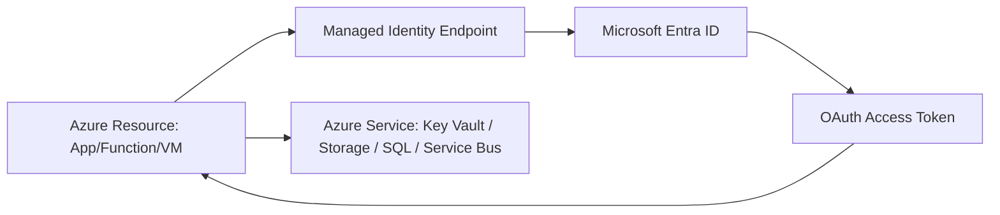
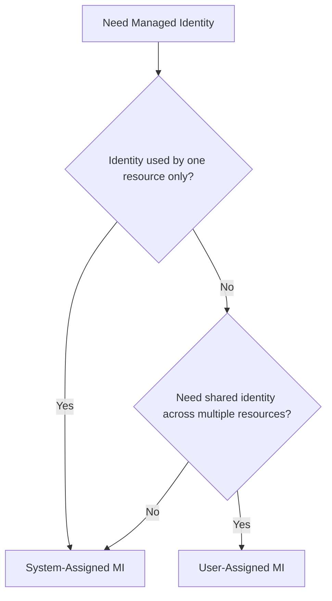
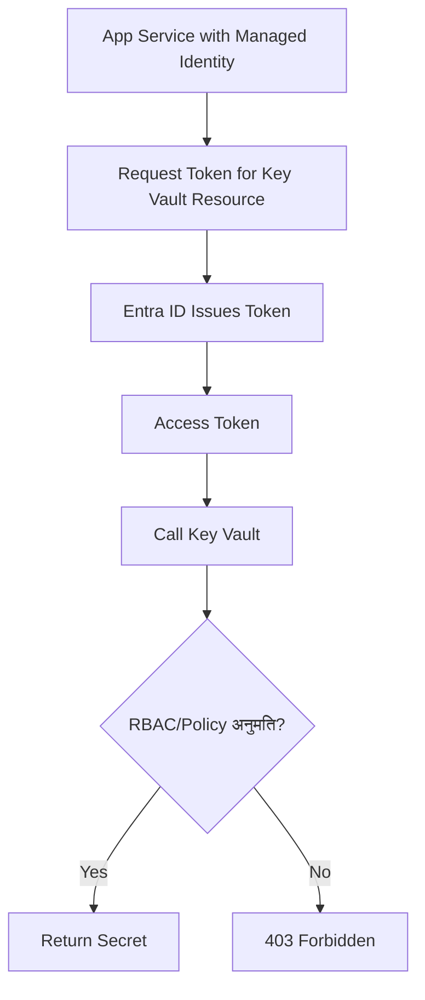
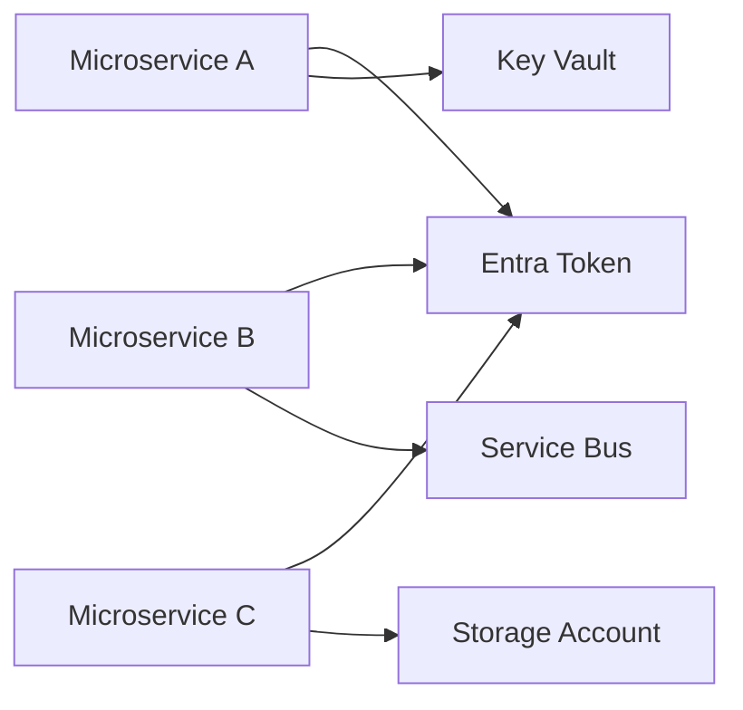
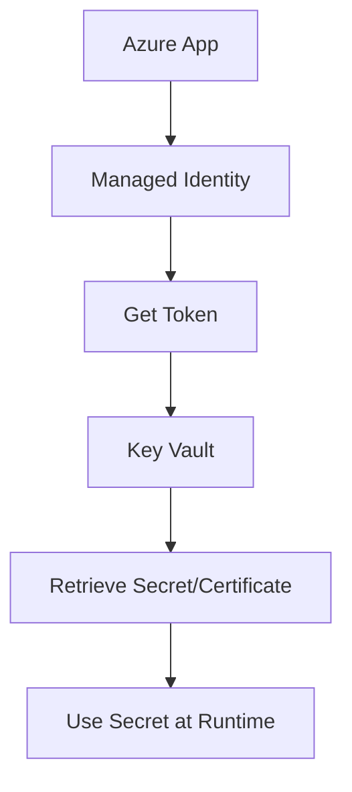

# What Is Managed Identity in Azure?
## Detailed Interview Preparation Guide with Flow Charts

---

## 1) Direct Interview Answer

**Managed Identity** is an Azure feature that gives an Azure resource (like App Service, VM, Function, AKS workload, Logic App, etc.) an automatically managed identity in Microsoft Entra ID, so it can securely authenticate to other services **without storing credentials in code**.

> One-liner: *Managed Identity is passwordless service-to-service authentication for Azure resources.*

---

## 2) Why Managed Identity Is Needed

Without Managed Identity:
- Apps store secrets (client secrets/certs) in config files or Key Vault bootstrap chains
- Secret rotation is operationally heavy
- Credential leaks are more likely
- Auditing service identities is harder

With Managed Identity:
- No embedded credentials in app code
- Azure manages credential lifecycle
- Token-based access via Entra ID
- Cleaner least-privilege access model

---

## 3) High-Level Authentication Flow

---

## 4) Core Concept

Managed Identity = **Service Principal managed by Azure** and bound to an Azure resource.

The app asks Azure Instance Metadata/identity endpoint for a token at runtime, then uses that token to call target services.

No username/password/API key needs to be stored in the app.

---

## 5) Types of Managed Identity

## 5.1 System-Assigned Managed Identity
- Created and tied to one Azure resource
- Lifecycle linked to that resource
- Deleted automatically when resource is deleted
- Good default for single-resource identity

## 5.2 User-Assigned Managed Identity
- Separate standalone Azure identity resource
- Can be attached to multiple Azure resources
- Independent lifecycle from compute resources
- Useful for identity reuse and controlled lifecycle

---

## 6) Type Selection Flow Chart

---

## 7) Managed Identity vs Service Principal (Interview Clarity)

| Aspect | Managed Identity | Traditional Service Principal |
|---|---|---|
| Credential management | Azure-managed | You manage secret/cert |
| Secret rotation | Automatic/managed | Manual/operational burden |
| Credential storage in app | Not needed | Usually required |
| Best for Azure-hosted workloads | Excellent | Possible but heavier |
| Cross-cloud/on-prem use | Limited by context | More general-purpose |

Interview phrase:
> Managed Identity is the preferred Azure-native option because it removes secret management overhead.

---

## 8) End-to-End Access Flow (Key Vault Example)

---

## 9) Authorization Model with Managed Identity

Authentication answers: “Who are you?”  
Authorization answers: “What can you access?”

You still must grant permissions:
- Azure RBAC role assignments
- Resource-specific access policies (service-dependent)

Principle:
- Grant minimum required permissions only

---

## 10) Common Services Accessed Using Managed Identity

- Azure Key Vault
- Azure Storage
- Azure SQL (with Entra integration patterns)
- Service Bus
- Event Hubs
- Cosmos DB
- App Configuration
- Azure Resource Manager APIs

---

## 11) Managed Identity in Microservices

Each service can have:
- Its own identity (strong isolation), or
- Shared user-assigned identity (selective scenarios)

---

## 12) Security Benefits

1. Eliminates plaintext secrets in code/config  
2. Reduces credential leakage attack surface  
3. Supports least-privilege access design  
4. Improves auditability (identity-based logs)  
5. Simplifies rotation/credential lifecycle operations  

---

## 13) Operational Benefits

- Faster onboarding of app-to-service auth
- Lower secrets-management toil
- Easier CI/CD security posture
- Cleaner incident response (disable role assignment vs rotating many secrets)

---

## 14) Managed Identity + Key Vault Pattern (Most Common Interview Topic)

This is a standard enterprise baseline pattern.

---

## 15) System-Assigned vs User-Assigned (Deeper Guidance)

Use **system-assigned** when:
- One app/resource needs one identity
- Simplicity is preferred
- Lifecycle coupling is acceptable

Use **user-assigned** when:
- Multiple resources need same identity
- You need identity lifecycle independent of compute
- You want predictable identity reuse across deployments

---

## 16) Network + Identity Defense in Depth

Managed Identity secures *who* can call.  
Also secure *where* calls can come from:
- Private endpoints
- VNet restrictions
- Firewall rules
- Conditional access/security monitoring (as applicable)

---

## 17) Common Mistakes (Interview Gold)

1. Enabling managed identity but forgetting authorization role assignment  
2. Granting overly broad roles (e.g., subscription-wide for app needing one vault secret)  
3. Sharing one identity across unrelated apps without justification  
4. Assuming managed identity removes need for network controls  
5. Not monitoring identity-based access logs  
6. Overusing user-assigned identity where system-assigned is simpler  

---

## 18) Troubleshooting Mindset

If access fails:
1. Confirm managed identity enabled on resource  
2. Confirm correct identity type in app configuration  
3. Confirm token audience/resource scope is correct  
4. Confirm RBAC/access policy on target resource  
5. Check deny assignments/network restrictions  
6. Inspect Entra/resource diagnostic logs  

---

## 19) Interview Q&A (Strong Answers)

### Q1: What is Managed Identity?
**Answer:** An Azure-managed identity for Azure resources that enables secure token-based access to other services without storing credentials.

### Q2: Why is it better than client secrets?
**Answer:** No hardcoded credentials, reduced leak risk, and no manual secret rotation burden.

### Q3: Difference between system-assigned and user-assigned?
**Answer:** System-assigned is tied to one resource lifecycle; user-assigned is standalone and reusable across multiple resources.

### Q4: Does enabling managed identity automatically grant access to Key Vault?
**Answer:** No. You must still assign appropriate authorization permissions (RBAC/access policy).

### Q5: Is Managed Identity only for Key Vault?
**Answer:** No. It can be used with many Azure services that support Entra-based authentication.

### Q6: Can managed identity replace all security controls?
**Answer:** No. It should be combined with least privilege, network isolation, monitoring, and governance controls.

---

## 20) 60-Second Interview Pitch

> Managed Identity is Azure’s built-in way to give resources an Entra identity so they can authenticate to services like Key Vault, Storage, SQL, or Service Bus without storing secrets in code. At runtime, the app requests a token from Azure’s identity endpoint and uses that token to access target services. I then apply least-privilege RBAC on the target resource. I choose system-assigned identity for simple one-resource scenarios and user-assigned identity when I need shared or lifecycle-independent identities. This pattern significantly improves security posture and reduces credential management overhead.

---

## 21) Final Checklist

- [ ] Understand what Managed Identity is  
- [ ] Explain token-based flow via Entra ID  
- [ ] Know system-assigned vs user-assigned differences  
- [ ] Emphasize no secrets in code  
- [ ] Mention RBAC still required  
- [ ] Mention common use with Key Vault  
- [ ] Mention defense-in-depth with network + monitoring  

---

## One-Line Conclusion

> Managed Identity provides secure, passwordless, Azure-managed service identity so applications can access Azure resources without storing credentials.