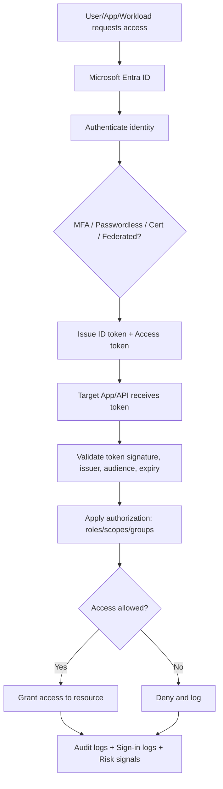
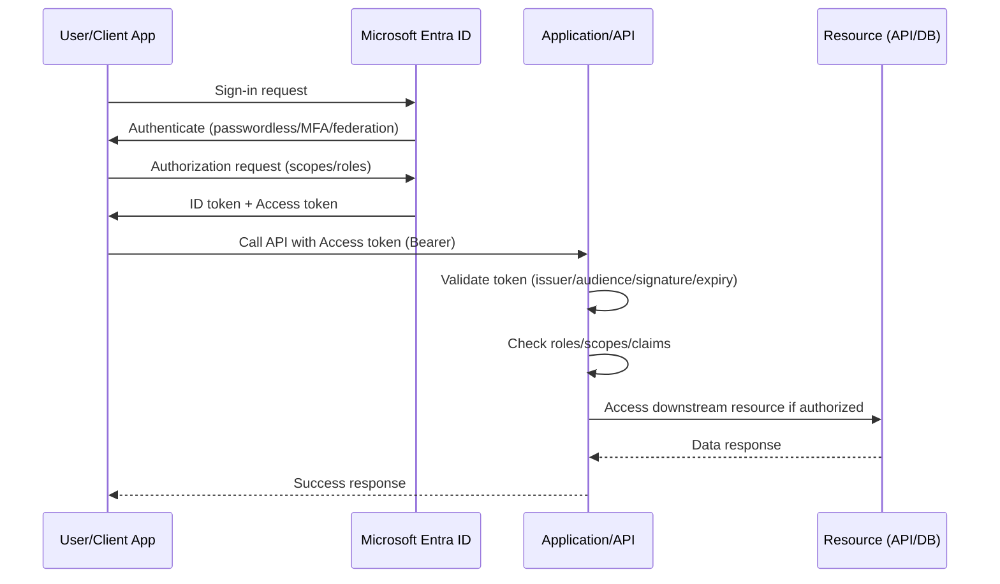

# What is Azure Entra ID?  
_Interview Preparation Guide (with flow chart)_

> **Current name:** **Microsoft Entra ID** (previously called **Azure Active Directory / Azure AD**).

---

## 1) Short Interview Answer (30–60 seconds)

**Microsoft Entra ID** is Microsoft’s cloud-based **Identity and Access Management (IAM)** service.  
It authenticates users, applications, and workloads, then authorizes access to resources using policies like **RBAC**, **Conditional Access**, and **Zero Trust** controls.  
It supports **Single Sign-On (SSO)**, **Multi-Factor Authentication (MFA)**, external identities (B2B/B2C capabilities), and secure app-to-app authentication using OAuth 2.0/OpenID Connect/SAML.

---

## 2) Simple Mental Model

Entra ID answers 3 core questions:

1. **Who are you?** → Authentication (password, MFA, passwordless, certificates, tokens)  
2. **What can you access?** → Authorization (roles, groups, app permissions, RBAC)  
3. **Under what conditions?** → Conditional Access (device compliance, location, risk, session controls)

---

## 3) High-Level Architecture Flow

---

## 4) Why Entra ID Is Important

- Centralized identity platform for Microsoft 365, Azure, and enterprise apps
- Enables secure access for:
  - Employees
  - Partners (B2B)
  - Customers/consumers (via External ID scenarios)
  - Applications and services
- Critical for Zero Trust architecture:
  - Verify explicitly
  - Least privilege
  - Assume breach

---

## 5) Core Concepts You Must Know for Interviews

## A) Tenant
A dedicated Entra ID instance for an organization.  
Contains users, groups, applications, policies, and identities.

## B) Identity Types
- Human users
- Service principals (application identities)
- Managed identities (Azure resources)
- Guest users (external collaborators)

## C) App Registration
Defines an application in Entra ID:
- Client ID (Application ID)
- Redirect URIs
- Certificates/secrets
- API permissions
- Exposed scopes/app roles

## D) Service Principal
The runtime/security identity of an app in a tenant.  
Think: app definition (registration) vs tenant-local instance (service principal).

## E) Tokens
- **ID Token**: who user is (for sign-in)
- **Access Token**: permission to call APIs
- **Refresh Token**: obtain new tokens without interactive login

## F) Protocols
- OAuth 2.0 (authorization)
- OpenID Connect (authentication layer over OAuth2)
- SAML 2.0 (enterprise SSO legacy/common integrations)

---

## 6) Authentication and Authorization Flow (Detailed)

---

## 7) Security Features Interviewers Ask About

## Conditional Access
Policy engine to enforce:
- MFA requirements
- Device compliance
- Allowed locations/IP ranges
- App/session restrictions
- Risk-based controls

## MFA and Passwordless
- Authenticator app
- FIDO2 security keys
- Windows Hello for Business
- Passkeys (where supported)

## Identity Protection
Risk detections (impossible travel, leaked credentials signals, suspicious behavior) and automated remediation policies.

## Privileged Identity Management (PIM)
Just-in-time privileged role elevation with approval/time-bound activation.

## Access Reviews
Periodic recertification of user/group/app access.

---

## 8) Entra ID and Azure RBAC (Common Confusion)

- **Entra ID** = identity provider and policy/identity control plane.
- **Azure RBAC** = authorization model for Azure resource management.
- RBAC role assignments reference Entra identities (users/groups/service principals/managed identities).

Example:
- Entra identity authenticates first.
- Azure checks RBAC role at subscription/resource scope.
- Access granted or denied.

---

## 9) Managed Identity (Very Important for Cloud Interviews)

Managed identity is an Entra-backed identity for Azure resources (VM, App Service, Functions, AKS, etc.) so apps can authenticate without storing credentials.

Benefits:
- No secrets in code
- Automatic credential lifecycle management
- Works well with Key Vault, Storage, SQL, Service Bus, etc.

---

## 10) Common Use Cases

1. Employee SSO to SaaS apps (Salesforce, ServiceNow, custom apps)
2. Securing custom web APIs with OAuth2 access tokens
3. B2B collaboration with external partner accounts
4. Workload identity for CI/CD and cloud-native apps
5. Conditional Access enforcement for risky sign-ins
6. Centralized audit and compliance reporting

---

## 11) Typical Interview Questions + Strong Answers

## Q1: Is Entra ID the same as Active Directory Domain Services?
**Answer:** No.  
AD DS is traditional on-prem directory/domain service (Kerberos/LDAP, domain join, GPO).  
Entra ID is cloud IAM with token-based modern auth for cloud apps/APIs.

## Q2: Difference between app registration and enterprise application?
**Answer:**  
App registration = application definition/developer configuration.  
Enterprise application = service principal representation used for access control in a tenant.

## Q3: How does Entra ID support Zero Trust?
**Answer:**  
By continuous verification, conditional access, MFA/passwordless, least privilege, risk-based policy, and strong monitoring/audit.

## Q4: What token does an API validate?
**Answer:**  
Access token (audience = API, correct issuer/signature/expiration/scopes/roles).

---

## 12) Common Misconfigurations to Mention

- Over-permissive app API permissions
- Long-lived client secrets not rotated
- Missing MFA for privileged accounts
- Conditional Access exclusions too broad
- Not validating token audience/issuer in APIs
- Using shared admin accounts instead of PIM/JIT

---

## 13) Best Practices Checklist

- [ ] Enforce MFA (especially admins)
- [ ] Prefer passwordless and phishing-resistant auth
- [ ] Use Conditional Access baseline policies
- [ ] Apply least privilege and role separation
- [ ] Use managed identities for Azure workloads
- [ ] Rotate secrets/certs and prefer certificates over client secrets
- [ ] Enable sign-in and audit log monitoring
- [ ] Use PIM for privileged roles
- [ ] Review guest and app access periodically

---

## 14) One-Minute “Perfect Interview Answer”

> “Microsoft Entra ID, formerly Azure AD, is Microsoft’s cloud IAM platform. It handles authentication and authorization for users, apps, and workloads using standards like OAuth2 and OpenID Connect. It enables SSO, MFA, Conditional Access, and Zero Trust controls. In Azure architectures, Entra identities map to RBAC roles for resource access. For cloud-native security, we use managed identities to eliminate stored credentials and combine this with least privilege, monitoring, and periodic access reviews.”

---

## 15) Quick Revision Table

| Topic | What to Remember |
|---|---|
| New Name | Microsoft Entra ID (formerly Azure AD) |
| Core Role | Cloud Identity and Access Management |
| Protocols | OAuth2, OIDC, SAML |
| Security Controls | MFA, Conditional Access, Identity Protection, PIM |
| Workload Auth | Service Principals, Managed Identities |
| Azure Authorization | Azure RBAC uses Entra identities |

---

## 16) Static Site Placement

Suggested file path:

`/docs/azure-entra-id-interview-guide.md`

Compatible with:
- Docusaurus
- MkDocs
- Jekyll
- Hugo
- Docsify