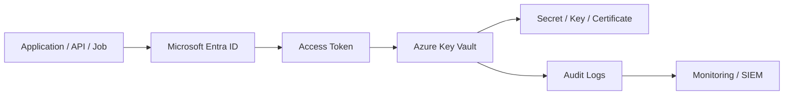
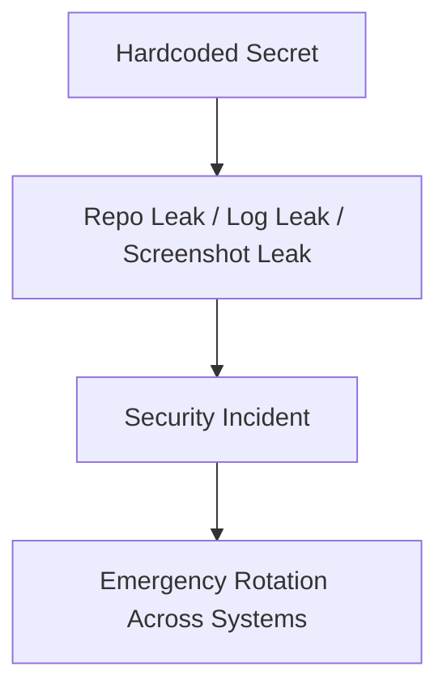
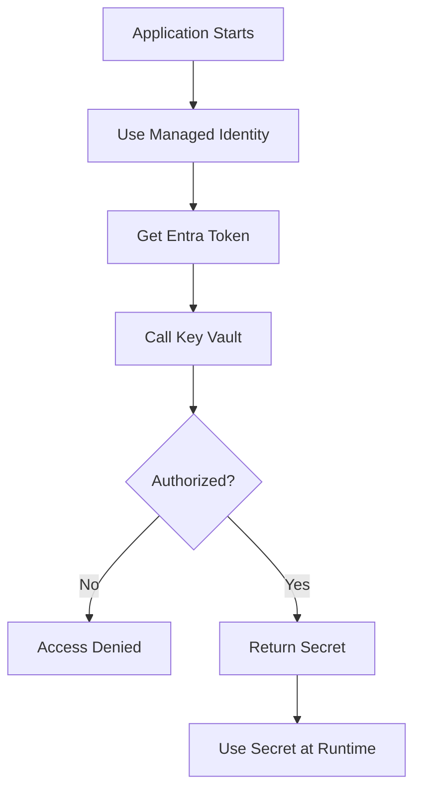
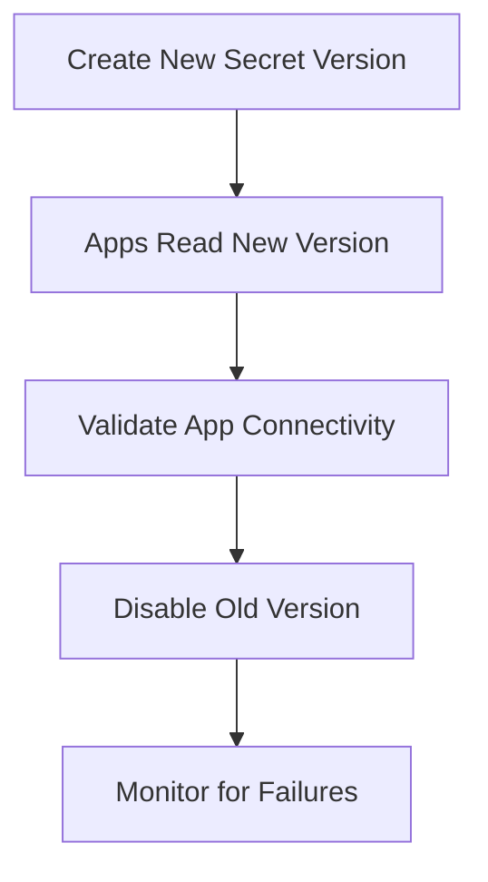
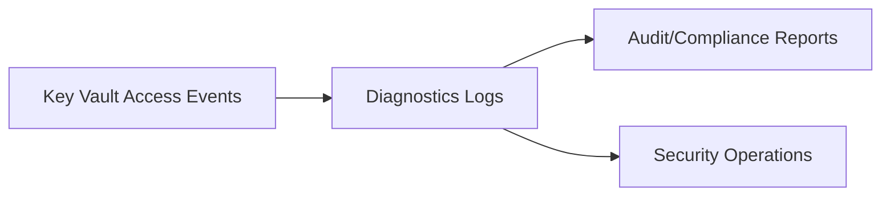

# Why Use Azure Key Vault?
## Detailed Interview Preparation Guide with Flow Charts

---

## 1) Direct Interview Answer

Use **Azure Key Vault** to securely store and control access to sensitive data like **secrets, cryptographic keys, and certificates** instead of hardcoding them in source code, config files, or pipelines.

It helps you:

1. Protect secrets centrally
2. Enforce least-privilege access
3. Rotate secrets/keys/certs safely
4. Audit access for compliance
5. Reduce credential leakage risk
6. Integrate securely with Azure services using managed identity

> One-liner: *Use Key Vault to externalize and govern secrets, keys, and certificates with strong security and auditability.*

---

## 2) The Core Problem Key Vault Solves

Without Key Vault:
- Secrets get embedded in code/repos
- Teams share long-lived credentials
- Rotation is manual and risky
- Access tracking is weak
- Incident response is slow during key compromise

With Key Vault:
- Sensitive values are centralized and protected
- Access is identity-based and tightly scoped
- Rotation can be structured/automated
- Every access can be logged and monitored

---

## 3) High-Level Value Flow



---

## 4) Top Reasons to Use Key Vault (Interview Must-Know)

## 4.1 Centralized Secret Management
Store sensitive values in one controlled system instead of scattered across code and configs.

## 4.2 Strong Access Control
Grant permissions to identities (users/apps/services) using least privilege.

## 4.3 Safer Secret Rotation
Use versioning and controlled rollout for passwords, keys, and certificates.

## 4.4 Audit and Compliance
Track who accessed what and when.

## 4.5 Managed Identity Integration
Azure services can access vault securely without storing credentials.

## 4.6 Reduced Blast Radius
Compromise of one app identity doesn’t expose all secrets when permissions are scoped properly.

---

## 5) Why Not Keep Secrets in App Settings / Code?



Problems:
- Secrets copied across environments
- Developers accidentally expose values
- Rotation requires risky redeploys
- Hard to prove compliance during audits

Key Vault avoids these anti-patterns.

---

## 6) Runtime Secret Retrieval Pattern



This keeps secrets out of code and deployment artifacts.

---

## 7) Security Layers with Key Vault

```mermaid
flowchart TD
    L1[Identity Authentication] --> L2[Authorization (Least Privilege)]
    L2 --> L3[Network Restriction]
    L3 --> L4[Secret/Key Versioning]
    L4 --> L5[Monitoring + Alerts]
```

Interview phrase:
> Key Vault is not just storage—it is a controlled security boundary with identity, policy, network, and auditing layers.

---

## 8) Key Vault in Real Architectures

## 8.1 App + Database Credentials
- App gets DB secret from Key Vault
- DB password never stored in code

## 8.2 APIM + Backend Credentials
- APIM retrieves certificates/secrets from Key Vault
- Centralized cert governance

## 8.3 CI/CD Secure Deployments
- Pipelines fetch runtime secrets from vault references
- No plaintext in pipeline variables

---

## 9) Secret Rotation Workflow



Benefits:
- Controlled transition
- Lower downtime risk
- Better incident response readiness

---

## 10) Why Key Vault for Certificates?

Certificates are sensitive lifecycle assets:
- Need secure storage
- Need controlled access
- Need expiry/renewal governance

Key Vault helps centralize these controls and reduce operational mistakes.

---

## 11) Why Key Vault for Cryptographic Keys?

For encryption/signing scenarios:
- Protect keys in managed boundary
- Control who can use key operations
- Rotate/revoke keys with governance
- Improve auditability of key usage

---

## 12) Compliance and Audit Benefits

Key Vault helps satisfy common security/compliance needs:
- Access logging
- Separation of duties
- Least privilege controls
- Secret rotation evidence
- Incident investigation trails



---

## 13) Operational Benefits

- Faster credential revocation during incidents
- Cleaner environment separation (dev/test/prod)
- Easier onboarding/offboarding of apps/teams
- Standardized secret naming and lifecycle practices

---

## 14) Cost vs Risk Perspective (Interview Angle)

Even if teams ask about cost:
- Secret leaks and outages are far more expensive
- Key Vault reduces probability and impact of credential incidents
- Centralized controls reduce long-term operational/security overhead

---

## 15) Key Vault vs Alternatives (Quick Comparison)

| Approach | Security Posture | Rotation Ease | Auditability |
|---|---|---|---|
| Hardcoded in code | Poor | Hard | Poor |
| Plain config files | Weak | Medium/Hard | Weak |
| Pipeline secret variables only | Better but limited governance | Medium | Medium |
| Azure Key Vault | Strong | Strong | Strong |

---

## 16) Common Mistakes (Interview Gold)

1. Storing secrets in Git repositories  
2. Sharing one high-privilege secret across many apps  
3. Granting broad vault access (no least privilege)  
4. No secret rotation schedule  
5. No monitoring for unauthorized access attempts  
6. Allowing unrestricted network access to vault  
7. Using Key Vault for non-sensitive config indiscriminately  

---

## 17) Best Practices Checklist

- [ ] Use managed identity for app-to-vault auth  
- [ ] Apply least-privilege RBAC/access controls  
- [ ] Separate environments with clear governance boundaries  
- [ ] Enable diagnostics and alerting  
- [ ] Rotate secrets/keys/certs regularly  
- [ ] Restrict network access to vault  
- [ ] Use secret versioning for controlled rollouts  
- [ ] Document break-glass and incident rotation runbooks  

---

## 18) Interview Q&A (Strong Answers)

### Q1: Why use Key Vault instead of appsettings?
**Answer:** Key Vault provides secure centralized storage, identity-based access, rotation, and auditing; appsettings can be exposed and are harder to govern.

### Q2: How does Key Vault improve security?
**Answer:** It removes secrets from code, enforces least-privilege identity access, supports network restrictions, and logs all sensitive access operations.

### Q3: Why is managed identity important with Key Vault?
**Answer:** It eliminates hardcoded credentials for secret retrieval and enables secure token-based access from Azure resources.

### Q4: How does Key Vault help in incidents?
**Answer:** You can quickly rotate/revoke compromised secrets centrally and monitor access attempts during containment.

### Q5: Is Key Vault only for secrets?
**Answer:** No. It also manages cryptographic keys and certificates with lifecycle governance.

### Q6: What’s the biggest enterprise value?
**Answer:** Reduced credential risk + auditable governance at scale across applications and teams.

---

## 19) 60-Second Interview Pitch

> I use Azure Key Vault to keep secrets, keys, and certificates out of code and centralized in a managed security boundary. Applications authenticate using managed identities, retrieve only what they’re authorized for, and all access is logged for audit. Key Vault also supports versioning and rotation, which is critical for credential hygiene and incident response. In enterprise systems, this gives consistent least-privilege controls, stronger compliance posture, and significantly lower risk of secret leakage.

---

## 20) Final One-Line Conclusion

> Use Azure Key Vault to centralize, secure, rotate, and audit access to secrets, keys, and certificates using identity-based, least-privilege controls.