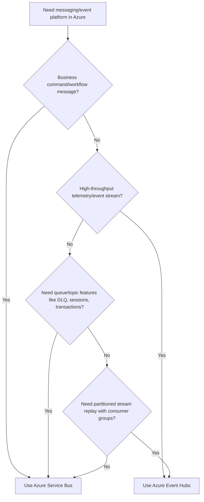
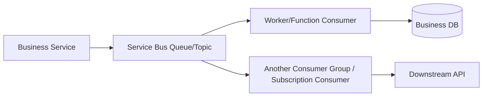
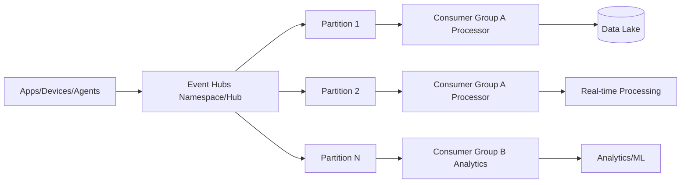
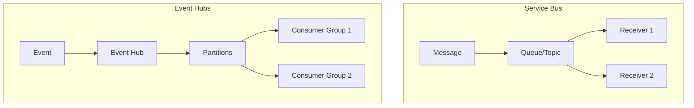
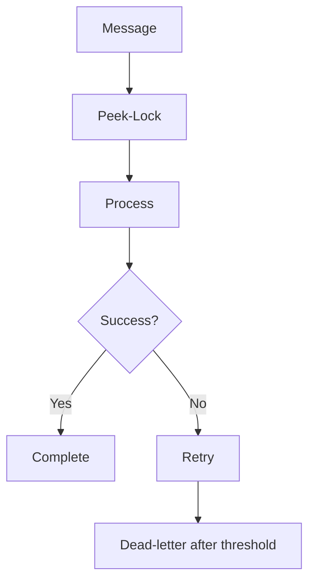
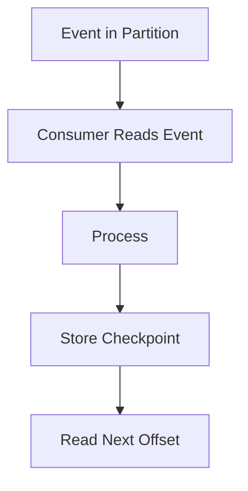
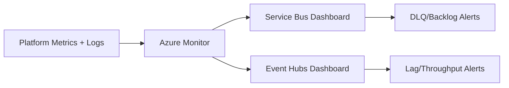
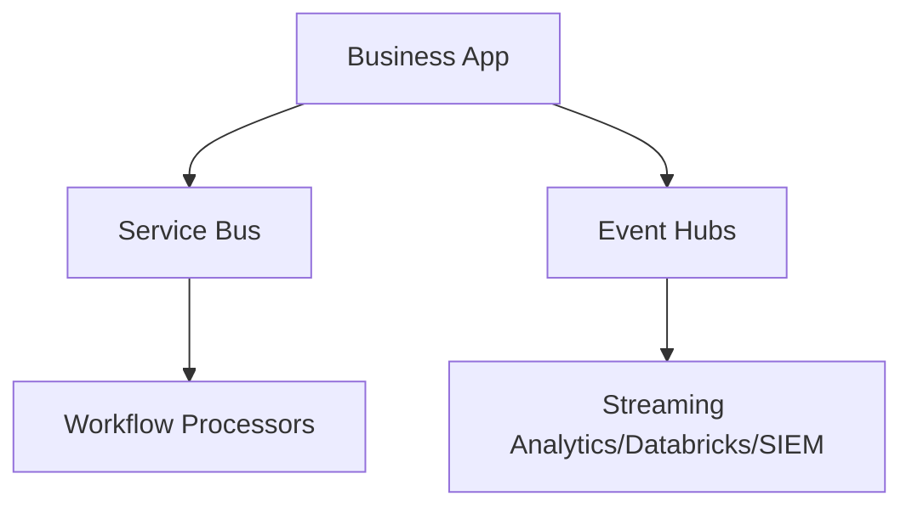

# Azure Service Bus vs Azure Event Hubs  
## Detailed Interview Preparation Guide with Flow Charts

## 1) Quick Interview Answer

Use **Azure Service Bus** for **enterprise messaging** (commands, workflows, reliable delivery, retries, dead-lettering, transactions, ordered processing with sessions).

Use **Azure Event Hubs** for **high-throughput event streaming/telemetry ingestion** (millions of events, partitioned stream processing, analytics pipelines, IoT data ingestion).

> One-liner: *Service Bus is a message broker for business workflows; Event Hubs is a big-data event streaming platform.*

---

## 2) Core Mindset Difference

- **Service Bus** = “Please process this business message/command reliably.”
- **Event Hubs** = “Here is a continuous stream of events/telemetry; consume at scale.”

---

## 3) High-Level Decision Flow Chart

---

## 4) What is Azure Service Bus?

Azure Service Bus is a **managed enterprise message broker** with:
- Queues (point-to-point)
- Topics/Subscriptions (pub-sub)
- Dead-letter queue (DLQ)
- Message locks (peek-lock)
- Duplicate detection
- Scheduled/deferred messages
- Sessions (ordered processing)
- Transactions (in supported scenarios)

Best for:
- Order workflows
- Payment commands
- Background business processing
- Reliable asynchronous integration between services

---

## 5) What is Azure Event Hubs?

Azure Event Hubs is a **high-scale event ingestion and streaming platform** designed for:
- Massive telemetry ingestion
- Log/clickstream/event pipelines
- IoT event ingestion
- Real-time and batch analytics backends

Core concepts:
- Partitions
- Consumer groups
- Offsets/checkpoints
- Throughput units/capacity
- Stream retention window

Best for:
- IoT sensor data
- App telemetry streams
- Security logs
- Real-time analytics ingestion

---

## 6) Architecture Flow Comparison

## 6.1 Service Bus Flow (Brokered Messaging)

Focus: reliable business processing semantics.

---

## 6.2 Event Hubs Flow (Streaming)

Focus: scale, partitioning, parallel stream consumption.

---

## 7) Detailed Feature Comparison Table

| Area | Azure Service Bus | Azure Event Hubs |
|---|---|---|
| Primary Purpose | Enterprise message brokering | Event streaming ingestion |
| Data Type | Business commands/messages | Telemetry/event streams |
| Messaging Model | Queue + Topic/Subscription | Partitioned append-only event log |
| Delivery Handling | Broker-centric message settlement | Consumer-managed offsets/checkpoints |
| Ordering | Sessions (entity/key scoped ordering) | Order guaranteed within partition |
| Replay Model | Typical queue semantics; retry/DLQ patterns | Native stream replay from offsets |
| Consumer Pattern | Competing consumers, subscriptions | Consumer groups with independent read positions |
| Dead-letter Support | Built-in DLQ | No equivalent DLQ semantics like Service Bus |
| Transactions | Supported scenarios | Not broker-style transaction focus |
| Duplicate Detection | Built-in capability | Producer/consumer design responsibility |
| Throughput Scale | Business workflow scale | Very high streaming scale |
| Typical Latency Focus | Reliable processing | High-ingestion streaming pipelines |
| Best Use Case | Commands/workflows | Telemetry analytics pipelines |

---

## 8) Queue/Topic vs Partition/Consumer Group

## Service Bus model:
- Queue/topic entities hold messages
- Broker tracks locks, delivery count, DLQ
- Consumers settle (complete/abandon/dead-letter)

## Event Hubs model:
- Events appended to partitions
- Consumers track offsets/checkpoints
- Multiple consumer groups read same stream independently

---

## 9) Reliability Model Differences

## Service Bus Reliability
- Peek-lock processing
- Retry handling
- Delivery count
- Dead-letter queue
- Durable broker semantics for business workflows

## Event Hubs Reliability
- Durable event retention window
- Replay from offsets
- Checkpointing by consumers
- At-least-once processing patterns via consumer logic

### Reliability Flow (Service Bus)

### Reliability Flow (Event Hubs)

---

## 10) Ordering and Parallelism

## Service Bus
- Ordering can be managed with sessions
- Great for workflow-by-entity ordering

## Event Hubs
- Ordering guaranteed per partition
- Parallelism by increasing partitions + consumers

Interview phrase:
> If strict entity-level ordered business processing is needed, Service Bus sessions are typically a better fit; if large-scale partitioned stream throughput is needed, Event Hubs is better.

---

## 11) Throughput Perspective

- Service Bus is optimized for business integration reliability features
- Event Hubs is optimized for very high event ingress and stream processing throughput

Typical interview framing:
- Thousands of business messages with rich semantics → Service Bus
- Millions of telemetry events per second (architecture dependent) → Event Hubs

---

## 12) Security Comparison

Both integrate with:
- Microsoft Entra ID
- RBAC
- Managed identity
- Private networking options (plan/config dependent)
- TLS encryption

Best practice for both:
- Prefer identity-based auth over embedded secrets
- Restrict network surface
- Monitor unauthorized access patterns

---

## 13) Monitoring Focus Differences

## Service Bus Monitoring KPIs
- Active message count
- Dead-letter message count
- Queue/topic backlog
- Delivery failures
- Processing latency

## Event Hubs Monitoring KPIs
- Incoming/outgoing events
- Throughput utilization
- Partition lag
- Consumer lag by group
- Checkpoint delay

---

## 14) Use-Case Mapping

| Scenario | Better Choice | Why |
|---|---|---|
| Process customer order command | Service Bus | Reliable workflow messaging |
| Payment retry with DLQ needs | Service Bus | Built-in dead-letter semantics |
| Broadcast business event to many services | Service Bus Topic | Native pub-sub subscriptions |
| Ingest IoT sensor stream | Event Hubs | High-throughput streaming |
| Collect app logs/clickstream | Event Hubs | Stream ingestion + analytics |
| Real-time telemetry pipeline | Event Hubs | Partitioned consumer model |
| Command + event-driven microservice orchestration | Service Bus | Broker capabilities |

---

## 15) Hybrid Pattern (Very Practical)

Many systems use both:

- Service Bus for business commands/workflow messages
- Event Hubs for telemetry/analytics streams

---

## 16) Common Interview Questions + Strong Answers

### Q1: Service Bus vs Event Hubs in one sentence?
**Answer:** Service Bus is for reliable enterprise message workflows; Event Hubs is for high-scale event streaming ingestion.

### Q2: Which supports dead-letter queues?
**Answer:** Service Bus has built-in DLQ semantics; Event Hubs follows stream processing patterns instead.

### Q3: Which one for IoT telemetry?
**Answer:** Event Hubs, because it is optimized for high-throughput partitioned event ingestion.

### Q4: Which one for order processing commands?
**Answer:** Service Bus, due to queue/topic broker features, retries, settlement, and workflow reliability.

### Q5: Can Event Hubs replace Service Bus?
**Answer:** Not typically for business workflow messaging semantics; they solve different primary problems.

### Q6: Can Service Bus replace Event Hubs?
**Answer:** It can carry events, but it is not optimized for very large streaming telemetry ingestion like Event Hubs.

---

## 17) 60-Second Interview Pitch

> Azure Service Bus and Azure Event Hubs serve different architectural purposes. I use Service Bus for enterprise messaging workflows—commands, queues, topics/subscriptions, retries, dead-lettering, and ordered processing with sessions. I use Event Hubs for high-throughput telemetry/event ingestion where partitioned streams, consumer groups, and replay/checkpoint processing are key. In many enterprise systems, both are used together: Service Bus for transactional business workflows and Event Hubs for analytics and observability pipelines.

---

## 18) Final Summary

Choose **Service Bus** when you need:
- Business command/workflow reliability
- DLQ/retry/settlement semantics
- Topic/subscription enterprise pub-sub

Choose **Event Hubs** when you need:
- Massive event ingestion
- Partitioned stream processing
- Multiple independent analytics consumers via consumer groups

---

## One-Line Conclusion

> Service Bus is a reliable enterprise message broker; Event Hubs is a high-throughput event streaming platform—choose based on workflow semantics vs streaming scale requirements.