# Azure Service Bus: Queue vs Topic  
## Detailed Interview Preparation Guide with Flow Charts

## 1. Quick Interview Answer

An **Azure Service Bus Queue** is used for **point-to-point communication**, where one message is processed by one logical consumer.

An **Azure Service Bus Topic** is used for **publish-subscribe communication**, where one published message can be delivered independently to multiple subscriptions and consumers.

> **Choose a queue when one worker or one consumer group should process each message. Choose a topic when multiple independent services need their own copy of the same event.**

Azure Service Bus queues support reliable message queuing, while topics and subscriptions support durable publish-subscribe messaging. ([learn.microsoft.com](https://learn.microsoft.com/en-us/azure/service-bus-messaging/service-bus-queues-topics-subscriptions?wt.md_id=AZ-MVP-5004796&utm_source=openai))

---

## 2. One-Line Difference

```text
Queue:
    One message -> One logical consumer

Topic:
    One message -> Multiple independent subscriptions
```

---

## 3. High-Level Comparison Flow Chart

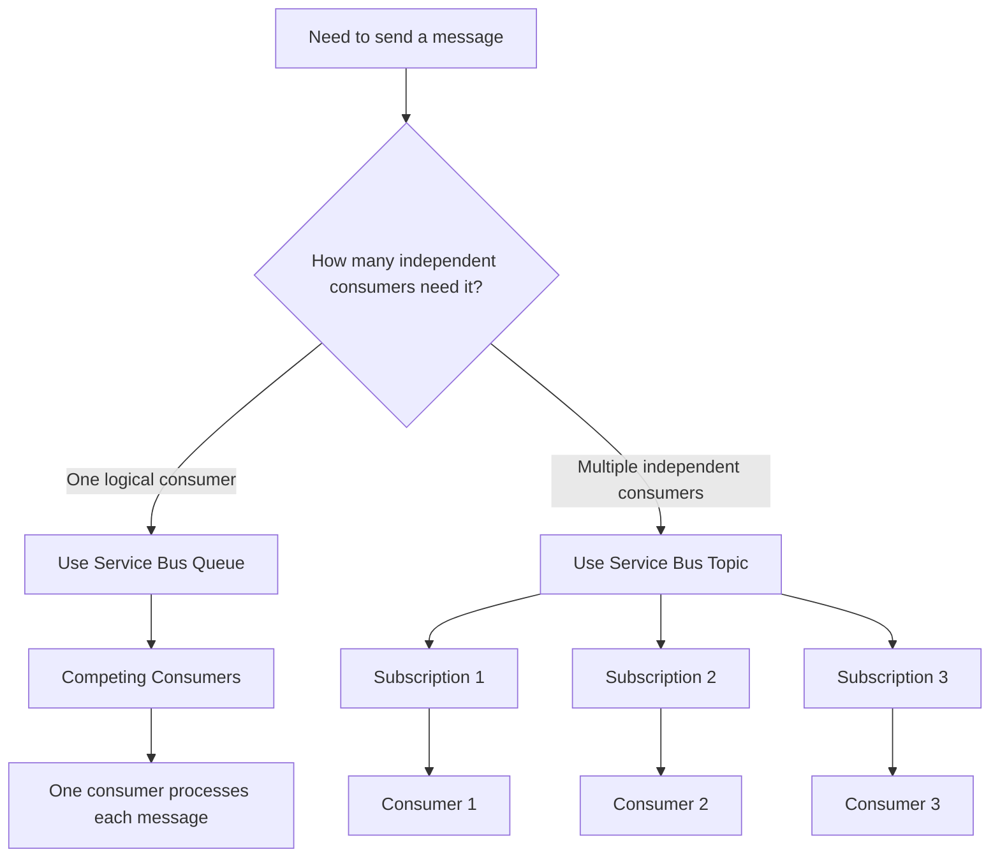

---

# 4. What Is an Azure Service Bus Queue?

A **queue** is a durable messaging entity where messages wait until a consumer receives and processes them.

A queue provides:

- Point-to-point communication
- Producer-consumer decoupling
- Asynchronous processing
- Load leveling
- Competing consumers
- Retry and dead-letter handling
- Temporary storage when consumers are unavailable

Only one consumer receives and processes a particular message from a queue under normal competing-consumer processing. ([learn.microsoft.com](https://learn.microsoft.com/en-us/azure/service-bus-messaging/service-bus-queues-topics-subscriptions?wt.md_id=AZ-MVP-5004796&utm_source=openai))

---

## 4.1 Queue Architecture

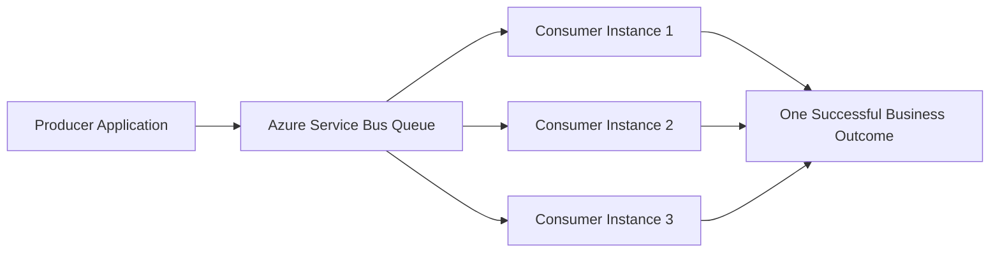

The consumers compete for available messages. Adding consumers can increase processing throughput, provided the downstream systems can handle the additional load.

---

## 4.2 Queue Example

### Scenario

An order API accepts orders and sends each order to a processing queue.

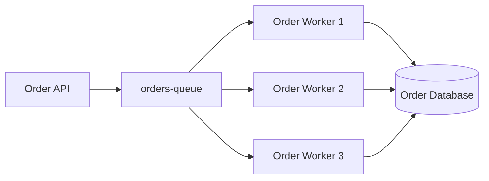

### Expected Behavior

If the queue receives one message:

```text
orders-queue
      |
      +-- Worker 1 receives it
      +-- Worker 2 does not receive the same message
      +-- Worker 3 does not receive the same message
```

The queue is appropriate when the message represents a task that should be completed once by one processing workflow.

---

# 5. What Is an Azure Service Bus Topic?

A **topic** is a messaging entity used for publish-subscribe communication.

A producer sends one message to the topic. The topic then makes that message available to each matching subscription.

Consumers read from subscriptions, not directly from the topic. A subscription behaves like a virtual queue for that subscriber. ([learn.microsoft.com](https://learn.microsoft.com/en-us/azure/service-bus-messaging/service-bus-queues-topics-subscriptions?WT.mc_id=AZ-MVP-5005172&utm_source=openai))

---

## 5.1 Topic Architecture

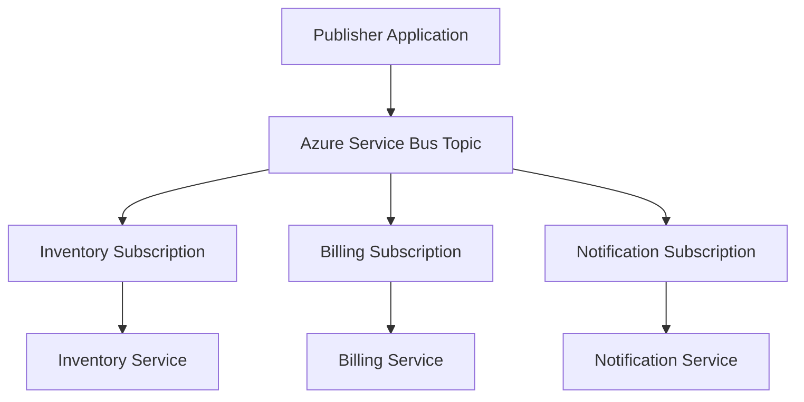

Each subscription can independently process its copy of the message.

---

## 5.2 Topic Example

### Scenario

An order is created, and multiple services need to react:

- Inventory service reserves stock
- Billing service processes payment
- Notification service sends an email
- Analytics service records the event

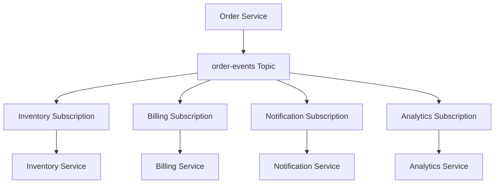

### Expected Behavior

```text
OrderCreated event
        |
        +-- Inventory subscription receives a copy
        +-- Billing subscription receives a copy
        +-- Notification subscription receives a copy
        +-- Analytics subscription receives a copy
```

A topic is appropriate when one business event must be consumed independently by multiple services.

---

# 6. Queue vs Topic: Core Comparison

| Feature | Queue | Topic |
|---|---|---|
| Communication pattern | Point-to-point | Publish-subscribe |
| Main purpose | Task distribution | Event broadcasting |
| Number of logical consumers | One consumer outcome | Multiple independent consumers |
| Message delivery | One message to one consumer | Message copy to each matching subscription |
| Consumer access | Consumers read directly from queue | Consumers read from subscriptions |
| Filtering | Not supported as topic-style subscription filtering | Supported through subscription rules and filters |
| Typical use case | Process an order once | Notify several services that an order was created |
| Scaling pattern | Competing consumers | Independent consumers per subscription |
| Coupling | Producer knows queue contract | Producer publishes event without knowing all consumers |
| Best architecture | Work queue | Event-driven fan-out |

Azure Service Bus topics support subscription filters and rules, allowing subscriptions to receive only selected messages. ([learn.microsoft.com](https://learn.microsoft.com/en-us/azure/service-bus-messaging/service-bus-queues-topics-subscriptions?wt.md_id=AZ-MVP-5004796&utm_source=openai))

---

# 7. Queue Processing Flow

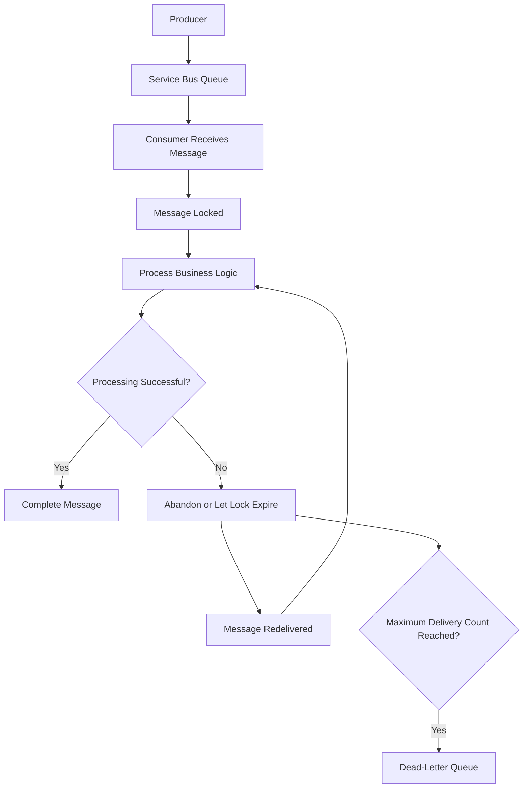

The common `PeekLock` mode lets a receiver process a message before explicitly completing it. If processing fails or the lock expires, the message can be delivered again. After repeated failures, the message can be moved to a dead-letter queue. ([learn.microsoft.com](https://learn.microsoft.com/en-us/azure/service-bus-messaging/message-transfers-locks-settlement?utm_source=openai))

---

# 8. Topic Processing Flow

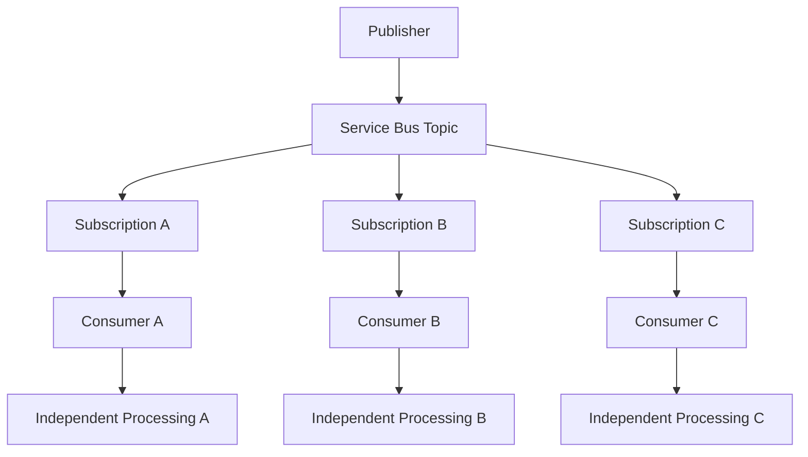

Each subscription has its own message lifecycle. One subscription can succeed while another fails or retries.

---

# 9. Queue Use Cases

Use a queue when:

1. A task should be processed by one logical consumer.
2. You need to distribute work among multiple worker instances.
3. You want to smooth traffic spikes.
4. The producer should not wait for the consumer.
5. You need background processing.
6. You want competing consumers for horizontal scale.
7. The message represents a command or work item.

## Examples

- Generate an invoice
- Resize an uploaded image
- Process one order
- Send one email
- Execute a background report
- Process a payment command
- Run a data transformation job

### Queue Mental Model

```text
"Please perform this task."
```

---

# 10. Topic Use Cases

Use a topic when:

1. Multiple services need the same event.
2. Consumers must process the event independently.
3. New consumers may be added later.
4. You want loose coupling between the publisher and subscribers.
5. Each consumer needs separate retry and dead-letter behavior.
6. You need filtering by event properties.
7. You are implementing event-driven microservices.

## Examples

- `OrderCreated`
- `PaymentCompleted`
- `CustomerRegistered`
- `ShipmentDispatched`
- `ProductPriceChanged`
- `InventoryLow`
- `UserSubscriptionRenewed`

### Topic Mental Model

```text
"Something happened."
```

---

# 11. Command vs Event

This distinction helps decide between a queue and a topic.

## Command

A command asks a specific consumer to perform an action.

```text
ProcessPayment
ReserveInventory
GenerateInvoice
```

Typical choice:

```text
Command -> Queue
```

## Event

An event announces that something has already happened.

```text
OrderCreated
PaymentCompleted
ShipmentDispatched
```

Typical choice:

```text
Event -> Topic
```

> This is a useful design guideline, not an absolute rule. The final choice depends on delivery, ownership, filtering, ordering, and reliability requirements.

---

# 12. Queue vs Topic Decision Tree

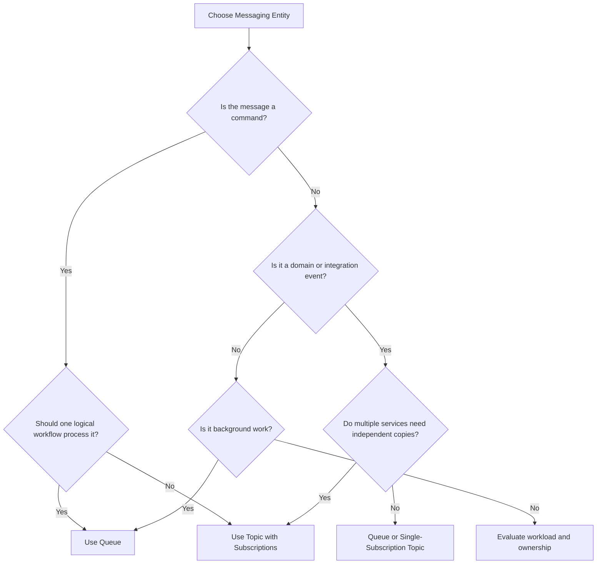

---

# 13. Scaling Comparison

## Queue Scaling

A queue scales by adding competing consumers.

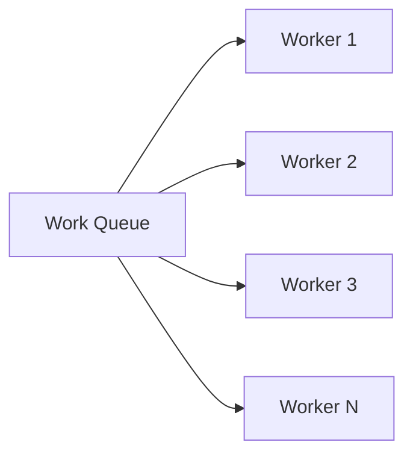

Use this when the goal is to increase throughput for one processing workflow.

## Topic Scaling

A topic scales by adding subscriptions and scaling consumers independently.

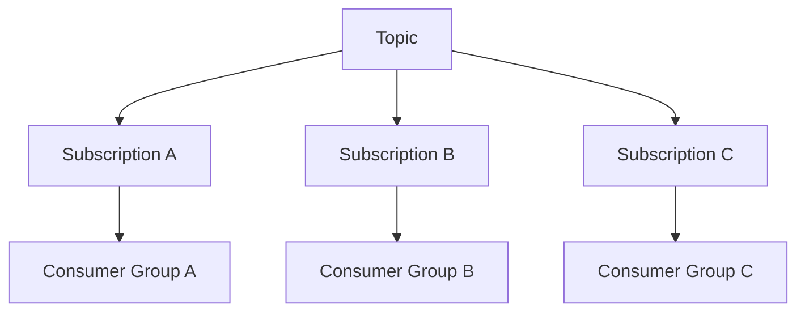

Each subscription can have its own:

- Number of consumers
- Retry behavior
- Dead-letter messages
- Processing speed
- Filtering rules
- Operational ownership

---

# 14. Subscription Filters

By default, a subscription can receive messages sent to a topic. Subscription filters can restrict which messages are copied into a subscription.

## Example Event Properties

```text
EventType = "OrderCreated"
Region = "US"
Priority = "High"
```

## Filtered Topic Flow

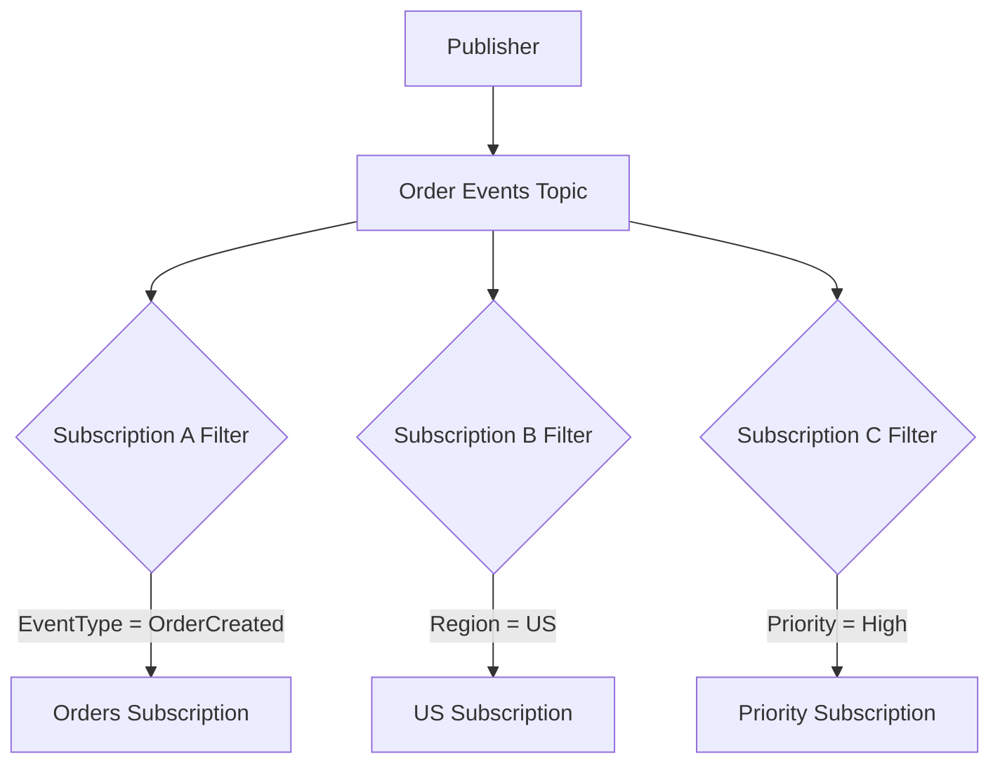

### Example

```text
Billing subscription:
    EventType = "OrderCreated"

Analytics subscription:
    EventType IN ("OrderCreated", "PaymentCompleted")

High-priority subscription:
    Priority = "High"
```

Subscription filters and rules are a major advantage of topics over simple queues. ([learn.microsoft.com](https://learn.microsoft.com/en-us/azure/service-bus-messaging/service-bus-queues-topics-subscriptions?WT.mc_id=AZ-MVP-5005172&utm_source=openai))

---

# 15. Reliability: Peek-Lock Processing

Both queues and topic subscriptions support common message settlement patterns.

## Peek-Lock Flow

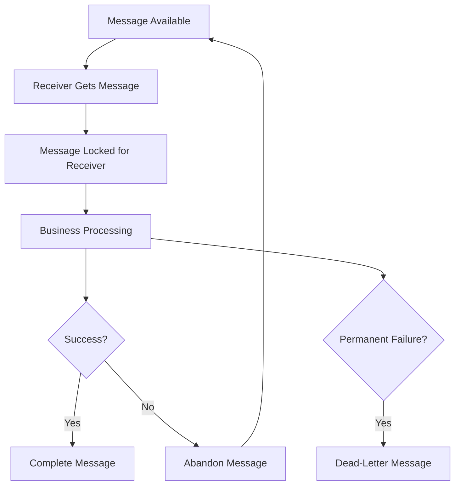

Use `PeekLock` when message loss is unacceptable. `ReceiveAndDelete` removes a message as soon as it is delivered and may lose the message if the consumer fails before processing it. ([learn.microsoft.com](https://learn.microsoft.com/en-us/azure/service-bus-messaging/message-transfers-locks-settlement?utm_source=openai))

---

# 16. Dead-Letter Queues

Queues and topic subscriptions can have associated dead-letter subqueues.

## Queue Dead-Letter Flow

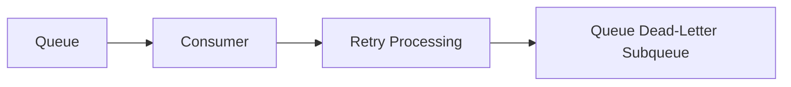

## Topic Dead-Letter Flow

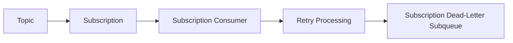

### Important Difference

For a topic, each subscription has its own processing lifecycle. Therefore, the billing subscription can dead-letter a message while the inventory subscription processes its copy successfully.

---

# 17. Duplicate Processing and Idempotency

Neither queues nor topics should be treated as guaranteed exactly-once business processing.

With `PeekLock`, a message can be redelivered if:

- The consumer crashes before completion.
- The lock expires.
- The completion operation fails.
- The connection is lost.
- The consumer restarts.

Design consumers to be idempotent by using:

- Message ID
- Business transaction ID
- Database uniqueness constraints
- Processed-message records
- Upsert operations
- Conditional updates

Microsoft recommends combining Peek-Lock, suitable lock handling, duplicate detection where useful, and idempotent consumers. ([learn.microsoft.com](https://learn.microsoft.com/en-us/azure/service-bus-messaging/message-transfers-locks-settlement?utm_source=openai))

---

# 18. Ordering

## Queue Ordering

A queue can support FIFO-style processing, but concurrency and configuration affect ordering behavior.

## Topic Ordering

Ordering is managed independently per subscription. If a subscriber requires ordered processing, use sessions and a session-aware consumer where appropriate.

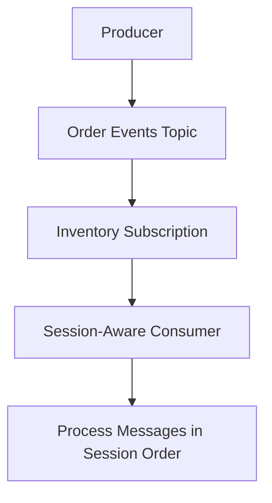

### Interview Answer

> If ordering matters, I explicitly design for it using Service Bus sessions, message grouping, and session-aware consumers. I do not assume that adding multiple consumers preserves global ordering.

---

# 19. Queue vs Topic in a Microservices Architecture

## Queue-Based Architecture

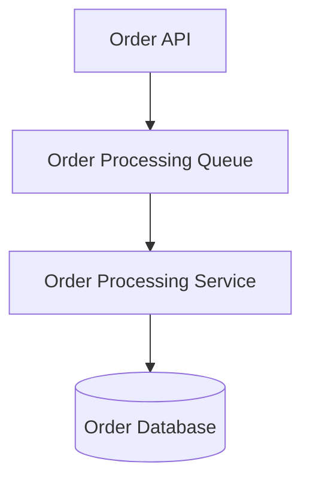

Use when one service owns the processing responsibility.

## Topic-Based Architecture

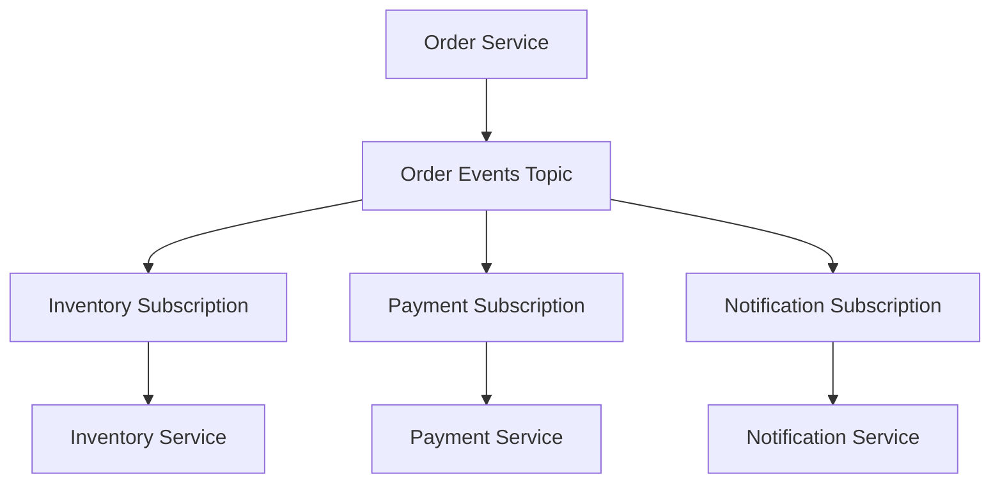

Use when multiple bounded contexts independently react to the same event.

---

# 20. Queue vs Topic in an Azure Functions Architecture

## Queue-Triggered Function

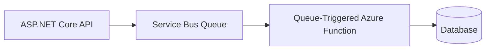

## Topic-Triggered Functions

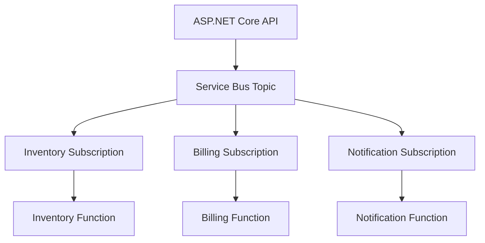

---

# 21. Cost and Operational Considerations

## Queue

A queue is simpler to operate when there is one processing workflow.

Consider:

- Queue depth
- Oldest message age
- Processing rate
- Retry count
- Dead-letter count
- Consumer availability

## Topic

A topic requires monitoring each subscription independently.

Consider:

- Topic publishing rate
- Subscription backlog
- Per-subscription processing latency
- Per-subscription dead-letter count
- Filter correctness
- Slow subscriber impact
- Subscription lifecycle and ownership

### Operational Flow

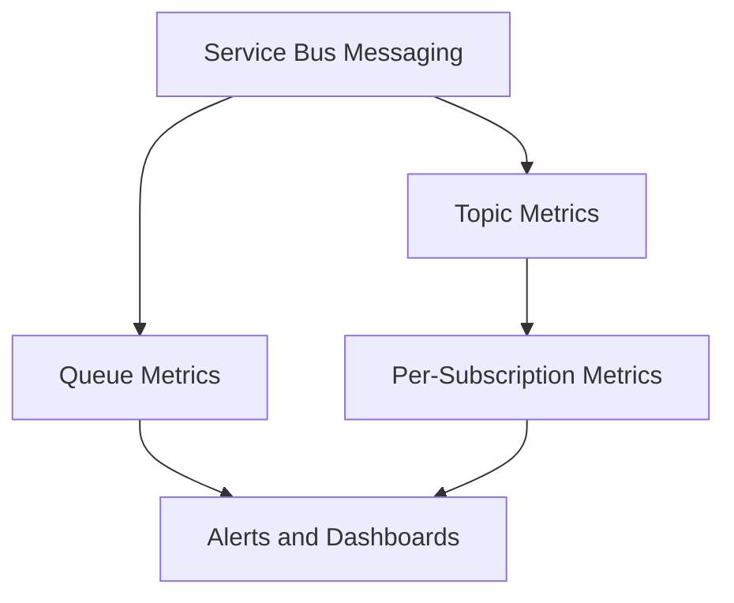

---

# 22. Common Anti-Patterns

## Anti-Pattern 1: Using a Queue When Multiple Services Need the Event

If multiple services consume the same queue, they compete for messages instead of each receiving a copy.

### Incorrect

```text
OrderCreated -> One Queue
                  |
                  +-- Inventory
                  +-- Billing
                  +-- Notifications
```

Only one consumer may receive a particular message.

### Better

```text
OrderCreated -> Topic
                  |
                  +-- Inventory Subscription
                  +-- Billing Subscription
                  +-- Notification Subscription
```

---

## Anti-Pattern 2: Using a Topic for One Simple Work Queue

If only one logical consumer needs the message, a queue is usually simpler.

---

## Anti-Pattern 3: Creating a Subscription for Every Instance

Do not create one topic subscription for every worker instance when workers should compete for work.

Use:

```text
One queue or one subscription
        |
        +-- Multiple worker instances
```

Create separate subscriptions for separate consumer responsibilities.

---

## Anti-Pattern 4: Ignoring Slow Subscribers

A topic subscription can accumulate messages even if other subscriptions are healthy.

Monitor every subscription independently.

---

## Anti-Pattern 5: Treating Events as Commands

An event should not be tightly coupled to one service action if multiple consumers may evolve independently.

---

# 23. Interview Questions and Strong Answers

## Q1. What is the difference between a queue and a topic?

**Answer:**

A queue provides point-to-point communication where one message is processed by one logical consumer. A topic provides publish-subscribe communication where one message can be delivered to multiple subscriptions and independent consumers.

---

## Q2. When would you use a queue?

**Answer:**

I would use a queue for commands, background tasks, load leveling, and work distribution where one logical consumer should process each message.

---

## Q3. When would you use a topic?

**Answer:**

I would use a topic when multiple independent services need to react to the same event, such as `OrderCreated` being consumed by inventory, billing, notifications, and analytics services.

---

## Q4. Can multiple consumers read from a queue?

**Answer:**

Yes. Multiple consumers can compete for messages, but each message is normally processed by only one consumer. This is useful for horizontal scaling of one logical workflow.

---

## Q5. Can multiple consumers read from a topic?

**Answer:**

Yes. Consumers normally read from subscriptions. Each subscription receives its own copy of matching messages, and multiple consumer instances can compete within that subscription.

---

## Q6. Can consumers read directly from a topic?

**Answer:**

No. Consumers read from subscriptions associated with the topic.

---

## Q7. What is a subscription?

**Answer:**

A subscription is a virtual queue associated with a topic. It receives copies of topic messages and allows an independent consumer workflow to process them.

---

## Q8. What is the difference between a topic subscription and multiple queue consumers?

**Answer:**

Multiple queue consumers compete for the same messages. Multiple topic subscriptions each receive their own copy of the published messages.

---

## Q9. How do you filter topic messages?

**Answer:**

Configure subscription rules and filters based on system or application properties, such as event type, region, tenant, priority, or message category.

---

## Q10. What happens if one topic subscriber fails?

**Answer:**

That subscription can retry or dead-letter its copy independently. Other subscriptions can continue processing their copies.

---

## Q11. How do you prevent duplicate processing?

**Answer:**

Use Peek-Lock, complete messages only after successful processing, design consumers to be idempotent, use unique message or business IDs, and apply duplicate detection where appropriate.

---

## Q12. Which is better for microservices?

**Answer:**

Neither is universally better. Use queues for commands and task distribution. Use topics for domain or integration events that must reach multiple independent services.

---

## Q13. What is the difference between a queue and Event Grid?

**Answer:**

A Service Bus queue is designed for reliable business-message processing and commands. Event Grid is primarily an event-notification and routing service for reacting to events.

---

## Q14. What is the difference between a topic and Event Hubs?

**Answer:**

A Service Bus topic is designed for enterprise publish-subscribe messaging, subscriptions, filtering, settlement, and business workflows. Event Hubs is designed for high-throughput event streaming and telemetry ingestion.

---

# 24. Scenario-Based Interview Answers

## Scenario 1: Order Processing

### Requirement

Each order should be processed once by one order-processing workflow.

### Answer

> I would use a Service Bus queue. The API sends an `OrderProcessingRequested` command to the queue, and multiple worker instances compete for messages to scale processing. I would use Peek-Lock, idempotent handling, retries, and a dead-letter queue.

---

## Scenario 2: Order Created Event

### Requirement

Inventory, billing, notification, and analytics services must independently react to an order creation.

### Answer

> I would use a Service Bus topic named `order-events` with separate subscriptions for inventory, billing, notifications, and analytics. Each subscription gets an independent message lifecycle and can scale, retry, and dead-letter separately.

---

## Scenario 3: Two Instances of the Same Worker

### Requirement

Two instances of the same worker process tasks from a shared workload.

### Answer

> I would use one queue with two competing consumers, not two topic subscriptions. Separate subscriptions would cause both workers to receive copies of every message, which is not the desired behavior.

---

## Scenario 4: Region-Specific Consumers

### Requirement

US consumers should receive US events, and European consumers should receive European events.

### Answer

> I would publish events to a topic and configure subscription filters based on a region property. For example, the US subscription can filter on `Region = 'US'`, while the Europe subscription filters on `Region = 'EU'`.

---

# 25. Production Best Practices

1. Use queues for commands and work items.
2. Use topics for events consumed by multiple bounded contexts.
3. Use Peek-Lock for important messages.
4. Complete messages only after successful processing.
5. Make consumers idempotent.
6. Configure retry and dead-letter handling.
7. Monitor active messages and oldest message age.
8. Monitor each topic subscription independently.
9. Use sessions when per-key ordering is required.
10. Use subscription filters for selective fan-out.
11. Propagate correlation IDs.
12. Use Managed Identity and Azure RBAC.
13. Avoid hardcoded connection strings.
14. Use private endpoints when network isolation is required.
15. Keep message contracts versioned and backward compatible.
16. Design for slow or unavailable consumers.
17. Alert on dead-letter growth and backlog age.
18. Separate environments and critical workloads appropriately.
19. Avoid creating subscriptions for individual worker instances.
20. Use Azure Functions, App Service workers, Container Apps, or AKS as appropriate for consumers.

---

# 26. Recommended Architecture Pattern

```mermaid
flowchart TD
    Client[Client] --> API[ASP.NET Core API]
    API --> CommandQueue[Command Queue]

    CommandQueue --> OrderWorker[Order Processing Worker]
    OrderWorker --> OrderDB[(Order Database)]

    OrderWorker --> EventTopic[Domain Events Topic]

    EventTopic --> InventorySub[Inventory Subscription]
    EventTopic --> PaymentSub[Payment Subscription]
    EventTopic --> NotificationSub[Notification Subscription]

    InventorySub --> Inventory[Inventory Function/Service]
    PaymentSub --> Payment[Payment Function/Service]
    NotificationSub --> Notification[Notification Function/Service]

    Inventory --> InventoryDB[(Inventory Database)]
    Payment --> PaymentDB[(Payment Database)]
    Notification --> Provider[Email/SMS Provider]
```

## Why This Architecture Works

- Commands are processed through a queue.
- Domain events are broadcast through a topic.
- Each microservice owns its subscription.
- Consumers can scale independently.
- Failures are isolated by queue or subscription.
- The producer does not need direct knowledge of every consumer.

---

# 27. 60-Second Interview Pitch

> In Azure Service Bus, I use a queue for point-to-point messaging and a topic for publish-subscribe messaging. A queue is appropriate when one logical consumer should process each command or work item, although multiple worker instances can compete for throughput. A topic is appropriate when multiple independent services need their own copy of an event. Consumers read from topic subscriptions, and each subscription has its own retry, dead-letter, filtering, and scaling behavior. In production, I use Peek-Lock, idempotent consumers, correlation IDs, subscription filters, sessions when ordering matters, Managed Identity, and monitoring for queue or subscription backlog.

---

# 28. Final Cheat Sheet

```text
QUEUE
-----
Pattern: Point-to-point
Use for: Commands and background work
Delivery: One logical consumer
Scale with: Competing consumers
Example: ProcessPayment command


TOPIC
-----
Pattern: Publish-subscribe
Use for: Events and fan-out
Delivery: Copy to each matching subscription
Scale with: Independent subscriptions and consumers
Example: OrderCreated event
```

## Best One-Line Answer

> Use an Azure Service Bus queue when one logical consumer should process each message; use a topic with subscriptions when multiple independent consumers need their own copy of the message.