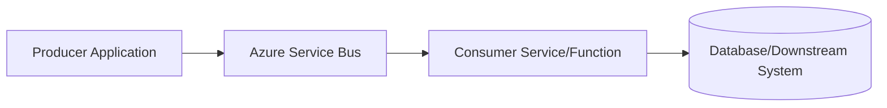
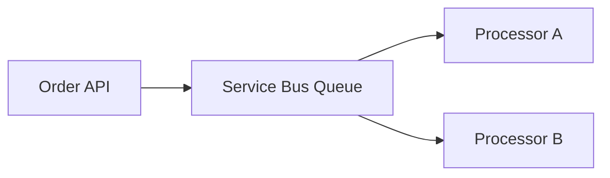
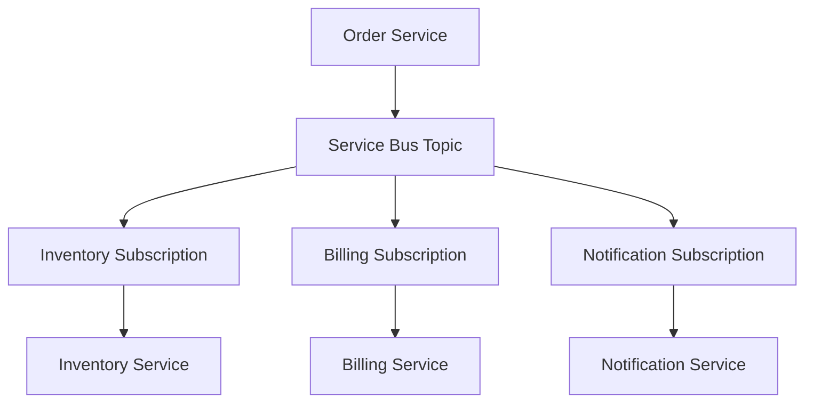
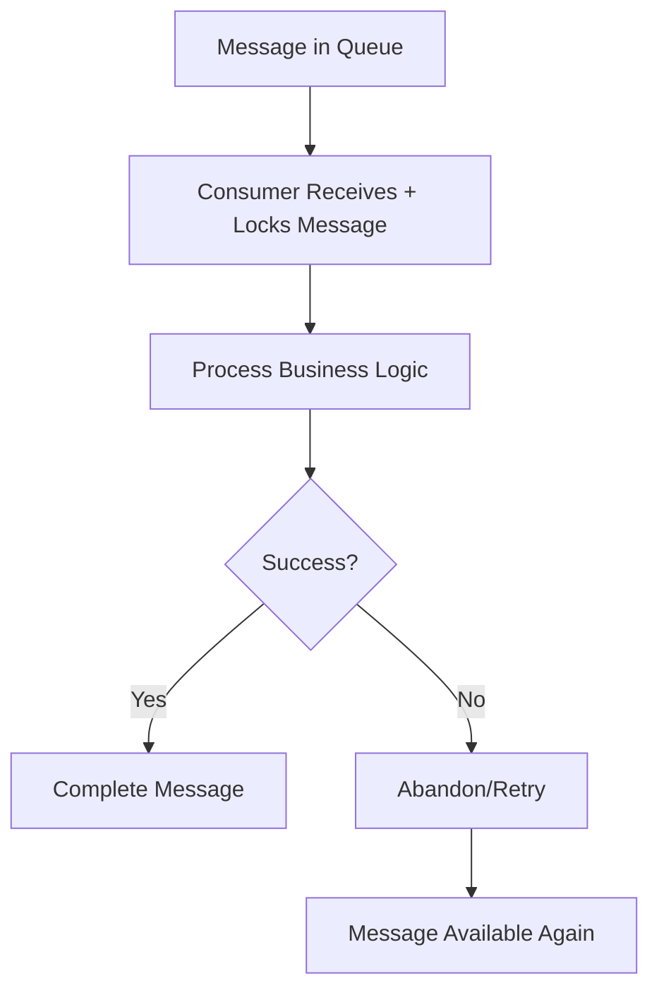
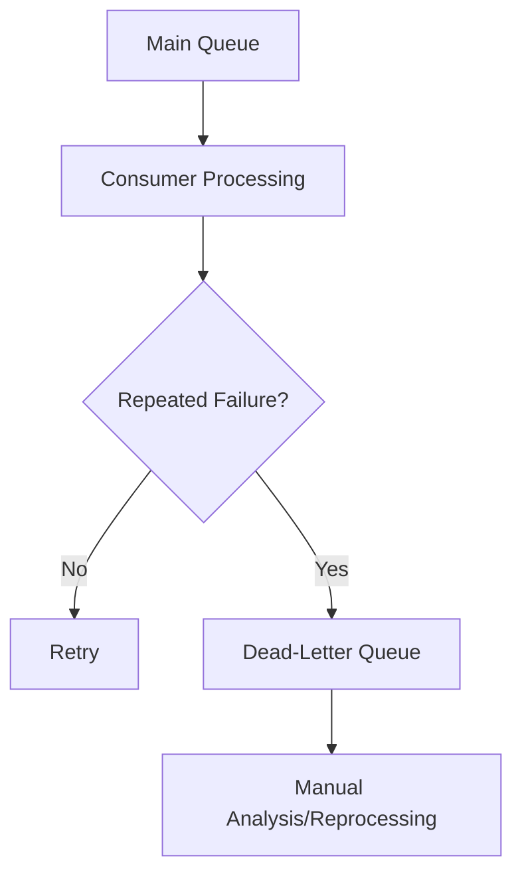
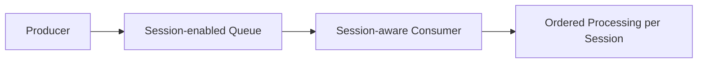
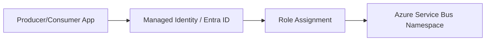
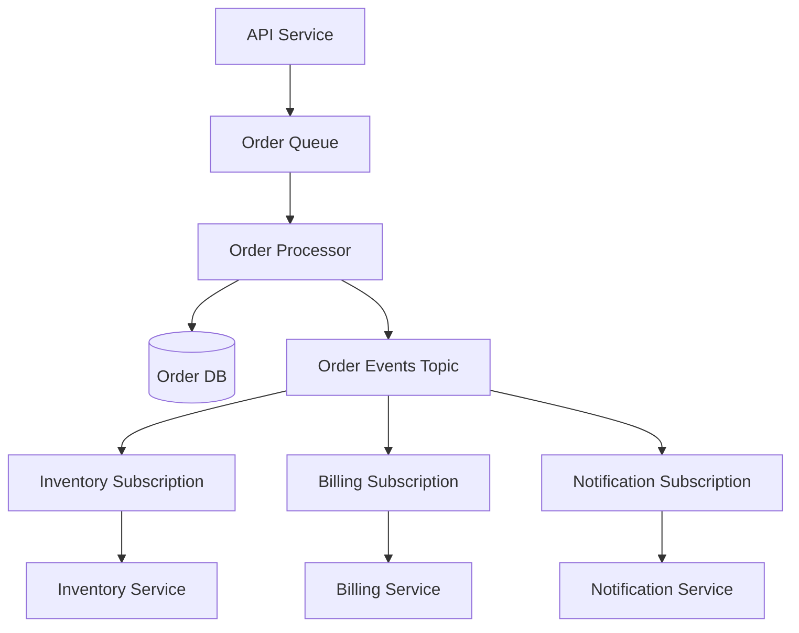
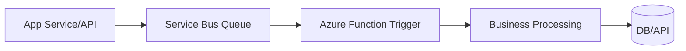

# Azure Service Bus  
## Detailed Interview Preparation Guide with Flow Charts

## 1) What is Azure Service Bus?

**Azure Service Bus** is a fully managed enterprise message broker service in Azure used for reliable, asynchronous communication between distributed applications and services.

It helps decouple producers and consumers by using durable messaging patterns such as:
- **Queues** (point-to-point messaging)
- **Topics and Subscriptions** (publish-subscribe messaging)

### Simple Interview Definition

> Azure Service Bus is a cloud messaging service that enables secure, reliable, and asynchronous communication between applications using queues and topics.

---

## 2) Why Use Azure Service Bus?

Use Service Bus when you need:
- Loose coupling between microservices
- Reliable message delivery
- Asynchronous processing
- Transactional messaging
- Ordering and duplicate detection
- Dead-letter handling
- Enterprise-grade messaging features

---

## 3) Core Messaging Flow

This pattern ensures the producer does not need to wait for consumer completion.

---

## 4) Main Components

## 4.1 Namespace
Top-level container for Service Bus entities (queues/topics).

## 4.2 Queue
Point-to-point messaging:
- One sender, one receiver pattern
- Competing consumers supported
- Each message consumed once (logical processing intent)

## 4.3 Topic
Publish-subscribe channel:
- One message can be delivered to multiple subscribers

## 4.4 Subscription
A virtual queue under a topic:
- Each subscription gets a copy of topic messages (based on rules/filters)

## 4.5 Message
Unit of data transferred via Service Bus (body + properties + metadata).

---

## 5) Queue vs Topic Flow Charts

## 5.1 Queue (Point-to-Point)

Typical use:
- Background jobs
- Order processing
- Task distribution

---

## 5.2 Topic/Subscription (Pub-Sub)

Typical use:
- Event-driven microservices
- One event to multiple downstream systems

---

## 6) Delivery and Processing Modes

## 6.1 Receive-and-Delete
- Message removed immediately when received
- Faster but risky (message loss possible if consumer crashes)

## 6.2 Peek-Lock (Most Common)
- Message locked for processing
- Consumer explicitly completes it after success
- On failure/timeout, message becomes available again

### Peek-Lock Flow

---

## 7) Dead-Letter Queue (DLQ)

Messages that cannot be processed successfully after retries can be moved to DLQ for investigation.

Interview point:
- DLQ prevents poison messages from blocking normal processing.

---

## 8) Message Ordering and Sessions

If strict order is required:
- Use **sessions**
- Messages with same session ID are processed in sequence by a single session-aware consumer

Use cases:
- Order lifecycle updates
- Workflow steps per entity
- Financial transaction chains

---

## 9) Duplicate Detection

Service Bus can detect duplicate messages (within configured window) using message ID.

Benefits:
- Prevent accidental reprocessing from producer retries
- Supports idempotent design strategies

---

## 10) Transactions

Service Bus supports transactional operations in supported scenarios:
- Send + complete atomically
- Receive + update related state patterns
- Multi-operation consistency within messaging boundary

Useful for reliable enterprise workflows.

---

## 11) Scheduled and Deferred Messages

## Scheduled Messages
Send message to be delivered at a future time.
Use cases:
- Reminders
- Delayed retries
- Time-based workflow steps

## Deferred Messages
Postpone processing of specific messages for later retrieval.
Use cases:
- Out-of-order dependency handling
- Awaiting prerequisite data

---

## 12) Security in Azure Service Bus

Use:
- Microsoft Entra ID (Azure AD) + RBAC
- Managed Identity from Azure services
- Shared Access Signatures (when required)
- Private endpoints / network restrictions
- Encryption in transit (TLS)

Security flow:

Best practice:
- Prefer managed identity over connection-string secrets.

---

## 13) Reliability and Resiliency Patterns

1. Retry with exponential backoff  
2. Idempotent consumer design  
3. Dead-letter handling workflow  
4. Circuit breaker for downstream systems  
5. Outbox pattern for producer reliability  
6. Monitoring queue depth and processing lag  

---

## 14) Throughput and Scaling Considerations

Scale strategies:
- Increase competing consumers
- Partitioning strategies (where applicable)
- Use topics for fan-out architecture
- Tune prefetch/concurrency in consumers
- Separate critical workloads into dedicated queues/topics

Monitor:
- Active message count
- Dead-letter count
- Incoming/outgoing rates
- Processing latency
- Throttling signals

---

## 15) Service Bus vs Storage Queue (Common Interview Question)

| Feature | Azure Service Bus | Azure Storage Queue |
|---|---|---|
| Messaging model | Enterprise broker | Simple queue |
| Ordering support | Sessions | Basic |
| Pub-Sub | Yes (topics/subscriptions) | No |
| Dead-letter queue | Built-in | Pattern-based/manual handling |
| Transactions | Supported in scenarios | Limited |
| Duplicate detection | Yes | No native equivalent |
| Protocol/features | Advanced | Simpler/low-cost |

Quick answer:
> Choose Service Bus for enterprise messaging features; Storage Queue for simpler lightweight queueing needs.

---

## 16) Service Bus vs Event Grid vs Event Hubs

| Service | Best For |
|---|---|
| Service Bus | Reliable enterprise commands/workflows |
| Event Grid | Event notification (“something happened”) |
| Event Hubs | High-throughput telemetry/event streaming |

Interview framing:
- Service Bus = command/business message broker
- Event Grid = reactive event routing
- Event Hubs = big data stream ingestion

---

## 17) Common Architecture Pattern (Microservices)

Benefits:
- Decoupling
- Independent scaling
- Failure isolation
- Async extensibility

---

## 18) Azure Functions + Service Bus Integration

Very common in interviews:
- Use Service Bus trigger in Azure Functions
- Function processes message asynchronously
- Complete/abandon/dead-letter based on result

---

## 19) Monitoring and Alerting

Monitor with:
- Azure Monitor
- Application Insights
- Log Analytics
- Namespace/queue/topic metrics

Alert examples:
- Queue length above threshold
- Dead-letter count spike
- Consumer failure rate increase
- Processing latency SLA breach

---

## 20) Common Interview Questions + Strong Answers

### Q1: What is Azure Service Bus?
**Answer:** A managed enterprise messaging broker enabling reliable asynchronous communication via queues and topics/subscriptions.

### Q2: Queue vs Topic?
**Answer:** Queue is point-to-point (single logical consumer outcome), topic is pub-sub (multiple subscriptions receive copies).

### Q3: What is Peek-Lock?
**Answer:** Message is locked for processing and removed only after explicit completion; supports safer processing and retries.

### Q4: Why dead-letter queue?
**Answer:** Isolates poison/unprocessable messages for investigation without blocking normal queue processing.

### Q5: When use sessions?
**Answer:** When ordered processing is required for related messages (e.g., per order/account workflow).

### Q6: Service Bus or Event Grid?
**Answer:** Service Bus for reliable business commands/workflows; Event Grid for lightweight event notifications.

### Q7: How to secure Service Bus?
**Answer:** Managed Identity + Entra RBAC, private endpoints/network controls, TLS encryption, least privilege access.

---

## 21) 60-Second Interview Pitch

> Azure Service Bus is Azure’s enterprise messaging broker for reliable asynchronous communication. It supports queues for point-to-point processing and topics/subscriptions for publish-subscribe patterns. Key capabilities include peek-lock processing, retries, dead-letter queues, sessions for ordered processing, duplicate detection, scheduling, and secure access via Entra ID and managed identity. It is ideal for decoupling microservices, improving resilience, and scaling background workflows independently.

---

## 22) Final Summary

Use Azure Service Bus when you need:
- Reliable async messaging
- Enterprise queue/topic features
- Decoupled microservices communication
- Ordered/retryable/transaction-aware workflows
- Robust failure handling with DLQ

For interview success, emphasize:
1. Queue vs Topic difference  
2. Peek-lock + DLQ reliability model  
3. Security (Managed Identity + RBAC)  
4. Comparison with Event Grid/Event Hubs/Storage Queue