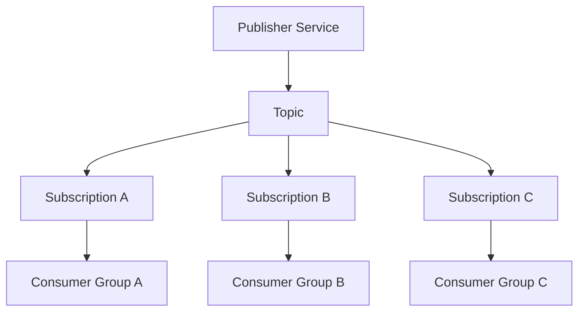
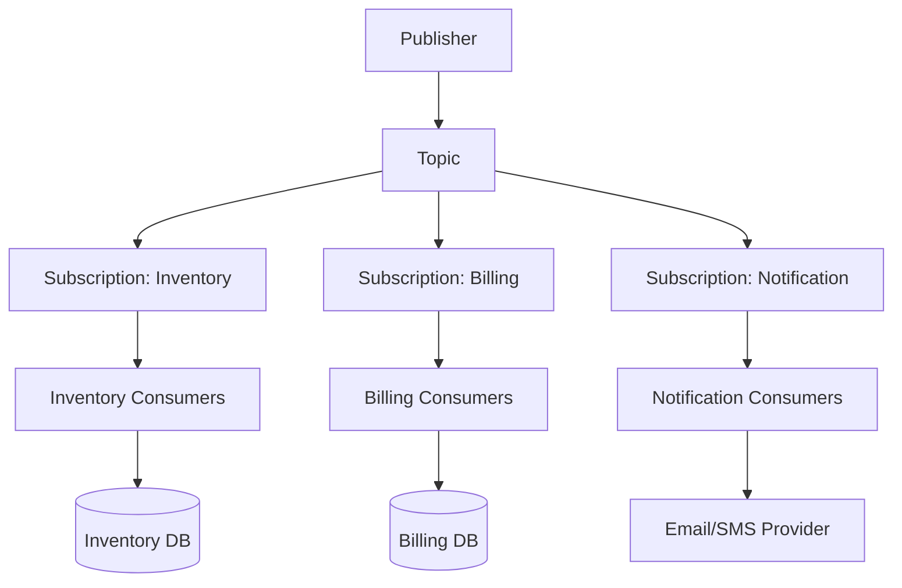
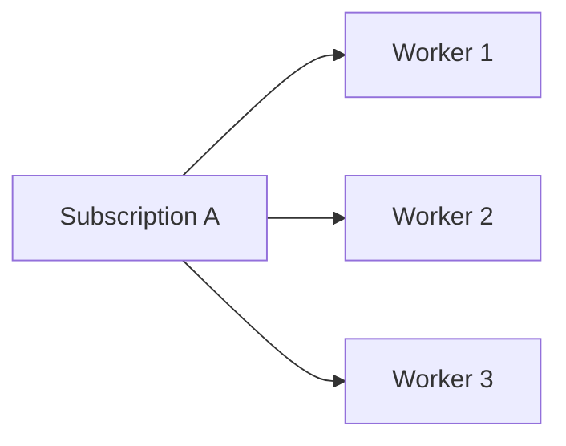
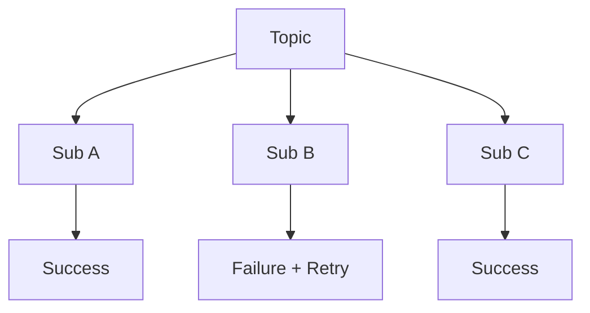
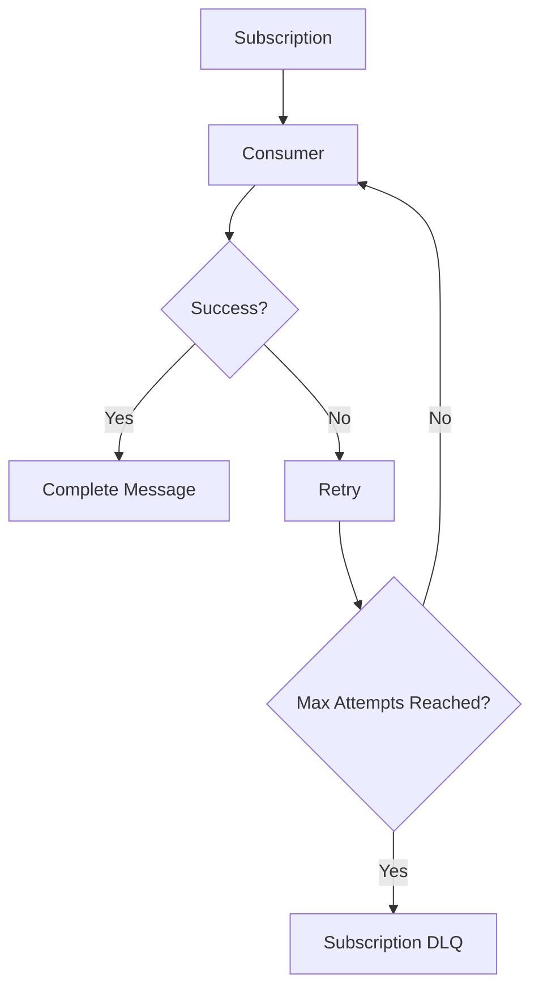
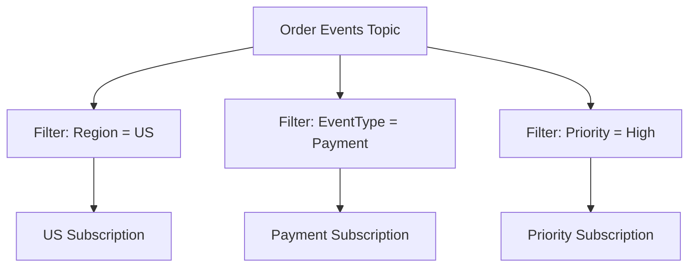
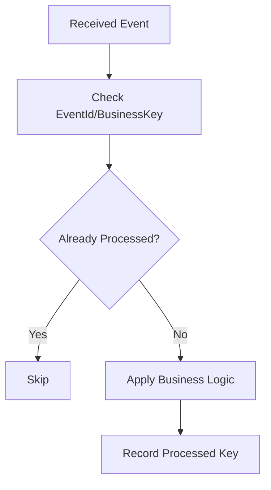
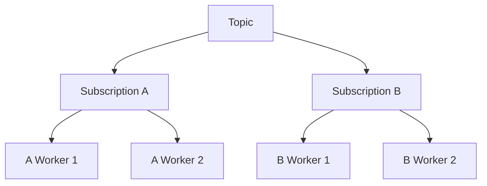
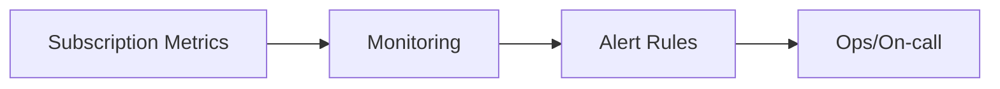
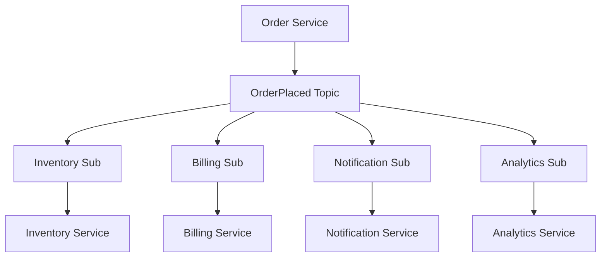

# How Do Multiple Subscribers Consume Messages?
## Detailed Interview Preparation Guide with Flow Charts

---

## 1) Direct Interview Answer

Multiple subscribers consume messages using a **publish-subscribe (pub-sub)** model where:
- A publisher sends one message/event to a **topic**
- The broker creates separate copies for each **subscription**
- Each subscription has its own consumer(s), retry lifecycle, and dead-letter handling

> One-liner: *In pub-sub, one published event fan-outs to multiple independent subscriptions, and each subscriber consumes its own copy independently.*

---

## 2) Core Pub-Sub Consumption Flow

Important:
- Consumers do **not** compete across different subscriptions
- They only compete **within** the same subscription (if scaled out)

---

## 3) Why Multiple Subscribers Are Used

Use multiple subscribers when different services need the same event for different responsibilities.

Example:
`OrderCreated` event consumed by:
- Inventory service
- Billing service
- Notification service
- Analytics service

Each service is independent and can fail/retry without blocking others.

---

## 4) Topic vs Queue Behavior (Critical Interview Point)

| Pattern | Behavior |
|---|---|
| Queue | One message processed by one logical consumer workflow |
| Topic + Subscriptions | One published message copied to each subscription |

So for “multiple subscribers need same message”, use topic/subscriptions (not one shared queue).

---

## 5) End-to-End Multi-Subscriber Flow

Each subscription can:
- Scale independently
- Retry independently
- Dead-letter independently
- Use different filtering rules

---

## 6) Consumption Inside a Single Subscription

If a subscription has multiple consumer instances:
- They are **competing consumers**
- Each message in that subscription is handled by one of those instances

This increases throughput for that subscription.

---

## 7) Independent Failure Isolation

Key point:
- Failure in SubB does not stop SubA/SubC from processing their copies.

---

## 8) Retry and Dead-Letter Per Subscription

Each subscription maintains its own delivery and failure lifecycle.

In interview terms:
> Topic fan-out creates operational independence across subscriber domains.

---

## 9) Subscription Filters (Selective Consumption)

Not every subscriber must receive every message.
Filters allow routing based on message properties.

Benefits:
- Reduce irrelevant processing
- Subscriber gets only needed events
- Cleaner domain boundaries

---

## 10) Message Ordering Considerations

By default:
- Ordering is usually per subscription delivery semantics, not global cross-subscriber ordering

If strict ordering is required within a subscription:
- Use session/partition-aware strategies (technology-specific)
- Keep same key routed consistently
- Control concurrency for ordered entities

---

## 11) Idempotency for Subscribers (Must Mention)

Because retries/redeliveries can occur:
- Each subscriber must be idempotent
- Duplicate events should not create duplicate side effects

Every subscriber should implement this independently.

---

## 12) Scaling Model for Multiple Subscribers

Two scaling axes:
1. Add more subscriptions (new consumer domains)
2. Scale consumers inside each subscription

This supports both functional growth and throughput growth.

---

## 13) Monitoring Multi-Subscriber Systems

Track per subscription:
- Backlog depth
- Oldest message age
- Retry count
- Dead-letter count
- Processing latency
- Consumer health

Interview point:
> Always monitor per-subscription health, not just topic-level ingress.

---

## 14) Security Model

Use:
- Managed identity / Entra ID
- RBAC scoped per subscription consumer
- Network restrictions/private endpoints where needed
- Least privilege

Different subscriber apps can have different authorization scopes.

---

## 15) Common Real-World Pattern

Event: `OrderPlaced`
Subscribers:
- Inventory reserves stock
- Billing authorizes payment
- Notification sends confirmation
- Analytics updates KPIs

---

## 16) Common Mistakes (Interview Gold)

1. Using one queue when multiple independent consumers need same message  
2. Assuming subscriber failure blocks all others  
3. No per-subscription monitoring  
4. Ignoring idempotency in each subscriber  
5. Over-broadcasting without filters (noise/event overload)  
6. No versioning strategy for event contracts  

---

## 17) Interview Q&A (Strong Answers)

### Q1: How do multiple subscribers consume one message?
**Answer:** Publisher sends to topic; broker copies message to each subscription; each subscriber consumes its own copy independently.

### Q2: Do subscribers compete with each other?
**Answer:** Different subscriptions do not compete. Consumers compete only within the same subscription when scaled out.

### Q3: Can one subscriber fail while others succeed?
**Answer:** Yes. Each subscription has independent retry and DLQ lifecycle.

### Q4: How do you send only specific events to certain subscribers?
**Answer:** Use subscription filters based on message properties.

### Q5: What reliability practice is essential for subscribers?
**Answer:** Idempotent processing to handle duplicates and retries safely.

---

## 18) 60-Second Interview Pitch

> Multiple subscribers consume messages through a pub-sub pattern. A publisher sends one event to a topic, and the broker fan-outs that event into separate subscriptions. Each subscription has independent consumers, scaling, retry policies, and dead-letter handling. Consumers within a subscription can scale using competing workers, while cross-subscription processing remains isolated. I also apply filters so subscribers get only relevant events, and implement idempotency in every subscriber to handle duplicates safely.

---

## 19) Final Checklist

- [ ] Use topic/subscription for fan-out use case  
- [ ] Ensure each subscriber owns independent processing  
- [ ] Configure retries + DLQ per subscription  
- [ ] Implement idempotency in each subscriber  
- [ ] Add filters for selective routing  
- [ ] Monitor backlog/retries/DLQ per subscription  
- [ ] Scale consumers per subscription as needed  

---

## One-Line Conclusion

> Multiple subscribers consume messages by receiving independent copies from topic subscriptions, each with its own processing, scaling, and failure-handling lifecycle.