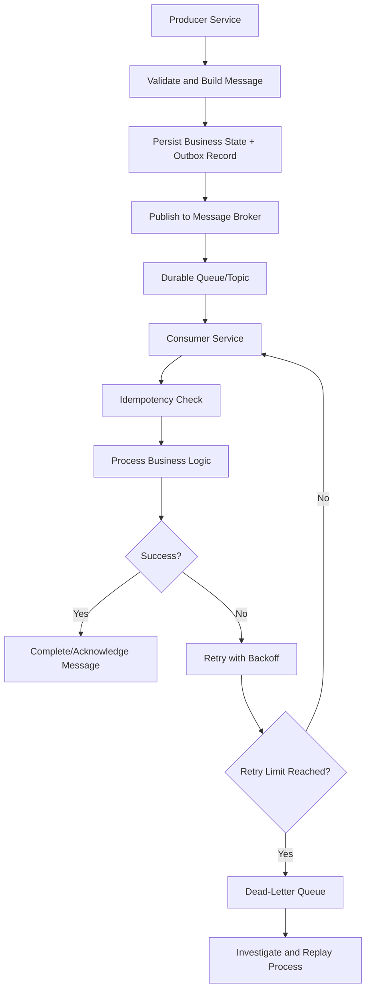
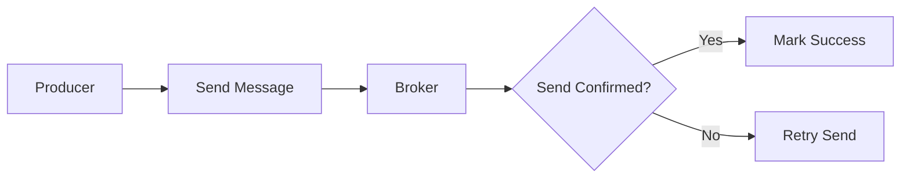
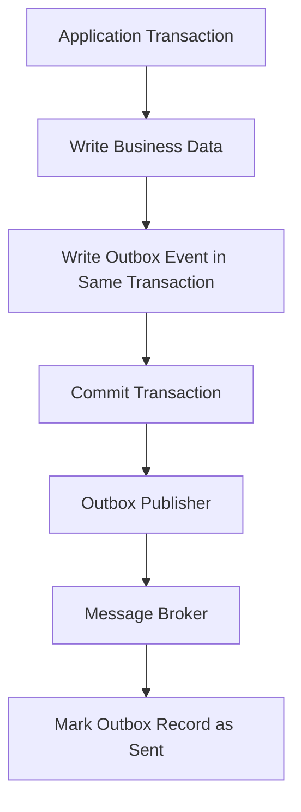
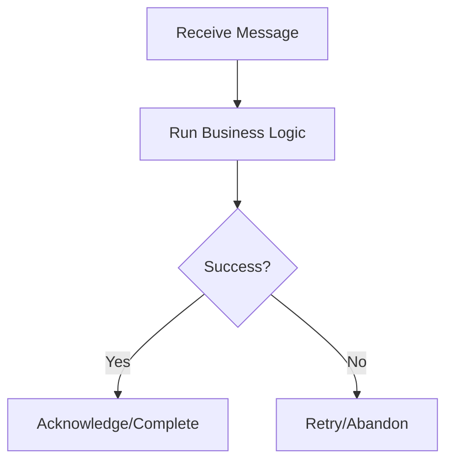
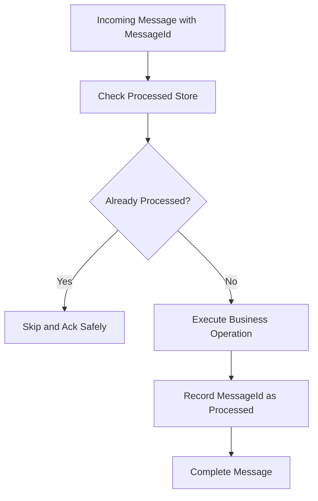
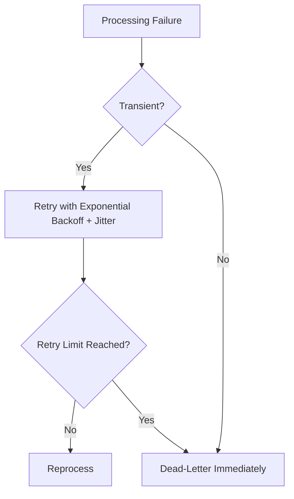
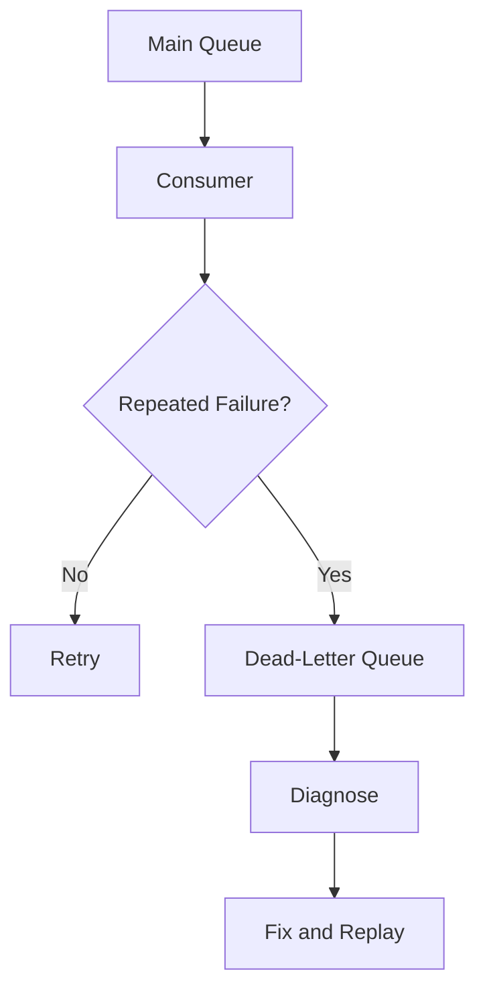
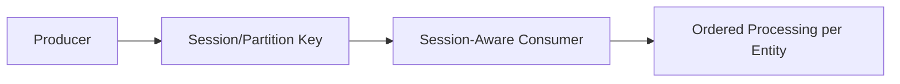
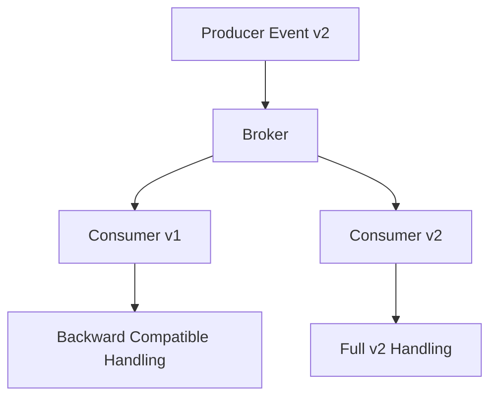
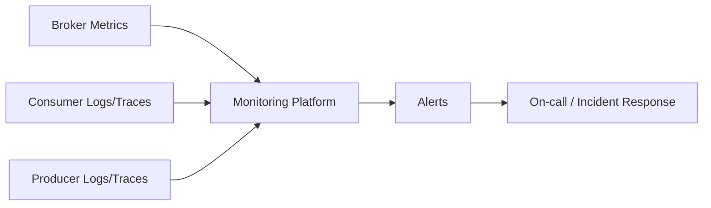

# How Do You Ensure Message Reliability?
## Detailed Interview Preparation Guide with Flow Charts

---

## 1. Direct Interview Answer

To ensure message reliability in distributed systems, combine:

1. **Durable messaging infrastructure**  
2. **At-least-once delivery handling**  
3. **Idempotent consumers**  
4. **Retries with backoff and jitter**  
5. **Dead-letter queue strategy**  
6. **Transactional or outbox publishing patterns**  
7. **Ordering and concurrency controls where required**  
8. **Observability, alerting, and replay processes**

> **Interview one-liner:**  
> Message reliability is achieved by designing for failures explicitly—durable brokers, safe retries, idempotent processing, dead-letter handling, and strong monitoring.

---

## 2. Why Message Reliability Matters

Distributed systems can fail at many points:

- Network interruptions
- Consumer crashes
- Broker unavailability
- Duplicate deliveries
- Out-of-order events
- Partial database failures
- Timeout-based retries
- Dependency throttling
- Deployment restarts

Without reliability patterns, these failures cause:

- Lost messages
- Duplicate business actions
- Inconsistent state
- Queue backlogs
- Operational incidents
- Data integrity issues

---

# 3. End-to-End Reliable Messaging Flow

---

# 4. Reliability Guarantees: What to Say in Interviews

Most brokers provide **at-least-once delivery** behavior in practical production use.

That means:

- A message may be delivered more than once.
- A message should not be silently lost when configured correctly.
- Consumers must handle duplicates safely.

### Important Interview Statement

> I design consumers assuming at-least-once delivery and possible duplicates. I never assume exactly-once business processing unless I have explicit end-to-end safeguards.

---

# 5. Core Reliability Pillars

## 5.1 Durable Storage

Messages must be stored durably by the broker before acknowledgment to producers.

Use:
- Durable queues/topics
- Replication/high availability options
- Appropriate retention settings

## 5.2 Producer Reliability

Producer should not “fire and forget” without confirmation.

Use:
- Confirmed sends/acknowledgment from broker
- Retry for transient send failures
- Circuit breaker and timeout policies
- Outbox pattern for database + message consistency

## 5.3 Consumer Reliability

Consumers must process safely under retries and duplicates.

Use:
- Explicit completion/acknowledgment after successful processing
- Idempotency keys
- Retry policies
- Dead-lettering on permanent failures

## 5.4 Operational Reliability

Use:
- Monitoring and alerting
- Backlog thresholds
- DLQ monitoring
- Replay runbooks
- Chaos/failure testing

---

# 6. Producer Reliability Patterns

## 6.1 Confirmed Send

## 6.2 Outbox Pattern (Very Important)

Problem:
- Database update succeeds, but message publish fails.
- Or message publishes, but DB transaction fails.

Outbox pattern solves this by storing message in DB transaction first, then reliably publishing.

### Interview Statement

> I use the outbox pattern to avoid dual-write inconsistency between database state and message publication.

---

# 7. Consumer Reliability Patterns

## 7.1 Ack After Success

Consumer should acknowledge/complete only after full business success.

## 7.2 Idempotent Consumer

Ensure duplicate deliveries do not create duplicate business effects.

Idempotency methods:
- Unique message ID tracking table
- Business key constraints
- Upsert semantics
- Version checks
- State transition validation

---

# 8. Retry Strategy

Retries should handle **transient failures**, not permanent invalid data.

## Recommended Retry Model
- Exponential backoff
- Random jitter
- Max retry count
- Error classification (transient vs permanent)

---

# 9. Dead-Letter Queue Strategy

A DLQ isolates poison messages that repeatedly fail.

Use DLQ for:
- Invalid payloads
- Schema mismatch
- Permanent business-rule violations
- Exceeded retry count
- Expired messages

Interview point:
> DLQ prevents one bad message from blocking healthy throughput.

---

# 10. Ordering Reliability

If business requires ordering:
- Use partition/session keys
- Route related messages consistently
- Limit concurrency per key/session
- Handle redelivery with ordering rules

If global ordering is not required, prefer parallelism for throughput.

---

# 11. Exactly-Once vs Effectively-Once

“Exactly-once delivery” is difficult end-to-end across distributed boundaries.

Practical approach:
- At-least-once delivery + idempotent processing = effectively-once business outcome

### Interview phrase

> I optimize for effectively-once business results using idempotency, deduplication, and transactional state changes.

---

# 12. Schema and Contract Reliability

Message contract evolution can break consumers.

Use:
- Versioned event schemas
- Backward compatibility strategy
- Consumer tolerance for unknown fields
- Schema registry/contract testing where relevant

---

# 13. Security and Reliability Connection

Security failures can appear as reliability failures.

Use:
- Managed identity / strong auth
- RBAC least privilege
- Secret rotation
- TLS in transit
- Private endpoints/network controls

Unauthorized access issues, token expiry, or blocked network routes can cause message processing failures; monitor them as reliability signals too.

---

# 14. Observability for Message Reliability

Track key metrics:
- Publish success/failure rate
- Queue/topic depth
- Message age
- Consumer lag
- Retry count
- Dead-letter count
- Processing latency (P95/P99)
- Duplicate detection rate
- Replay success rate

---

# 15. Reliability Runbook (Ops Perspective)

When reliability degrades:
1. Check backlog and message age
2. Check consumer health and recent deployments
3. Inspect retry spikes and DLQ growth
4. Identify top error categories
5. Fix root cause (code/config/dependency)
6. Replay safe messages from DLQ
7. Validate recovery and close incident
8. Add preventive controls

---

# 16. Failure Scenarios and Handling

## Scenario A: Consumer crash after DB update before ack
Risk: duplicate reprocessing

Mitigation:
- Idempotent consumer + dedup tracking
- Transactional state updates

## Scenario B: Producer DB commit succeeds, publish fails
Risk: missed message

Mitigation:
- Outbox pattern

## Scenario C: Downstream API temporary timeout
Risk: transient failures

Mitigation:
- Retry with backoff + circuit breaker

## Scenario D: Invalid message schema
Risk: infinite retry loop

Mitigation:
- Validation + dead-letter

---

# 17. Reliability in Azure Context (Interview-Ready)

For Azure messaging stacks (e.g., Service Bus + Functions), mention:
- Peek-lock style processing
- Max delivery count
- DLQ
- Idempotent function handlers
- Application Insights + Azure Monitor alerts
- Managed identity and RBAC
- Replay tooling/process

---

# 18. Common Anti-Patterns

1. Auto-ack before processing completion  
2. Infinite retries without DLQ  
3. No idempotency handling  
4. No correlation IDs for tracing  
5. Tight coupling between producer and consumer availability  
6. Dual-write without outbox  
7. Ignoring backlog/age monitoring  
8. Replaying DLQ blindly without root-cause fix  

---

# 19. Interview Q&A (Strong Answers)

### Q1: How do you prevent message loss?
**Answer:** Use durable broker entities, confirmed sends, and outbox pattern for producer-side consistency.

### Q2: How do you handle duplicate messages?
**Answer:** Implement idempotent consumers using message IDs/business keys and dedup persistence.

### Q3: How do you manage transient failures?
**Answer:** Retry with exponential backoff and jitter, with max retry limits and circuit breaker policies.

### Q4: What is DLQ’s role in reliability?
**Answer:** It isolates poison/permanent-failure messages so normal processing continues and failed messages are recoverable.

### Q5: How do you ensure end-to-end consistency between DB and message publish?
**Answer:** Use outbox pattern (or equivalent transactional messaging strategy).

### Q6: Is exactly-once delivery guaranteed?
**Answer:** Usually no end-to-end; design for at-least-once with idempotency to achieve effectively-once business outcomes.

---

# 20. 60-Second Interview Pitch

> I ensure message reliability by designing for failure from the start. On the producer side, I use durable broker entities, confirmed sends, and often the outbox pattern to avoid dual-write inconsistencies. On the consumer side, I acknowledge messages only after successful processing, implement idempotency for duplicate deliveries, and use retries with exponential backoff for transient faults. Permanent failures go to a dead-letter queue for controlled investigation and replay. I also monitor backlog, message age, retries, and DLQ growth with alerts and runbooks. This approach delivers effectively-once business outcomes on top of at-least-once messaging semantics.

---

# 21. Final Reliability Checklist

- [ ] Durable queue/topic configuration enabled  
- [ ] Producer send confirmation handled  
- [ ] Outbox pattern used where needed  
- [ ] Consumer ack only after successful processing  
- [ ] Idempotency strategy implemented  
- [ ] Retry with backoff + jitter configured  
- [ ] Max retry + DLQ policy configured  
- [ ] Schema/version compatibility strategy defined  
- [ ] Monitoring and alerts for lag/retries/DLQ in place  
- [ ] Replay process documented and tested  

---

## Best One-Line Conclusion

> Reliable messaging is achieved through durable transport, safe retries, idempotent consumers, dead-letter handling, and strong operational observability with tested recovery workflows.